# Assignments Workflow

<cite>
**Referenced Files in This Document**   
- [20260105082224_create_assignments_table.sql](file://supabase/migrations/20260105082224_create_assignments_table.sql)
- [20260108112143_performance_indexes.sql](file://supabase/migrations/20260108112143_performance_indexes.sql)
- [create-quiz/route.ts](file://app/api/teacher/create-quiz/route.ts)
- [submit/route.ts](file://app/api/assignments/submit/route.ts)
- [grade/route.ts](file://app/api/assignments/grade/route.ts)
- [page.tsx](file://app/student/assignments/page.tsx)
- [page.tsx](file://app/teacher/assignments/page.tsx)
- [database.types.ts](file://lib/database.types.ts)
- [database-helpers.ts](file://lib/database-helpers.ts)
- [teacher-assignment-manager.tsx](file://components/teacher-assignment-manager.tsx)
</cite>

## Table of Contents
1. [Introduction](#introduction)
2. [Database Schema](#database-schema)
3. [Assignment Lifecycle](#assignment-lifecycle)
4. [Role-Based Access Control](#role-based-access-control)
5. [Submission Workflow](#submission-workflow)
6. [Grading Workflow](#grading-workflow)
7. [Performance Optimization](#performance-optimization)
8. [Frontend Implementation](#frontend-implementation)
9. [Conclusion](#conclusion)

## Introduction
The Assignments Workflow in the School Management System provides a comprehensive solution for managing academic assignments throughout their lifecycle. This documentation details the complete workflow from assignment creation to submission and grading, covering the database schema, access controls, business logic, and user interfaces. The system supports teachers in creating and managing assignments while enabling students to submit their work and receive feedback.

## Database Schema

### Assignments Table
The assignments table serves as the central entity for managing academic assignments with the following schema:

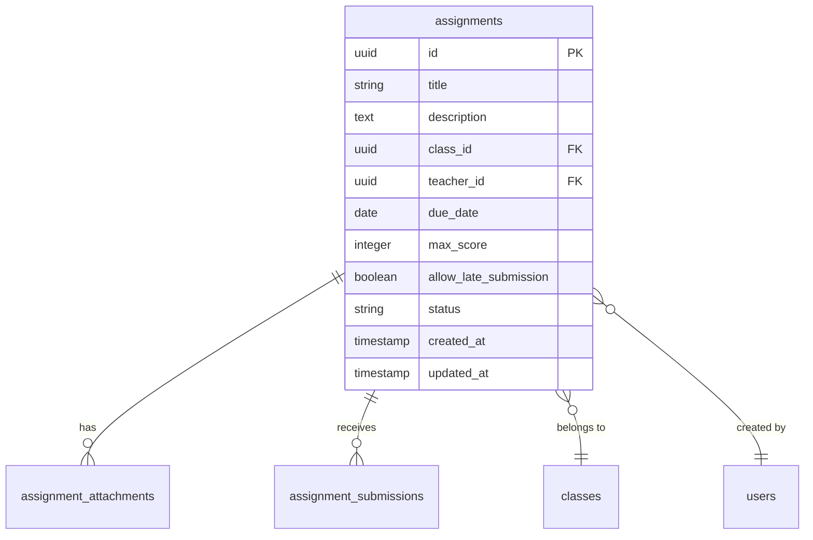

**Diagram sources**
- [20260105082224_create_assignments_table.sql](file://supabase/migrations/20260105082224_create_assignments_table.sql#L2-L14)
- [database.types.ts](file://lib/database.types.ts#L157-L196)

**Section sources**
- [20260105082224_create_assignments_table.sql](file://supabase/migrations/20260105082224_create_assignments_table.sql#L2-L14)
- [database.types.ts](file://lib/database.types.ts#L157-L196)

### Assignment Attachments Table
The assignment_attachments table stores supporting materials for assignments with the following structure:

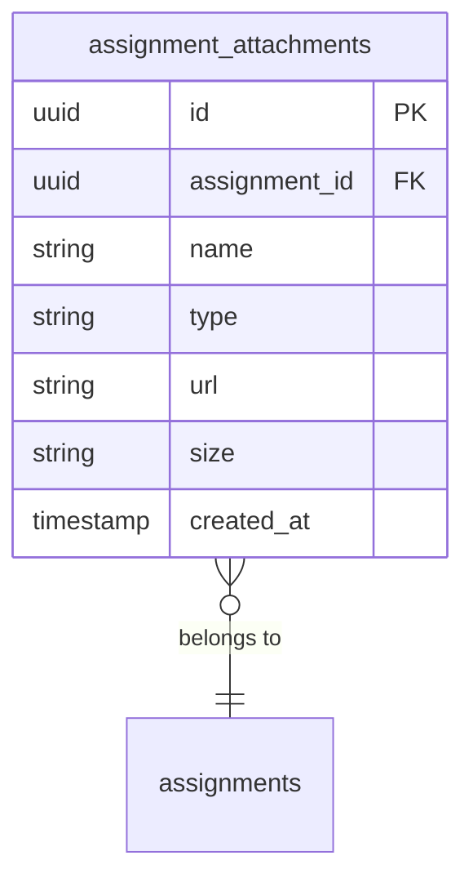

**Diagram sources**
- [20260105082224_create_assignments_table.sql](file://supabase/migrations/20260105082224_create_assignments_table.sql#L17-L25)
- [database.types.ts](file://lib/database.types.ts#L58-L85)

**Section sources**
- [20260105082224_create_assignments_table.sql](file://supabase/migrations/20260105082224_create_assignments_table.sql#L17-L25)
- [database.types.ts](file://lib/database.types.ts#L58-L85)

### Assignment Submissions Table
The assignment_submissions table tracks student submissions with comprehensive status tracking:

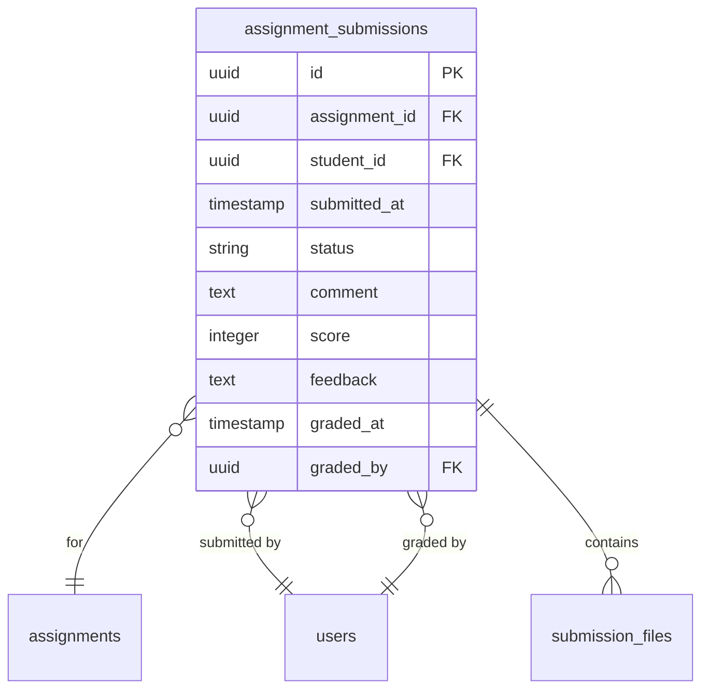

**Diagram sources**
- [20260105082224_create_assignments_table.sql](file://supabase/migrations/20260105082224_create_assignments_table.sql#L28-L40)
- [database.types.ts](file://lib/database.types.ts#L96-L155)

**Section sources**
- [20260105082224_create_assignments_table.sql](file://supabase/migrations/20260105082224_create_assignments_table.sql#L28-L40)
- [database.types.ts](file://lib/database.types.ts#L96-L155)

### Submission Files Table
The submission_files table manages uploaded student work with secure access controls:

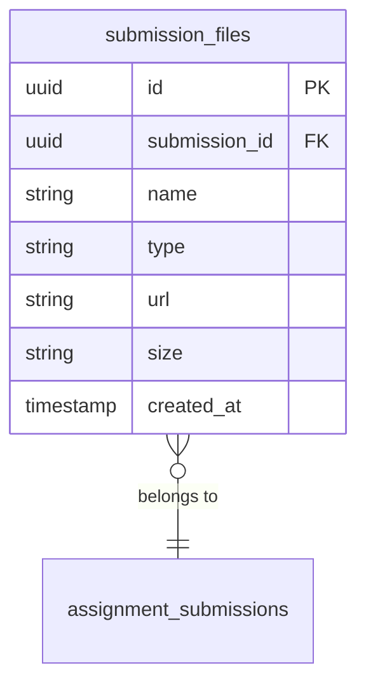

**Diagram sources**
- [20260105082224_create_assignments_table.sql](file://supabase/migrations/20260105082224_create_assignments_table.sql#L43-L51)
- [database.types.ts](file://lib/database.types.ts#L133-L155)

**Section sources**
- [20260105082224_create_assignments_table.sql](file://supabase/migrations/20260105082224_create_assignments_table.sql#L43-L51)
- [database.types.ts](file://lib/database.types.ts#L133-L155)

## Assignment Lifecycle

### Status Transitions
The assignment lifecycle is managed through a state machine with three primary states:

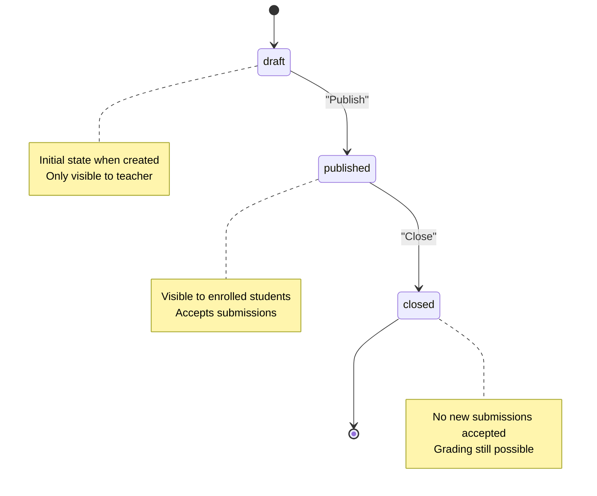

**Diagram sources**
- [20260105082224_create_assignments_table.sql](file://supabase/migrations/20260105082224_create_assignments_table.sql#L11)
- [database.types.ts](file://lib/database.types.ts#L166)

**Section sources**
- [20260105082224_create_assignments_table.sql](file://supabase/migrations/20260105082224_create_assignments_table.sql#L11)
- [database.types.ts](file://lib/database.types.ts#L166)

### Creation Process
The assignment creation process follows a structured workflow:

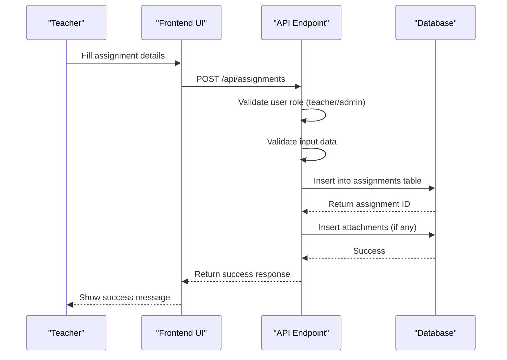

**Diagram sources**
- [20260105082224_create_assignments_table.sql](file://supabase/migrations/20260105082224_create_assignments_table.sql#L68-L75)
- [database.types.ts](file://lib/database.types.ts#L171-L183)

**Section sources**
- [20260105082224_create_assignments_table.sql](file://supabase/migrations/20260105082224_create_assignments_table.sql#L68-L75)
- [database.types.ts](file://lib/database.types.ts#L171-L183)

## Role-Based Access Control

### Row Level Security Policies
The system implements comprehensive Row Level Security (RLS) policies to enforce role-based access:

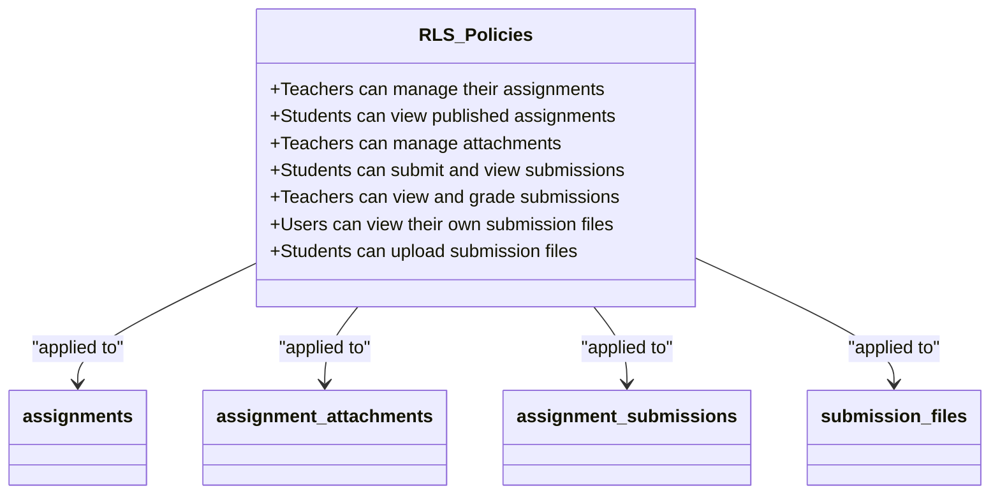

**Diagram sources**
- [20260105082224_create_assignments_table.sql](file://supabase/migrations/20260105082224_create_assignments_table.sql#L59-L116)
- [database.types.ts](file://lib/database.types.ts#L197-L212)

**Section sources**
- [20260105082224_create_assignments_table.sql](file://supabase/migrations/20260105082224_create_assignments_table.sql#L59-L116)
- [database.types.ts](file://lib/database.types.ts#L197-L212)

### Access Matrix
The following table summarizes the access permissions for different user roles:

| Resource | Teacher Access | Student Access | Admin Access |
|---------|---------------|---------------|-------------|
| **Create Assignment** | Yes | No | Yes |
| **View Own Assignments** | Yes | Draft: No<br>Published: Yes | Yes |
| **Manage Attachments** | Yes | View Only | Yes |
| **Submit Assignment** | No | Yes | No |
| **View Submissions** | Own Students: Yes<br>Others: No | Own: Yes<br>Others: No | Yes |
| **Grade Submissions** | Yes | No | Yes |
| **View Submission Files** | Yes | Own: Yes<br>Others: No | Yes |

**Section sources**
- [20260105082224_create_assignments_table.sql](file://supabase/migrations/20260105082224_create_assignments_table.sql#L59-L116)
- [database.types.ts](file://lib/database.types.ts#L197-L212)

## Submission Workflow

### Submission Process
The student submission workflow ensures data integrity and proper validation:

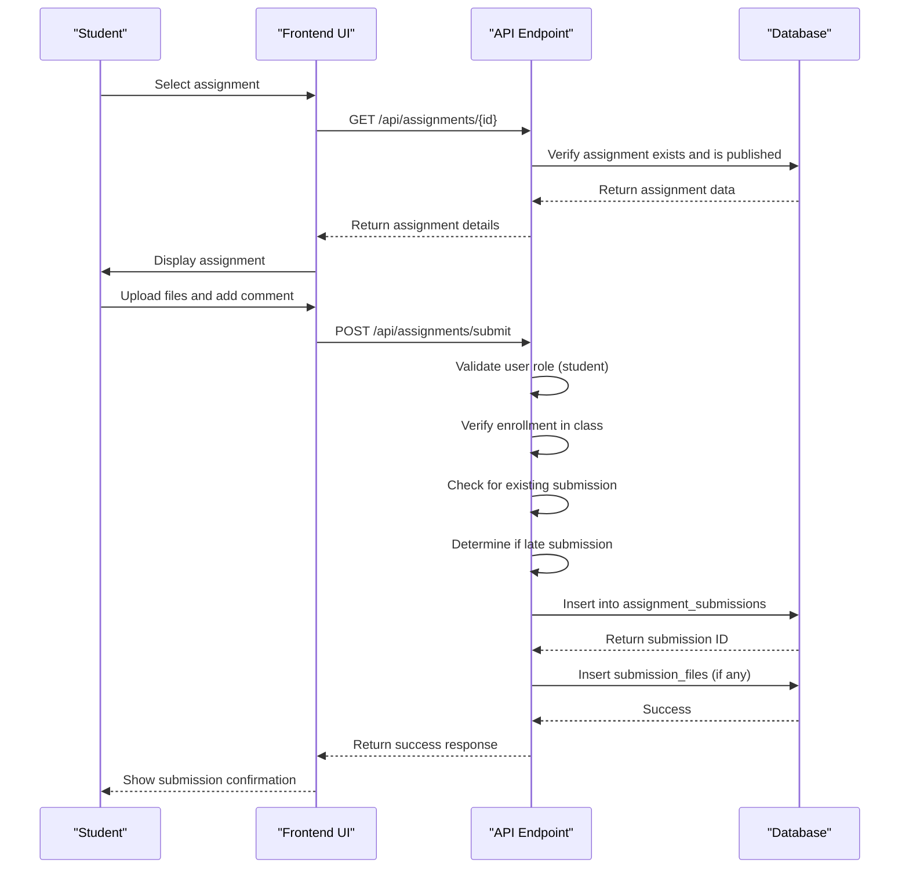

**Diagram sources**
- [submit/route.ts](file://app/api/assignments/submit/route.ts#L40-L138)
- [20260105082224_create_assignments_table.sql](file://supabase/migrations/20260105082224_create_assignments_table.sql#L86-L87)

**Section sources**
- [submit/route.ts](file://app/api/assignments/submit/route.ts#L40-L138)
- [20260105082224_create_assignments_table.sql](file://supabase/migrations/20260105082224_create_assignments_table.sql#L86-L87)

### Late Submission Logic
The system implements flexible late submission handling based on assignment configuration:

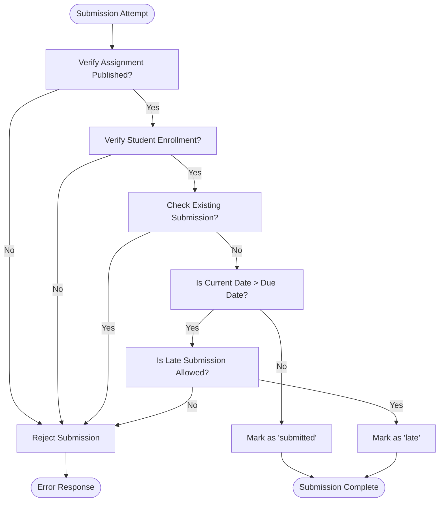

**Diagram sources**
- [submit/route.ts](file://app/api/assignments/submit/route.ts#L105-L108)
- [20260105082224_create_assignments_table.sql](file://supabase/migrations/20260105082224_create_assignments_table.sql#L33)

**Section sources**
- [submit/route.ts](file://app/api/assignments/submit/route.ts#L105-L108)
- [20260105082224_create_assignments_table.sql](file://supabase/migrations/20260105082224_create_assignments_table.sql#L33)

## Grading Workflow

### Grading Process
The grading workflow enables teachers to evaluate student submissions efficiently:

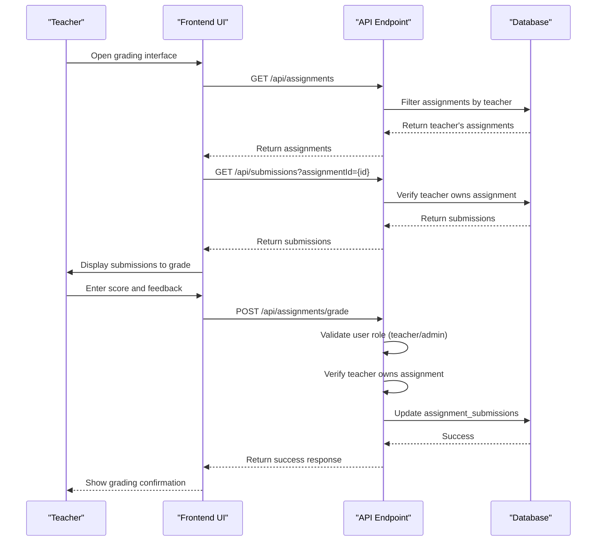

**Diagram sources**
- [grade/route.ts](file://app/api/assignments/grade/route.ts#L5-L42)
- [teacher-assignment-manager.tsx](file://components/teacher-assignment-manager.tsx#L111-L123)

**Section sources**
- [grade/route.ts](file://app/api/assignments/grade/route.ts#L5-L42)
- [teacher-assignment-manager.tsx](file://components/teacher-assignment-manager.tsx#L111-L123)

### Submission Status Transitions
The submission status evolves through the grading process:

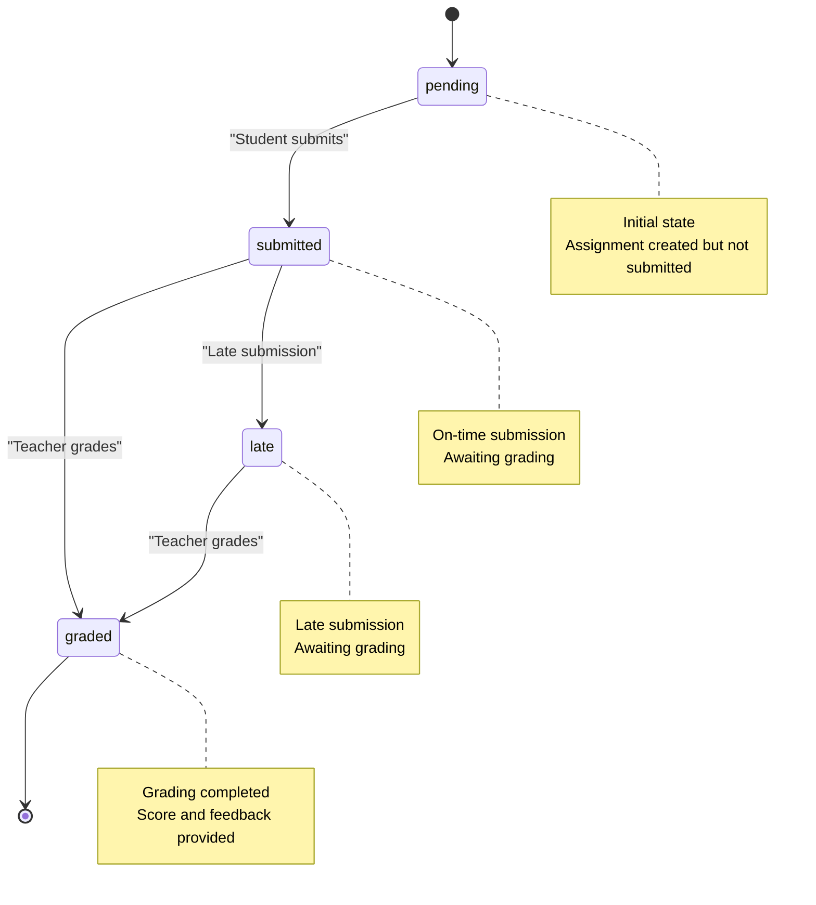

**Diagram sources**
- [20260105082224_create_assignments_table.sql](file://supabase/migrations/20260105082224_create_assignments_table.sql#L33)
- [database.types.ts](file://lib/database.types.ts#L105)

**Section sources**
- [20260105082224_create_assignments_table.sql](file://supabase/migrations/20260105082224_create_assignments_table.sql#L33)
- [database.types.ts](file://lib/database.types.ts#L105)

## Performance Optimization

### Database Indexing Strategy
The system implements targeted indexing to optimize query performance:

```mermaid
erDiagram
assignments {
uuid id PK
string title
uuid class_id FK
uuid teacher_id FK
date due_date
string status
}
assignment_submissions {
uuid id PK
uuid assignment_id FK
uuid student_id FK
timestamp submitted_at
string status
}
assignments ||--o{ assignment_submissions : "1:N"
classIndex["idx_assignments_class_due(class_id, due_date DESC)"]
teacherIndex["idx_assignments_teacher(teacher_id, created_at DESC)"]
submissionAssignmentIndex["idx_submissions_assignment(assignment_id, submitted_at DESC)"]
submissionStudentIndex["idx_submissions_student(student_id, submitted_at DESC)"]
assignments --> classIndex
assignments --> teacherIndex
assignment_submissions --> submissionAssignmentIndex
assignment_submissions --> submissionStudentIndex
```

**Diagram sources**
- [20260108112143_performance_indexes.sql](file://supabase/migrations/20260108112143_performance_indexes.sql#L58-L63)
- [20260105082224_create_assignments_table.sql](file://supabase/migrations/20260105082224_create_assignments_table.sql#L119-L122)

**Section sources**
- [20260108112143_performance_indexes.sql](file://supabase/migrations/20260108112143_performance_indexes.sql#L58-L63)
- [20260105082224_create_assignments_table.sql](file://supabase/migrations/20260105082224_create_assignments_table.sql#L119-L122)

### Index Usage Scenarios
The following table outlines the primary use cases for each index:

| Index Name | Columns | Primary Use Case | Query Pattern |
|------------|--------|------------------|---------------|
| idx_assignments_class_due | class_id, due_date DESC | Student assignment listing | Get assignments for a specific class ordered by due date |
| idx_assignments_teacher | teacher_id, created_at DESC | Teacher assignment management | Get assignments created by a specific teacher ordered by creation date |
| idx_submissions_assignment | assignment_id, submitted_at DESC | Assignment grading | Get all submissions for a specific assignment ordered by submission time |
| idx_submissions_student | student_id, submitted_at DESC | Student submission history | Get all submissions by a specific student ordered by submission time |

**Section sources**
- [20260108112143_performance_indexes.sql](file://supabase/migrations/20260108112143_performance_indexes.sql#L58-L63)
- [20260105082224_create_assignments_table.sql](file://supabase/migrations/20260105082224_create_assignments_table.sql#L119-L122)

## Frontend Implementation

### Student Assignment Interface
The student assignment interface provides a streamlined experience for viewing and submitting assignments:

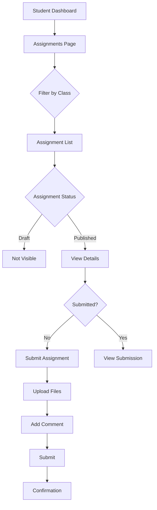

**Diagram sources**
- [page.tsx](file://app/student/assignments/page.tsx#L9-L67)
- [assignment-list.tsx](file://components/assignment-list.tsx)

**Section sources**
- [page.tsx](file://app/student/assignments/page.tsx#L9-L67)

### Teacher Assignment Management
The teacher interface enables comprehensive assignment management and grading:

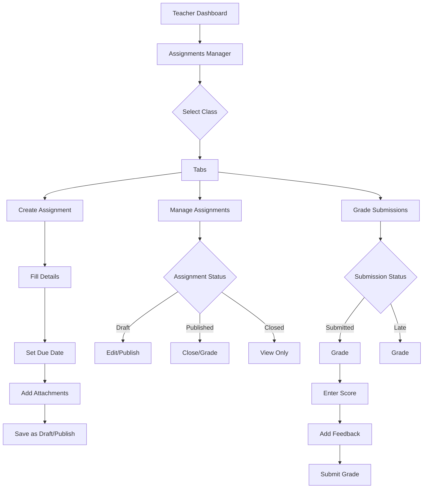

**Diagram sources**
- [page.tsx](file://app/teacher/assignments/page.tsx)
- [teacher-assignment-manager.tsx](file://components/teacher-assignment-manager.tsx#L52-L378)

**Section sources**
- [teacher-assignment-manager.tsx](file://components/teacher-assignment-manager.tsx#L52-L378)

## Conclusion
The Assignments Workflow in the School Management System provides a robust and secure solution for managing academic assignments. The system's architecture combines a well-designed database schema with comprehensive Row Level Security policies to ensure proper access control. The workflow supports the complete lifecycle of assignments from creation to grading, with special attention to performance optimization through strategic indexing. Teachers can efficiently create and manage assignments while students can submit their work with confidence in the system's reliability. The implementation demonstrates best practices in web application development, including proper input validation, role-based access control, and efficient data retrieval patterns.