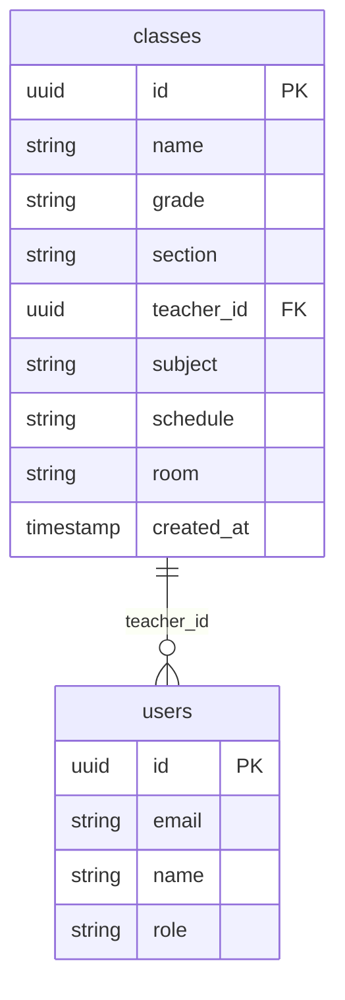
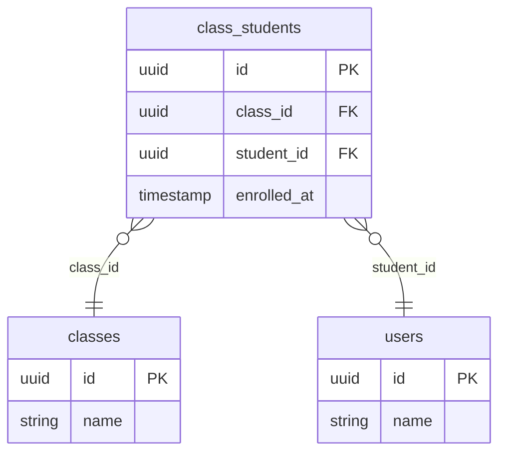
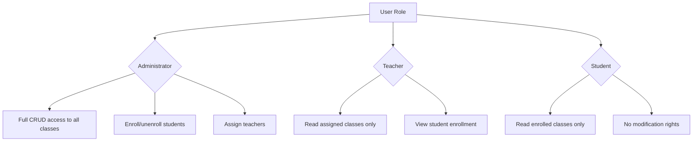
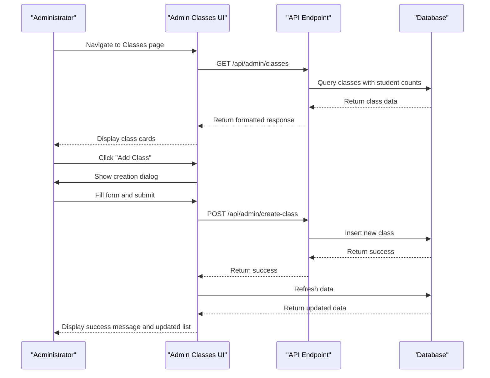
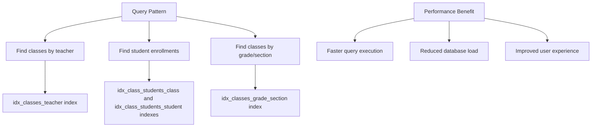

# Classes Management

<cite>
**Referenced Files in This Document**   
- [20251219043440_create_classes_table.sql](file://supabase/migrations/20251219043440_create_classes_table.sql)
- [20251219103038_add_class_students_rls_policies.sql](file://supabase/migrations/20251219103038_add_class_students_rls_policies.sql)
- [20260108112143_performance_indexes.sql](file://supabase/migrations/20260108112143_performance_indexes.sql)
- [app/api/admin/classes/route.ts](file://app/api/admin/classes/route.ts)
- [app/api/admin/create-class/route.ts](file://app/api/admin/create-class/route.ts)
- [app/api/admin/enroll-student/route.ts](file://app/api/admin/enroll-student/route.ts)
- [app/api/admin/unenroll-student/route.ts](file://app/api/admin/unenroll-student/route.ts)
- [app/api/admin/classes/[id]/route.ts](file://app/api/admin/classes/[id]/route.ts)
- [app/api/teacher/classes/route.ts](file://app/api/teacher/classes/route.ts)
- [app/api/student/classes/route.ts](file://app/api/student/classes/route.ts)
- [app/admin/classes/page.tsx](file://app/admin/classes/page.tsx)
- [lib/supabase/types.ts](file://lib/supabase/types.ts)
- [lib/database.types.ts](file://lib/database.types.ts)
</cite>

## Table of Contents
1. [Introduction](#introduction)
2. [Classes Data Model](#classes-data-model)
3. [Class Enrollment System](#class-enrollment-system)
4. [Row Level Security Policies](#row-level-security-policies)
5. [API Endpoints and UI Integration](#api-endpoints-and-ui-integration)
6. [Indexing and Performance Optimization](#indexing-and-performance-optimization)
7. [Common Operations](#common-operations)
8. [Conclusion](#conclusion)

## Introduction

The Classes Management system provides a comprehensive solution for managing academic classes within a school environment. This documentation details the data model, security policies, API endpoints, and user interface components that enable administrators, teachers, and students to interact with class information according to their respective roles and permissions. The system is built on a robust PostgreSQL database with Supabase for authentication and real-time capabilities, ensuring data integrity and security throughout all operations.

**Section sources**
- [20251219043440_create_classes_table.sql](file://supabase/migrations/20251219043440_create_classes_table.sql)
- [lib/supabase/types.ts](file://lib/supabase/types.ts)

## Classes Data Model

The classes data model consists of a primary `classes` table that stores essential information about each academic class. The table schema includes the following fields:

- **id**: UUID primary key with default generation
- **name**: Text field for the class name (e.g., "Algebra II")
- **grade**: Text field indicating the grade level
- **section**: Text field for the class section (e.g., "A", "B")
- **teacher_id**: UUID foreign key referencing the `users` table, with ON DELETE SET NULL constraint
- **subject**: Text field for the subject matter
- **schedule**: Text field storing schedule information (e.g., "MWF 9:00 AM")
- **room**: Text field for the classroom location
- **created_at**: Timestamp with timezone for record creation

The `classes` table maintains a relationship with the `users` table through the `teacher_id` foreign key, establishing which teacher is assigned to teach the class. This relationship ensures referential integrity while allowing for the possibility of unassigned classes (via SET NULL on delete).

**Diagram sources**
- [20251219043440_create_classes_table.sql](file://supabase/migrations/20251219043440_create_classes_table.sql)
- [lib/database.types.ts](file://lib/database.types.ts)

**Section sources**
- [20251219043440_create_classes_table.sql](file://supabase/migrations/20251219043440_create_classes_table.sql)
- [lib/database.types.ts](file://lib/database.types.ts)

## Class Enrollment System

The class enrollment system is managed through the `class_students` junction table, which implements a many-to-many relationship between students and classes. This table has the following structure:

- **id**: UUID primary key with default generation
- **class_id**: UUID foreign key referencing the `classes` table, with ON DELETE CASCADE constraint
- **student_id**: UUID foreign key referencing the `users` table, with ON DELETE CASCADE constraint
- **enrolled_at**: Timestamp with timezone for enrollment date
- **UNIQUE constraint**: On the combination of `class_id` and `student_id` to prevent duplicate enrollments

The composite primary key ensures that each student can only be enrolled in a specific class once, while the cascading delete constraints automatically remove enrollment records when either the class or student is deleted. This design maintains data integrity and prevents orphaned enrollment records.

**Diagram sources**
- [20251219043440_create_classes_table.sql](file://supabase/migrations/20251219043440_create_classes_table.sql)
- [lib/database.types.ts](file://lib/database.types.ts)

**Section sources**
- [20251219043440_create_classes_table.sql](file://supabase/migrations/20251219043440_create_classes_table.sql)
- [app/api/admin/enroll-student/route.ts](file://app/api/admin/enroll-student/route.ts)
- [app/api/admin/unenroll-student/route.ts](file://app/api/admin/unenroll-student/route.ts)

## Row Level Security Policies

The system implements comprehensive Row Level Security (RLS) policies to ensure that users can only access class data according to their roles:

### Administrator Access
Administrators have full access to all classes and can perform all operations:
- Can read, create, update, and delete any class
- Can enroll and unenroll students from any class
- Can assign teachers to classes

### Teacher Access
Teachers can only manage classes they are assigned to:
- Can read classes where they are the assigned teacher
- Cannot create or delete classes
- Can view student enrollment in their classes

### Student Access
Students have limited read-only access:
- Can only view classes they are enrolled in
- Cannot modify any class data
- Can see class details, teacher information, and schedules

The RLS policies are implemented at the database level, ensuring security even if application-level checks are bypassed. The policies for the `class_students` table specifically allow administrators and teachers to insert and delete enrollment records, while students have no direct access to this table.

**Diagram sources**
- [20251219103038_add_class_students_rls_policies.sql](file://supabase/migrations/20251219103038_add_class_students_rls_policies.sql)
- [app/api/admin/classes/route.ts](file://app/api/admin/classes/route.ts)
- [app/api/teacher/classes/route.ts](file://app/api/teacher/classes/route.ts)
- [app/api/student/classes/route.ts](file://app/api/student/classes/route.ts)

**Section sources**
- [20251219103038_add_class_students_rls_policies.sql](file://supabase/migrations/20251219103038_add_class_students_rls_policies.sql)
- [app/api/admin/classes/route.ts](file://app/api/admin/classes/route.ts)
- [app/api/teacher/classes/route.ts](file://app/api/teacher/classes/route.ts)
- [app/api/student/classes/route.ts](file://app/api/student/classes/route.ts)

## API Endpoints and UI Integration

The classes management system provides several API endpoints that support different user roles and operations:

### Administrative Endpoints
- **GET /api/admin/classes**: Retrieves all classes with pagination and search capabilities
- **POST /api/admin/create-class**: Creates a new class with teacher assignment
- **PUT /api/admin/classes/[id]**: Updates an existing class
- **DELETE /api/admin/classes/[id]**: Deletes a class and its associated data
- **POST /api/admin/enroll-student**: Enrolls a student in a class
- **POST /api/admin/unenroll-student**: Removes a student from a class

### Role-Specific Endpoints
- **GET /api/teacher/classes**: Retrieves classes assigned to the authenticated teacher
- **GET /api/student/classes**: Retrieves classes the authenticated student is enrolled in

The UI integration is implemented in `app/admin/classes/page.tsx`, which provides a comprehensive interface for administrators to manage classes. The interface includes:
- Search and filtering capabilities
- Class creation dialog with teacher assignment
- Class editing and deletion functionality
- Visual representation of class cards with key information

The UI makes API calls to the backend endpoints, handling authentication and error states appropriately. It uses React state management to maintain form data and loading states during operations.

**Diagram sources**
- [app/api/admin/classes/route.ts](file://app/api/admin/classes/route.ts)
- [app/api/admin/create-class/route.ts](file://app/api/admin/create-class/route.ts)
- [app/admin/classes/page.tsx](file://app/admin/classes/page.tsx)

**Section sources**
- [app/api/admin/classes/route.ts](file://app/api/admin/classes/route.ts)
- [app/api/admin/create-class/route.ts](file://app/api/admin/create-class/route.ts)
- [app/admin/classes/page.tsx](file://app/admin/classes/page.tsx)

## Indexing and Performance Optimization

The system implements several indexing strategies to optimize query performance:

### Database Indexes
- **idx_classes_teacher**: Index on `teacher_id` column for fast teacher-based queries
- **idx_class_students_class**: Index on `class_id` for efficient enrollment lookups
- **idx_class_students_student**: Index on `student_id` for quick student enrollment searches
- **idx_classes_grade_section**: Composite index on `grade` and `section` for filtering

These indexes are defined in the `20260108112143_performance_indexes.sql` migration file and are specifically designed to support the most common query patterns in the application. The indexes on foreign key columns (`teacher_id`, `class_id`, `student_id`) significantly improve join performance and filtering operations.

The API endpoints leverage these indexes through optimized queries:
- The admin classes endpoint uses the teacher index when joining with the users table
- The enrollment queries benefit from the class and student indexes
- Filtering by grade and section utilizes the composite index

Additionally, the system implements pagination in the admin classes endpoint to prevent performance issues with large datasets, limiting results to 50 items per page by default.

**Diagram sources**
- [20260108112143_performance_indexes.sql](file://supabase/migrations/20260108112143_performance_indexes.sql)
- [app/api/admin/classes/route.ts](file://app/api/admin/classes/route.ts)

**Section sources**
- [20260108112143_performance_indexes.sql](file://supabase/migrations/20260108112143_performance_indexes.sql)
- [app/api/admin/classes/route.ts](file://app/api/admin/classes/route.ts)

## Common Operations

This section details the implementation of common operations within the classes management system.

### Creating a Class
Class creation is handled through the `/api/admin/create-class` endpoint. The process involves:
1. Validating admin role and rate limiting
2. Inserting a new record into the `classes` table
3. Creating corresponding schedule entries in the `schedules` table
4. Implementing transactional integrity (rollback on failure)

The UI in `app/admin/classes/page.tsx` provides a form with fields for all class properties, including teacher assignment through a dropdown populated with available teachers.

### Enrolling Students
Student enrollment is managed through the `/api/admin/enroll-student` endpoint:
1. Verify admin authentication and role
2. Validate student and class IDs
3. Insert a record into the `class_students` table
4. The unique constraint prevents duplicate enrollments

The operation is atomic and benefits from the database index on `class_id` for performance.

### Assigning Teachers
Teacher assignment occurs during class creation or editing:
- When creating a class, the teacher_id is set in the initial insertion
- When editing a class, the PUT endpoint updates the teacher_id field
- The foreign key constraint ensures the teacher exists in the users table

### Updating Classes
Class updates are performed through the `/api/admin/classes/[id]` PUT endpoint:
1. Verify admin role
2. Update the specified class fields
3. Handle null values appropriately (e.g., unassigning a teacher)
4. Return success or error response

The system ensures data integrity through foreign key constraints and RLS policies, preventing unauthorized modifications.

**Section sources**
- [app/api/admin/create-class/route.ts](file://app/api/admin/create-class/route.ts)
- [app/api/admin/enroll-student/route.ts](file://app/api/admin/enroll-student/route.ts)
- [app/api/admin/classes/[id]/route.ts](file://app/api/admin/classes/[id]/route.ts)
- [app/admin/classes/page.tsx](file://app/admin/classes/page.tsx)

## Conclusion

The Classes Management system provides a robust, secure, and efficient solution for managing academic classes in a school environment. The data model is well-designed with proper relationships between classes, teachers, and students, ensuring data integrity through foreign key constraints and unique indexes. The Row Level Security policies effectively restrict access based on user roles, protecting sensitive information while allowing appropriate access for educational purposes.

The system's API endpoints are well-structured to support different user roles, with administrative endpoints for full management capabilities and role-specific endpoints for teachers and students. The UI integration provides an intuitive interface for administrators to manage classes, with features like search, filtering, and visual feedback for operations.

Performance is optimized through strategic indexing and query optimization, ensuring responsive interactions even with large datasets. The implementation follows security best practices, including rate limiting, input validation, and proper error handling.

This comprehensive system enables efficient class management while maintaining data security and integrity, supporting the educational mission of the institution.