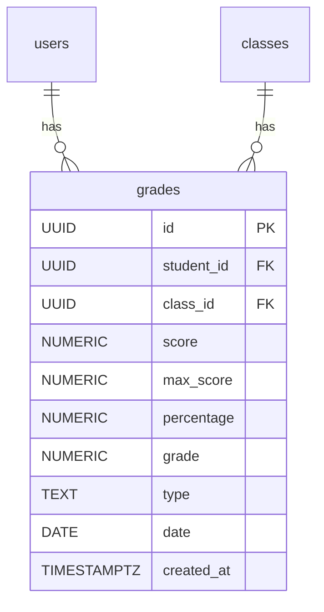
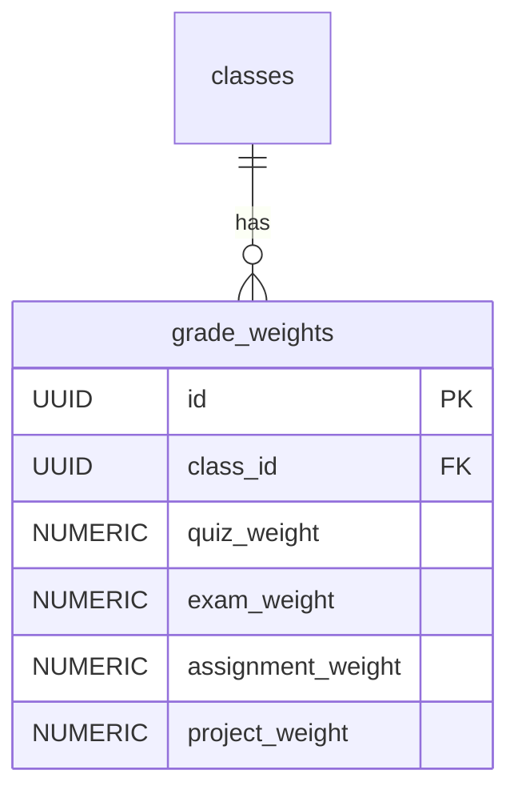
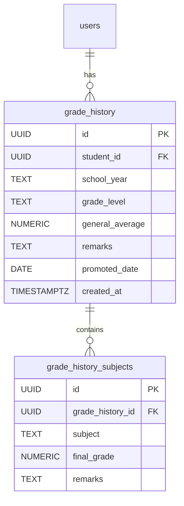
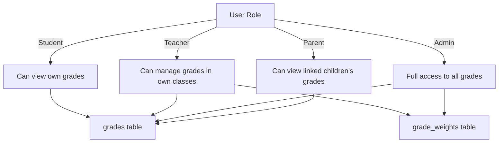
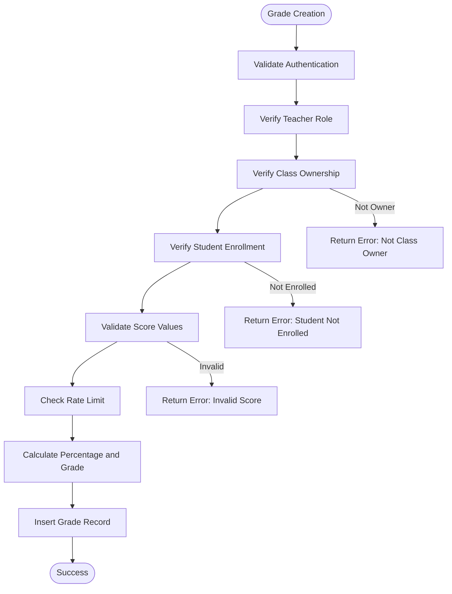
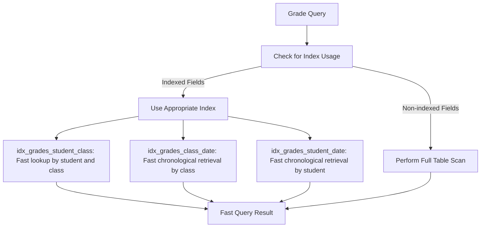
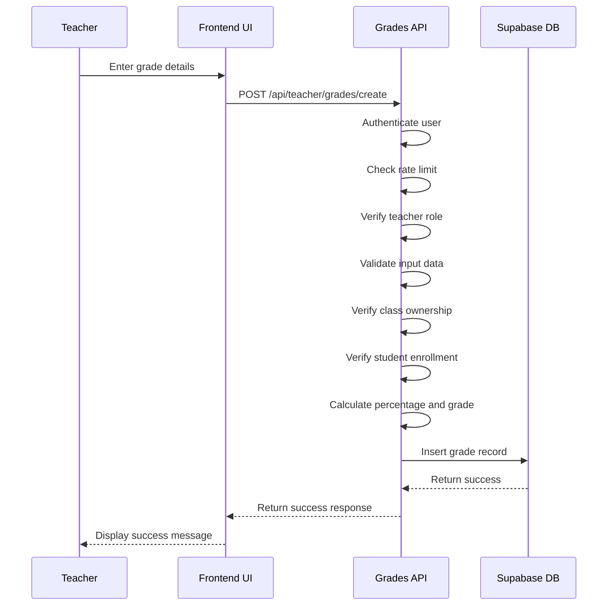
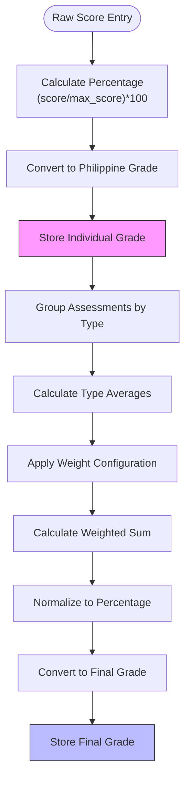
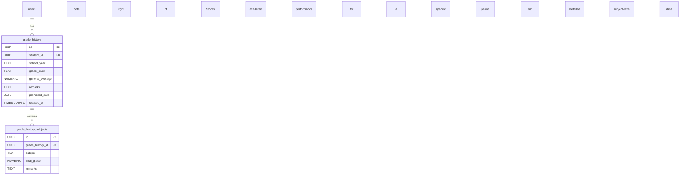

# Grades System

<cite>
**Referenced Files in This Document**   
- [20251219043509_create_grades_tables.sql](file://supabase/migrations/20251219043509_create_grades_tables.sql)
- [20251219044036_add_rls_policies.sql](file://supabase/migrations/20251219044036_add_rls_policies.sql)
- [20260108112143_performance_indexes.sql](file://supabase/migrations/20260108112143_performance_indexes.sql)
- [20250228_security_hardening.sql](file://supabase/migrations/20250228_security_hardening.sql)
- [20240101000000_secure_rls.sql](file://supabase/migrations/20240101000000_secure_rls.sql)
- [app/api/teacher/grades/create/route.ts](file://app/api/teacher/grades/create/route.ts)
- [app/teacher/grades/page.tsx](file://app/teacher/grades/page.tsx)
- [app/api/teacher/grades/class/[id]/route.ts](file://app/api/teacher/grades/class/[id]/route.ts)
- [app/api/student/grades/route.ts](file://app/api/student/grades/route.ts)
- [app/api/parent/child/[id]/grades/route.ts](file://app/api/parent/child/[id]/grades/route.ts)
- [lib/grade-utils.ts](file://lib/grade-utils.ts)
- [lib/grade-weights-store.ts](file://lib/grade-weights-store.ts)
- [lib/grade-history-store.ts](file://lib/grade-history-store.ts)
- [lib/database.types.ts](file://lib/database.types.ts)
</cite>

## Table of Contents
1. [Grades Table](#grades-table)
2. [Grade Weights Table](#grade-weights-table)
3. [Grade History Tables](#grade-history-tables)
4. [Security and RLS Policies](#security-and-rls-policies)
5. [Data Validation and Constraints](#data-validation-and-constraints)
6. [Performance Optimization](#performance-optimization)
7. [Teacher Grade Entry Workflow](#teacher-grade-entry-workflow)
8. [Frontend Integration](#frontend-integration)
9. [Grade Calculation and Finalization](#grade-calculation-and-finalization)
10. [Audit and Historical Tracking](#audit-and-historical-tracking)

## Grades Table

The `grades` table is the central component of the grading system, storing individual assessment records for students across various classes. It contains comprehensive information about each grade entry, including student and class identifiers, score details, calculated percentages, final grades, assessment types, and timestamps.

The table structure includes the following fields:
- **id**: UUID primary key with auto-generation
- **student_id**: UUID foreign key referencing the users table with cascade delete
- **class_id**: UUID foreign key referencing the classes table with cascade delete
- **score**: Numeric value representing the raw score achieved
- **max_score**: Numeric value with a default of 100 representing the maximum possible score
- **percentage**: Numeric value representing the percentage score (calculated as score/max_score * 100)
- **grade**: Numeric value representing the final grade according to the Philippine grading system
- **type**: Text field with a check constraint limiting values to 'exam', 'quiz', 'assignment', or 'project'
- **date**: Date field indicating when the assessment was conducted
- **created_at**: Timestamp with time zone defaulting to the current time

The table is designed to support comprehensive grade tracking while maintaining referential integrity through foreign key constraints. The percentage and grade fields are calculated server-side to ensure consistency and prevent client-side manipulation.



**Diagram sources**
- [20251219043509_create_grades_tables.sql](file://supabase/migrations/20251219043509_create_grades_tables.sql#L1-L12)

**Section sources**
- [20251219043509_create_grades_tables.sql](file://supabase/migrations/20251219043509_create_grades_tables.sql#L1-L12)
- [lib/database.types.ts](file://lib/database.types.ts#L1-L574)

## Grade Weights Table

The `grade_weights` table stores the weighted percentage configuration for different assessment types within each class. This table enables teachers to customize how various assessments contribute to the final grade, providing flexibility in grading methodologies across different classes and subjects.

Key features of the grade_weights table:
- **id**: UUID primary key with auto-generation
- **class_id**: UUID foreign key referencing the classes table with cascade delete
- **quiz_weight**: Numeric field with a default of 30 representing the weight percentage for quizzes
- **exam_weight**: Numeric field with a default of 35 representing the weight percentage for exams
- **assignment_weight**: Numeric field with a default of 20 representing the weight percentage for assignments
- **project_weight**: Numeric field with a default of 15 representing the weight percentage for projects

The table includes a unique constraint on the class_id field, ensuring that each class has only one weight configuration. This design prevents conflicting weight settings and maintains data integrity. The default values are set to represent a balanced assessment approach (30% quizzes, 35% exams, 20% assignments, 15% projects), which can be customized per class.

The weight configuration is crucial for calculating final grades, as it determines the relative importance of different assessment types. Teachers can adjust these weights through the frontend interface to reflect their specific grading policies.



**Diagram sources**
- [20251219043509_create_grades_tables.sql](file://supabase/migrations/20251219043509_create_grades_tables.sql#L14-L22)

**Section sources**
- [20251219043509_create_grades_tables.sql](file://supabase/migrations/20251219043509_create_grades_tables.sql#L14-L22)
- [lib/grade-weights-store.ts](file://lib/grade-weights-store.ts#L1-L52)

## Grade History Tables

The grade history system consists of two interconnected tables: `grade_history` and `grade_history_subjects`. These tables are designed for long-term academic progression tracking across school years, providing a comprehensive record of student performance over time.

The **grade_history** table serves as the parent table with the following structure:
- **id**: UUID primary key with auto-generation
- **student_id**: UUID foreign key referencing the users table with cascade delete
- **school_year**: Text field indicating the academic year (e.g., "2023-2024")
- **grade_level**: Text field indicating the grade level (e.g., "Grade 10")
- **general_average**: Numeric field storing the overall average for the period
- **remarks**: Text field for additional comments or observations
- **promoted_date**: Date field indicating when the student was promoted
- **created_at**: Timestamp with time zone defaulting to the current time

The **grade_history_subjects** table serves as the child table with the following structure:
- **id**: UUID primary key with auto-generation
- **grade_history_id**: UUID foreign key referencing the grade_history table with cascade delete
- **subject**: Text field indicating the subject name
- **final_grade**: Numeric field storing the final grade for the subject
- **remarks**: Text field for subject-specific comments

The relationship between these tables enables a detailed historical record of student performance, allowing for longitudinal analysis of academic progress. The cascade delete constraint ensures data integrity by automatically removing subject records when a grade history entry is deleted.



**Diagram sources**
- [20251219043509_create_grades_tables.sql](file://supabase/migrations/20251219043509_create_grades_tables.sql#L24-L41)

**Section sources**
- [20251219043509_create_grades_tables.sql](file://supabase/migrations/20251219043509_create_grades_tables.sql#L24-L41)
- [lib/grade-history-store.ts](file://lib/grade-history-store.ts#L1-L48)

## Security and RLS Policies

The Grades System implements comprehensive security through Row Level Security (RLS) policies, ensuring that users can only access data they are authorized to view. These policies are enforced at the database level, providing a robust security foundation that cannot be bypassed by client-side requests.

For the **grades** table, multiple RLS policies are implemented:
- Students can only view their own grades
- Teachers can view and manage grades for students in their classes
- Administrators have full access to all grade records
- Parents can view grades for their linked children

The RLS policies are defined in multiple migration files, with the primary policy in `20250228_security_hardening.sql` that allows students to view their own grades or allows teachers and administrators to view grades. Additional policies in `20240101000000_secure_rls.sql` reinforce the student access restriction.

For the **grade_weights** table, access is controlled through application logic rather than direct database policies. Teachers can only modify weight configurations for classes they own, as verified in the API routes. The `grade_history` and `grade_history_subjects` tables follow similar access patterns, with students, parents, and authorized staff having appropriate access levels.

The security model follows the principle of least privilege, ensuring that users have only the minimum necessary permissions to perform their roles. This approach minimizes the risk of unauthorized data access or modification.



**Section sources**
- [20250228_security_hardening.sql](file://supabase/migrations/20250228_security_hardening.sql#L1-L32)
- [20240101000000_secure_rls.sql](file://supabase/migrations/20240101000000_secure_rls.sql#L1-L43)
- [20251219044036_add_rls_policies.sql](file://supabase/migrations/20251219044036_add_rls_policies.sql#L1-L22)

## Data Validation and Constraints

The Grades System implements comprehensive data validation at both the database and application levels to ensure data integrity and consistency. These validation mechanisms prevent invalid or malicious data from being stored in the system.

At the database level, the following constraints are implemented:
- **Check constraints**: The grades table has a check constraint on the type field to ensure it only contains valid assessment types: 'exam', 'quiz', 'assignment', or 'project'
- **Foreign key constraints**: All foreign keys have cascade delete behavior to maintain referential integrity
- **Not null constraints**: Critical fields like score, percentage, and grade are marked as NOT NULL
- **Default values**: The max_score field has a default value of 100, and created_at has a default of the current timestamp

At the application level, the API routes implement additional validation:
- **Authentication validation**: All grade operations require user authentication
- **Role validation**: Teachers and administrators are verified before allowing grade modifications
- **Ownership validation**: Teachers can only modify grades for classes they own
- **Enrollment validation**: Students must be enrolled in a class before grades can be assigned
- **Score validation**: The score cannot exceed the max_score, and both values must be valid numbers

The system also implements rate limiting to prevent abuse, allowing 20 grade creations per minute per teacher. This prevents automated scripts from overwhelming the system.



**Section sources**
- [20251219043509_create_grades_tables.sql](file://supabase/migrations/20251219043509_create_grades_tables.sql#L1-L46)
- [app/api/teacher/grades/create/route.ts](file://app/api/teacher/grades/create/route.ts#L1-L105)

## Performance Optimization

The Grades System includes several performance optimizations to ensure efficient data retrieval and system responsiveness, particularly for frequently accessed operations. These optimizations are implemented through strategic database indexing and query optimization.

The primary performance optimization is the implementation of targeted database indexes, defined in the `20260108112143_performance_indexes.sql` migration file. For the grades tables, the following indexes are created:
- **idx_grades_student_class**: Composite index on student_id and class_id for efficient grade lookups by student and class
- **idx_grades_class_date**: Composite index on class_id and date (descending) for chronological grade retrieval by class
- **idx_grades_student_date**: Composite index on student_id and date (descending) for chronological grade retrieval by student

These indexes significantly improve query performance for common operations such as:
- Retrieving all grades for a specific student
- Fetching grades for a particular class
- Displaying grades in chronological order
- Calculating final grades by aggregating assessments

The indexes are designed to support the most common query patterns in the application, reducing query execution time and improving overall system performance. The descending order on date fields optimizes queries that retrieve the most recent grades first, which is the typical use case in the user interface.

Additionally, the system uses optimized API routes that fetch data in bulk rather than making multiple individual queries, further enhancing performance.



**Section sources**
- [20260108112143_performance_indexes.sql](file://supabase/migrations/20260108112143_performance_indexes.sql#L1-L104)

## Teacher Grade Entry Workflow

The teacher grade entry workflow is a comprehensive process that guides teachers through creating and managing student grades while enforcing security and data integrity. This workflow is implemented through the API endpoint at `app/api/teacher/grades/create/route.ts` and integrated with the frontend interface.

The workflow consists of the following steps:
1. **Authentication**: The system verifies the user is authenticated and retrieves their user ID
2. **Rate limiting**: The system checks if the teacher has exceeded the rate limit (20 grades per minute)
3. **Role verification**: The system confirms the user has a teacher or admin role
4. **Data validation**: The system validates all required fields (studentId, classId, score, maxScore, type, date)
5. **Ownership verification**: For teachers (non-admins), the system verifies they own the specified class
6. **Enrollment verification**: The system confirms the student is enrolled in the class
7. **Score validation**: The system ensures the score does not exceed the maximum score
8. **Server-side calculation**: The system calculates the percentage and final grade
9. **Database insertion**: The system inserts the grade record into the database

The workflow is designed to be both secure and user-friendly, with clear error messages for each validation step. The server-side calculation of percentage and grade ensures consistency and prevents manipulation of these values by the client.

The API endpoint uses Supabase's client library to interact with the database, leveraging the RLS policies for additional security. Even if a malicious user attempts to bypass the application logic, the database-level RLS policies prevent unauthorized access.



**Section sources**
- [app/api/teacher/grades/create/route.ts](file://app/api/teacher/grades/create/route.ts#L1-L105)
- [app/teacher/grades/page.tsx](file://app/teacher/grades/page.tsx#L1-L539)

## Frontend Integration

The Grades System is tightly integrated with the frontend application through specific components and API routes that provide a seamless user experience for teachers, students, and parents. The primary interface for teachers is located at `app/teacher/grades/page.tsx`, which provides a comprehensive dashboard for managing student grades.

Key frontend components and their integration:
- **Teacher Grades Page**: A React component that displays all students in selected classes with their current grades, assessment types, and final grades
- **Grade Entry Dialog**: A modal interface that allows teachers to add new grade entries with validation and real-time grade calculation
- **Grade Weights Configuration**: A dialog that enables teachers to customize the weight distribution for different assessment types in their classes
- **Student Grade View**: A separate interface for students to view their own grades, accessible through the student portal
- **Parent Grade View**: An interface for parents to view grades for their linked children

The frontend uses client-side state management with Zustand stores (`grade-weights-store.ts` and `grade-history-store.ts`) to manage grade weights and history data locally, reducing the need for repeated API calls. The application also implements optimistic updates, providing immediate feedback to users while data is being saved to the server.

The integration follows security best practices by using secure API routes rather than direct database queries from the client. All sensitive operations are performed through API endpoints that enforce authentication, authorization, and data validation.

```mermaid
graph TB
subgraph "Frontend"
TeacherPage[Teacher Grades Page]
StudentPage[Student Grades Page]
ParentPage[Parent Grades Page]
GradeEntry[Grade Entry Dialog]
WeightsConfig[Grade Weights Configuration]
end
subgraph "API Routes"
CreateGrade[/api/teacher/grades/create]
GetClassGrades[/api/teacher/grades/class/[id]]
GetStudentGrades[/api/student/grades]
GetParentGrades[/api/parent/child/[id]/grades]
end
subgraph "Backend"
Database[(Supabase DB)]
RLS[Row Level Security]
end
TeacherPage --> CreateGrade
TeacherPage --> GetClassGrades
StudentPage --> GetStudentGrades
ParentPage --> GetParentGrades
CreateGrade --> Database
GetClassGrades --> Database
GetStudentGrades --> Database
GetParentGrades --> Database
Database --> RLS
```

**Section sources**
- [app/teacher/grades/page.tsx](file://app/teacher/grades/page.tsx#L1-L539)
- [app/api/teacher/grades/class/[id]/route.ts](file://app/api/teacher/grades/class/[id]/route.ts#L1-L101)
- [app/api/student/grades/route.ts](file://app/api/student/grades/route.ts#L1-L40)
- [app/api/parent/child/[id]/grades/route.ts](file://app/api/parent/child/[id]/grades/route.ts#L1-L61)
- [lib/grade-weights-store.ts](file://lib/grade-weights-store.ts#L1-L52)

## Grade Calculation and Finalization

The Grades System implements a sophisticated grade calculation process that converts raw scores into final grades according to the Philippine grading system. This process occurs at multiple levels: individual assessment calculation and final grade computation.

For individual assessments, the system calculates two values:
1. **Percentage**: Calculated as (score / max_score) * 100, rounded to the nearest integer
2. **Grade**: Converted from the percentage using the `percentageToPhGrade` function in `lib/grade-utils.ts`

The Philippine grading scale conversion follows this mapping:
- 96-100: Excellent (100, 99, 98, 97, 96)
- 90-95: Outstanding (94, 92, 90)
- 85-89: Very Satisfactory (88, 85)
- 80-84: Satisfactory (82, 79, 77)
- 75-79: Fairly Satisfactory (75, 73, 71, 70)
- Below 75: Did Not Meet Expectations (68, 65, 60)

For final grade computation, the system uses the weighted average approach based on the configuration in the grade_weights table. The process involves:
1. Grouping assessments by type (exam, quiz, assignment, project)
2. Calculating the average percentage for each assessment type
3. Applying the configured weights to each type's average
4. Computing the weighted sum and normalizing it to a percentage
5. Converting the final percentage to a Philippine grade

The `calculateFinalGradeWithWeights` function in the frontend and `calculateFinalGrade` in `lib/grade-utils.ts` implement this logic, ensuring consistency between client-side previews and server-side calculations.



**Section sources**
- [lib/grade-utils.ts](file://lib/grade-utils.ts#L1-L163)
- [app/teacher/grades/page.tsx](file://app/teacher/grades/page.tsx#L58-L89)
- [app/api/teacher/grades/create/route.ts](file://app/api/teacher/grades/create/route.ts#L78-L79)

## Audit and Historical Tracking

The Grades System includes comprehensive audit and historical tracking capabilities that enable monitoring of academic progression over time. This functionality is implemented through the grade_history and grade_history_subjects tables, which store longitudinal data about student performance.

The historical tracking system serves several key purposes:
- **Academic Progression**: Tracking student performance across multiple school years and grade levels
- **Promotion Decisions**: Providing data to support decisions about student promotion
- **Performance Analysis**: Enabling analysis of long-term academic trends and patterns
- **Reporting**: Generating official transcripts and academic records

The system captures the following historical data:
- **General Academic Information**: School year, grade level, and promotion date
- **Overall Performance**: General average across all subjects
- **Subject-Specific Performance**: Final grades and remarks for individual subjects
- **Temporal Context**: When the academic period occurred

The data model supports both aggregated views (general average) and detailed breakdowns (per-subject grades), providing flexibility for different reporting needs. The cascade delete relationship between grade_history and grade_history_subjects ensures data integrity when records are removed.

The system also maintains a created_at timestamp for audit purposes, allowing administrators to track when historical records were entered into the system. This temporal information is valuable for understanding the context of academic data and identifying any anomalies in data entry patterns.



**Section sources**
- [20251219043509_create_grades_tables.sql](file://supabase/migrations/20251219043509_create_grades_tables.sql#L24-L41)
- [lib/grade-history-store.ts](file://lib/grade-history-store.ts#L1-L48)