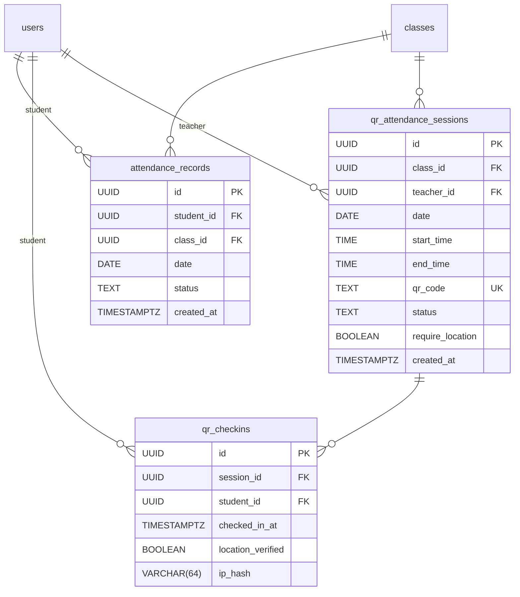
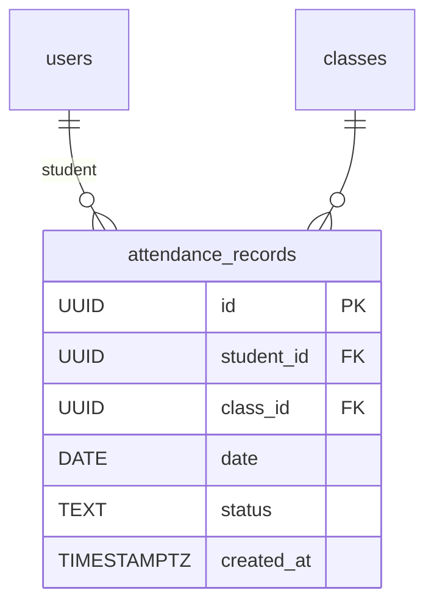
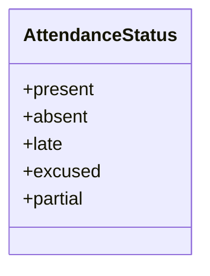
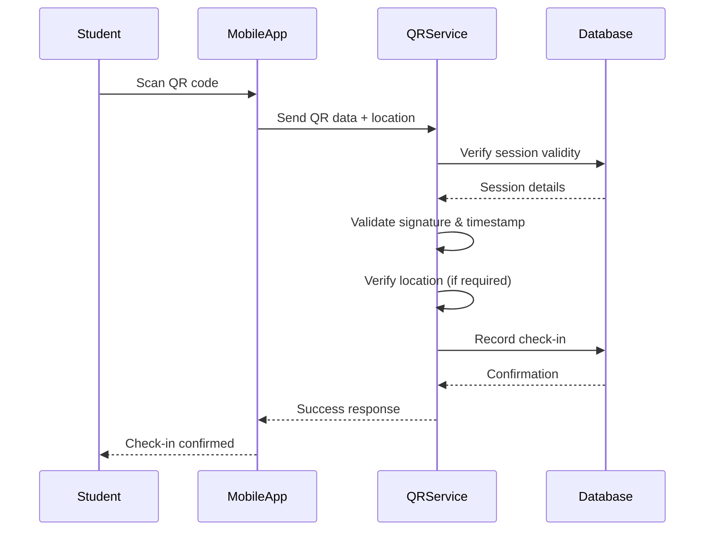
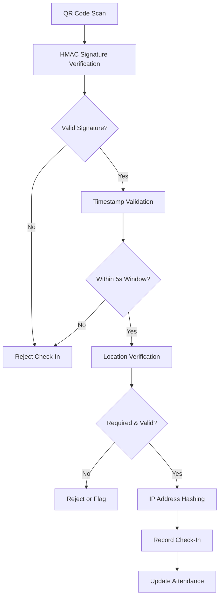
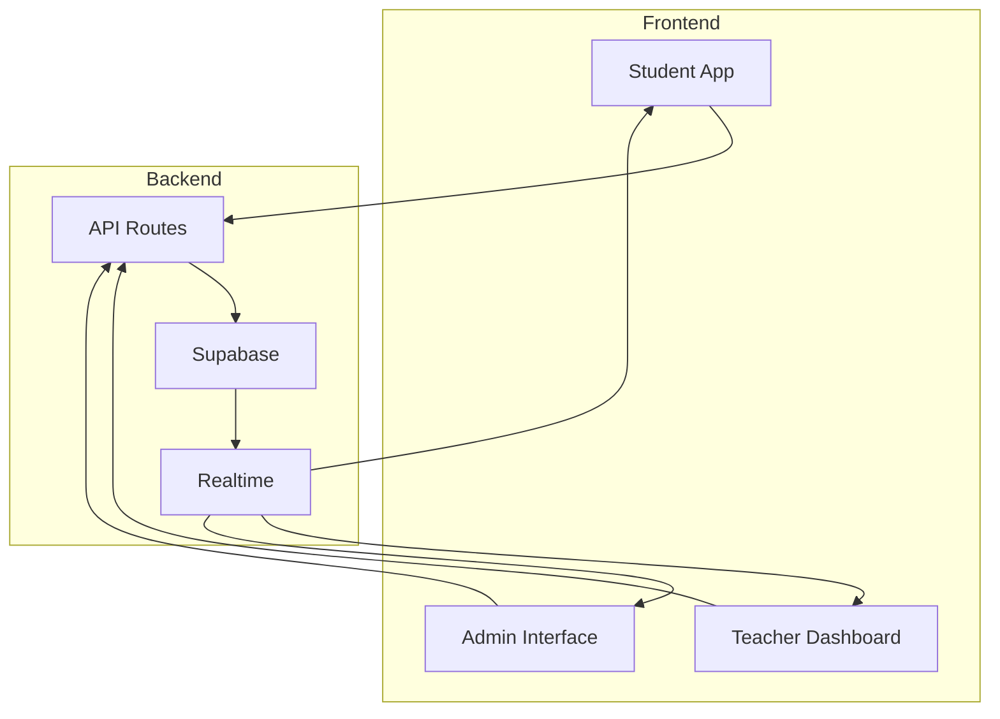
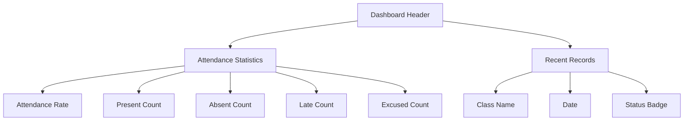
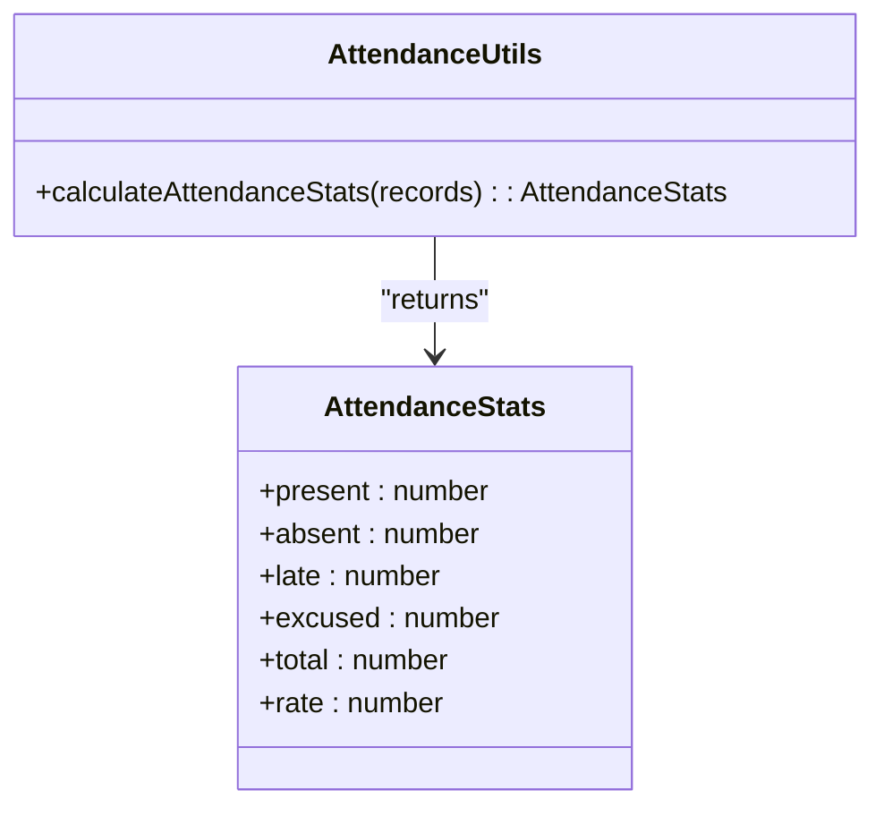

# Attendance Tracking and Check-In Mechanisms

<cite>
**Referenced Files in This Document**   
- [20251219043454_create_attendance_tables.sql](file://supabase/migrations/20251219043454_create_attendance_tables.sql)
- [20260110102108_add_partial_attendance_status.sql](file://supabase/migrations/20260110102108_add_partial_attendance_status.sql)
- [20251219121408_add_attendance_unique_constraint.sql](file://supabase/migrations/20251219121408_add_attendance_unique_constraint.sql)
- [20251219121643_add_student_attendance_insert_policy.sql](file://supabase/migrations/20251219121643_add_student_attendance_insert_policy.sql)
- [20251219121650_add_student_attendance_update_policy.sql](file://supabase/migrations/20251219121650_add_student_attendance_update_policy.sql)
- [20250301_secure_checkins.sql](file://supabase/migrations/20250301_secure_checkins.sql)
- [20260101070407_secure_checkins_fixed.sql](file://supabase/migrations/20260101070407_secure_checkins_fixed.sql)
- [app/api/student/attendance/route.ts](file://app/api/student/attendance/route.ts)
- [app/api/teacher/attendance/save/route.ts](file://app/api/teacher/attendance/save/route.ts)
- [app/api/teacher/attendance/class-data/route.ts](file://app/api/teacher/attendance/class-data/route.ts)
- [app/api/student/check-in/route.ts](file://app/api/student/check-in/route.ts)
- [app/api/teacher/generate-qr/route.ts](file://app/api/teacher/generate-qr/route.ts)
- [app/student/attendance/page.tsx](file://app/student/attendance/page.tsx)
- [app/teacher/attendance/page.tsx](file://app/teacher/attendance/page.tsx)
- [lib/qr-attendance-store.ts](file://lib/qr-attendance-store.ts)
- [lib/attendance-utils.ts](file://lib/attendance-utils.ts)
</cite>

## Table of Contents
1. [Introduction](#introduction)
2. [Data Model Overview](#data-model-overview)
3. [Attendance Records Table](#attendance-records-table)
4. [Partial Attendance Status](#partial-attendance-status)
5. [Row Level Security Policies](#row-level-security-policies)
6. [QR-Based Check-In System](#qr-based-check-in-system)
7. [Security Measures](#security-measures)
8. [Real-Time Integration](#real-time-integration)
9. [Frontend Dashboards](#frontend-dashboards)
10. [Analytics and Reporting](#analytics-and-reporting)

## Introduction
The attendance system provides a comprehensive solution for tracking student attendance through both manual entry and QR-based check-in mechanisms. The system supports flexible attendance statuses, robust security measures, and real-time data synchronization across different user roles. This documentation details the data model, security architecture, and integration points for the attendance tracking system.

## Data Model Overview



**Diagram sources**
- [20251219043454_create_attendance_tables.sql](file://supabase/migrations/20251219043454_create_attendance_tables.sql)

**Section sources**
- [20251219043454_create_attendance_tables.sql](file://supabase/migrations/20251219043454_create_attendance_tables.sql)

## Attendance Records Table

The `attendance_records` table serves as the central data store for all attendance information, capturing key details about student attendance across classes. The table includes essential fields such as student identifier, class association, date of attendance, and status.



**Diagram sources**
- [20251219043454_create_attendance_tables.sql](file://supabase/migrations/20251219043454_create_attendance_tables.sql)

**Section sources**
- [20251219043454_create_attendance_tables.sql](file://supabase/migrations/20251219043454_create_attendance_tables.sql)

### Key Constraints and Indexes
The attendance records table implements several constraints to ensure data integrity and optimize query performance:

- **Primary Key**: The `id` field serves as the primary key with UUID generation
- **Foreign Key Constraints**: References to `users(id)` and `classes(id)` with cascade deletion
- **Status Validation**: CHECK constraint limiting status values to predefined options
- **Unique Constraint**: Composite index on `student_id`, `class_id`, and `date` to prevent duplicate records

**Section sources**
- [20251219043454_create_attendance_tables.sql](file://supabase/migrations/20251219043454_create_attendance_tables.sql)
- [20251219121408_add_attendance_unique_constraint.sql](file://supabase/migrations/20251219121408_add_attendance_unique_constraint.sql)

## Partial Attendance Status

The system has been enhanced with a 'partial' attendance status to support flexible tracking scenarios where students may attend only part of a class session. This addition provides more granular attendance data for academic and administrative purposes.



**Diagram sources**
- [20260110102108_add_partial_attendance_status.sql](file://supabase/migrations/20260110102108_add_partial_attendance_status.sql)

The 'partial' status was introduced through the `add_partial_attendance_status.sql` migration, which modified the CHECK constraint on the status column to include this additional option. This change enables the system to accurately reflect situations where students arrive late and leave early, or attend only specific portions of extended class sessions.

**Section sources**
- [20260110102108_add_partial_attendance_status.sql](file://supabase/migrations/20260110102108_add_partial_attendance_status.sql)

## Row Level Security Policies

The attendance system implements granular Row Level Security (RLS) policies to control data access based on user roles. These policies ensure that users can only access and modify attendance records according to their permissions.

```mermaid
graph TD
A[User Request] --> B{User Role}
B --> |Student| C[Can insert/update own records]
B --> |Teacher| D[Can manage class attendance]
B --> |Admin| E[Full management capabilities]
C --> F[student_id = auth.uid()]
D --> G[Class ownership verification]
E --> H[Unrestricted access]
```

**Diagram sources**
- [20251219121643_add_student_attendance_insert_policy.sql](file://supabase/migrations/20251219121643_add_student_attendance_insert_policy.sql)
- [20251219121650_add_student_attendance_update_policy.sql](file://supabase/migrations/20251219121650_add_student_attendance_update_policy.sql)

### Student Access Policies
Students are granted the ability to insert and update their own attendance records through specific RLS policies:

- **Insert Policy**: Students can create attendance records only when the `student_id` matches their authenticated user ID
- **Update Policy**: Students can modify their own attendance records with the same identity verification

These policies enable self-service attendance management while preventing unauthorized access to other students' records.

**Section sources**
- [20251219121643_add_student_attendance_insert_policy.sql](file://supabase/migrations/20251219121643_add_student_attendance_insert_policy.sql)
- [20251219121650_add_student_attendance_update_policy.sql](file://supabase/migrations/20251219121650_add_student_attendance_update_policy.sql)

### Teacher and Admin Capabilities
Teachers and administrators have broader management capabilities that allow them to oversee attendance for multiple students:

- **Class Ownership Verification**: Teachers can only manage attendance for classes they teach
- **Batch Operations**: Support for updating multiple attendance records simultaneously
- **Administrative Oversight**: Admins have comprehensive access for system management and auditing

**Section sources**
- [app/api/teacher/attendance/save/route.ts](file://app/api/teacher/attendance/save/route.ts)
- [app/api/teacher/attendance/class-data/route.ts](file://app/api/teacher/attendance/class-data/route.ts)

## QR-Based Check-In System

The QR-based check-in system provides a secure and efficient method for students to record their attendance using mobile devices. This system integrates with the attendance records table to automatically update attendance status upon successful check-in.



**Diagram sources**
- [app/api/student/check-in/route.ts](file://app/api/student/check-in/route.ts)
- [app/api/teacher/generate-qr/route.ts](file://app/api/teacher/generate-qr/route.ts)

The check-in process involves multiple components working together to ensure secure and accurate attendance recording:

- **QR Attendance Sessions**: Temporary sessions created by teachers with unique QR codes
- **Check-In Records**: Individual check-in events stored in the `qr_checkins` table
- **Attendance Synchronization**: Automatic updates to the main attendance records table

**Section sources**
- [app/api/student/check-in/route.ts](file://app/api/student/check-in/route.ts)
- [app/api/teacher/generate-qr/route.ts](file://app/api/teacher/generate-qr/route.ts)

## Security Measures

The system implements multiple security layers to protect against spoofing and ensure data integrity during the check-in process. These measures are critical for maintaining the reliability of attendance data.



**Diagram sources**
- [20250301_secure_checkins.sql](file://supabase/migrations/20250301_secure_checkins.sql)
- [20260101070407_secure_checkins_fixed.sql](file://supabase/migrations/20260101070407_secure_checkins_fixed.sql)
- [app/api/student/check-in/route.ts](file://app/api/student/check-in/route.ts)

### Key Security Features
The secure check-in system incorporates several protective measures:

- **HMAC Signatures**: QR codes contain cryptographically signed payloads to prevent tampering
- **Time-Limited Validity**: QR codes expire after 5 seconds to prevent replay attacks
- **IP Address Hashing**: Client IP addresses are hashed for privacy-preserving abuse detection
- **Location Verification**: GPS coordinates are validated against school boundaries
- **Rate Limiting**: Protection against automated check-in attempts

**Section sources**
- [20250301_secure_checkins.sql](file://supabase/migrations/20250301_secure_checkins.sql)
- [20260101070407_secure_checkins_fixed.sql](file://supabase/migrations/20260101070407_secure_checkins_fixed.sql)
- [app/api/student/check-in/route.ts](file://app/api/student/check-in/route.ts)

## Real-Time Integration

The attendance system integrates with real-time features to provide immediate feedback and synchronization across devices. This ensures that attendance data is consistently updated and available to all authorized users.



**Diagram sources**
- [lib/qr-attendance-store.ts](file://lib/qr-attendance-store.ts)
- [app/api/student/check-in/route.ts](file://app/api/student/check-in/route.ts)

The real-time integration enables instant updates when attendance records are created or modified, allowing teachers to monitor check-in progress and students to verify their attendance status immediately.

**Section sources**
- [lib/qr-attendance-store.ts](file://lib/qr-attendance-store.ts)
- [app/api/student/check-in/route.ts](file://app/api/student/check-in/route.ts)

## Frontend Dashboards

The attendance system provides dedicated dashboards for different user roles, offering tailored views and functionality for students, teachers, and administrators.

### Student Attendance Dashboard



**Diagram sources**
- [app/student/attendance/page.tsx](file://app/student/attendance/page.tsx)

The student dashboard displays attendance statistics and recent records, providing a clear overview of attendance history. The interface includes visual indicators for different attendance statuses and calculates overall attendance rates.

**Section sources**
- [app/student/attendance/page.tsx](file://app/student/attendance/page.tsx)

### Teacher Attendance Management

The teacher dashboard enables instructors to manage attendance for their classes, view enrollment lists, and track student participation. Teachers can generate QR codes for check-in sessions and monitor real-time attendance during class.

**Section sources**
- [app/teacher/attendance/page.tsx](file://app/teacher/attendance/page.tsx)

## Analytics and Reporting

Attendance data feeds into comprehensive analytics and reporting systems that provide insights into student participation patterns and trends over time.



**Diagram sources**
- [lib/attendance-utils.ts](file://lib/attendance-utils.ts)

The system includes utility functions for calculating attendance statistics, including overall rates and breakdowns by status type. These analytics support academic monitoring, intervention planning, and institutional reporting requirements.

**Section sources**
- [lib/attendance-utils.ts](file://lib/attendance-utils.ts)