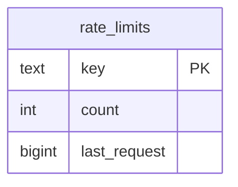
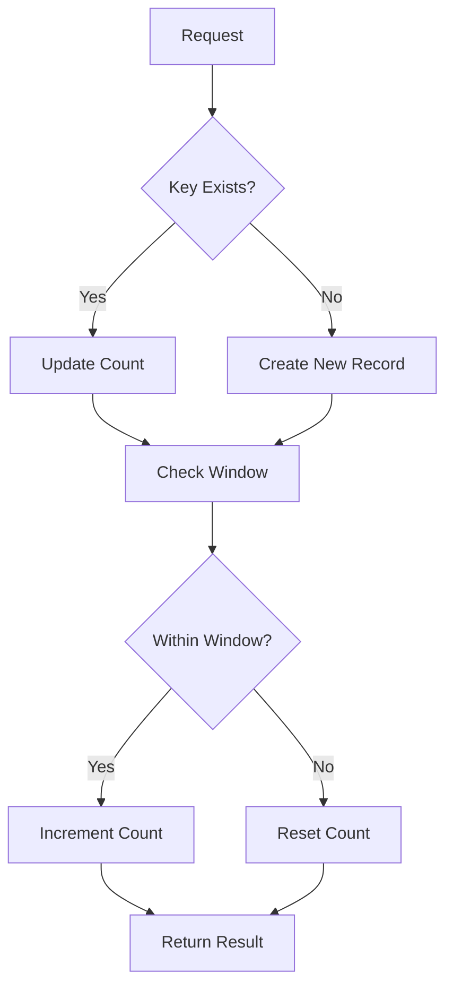
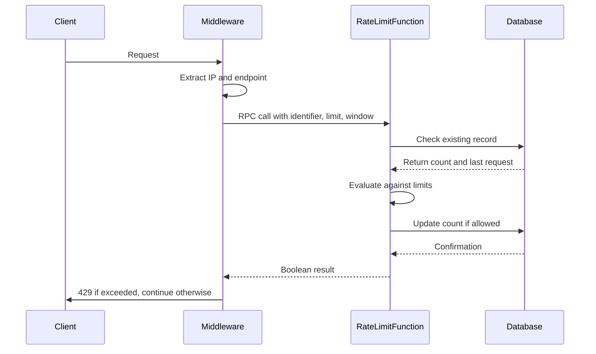
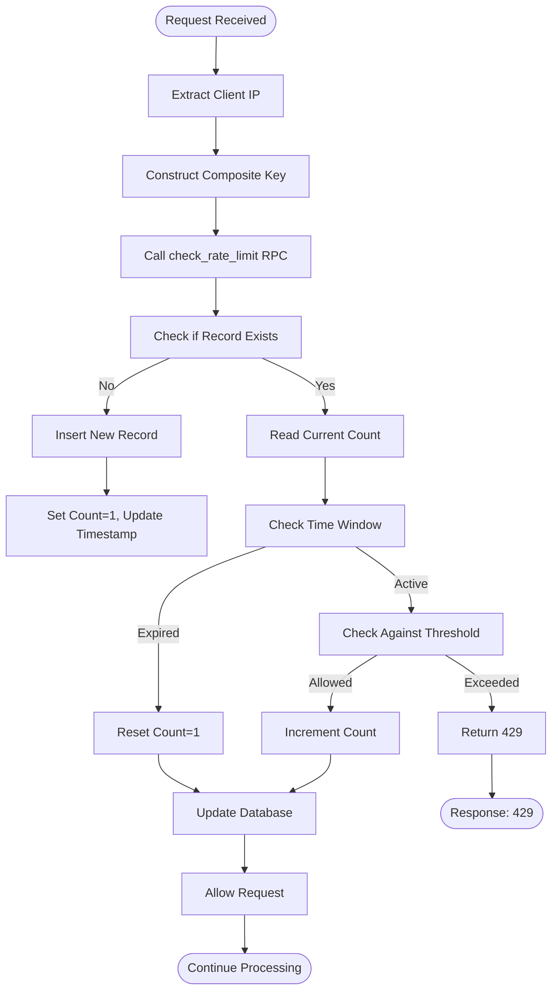
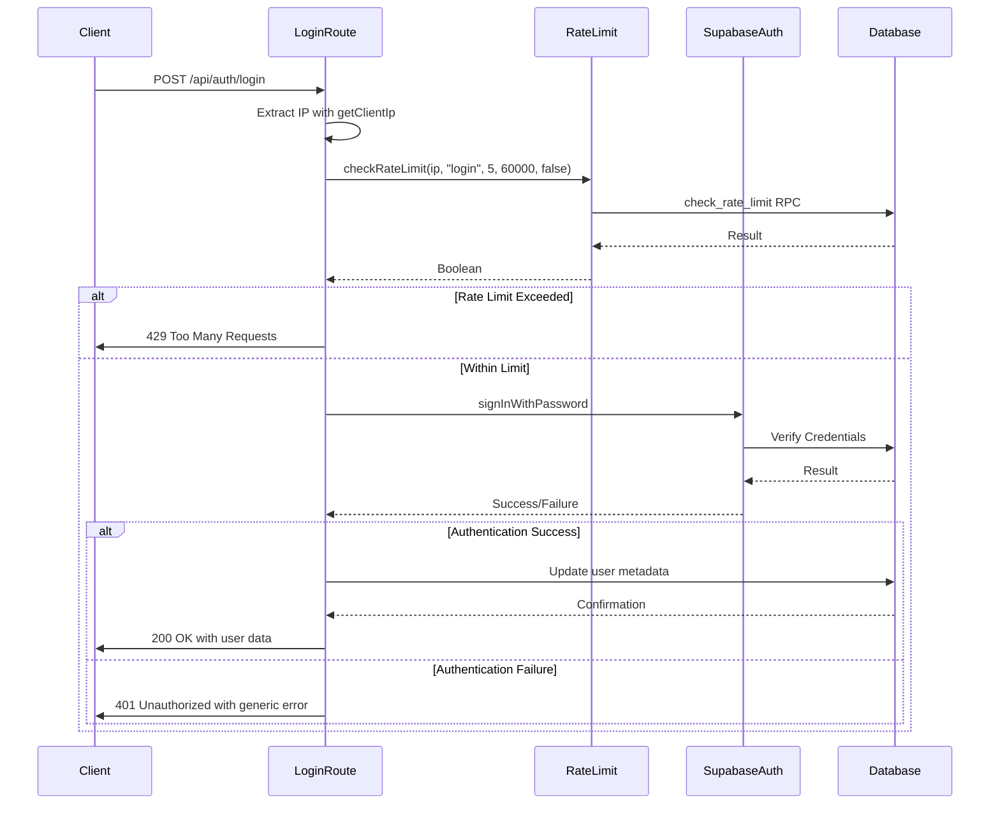

# Rate Limiting Mechanism

<cite>
**Referenced Files in This Document**   
- [rate_limits_table.sql](file://supabase/migrations/20260101070340_rate_limit_table.sql)
- [rate_limit_rpc.sql](file://supabase/migrations/20260101070343_rate_limit_rpc.sql)
- [rate-limit.ts](file://lib/rate-limit.ts)
- [middleware.ts](file://lib/supabase/middleware.ts)
- [login/route.ts](file://app/api/auth/login/route.ts)
- [security.ts](file://lib/security.ts)
- [session-security.ts](file://lib/session-security.ts)
</cite>

## Table of Contents
1. [Introduction](#introduction)
2. [Schema Design](#schema-design)
3. [Indexing Strategy](#indexing-strategy)
4. [Middleware Implementation](#middleware-implementation)
5. [Rate Limiting Workflow](#rate-limiting-workflow)
6. [Configuration Parameters](#configuration-parameters)
7. [Integration with Supabase Auth](#integration-with-supabase-auth)
8. [Monitoring and Abuse Detection](#monitoring-and-abuse-detection)
9. [Potential Improvements](#potential-improvements)
10. [Troubleshooting Guide](#troubleshooting-guide)

## Introduction
The rate limiting system in the School Management System is designed to protect sensitive endpoints from abuse, particularly authentication endpoints like login. The system uses a combination of database storage, atomic operations, and middleware integration to enforce granular rate limits based on user identifiers or IP addresses. This documentation provides a comprehensive overview of the rate limiting mechanism, including schema design, implementation details, and integration with the Supabase authentication system.

**Section sources**
- [rate_limits_table.sql](file://supabase/migrations/20260101070340_rate_limit_table.sql#L1-L18)
- [rate_limit_rpc.sql](file://supabase/migrations/20260101070343_rate_limit_rpc.sql#L1-L41)
- [rate-limit.ts](file://lib/rate-limit.ts#L1-L56)

## Schema Design
The rate limiting system uses a dedicated `rate_limits` table to track request counts for different identifiers and endpoints. The schema has evolved over time to optimize performance and security. The current schema uses a composite key approach where the `key` field combines the identifier (user ID or IP) with the endpoint being accessed. This allows for granular tracking of API requests while maintaining efficient query performance.

The table includes three main fields:
- `key`: A text field serving as the primary key, combining identifier and endpoint
- `count`: An integer field storing the current request count within the time window
- `last_request`: A bigint field storing the timestamp of the last request in milliseconds

This design enables efficient lookups and updates while preventing race conditions through atomic operations.

**Diagram sources**
- [rate_limits_table.sql](file://supabase/migrations/20260101070340_rate_limit_table.sql#L2-L6)

**Section sources**
- [rate_limits_table.sql](file://supabase/migrations/20260101070340_rate_limit_table.sql#L1-L18)

## Indexing Strategy
The rate limiting system employs a strategic indexing approach to ensure efficient query performance. The primary key on the `key` field provides optimal performance for lookups based on the composite identifier-endpoint key. This index is crucial for the atomic operations performed by the `check_rate_limit` function, which must quickly locate and update rate limit records.

The system also includes a function for cleaning up old entries (`clean_rate_limits`), which removes records older than one hour. While this function doesn't rely on a specific index, the query on `last_request` benefits from the natural ordering of the primary key, which includes the timestamp component in the composite key structure.

**Diagram sources**
- [rate_limits_table.sql](file://supabase/migrations/20260101070340_rate_limit_table.sql#L2-L6)
- [rate_limit_rpc.sql](file://supabase/migrations/20260101070343_rate_limit_rpc.sql#L1-L41)

**Section sources**
- [rate_limits_table.sql](file://supabase/migrations/20260101070340_rate_limit_table.sql#L1-L18)
- [rate_limit_rpc.sql](file://supabase/migrations/20260101070343_rate_limit_rpc.sql#L1-L41)

## Middleware Implementation
The rate limiting middleware is implemented in `lib/supabase/middleware.ts` and integrated into the application's request processing pipeline. The middleware uses the `checkRateLimit` function from `lib/rate-limit.ts` to enforce rate limits before allowing API execution. This function makes an RPC call to the `check_rate_limit` PostgreSQL function, ensuring atomic operations and preventing race conditions.

For authentication endpoints like login, the middleware is configured to fail closed, meaning that if there is a database error, the request is denied. This security-first approach prevents brute force attacks during database outages. The middleware extracts the client IP address using the `getClientIp` function, which prioritizes platform-provided IP addresses to prevent spoofing.

**Diagram sources**
- [middleware.ts](file://lib/supabase/middleware.ts#L1-L38)
- [rate-limit.ts](file://lib/rate-limit.ts#L1-L56)
- [rate_limit_rpc.sql](file://supabase/migrations/20260101070343_rate_limit_rpc.sql#L1-L41)

**Section sources**
- [middleware.ts](file://lib/supabase/middleware.ts#L1-L38)
- [rate-limit.ts](file://lib/rate-limit.ts#L1-L56)

## Rate Limiting Workflow
The rate limiting workflow follows a precise sequence of operations to ensure accurate and secure enforcement. When a request arrives, the system first extracts the client IP address and determines the appropriate rate limit configuration based on the endpoint. The `checkRateLimit` function then constructs a composite key combining the identifier and endpoint, and makes an RPC call to the `check_rate_limit` database function.

The database function performs an atomic operation that either inserts a new record or updates an existing one. It checks whether the current request falls within the specified time window and whether the request count has exceeded the threshold. If the limit is exceeded, the function returns false, resulting in a 429 Too Many Requests response. Otherwise, the request count is incremented and the request is allowed to proceed.

Expired entries are automatically purged by the `clean_rate_limits` function, which runs periodically to remove records older than one hour, keeping the table size manageable.

**Diagram sources**
- [rate_limit_rpc.sql](file://supabase/migrations/20260101070343_rate_limit_rpc.sql#L1-L41)
- [rate-limit.ts](file://lib/rate-limit.ts#L1-L56)

**Section sources**
- [rate_limit_rpc.sql](file://supabase/migrations/20260101070343_rate_limit_rpc.sql#L1-L41)
- [rate-limit.ts](file://lib/rate-limit.ts#L1-L56)

## Configuration Parameters
The rate limiting system uses configurable parameters to define time windows and threshold values for different endpoints. These parameters are specified when calling the `checkRateLimit` function and include:

- `identifier`: The unique key to rate limit against (e.g., User ID or IP)
- `endpoint`: The action being performed (e.g., 'login', 'submit-quiz')
- `limit`: Maximum requests allowed in the window
- `windowMs`: Time window in milliseconds
- `failOpen`: Whether to allow requests on database errors (default: true for availability, false for security-critical endpoints)

For example, the login endpoint is configured with a limit of 5 attempts per minute (60,000 milliseconds) and `failOpen` set to false, meaning it fails closed to prevent brute force attacks during database outages. Other endpoints like avatar uploads allow 5 uploads every 10 minutes, reflecting different security requirements and user experience considerations.

**Section sources**
- [rate-limit.ts](file://lib/rate-limit.ts#L16-L56)
- [login/route.ts](file://app/api/auth/login/route.ts#L1-L117)

## Integration with Supabase Auth
The rate limiting system is tightly integrated with the Supabase authentication flows to protect sensitive endpoints. In the login route, the system first extracts the client IP address using the secure `getClientIp` function, which prioritizes platform-provided IP addresses to prevent spoofing. The rate limit check is performed before any authentication attempt, preventing unnecessary database queries for brute force attacks.

The integration uses the Supabase service role key to bypass Row Level Security (RLS) and ensure system-level access to the rate_limits table. This approach allows the rate limiting system to function independently of the user's authentication state while maintaining security. The system also uses generic error messages to prevent user enumeration attacks, returning the same error for invalid credentials and disabled accounts.

**Diagram sources**
- [login/route.ts](file://app/api/auth/login/route.ts#L1-L117)
- [security.ts](file://lib/security.ts#L1-L136)
- [rate-limit.ts](file://lib/rate-limit.ts#L1-L56)

**Section sources**
- [login/route.ts](file://app/api/auth/login/route.ts#L1-L117)
- [security.ts](file://lib/security.ts#L1-L136)

## Monitoring and Abuse Detection
The system includes monitoring capabilities to detect abuse patterns and potential security threats. The audit logs system tracks various actions, including failed login attempts, and can detect multiple failed attempts within a short time period. This information is used to generate alerts for suspicious activity, such as multiple failed login attempts from the same user.

The rate limiting system itself provides valuable data for monitoring, as the rate_limits table contains a record of all rate-limited requests. This data can be analyzed to identify potential attack patterns or abusive behavior. The system also logs security events, including new device logins and potential session hijacking attempts, providing a comprehensive view of user activity and potential threats.

**Section sources**
- [audit-logs.ts](file://lib/supabase/audit-logs.ts#L160-L209)
- [session-security.ts](file://lib/session-security.ts#L278-L298)

## Potential Improvements
While the current rate limiting system is effective, several potential improvements could enhance its capabilities for high-scale scenarios:

1. **Sliding Window Algorithm**: Implementing a sliding window algorithm instead of the current fixed window approach would provide more accurate rate limiting, preventing bursts of requests at window boundaries.

2. **Redis-Backed Storage**: For high-scale scenarios, moving from PostgreSQL to Redis for rate limit storage would significantly improve performance due to Redis's in-memory nature and specialized data structures for rate limiting.

3. **Dynamic Rate Limiting**: Implementing dynamic rate limits based on user behavior or risk assessment could provide more nuanced protection, allowing higher limits for trusted users while maintaining strict limits for suspicious activity.

4. **Distributed Rate Limiting**: For applications deployed across multiple regions, implementing a distributed rate limiting system would ensure consistent enforcement across all instances.

5. **Enhanced Monitoring**: Adding more sophisticated analytics to the rate limiting data could help identify emerging attack patterns and automatically adjust limits based on threat intelligence.

**Section sources**
- [rate_limit_rpc.sql](file://supabase/migrations/20260101070343_rate_limit_rpc.sql#L1-L41)
- [rate-limit.ts](file://lib/rate-limit.ts#L1-L56)

## Troubleshooting Guide
When troubleshooting issues with the rate limiting system, consider the following common scenarios:

1. **False Positives**: If legitimate users are being rate limited, verify that the IP extraction is working correctly and not being affected by proxy configurations. The `getClientIp` function should prioritize platform-provided IP addresses.

2. **Performance Bottlenecks**: If the rate limiting system is causing performance issues, monitor the database load and consider optimizing the `check_rate_limit` function or implementing caching.

3. **Database Errors**: If rate limiting fails due to database connectivity issues, ensure that the `failOpen` parameter is configured appropriately for each endpoint. Security-critical endpoints should fail closed.

4. **Clock Skew**: Ensure that the server clock is synchronized, as the rate limiting system relies on accurate timestamps. Clock skew can cause incorrect rate limit calculations.

5. **Migration Issues**: When upgrading the rate limiting schema, ensure that data is properly migrated and that the new schema is compatible with existing rate limit records.

**Section sources**
- [rate-limit.ts](file://lib/rate-limit.ts#L34-L55)
- [security.ts](file://lib/security.ts#L73-L96)
- [rate_limit_rpc.sql](file://supabase/migrations/20260101070343_rate_limit_rpc.sql#L1-L41)