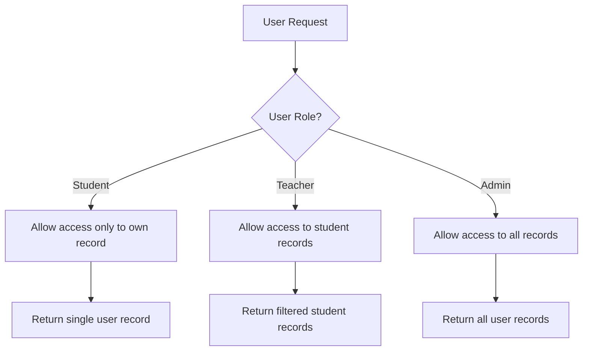
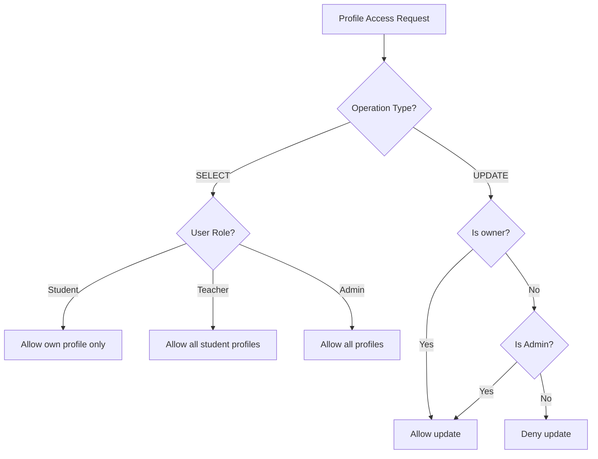
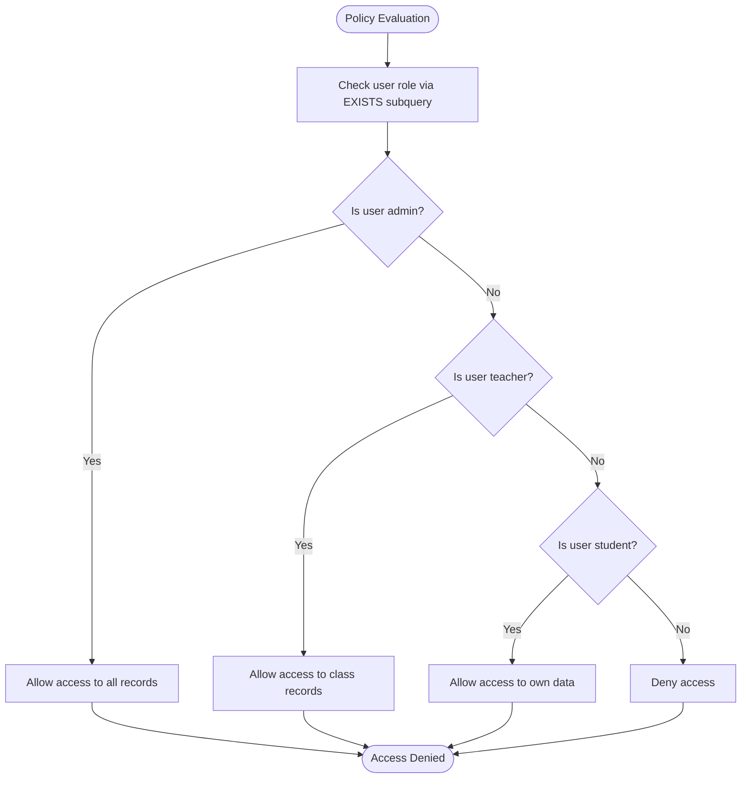
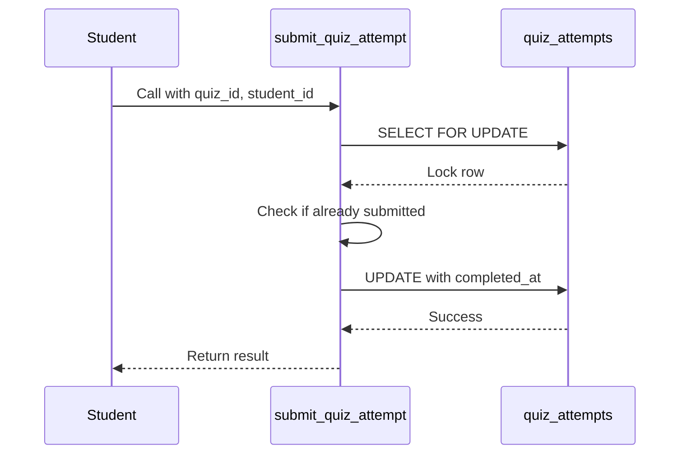
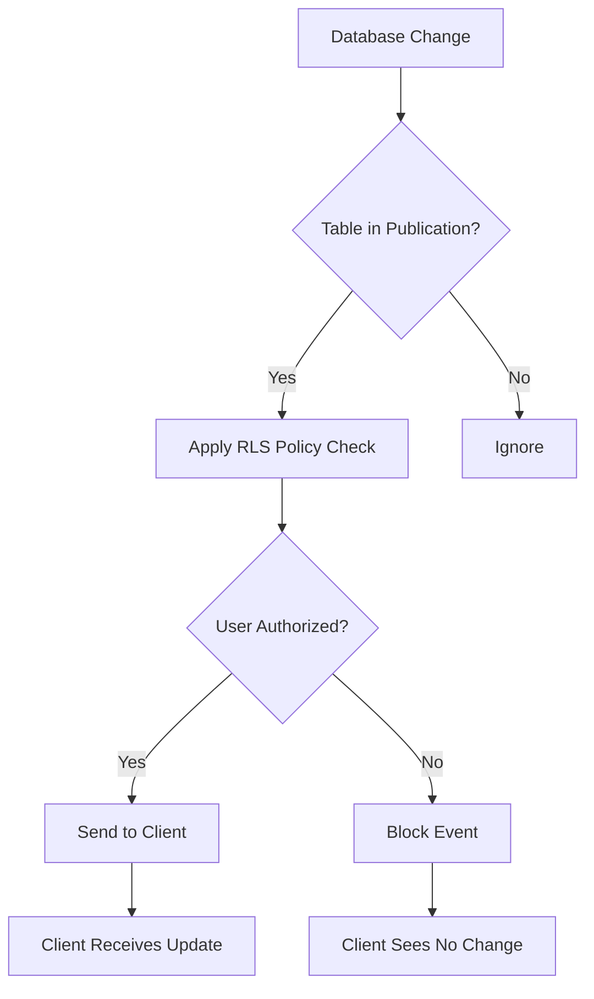
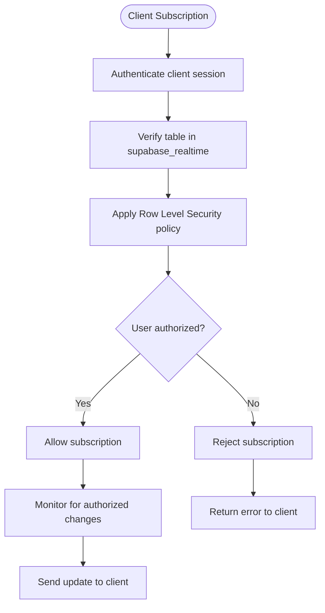
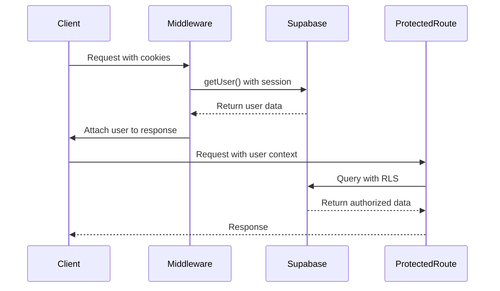
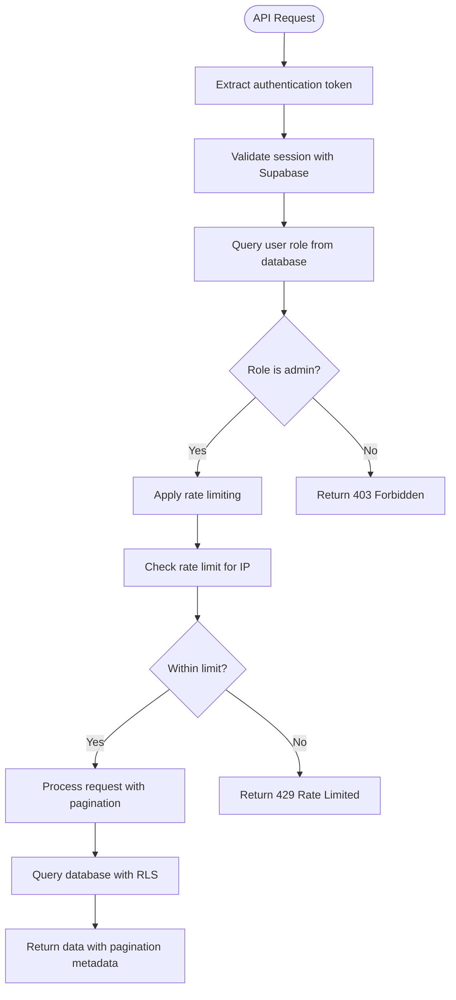
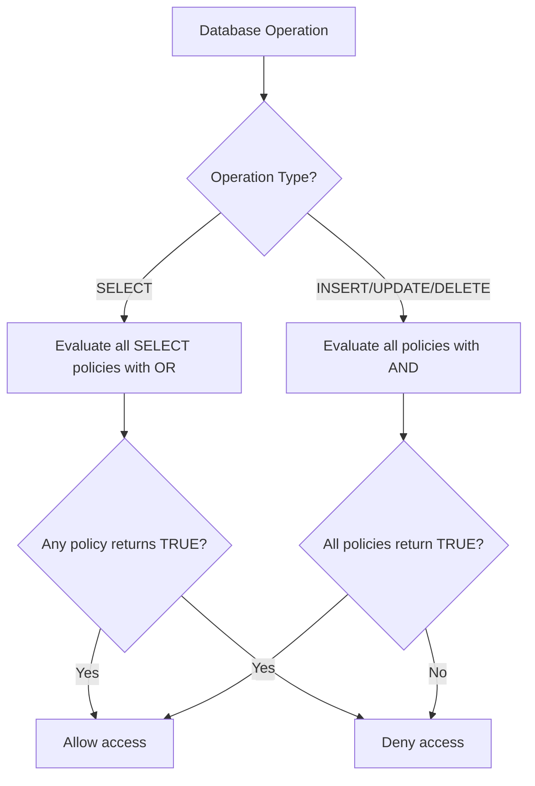

# Row Level Security (RLS) Implementation

<cite>
**Referenced Files in This Document**   
- [20240101000000_secure_rls.sql](file://supabase/migrations/20240101000000_secure_rls.sql)
- [20250228_security_hardening.sql](file://supabase/migrations/20250228_security_hardening.sql)
- [20250226_secure_realtime_rls.sql](file://supabase/migrations/20250226_secure_realtime_rls.sql)
- [middleware.ts](file://lib/supabase/middleware.ts)
- [route.ts](file://app/api/admin/students/route.ts)
- [types.ts](file://lib/supabase/types.ts)
- [database.types.ts](file://lib/database.types.ts)
</cite>

## Table of Contents
1. [Introduction](#introduction)
2. [Core Data Model and Table Relationships](#core-data-model-and-table-relationships)
3. [Row Level Security Policy Implementation](#row-level-security-policy-implementation)
4. [Security Hardening Enhancements](#security-hardening-enhancements)
5. [Realtime Subscription Security](#realtime-subscription-security)
6. [Application-Level Security Integration](#application-level-security-integration)
7. [Policy Enforcement and Access Control Logic](#policy-enforcement-and-access-control-logic)
8. [Common Security Pitfalls and Mitigations](#common-security-pitfalls-and-mitigations)
9. [Best Practices for RLS Auditing and Testing](#best-practices-for-rls-auditing-and-testing)
10. [Conclusion](#conclusion)

## Introduction
This document provides comprehensive documentation for the Row Level Security (RLS) implementation in the School Management System. The RLS framework ensures that users can only access data they are authorized to view based on their role (admin, teacher, or student). The system leverages Supabase's native RLS capabilities to enforce data isolation at the database level, preventing unauthorized access even if application logic is bypassed. This documentation details the security policies defined across core tables including users, grades, attendance_records, student_profiles, and teacher_profiles, explaining how role-based access control is implemented and enforced.

## Core Data Model and Table Relationships
The school management system's data model centers around user roles and their relationships to academic data. The primary tables involved in RLS enforcement are interconnected through foreign key relationships that enable granular access control.

```mermaid
erDiagram
users {
uuid id PK
string email UK
string name
string role
string avatar
boolean is_active
}
student_profiles {
uuid id PK FK
string grade
string section
date enrollment_date
}
teacher_profiles {
uuid id PK FK
string subject
string department
date join_date
}
classes {
uuid id PK
string name
string grade
string section
uuid teacher_id FK
string subject
}
class_students {
uuid id PK
uuid class_id FK
uuid student_id FK
}
grades {
uuid id PK
uuid student_id FK
uuid class_id FK
numeric score
numeric max_score
numeric percentage
numeric grade
string type
date date
}
attendance_records {
uuid id PK
uuid student_id FK
uuid class_id FK
date date
string status
}
users ||--o{ student_profiles : "has"
users ||--o{ teacher_profiles : "has"
users ||--o{ grades : "owns"
users ||--o{ attendance_records : "owns"
classes ||--o{ class_students : "contains"
users ||--o{ class_students : "enrolled"
classes ||--o{ grades : "assesses"
classes ||--o{ attendance_records : "tracks"
```

**Diagram sources**
- [20251219043432_create_users_table.sql](file://supabase/migrations/20251219043432_create_users_table.sql)
- [20251219043440_create_classes_table.sql](file://supabase/migrations/20251219043440_create_classes_table.sql)
- [20251219043454_create_attendance_tables.sql](file://supabase/migrations/20251219043454_create_attendance_tables.sql)
- [20251219043509_create_grades_tables.sql](file://supabase/migrations/20251219043509_create_grades_tables.sql)

**Section sources**
- [20251219043432_create_users_table.sql](file://supabase/migrations/20251219043432_create_users_table.sql#L1-L32)
- [20251219043440_create_classes_table.sql](file://supabase/migrations/20251219043440_create_classes_table.sql#L1-L23)

## Row Level Security Policy Implementation
The RLS implementation follows a principle of least privilege, where access is denied by default and explicitly granted based on user roles and ownership relationships. The initial RLS policies are defined in secure_rls.sql, establishing the foundation for role-based access control across core tables.

### Users Table Policies
The users table implements a tiered access model where different roles have varying levels of visibility:
- Students can only view their own profile information
- Teachers can view student profiles but not other staff members
- Admins have full visibility across all user records



**Diagram sources**
- [20240101000000_secure_rls.sql](file://supabase/migrations/20240101000000_secure_rls.sql#L8-L24)

### Student and Teacher Profile Access
Profile tables (student_profiles and teacher_profiles) implement ownership-based access control, ensuring users can only modify their own profile information while allowing appropriate staff members to view student data.



**Diagram sources**
- [20240101000000_secure_rls.sql](file://supabase/migrations/20240101000000_secure_rls.sql#L26-L38)

### Grades and Attendance Authorization
The grades and attendance_records tables implement context-aware access control, where teachers can manage records for students in their classes, while students can only view their own academic performance data.

```mermaid
graph TD
A[Grades/Attendance Request] --> B{User Role?}
B --> |Student| C[Filter by student_id = auth.uid()]
B --> |Teacher| D[Allow full access to class data]
B --> |Admin| E[Allow access to all records]
C --> F[Return personal records]
D --> G[Return class-specific records]
E --> H[Return all records]
```

**Diagram sources**
- [20240101000000_secure_rls.sql](file://supabase/migrations/20240101000000_secure_rls.sql#L40-L62)

**Section sources**
- [20240101000000_secure_rls.sql](file://supabase/migrations/20240101000000_secure_rls.sql#L1-L62)

## Security Hardening Enhancements
The security_hardening.sql migration introduces critical improvements to the RLS implementation, addressing potential security vulnerabilities and strengthening policy enforcement.

### Column-Level Security
The hardened implementation implements column-level security on the users table, restricting access to sensitive personally identifiable information (PII) such as phone numbers and addresses. Only authenticated users can access a curated set of safe columns, preventing data leakage through direct queries.

```mermaid
graph TD
A[User Query] --> B{Column Requested?}
B --> |id, email, name, role, avatar| C[Allow access]
B --> |phone, address| D[Deny access]
B --> |All columns (*)| E[Apply column-level restriction]
C --> F[Return data]
D --> G[Return error]
E --> H[Return only safe columns]
```

**Diagram sources**
- [20250228_security_hardening.sql](file://supabase/migrations/20250228_security_hardening.sql#L7-L18)

### Strict Policy Conditions
The hardened policies replace overly permissive conditions with explicit role checks, eliminating potential bypass vectors. The implementation uses EXISTS subqueries to verify user roles, providing a more robust authorization mechanism than simple role comparisons.



**Diagram sources**
- [20250228_security_hardening.sql](file://supabase/migrations/20250228_security_hardening.sql#L25-L41)

### Atomic Quiz Submission Protection
The security hardening includes an atomic RPC function for quiz submissions that prevents race conditions and duplicate submissions through row-level locking and unique constraints, ensuring data integrity for high-stakes assessments.



**Diagram sources**
- [20250228_security_hardening.sql](file://supabase/migrations/20250228_security_hardening.sql#L43-L94)

**Section sources**
- [20250228_security_hardening.sql](file://supabase/migrations/20250228_security_hardening.sql#L1-L94)

## Realtime Subscription Security
The secure_realtime_rls.sql migration ensures that real-time subscriptions respect RLS policies, preventing unauthorized clients from listening to data they cannot access.

### Realtime Publication Configuration
The implementation configures the supabase_realtime publication to include only specific tables and enforces RLS checks on all published events, ensuring that the realtime socket layer respects the same security policies as the REST API.



**Diagram sources**
- [20250226_secure_realtime_rls.sql](file://supabase/migrations/20250226_secure_realtime_rls.sql#L1-L30)

### Policy Enforcement Flow
The realtime security implementation follows a strict flow to ensure that no unauthorized data is exposed through WebSocket connections, even if clients attempt to subscribe to protected channels.



**Diagram sources**
- [20250226_secure_realtime_rls.sql](file://supabase/migrations/20250226_secure_realtime_rls.sql#L1-L30)

**Section sources**
- [20250226_secure_realtime_rls.sql](file://supabase/migrations/20250226_secure_realtime_rls.sql#L1-L30)

## Application-Level Security Integration
The RLS implementation is complemented by application-level security measures that provide defense in depth and enhance the overall security posture.

### Middleware Authentication
The Supabase middleware integrates with Next.js to manage user sessions and authentication state, ensuring that all requests are properly authenticated before accessing protected routes.



**Diagram sources**
- [middleware.ts](file://lib/supabase/middleware.ts#L1-L38)

### API Route Authorization
Admin API routes implement additional authorization checks beyond RLS, verifying user roles at the application level to prevent potential bypass scenarios and provide detailed error logging.



**Diagram sources**
- [route.ts](file://app/api/admin/students/route.ts#L1-L116)

**Section sources**
- [middleware.ts](file://lib/supabase/middleware.ts#L1-L38)
- [route.ts](file://app/api/admin/students/route.ts#L1-L116)

## Policy Enforcement and Access Control Logic
The RLS implementation follows a cascading authorization model where policies are evaluated in a specific order to determine access rights.

### Policy Evaluation Hierarchy
When a database operation is requested, PostgreSQL evaluates all applicable RLS policies using a logical OR for SELECT operations and a logical AND for INSERT, UPDATE, and DELETE operations, ensuring comprehensive access control.



### Role-Based Access Matrix
The system implements a clear access matrix that defines what each role can do with each core table:

<table>
  <tr>
    <th>Table</th>
    <th>Students</th>
    <th>Teachers</th>
    <th>Admins</th>
  </tr>
  <tr>
    <td>users</td>
    <td>View own profile</td>
    <td>View student profiles</td>
    <td>Full access</td>
  </tr>
  <tr>
    <td>student_profiles</td>
    <td>View and update own</td>
    <td>View all</td>
    <td>View and update all</td>
  </tr>
  <tr>
    <td>teacher_profiles</td>
    <td>No access</td>
    <td>View and update own</td>
    <td>View and update all</td>
  </tr>
  <tr>
    <td>grades</td>
    <td>View own</td>
    <td>Manage class grades</td>
    <td>Full access</td>
  </tr>
  <tr>
    <td>attendance_records</td>
    <td>View own</td>
    <td>Manage class attendance</td>
    <td>Full access</td>
  </tr>
</table>

**Section sources**
- [20240101000000_secure_rls.sql](file://supabase/migrations/20240101000000_secure_rls.sql#L1-L62)
- [20250228_security_hardening.sql](file://supabase/migrations/20250228_security_hardening.sql#L1-L94)

## Common Security Pitfalls and Mitigations
The RLS implementation addresses several common security pitfalls that can compromise data isolation in multi-tenant applications.

### Over-Permissive Policies
Early versions of the RLS policies used overly permissive conditions (USING true) that could allow unauthorized access. The hardened implementation replaces these with explicit role checks and ownership verification.

**Mitigation**: The tighten_rls_policies.sql migration drops permissive policies and replaces them with strict user-scoped checks using auth.uid() = id conditions.

### Policy Conflicts
When multiple policies apply to the same operation, conflicts can arise that may lead to unexpected access patterns. The system resolves this by following PostgreSQL's RLS evaluation rules.

**Mitigation**: The implementation carefully orders policy creation and uses descriptive names to avoid conflicts, with admin policies designed to coexist with user-specific policies.

### Performance Impacts
Complex policy conditions with multiple joins can impact query performance, especially for high-frequency operations like attendance tracking.

**Mitigation**: The system uses EXISTS subqueries rather than JOINs in policy conditions, and implements database indexes on frequently queried columns to maintain performance.

**Section sources**
- [20260107115657_tighten_rls_policies.sql](file://supabase/migrations/20260107115657_tighten_rls_policies.sql#L1-L117)
- [20250228_security_hardening.sql](file://supabase/migrations/20250228_security_hardening.sql#L1-L94)

## Best Practices for RLS Auditing and Testing
Effective RLS implementation requires regular auditing and testing to ensure policies are working as intended and no security gaps exist.

### Direct SQL Testing
The most reliable way to test RLS policies is through direct SQL queries using different user roles, simulating the auth.uid() function to verify access controls.

```sql
-- Test as student
SELECT set_config('role', 'authenticated', false);
SELECT set_config('request.jwt.claim.sub', 'student-user-id', false);
SELECT * FROM grades; -- Should only return student's own grades

-- Test as teacher  
SELECT set_config('role', 'authenticated', false);
SELECT set_config('request.jwt.claim.sub', 'teacher-user-id', false);
SELECT * FROM grades; -- Should return all grades for teacher's classes

-- Test as admin
SELECT set_config('role', 'authenticated', false);
SELECT set_config('request.jwt.claim.sub', 'admin-user-id', false);
SELECT * FROM grades; -- Should return all grades
```

### Policy Documentation
Maintain comprehensive documentation of all RLS policies, including their purpose, conditions, and expected behavior for each user role.

### Regular Audits
Conduct regular security audits to:
- Verify all tables have RLS enabled
- Check for overly permissive policies
- Ensure policy conditions are still valid after schema changes
- Test edge cases and potential bypass vectors

**Section sources**
- [20240101000000_secure_rls.sql](file://supabase/migrations/20240101000000_secure_rls.sql#L1-L62)
- [20250228_security_hardening.sql](file://supabase/migrations/20250228_security_hardening.sql#L1-L94)
- [20260107115657_tighten_rls_policies.sql](file://supabase/migrations/20260107115657_tighten_rls_policies.sql#L1-L117)

## Conclusion
The Row Level Security implementation in the School Management System provides a robust foundation for data protection and access control. By leveraging Supabase's native RLS capabilities, the system ensures that users can only access data they are authorized to view based on their role and ownership relationships. The multi-layered approach combines database-level policies with application-level security measures to create defense in depth, protecting sensitive student information while enabling appropriate access for teachers and administrators. Regular auditing and testing are essential to maintain the integrity of the RLS implementation as the system evolves.