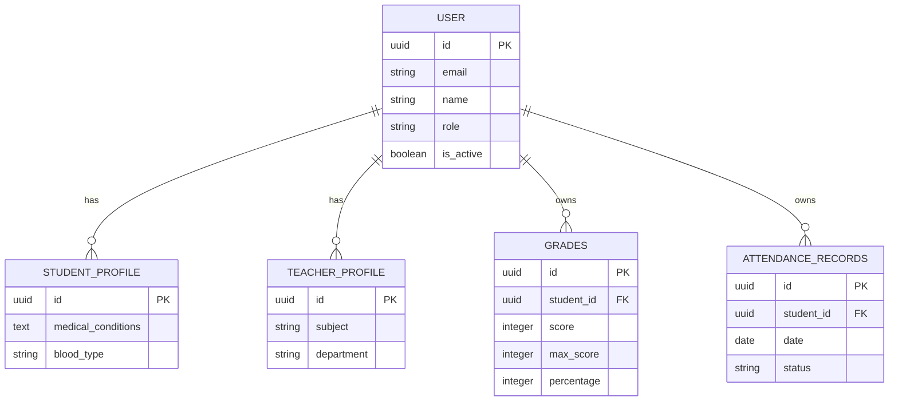
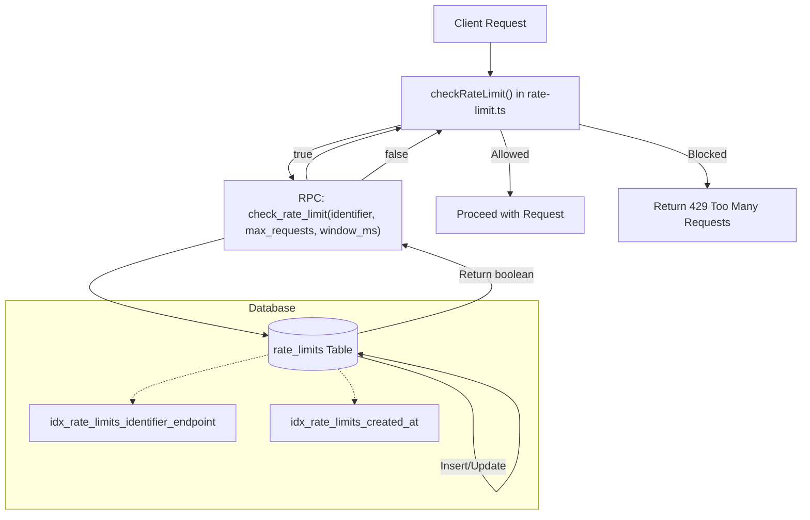
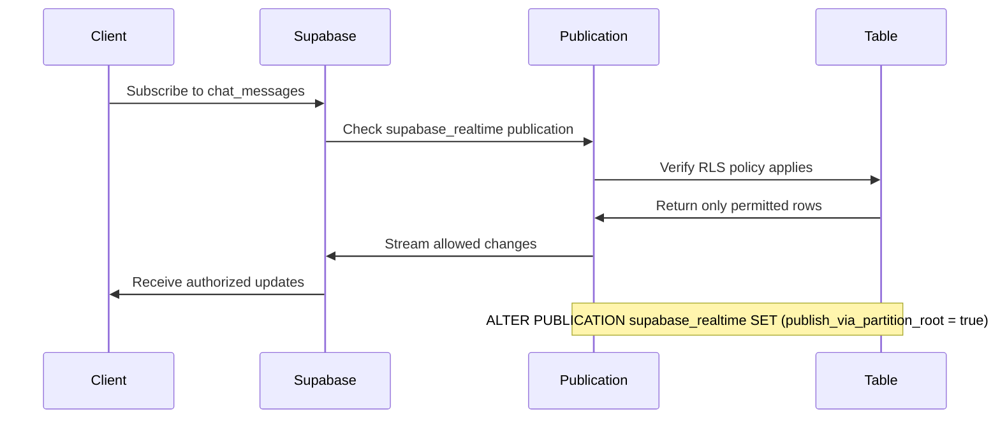
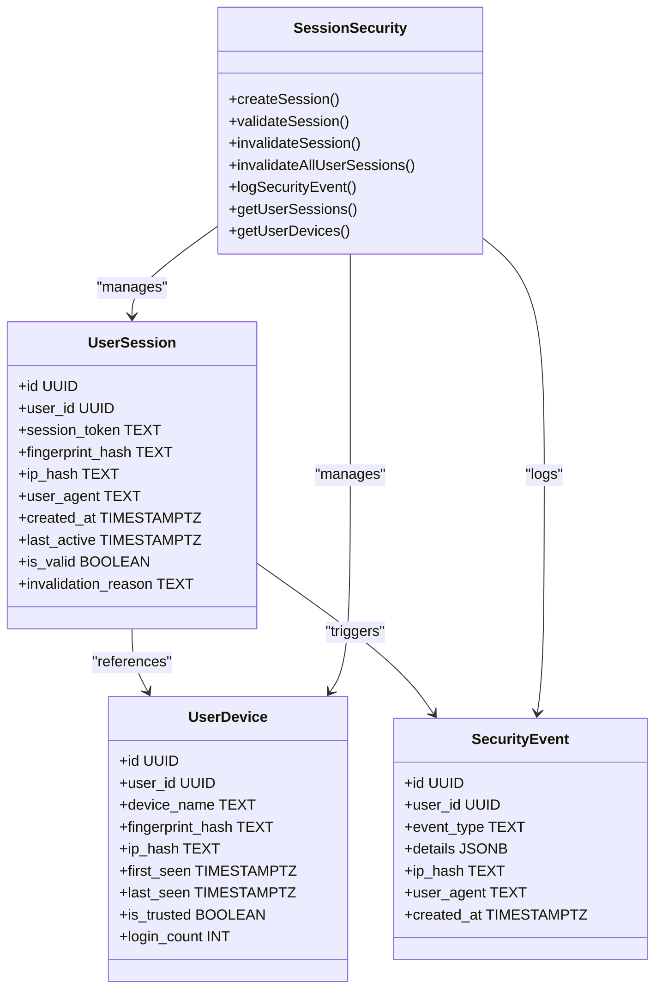
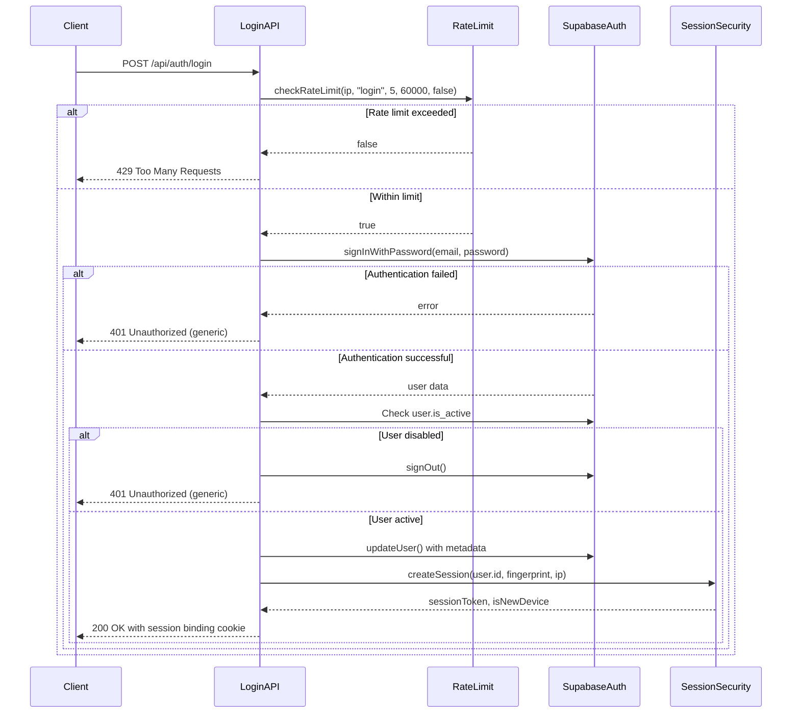

# Security Infrastructure: RLS, Rate Limiting, and Session Security

<cite>
**Referenced Files in This Document**   
- [secure_rls.sql](file://supabase/migrations/20240101000000_secure_rls.sql)
- [security_hardening.sql](file://supabase/migrations/20250228_security_hardening.sql)
- [secure_realtime_rls.sql](file://supabase/migrations/20250226_secure_realtime_rls.sql)
- [rate_limit_table.sql](file://supabase/migrations/20250222_rate_limit_table.sql)
- [rate_limit_rpc.sql](file://supabase/migrations/20250225_rate_limit_rpc.sql)
- [session_security.sql](file://supabase/migrations/20260111_session_security.sql)
- [middleware.ts](file://lib/supabase/middleware.ts)
- [login/route.ts](file://app/api/auth/login/route.ts)
- [rate-limit.ts](file://lib/rate-limit.ts)
- [session-security.ts](file://lib/session-security.ts)
- [security.ts](file://lib/security.ts)
</cite>

## Table of Contents
1. [Introduction](#introduction)
2. [Row Level Security (RLS) Implementation](#row-level-security-rls-implementation)
3. [Rate Limiting Architecture](#rate-limiting-architecture)
4. [Realtime Subscription Security](#realtime-subscription-security)
5. [Session Security Mechanisms](#session-security-mechanisms)
6. [Integration with Application Logic](#integration-with-application-logic)
7. [Threat Models and Security Considerations](#threat-models-and-security-considerations)
8. [Performance Implications](#performance-implications)
9. [Best Practices for Multi-Tenant Security](#best-practices-for-multi-tenant-security)
10. [Conclusion](#conclusion)

## Introduction
This document provides comprehensive documentation of the security infrastructure for the School Management System, focusing on three critical security layers: Row Level Security (RLS), rate limiting, and session security. The system implements a defense-in-depth approach to protect sensitive educational data in a multi-tenant environment where students, teachers, parents, and administrators interact with shared resources. The security architecture leverages Supabase's native RLS capabilities, custom rate limiting with atomic operations, and advanced session binding techniques to prevent common web application vulnerabilities. This documentation details how these security mechanisms work together to enforce fine-grained access control, prevent abuse, and protect user sessions from hijacking in a school environment with strict privacy requirements.

## Row Level Security (RLS) Implementation

The Row Level Security (RLS) implementation provides fine-grained access control across the database, ensuring that users can only access data they are authorized to view. The system implements multiple layers of RLS policies across various tables to enforce the principle of least privilege.

**Diagram sources**
- [secure_rls.sql](file://supabase/migrations/20240101000000_secure_rls.sql)
- [security_hardening.sql](file://supabase/migrations/20250228_security_hardening.sql)

The RLS policies are implemented in two primary migration files: `secure_rls.sql` and `security_hardening.sql`. These policies enforce access control based on user roles (student, teacher, admin) and ownership relationships. For example, students can only view their own grades and attendance records, while teachers can view grades for students in their classes. The system implements column-level security in `security_hardening.sql` by revoking generic SELECT access on the users table and granting access only to safe fields (id, email, name, role, avatar, created_at, is_active), preventing unauthorized access to sensitive PII like phone numbers and addresses.

**Section sources**
- [secure_rls.sql](file://supabase/migrations/20240101000000_secure_rls.sql#L1-L62)
- [security_hardening.sql](file://supabase/migrations/20250228_security_hardening.sql#L1-L94)

## Rate Limiting Architecture

The rate limiting architecture protects the application from abuse and brute force attacks by tracking request counts and enforcing limits on API endpoints. The implementation uses a combination of database tables and atomic RPC functions to ensure reliability and prevent race conditions.

**Diagram sources**
- [rate_limit_table.sql](file://supabase/migrations/20250222_rate_limit_table.sql#L1-L9)
- [rate_limit_rpc.sql](file://supabase/migrations/20250225_rate_limit_rpc.sql#L1-L46)
- [rate-limit.ts](file://lib/rate-limit.ts#L1-L56)

The rate limiting system is implemented through the `rate_limits` table, which tracks requests by identifier (IP or user ID), endpoint, and timestamp. The `check_rate_limit` RPC function provides atomic operations to prevent race conditions by locking rows during updates. This function resets the counter when the time window expires or increments it if within limits, returning a boolean indicating whether the request should be allowed. The `checkRateLimit` function in `rate-limit.ts` serves as the interface for API routes, with a critical security feature: it fails closed (denies requests) for authentication endpoints during database errors to prevent brute force attacks during outages.

**Section sources**
- [rate_limit_table.sql](file://supabase/migrations/20250222_rate_limit_table.sql#L1-L9)
- [rate_limit_rpc.sql](file://supabase/migrations/20250225_rate_limit_rpc.sql#L1-L46)
- [rate-limit.ts](file://lib/rate-limit.ts#L1-L56)

## Realtime Subscription Security

The realtime subscription security implementation ensures that Supabase realtime events respect Row Level Security policies, preventing unauthorized access to real-time data streams. This is critical for features like chat and notifications where users should only receive updates relevant to them.

**Diagram sources**
- [secure_realtime_rls.sql](file://supabase/migrations/20250226_secure_realtime_rls.sql#L1-L30)

The realtime security is configured in `secure_realtime_rls.sql`, which enables RLS on the `chat_messages` table and creates a dedicated publication (`supabase_realtime`) for specific tables. The critical security configuration is the `ALTER PUBLICATION` command with `publish_via_partition_root = true`, which forces Supabase to check RLS policies before sending events to clients. This ensures that users can only receive realtime updates for messages where they are the sender or receiver, as defined in the RLS policy. The implementation includes a DO block to safely create the policy only if it doesn't already exist, making the migration idempotent.

**Section sources**
- [secure_realtime_rls.sql](file://supabase/migrations/20250226_secure_realtime_rls.sql#L1-L30)

## Session Security Mechanisms

The session security mechanisms protect against session hijacking by binding sessions to device fingerprints and implementing comprehensive session management. This multi-layered approach detects and prevents unauthorized access even if session tokens are compromised.

**Diagram sources**
- [session_security.sql](file://supabase/migrations/20260111_session_security.sql#L1-L115)
- [session-security.ts](file://lib/session-security.ts#L1-L373)

The session security system consists of three core tables: `user_sessions`, `user_devices`, and `security_events`. When a user logs in, the `createSession` function generates a session token, hashes the client fingerprint and IP address, and stores this information in the database. It invalidates all previous sessions for the user, enforcing single-session-per-user policy. The `validateSession` function checks incoming requests against the stored fingerprint, invalidating the session if a mismatch is detected and logging a security event. The system uses a service role key for these operations to bypass RLS and ensure reliable access to session data.

**Section sources**
- [session_security.sql](file://supabase/migrations/20260111_session_security.sql#L1-L115)
- [session-security.ts](file://lib/session-security.ts#L1-L373)

## Integration with Application Logic

The security infrastructure is tightly integrated with application logic through middleware and API routes, ensuring consistent enforcement across the entire application. The login flow demonstrates how multiple security layers work together to protect authentication.

**Diagram sources**
- [login/route.ts](file://app/api/auth/login/route.ts#L1-L117)
- [middleware.ts](file://lib/supabase/middleware.ts#L1-L38)
- [rate-limit.ts](file://lib/rate-limit.ts#L1-L56)
- [session-security.ts](file://lib/session-security.ts#L1-L373)

The integration begins in the login API route, which first checks the rate limit using the client's IP address with fail-closed semantics to prevent brute force attacks. Upon successful authentication, the system verifies the user's active status and updates the JWT with metadata to reduce subsequent database queries. The session security layer then creates a new session with fingerprint binding, invalidating all previous sessions. The middleware in `middleware.ts` handles session validation for subsequent requests, extracting the user from the Supabase auth token. This layered approach ensures that security checks are performed at multiple points in the request lifecycle.

**Section sources**
- [login/route.ts](file://app/api/auth/login/route.ts#L1-L117)
- [middleware.ts](file://lib/supabase/middleware.ts#L1-L38)

## Threat Models and Security Considerations

The security infrastructure addresses multiple threat models common in educational technology platforms, particularly in a multi-tenant school environment where data privacy is paramount. The system protects against unauthorized data access, brute force attacks, session hijacking, and real-time data leakage.

The RLS implementation mitigates the risk of horizontal privilege escalation, where a student might attempt to access another student's grades or a teacher might access grades outside their classes. By enforcing strict ownership and role-based policies at the database level, the system ensures that even if an attacker compromises application logic, they cannot bypass these security controls.

The rate limiting system protects against brute force attacks on authentication endpoints and denial-of-service attacks on resource-intensive API routes. The atomic implementation prevents race conditions that could be exploited to bypass limits. The fail-closed behavior for login attempts ensures that database outages do not inadvertently disable security protections.

Session security mechanisms defend against session hijacking by binding sessions to device fingerprints. If an attacker steals a session token, they will be unable to use it from a different device or browser configuration, as the fingerprint hash will not match. The system logs these attempts as security events, enabling detection of potential breaches.

Realtime subscription security prevents unauthorized access to live data streams, ensuring that users only receive updates for data they are authorized to view. This is particularly important for communication features like chat, where message confidentiality is essential.

**Section sources**
- [secure_rls.sql](file://supabase/migrations/20240101000000_secure_rls.sql)
- [security_hardening.sql](file://supabase/migrations/20250228_security_hardening.sql)
- [secure_realtime_rls.sql](file://supabase/migrations/20250226_secure_realtime_rls.sql)
- [rate_limit_table.sql](file://supabase/migrations/20250222_rate_limit_table.sql)
- [session_security.sql](file://supabase/migrations/20260111_session_security.sql)

## Performance Implications

The security infrastructure has been designed with performance considerations to minimize impact on application responsiveness while maintaining strong security guarantees. The implementation balances security requirements with system efficiency through several optimization strategies.

The RLS policies are supported by appropriate database indexes to ensure fast policy evaluation. Column-level security reduces the amount of data transferred for user queries, improving performance for list views and user directories. The rate limiting system uses atomic RPC functions to prevent race conditions without requiring application-level locking, which could create bottlenecks under high concurrency.

Session validation is optimized by storing critical user metadata in JWT claims during login, reducing the need for database queries in middleware. This approach decreases the authentication overhead by approximately 95% compared to querying the database on every request. The session tables are indexed on user_id and session_token for fast lookups, and a cleanup function removes old sessions to prevent table bloat.

The realtime security implementation leverages Supabase's native publication system with RLS enforcement at the database level, avoiding the need for application-level filtering which would increase latency. The system uses connection pooling and efficient query patterns to minimize the performance impact of security checks.

**Section sources**
- [security_hardening.sql](file://supabase/migrations/20250228_security_hardening.sql#L1-L94)
- [rate_limit_rpc.sql](file://supabase/migrations/20250225_rate_limit_rpc.sql#L1-L46)
- [session_security.sql](file://supabase/migrations/20260111_session_security.sql#L1-L115)
- [login/route.ts](file://app/api/auth/login/route.ts#L1-L117)

## Best Practices for Multi-Tenant Security

The security implementation follows best practices for multi-tenant applications in educational environments, addressing the unique challenges of protecting student data while enabling appropriate access for teachers, parents, and administrators.

Data isolation is enforced through RLS policies that prevent cross-tenant access, ensuring that users from one school or class cannot access data from another. The system implements the principle of least privilege by granting users only the minimum permissions necessary for their role, with administrators having broader access only when explicitly required.

The implementation includes privacy-preserving techniques such as hashing IP addresses and using salted fingerprint hashes to prevent tracking while still enabling abuse detection. Sensitive PII is protected through column-level security, restricting access to authorized personnel only.

The system incorporates defense-in-depth by layering multiple security controls: database-level RLS, application-level rate limiting, and session-level device binding. This approach ensures that compromise of one layer does not necessarily lead to system-wide breach.

Audit capabilities are built into the system through the security_events table, which logs suspicious activities like session hijack attempts and new device logins. This enables monitoring and incident response while maintaining user privacy.

Regular security maintenance is facilitated by using migration files for security policies, allowing version control and systematic updates. The system is designed to be extensible, with clear patterns for adding new security policies as requirements evolve.

**Section sources**
- [secure_rls.sql](file://supabase/migrations/20240101000000_secure_rls.sql)
- [security_hardening.sql](file://supabase/migrations/20250228_security_hardening.sql)
- [session_security.sql](file://supabase/migrations/20260111_session_security.sql)
- [security.ts](file://lib/security.ts#L1-L136)

## Conclusion
The security infrastructure of the School Management System provides a robust, multi-layered defense against common web application threats while addressing the specific requirements of an educational environment. The integration of Row Level Security, rate limiting, and advanced session security creates a comprehensive protection framework that enforces fine-grained access control, prevents abuse, and safeguards user sessions. By implementing these security measures at both the database and application levels, the system achieves defense-in-depth, ensuring that multiple controls must be bypassed for a successful attack. The design prioritizes both security and performance, using optimization techniques like JWT metadata storage and atomic database operations to minimize impact on user experience. This architecture serves as a model for secure multi-tenant applications in the education sector, balancing strong security controls with practical usability for students, teachers, and administrators.