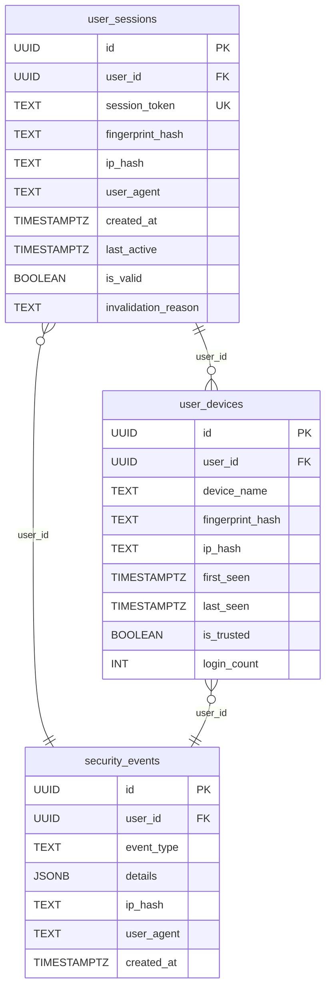
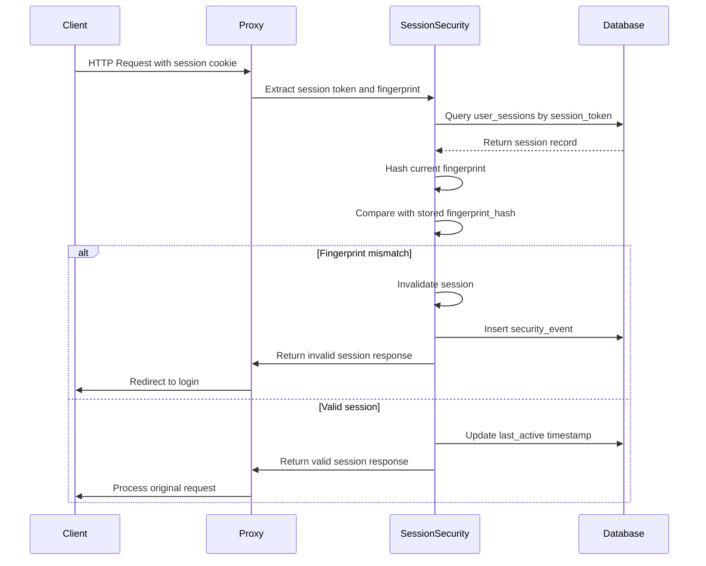
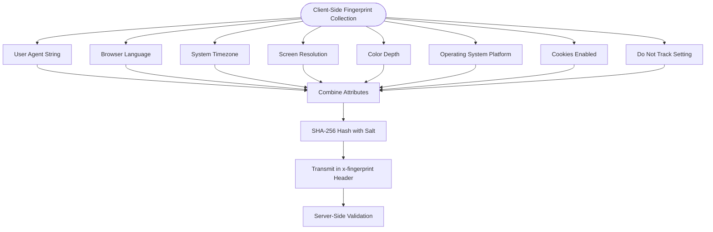

# Session Security Architecture

<cite>
**Referenced Files in This Document**   
- [session_security.sql](file://supabase/migrations/20260111_session_security.sql)
- [middleware.ts](file://lib/supabase/middleware.ts)
- [session-security.ts](file://lib/session-security.ts)
- [security.ts](file://lib/security.ts)
- [proxy.ts](file://proxy.ts)
- [fingerprint.ts](file://lib/fingerprint.ts)
- [audit-logs.ts](file://lib/supabase/audit-logs.ts)
</cite>

## Table of Contents
1. [Introduction](#introduction)
2. [Core Data Structures](#core-data-structures)
3. [Session Binding and Validation](#session-binding-and-validation)
4. [Security Event Management](#security-event-management)
5. [Access Control and RLS Policies](#access-control-and-rls-policies)
6. [Session Management Functions](#session-management-functions)
7. [Client-Side Implementation](#client-side-implementation)
8. [Threat Detection and Mitigation](#threat-detection-and-mitigation)
9. [Privacy Considerations](#privacy-considerations)
10. [Best Practices](#best-practices)

## Introduction

The session security infrastructure provides robust protection against session hijacking and unauthorized access by binding user sessions to device fingerprints and IP addresses. This architecture ensures that even if session tokens are compromised, attackers cannot use them from different devices or locations without detection. The system combines database-level security with application-layer validation to create a comprehensive defense mechanism for user authentication and session management.

**Section sources**
- [session_security.sql](file://supabase/migrations/20260111_session_security.sql#L1-L115)

## Core Data Structures

The session security system is built around three core tables that work together to track user sessions, manage trusted devices, and log security events.



**Diagram sources**
- [session_security.sql](file://supabase/migrations/20260111_session_security.sql#L5-L34)

### User Sessions Table

The `user_sessions` table tracks active user sessions with critical security information:

- **fingerprint_hash**: SHA-256 hash of the browser fingerprint, binding the session to a specific device
- **ip_hash**: Hashed IP address for privacy-preserving location tracking
- **session_token**: Unique token linked to the Supabase authentication session
- **is_valid**: Boolean flag indicating whether the session is active
- **invalidation_reason**: Text field explaining why a session was invalidated

The table includes indexes on `user_id`, `session_token`, and a partial index on valid sessions to ensure fast lookups during authentication flows.

**Section sources**
- [session_security.sql](file://supabase/migrations/20260111_session_security.sql#L5-L19)

### User Devices Table

The `user_devices` table manages trusted devices for each user:

- **fingerprint_hash**: Device fingerprint hash used as a unique identifier
- **is_trusted**: Boolean indicating whether the user has explicitly trusted this device
- **login_count**: Counter tracking how many times the user has logged in from this device
- **first_seen** and **last_seen**: Timestamps for device history tracking

This table enables users to view and manage their active devices, with the ability to trust frequently used devices while maintaining security for new or unrecognized ones.

**Section sources**
- [session_security.sql](file://supabase/migrations/20260111_session_security.sql#L22-L34)

### Security Events Table

The `security_events` table logs suspicious activities and security-related events:

- **event_type**: Categorical identifier for the type of security event
- **details**: JSONB field storing additional context about the event
- **ip_hash** and **user_agent**: Information about the request that triggered the event

This table serves as an audit trail for security monitoring and incident response, allowing administrators to investigate potential breaches and users to monitor their account activity.

**Section sources**
- [session_security.sql](file://supabase/migrations/20260111_session_security.sql#L37-L45)

## Session Binding and Validation

The session security system implements a multi-layered approach to validate user sessions on each request, ensuring that sessions cannot be hijacked or used from unauthorized devices.



**Diagram sources**
- [proxy.ts](file://proxy.ts#L111-L146)
- [session-security.ts](file://lib/session-security.ts#L154-L227)

### Fingerprint Generation and Hashing

The system collects a comprehensive set of browser characteristics to create a unique device fingerprint:



**Diagram sources**
- [fingerprint.ts](file://lib/fingerprint.ts#L22-L33)
- [session-security.ts](file://lib/session-security.ts#L45-L56)

The fingerprint includes non-PII browser characteristics such as user agent, language, timezone, screen resolution, color depth, platform, cookies enabled status, and do-not-track setting. This combination creates a unique identifier for each device while respecting user privacy.

**Section sources**
- [fingerprint.ts](file://lib/fingerprint.ts#L8-L17)

### Session Validation Process

The validation process occurs on every authenticated request through the proxy middleware. When a user makes a request, the system:

1. Extracts the session binding token from cookies
2. Retrieves the fingerprint data from the `x-fingerprint` header
3. Hashes the current fingerprint using a salt from environment variables
4. Queries the database for the session record matching the token
5. Compares the stored fingerprint hash with the current one
6. Invalidates the session and logs a security event if a mismatch is detected

This process ensures that sessions are tightly bound to the specific device and browser used during login, preventing session hijacking attacks.

**Section sources**
- [proxy.ts](file://proxy.ts#L111-L146)
- [session-security.ts](file://lib/session-security.ts#L154-L227)

## Security Event Management

The security event system provides comprehensive logging and monitoring capabilities for detecting and responding to potential security threats.

### Security Event Types

The system logs several types of security events:

- **session_hijack_attempt**: Triggered when a session is used from a device with a different fingerprint
- **new_device**: Logged when a user logs in from a previously unseen device
- **ip_change_detected**: Recorded when a session is accessed from a different IP address (when IP changes are not allowed)
- **fingerprint_mismatch**: Specific event for fingerprint validation failures

These events include detailed context in the `details` JSONB field, such as the original and attempted fingerprints, IP addresses, and user agent strings (with sensitive portions truncated for privacy).

**Section sources**
- [session-security.ts](file://lib/session-security.ts#L280-L294)

### Event Logging Implementation

Security events are logged through the `logSecurityEvent` function, which writes to the `security_events` table using the service role key to bypass RLS policies. The function captures:

- The user ID (nullable for events that occur before authentication)
- Event type as a descriptive string
- Detailed context in JSON format
- Hashed IP address for privacy
- User agent string for browser identification

The logging system is configurable via the `SESSION_CONFIG.LOG_EVENTS` flag, allowing administrators to enable or disable event logging as needed.

**Section sources**
- [session-security.ts](file://lib/session-security.ts#L278-L298)

## Access Control and RLS Policies

The system implements strict access controls through Row Level Security (RLS) policies to ensure data isolation and privacy.

```mermaid
graph TD
A[Authenticated User] --> B{Request Type}
B --> C[SELECT on user_sessions]
B --> D[SELECT on user_devices]
B --> E[UPDATE on user_devices]
B --> F[SELECT on security_events]
C --> G[Policy: auth.uid() = user_id]
D --> G
E --> G
F --> H[Policy: auth.uid() = user_id]
I[Admin User] --> J[SELECT on security_events]
J --> K[Policy: Allows access to all events]
```

**Diagram sources**
- [session_security.sql](file://supabase/migrations/20260111_session_security.sql#L63-L75)

### RLS Policy Implementation

The following RLS policies are enforced:

- **Users can view own sessions**: Users can only SELECT from `user_sessions` where `user_id` matches their authenticated ID
- **Users can view own devices**: Users can only SELECT from `user_devices` where `user_id` matches their authenticated ID
- **Users can update own devices**: Users can only UPDATE `user_devices` where `user_id` matches their authenticated ID
- **Users can view own security events**: Users can only SELECT from `security_events` where `user_id` matches their authenticated ID

These policies ensure that users can only access their own session and device information, preventing unauthorized access to other users' data.

**Section sources**
- [session_security.sql](file://supabase/migrations/20260111_session_security.sql#L63-L75)

## Session Management Functions

The system provides server-side functions for managing sessions and performing maintenance tasks.

### Invalidate User Sessions Function

The `invalidate_user_sessions` function provides the "logout from all devices" functionality:

```sql
CREATE OR REPLACE FUNCTION invalidate_user_sessions(target_user_id UUID, reason TEXT DEFAULT 'manual_logout')
RETURNS INT
LANGUAGE plpgsql
SECURITY DEFINER
AS $$
DECLARE
  affected_count INT;
BEGIN
  UPDATE user_sessions 
  SET is_valid = FALSE, invalidation_reason = reason
  WHERE user_id = target_user_id AND is_valid = TRUE;
  
  GET DIAGNOSTICS affected_count = ROW_COUNT;
  RETURN affected_count;
END;
$$;
```

This function invalidates all active sessions for a specified user, returning the count of affected sessions. It's used both for user-initiated logout from all devices and for security-related session invalidation (e.g., when a password is changed).

**Section sources**
- [session_security.sql](file://supabase/migrations/20260111_session_security.sql#L80-L95)

### Cleanup Old Sessions Function

The `cleanup_old_sessions` function performs automated maintenance by removing stale session records:

```sql
CREATE OR REPLACE FUNCTION cleanup_old_sessions()
RETURNS INT
LANGUAGE plpgsql
SECURITY DEFINER
AS $$
DECLARE
  deleted_count INT;
BEGIN
  DELETE FROM user_sessions 
  WHERE created_at < NOW() - INTERVAL '30 days'
     OR (is_valid = FALSE AND last_active < NOW() - INTERVAL '7 days');
  
  GET DIAGNOSTICS deleted_count = ROW_COUNT;
  RETURN deleted_count;
END;
$$;
```

This function removes sessions that are either older than 30 days (regardless of validity) or invalid sessions that haven't been active for more than 7 days. This cleanup prevents the database from accumulating obsolete session records while maintaining a reasonable audit trail.

**Section sources**
- [session_security.sql](file://supabase/migrations/20260111_session_security.sql#L98-L114)

## Client-Side Implementation

The client-side implementation collects fingerprint data and transmits it with each request to enable session validation.

### Fingerprint Collection

The `generateFingerprint` function collects browser characteristics:

```typescript
export function generateFingerprint(): ClientFingerprint {
  return {
    userAgent: navigator.userAgent,
    language: navigator.language,
    timezone: Intl.DateTimeFormat().resolvedOptions().timeZone,
    screenResolution: `${screen.width}x${screen.height}`,
    colorDepth: screen.colorDepth,
    platform: navigator.platform,
    cookiesEnabled: navigator.cookieEnabled,
    doNotTrack: navigator.doNotTrack,
  }
}
```

This fingerprint is generated client-side and sent in the `x-fingerprint` header with each request to protected routes.

**Section sources**
- [fingerprint.ts](file://lib/fingerprint.ts#L22-L33)

### Secure Fetch Implementation

The system includes a `secureFetch` wrapper that automatically adds the fingerprint header to requests:

```typescript
export async function secureFetch(
  url: string,
  options: RequestInit = {}
): Promise<Response> {
  const fingerprint = generateFingerprint();
  
  const headers = new Headers(options.headers);
  headers.set('x-fingerprint', JSON.stringify(fingerprint));
  
  return fetch(url, {
    ...options,
    headers,
  });
}
```

Additionally, a global fetch interceptor can be set up to automatically add fingerprints to all API requests, ensuring consistent security across the application.

**Section sources**
- [secure-fetch.ts](file://lib/secure-fetch.ts#L9-L22)

## Threat Detection and Mitigation

The session security system is designed to detect and mitigate various types of threats to user accounts.

### Session Hijacking Detection

The primary defense against session hijacking is the fingerprint binding mechanism. When an attacker attempts to use a stolen session token from a different device:

1. The client sends the request with its current fingerprint
2. The server hashes the received fingerprint
3. The server compares the hash with the one stored in the session record
4. A mismatch triggers session invalidation and security event logging
5. The user is automatically logged out and must re-authenticate

This approach effectively prevents cookie theft attacks, as the stolen session token cannot be used from a different device or browser.

**Section sources**
- [session-security.ts](file://lib/session-security.ts#L176-L197)

### Concurrent Login Detection

The system can detect concurrent logins from different locations by analyzing the `user_sessions` table. When a user logs in, the `createSession` function automatically invalidates all previous sessions for that user:

```typescript
await supabaseAdmin.rpc('invalidate_user_sessions', {
  target_user_id: userId,
  reason: 'new_login'
})
```

This single-session enforcement ensures that only one active session exists per user at any time, preventing concurrent access from multiple locations. If a user attempts to log in from a second device, their first session is immediately terminated.

**Section sources**
- [session-security.ts](file://lib/session-security.ts#L89-L92)

### Anomaly Detection

The system can be extended to detect more sophisticated attack patterns:

- **Rapid IP changes**: Frequent IP address changes within a short timeframe may indicate proxy or VPN usage
- **Unusual login times**: Logins occurring at atypical hours for the user
- **Geographic impossibility**: Logins from geographically distant locations within a timeframe that makes physical travel impossible

These detection mechanisms can be implemented by analyzing the sequence of security events and session records over time.

## Privacy Considerations

The session security system incorporates several privacy-preserving measures to protect user data while maintaining security.

### IP Address Hashing

IP addresses are never stored in plaintext. Instead, they are hashed using SHA-256 with a salt:

```typescript
export function hashIpAddress(ip: string): string {
  const salt = process.env.IP_HASH_SALT || process.env.QR_SECRET || 'default-ip-salt';
  return crypto.createHash('sha256').update(ip + salt).digest('hex').slice(0, 32);
}
```

This approach allows the system to detect when a session is accessed from a different IP address (by comparing hashes) without storing identifiable IP information. Even if the database is compromised, attackers cannot determine users' actual IP addresses from the stored hashes.

**Section sources**
- [security.ts](file://lib/security.ts#L11-L14)

### User Agent Handling

User agent strings are stored in full to enable device identification and troubleshooting, but they are truncated in security event logs:

```typescript
await logSecurityEvent(
  session.user_id,
  'session_hijack_attempt',
  {
    original_fingerprint: session.fingerprint_hash.slice(0, 8) + '...',
    attempted_fingerprint: fingerprintHash.slice(0, 8) + '...',
    original_ip: session.ip_hash.slice(0, 8) + '...',
    attempted_ip: ipHash.slice(0, 8) + '...',
  },
  ipHash,
  fingerprint.userAgent
)
```

This ensures that full user agent information is available for legitimate purposes while minimizing exposure in security logs.

**Section sources**
- [session-security.ts](file://lib/session-security.ts#L186-L189)

### Data Retention

The system implements automated data cleanup through the `cleanup_old_sessions` function, which removes:

- Sessions older than 30 days
- Invalid sessions inactive for more than 7 days

This ensures that sensitive session data is not retained longer than necessary for security and audit purposes.

## Best Practices

### Session Timeout Configuration

The system implements both inactivity and absolute session timeouts:

- **Inactivity timeout**: 30 minutes of inactivity triggers a warning and eventual logout
- **Absolute timeout**: 8 hours from initial login, regardless of activity

These timeouts are enforced both client-side (with a warning modal) and server-side (through JWT metadata):

```typescript
// Server-side absolute timeout validation
const sessionStart = user.user_metadata?.session_start as number | undefined
if (sessionStart) {
  const sessionAge = Date.now() - sessionStart
  if (sessionAge > EIGHT_HOURS_MS) {
    await supabase.auth.signOut()
    // Redirect to login
  }
}
```

**Section sources**
- [proxy.ts](file://proxy.ts#L193-L211)
- [use-session-timeout.ts](file://lib/hooks/use-session-timeout.ts#L117-L145)

### Anomaly Detection Thresholds

Recommended configuration for anomaly detection:

- **Fingerprint strictness**: 0.8 (allow minor changes in browser configuration)
- **IP change policy**: Allow IP changes for mobile users, disallow for desktop users
- **Failed login threshold**: 5 attempts per minute before rate limiting
- **Concurrent session policy**: Single session enforcement (one active session per user)

These thresholds balance security with usability, preventing false positives from legitimate user behavior while maintaining strong protection against attacks.

**Section sources**
- [session-security.ts](file://lib/session-security.ts#L17-L26)

### Alerting Mechanisms

For administrators, the system should implement alerting mechanisms for:

- **Multiple failed login attempts**: Indicative of brute force attacks
- **Session hijack attempts**: Immediate notification of potential security breaches
- **Password changes**: Alert when a user's password is changed
- **MFA configuration changes**: Notification when multi-factor authentication settings are modified

These alerts can be delivered through email, dashboard notifications, or integration with external monitoring systems.

### Security Monitoring

Administrators should regularly monitor:

- **Security events dashboard**: Review recent security events and investigate anomalies
- **Active sessions**: Monitor currently active sessions for unexpected devices or locations
- **Login patterns**: Analyze login times, frequencies, and geographic patterns
- **Audit logs**: Regularly review authentication audit logs for suspicious activity

The system provides APIs to retrieve this information, enabling both manual review and automated monitoring workflows.