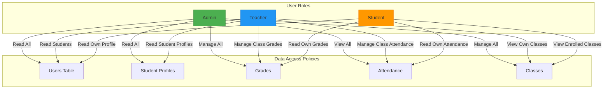
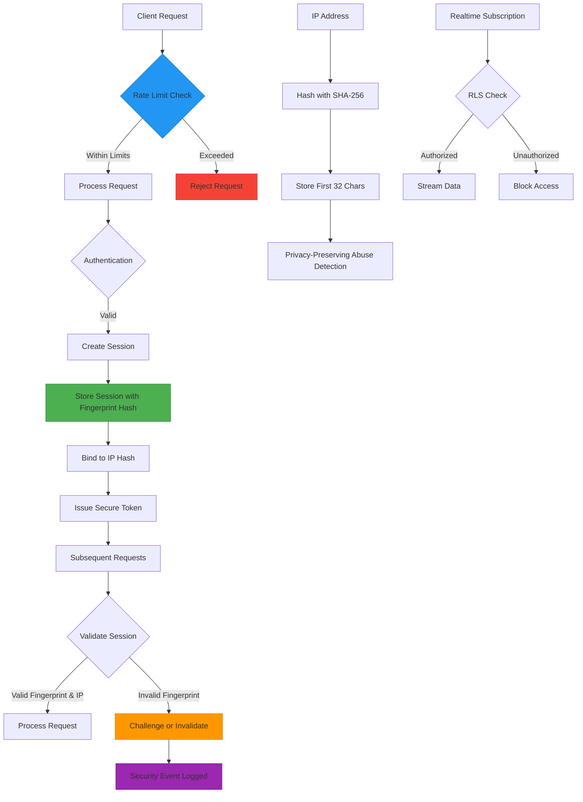
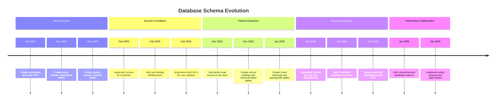

# Supabase Migrations and Database Structure

<cite>
**Referenced Files in This Document**   
- [20251219043432_create_users_table.sql](file://supabase/migrations/20251219043432_create_users_table.sql)
- [20251219043440_create_classes_table.sql](file://supabase/migrations/20251219043440_create_classes_table.sql)
- [20251219043454_create_attendance_tables.sql](file://supabase/migrations/20251219043454_create_attendance_tables.sql)
- [20251219043509_create_grades_tables.sql](file://supabase/migrations/20251219043509_create_grades_tables.sql)
- [20251219043525_create_quizzes_tables.sql](file://supabase/migrations/20251219043525_create_quizzes_tables.sql)
- [20251219043541_create_lessons_tables.sql](file://supabase/migrations/20251219043541_create_lessons_tables.sql)
- [20251219043556_create_schedule_table.sql](file://supabase/migrations/20251219043556_create_schedule_table.sql)
- [20260110000001_create_zoom_meetings_table.sql](file://supabase/migrations/20260110000001_create_zoom_meetings_table.sql)
- [20240101000000_secure_rls.sql](file://supabase/migrations/20240101000000_secure_rls.sql)
- [20250223_strict_rls.sql](file://supabase/migrations/20250223_strict_rls.sql)
- [20251219081226_allow_admin_read_all_users.sql](file://supabase/migrations/20251219081226_allow_admin_read_all_users.sql)
- [20250222_rate_limit_table.sql](file://supabase/migrations/20250222_rate_limit_table.sql)
- [20260111053538_session_security.sql](file://supabase/migrations/20260111053538_session_security.sql)
- [20250226_secure_realtime_rls.sql](file://supabase/migrations/20250226_secure_realtime_rls.sql)
- [20251219044036_add_rls_policies.sql](file://supabase/migrations/20251219044036_add_rls_policies.sql)
- [20251219082251_fix_all_rls_policies_v2.sql](file://supabase/migrations/20251219082251_fix_all_rls_policies_v2.sql)
- [20260108112143_performance_indexes.sql](file://supabase/migrations/20260108112143_performance_indexes.sql)
- [20260110125232_hash_ip_addresses.sql](file://supabase/migrations/20260110125232_hash_ip_addresses.sql)
</cite>

## Table of Contents
1. [Introduction](#introduction)
2. [Core Data Models](#core-data-models)
3. [Row Level Security Policies](#row-level-security-policies)
4. [Security Hardening Measures](#security-hardening-measures)
5. [Schema Evolution and Migration Strategy](#schema-evolution-and-migration-strategy)
6. [Performance Optimization](#performance-optimization)
7. [Conclusion](#conclusion)

## Introduction
This document provides comprehensive documentation for the Supabase database schema used in the School Management System. The schema is managed through a series of timestamped migration files that define table structures, relationships, security policies, and performance optimizations. The system implements a robust role-based access control model using Row Level Security (RLS) to ensure data privacy and integrity across different user roles including admin, teacher, and student. The documentation covers the major data entities, security mechanisms, and evolutionary patterns in the database schema.

## Core Data Models

The database schema is organized around key educational entities that represent users, classes, attendance, grades, quizzes, lessons, schedules, and Zoom meetings. Each entity is defined in dedicated migration files with appropriate constraints, relationships, and security configurations.

```mermaid
erDiagram
users {
uuid id PK
text email UK
text name
text role
text avatar
text phone
text address
timestamptz created_at
timestamptz updated_at
}
student_profiles {
uuid id PK FK
text grade
text section
date enrollment_date
text parent_name
text parent_phone
}
teacher_profiles {
uuid id PK FK
text subject
text department
date join_date
}
classes {
uuid id PK
text name
text grade
text section
uuid teacher_id FK
text subject
text schedule
text room
timestamptz created_at
}
class_students {
uuid id PK
uuid class_id FK
uuid student_id FK
timestamptz enrolled_at
}
attendance_records {
uuid id PK
uuid student_id FK
uuid class_id FK
date date
text status
timestamptz created_at
}
qr_attendance_sessions {
uuid id PK
uuid class_id FK
uuid teacher_id FK
date date
time start_time
time end_time
text qr_code UK
text status
boolean require_location
timestamptz created_at
}
qr_checkins {
uuid id PK
uuid session_id FK
uuid student_id FK
timestamptz checked_in_at
boolean location_verified
varchar ip_hash
}
grades {
uuid id PK
uuid student_id FK
uuid class_id FK
numeric score
numeric max_score
numeric percentage
numeric grade
text type
date date
timestamptz created_at
}
grade_weights {
uuid id PK
uuid class_id FK
numeric quiz_weight
numeric exam_weight
numeric assignment_weight
numeric project_weight
}
quizzes {
uuid id PK
text title
uuid class_id FK
uuid teacher_id FK
text description
integer duration
date due_date
text status
timestamptz created_at
}
quiz_questions {
uuid id PK
uuid quiz_id FK
text type
text question
jsonb options
text correct_answer
integer points
boolean case_sensitive
integer sort_order
}
quiz_attempts {
uuid id PK
uuid quiz_id FK
uuid student_id FK
numeric score
numeric max_score
numeric percentage
boolean needs_grading
timestamptz completed_at
}
lessons {
uuid id PK
text title
uuid class_id FK
uuid teacher_id FK
text description
text content
timestamptz created_at
timestamptz updated_at
}
lesson_materials {
uuid id PK
uuid lesson_id FK
text name
text type
text url
text size
}
schedules {
uuid id PK
uuid class_id FK
text day
time start_time
time end_time
text room
}
zoom_meetings {
uuid id PK
text zoom_meeting_id UK
uuid host_id FK
text title
text description
text meeting_type
timestamptz start_time
integer duration
text timezone
text join_url
text start_url
text password
text status
uuid class_id FK
text target_audience
jsonb settings
timestamptz created_at
timestamptz updated_at
}
zoom_participants {
uuid id PK
uuid meeting_id FK
uuid user_id FK
text zoom_participant_id
text name
text email
timestamptz join_time
timestamptz leave_time
integer duration
text status
}
users ||--o{ student_profiles : "1:1"
users ||--o{ teacher_profiles : "1:1"
users ||--o{ class_students : "students"
users ||--o{ attendance_records : "student"
users ||--o{ grades : "student"
users ||--o{ quiz_attempts : "student"
users ||--o{ qr_checkins : "student"
users ||--o{ zoom_participants : "participant"
classes ||--o{ class_students : "has"
classes ||--o{ attendance_records : "attendance"
classes ||--o{ grades : "grades"
classes ||--o{ quizzes : "quizzes"
classes ||--o{ lessons : "lessons"
classes ||--o{ schedules : "schedule"
classes ||--o{ qr_attendance_sessions : "qr_sessions"
classes ||--o{ zoom_meetings : "meetings"
quizzes ||--o{ quiz_questions : "questions"
quizzes ||--o{ quiz_attempts : "attempts"
quiz_attempts ||--o{ quiz_answers : "answers"
lessons ||--o{ lesson_materials : "materials"
qr_attendance_sessions ||--o{ qr_checkins : "checkins"
zoom_meetings ||--o{ zoom_participants : "participants"
```

**Diagram sources**
- [20251219043432_create_users_table.sql](file://supabase/migrations/20251219043432_create_users_table.sql)
- [20251219043440_create_classes_table.sql](file://supabase/migrations/20251219043440_create_classes_table.sql)
- [20251219043454_create_attendance_tables.sql](file://supabase/migrations/20251219043454_create_attendance_tables.sql)
- [20251219043509_create_grades_tables.sql](file://supabase/migrations/20251219043509_create_grades_tables.sql)
- [20251219043525_create_quizzes_tables.sql](file://supabase/migrations/20251219043525_create_quizzes_tables.sql)
- [20251219043541_create_lessons_tables.sql](file://supabase/migrations/20251219043541_create_lessons_tables.sql)
- [20251219043556_create_schedule_table.sql](file://supabase/migrations/20251219043556_create_schedule_table.sql)
- [20260110000001_create_zoom_meetings_table.sql](file://supabase/migrations/20260110000001_create_zoom_meetings_table.sql)

**Section sources**
- [20251219043432_create_users_table.sql](file://supabase/migrations/20251219043432_create_users_table.sql)
- [20251219043440_create_classes_table.sql](file://supabase/migrations/20251219043440_create_classes_table.sql)
- [20251219043454_create_attendance_tables.sql](file://supabase/migrations/20251219043454_create_attendance_tables.sql)
- [20251219043509_create_grades_tables.sql](file://supabase/migrations/20251219043509_create_grades_tables.sql)
- [20251219043525_create_quizzes_tables.sql](file://supabase/migrations/20251219043525_create_quizzes_tables.sql)
- [20251219043541_create_lessons_tables.sql](file://supabase/migrations/20251219043541_create_lessons_tables.sql)
- [20251219043556_create_schedule_table.sql](file://supabase/migrations/20251219043556_create_schedule_table.sql)
- [20260110000001_create_zoom_meetings_table.sql](file://supabase/migrations/20260110000001_create_zoom_meetings_table.sql)

## Row Level Security Policies

The database implements a comprehensive Row Level Security (RLS) framework to enforce role-based access control at the database level. RLS policies ensure that users can only access data they are authorized to view or modify, with different rules for admins, teachers, students, and other roles.

The initial RLS implementation in `secure_rls.sql` establishes foundational policies:
- Users can view their own profile data
- Admins can view all users and student profiles
- Teachers can view student profiles and manage grades for their classes
- Students can only view their own grades and attendance records

The policy evolution is evident in subsequent migrations. The `allow_admin_read_all_users.sql` file specifically grants admin users the ability to read all user records, which is essential for administrative functions while maintaining strict access controls for other roles.



**Diagram sources**
- [20240101000000_secure_rls.sql](file://supabase/migrations/20240101000000_secure_rls.sql)
- [20251219081226_allow_admin_read_all_users.sql](file://supabase/migrations/20251219081226_allow_admin_read_all_users.sql)
- [20250223_strict_rls.sql](file://supabase/migrations/20250223_strict_rls.sql)

**Section sources**
- [20240101000000_secure_rls.sql](file://supabase/migrations/20240101000000_secure_rls.sql)
- [20251219081226_allow_admin_read_all_users.sql](file://supabase/migrations/20251219081226_allow_admin_read_all_users.sql)
- [20250223_strict_rls.sql](file://supabase/migrations/20250223_strict_rls.sql)

## Security Hardening Measures

The database schema incorporates multiple security hardening measures to protect user data, prevent abuse, and ensure system integrity. These measures include rate limiting, session security, IP address hashing, and real-time subscription security.

Rate limiting is implemented through the `rate_limit_table.sql` migration, which creates a `rate_limits` table to track API requests by identifier and endpoint. This prevents abuse of system resources by limiting the frequency of operations from any single source.

Session security is enhanced through the `session_security.sql` migration, which introduces three new tables:
- `user_sessions`: Tracks active sessions with device fingerprint and IP hash binding
- `user_devices`: Manages trusted devices per user with fingerprint tracking
- `security_events`: Logs security-related events for audit and monitoring



IP address privacy is protected through the `hash_ip_addresses.sql` migration, which adds an `ip_hash` column to the `qr_checkins` table. This stores a SHA-256 hash of the client's IP address instead of the raw IP, enabling abuse detection while preserving user privacy.

Real-time subscription security is enforced in `secure_realtime_rls.sql`, which ensures that the Supabase realtime publication respects RLS policies. This prevents unauthorized clients from receiving data they shouldn't access through real-time subscriptions.

**Diagram sources**
- [20250222_rate_limit_table.sql](file://supabase/migrations/20250222_rate_limit_table.sql)
- [20260111053538_session_security.sql](file://supabase/migrations/20260111053538_session_security.sql)
- [20260110125232_hash_ip_addresses.sql](file://supabase/migrations/20260110125232_hash_ip_addresses.sql)
- [20250226_secure_realtime_rls.sql](file://supabase/migrations/20250226_secure_realtime_rls.sql)

**Section sources**
- [20250222_rate_limit_table.sql](file://supabase/migrations/20250222_rate_limit_table.sql)
- [20260111053538_session_security.sql](file://supabase/migrations/20260111053538_session_security.sql)
- [20260110125232_hash_ip_addresses.sql](file://supabase/migrations/20260110125232_hash_ip_addresses.sql)
- [20250226_secure_realtime_rls.sql](file://supabase/migrations/20250226_secure_realtime_rls.sql)

## Schema Evolution and Migration Strategy

The database schema follows a structured migration strategy with timestamped migration files that reflect the evolutionary path of the system. The migration filenames use a YYYYMMDDHHMMSS format, enabling chronological ordering and version control.

The schema evolution demonstrates several key patterns:
- Initial table creation with core entities
- Addition of RLS policies for security
- Refinement of policies based on requirements
- Introduction of new features and tables
- Performance optimizations
- Security hardening

The migration sequence shows a clear progression from basic table definitions to sophisticated security and performance features. For example, the users table was first created with basic profile information, then enhanced with RLS policies, followed by additional security measures like session tracking and IP hashing.

The policy refinement process is particularly evident in the RLS implementations. The system started with restrictive policies in `secure_rls.sql`, then evolved to more permissive but still secure policies in `fix_all_rls_policies_v2.sql`. This iterative approach allows the team to balance security requirements with usability needs.



The migration strategy also includes maintenance operations such as dropping and recreating publications (`secure_realtime_rls.sql`) and cleaning up old sessions (`session_security.sql`). These ensure the database remains performant and secure over time.

**Section sources**
- [20240101000000_secure_rls.sql](file://supabase/migrations/20240101000000_secure_rls.sql)
- [20251219043432_create_users_table.sql](file://supabase/migrations/20251219043432_create_users_table.sql)
- [20251219044036_add_rls_policies.sql](file://supabase/migrations/20251219044036_add_rls_policies.sql)
- [20251219082251_fix_all_rls_policies_v2.sql](file://supabase/migrations/20251219082251_fix_all_rls_policies_v2.sql)
- [20260110000001_create_zoom_meetings_table.sql](file://supabase/migrations/20260110000001_create_zoom_meetings_table.sql)
- [20260111053538_session_security.sql](file://supabase/migrations/20260111053538_session_security.sql)

## Performance Optimization

The database schema includes comprehensive performance optimizations through strategic indexing and query planning. The `performance_indexes.sql` migration adds numerous indexes to support efficient querying across the most frequently accessed data patterns.

Key performance optimizations include:
- Role-based user queries with indexes on the `role` column
- Time-series access patterns with descending indexes on date/timestamp columns
- Composite indexes for common query combinations
- Partial indexes for frequently filtered boolean columns

```mermaid
graph TD
subgraph "Index Types"
A[Single Column Indexes]
B[Composite Indexes]
C[Partial Indexes]
D[Unique Indexes]
end
subgraph "Performance Targets"
E["User Queries by Role"]
F["Attendance History"]
G["Grade Lookups"]
H["Conversation Threads"]
I["Class Schedules"]
end
A --> E
A --> F
A --> G
A --> I
B --> |"student_id, date DESC"| F
B --> |"class_id, date DESC"| F
B --> |"sender_id, receiver_id, created_at DESC"| H
B --> |"grade, section"| E
C --> |"is_active = true"| E
C --> |"status = 'active'"| F
D --> |"zoom_meeting_id"| "Zoom Meetings"
D --> |"qr_code"| "QR Attendance Sessions"
style E fill:#2196F3,stroke:#1976D2
style F fill:#4CAF50,stroke:#388E3C
style G fill:#FF9800,stroke:#F57C00
style H fill:#9C27B0,stroke:#7B1FA2
style I fill:#03A9F4,stroke:#0288D1
```

The indexing strategy focuses on the most common query patterns in the application:
- User lookups by role and active status
- Attendance records by student and date
- Grade retrieval by student, class, and date
- Chat message conversations between users
- Class schedules by day and time
- Quiz attempts by student and completion time

The migration also includes ANALYZE commands to update table statistics, ensuring the query planner has accurate information for optimal execution plan selection. Additionally, comments are added to key indexes to document their purpose for future maintenance.

**Diagram sources**
- [20260108112143_performance_indexes.sql](file://supabase/migrations/20260108112143_performance_indexes.sql)

**Section sources**
- [20260108112143_performance_indexes.sql](file://supabase/migrations/20260108112143_performance_indexes.sql)

## Conclusion

The Supabase database schema for the School Management System demonstrates a mature, security-first approach to database design. The schema effectively balances functional requirements with robust security controls through a comprehensive implementation of Row Level Security policies, rate limiting, session security, and privacy-preserving techniques like IP address hashing.

The migration strategy reveals an evolutionary approach to database development, starting with core entity definitions and progressively enhancing security, performance, and functionality. The timestamped migration files provide a clear audit trail of schema changes, enabling reliable version control and deployment.

Key strengths of the implementation include:
- Granular role-based access control through RLS policies
- Comprehensive security hardening measures
- Privacy-preserving data handling practices
- Performance-optimized indexing strategy
- Real-time subscription security
- Session integrity protection through device fingerprinting

The schema serves as a strong foundation for a secure and scalable school management application, with well-defined data relationships and robust protection mechanisms that ensure data integrity and user privacy.