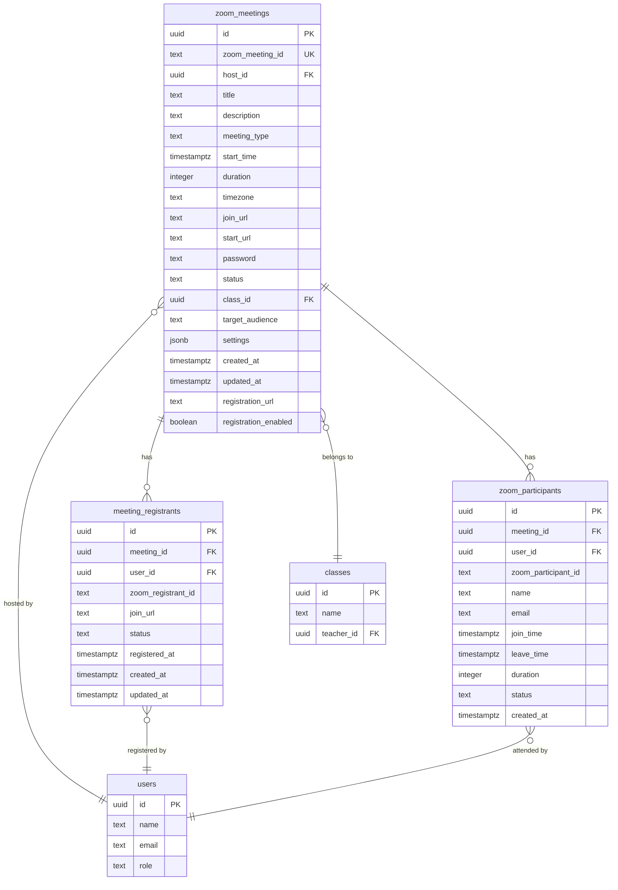
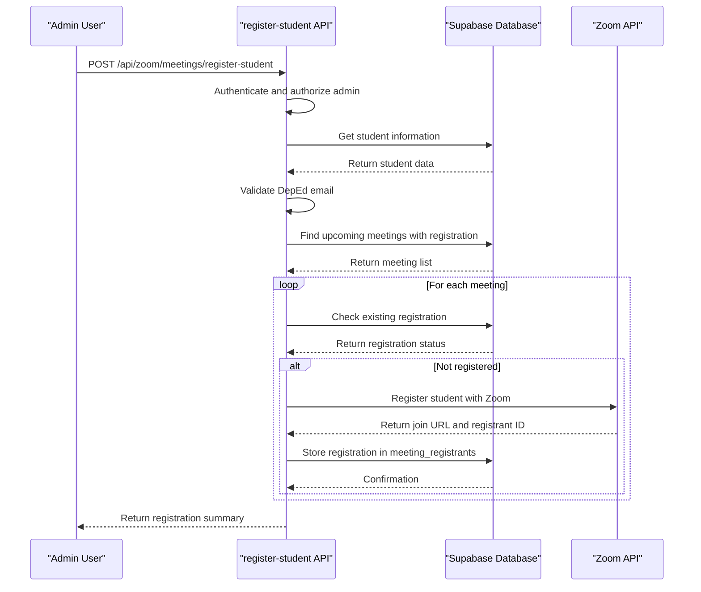
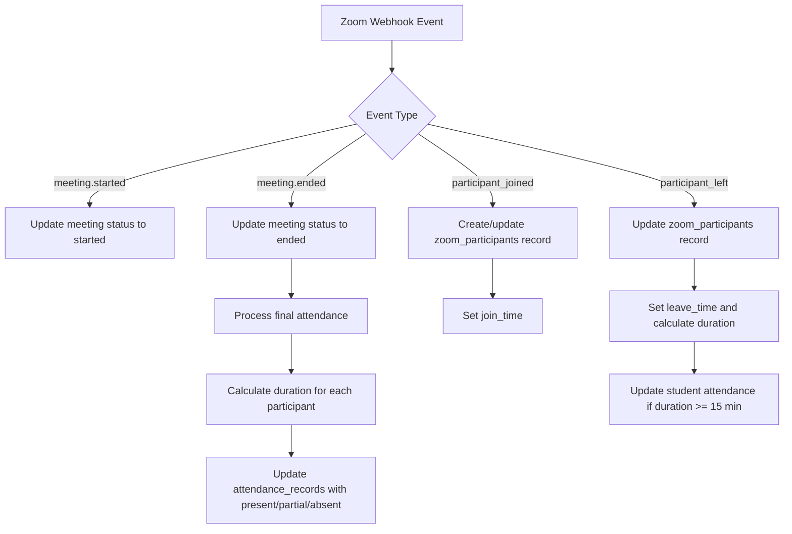

# Zoom Integration and Virtual Meeting Management

<cite>
**Referenced Files in This Document**   
- [20260110000001_create_zoom_meetings_table.sql](file://supabase/migrations/20260110000001_create_zoom_meetings_table.sql)
- [20260110000002_create_meeting_registrants_table.sql](file://supabase/migrations/20260110000002_create_meeting_registrants_table.sql)
- [20260110000003_hash_ip_addresses.sql](file://supabase/migrations/20260110000003_hash_ip_addresses.sql)
- [route.ts](file://app/api/zoom/meetings/register-student/route.ts)
- [page.tsx](file://app/teacher/meetings/[id]/participants/page.tsx)
- [client.ts](file://lib/zoom/client.ts)
- [route.ts](file://app/api/zoom/webhook/route.ts)
- [types.ts](file://lib/zoom/types.ts)
</cite>

## Table of Contents
1. [Introduction](#introduction)
2. [Data Model Overview](#data-model-overview)
3. [zoom_meetings Table](#zoom_meetings-table)
4. [meeting_registrants Table](#meeting_registrants-table)
5. [Privacy and Data Anonymization](#privacy-and-data-anonymization)
6. [Meeting Registration Workflow](#meeting-registration-workflow)
7. [Attendance Tracking and Real-Time Updates](#attendance-tracking-and-real-time-updates)
8. [Security and Access Control](#security-and-access-control)
9. [Integration with Calendar Systems](#integration-with-calendar-systems)
10. [Data Retention Policies](#data-retention-policies)

## Introduction

The Zoom integration in the school management system provides a comprehensive virtual meeting solution that connects seamlessly with the institution's academic framework. This documentation details the data model and functionality of the virtual meeting system, focusing on the core tables that manage meeting information and participant registration. The integration enables teachers to create scheduled classes, allows students to register for sessions, and automatically tracks attendance through real-time synchronization with Zoom's webhook system. The architecture prioritizes privacy compliance through data anonymization techniques while maintaining robust access controls to ensure that meeting information is only accessible to authorized participants.

## Data Model Overview

The virtual meeting system is built around two primary database tables: `zoom_meetings` and `meeting_registrants`. These tables work in conjunction with Zoom's API to manage the lifecycle of virtual classes and track student participation. The data model supports various meeting types including scheduled classes, instant sessions, and recurring meetings, with flexible audience targeting that can include all users, specific classes, teachers, or students. The system implements Row Level Security (RLS) policies to enforce access control, ensuring that users can only view meetings they are authorized to attend. Real-time updates are synchronized through Zoom webhooks, which capture participant join and leave events to maintain accurate attendance records.

**Diagram sources**
- [20260110000001_create_zoom_meetings_table.sql](file://supabase/migrations/20260110000001_create_zoom_meetings_table.sql#L2-L21)
- [20260110000002_create_meeting_registrants_table.sql](file://supabase/migrations/20260110000002_create_meeting_registrants_table.sql#L2-L13)

## zoom_meetings Table

The `zoom_meetings` table serves as the central repository for all virtual meeting information within the school management system. It stores comprehensive details about each meeting including the meeting ID, topic, start time, duration, host information, and current status. The table establishes relationships with users through the `host_id` foreign key, which references the user who created the meeting, and with classes through the `class_id` foreign key, which links the meeting to a specific academic class. The `target_audience` field determines who can access the meeting, supporting values such as 'all', 'students', 'teachers', 'class', and 'personal'. 

The table includes several important fields for meeting management:
- `zoom_meeting_id`: A unique identifier from Zoom's API, ensuring each meeting can be accurately referenced
- `start_time`: The scheduled start time in timestamptz format, enabling timezone-aware scheduling
- `status`: Current meeting status with possible values of 'scheduled', 'started', 'ended', or 'cancelled'
- `settings`: A JSONB field storing Zoom-specific meeting configurations such as video settings and recording preferences
- `registration_enabled`: A boolean flag indicating whether registration is required for the meeting

The table is optimized for querying with multiple indexes on key fields including `host_id`, `class_id`, `start_time`, and `status`, ensuring efficient retrieval of meeting data for various use cases such as displaying a teacher's upcoming meetings or listing all meetings for a specific class.

**Section sources**
- [20260110000001_create_zoom_meetings_table.sql](file://supabase/migrations/20260110000001_create_zoom_meetings_table.sql#L2-L21)

## meeting_registrants Table

The `meeting_registrants` table tracks student registration for virtual meetings, providing a critical link between the school's user system and Zoom's registration functionality. This table stores information about which users have registered for specific meetings, including their registration status and unique join URLs. The table enforces referential integrity through foreign key constraints that reference both the `zoom_meetings` table and the `users` table, ensuring that registrations are always associated with valid meetings and users.

Key features of the `meeting_registrants` table include:
- `meeting_id`: Foreign key linking to the zoom_meetings table, establishing the meeting context
- `user_id`: Foreign key linking to the users table, identifying the registered participant
- `zoom_registrant_id`: The unique identifier assigned by Zoom for the registrant
- `join_url`: The personalized URL that the registrant uses to join the meeting
- `status`: Registration status with possible values of 'pending', 'approved', or 'denied'

The table includes a composite unique constraint on `meeting_id` and `user_id`, preventing duplicate registrations for the same user and meeting. This ensures data integrity while allowing the system to efficiently check registration status. The table also includes indexes on `meeting_id`, `user_id`, and `status` to optimize queries for retrieving all registrants for a meeting, finding all meetings a user has registered for, or filtering registrants by their approval status.

**Section sources**
- [20260110000002_create_meeting_registrants_table.sql](file://supabase/migrations/20260110000002_create_meeting_registrants_table.sql#L2-L13)

## Privacy and Data Anonymization

The system implements privacy-preserving measures through the `hash_ip_addresses.sql` migration, which demonstrates the application's commitment to data protection and compliance with privacy regulations. This migration introduces a strategy for handling IP addresses that balances security needs with user privacy. Instead of storing raw IP addresses, the system stores SHA-256 hashes of IP addresses, specifically using the first 32 characters of the hash. This approach allows the system to detect potential abuse patterns by comparing hash values while ensuring that actual IP addresses cannot be reconstructed from the stored data.

The migration adds an `ip_hash` column to the `qr_checkins` table, which is used for QR code-based check-ins, and includes a comment explaining the purpose of the column. This privacy-by-design approach ensures that even if the database were compromised, attackers would not be able to obtain users' actual IP addresses. The system maintains the ability to identify suspicious activity by detecting multiple accounts originating from the same IP address through hash comparison, while protecting individual user privacy. This technique aligns with data minimization principles by storing only the information necessary for abuse detection rather than the full IP address.

**Section sources**
- [20260110000003_hash_ip_addresses.sql](file://supabase/migrations/20260110000003_hash_ip_addresses.sql#L1-L18)

## Meeting Registration Workflow

The meeting registration process is implemented in the `register-student/route.ts` API endpoint, which handles the registration of students for upcoming class meetings. This workflow is triggered when a student is enrolled in a class and automatically registers them for all future meetings associated with that class. The process begins with authentication and authorization checks to ensure that only administrators can initiate student registrations. The system then validates that the student has a valid DepEd email address before proceeding with registration.

For each upcoming meeting with registration enabled, the system first checks if the student is already registered to avoid duplicates. If not registered, the system creates a registration with Zoom using the student's email and name, then stores the registration details in the `meeting_registrants` table with an 'approved' status. This integration with Zoom's registration system ensures that registered students can bypass the waiting room when joining meetings, providing a seamless experience. The workflow processes registrations in batches to respect Zoom's rate limits and includes error handling to continue processing other registrations even if some fail.

**Diagram sources**
- [route.ts](file://app/api/zoom/meetings/register-student/route.ts#L1-L116)

## Attendance Tracking and Real-Time Updates

Attendance tracking is implemented through a real-time synchronization system that connects Zoom's webhook events with the application's attendance records. The `webhook/route.ts` endpoint receives events from Zoom including meeting start, meeting end, participant join, and participant leave events. When a participant joins a meeting, the system creates or updates a record in the `zoom_participants` table with their join time. When a participant leaves, the system updates their record with the leave time and calculates the duration of their participation.

When a meeting ends, the system processes final attendance by updating the `attendance_records` table for all enrolled students in the associated class. Students who participated for at least 15 minutes are marked as "present," those who participated for less time are marked as "partial," and those who never joined are marked as "absent." This automated process eliminates the need for manual attendance taking while ensuring accurate records based on actual participation time. The system also handles cases where participants join and leave multiple times during a meeting by accumulating their total duration across sessions.

**Diagram sources**
- [route.ts](file://app/api/zoom/webhook/route.ts#L1-L342)

## Security and Access Control

The system implements comprehensive security measures through Row Level Security (RLS) policies that restrict access to meeting data based on user roles and relationships. The RLS policies for the `zoom_meetings` table ensure that users can only view meetings they are authorized to attend, with different access rules based on the meeting's target audience. Hosts can view their own meetings, admins can view all meetings, and other users can view meetings based on their role and enrollment status.

For class meetings, the policies are particularly sophisticated, allowing access to students enrolled in the class, teachers of the class, and parents of enrolled students. This ensures that meeting information is shared appropriately within the educational context while maintaining privacy. The `meeting_registrants` table has additional RLS policies that allow users to view their own registrations, teachers to view registrations for their meetings, and admins to view all registrations. These policies work in conjunction with the application's authentication system to provide fine-grained access control without requiring complex application-level permission checks.

**Section sources**
- [20260110000001_create_zoom_meetings_table.sql](file://supabase/migrations/20260110000001_create_zoom_meetings_table.sql#L51-L92)
- [20260110000002_create_meeting_registrants_table.sql](file://supabase/migrations/20260110000002_create_meeting_registrants_table.sql#L22-L47)

## Integration with Calendar Systems

The Zoom integration automatically creates calendar events in the school's calendar system whenever a new meeting is scheduled. This synchronization ensures that virtual meetings appear in users' calendars alongside other academic events, providing a unified view of their schedule. The integration occurs in the `meetings/route.ts` file, where after a meeting is created in Zoom and stored in the database, a corresponding entry is added to the `calendar_events` table.

The calendar event includes relevant information such as the meeting title prefixed with a video camera emoji for visual identification, the meeting description, start and end times, and the Zoom join URL as the event location. The event is associated with the appropriate class and marked with a "meeting" type, allowing for filtering and categorization within the calendar interface. This integration reduces the cognitive load on users by eliminating the need to manually add virtual meetings to their calendars and ensures that all participants receive consistent scheduling information.

**Section sources**
- [route.ts](file://app/api/zoom/meetings/route.ts#L143-L157)

## Data Retention Policies

The system implements data retention policies that balance the need for historical records with storage efficiency and privacy considerations. Meeting data is retained indefinitely to maintain a complete record of academic activities, but inactive meetings are archived after a specified period to optimize database performance. Participant data in the `zoom_participants` and `meeting_registrants` tables is retained for the same duration as the associated meeting, ensuring that attendance records remain available for academic review and reporting.

The system includes mechanisms for data cleanup, including the removal of registration records when meetings are cancelled and the updating of participant records when meetings end. The `zoom_participants` table uses an upsert operation to handle cases where participants join and leave multiple times, ensuring that only the most current information is maintained. These policies are designed to comply with educational data privacy regulations while providing administrators with the necessary tools to manage data lifecycle and storage requirements.

**Section sources**
- [route.ts](file://app/api/zoom/webhook/route.ts#L97-L123)
- [route.ts](file://app/api/zoom/meetings/route.ts#L102-L107)