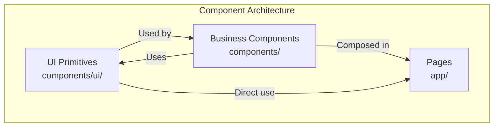
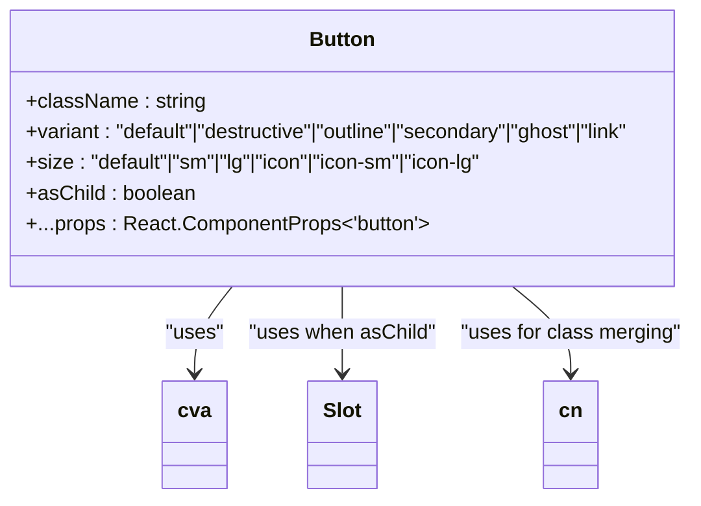
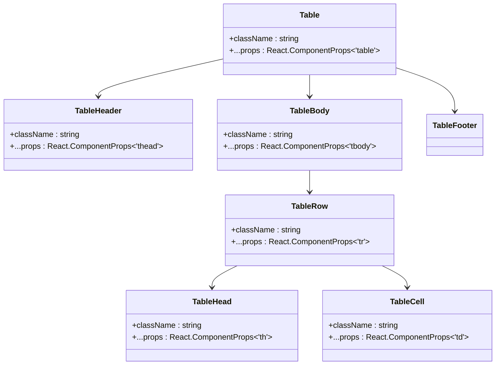
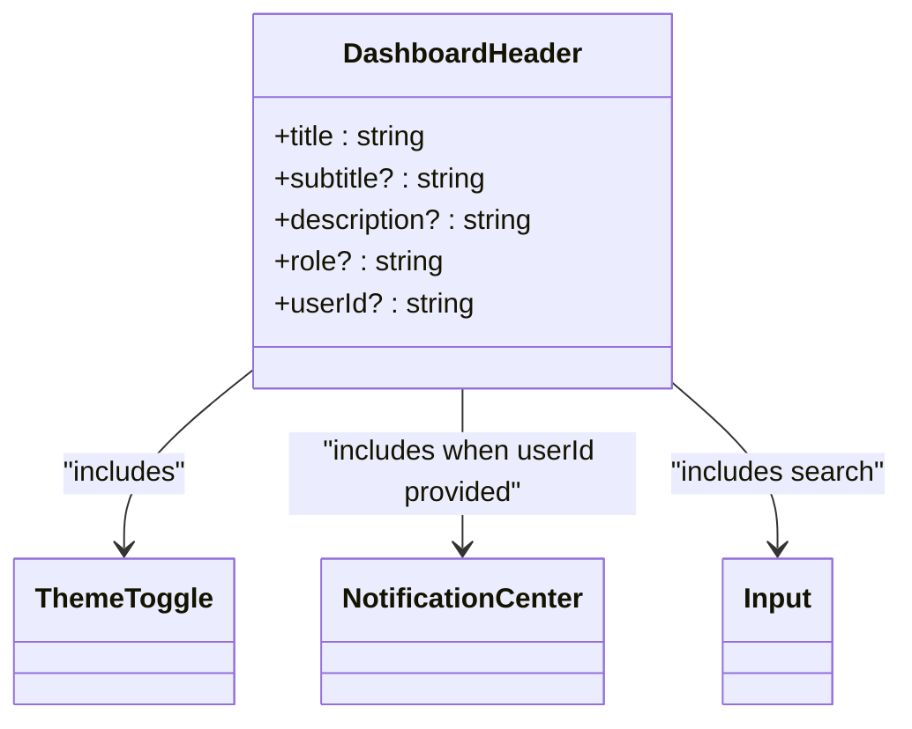
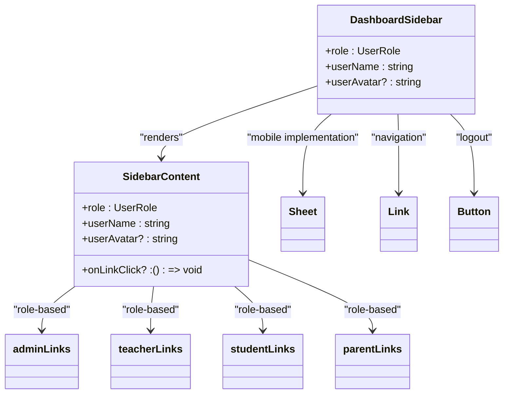
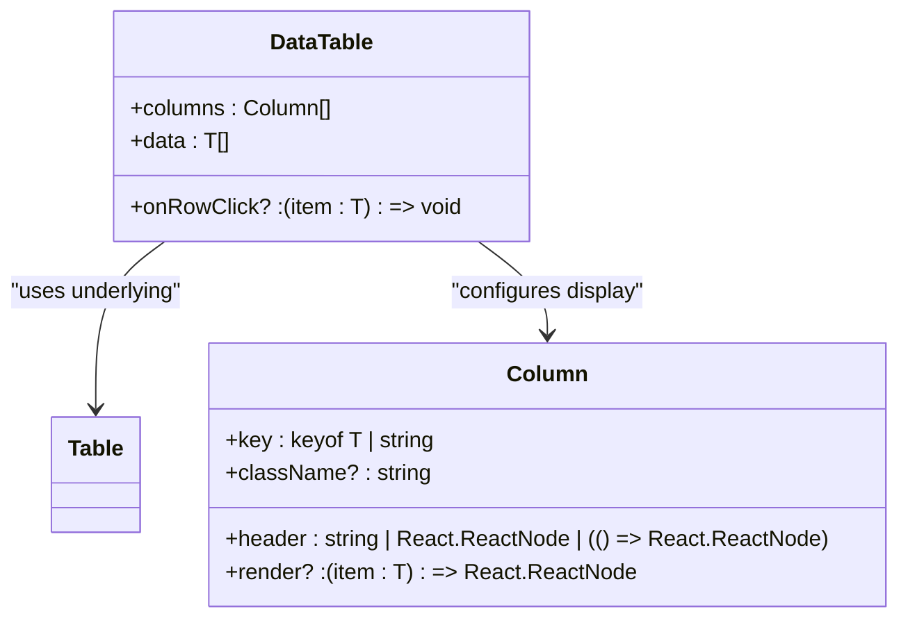
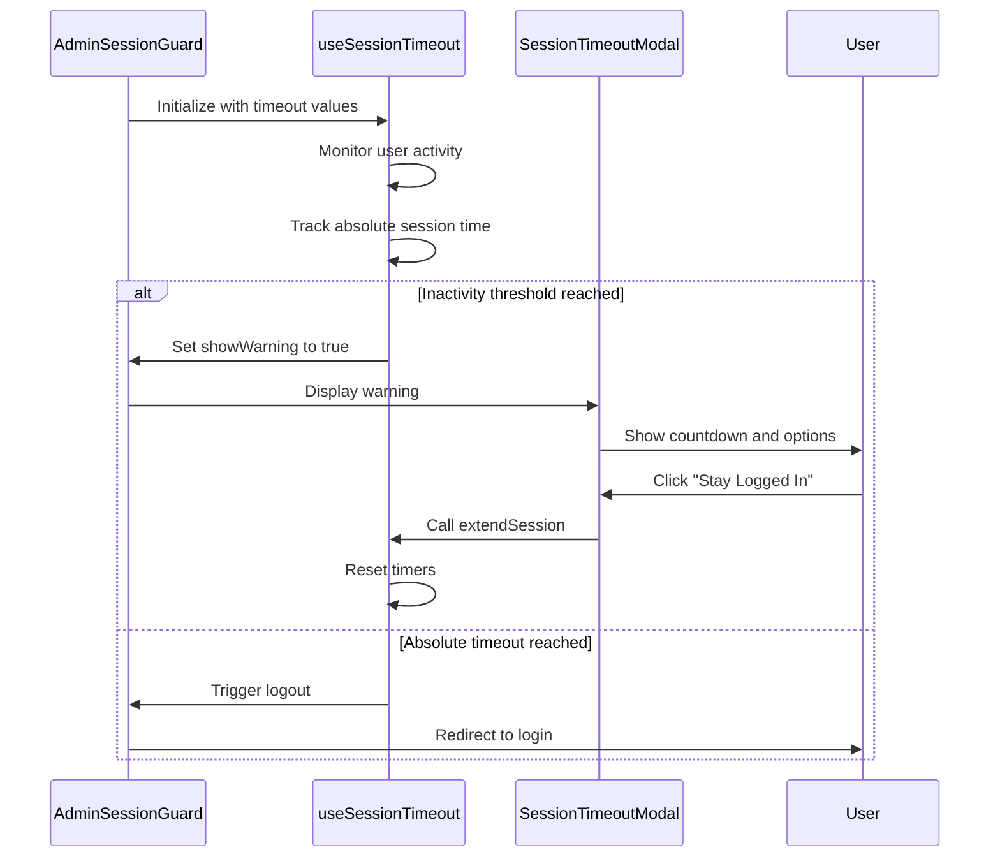
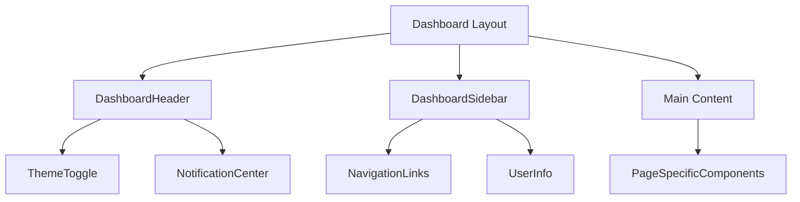
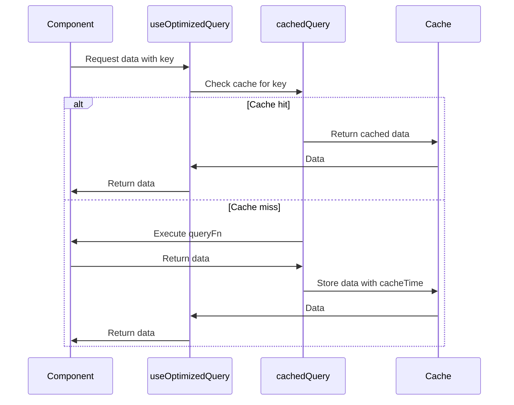

# Component Architecture

<cite>
**Referenced Files in This Document**   
- [components/ui/button.tsx](file://components/ui/button.tsx)
- [components/ui/input.tsx](file://components/ui/input.tsx)
- [components/ui/table.tsx](file://components/ui/table.tsx)
- [components/ui/avatar.tsx](file://components/ui/avatar.tsx)
- [components/dashboard-header.tsx](file://components/dashboard-header.tsx)
- [components/dashboard-sidebar.tsx](file://components/dashboard-sidebar.tsx)
- [components/data-table.tsx](file://components/data-table.tsx)
- [components/admin-session-guard.tsx](file://components/admin-session-guard.tsx)
- [components/theme-toggle.tsx](file://components/theme-toggle.tsx)
- [components/notification-center.tsx](file://components/notification-center.tsx)
- [components/theme-provider.tsx](file://components/theme-provider.tsx)
- [components/session-timeout-modal.tsx](file://components/session-timeout-modal.tsx)
- [lib/hooks/use-session-timeout.ts](file://lib/hooks/use-session-timeout.ts)
- [lib/hooks/use-optimized-query.ts](file://lib/hooks/use-optimized-query.ts)
- [app/layout.tsx](file://app/layout.tsx)
</cite>

## Table of Contents
1. [Introduction](#introduction)
2. [Component Architecture Overview](#component-architecture-overview)
3. [UI Primitives System](#ui-primitives-system)
4. [Business Components](#business-components)
5. [Component Composition Patterns](#component-composition-patterns)
6. [Accessibility Implementation](#accessibility-implementation)
7. [Responsive Design Considerations](#responsive-design-considerations)
8. [Performance Optimization Techniques](#performance-optimization-techniques)
9. [Creating New Components](#creating-new-components)
10. [Conclusion](#conclusion)

## Introduction
The School-Management-System employs a two-tier component architecture that separates reusable UI primitives from business-specific components. This documentation details the implementation of this architecture, focusing on the shadcn/ui-based UI primitives in the components/ui/ directory and the custom business components in the root components/ directory. The system follows Headless UI principles with unstyled, accessible foundations styled via Tailwind CSS, enabling consistent theming and responsive behavior across the application.

## Component Architecture Overview

The component architecture follows a clear separation of concerns between low-level UI primitives and high-level business components. The system is built on React with Next.js, leveraging TypeScript for type safety and Tailwind CSS for styling. The architecture enables consistent user experiences across different user roles (admin, teacher, student, parent) while maintaining code reusability and maintainability.

**Diagram sources**
- [components/ui/button.tsx](file://components/ui/button.tsx)
- [components/dashboard-header.tsx](file://components/dashboard-header.tsx)
- [components/data-table.tsx](file://components/data-table.tsx)

## UI Primitives System

The UI primitives system is implemented in the components/ui/ directory and is based on shadcn/ui, a collection of reusable components built on top of Radix UI and Tailwind CSS. These components follow Headless UI principles, providing unstyled, accessible foundations that are styled via Tailwind CSS utility classes.

### Design Principles
The UI primitives follow several key design principles:
- **Accessibility**: All components are built with proper ARIA attributes and keyboard navigation support
- **Composability**: Components are designed to be easily composed and extended
- **Theming**: Components support dark mode and theme customization through CSS variables
- **Responsiveness**: Components adapt to different screen sizes and devices

### Button Component Implementation
The Button component demonstrates the use of class-variance-authority (cva) for managing variant styles. It supports multiple variants (default, destructive, outline, secondary, ghost, link) and sizes (default, sm, lg, icon variants). The component uses the Slot pattern from Radix UI to allow for proper element composition while maintaining accessibility.

**Diagram sources**
- [components/ui/button.tsx](file://components/ui/button.tsx)

### Table Component Implementation
The Table component is a composite component that provides a structured data display system. It consists of multiple subcomponents (Table, TableHeader, TableBody, TableFooter, TableRow, TableHead, TableCell, TableCaption) that work together to create accessible data tables. The implementation wraps the native HTML table elements with additional styling and accessibility features.

**Diagram sources**
- [components/ui/table.tsx](file://components/ui/table.tsx)

### Input and Avatar Components
The Input component provides a styled text input with support for various states (focus, error, disabled) and integrates with the form system. The Avatar component is a composite component that displays user profile images with fallback text when images are not available. Both components demonstrate the use of data attributes for styling and accessibility.

**Section sources**
- [components/ui/input.tsx](file://components/ui/input.tsx)
- [components/ui/avatar.tsx](file://components/ui/avatar.tsx)

## Business Components

The business components in the root components/ directory implement role-specific functionality and layout structures for the school management system.

### Dashboard Header Component
The DashboardHeader component provides a consistent header across all dashboard pages. It accepts props for title, subtitle, description, role, and userId, allowing for contextual customization based on the current page and user. The component includes a search input, theme toggle, and notification center, creating a comprehensive header experience.

**Diagram sources**
- [components/dashboard-header.tsx](file://components/dashboard-header.tsx)

### Dashboard Sidebar Component
The DashboardSidebar component implements a responsive sidebar navigation that adapts to different user roles. It displays role-specific navigation links and user information. The component includes both desktop and mobile implementations, with a collapsible mobile menu using the Sheet component from shadcn/ui.

**Diagram sources**
- [components/dashboard-sidebar.tsx](file://components/dashboard-sidebar.tsx)

### Data Table Component
The DataTable component is a generic data display component that can render any type of data with configurable columns. It supports row click events and custom cell rendering, making it highly flexible for different data presentation needs. The component uses generics to ensure type safety when working with different data types.

**Diagram sources**
- [components/data-table.tsx](file://components/data-table.tsx)

### Role-Specific Guards
The AdminSessionGuard component implements session management for administrative users. It uses the useSessionTimeout hook to monitor user activity and display a warning modal before session expiration. This component ensures security by automatically logging out inactive users after a configurable period.

**Diagram sources**
- [components/admin-session-guard.tsx](file://components/admin-session-guard.tsx)
- [lib/hooks/use-session-timeout.ts](file://lib/hooks/use-session-timeout.ts)
- [components/session-timeout-modal.tsx](file://components/session-timeout-modal.tsx)

## Component Composition Patterns

The application employs several composition patterns to create feature-rich interfaces by combining multiple components.

### Dashboard Layout Structure
The dashboard layout is shared across all roles and consists of a header, sidebar, and main content area. This consistent structure provides a familiar user experience regardless of the user's role. The layout is implemented using a combination of the DashboardHeader, DashboardSidebar, and role-specific page components.

**Diagram sources**
- [components/dashboard-header.tsx](file://components/dashboard-header.tsx)
- [components/dashboard-sidebar.tsx](file://components/dashboard-sidebar.tsx)

### Page Composition Examples
Pages in the application compose multiple business components to create feature-rich interfaces. For example, the admin dashboard page combines the dashboard header and sidebar with stat cards, data tables, and other components to provide a comprehensive overview of the school system.

**Section sources**
- [app/admin/page.tsx](file://app/admin/page.tsx)
- [app/teacher/page.tsx](file://app/teacher/page.tsx)
- [app/student/page.tsx](file://app/student/page.tsx)

## Accessibility Implementation

The component architecture prioritizes accessibility through several key practices:

### Semantic HTML and ARIA
All components use semantic HTML elements where appropriate and include proper ARIA attributes to ensure screen reader compatibility. For example, the Table component uses proper table structure with THEAD, TBODY, and TFOOT elements, while the Button component ensures proper keyboard navigation.

### Keyboard Navigation
Interactive components support keyboard navigation, allowing users to navigate the interface without a mouse. The DashboardSidebar component, for instance, allows keyboard navigation through the menu items, and the DataTable supports keyboard interaction for row selection.

### Focus Management
Components implement proper focus management, ensuring that focus is visible and follows logical navigation patterns. The ThemeToggle component uses the focus-visible utility to show focus indicators only when navigating with a keyboard.

**Section sources**
- [components/ui/button.tsx](file://components/ui/button.tsx)
- [components/ui/table.tsx](file://components/ui/table.tsx)
- [components/dashboard-sidebar.tsx](file://components/dashboard-sidebar.tsx)

## Responsive Design Considerations

The component system is designed to be responsive across different device sizes and screen resolutions.

### Mobile-First Approach
The components follow a mobile-first design approach, with base styles optimized for mobile devices and progressive enhancement for larger screens. The DashboardSidebar component, for example, uses a collapsible drawer on mobile devices and a fixed sidebar on larger screens.

### Breakpoint Strategy
The system uses Tailwind CSS breakpoints (sm, md, lg, xl) to create responsive layouts. Components adapt their layout and behavior based on the screen size, such as the DashboardHeader which hides the search input on smaller screens.

### Touch Targets
Interactive elements have appropriate touch targets (minimum 44x44 pixels) for mobile devices, ensuring usability on touchscreens. The Button component, for instance, has sufficient padding to create an adequate touch target.

**Section sources**
- [components/dashboard-header.tsx](file://components/dashboard-header.tsx)
- [components/dashboard-sidebar.tsx](file://components/dashboard-sidebar.tsx)

## Performance Optimization Techniques

The component architecture incorporates several performance optimization techniques to ensure a smooth user experience.

### Lazy Loading
Components are lazy-loaded when possible to reduce initial bundle size. The application uses Next.js dynamic imports for components that are not needed on initial page load.

### Code Splitting
The component system enables code splitting by organizing components into discrete, reusable units. This allows the bundler to create optimized chunks that load only the necessary code for each page.

### Caching and Memoization
The useOptimizedQuery hook implements caching and memoization to prevent unnecessary data fetching. It uses a caching system with configurable cache times and automatic cache invalidation.

**Diagram sources**
- [lib/hooks/use-optimized-query.ts](file://lib/hooks/use-optimized-query.ts)
- [lib/cache.ts](file://lib/cache.ts)

## Creating New Components

When creating new components for the system, developers should follow established patterns and conventions.

### Following Existing Patterns
New components should follow the same structure and coding style as existing components. This includes using TypeScript interfaces for props, implementing proper accessibility features, and following the naming conventions used throughout the codebase.

### Using UI Primitives
New components should leverage the existing UI primitives from the components/ui/ directory rather than creating custom styled elements. This ensures consistency in design and behavior across the application.

### Testing and Documentation
All new components should include appropriate testing and documentation. Components should be tested for accessibility, responsiveness, and functionality across different user roles and scenarios.

**Section sources**
- [components/ui/button.tsx](file://components/ui/button.tsx)
- [components/dashboard-header.tsx](file://components/dashboard-header.tsx)

## Conclusion
The component architecture of the School-Management-System effectively separates UI primitives from business components, enabling a consistent, accessible, and maintainable codebase. By following Headless UI principles and leveraging Tailwind CSS for styling, the system provides a flexible foundation that can be easily extended and customized. The use of composition patterns, accessibility features, and performance optimizations ensures a high-quality user experience across all roles and devices.