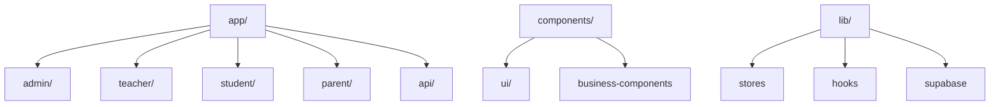
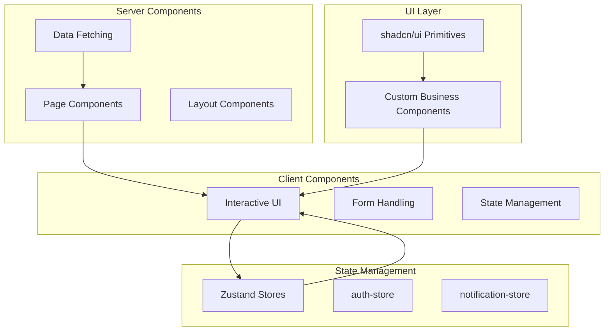
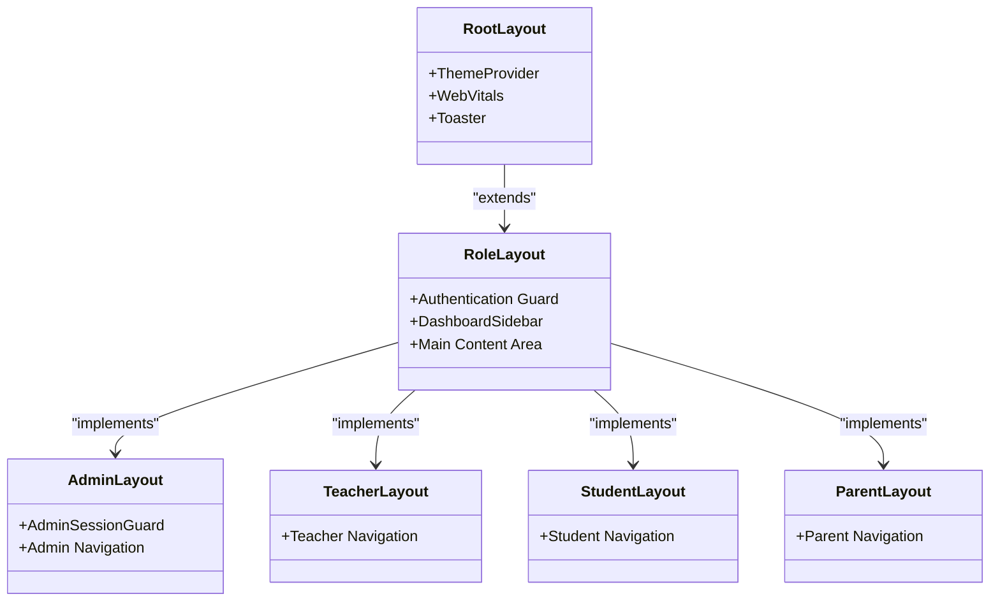
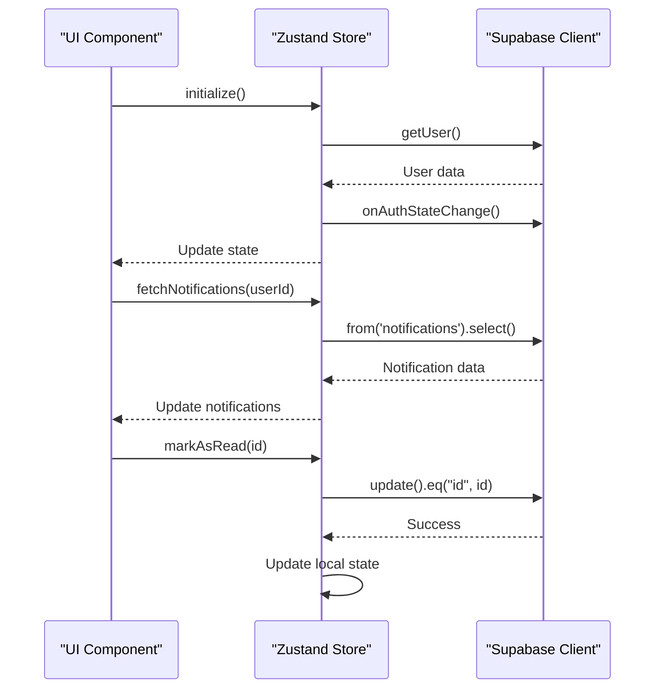
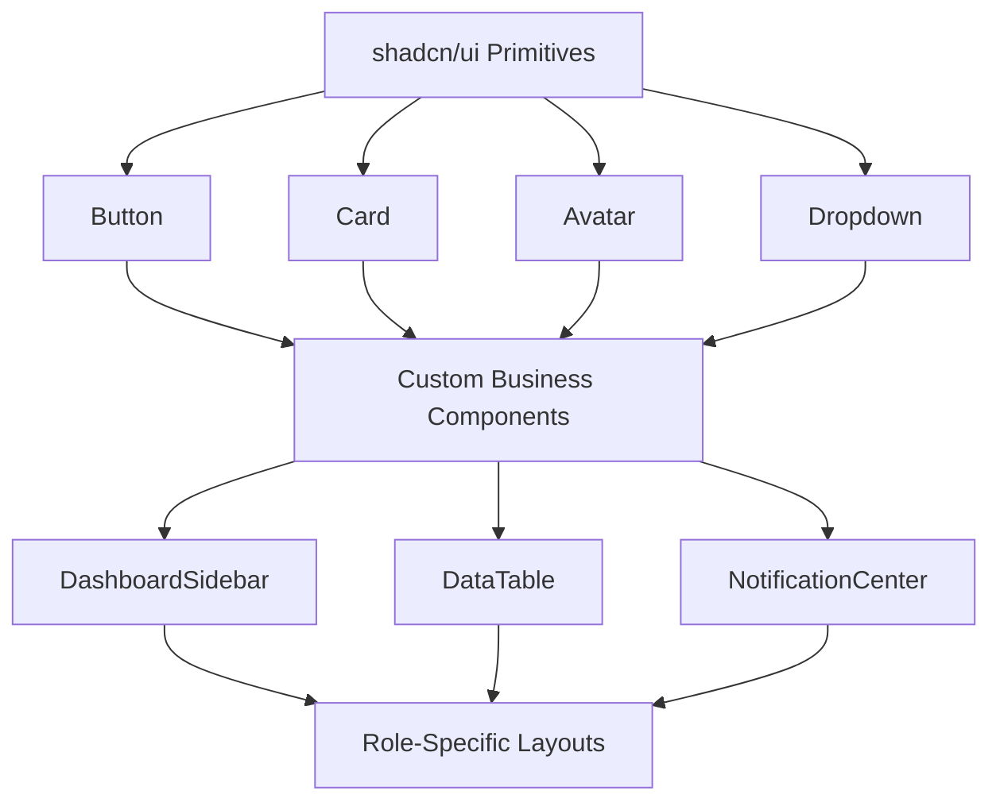
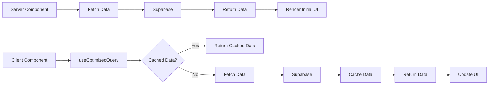
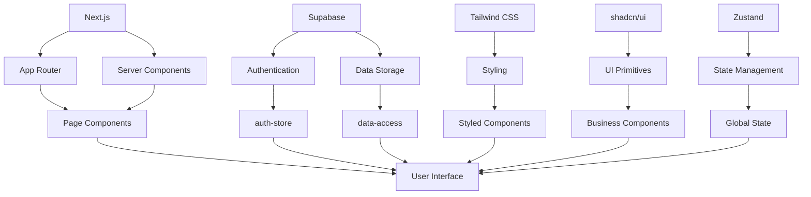

# Frontend Architecture

<cite>
**Referenced Files in This Document**   
- [app/layout.tsx](file://app/layout.tsx)
- [components/theme-provider.tsx](file://components/theme-provider.tsx)
- [lib/auth-store.ts](file://lib/auth-store.ts)
- [lib/notification-store.ts](file://lib/notification-store.ts)
- [next.config.mjs](file://next.config.mjs)
- [components/ui/button.tsx](file://components/ui/button.tsx)
- [components/dashboard-sidebar.tsx](file://components/dashboard-sidebar.tsx)
- [components/admin-session-guard.tsx](file://components/admin-session-guard.tsx)
- [app/admin/layout.tsx](file://app/admin/layout.tsx)
- [app/student/layout.tsx](file://app/student/layout.tsx)
- [components/data-table.tsx](file://components/data-table.tsx)
- [lib/hooks/use-optimized-query.ts](file://lib/hooks/use-optimized-query.ts)
- [lib/supabase/client.ts](file://lib/supabase/client.ts)
- [app/page.tsx](file://app/page.tsx)
- [styles/globals.css](file://styles/globals.css)
</cite>

## Table of Contents
1. [Introduction](#introduction)
2. [Project Structure](#project-structure)
3. [Core Components](#core-components)
4. [Architecture Overview](#architecture-overview)
5. [Detailed Component Analysis](#detailed-component-analysis)
6. [Dependency Analysis](#dependency-analysis)
7. [Performance Considerations](#performance-considerations)
8. [Troubleshooting Guide](#troubleshooting-guide)
9. [Conclusion](#conclusion)

## Introduction
The School-Management-System frontend is built using Next.js App Router with a component-based architecture. The system supports multiple user roles (admin, teacher, student, parent) with role-based access control and tailored dashboards. It leverages React Server Components for data fetching and rendering, with client components handling interactivity. The UI is built using shadcn/ui primitives and custom business components, styled with Tailwind CSS and a custom theme.

**Section sources**
- [app/page.tsx](file://app/page.tsx#L1-L500)

## Project Structure

The project follows a feature-based organization with the Next.js App Router structure. The `app/` directory contains route-based layouts and pages, organized by user role (admin, teacher, student, parent). The `components/` directory contains both UI primitives (from shadcn/ui) and custom business components. The `lib/` directory houses utility functions, hooks, and state management stores.

**Diagram sources**
- [app/layout.tsx](file://app/layout.tsx#L1-L43)
- [components/dashboard-sidebar.tsx](file://components/dashboard-sidebar.tsx#L1-L225)

## Core Components

The frontend architecture is built around several core components and patterns. The system uses React Server Components for initial rendering and data fetching, with client components used for interactive elements. State management is handled through Zustand stores for global state (authentication, notifications), while local component state manages UI interactions.

The UI layer combines shadcn/ui primitives with custom business components in the components/ directory. These components are designed to be reusable across different user roles and pages, promoting consistency and maintainability.

**Section sources**
- [components/ui/button.tsx](file://components/ui/button.tsx#L1-L61)
- [components/data-table.tsx](file://components/data-table.tsx#L1-L60)

## Architecture Overview

The frontend architecture follows a layered approach with clear separation of concerns. At the top level, the RootLayout provides global providers and styling. Role-specific layouts handle authentication and authorization, while page components focus on specific functionality.

Data flows from server components (which fetch data directly from Supabase) to client components (which handle user interactions). State is managed through Zustand stores that provide global access to authentication state, notifications, and other shared data.

**Diagram sources**
- [app/layout.tsx](file://app/layout.tsx#L1-L43)
- [lib/auth-store.ts](file://lib/auth-store.ts#L1-L110)
- [lib/notification-store.ts](file://lib/notification-store.ts#L1-L148)

## Detailed Component Analysis

### Layout and Routing Structure

The application uses Next.js App Router with nested layouts to implement role-based access control. Each user role has its own layout component that handles authentication and provides role-specific navigation. The root layout provides global providers like the ThemeProvider and WebVitals components.

The routing structure is organized by user role, with each role having its own directory containing pages and nested routes. This approach allows for role-specific UI and functionality while sharing common components and logic.

#### Layout Component Hierarchy

**Diagram sources**
- [app/layout.tsx](file://app/layout.tsx#L1-L43)
- [app/admin/layout.tsx](file://app/admin/layout.tsx#L1-L62)
- [app/student/layout.tsx](file://app/student/layout.tsx#L1-L60)

**Section sources**
- [app/admin/layout.tsx](file://app/admin/layout.tsx#L1-L62)
- [app/student/layout.tsx](file://app/student/layout.tsx#L1-L60)

### State Management Strategy

The application uses Zustand for global state management, with dedicated stores for authentication and notifications. This approach provides a simple, scalable solution for managing shared state across components without the complexity of larger state management libraries.

The auth-store manages user authentication state, including user profile information and session management. It integrates with Supabase authentication and provides a clean API for components to access authentication state. The notification-store handles user notifications, providing methods to fetch, add, and update notifications.

#### State Management Flow

**Diagram sources**
- [lib/auth-store.ts](file://lib/auth-store.ts#L1-L110)
- [lib/notification-store.ts](file://lib/notification-store.ts#L1-L148)

**Section sources**
- [lib/auth-store.ts](file://lib/auth-store.ts#L1-L110)
- [lib/notification-store.ts](file://lib/notification-store.ts#L1-L148)

### UI Component Architecture

The UI layer is built using shadcn/ui primitives, which provide accessible, customizable React components. These primitives are extended and composed to create custom business components in the components/ directory. This approach ensures consistency while allowing for application-specific functionality.

The button component demonstrates the use of class-variance-authority (cva) for styling variants, allowing for consistent styling across different button types. The dashboard-sidebar component shows how business components combine multiple UI primitives to create complex, role-specific interfaces.

#### UI Component Composition

**Diagram sources**
- [components/ui/button.tsx](file://components/ui/button.tsx#L1-L61)
- [components/dashboard-sidebar.tsx](file://components/dashboard-sidebar.tsx#L1-L225)
- [components/data-table.tsx](file://components/data-table.tsx#L1-L60)

**Section sources**
- [components/ui/button.tsx](file://components/ui/button.tsx#L1-L61)
- [components/dashboard-sidebar.tsx](file://components/dashboard-sidebar.tsx#L1-L225)

### Data Fetching Patterns

The application uses React Server Components for initial data fetching, allowing data to be fetched on the server and passed to client components. For client-side data fetching, the application uses custom hooks like useOptimizedQuery, which provide caching, deduplication, and retry logic.

The useOptimizedQuery hook implements a caching layer to minimize unnecessary network requests and improve performance. It also includes retry logic for transient failures, improving reliability in unstable network conditions.

#### Data Fetching Flow

**Diagram sources**
- [lib/hooks/use-optimized-query.ts](file://lib/hooks/use-optimized-query.ts#L1-L275)
- [lib/supabase/client.ts](file://lib/supabase/client.ts#L1-L9)

**Section sources**
- [lib/hooks/use-optimized-query.ts](file://lib/hooks/use-optimized-query.ts#L1-L275)

## Dependency Analysis

The frontend architecture has well-defined dependencies between components and layers. The application relies on Next.js for routing and server components, Supabase for data storage and authentication, and various UI libraries for components and styling.

The dependency graph shows a clear separation of concerns, with higher-level components depending on lower-level utilities and services. This structure promotes maintainability and testability, as components can be developed and tested independently.

**Diagram sources**
- [next.config.mjs](file://next.config.mjs#L1-L79)
- [lib/supabase/client.ts](file://lib/supabase/client.ts#L1-L9)

**Section sources**
- [next.config.mjs](file://next.config.mjs#L1-L79)

## Performance Considerations

The application implements several performance optimizations to ensure a responsive user experience. Image optimization is enabled through Next.js image optimization, with support for modern formats like AVIF and WebP. The useOptimizedQuery hook provides caching and deduplication to minimize network requests.

The application also implements code splitting through the App Router structure, ensuring that only necessary code is loaded for each page. Critical CSS is inlined, and non-critical resources are lazy-loaded to improve initial load times.

Security headers are configured in next.config.mjs to enhance security and performance, including Content-Security-Policy, Strict-Transport-Security, and X-Frame-Options.

**Section sources**
- [next.config.mjs](file://next.config.mjs#L1-L79)
- [lib/hooks/use-optimized-query.ts](file://lib/hooks/use-optimized-query.ts#L1-L275)

## Troubleshooting Guide

Common issues in the frontend architecture typically relate to authentication state, data fetching, or component rendering. The auth-store provides comprehensive logging and error handling for authentication issues, while the useOptimizedQuery hook includes retry logic for transient network failures.

For debugging, developers should check the browser console for errors, verify authentication state in the auth-store, and inspect network requests to ensure data is being fetched correctly. The WebVitals component provides performance metrics that can help identify performance bottlenecks.

**Section sources**
- [lib/auth-store.ts](file://lib/auth-store.ts#L1-L110)
- [components/web-vitals.tsx](file://components/web-vitals.tsx#L1-L10)

## Conclusion

The School-Management-System frontend architecture demonstrates a modern, scalable approach to building complex web applications with Next.js. By leveraging React Server Components, a component-based design, and effective state management, the application provides a responsive, secure user experience across multiple user roles.

The architecture balances server-side rendering for performance with client-side interactivity for a dynamic user interface. The use of shadcn/ui primitives and custom business components ensures consistency while allowing for application-specific functionality. With its role-based access control and comprehensive feature set, the frontend effectively supports the needs of administrators, teachers, students, and parents in an educational setting.