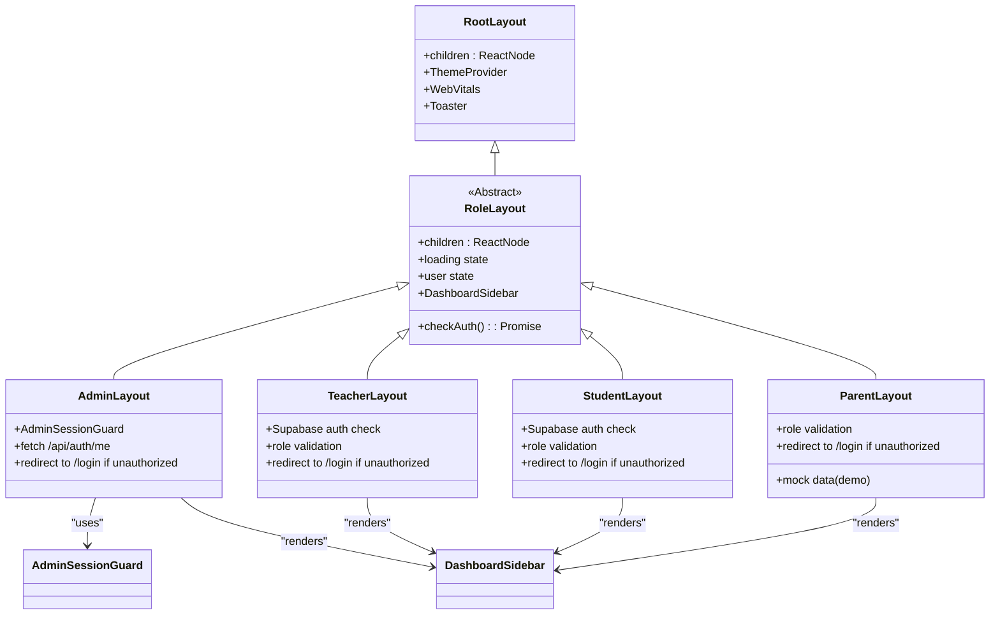
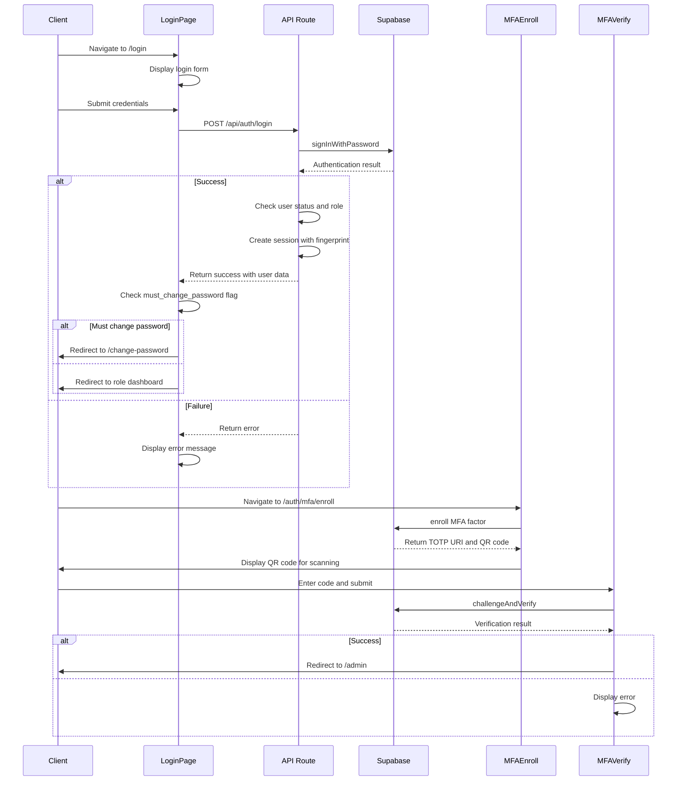
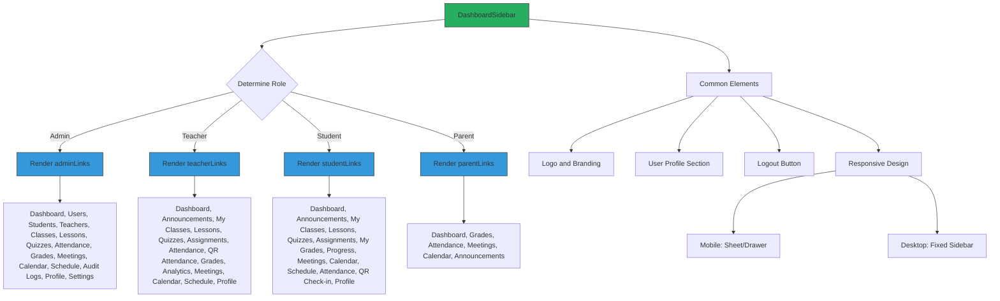
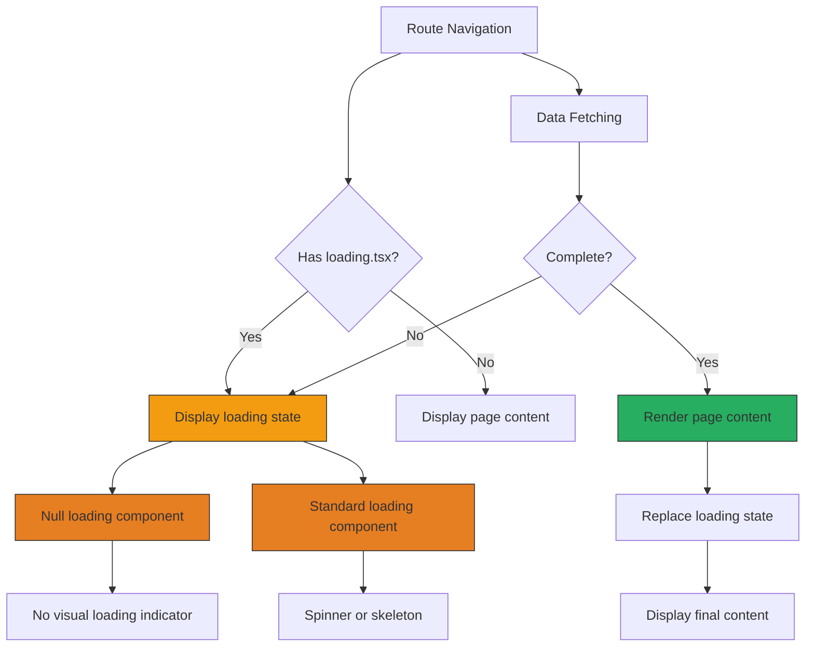
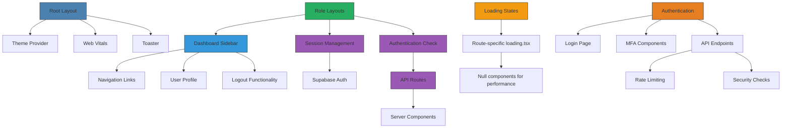

# Routing & Navigation

<cite>
**Referenced Files in This Document**   
- [layout.tsx](file://app/layout.tsx)
- [admin/layout.tsx](file://app/admin/layout.tsx)
- [teacher/layout.tsx](file://app/teacher/layout.tsx)
- [student/layout.tsx](file://app/student/layout.tsx)
- [parent/layout.tsx](file://app/parent/layout.tsx)
- [login/page.tsx](file://app/login/page.tsx)
- [auth/mfa/enroll/page.tsx](file://app/auth/mfa/enroll/page.tsx)
- [auth/mfa/verify/page.tsx](file://app/auth/mfa/verify/page.tsx)
- [setup/page.tsx](file://app/setup/page.tsx)
- [admin-session-guard.tsx](file://components/admin-session-guard.tsx)
- [dashboard-sidebar.tsx](file://components/dashboard-sidebar.tsx)
- [api/auth/login/route.ts](file://app/api/auth/login/route.ts)
- [api/auth/me/route.ts](file://app/api/auth/me/route.ts)
- [admin/classes/loading.tsx](file://app/admin/classes/loading.tsx)
- [admin/students/loading.tsx](file://app/admin/students/loading.tsx)
</cite>

## Table of Contents
1. [Introduction](#introduction)
2. [Project Structure](#project-structure)
3. [Core Components](#core-components)
4. [Architecture Overview](#architecture-overview)
5. [Detailed Component Analysis](#detailed-component-analysis)
6. [Dependency Analysis](#dependency-analysis)
7. [Performance Considerations](#performance-considerations)
8. [Troubleshooting Guide](#troubleshooting-guide)
9. [Conclusion](#conclusion)

## Introduction
The School-Management-System implements a robust routing and navigation system using Next.js App Router. This documentation details the nested layout structure, role-based access control, authentication flows, and loading states that enable a secure and user-friendly experience for administrators, teachers, students, and parents.

## Project Structure

The application follows a role-based directory structure under the `app` directory, with dedicated folders for each user role (admin, teacher, student, parent). The routing system leverages Next.js App Router conventions with layout components, page files, and special files like loading.tsx for enhanced user experience.

```mermaid
graph TD
A[app/] --> B[layout.tsx]
A --> C[admin/]
A --> D[teacher/]
A --> E[student/]
A --> F[parent/]
A --> G[api/]
A --> H[login/]
A --> I[setup/]
A --> J[auth/mfa/]
C --> K[layout.tsx]
D --> L[layout.tsx]
E --> M[layout.tsx]
F --> N[layout.tsx]
C --> O[classes/]
C --> P[students/]
C --> Q[teachers/]
O --> R[page.tsx]
O --> S[loading.tsx]
P --> T[[id]/]
P --> U[loading.tsx]
J --> V[enroll/]
J --> W[verify/]
V --> X[page.tsx]
W --> Y[page.tsx]
```

**Diagram sources**
- [app/layout.tsx](file://app/layout.tsx)
- [app/admin/layout.tsx](file://app/admin/layout.tsx)
- [app/teacher/layout.tsx](file://app/teacher/layout.tsx)
- [app/student/layout.tsx](file://app/student/layout.tsx)
- [app/parent/layout.tsx](file://app/parent/layout.tsx)

**Section sources**
- [app/layout.tsx](file://app/layout.tsx#L1-L43)
- [app/admin/layout.tsx](file://app/admin/layout.tsx#L1-L62)

## Core Components

The routing system is built around several core components that handle authentication, authorization, and navigation. The root layout provides global theming and analytics, while role-specific layouts implement access control and render appropriate UI elements based on user roles.

**Section sources**
- [layout.tsx](file://app/layout.tsx#L1-L43)
- [admin-session-guard.tsx](file://components/admin-session-guard.tsx#L1-L34)

## Architecture Overview

The application implements a hierarchical routing architecture with role-based access control. The system uses a combination of client-side and server-side routing patterns to ensure security and optimal user experience.

```mermaid
graph TD
A[Root Layout] --> B[Authentication Flow]
A --> C[Role-Based Dashboards]
B --> D[Login Page]
B --> E[MFA Enrollment]
B --> F[MFA Verification]
B --> G[Setup Page]
C --> H[Admin Dashboard]
C --> I[Teacher Dashboard]
C --> J[Student Dashboard]
C --> K[Parent Dashboard]
H --> L[Admin Layout]
I --> M[Teacher Layout]
J --> N[Student Layout]
K --> O[Parent Layout]
L --> P[Protected Routes]
M --> Q[Protected Routes]
N --> R[Protected Routes]
O --> S[Protected Routes]
P --> T[Dynamic Routes [id]]
Q --> U[Dynamic Routes [id]]
R --> V[Dynamic Routes [id]]
S --> W[Dynamic Routes [id]]
style A fill:#4C82AF,stroke:#333
style B fill:#E67E22,stroke:#333
style C fill:#27AE60,stroke:#333
style L fill:#2980B9,stroke:#333
style M fill:#2980B9,stroke:#333
style N fill:#2980B9,stroke:#333
style O fill:#2980B9,stroke:#333
```

**Diagram sources**
- [app/layout.tsx](file://app/layout.tsx#L1-L43)
- [app/admin/layout.tsx](file://app/admin/layout.tsx#L1-L62)
- [app/teacher/layout.tsx](file://app/teacher/layout.tsx#L1-L60)
- [app/student/layout.tsx](file://app/student/layout.tsx#L1-L60)
- [app/parent/layout.tsx](file://app/parent/layout.tsx#L1-L44)

## Detailed Component Analysis

### Layout Structure and Role-Based Access

The application implements a nested layout structure with a root layout and role-specific layouts. Each role-specific layout performs authentication checks and redirects unauthorized users to the login page.



**Diagram sources**
- [app/layout.tsx](file://app/layout.tsx#L1-L43)
- [app/admin/layout.tsx](file://app/admin/layout.tsx#L1-L62)
- [app/teacher/layout.tsx](file://app/teacher/layout.tsx#L1-L60)
- [app/student/layout.tsx](file://app/student/layout.tsx#L1-L60)
- [app/parent/layout.tsx](file://app/parent/layout.tsx#L1-L44)
- [components/admin-session-guard.tsx](file://components/admin-session-guard.tsx#L1-L34)
- [components/dashboard-sidebar.tsx](file://components/dashboard-sidebar.tsx#L1-L225)

**Section sources**
- [app/admin/layout.tsx](file://app/admin/layout.tsx#L1-L62)
- [app/teacher/layout.tsx](file://app/teacher/layout.tsx#L1-L60)
- [app/student/layout.tsx](file://app/student/layout.tsx#L1-L60)
- [app/parent/layout.tsx](file://app/parent/layout.tsx#L1-L44)

### Authentication and Authorization Flow

The system implements a comprehensive authentication flow with multi-factor authentication support. The routing system handles various authentication states and redirects users appropriately.



**Diagram sources**
- [app/login/page.tsx](file://app/login/page.tsx#L1-L209)
- [app/api/auth/login/route.ts](file://app/api/auth/login/route.ts#L1-L117)
- [app/auth/mfa/enroll/page.tsx](file://app/auth/mfa/enroll/page.tsx#L1-L251)
- [app/auth/mfa/verify/page.tsx](file://app/auth/mfa/verify/page.tsx#L1-L91)

**Section sources**
- [app/login/page.tsx](file://app/login/page.tsx#L1-L209)
- [app/api/auth/login/route.ts](file://app/api/auth/login/route.ts#L1-L117)
- [app/auth/mfa/enroll/page.tsx](file://app/auth/mfa/enroll/page.tsx#L1-L251)
- [app/auth/mfa/verify/page.tsx](file://app/auth/mfa/verify/page.tsx#L1-L91)

### Navigation Patterns and Sidebar Implementation

The dashboard sidebar provides consistent navigation across all role-based dashboards. The component renders different navigation links based on the user's role.



**Diagram sources**
- [components/dashboard-sidebar.tsx](file://components/dashboard-sidebar.tsx#L1-L225)

**Section sources**
- [components/dashboard-sidebar.tsx](file://components/dashboard-sidebar.tsx#L1-L225)

### Loading States and User Experience

The application implements loading states using Next.js loading.tsx convention to provide feedback during data fetching operations. This enhances user experience by indicating that content is being loaded.



**Diagram sources**
- [app/admin/classes/loading.tsx](file://app/admin/classes/loading.tsx#L1-L4)
- [app/admin/students/loading.tsx](file://app/admin/students/loading.tsx#L1-L4)

**Section sources**
- [app/admin/classes/loading.tsx](file://app/admin/classes/loading.tsx#L1-L4)
- [app/admin/students/loading.tsx](file://app/admin/students/loading.tsx#L1-L4)

## Dependency Analysis

The routing system has well-defined dependencies between components, ensuring separation of concerns while maintaining cohesive functionality.



**Diagram sources**
- [app/layout.tsx](file://app/layout.tsx#L1-L43)
- [app/admin/layout.tsx](file://app/admin/layout.tsx#L1-L62)
- [components/dashboard-sidebar.tsx](file://components/dashboard-sidebar.tsx#L1-L225)
- [app/api/auth/login/route.ts](file://app/api/auth/login/route.ts#L1-L117)
- [app/login/page.tsx](file://app/login/page.tsx#L1-L209)

**Section sources**
- [app/layout.tsx](file://app/layout.tsx#L1-L43)
- [app/admin/layout.tsx](file://app/admin/layout.tsx#L1-L62)
- [components/dashboard-sidebar.tsx](file://components/dashboard-sidebar.tsx#L1-L225)
- [app/api/auth/login/route.ts](file://app/api/auth/login/route.ts#L1-L117)

## Performance Considerations

The routing system incorporates several performance optimizations:

1. **Null loading components**: Some routes use empty loading states to avoid unnecessary rendering overhead
2. **Client-side authentication checks**: Role validation occurs on the client side after initial authentication
3. **Efficient API calls**: The /api/auth/me endpoint minimizes database queries by fetching only necessary user data
4. **Conditional rendering**: The dashboard sidebar renders only relevant navigation links based on user role
5. **Code splitting**: Next.js automatically code-splits routes, loading only necessary components

The system balances security requirements with performance considerations, particularly in authentication flows where rate limiting and security checks are implemented without significantly impacting user experience.

## Troubleshooting Guide

Common routing and navigation issues and their solutions:

**Section sources**
- [app/admin/layout.tsx](file://app/admin/layout.tsx#L1-L62)
- [app/login/page.tsx](file://app/login/page.tsx#L1-L209)
- [app/api/auth/login/route.ts](file://app/api/auth/login/route.ts#L1-L117)

## Conclusion

The School-Management-System implements a comprehensive routing and navigation system using Next.js App Router. The architecture features role-based layouts with proper access control, secure authentication flows with MFA support, and consistent navigation patterns across all user roles. The system effectively balances security requirements with user experience considerations through thoughtful implementation of loading states and responsive design patterns.