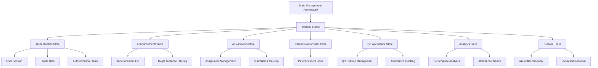
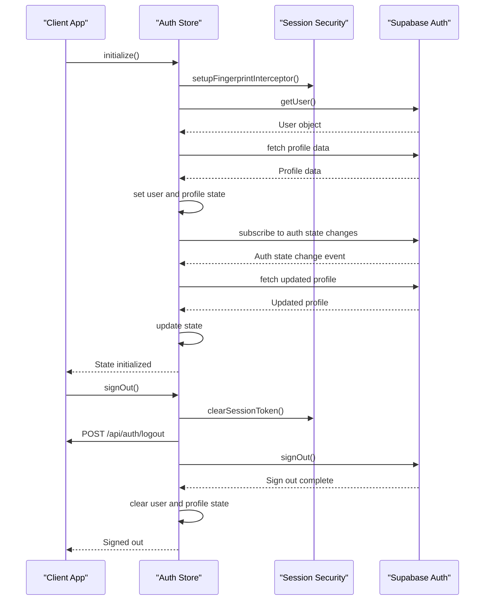
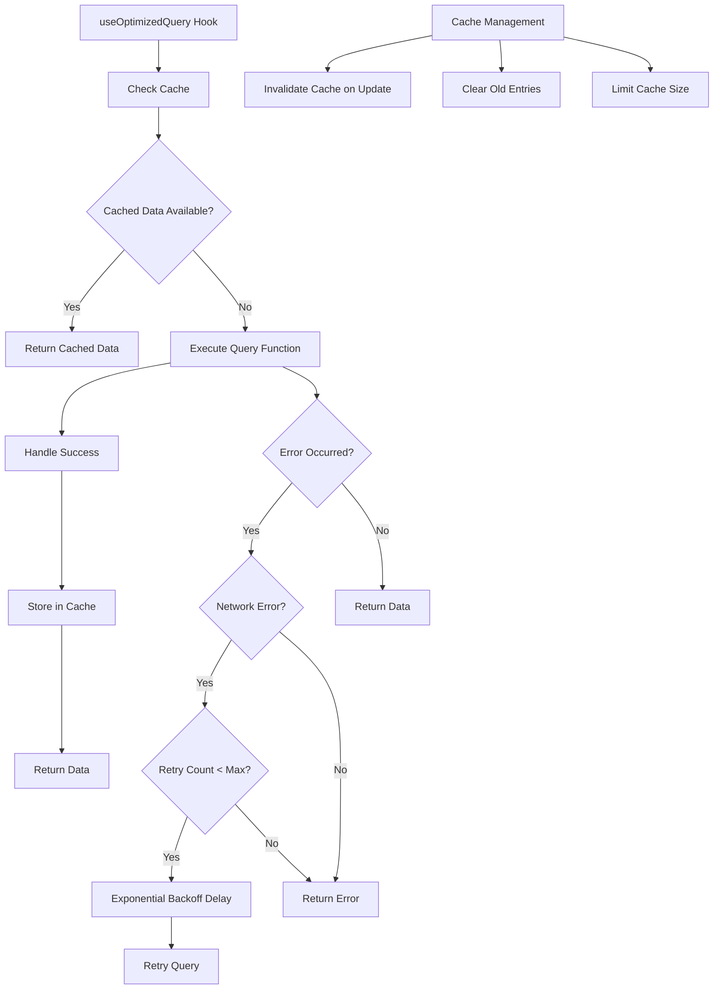
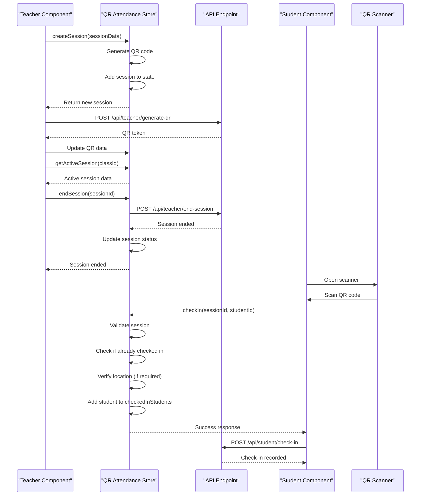
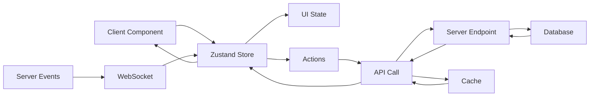
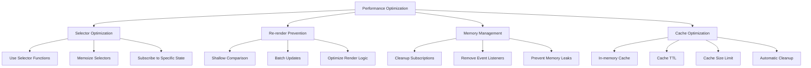

# State Management

<cite>
**Referenced Files in This Document**   
- [auth-store.ts](file://lib/auth-store.ts)
- [announcement-store.ts](file://lib/announcement-store.ts)
- [assignment-store.ts](file://lib/assignment-store.ts)
- [parent-store.ts](file://lib/parent-store.ts)
- [qr-attendance-store.ts](file://lib/qr-attendance-store.ts)
- [use-optimized-query.ts](file://lib/hooks/use-optimized-query.ts)
- [use-session-timeout.ts](file://lib/hooks/use-session-timeout.ts)
- [cache.ts](file://lib/cache.ts)
- [session-security.ts](file://lib/session-security.ts)
- [qr-scanner.tsx](file://components/qr-scanner.tsx)
- [qr-code-generator.tsx](file://components/qr-code-generator.tsx)
- [student/qr-checkin/page.tsx](file://app/student/qr-checkin/page.tsx)
- [teacher/qr-attendance/page.tsx](file://app/teacher/qr-attendance/page.tsx)
- [admin/announcements/page.tsx](file://app/admin/announcements/page.tsx)
- [analytics-store.ts](file://lib/analytics-store.ts)
</cite>

## Table of Contents
1. [Introduction](#introduction)
2. [Core State Management Architecture](#core-state-management-architecture)
3. [Zustand Store Implementation](#zustand-store-implementation)
4. [Middleware and Persistence](#middleware-and-persistence)
5. [Custom Hooks for Data Management](#custom-hooks-for-data-management)
6. [Store Usage Patterns](#store-usage-patterns)
7. [Integration with Server State](#integration-with-server-state)
8. [Performance Optimization](#performance-optimization)
9. [Best Practices](#best-practices)
10. [Conclusion](#conclusion)

## Introduction

The School-Management-System employs a sophisticated state management strategy centered around Zustand for global state management across key domains including authentication, announcements, assignments, parent relationships, and QR attendance. This documentation provides a comprehensive overview of the state management architecture, detailing the implementation patterns, integration with server state, performance considerations, and best practices for maintaining and extending the system's state management capabilities.

The system combines client-side state management with server-side data synchronization through React Query patterns, ensuring consistent and responsive user experiences across different user roles (admin, teacher, student). The architecture emphasizes security, performance, and maintainability through well-defined store patterns, middleware integration, and optimized data fetching strategies.

**Section sources**
- [auth-store.ts](file://lib/auth-store.ts#L1-L110)
- [announcement-store.ts](file://lib/announcement-store.ts#L1-L60)
- [assignment-store.ts](file://lib/assignment-store.ts#L1-L174)

## Core State Management Architecture

The state management architecture in the School-Management-System follows a modular approach with dedicated stores for different domains, all built on the Zustand library. This architecture provides a centralized yet segmented state management solution that balances global accessibility with domain-specific encapsulation.

The system implements a clear separation of concerns through specialized stores:
- **Authentication state** managed through `auth-store.ts` handles user sessions, profile information, and authentication status
- **Domain-specific stores** for announcements, assignments, parent relationships, and QR attendance provide focused state management for each functional area
- **Analytics store** consolidates performance and attendance data for reporting and visualization

Each store follows a consistent pattern of state definition, action implementation, and selector methods, ensuring predictability and maintainability across the codebase. The architecture supports both direct state access and computed selectors, allowing components to subscribe to specific state slices without unnecessary re-renders.

The stores are designed with performance in mind, incorporating optimizations such as memoized selectors, batched updates, and efficient state comparison to minimize re-renders and maximize application responsiveness.



**Diagram sources **
- [auth-store.ts](file://lib/auth-store.ts#L15-L26)
- [announcement-store.ts](file://lib/announcement-store.ts#L20-L25)
- [assignment-store.ts](file://lib/assignment-store.ts#L58-L78)
- [parent-store.ts](file://lib/parent-store.ts#L24-L36)
- [qr-attendance-store.ts](file://lib/qr-attendance-store.ts#L20-L30)
- [analytics-store.ts](file://lib/analytics-store.ts#L39-L46)

**Section sources**
- [auth-store.ts](file://lib/auth-store.ts#L1-L110)
- [announcement-store.ts](file://lib/announcement-store.ts#L1-L60)
- [assignment-store.ts](file://lib/assignment-store.ts#L1-L174)
- [parent-store.ts](file://lib/parent-store.ts#L1-L66)
- [qr-attendance-store.ts](file://lib/qr-attendance-store.ts#L1-L100)
- [analytics-store.ts](file://lib/analytics-store.ts#L1-L83)

## Zustand Store Implementation

The Zustand store implementation in the School-Management-System follows a consistent pattern across all domains, leveraging Zustand's lightweight API to create efficient and maintainable state stores. Each store is implemented as a custom hook that returns both state and actions, following React best practices for state management.

The authentication store (`auth-store.ts`) serves as the foundation of the state management system, managing user sessions, profile information, and authentication status. It implements a comprehensive initialization process that checks the current authentication state and sets up event listeners for authentication changes. The store also includes cleanup methods to prevent memory leaks by properly unsubscribing from authentication state changes.

```mermaid
classDiagram
class AuthState {
+user : User | null
+profile : UserProfile | null
+loading : boolean
+initialized : boolean
+setUser(user : User | null) : void
+setProfile(profile : UserProfile | null) : void
+setLoading(loading : boolean) : void
+initialize() : Promise~void~
+signOut() : Promise~void~
+cleanup() : void
}
class AnnouncementStore {
+announcements : Announcement[]
+addAnnouncement(announcement : Omit~Announcement, "id" | "createdAt"~) : void
+deleteAnnouncement(id : string) : void
+getAnnouncementsForUser(userRole : UserRole, grade? : string) : Announcement[]
}
class AssignmentStore {
+assignments : Assignment[]
+submissions : AssignmentSubmission[]
+createAssignment(assignment : Omit~Assignment, "id" | "createdAt"~) : void
+updateAssignment(id : string, updates : Partial~Assignment~) : void
+deleteAssignment(id : string) : void
+submitAssignment(submission : Omit~AssignmentSubmission, "id" | "submittedAt" | "status"~) : void
+gradeSubmission(submissionId : string, score : number, feedback : string, gradedBy : string) : void
+getAssignmentsByClass(classId : string) : Assignment[]
+getAssignmentsByTeacher(teacherId : string) : Assignment[]
+getAssignmentsForStudent(studentId : string, classIds : string[]) : Assignment[]
+getSubmissionsByAssignment(assignmentId : string) : AssignmentSubmission[]
+getStudentSubmission(assignmentId : string, studentId : string) : AssignmentSubmission | undefined
+getPendingGradingCount(teacherId : string) : number
}
class ParentStore {
+parents : Parent[]
+parentChildLinks : ParentChildLink[]
+getParent(parentId : string) : Parent | undefined
+getParentByEmail(email : string) : Parent | undefined
+getChildrenIds(parentId : string) : string[]
+getParentsForStudent(studentId : string) : Parent[]
+canViewStudent(parentId : string, studentId : string) : boolean
}
class QRAttendanceStore {
+sessions : QRAttendanceSession[]
+createSession(session : Omit~QRAttendanceSession, "id" | "qrCode" | "status" | "checkedInStudents"~) : QRAttendanceSession
+checkIn(sessionId : string, studentId : string, locationVerified? : boolean) : { success : boolean; message : string }
+endSession(sessionId : string) : void
+getActiveSession(classId : string) : QRAttendanceSession | undefined
+getSessionByQRCode(qrCode : string) : QRAttendanceSession | undefined
+getTeacherSessions(teacherId : string) : QRAttendanceSession[]
}
AuthState --> "uses" AuthStore : "export const useAuthStore"
AnnouncementStore --> "uses" AnnouncementStore : "export const useAnnouncementStore"
AssignmentStore --> "uses" AssignmentStore : "export const useAssignmentStore"
ParentStore --> "uses" ParentStore : "export const useParentStore"
QRAttendanceStore --> "uses" QRAttendanceStore : "export const useQRAttendanceStore"
```

**Diagram sources **
- [auth-store.ts](file://lib/auth-store.ts#L15-L26)
- [announcement-store.ts](file://lib/announcement-store.ts#L20-L25)
- [assignment-store.ts](file://lib/assignment-store.ts#L58-L78)
- [parent-store.ts](file://lib/parent-store.ts#L24-L36)
- [qr-attendance-store.ts](file://lib/qr-attendance-store.ts#L20-L30)

**Section sources**
- [auth-store.ts](file://lib/auth-store.ts#L1-L110)
- [announcement-store.ts](file://lib/announcement-store.ts#L1-L60)
- [assignment-store.ts](file://lib/assignment-store.ts#L1-L174)
- [parent-store.ts](file://lib/parent-store.ts#L1-L66)
- [qr-attendance-store.ts](file://lib/qr-attendance-store.ts#L1-L100)

## Middleware and Persistence

The state management system incorporates middleware patterns for handling side effects and persistence, ensuring that state changes are properly synchronized with external systems and persisted across sessions. The authentication store implements a sophisticated initialization process that sets up fingerprint interception for session security and manages subscription cleanup to prevent memory leaks.

The system uses a combination of client-side caching and server-side session management to maintain state consistency. The `session-security.ts` module implements comprehensive session security features including fingerprint validation, IP address hashing, and device tracking. When a user logs in, the system creates a session record with a unique session token and validates subsequent requests against the stored fingerprint to prevent session hijacking.



**Diagram sources **
- [auth-store.ts](file://lib/auth-store.ts#L41-L83)
- [session-security.ts](file://lib/session-security.ts#L68-L147)
- [auth-store.ts](file://lib/auth-store.ts#L85-L99)

**Section sources**
- [auth-store.ts](file://lib/auth-store.ts#L1-L110)
- [session-security.ts](file://lib/session-security.ts#L1-L373)

## Custom Hooks for Data Management

The system implements a suite of custom hooks for optimized data fetching and state management, with `use-optimized-query.ts` serving as the cornerstone of the data management strategy. This hook provides automatic caching, deduplication, and retry logic for transient failures, significantly improving application performance and reliability.

The `use-optimized-query` hook implements several key optimizations:
- **Automatic caching** with configurable TTL (time-to-live) to prevent duplicate API calls
- **Request deduplication** to ensure only one request is made for the same query key
- **Retry logic** with exponential backoff for network errors and transient failures
- **Cache invalidation** mechanisms to ensure data freshness when needed



**Diagram sources **
- [use-optimized-query.ts](file://lib/hooks/use-optimized-query.ts#L28-L124)
- [cache.ts](file://lib/cache.ts#L16-L39)

**Section sources**
- [use-optimized-query.ts](file://lib/hooks/use-optimized-query.ts#L1-L275)
- [cache.ts](file://lib/cache.ts#L1-L128)

## Store Usage Patterns

The state management system demonstrates consistent usage patterns across components, with clear examples of state access, actions, and subscription methods. Components access store state through selector functions to minimize re-renders and optimize performance.

The QR attendance system provides a comprehensive example of store usage patterns. In the teacher interface (`teacher/qr-attendance/page.tsx`), the component uses the QR attendance store to manage active sessions, generate QR codes, and track student check-ins. The student check-in page (`student/qr-checkin/page.tsx`) uses the store to validate attendance sessions and record check-ins.



**Diagram sources **
- [qr-attendance-store.ts](file://lib/qr-attendance-store.ts#L32-L100)
- [teacher/qr-attendance/page.tsx](file://app/teacher/qr-attendance/page.tsx#L209-L310)
- [student/qr-checkin/page.tsx](file://app/student/qr-checkin/page.tsx#L115-L166)

**Section sources**
- [qr-attendance-store.ts](file://lib/qr-attendance-store.ts#L1-L100)
- [teacher/qr-attendance/page.tsx](file://app/teacher/qr-attendance/page.tsx#L1-L579)
- [student/qr-checkin/page.tsx](file://app/student/qr-checkin/page.tsx#L1-L309)
- [qr-scanner.tsx](file://components/qr-scanner.tsx#L1-L161)
- [qr-code-generator.tsx](file://components/qr-code-generator.tsx#L1-L66)

## Integration with Server State

The state management system integrates seamlessly with server state through React Query patterns and API endpoints, ensuring data consistency between client and server. The system uses a hybrid approach where client-side stores manage UI state and temporary data, while server-side APIs handle persistent data storage and business logic.

The integration follows a clear pattern:
- **Client stores** manage UI state, temporary data, and optimistic updates
- **API endpoints** handle data persistence, validation, and business logic
- **Custom hooks** bridge the gap between client and server, handling data fetching, caching, and synchronization



**Diagram sources **
- [auth-store.ts](file://lib/auth-store.ts#L55-L67)
- [announcement-store.ts](file://lib/announcement-store.ts#L30-L38)
- [assignment-store.ts](file://lib/assignment-store.ts#L110-L122)
- [admin/announcements/page.tsx](file://app/admin/announcements/page.tsx#L81-L99)
- [teacher/qr-attendance/page.tsx](file://app/teacher/qr-attendance/page.tsx#L229-L244)

**Section sources**
- [auth-store.ts](file://lib/auth-store.ts#L1-L110)
- [announcement-store.ts](file://lib/announcement-store.ts#L1-L60)
- [assignment-store.ts](file://lib/assignment-store.ts#L1-L174)
- [admin/announcements/page.tsx](file://app/admin/announcements/page.tsx#L1-L258)
- [teacher/qr-attendance/page.tsx](file://app/teacher/qr-attendance/page.tsx#L1-L579)

## Performance Optimization

The state management system incorporates several performance optimization techniques to ensure responsive user experiences and efficient resource utilization. These optimizations address re-render prevention, memory management, and selector optimization.

Key performance optimizations include:
- **Selector optimization** using memoized selectors to prevent unnecessary re-renders
- **Batched updates** to minimize state change notifications
- **Efficient state comparison** to detect actual changes
- **Memory leak prevention** through proper subscription cleanup
- **Caching strategies** to reduce network requests and improve response times

The `use-optimized-query` hook implements a sophisticated caching mechanism that stores query results in memory with configurable TTL. The cache automatically removes old entries and limits its size to prevent memory bloat. The hook also implements request deduplication, ensuring that multiple components requesting the same data don't trigger redundant API calls.



**Diagram sources **
- [use-optimized-query.ts](file://lib/hooks/use-optimized-query.ts#L16-L39)
- [cache.ts](file://lib/cache.ts#L9-L10)
- [auth-store.ts](file://lib/auth-store.ts#L28-L30)
- [use-session-timeout.ts](file://lib/hooks/use-session-timeout.ts#L39-L43)

**Section sources**
- [use-optimized-query.ts](file://lib/hooks/use-optimized-query.ts#L1-L275)
- [cache.ts](file://lib/cache.ts#L1-L128)
- [auth-store.ts](file://lib/auth-store.ts#L1-L110)
- [use-session-timeout.ts](file://lib/hooks/use-session-timeout.ts#L1-L198)

## Best Practices

The state management implementation in the School-Management-System follows several best practices for creating maintainable, scalable, and performant state management solutions. These practices ensure consistency across stores and facilitate easier maintenance and extension of the system.

Key best practices include:
- **Consistent store structure** with standardized state properties and action naming
- **Type safety** through comprehensive TypeScript interfaces and type definitions
- **Error handling** with proper error boundaries and user feedback
- **Memory management** through proper cleanup of subscriptions and event listeners
- **Performance optimization** with selector memoization and re-render prevention
- **Security considerations** with proper session management and data validation

When creating new stores, developers should follow the established patterns:
1. Define clear TypeScript interfaces for state and actions
2. Implement initialization and cleanup methods
3. Use selector functions for derived data
4. Include proper error handling and user feedback
5. Optimize for performance with memoized selectors
6. Implement proper cleanup to prevent memory leaks

```mermaid
flowchart TD
A[Best Practices] --> B[Consistent Structure]
A --> C[Type Safety]
A --> D[Error Handling]
A --> E[Memory Management]
A --> F[Performance]
A --> G[Security]
B --> H[Standard State Properties]
B --> I[Consistent Action Names]
B --> J[Uniform Patterns]
C --> K[TypeScript Interfaces]
C --> L[Type Definitions]
C --> M[Type Checking]
D --> N[Error Boundaries]
D --> O[User Feedback]
D --> P[Graceful Degradation]
E --> Q[Cleanup Subscriptions]
E --> R[Remove Listeners]
E --> S[Prevent Leaks]
F --> T[Selector Memoization]
F --> U[Re-render Prevention]
F --> V[Optimize Updates]
G --> W[Session Management]
G --> X[Data Validation]
G --> Y[Security Checks]
```



**Diagram sources **
- [auth-store.ts](file://lib/auth-store.ts#L15-L26)
- [announcement-store.ts](file://lib/announcement-store.ts#L20-L25)
- [assignment-store.ts](file://lib/assignment-store.ts#L58-L78)
- [use-optimized-query.ts](file://lib/hooks/use-optimized-query.ts#L8-L14)
- [use-session-timeout.ts](file://lib/hooks/use-session-timeout.ts#L8-L14)

**Section sources**
- [auth-store.ts](file://lib/auth-store.ts#L1-L110)
- [announcement-store.ts](file://lib/announcement-store.ts#L1-L60)
- [assignment-store.ts](file://lib/assignment-store.ts#L1-L174)
- [use-optimized-query.ts](file://lib/hooks/use-optimized-query.ts#L1-L275)
- [use-session-timeout.ts](file://lib/hooks/use-session-timeout.ts#L1-L198)

## Conclusion

The state management strategy in the School-Management-System provides a robust, scalable, and maintainable foundation for managing application state across multiple domains. By leveraging Zustand for global state management and combining it with custom hooks for data fetching and optimization, the system achieves a balance between simplicity and functionality.

The architecture demonstrates several key strengths:
- **Modularity** through dedicated stores for different domains
- **Performance** with optimized selectors, caching, and re-render prevention
- **Security** with comprehensive session management and validation
- **Maintainability** through consistent patterns and type safety
- **Scalability** with clear extension points and best practices

The integration between client-side state management and server-side data persistence ensures data consistency while providing responsive user experiences. The system's use of React Query patterns, custom hooks, and middleware demonstrates a sophisticated approach to state management that can serve as a model for similar applications.

By following the established best practices and patterns, developers can extend the system with new features while maintaining code quality and performance standards.

**Section sources**
- [auth-store.ts](file://lib/auth-store.ts#L1-L110)
- [announcement-store.ts](file://lib/announcement-store.ts#L1-L60)
- [assignment-store.ts](file://lib/assignment-store.ts#L1-L174)
- [parent-store.ts](file://lib/parent-store.ts#L1-L66)
- [qr-attendance-store.ts](file://lib/qr-attendance-store.ts#L1-L100)
- [use-optimized-query.ts](file://lib/hooks/use-optimized-query.ts#L1-L275)
- [use-session-timeout.ts](file://lib/hooks/use-session-timeout.ts#L1-L198)