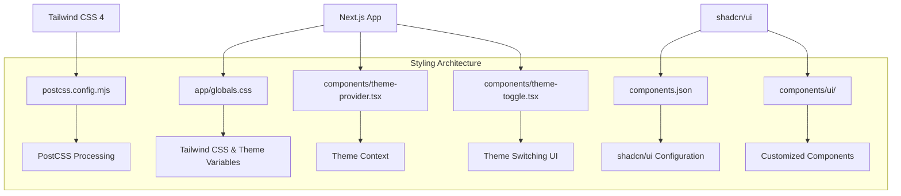
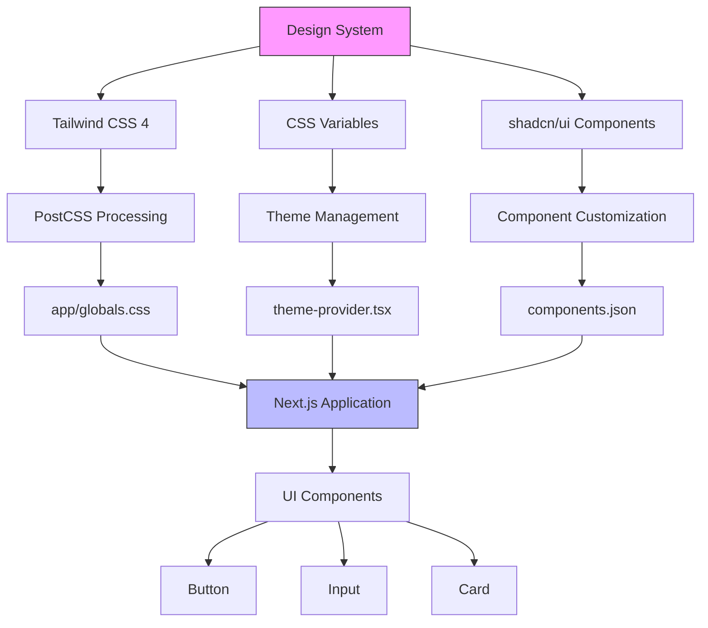
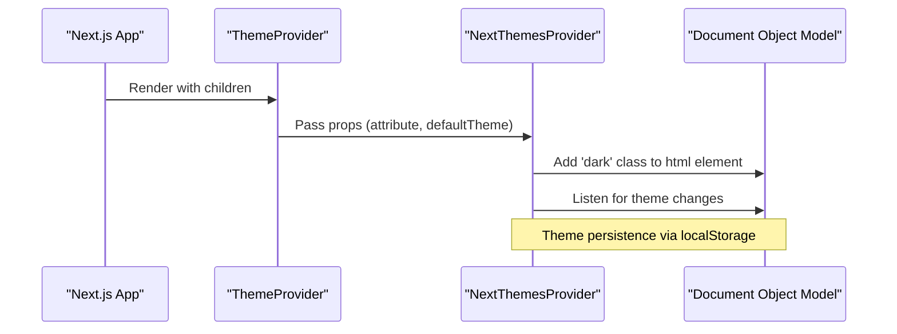
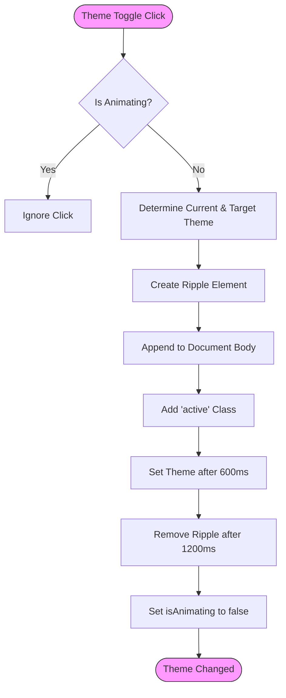
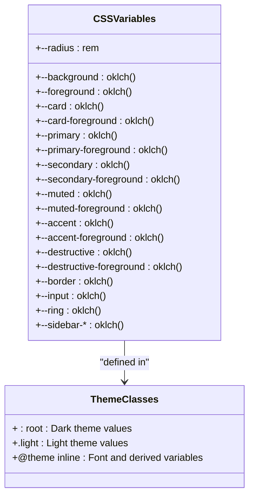
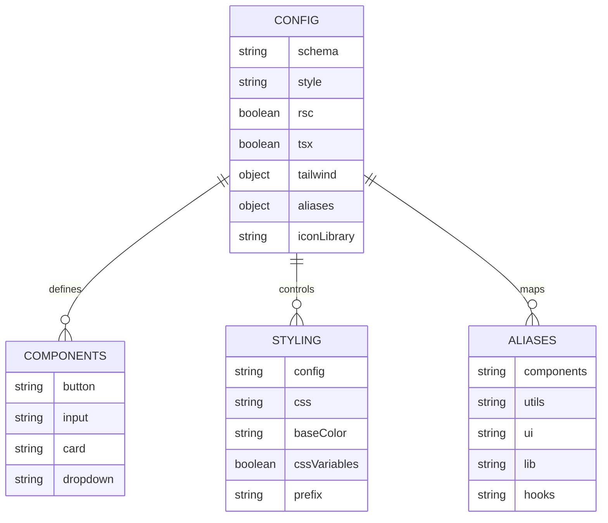
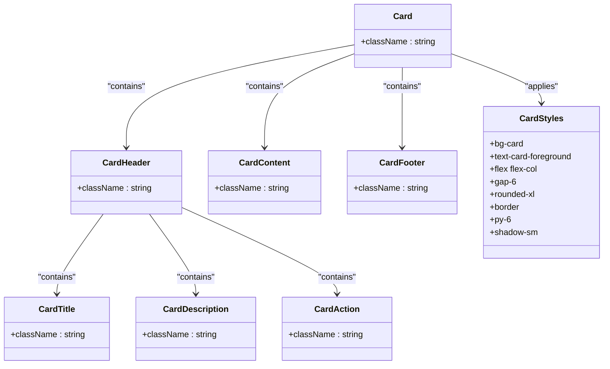
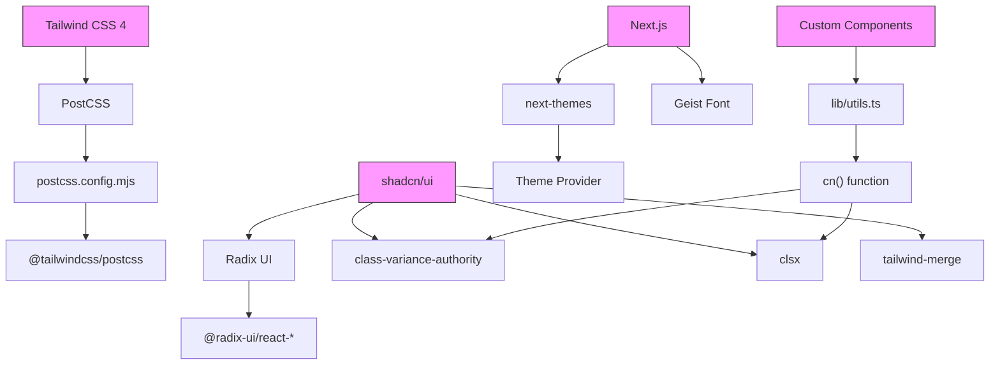

# Styling Strategy

<cite>
**Referenced Files in This Document**   
- [app/globals.css](file://app/globals.css)
- [components/theme-provider.tsx](file://components/theme-provider.tsx)
- [components/theme-toggle.tsx](file://components/theme-toggle.tsx)
- [components.json](file://components.json)
- [postcss.config.mjs](file://postcss.config.mjs)
- [next.config.mjs](file://next.config.mjs)
- [app/layout.tsx](file://app/layout.tsx)
- [components/ui/button.tsx](file://components/ui/button.tsx)
- [components/ui/input.tsx](file://components/ui/input.tsx)
- [components/ui/card.tsx](file://components/ui/card.tsx)
- [lib/utils.ts](file://lib/utils.ts)
</cite>

## Table of Contents
1. [Introduction](#introduction)
2. [Project Structure](#project-structure)
3. [Core Components](#core-components)
4. [Architecture Overview](#architecture-overview)
5. [Detailed Component Analysis](#detailed-component-analysis)
6. [Dependency Analysis](#dependency-analysis)
7. [Performance Considerations](#performance-considerations)
8. [Troubleshooting Guide](#troubleshooting-guide)
9. [Conclusion](#conclusion)

## Introduction
The School-Management-System implements a modern styling architecture using Tailwind CSS 4 with a custom design system. The styling approach combines CSS variables for theme management, Next.js integration, and shadcn/ui component customization to create a consistent and accessible user interface across the application. This documentation details the implementation of the styling system, including theme switching, responsive design, and component customization.

## Project Structure

The styling architecture is organized across several key directories and files in the project structure:

- `app/globals.css`: Main global styles and theme definitions
- `components/theme-provider.tsx`: Theme context provider component
- `components/theme-toggle.tsx`: UI component for theme switching
- `components.json`: Configuration for shadcn/ui component library
- `postcss.config.mjs`: PostCSS configuration for Tailwind
- `components/ui/`: Customized shadcn/ui components
- `lib/utils.ts`: Utility functions including styling helpers



**Diagram sources**
- [app/globals.css](file://app/globals.css#L1-L169)
- [components.json](file://components.json#L1-L22)
- [postcss.config.mjs](file://postcss.config.mjs#L1-L9)

**Section sources**
- [app/globals.css](file://app/globals.css#L1-L169)
- [components/theme-provider.tsx](file://components/theme-provider.tsx#L1-L12)
- [components/theme-toggle.tsx](file://components/theme-toggle.tsx#L1-L79)

## Core Components

The styling system is built around several core components that work together to provide a consistent design language across the application. The implementation leverages Tailwind CSS 4 with a custom configuration and design system based on CSS variables for theme management.

The theme system uses the `next-themes` library to manage theme switching between dark, light, and system preferences. CSS variables defined in the `:root` and `.light` classes provide the foundation for the design system, with colors specified using the OKLCH color format for optimal perceptual uniformity.

```mermaid
classDiagram
class ThemeProvider {
+attribute : string
+defaultTheme : string
+enableSystem : boolean
+disableTransitionOnChange : boolean
}
class ThemeToggle {
-isAnimating : boolean
+handleThemeChange(newTheme : string)
}
class ThemeRipple {
+position : fixed
+width : 0 → 300vmax
+height : 0 → 300vmax
+opacity : 0 → 1
+transition : 1.2s cubic-bezier
}
ThemeProvider --> ThemeToggle : "provides context"
ThemeToggle --> ThemeRipple : "creates animation"
ThemeProvider --> "next-themes" : "wraps"
```

**Diagram sources**
- [components/theme-provider.tsx](file://components/theme-provider.tsx#L1-L12)
- [components/theme-toggle.tsx](file://components/theme-toggle.tsx#L1-L79)
- [app/globals.css](file://app/globals.css#L131-L159)

**Section sources**
- [components/theme-provider.tsx](file://components/theme-provider.tsx#L1-L12)
- [components/theme-toggle.tsx](file://components/theme-toggle.tsx#L1-L79)
- [app/globals.css](file://app/globals.css#L1-L169)

## Architecture Overview

The styling architecture follows a layered approach that integrates Tailwind CSS 4 with a custom design system and theme management. The system is designed to provide visual consistency while allowing for dynamic theme switching and component customization.



**Diagram sources**
- [app/globals.css](file://app/globals.css#L1-L169)
- [components/theme-provider.tsx](file://components/theme-provider.tsx#L1-L12)
- [components.json](file://components.json#L1-L22)

## Detailed Component Analysis

### Theme Management System
The theme management system is implemented using CSS variables and the `next-themes` library, providing a seamless experience for users to switch between dark, light, and system themes.

#### Theme Provider Implementation
The `theme-provider.tsx` component wraps the application with the `NextThemesProvider` from `next-themes`, configuring the theme attribute to use CSS classes and setting the default theme to dark.



**Diagram sources**
- [components/theme-provider.tsx](file://components/theme-provider.tsx#L1-L12)
- [app/layout.tsx](file://app/layout.tsx#L28-L32)

#### Theme Toggle with Visual Feedback
The `theme-toggle.tsx` component provides a user interface for switching themes with a visual ripple animation that enhances the user experience during theme transitions.



**Diagram sources**
- [components/theme-toggle.tsx](file://components/theme-toggle.tsx#L1-L79)
- [app/globals.css](file://app/globals.css#L131-L159)

**Section sources**
- [components/theme-toggle.tsx](file://components/theme-toggle.tsx#L1-L79)
- [app/globals.css](file://app/globals.css#L131-L169)

### Global Styles and CSS Variables
The global styles are defined in `app/globals.css` using CSS variables for all design tokens, enabling dynamic theme switching and consistent styling across the application.

#### CSS Variables Structure
The CSS variables follow a systematic naming convention and organization:



**Diagram sources**
- [app/globals.css](file://app/globals.css#L6-L80)
- [app/globals.css](file://app/globals.css#L80-L116)

**Section sources**
- [app/globals.css](file://app/globals.css#L6-L116)

### Component Library Customization
The component library is customized through the `components.json` configuration file, which integrates with shadcn/ui to provide a consistent design system across all UI components.

#### shadcn/ui Configuration
The `components.json` file configures the shadcn/ui component library with specific settings for the project:



**Diagram sources**
- [components.json](file://components.json#L1-L22)

**Section sources**
- [components.json](file://components.json#L1-L22)

### UI Component Implementation
The UI components are implemented using the class-variance-authority (CVA) pattern, which provides a type-safe way to define component variants and styles.

#### Button Component Analysis
The button component demonstrates the use of CVA for defining variants and sizes:

```mermaid
classDiagram
class Button {
+className : string
+variant : 'default' | 'destructive' | 'outline' | 'secondary' | 'ghost' | 'link'
+size : 'default' | 'sm' | 'lg' | 'icon' | 'icon-sm' | 'icon-lg'
+asChild : boolean
}
class buttonVariants {
+variants : {
variant : {
default : "bg-primary text-primary-foreground hover : bg-primary/90"
destructive : "bg-destructive text-white hover : bg-destructive/90"
outline : "border bg-background shadow-xs hover : bg-accent hover : text-accent-foreground"
secondary : "bg-secondary text-secondary-foreground hover : bg-secondary/80"
ghost : "hover : bg-accent hover : text-accent-foreground"
link : "text-primary underline-offset-4 hover : underline"
}
size : {
default : "h-9 px-4 py-2"
sm : "h-8 rounded-md px-3"
lg : "h-10 rounded-md px-6"
icon : "size-9"
'icon-sm' : "size-8"
'icon-lg' : "size-10"
}
}
+defaultVariants : { variant : 'default', size : 'default' }
}
Button --> buttonVariants : "uses"
buttonVariants --> cn : "composes with"
cn --> tailwind-merge : "wraps"
cn --> clsx : "wraps"
```

**Diagram sources**
- [components/ui/button.tsx](file://components/ui/button.tsx#L7-L37)
- [lib/utils.ts](file://lib/utils.ts#L4-L6)

**Section sources**
- [components/ui/button.tsx](file://components/ui/button.tsx#L1-L61)
- [lib/utils.ts](file://lib/utils.ts#L1-L6)

#### Input Component Analysis
The input component implements accessibility features and visual feedback for different states:

```mermaid
flowchart TD
A["Input Component"] --> B["Base Styles"]
B --> C["Size: h-9 w-full min-w-0"]
B --> D["Typography: text-base md:text-sm"]
B --> E["Border: border rounded-md"]
B --> F["Padding: px-3 py-1"]
B --> G["Background: bg-transparent"]
B --> H["Shadow: shadow-xs"]
B --> I["Transition: transition-[color,box-shadow]"]
A --> J["Focus Styles"]
J --> K["Border: focus-visible:border-ring"]
J --> L["Ring: focus-visible:ring-ring/50 focus-visible:ring-[3px]"]
A --> M["Invalid State"]
M --> N["Border: aria-invalid:border-destructive"]
M --> O["Ring: aria-invalid:ring-destructive/20 dark:aria-invalid:ring-destructive/40"]
A --> P["Disabled State"]
P --> Q["Opacity: disabled:opacity-50"]
P --> R["Cursor: disabled:cursor-not-allowed"]
P --> S["Pointer Events: disabled:pointer-events-none"]
style A fill:#f9f,stroke:#333
```



**Diagram sources**
- [components/ui/input.tsx](file://components/ui/input.tsx#L1-L22)

**Section sources**
- [components/ui/input.tsx](file://components/ui/input.tsx#L1-L22)

#### Card Component Analysis
The card component implements a flexible layout system with header, content, and footer sections:



**Diagram sources**
- [components/ui/card.tsx](file://components/ui/card.tsx#L1-L93)

**Section sources**
- [components/ui/card.tsx](file://components/ui/card.tsx#L1-L93)

## Dependency Analysis

The styling system has several key dependencies that work together to provide the complete functionality:



**Diagram sources**
- [package.json](file://package.json#L1-L90)
- [postcss.config.mjs](file://postcss.config.mjs#L1-L9)
- [components.json](file://components.json#L1-L22)

**Section sources**
- [package.json](file://package.json#L1-L90)
- [postcss.config.mjs](file://postcss.config.mjs#L1-L9)

## Performance Considerations

The styling architecture is designed with performance in mind, leveraging several optimization techniques:

1. **CSS Variable Efficiency**: Using CSS variables for theme management reduces the need for multiple CSS classes and enables efficient theme switching without re-rendering components.

2. **Tailwind JIT Compilation**: Tailwind CSS 4's Just-In-Time compiler generates only the CSS classes that are actually used in the application, significantly reducing the final bundle size.

3. **Optimized Animations**: The theme ripple animation uses hardware-accelerated properties (transform, opacity) and is carefully timed to provide visual feedback without impacting performance.

4. **Component Composition**: The use of `class-variance-authority` and `cn()` utility function optimizes class name composition and reduces runtime overhead.

5. **Font Optimization**: The Geist font is loaded efficiently through Next.js font optimization, reducing layout shift and improving loading performance.

[No sources needed since this section provides general guidance]

## Troubleshooting Guide

When working with the styling system, several common issues may arise. This section provides guidance for troubleshooting and resolving these issues.

### Theme Switching Issues
If theme switching is not working correctly, check the following:

**Section sources**
- [components/theme-provider.tsx](file://components/theme-provider.tsx#L1-L12)
- [components/theme-toggle.tsx](file://components/theme-toggle.tsx#L1-L79)
- [app/layout.tsx](file://app/layout.tsx#L26-L32)

### CSS Variable Issues
If CSS variables are not being applied correctly, verify the following:

**Section sources**
- [app/globals.css](file://app/globals.css#L6-L116)
- [components.json](file://components.json#L8-L11)

### Component Styling Issues
If shadcn/ui components are not styled correctly, check the following:

**Section sources**
- [components.json](file://components.json#L6-L11)
- [components/ui/button.tsx](file://components/ui/button.tsx#L1-L61)
- [lib/utils.ts](file://lib/utils.ts#L4-L6)

## Conclusion

The styling architecture of the School-Management-System effectively combines Tailwind CSS 4 with a custom design system to create a consistent and accessible user interface. The implementation of CSS variables for theme management, combined with the `next-themes` library, provides a seamless experience for users to switch between dark, light, and system themes.

The integration with shadcn/ui through the `components.json` configuration file ensures that all UI components follow a consistent design language while allowing for customization through the CVA pattern. The use of modern CSS features like the OKLCH color format and container queries enables a visually appealing and responsive design.

The architecture is designed with performance in mind, leveraging Tailwind's JIT compiler, optimized animations, and efficient class name composition to deliver a fast and responsive user experience. The system provides a solid foundation for maintaining visual consistency across the application while allowing for future enhancements and customization.