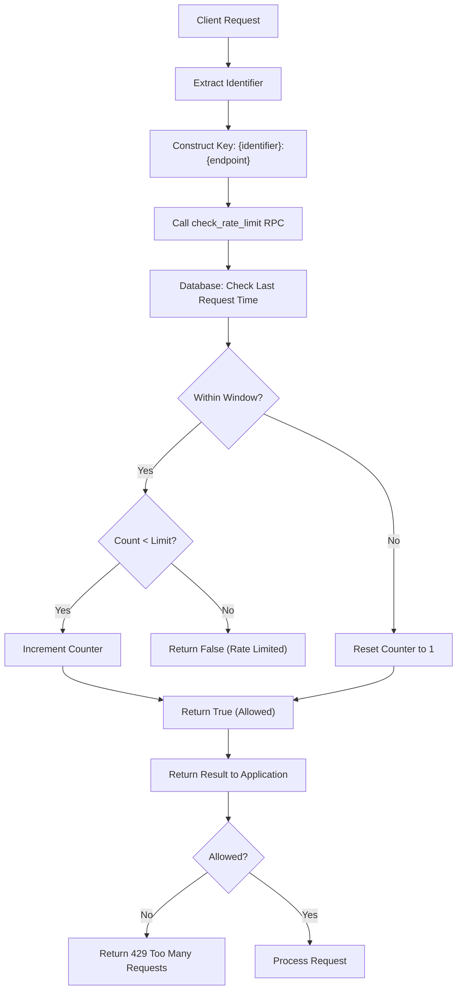
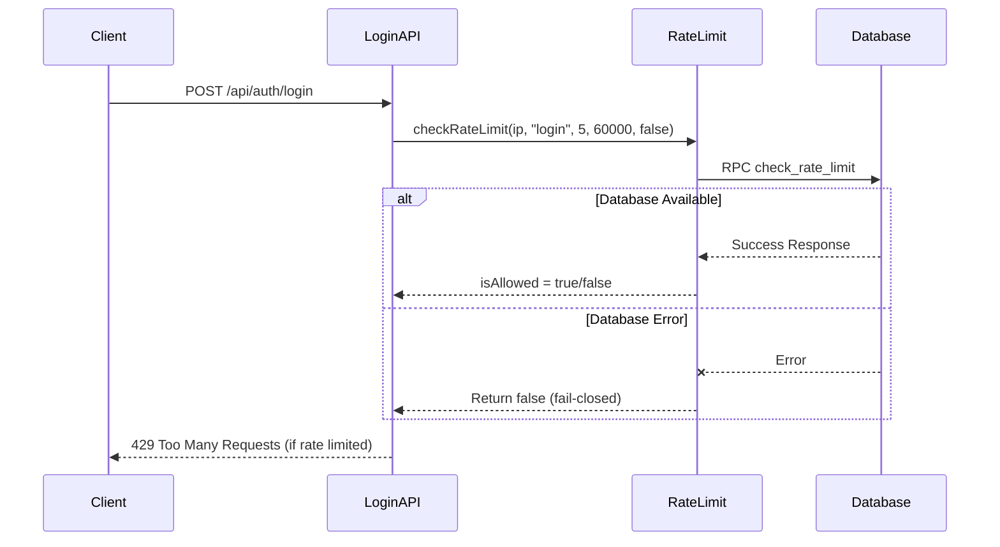
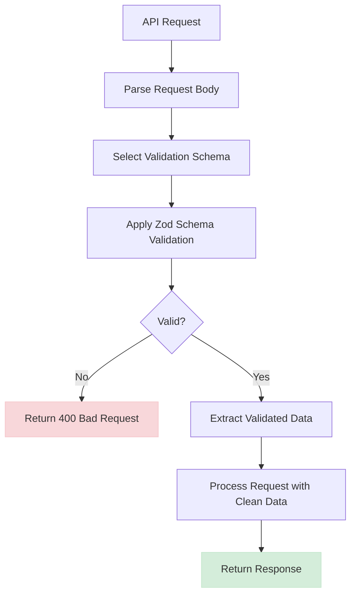
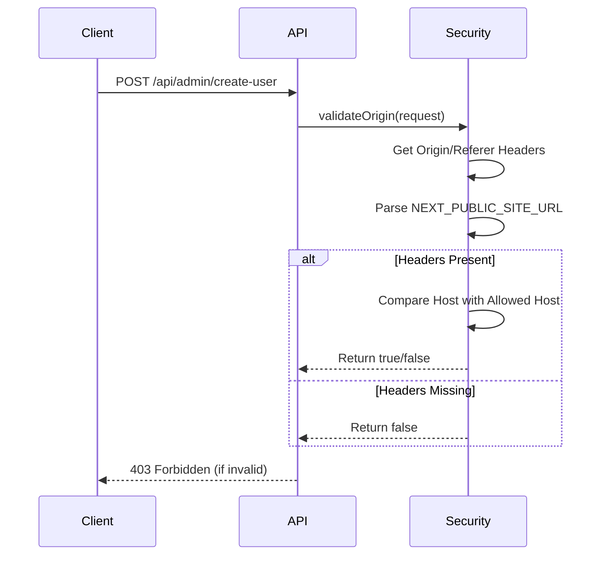
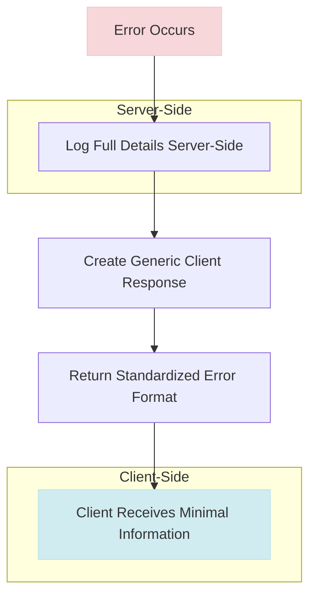

# API Security

<cite>
**Referenced Files in This Document**   
- [rate-limit.ts](file://lib/rate-limit.ts)
- [validation-schemas.ts](file://lib/validation-schemas.ts)
- [security.ts](file://lib/security.ts)
- [session-security.ts](file://lib/session-security.ts)
- [api-errors.ts](file://lib/api-errors.ts)
- [login/route.ts](file://app/api/auth/login/route.ts)
- [create-user/route.ts](file://app/api/admin/create-user/route.ts)
- [create/route.ts](file://app/api/announcements/create/route.ts)
- [proxy.ts](file://proxy.ts)
- [20260101070340_rate_limit_table.sql](file://supabase/migrations/20260101070340_rate_limit_table.sql)
- [20260101070343_rate_limit_rpc.sql](file://supabase/migrations/20260101070343_rate_limit_rpc.sql)
</cite>

## Table of Contents
1. [Introduction](#introduction)
2. [Rate Limiting Implementation](#rate-limiting-implementation)
3. [Fail-Closed Authentication Behavior](#fail-closed-authentication-behavior)
4. [Input Validation with Zod Schemas](#input-validation-with-zod-schemas)
5. [Origin/Referer Validation for CSRF Protection](#originreferer-validation-for-csrf-protection)
6. [Secure Error Handling](#secure-error-handling)
7. [Common Security Issues and Mitigations](#common-security-issues-and-mitigations)
8. [Configuration Options and Secure API Patterns](#configuration-options-and-secure-api-patterns)

## Introduction
The School-Management-System implements a comprehensive API security framework designed to protect against common web vulnerabilities including brute force attacks, injection attacks, CSRF, and information leakage. The system employs database-backed atomic RPC calls for rate limiting, fail-closed behavior for authentication endpoints, Zod schema-based input validation, origin/referer validation, and secure error handling practices. This document details these security mechanisms and provides guidance for implementing secure API patterns across the application.

## Rate Limiting Implementation

The system implements rate limiting using a database-backed atomic RPC (Remote Procedure Call) mechanism to prevent brute force attacks and abuse of API endpoints. The implementation uses Supabase's PostgreSQL database to store rate limit counters and employs atomic transactions to prevent race conditions.

The rate limiting system is implemented in two components: a database table for storing rate limit state and an atomic RPC function for checking and incrementing counters. The `rate_limits` table stores the current count and timestamp for each rate limit key, with the key being a combination of identifier and endpoint. The `check_rate_limit` RPC function performs atomic operations to check the current count against limits and increment it if allowed.

**Diagram sources**
- [rate-limit.ts](file://lib/rate-limit.ts#L25-L56)
- [20260101070340_rate_limit_table.sql](file://supabase/migrations/20260101070340_rate_limit_table.sql#L1-L18)
- [20260101070343_rate_limit_rpc.sql](file://supabase/migrations/20260101070343_rate_limit_rpc.sql#L1-L41)

**Section sources**
- [rate-limit.ts](file://lib/rate-limit.ts#L1-L56)
- [20260101070340_rate_limit_table.sql](file://supabase/migrations/20260101070340_rate_limit_table.sql#L1-L18)
- [20260101070343_rate_limit_rpc.sql](file://supabase/migrations/20260101070343_rate_limit_rpc.sql#L1-L41)

## Fail-Closed Authentication Behavior

Authentication endpoints implement a fail-closed security model during database outages or errors. This means that when the rate limiting system encounters errors, it denies access by default for security-critical endpoints like login, preventing potential brute force attacks during infrastructure failures.

The `checkRateLimit` function in `rate-limit.ts` accepts a `failOpen` parameter that determines the behavior during errors. For most endpoints, the default `failOpen = true` allows requests during database errors to maintain availability. However, for authentication endpoints like login, this parameter is explicitly set to `false`, implementing fail-closed behavior.

This fail-closed approach ensures that even if the database is temporarily unavailable, attackers cannot exploit the situation to perform unlimited login attempts. The system prioritizes security over availability for authentication endpoints, recognizing that preventing account compromise is more critical than maintaining login functionality during outages.

**Diagram sources**
- [rate-limit.ts](file://lib/rate-limit.ts#L25-L56)
- [login/route.ts](file://app/api/auth/login/route.ts#L7-L21)

**Section sources**
- [rate-limit.ts](file://lib/rate-limit.ts#L25-L56)
- [login/route.ts](file://app/api/auth/login/route.ts#L7-L21)

## Input Validation with Zod Schemas

The system implements comprehensive input validation using Zod schemas to prevent injection attacks and ensure data integrity across all API routes. Validation schemas are defined centrally in `validation-schemas.ts` and applied consistently across relevant API endpoints.

The validation approach includes type checking, length constraints, format validation, and custom business rules. For example, the `createAnnouncementSchema` validates that announcement titles are between 1 and 200 characters, content is between 1 and 10,000 characters, and target audience is one of the allowed values ('all', 'students', 'teachers', 'parents').

API routes implement validation by importing the appropriate schema and using the `safeParse` method, which returns a result object indicating success or failure without throwing exceptions. This approach prevents unhandled errors from malformed requests and provides structured error information.

**Diagram sources**
- [validation-schemas.ts](file://lib/validation-schemas.ts#L1-L126)
- [create/route.ts](file://app/api/announcements/create/route.ts#L44-L49)

**Section sources**
- [validation-schemas.ts](file://lib/validation-schemas.ts#L1-L126)
- [create/route.ts](file://app/api/announcements/create/route.ts#L44-L49)

## Origin/Referer Validation for CSRF Protection

The system implements CSRF (Cross-Site Request Forgery) protection through origin and referer header validation for all state-changing API requests. This validation ensures that requests originate from the same domain as the application, preventing malicious sites from making unauthorized requests on behalf of authenticated users.

The `validateOrigin` function in `security.ts` checks both the Origin and Referer headers against the configured application URL. The function first attempts to match against the `NEXT_PUBLIC_SITE_URL` environment variable for strict domain matching. If not configured, it falls back to comparing with the Host header, providing protection even in dynamic deployment environments.

This validation is applied globally through the `proxy.ts` middleware for all API routes with POST, PUT, DELETE, or PATCH methods, with exceptions for webhook endpoints that use their own signature verification mechanisms.

**Diagram sources**
- [security.ts](file://lib/security.ts#L20-L67)
- [proxy.ts](file://proxy.ts#L50-L64)

**Section sources**
- [security.ts](file://lib/security.ts#L20-L67)
- [proxy.ts](file://proxy.ts#L50-L64)

## Secure Error Handling

The system implements secure error handling practices to prevent information leakage and maintain consistent error responses. The `api-errors.ts` module provides centralized error handling that logs detailed information server-side while returning generic messages to clients.

The error handling strategy follows the principle of least information disclosure. When errors occur, full details including stack traces are logged server-side for debugging purposes, but clients receive only generic messages that do not reveal internal system details. This prevents attackers from using error messages to gather information about the system architecture or data structure.

The system defines common error responses such as unauthorized, forbidden, not found, and rate limited, ensuring consistency across all API endpoints. This approach improves the developer experience while maintaining security.

**Diagram sources**
- [api-errors.ts](file://lib/api-errors.ts#L21-L42)
- [login/route.ts](file://app/api/auth/login/route.ts#L36-L41)

**Section sources**
- [api-errors.ts](file://lib/api-errors.ts#L21-L42)
- [login/route.ts](file://app/api/auth/login/route.ts#L36-L41)

## Common Security Issues and Mitigations

The system addresses several common security issues through specific implementation patterns and mitigations:

### False Positives in Rate Limiting
To prevent false positives in rate limiting, the system uses the platform-provided client IP when available (e.g., `request.ip` in Vercel environments) rather than trusting forwarded headers that could be spoofed. The `getClientIp` function prioritizes edge infrastructure-provided IP addresses, reducing the risk of legitimate users being blocked due to shared IP addresses.

### Handling Malformed Requests
Malformed requests are handled gracefully through Zod validation and structured error responses. Instead of allowing parsing errors to crash the application, the system uses safe parsing methods that return validation results, allowing the API to respond with appropriate 400 Bad Request responses containing specific validation error messages.

### Securing New API Endpoints
New API endpoints are secured through a consistent pattern that includes:
1. CSRF protection via origin validation
2. Rate limiting appropriate to the endpoint's sensitivity
3. Input validation using Zod schemas
4. Authentication and authorization checks
5. Secure error handling

The system's middleware in `proxy.ts` automatically applies security headers and CSRF protection to all API routes, providing a baseline level of security even for newly created endpoints.

## Configuration Options and Secure API Patterns

The API security system provides several configuration options to balance security and usability:

- **Rate Limit Parameters**: Endpoints can configure custom limits and time windows based on their sensitivity and usage patterns
- **Fail-Open vs Fail-Closed**: Critical security endpoints can opt for fail-closed behavior during outages
- **Validation Schema Reuse**: Common validation patterns are defined once and reused across multiple endpoints
- **Security Headers**: Configurable security headers including X-Frame-Options, X-Content-Type-Options, and Referrer-Policy

Secure API patterns implemented across the system include:

1. **Consistent Error Handling**: All endpoints use the centralized error handling module
2. **Input Validation First**: Validation occurs early in the request lifecycle before processing
3. **Principle of Least Privilege**: Database operations use the minimum required permissions
4. **Atomic Operations**: Critical operations like rate limiting use database-level atomicity
5. **Defense in Depth**: Multiple security layers including rate limiting, validation, and authorization

These patterns ensure that security is not an afterthought but an integral part of the API design and implementation process.

**Section sources**
- [rate-limit.ts](file://lib/rate-limit.ts#L25-L56)
- [validation-schemas.ts](file://lib/validation-schemas.ts#L1-L126)
- [security.ts](file://lib/security.ts#L20-L67)
- [api-errors.ts](file://lib/api-errors.ts#L21-L42)
- [proxy.ts](file://proxy.ts#L16-L27)