# Audit Logging

<cite>
**Referenced Files in This Document**   
- [audit_logs_with_users](file://supabase/migrations/20260108132041_audit_logs_view_v2.sql)
- [audit-logs.ts](file://lib/supabase/audit-logs.ts)
- [audit_monitor.ts](file://lib/audit-monitor.ts)
- [page.tsx](file://app/admin/audit-logs/page.tsx)
- [route.ts](file://app/api/audit-logs/route.ts)
- [export/route.ts](file://app/api/audit-logs/export/route.ts)
- [stats/route.ts](file://app/api/audit-logs/stats/route.ts)
- [hash_ip_addresses.sql](file://supabase/migrations/20260110125232_hash_ip_addresses.sql)
</cite>

## Table of Contents
1. [Introduction](#introduction)
2. [Audit Logs Database Schema](#audit-logs-database-schema)
3. [Audit Logs View Implementation](#audit-logs-view-implementation)
4. [API Endpoints for Audit Logging](#api-endpoints-for-audit-logging)
5. [Client-Side Audit Log Interface](#client-side-audit-log-interface)
6. [Security Monitoring and Alerting](#security-monitoring-and-alerting)
7. [Data Privacy and IP Address Hashing](#data-privacy-and-ip-address-hashing)
8. [Export Functionality for Compliance](#export-functionality-for-compliance)
9. [Statistical Analysis and Reporting](#statistical-analysis-and-reporting)
10. [Common Issues and Best Practices](#common-issues-and-best-practices)

## Introduction
The School-Management-System implements a comprehensive audit logging system to track critical user actions and system events. This documentation details the implementation of the audit logging feature, which captures authentication events, user management activities, and security-related actions. The system is designed to support compliance reporting, security monitoring, and forensic analysis while maintaining user privacy through IP address hashing.

**Section sources**
- [page.tsx](file://app/admin/audit-logs/page.tsx#L1-L336)

## Audit Logs Database Schema
The audit logging system leverages Supabase Auth's built-in `auth.audit_log_entries` table, which automatically captures authentication events. This table contains core fields including `id`, `payload` (JSON), `created_at`, and `ip_address`. The system extends this foundation with views and indexes to enhance query performance and usability.

The audit log entries are generated automatically by Supabase for authentication-related events such as logins, logouts, password changes, and MFA operations. These entries contain detailed information about each action, including the actor ID, action type, timestamp, and client IP address.

**Section sources**
- [20260108_audit_logs_indexes.sql](file://supabase/migrations/20260108_audit_logs_indexes.sql#L1-L26)

## Audit Logs View Implementation
The system implements the `audit_logs_with_users` view to enhance the raw audit data with user context. This view joins the `auth.audit_log_entries` table with the `public.users` table to provide enriched audit records that include user email, name, and role information.

```mermaid
erDiagram
auth.audit_log_entries {
uuid id PK
json payload
timestamp created_at
string ip_address
}
public.users {
uuid id PK
string email UK
string name
string role
}
auth.audit_log_entries ||--o{ public.users : "actor_id → id"
```



**Diagram sources**
- [20260108132041_audit_logs_view_v2.sql](file://supabase/migrations/20260108132041_audit_logs_view_v2.sql#L1-L20)

**Section sources**
- [20260108132041_audit_logs_view_v2.sql](file://supabase/migrations/20260108132041_audit_logs_view_v2.sql#L1-L20)

## API Endpoints for Audit Logging
The system exposes several API endpoints to access and manage audit logs. The primary endpoint at `/api/audit-logs` provides filtered access to audit records with pagination support. This endpoint implements role-based access control, allowing administrators to view all logs while restricting users to their own activity.


**Diagram sources**
- [route.ts](file://app/api/audit-logs/route.ts#L1-L65)

**Section sources**
- [route.ts](file://app/api/audit-logs/route.ts#L1-L65)

## Client-Side Audit Log Interface
The admin audit logs interface provides a comprehensive dashboard for monitoring system activities. The interface includes filtering capabilities, pagination, and export functionality. It displays key metrics such as total logins, failed attempts, success rate, and active users.

The interface is implemented in `app/admin/audit-logs/page.tsx` and uses several components including `AuditLogTable`, `AuditLogFilters`, and `AuditLogAnalytics`. These components work together to provide a user-friendly experience for reviewing audit data.


**Diagram sources**
- [page.tsx](file://app/admin/audit-logs/page.tsx#L1-L336)

**Section sources**
- [page.tsx](file://app/admin/audit-logs/page.tsx#L1-L336)
- [audit-log-table.tsx](file://components/audit-log-table.tsx#L1-L84)
- [audit-log-filters.tsx](file://components/audit-log-filters.tsx#L1-L154)
- [audit-log-analytics.tsx](file://components/audit-log-analytics.tsx#L1-L78)

## Security Monitoring and Alerting
The system includes proactive security monitoring through the `audit-monitor.ts` module. This service detects suspicious activity patterns such as multiple failed login attempts, password changes, and MFA modifications. The monitoring service runs periodically for administrators, checking for security events in the past five minutes.

The detection logic identifies potential security threats by analyzing audit log patterns. For example, it flags accounts with three or more failed login attempts within five minutes, which may indicate a brute force attack. Similarly, it alerts on password changes and MFA configuration modifications, which could signal account compromise.


**Diagram sources**
- [audit_monitor.ts](file://lib/audit-monitor.ts#L1-L89)

**Section sources**
- [audit_monitor.ts](file://lib/audit-monitor.ts#L1-L89)
- [audit-logs.ts](file://lib/supabase/audit-logs.ts#L146-L226)

## Data Privacy and IP Address Hashing
To protect user privacy while maintaining security capabilities, the system implements IP address hashing. The migration `20260110125232_hash_ip_addresses.sql` adds an `ip_hash` column to relevant tables, storing SHA-256 hashes of client IP addresses.

This approach allows the system to detect abuse patterns by comparing hash values without storing personally identifiable information in plain text. The hashed IP addresses can be used to identify suspicious activity from the same source while complying with privacy regulations.

```sql
-- Add new ip_hash column
ALTER TABLE qr_checkins ADD COLUMN IF NOT EXISTS ip_hash VARCHAR(64);

-- Create index for efficient lookups on hashed IPs
CREATE INDEX IF NOT EXISTS idx_qr_checkins_ip_hash ON qr_checkins(ip_hash);

-- Comment explaining the column
COMMENT ON COLUMN qr_checkins.ip_hash IS 'SHA-256 hash of client IP address (first 32 chars) for privacy-preserving abuse detection';
```

**Section sources**
- [20260110125232_hash_ip_addresses.sql](file://supabase/migrations/20260110125232_hash_ip_addresses.sql#L1-L13)

## Export Functionality for Compliance
The system provides CSV export functionality for compliance reporting and offline analysis. The `/api/audit-logs/export` endpoint allows administrators to download audit logs in CSV format. The export includes safeguards against formula injection attacks by properly escaping cell values.

The export process fetches all matching logs (without pagination limits) and converts them to CSV format with appropriate headers. The response includes proper content disposition headers to trigger a file download in the browser.


**Diagram sources**
- [export/route.ts](file://app/api/audit-logs/export/route.ts#L1-L59)

**Section sources**
- [export/route.ts](file://app/api/audit-logs/export/route.ts#L1-L59)
- [audit-logs.ts](file://lib/supabase/audit-logs.ts#L227-L261)

## Statistical Analysis and Reporting
The system includes statistical analysis endpoints to support security monitoring and operational reporting. The `/api/audit-logs/stats` endpoint provides key metrics such as total logins, failed attempts, success rate, and unique users over a specified time period.

These statistics are used to populate the audit log analytics dashboard, providing administrators with insights into system usage patterns and security trends. The data helps identify potential issues such as increased failed login attempts or unusual activity patterns.


**Diagram sources**
- [stats/route.ts](file://app/api/audit-logs/stats/route.ts#L1-L41)

**Section sources**
- [stats/route.ts](file://app/api/audit-logs/stats/route.ts#L1-L41)
- [audit-logs.ts](file://lib/supabase/audit-logs.ts#L101-L145)

## Common Issues and Best Practices
When working with the audit logging system, several common issues and best practices should be considered:

### Log Volume Management
The audit logging system can generate significant data volume, especially in large institutions. To manage this:
- Implement appropriate retention policies
- Use filtered queries to avoid retrieving unnecessary data
- Monitor database performance and adjust indexes as needed

### Retention Policies
The system should implement data retention policies that balance compliance requirements with storage constraints. Consider:
- Regulatory requirements for log retention
- Storage costs and database performance
- Automated cleanup procedures for expired logs

### Querying Historical Data
When querying historical audit data:
- Use date range filters to limit result sets
- Leverage the view indexes for improved performance
- Implement pagination for large result sets
- Consider caching frequently accessed reports

### Integration with Security Incident Response
The audit logging system should be integrated with the organization's security incident response process:
- Configure alerts for high-severity events
- Establish procedures for investigating suspicious activity
- Train administrators on using the audit log interface
- Regularly review audit logs as part of security audits

**Section sources**
- [audit_monitor.ts](file://lib/audit-monitor.ts#L1-L89)
- [audit-logs.ts](file://lib/supabase/audit-logs.ts#L1-L321)
- [page.tsx](file://app/admin/audit-logs/page.tsx#L1-L336)