# Authentication Security

<cite>
**Referenced Files in This Document**   
- [session-security.ts](file://lib/session-security.ts)
- [fingerprint.ts](file://lib/fingerprint.ts)
- [security.ts](file://lib/security.ts)
- [server.ts](file://lib/supabase/server.ts)
- [client.ts](file://lib/supabase/client.ts)
- [20260111_session_security.sql](file://supabase/migrations/20260111_session_security.sql)
- [login/route.ts](file://app/api/auth/login/route.ts)
- [logout/route.ts](file://app/api/auth/logout/route.ts)
- [me/route.ts](file://app/api/auth/me/route.ts)
- [check-auth/route.ts](file://app/api/check-auth/route.ts)
- [middleware.ts](file://lib/supabase/middleware.ts)
- [admin-session-guard.tsx](file://components/admin-session-guard.tsx)
- [auth-store.ts](file://lib/auth-store.ts)
- [use-session-timeout.ts](file://lib/hooks/use-session-timeout.ts)
- [secure-fetch.ts](file://lib/secure-fetch.ts)
- [session-timeout-modal.tsx](file://components/session-timeout-modal.tsx)
</cite>

## Table of Contents
1. [Introduction](#introduction)
2. [Core Security Components](#core-security-components)
3. [Supabase Authentication Integration](#supabase-authentication-integration)
4. [Session Security Implementation](#session-security-implementation)
5. [Fingerprinting and Device Binding](#fingerprinting-and-device-binding)
6. [Single Session Enforcement](#single-session-enforcement)
7. [Account Status Management](#account-status-management)
8. [Client-Side Security](#client-side-security)
9. [Security Event Logging](#security-event-logging)
10. [Configuration Options](#configuration-options)
11. [Common Issues and Recovery](#common-issues-and-recovery)
12. [Conclusion](#conclusion)

## Introduction
The School-Management-System implements a comprehensive authentication security framework built on Supabase Auth with multiple layers of protection. This document details the implementation of secure password hashing, session binding via fingerprinting, multi-factor authentication support, and account lifecycle management features. The system enforces strict session security through device fingerprinting, single-session policies, and robust client-server integration with Next.js server components and cookie-based session management.

## Core Security Components

The authentication security system is built around several key components that work together to provide comprehensive protection:

- **Supabase Auth**: Provides the foundation for user authentication with secure password hashing (PBKDF2-SHA256) and JWT-based session management
- **Session Security Layer**: Implements additional security measures beyond Supabase's built-in authentication
- **Fingerprinting System**: Creates unique device identifiers to prevent session hijacking
- **Account Status Management**: Controls user access through active/inactive status and forced password changes
- **Client-Server Integration**: Seamlessly connects client-side applications with server-side security enforcement

**Section sources**
- [session-security.ts](file://lib/session-security.ts#L1-L373)
- [fingerprint.ts](file://lib/fingerprint.ts#L1-L68)
- [security.ts](file://lib/security.ts#L1-L136)

## Supabase Authentication Integration

The system integrates with Supabase Auth through a multi-layered approach that combines Supabase's built-in security features with additional custom security measures. The integration follows a server-centric architecture where authentication decisions are made on the server side to prevent client-side manipulation.

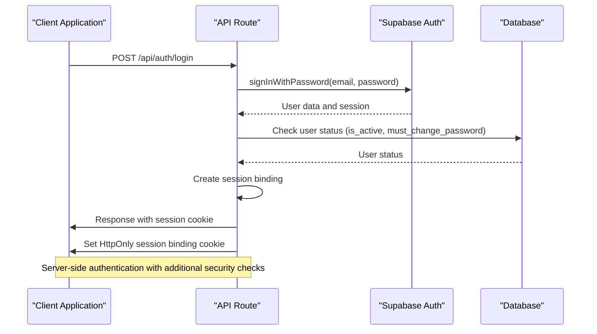

**Diagram sources**
- [login/route.ts](file://app/api/auth/login/route.ts#L7-L117)
- [server.ts](file://lib/supabase/server.ts#L1-L51)
- [client.ts](file://lib/supabase/client.ts#L1-L9)

## Session Security Implementation

The session security implementation provides multiple layers of protection beyond standard authentication. The system creates a session binding token that is stored in an HttpOnly cookie and validated on each request to prevent cross-site scripting (XSS) attacks and session hijacking.

### Session Creation Workflow
When a user successfully authenticates, the system creates a new session record that binds the user's identity to their device characteristics:

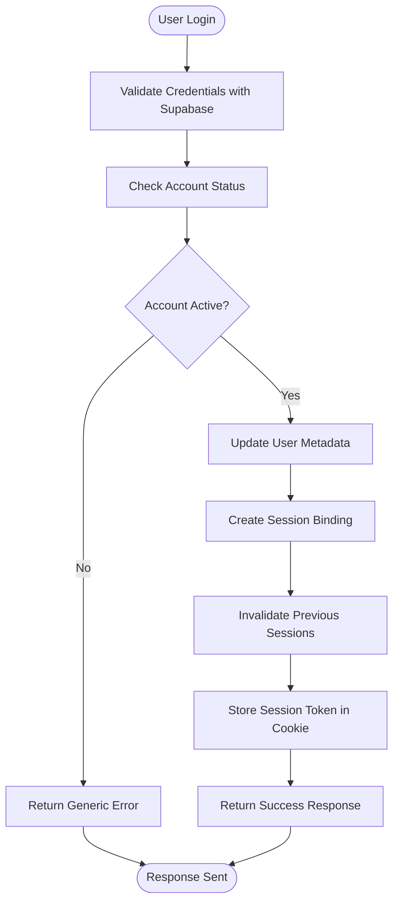

**Diagram sources**
- [login/route.ts](file://app/api/auth/login/route.ts#L7-L117)
- [session-security.ts](file://lib/session-security.ts#L68-L147)

### Session Validation Process
The system validates sessions on each protected request by comparing the current device fingerprint with the stored fingerprint:

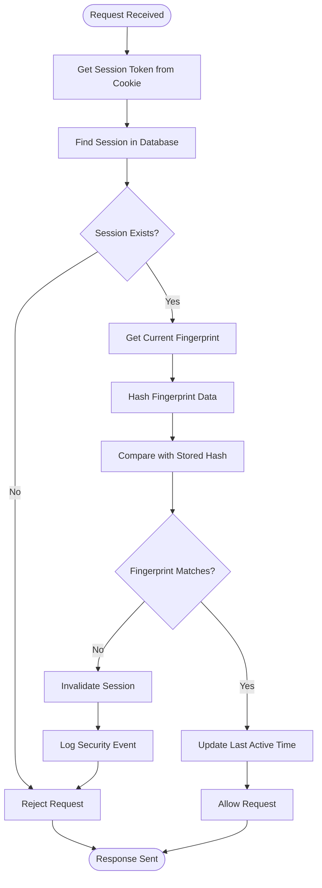

**Diagram sources**
- [session-security.ts](file://lib/session-security.ts#L154-L228)
- [secure-fetch.ts](file://lib/secure-fetch.ts#L1-L52)

## Fingerprinting and Device Binding

The system implements a robust fingerprinting mechanism that creates a unique identifier for each device based on non-PII browser characteristics. This fingerprint is used to bind sessions to specific devices and detect potential session hijacking attempts.

### Fingerprint Data Collection
The client-side fingerprinting collects the following characteristics:

- User agent string
- Browser language
- Timezone information
- Screen resolution
- Color depth
- Platform information
- Cookies enabled status
- Do Not Track setting

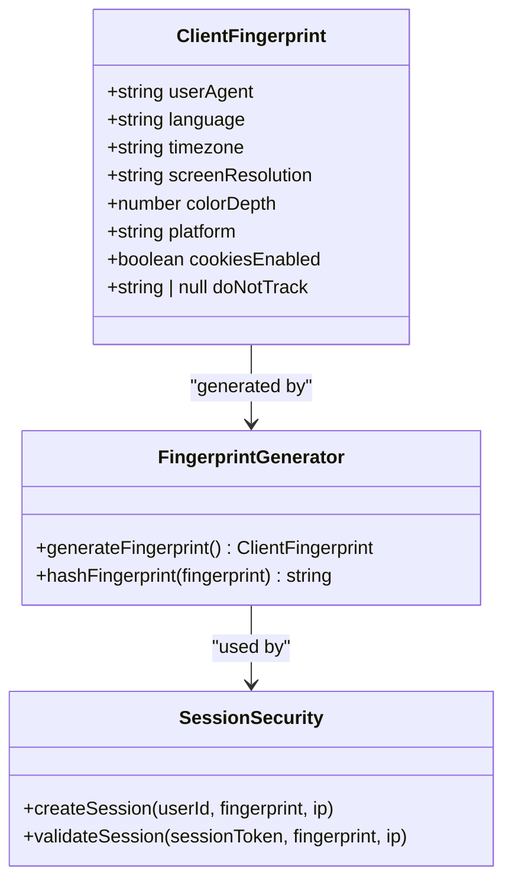

**Diagram sources**
- [fingerprint.ts](file://lib/fingerprint.ts#L8-L68)
- [session-security.ts](file://lib/session-security.ts#L31-L56)

### Fingerprint Hashing and Validation
The collected fingerprint data is hashed using SHA-256 with a salt to create a unique identifier that cannot be reverse-engineered:

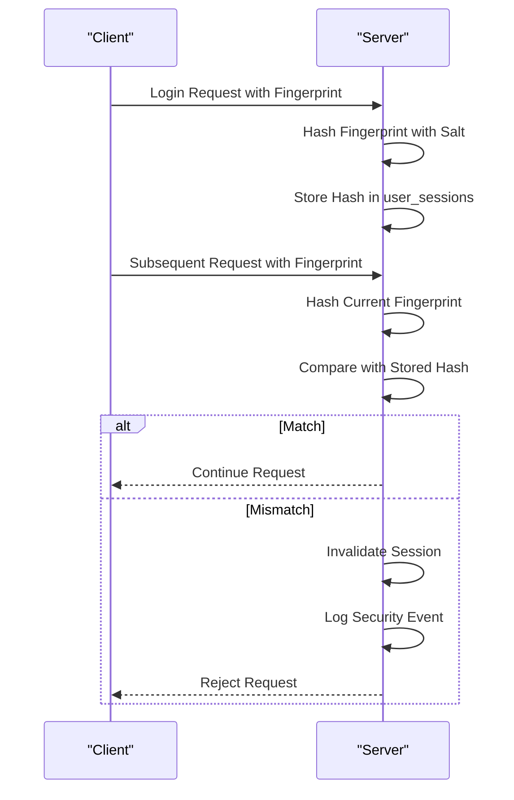

**Diagram sources**
- [session-security.ts](file://lib/session-security.ts#L45-L56)
- [security.ts](file://lib/security.ts#L11-L14)

## Single Session Enforcement

The system enforces a single-session policy where only one active session is allowed per user at any time. When a user logs in from a new device or browser, all previous sessions are automatically invalidated.

### Session Invalidation Mechanism
The single-session enforcement is implemented through a database function that invalidates all existing sessions for a user:

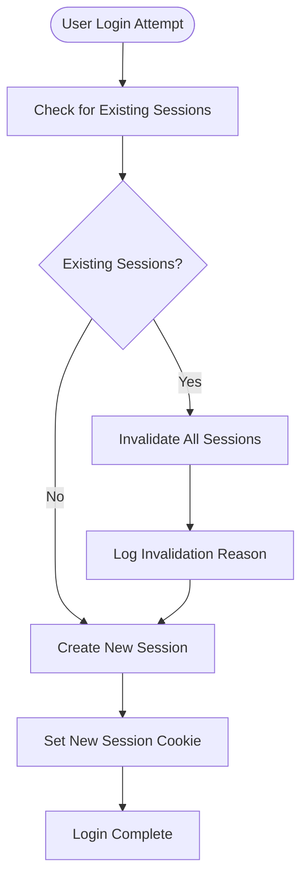

**Diagram sources**
- [session-security.ts](file://lib/session-security.ts#L89-L92)
- [20260111_session_security.sql](file://supabase/migrations/20260111_session_security.sql#L80-L95)

### Database Implementation
The session invalidation is handled by a PostgreSQL function that updates all active sessions for a user:

```sql
CREATE OR REPLACE FUNCTION invalidate_user_sessions(target_user_id UUID, reason TEXT DEFAULT 'manual_logout')
RETURNS INT
LANGUAGE plpgsql
SECURITY DEFINER
AS $$
DECLARE
  affected_count INT;
BEGIN
  UPDATE user_sessions 
  SET is_valid = FALSE, invalidation_reason = reason
  WHERE user_id = target_user_id AND is_valid = TRUE;
  
  GET DIAGNOSTICS affected_count = ROW_COUNT;
  RETURN affected_count;
END;
$$;
```

**Section sources**
- [20260111_session_security.sql](file://supabase/migrations/20260111_session_security.sql#L80-L95)
- [session-security.ts](file://lib/session-security.ts#L258-L269)

## Account Status Management

The system implements two key account status features: forced password changes and account deactivation. These features provide administrators with fine-grained control over user access and security policies.

### Forced Password Change
The `must_change_password` flag forces users to change their password upon next login. This is useful for:

- Initial account setup
- Password reset scenarios
- Security incidents requiring password rotation
- Regular password expiration policies

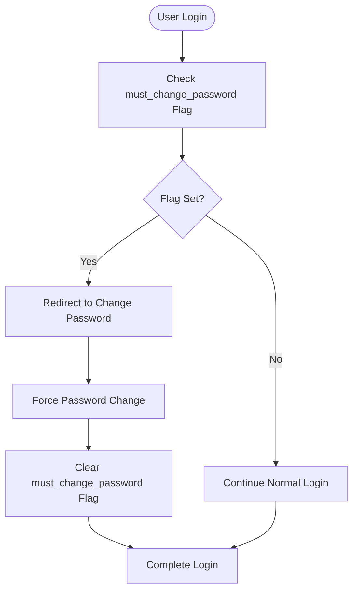

**Section sources**
- [login/route.ts](file://app/api/auth/login/route.ts#L69-L73)
- [20251219084551_add_must_change_password_column.sql](file://supabase/migrations/20251219084551_add_must_change_password_column.sql)

### Account Deactivation
The `is_active` flag allows administrators to deactivate user accounts without deleting them. Deactivated accounts cannot log in, but their data is preserved for auditing and potential reactivation.

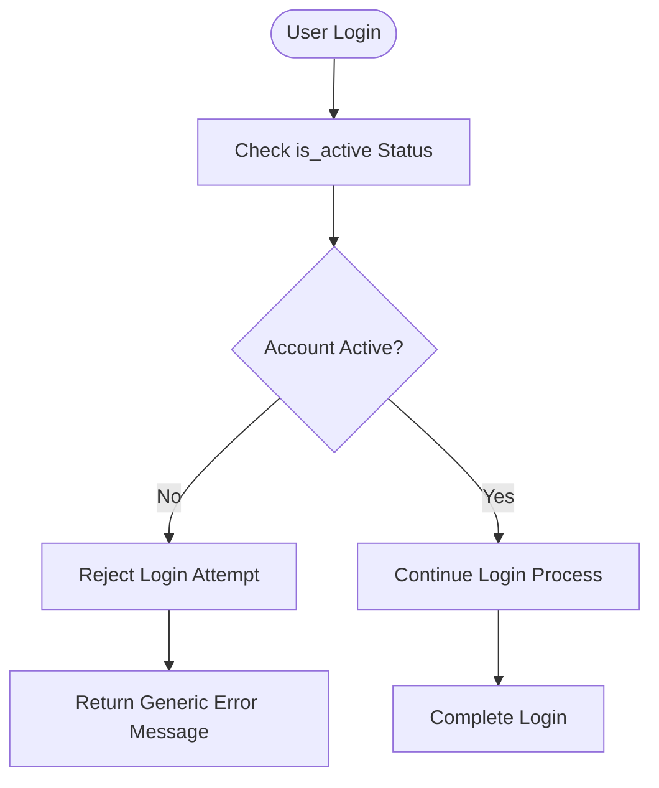

**Section sources**
- [login/route.ts](file://app/api/auth/login/route.ts#L51-L58)
- [20251219084313_add_is_active_column.sql](file://supabase/migrations/20251219084313_add_is_active_column.sql)

## Client-Side Security

The client-side implementation provides seamless integration with the server-side security features while maintaining a good user experience. The system uses React hooks and components to manage session state and security warnings.

### Session Timeout Management
The system implements both inactivity timeout and absolute timeout policies:

- **Inactivity timeout**: Logs out users after a period of inactivity (default: 30 minutes)
- **Absolute timeout**: Logs out users after a maximum session duration (default: 8 hours)

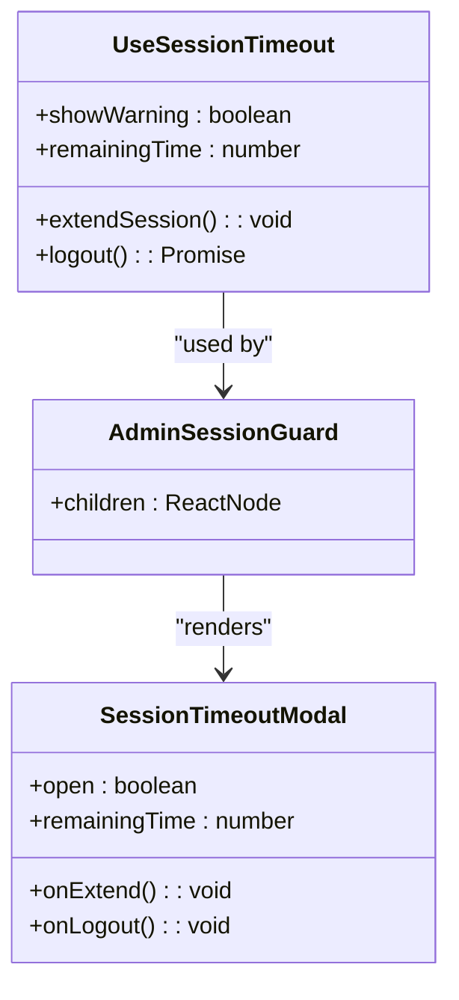

**Diagram sources**
- [use-session-timeout.ts](file://lib/hooks/use-session-timeout.ts#L1-L198)
- [admin-session-guard.tsx](file://components/admin-session-guard.tsx#L1-L34)
- [session-timeout-modal.tsx](file://components/session-timeout-modal.tsx#L1-L34)

### Secure Fetch Implementation
The system intercepts all API requests to automatically include the client fingerprint for session validation:

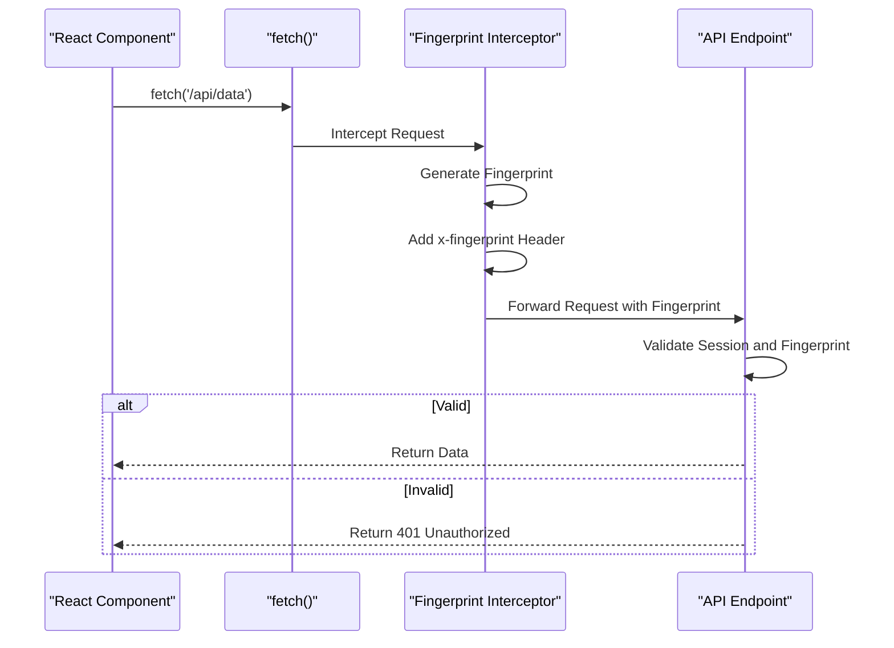

**Diagram sources**
- [secure-fetch.ts](file://lib/secure-fetch.ts#L1-L52)
- [auth-store.ts](file://lib/auth-store.ts#L50-L52)

## Security Event Logging

The system maintains a comprehensive security event log that records important authentication events for auditing and incident response.

### Security Events Table
The `security_events` table stores information about security-related activities:

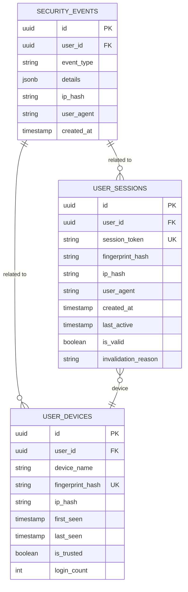

**Diagram sources**
- [20260111_session_security.sql](file://supabase/migrations/20260111_session_security.sql#L37-L45)
- [session-security.ts](file://lib/session-security.ts#L278-L298)

### Logged Security Events
The system logs the following types of security events:

- **session_hijack_attempt**: Detected when a session is used from a different device
- **new_device**: First login from a new device
- **ip_change_detected**: IP address change when IP changes are not allowed
- **user_logout**: Manual logout by the user
- **new_login**: Successful login from any device

**Section sources**
- [session-security.ts](file://lib/session-security.ts#L280-L298)
- [20260111_session_security.sql](file://supabase/migrations/20260111_session_security.sql#L40-L45)

## Configuration Options

The session security system provides several configuration options that can be adjusted based on security requirements and user experience considerations.

### Session Configuration
The `SESSION_CONFIG` object defines key security parameters:

```typescript
export const SESSION_CONFIG = {
  // How much fingerprint can change before flagging (0-1, 1 = must match exactly)
  FINGERPRINT_STRICTNESS: 0.8,
  // Allow IP changes (for mobile users)
  ALLOW_IP_CHANGE: true,
  // Log security events
  LOG_EVENTS: true,
  // Cookie name for session binding
  SESSION_BINDING_COOKIE: 'sb-session-bind',
}
```

**Section sources**
- [session-security.ts](file://lib/session-security.ts#L17-L26)

### Configuration Options and Their Impact

| Configuration Option | Default Value | Description | Security Impact |
|----------------------|-------------|-------------|----------------|
| FINGERPRINT_STRICTNESS | 0.8 | How closely the fingerprint must match (0-1) | Higher values increase security but may cause false positives for legitimate users |
| ALLOW_IP_CHANGE | true | Whether to allow IP address changes during a session | Disabling increases security but affects mobile users and those with dynamic IPs |
| LOG_EVENTS | true | Whether to log security events to the database | Essential for auditing and incident response |
| SESSION_BINDING_COOKIE | 'sb-session-bind' | Name of the HttpOnly cookie storing the session token | Should be non-obvious to prevent targeted attacks |

## Common Issues and Recovery

### Expired Sessions
Sessions can expire due to:

- Inactivity timeout (30 minutes by default)
- Absolute timeout (8 hours by default)
- Manual logout from another device
- Session invalidation due to fingerprint mismatch

**Recovery Procedure**: Users should simply log in again. The system will create a new session and invalidate the expired one.

### Suspicious Login Attempts
The system detects suspicious login attempts through:

- Fingerprint mismatches
- Rapid successive login attempts (rate limiting)
- Logins from unusual locations or devices

**Response Procedure**: 
1. The system automatically invalidates the suspicious session
2. Logs a security event for administrator review
3. May trigger additional verification steps for future logins

### Account Recovery
For users who cannot access their accounts:

1. Use the password reset functionality
2. Contact system administrator for manual intervention
3. Administrator can reset the password and set `must_change_password` flag
4. User logs in and is forced to change their password

## Conclusion
The School-Management-System implements a robust authentication security framework that goes beyond basic username/password authentication. By combining Supabase Auth with custom session security features, device fingerprinting, and comprehensive account management, the system provides multiple layers of protection against common threats like session hijacking, account takeover, and unauthorized access. The integration with Next.js server components ensures that security decisions are made on the server side, preventing client-side manipulation, while the client-side implementation provides a seamless user experience with appropriate security warnings and recovery options.