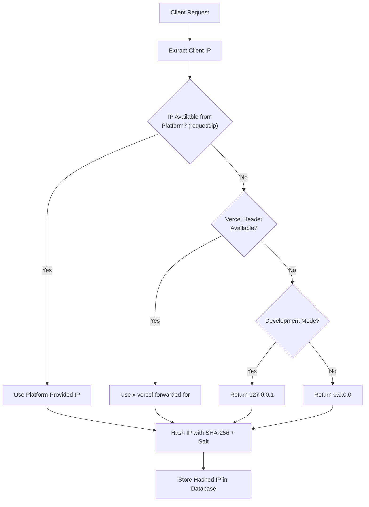
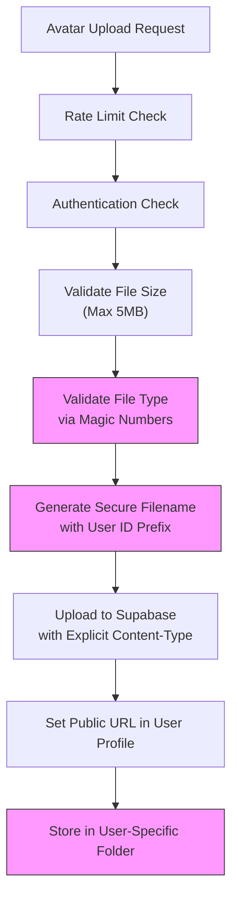
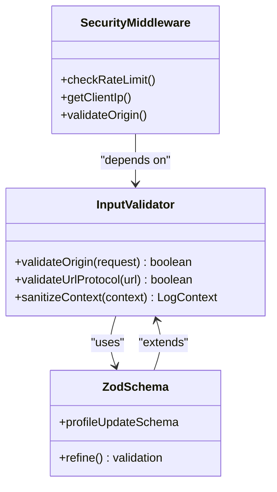
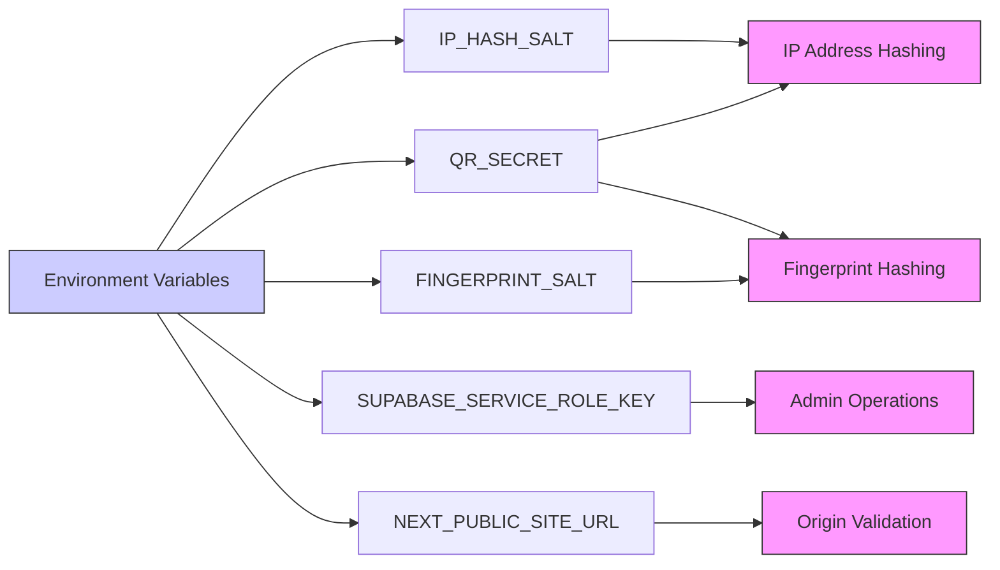
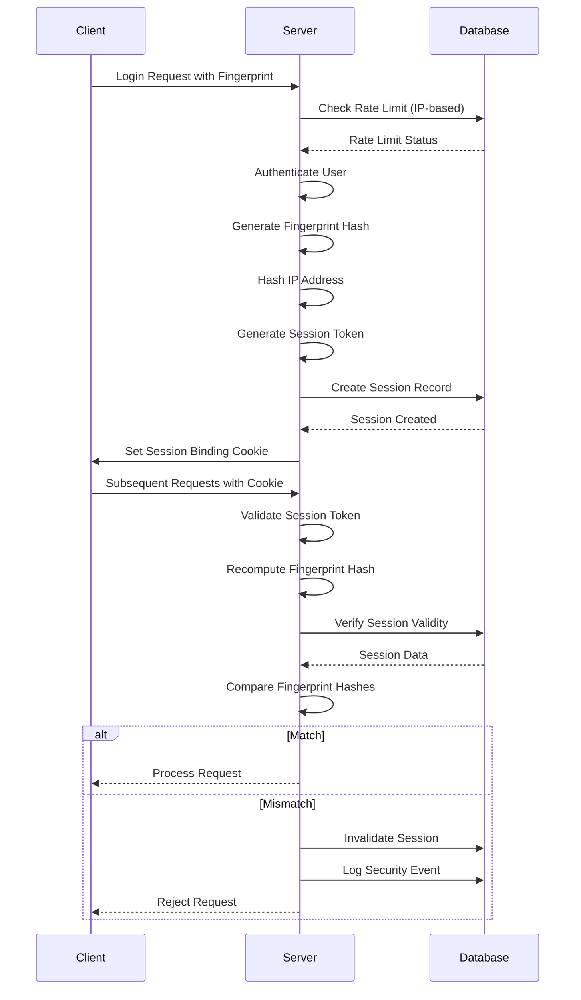

# Data Protection

<cite>
**Referenced Files in This Document**   
- [security.ts](file://lib/security.ts)
- [session-security.ts](file://lib/session-security.ts)
- [storage.ts](file://lib/supabase/storage.ts)
- [upload-avatar/route.ts](file://app/api/profile/upload-avatar/route.ts)
- [login/route.ts](file://app/api/auth/login/route.ts)
- [fingerprint.ts](file://lib/fingerprint.ts)
- [SECURITY.md](file://SECURITY.md)
- [20260110125232_hash_ip_addresses.sql](file://supabase/migrations/20260110125232_hash_ip_addresses.sql)
- [20260107115502_fix_avatar_storage_policies.sql](file://supabase/migrations/20260107115502_fix_avatar_storage_policies.sql)
</cite>

## Table of Contents
1. [Introduction](#introduction)
2. [IP Address Hashing and Secure Client IP Extraction](#ip-address-hashing-and-secure-client-ip-extraction)
3. [Secure Avatar and User-Uploaded Content Storage](#secure-avatar-and-user-uploaded-content-storage)
4. [XSS Prevention and Input Validation](#xss-prevention-and-input-validation)
5. [Environment Variables and Secret Isolation](#environment-variables-and-secret-isolation)
6. [Session Security and Fingerprinting](#session-security-and-fingerprinting)
7. [Common Data Protection Issues and Compliance](#common-data-protection-issues-and-compliance)
8. [Best Practices for Additional Data Protection Measures](#best-practices-for-additional-data-protection-measures)

## Introduction
The School-Management-System implements comprehensive data protection measures to safeguard user privacy, prevent data leakage, and ensure compliance with privacy regulations. This document details the system's approach to protecting sensitive information through cryptographic hashing, secure storage policies, input validation, and environment isolation. The implementation focuses on minimizing the collection and storage of personally identifiable information (PII) while maintaining functionality for abuse detection and user experience. Key components include IP address hashing using SHA-256 with salt, secure handling of user-uploaded avatars in Supabase storage, and protection against cross-site scripting (XSS) attacks through rigorous input validation.

## IP Address Hashing and Secure Client IP Extraction

The system implements privacy-preserving IP address handling through cryptographic hashing and secure extraction methods. Raw IP addresses are never stored in the database; instead, they are hashed using SHA-256 with a salt to prevent rainbow table attacks while still enabling abuse detection through hash comparison.

**Diagram sources**
- [security.ts](file://lib/security.ts#L73-L95)
- [20260110125232_hash_ip_addresses.sql](file://supabase/migrations/20260110125232_hash_ip_addresses.sql#L6-L12)

The `getClientIp` function prioritizes the platform-provided IP address (available in Next.js/Vercel environments) to prevent IP spoofing. This approach ensures that the IP address cannot be manipulated by malicious clients through headers like `X-Forwarded-For`. When running in Vercel, the `x-vercel-forwarded-for` header is used, which is set by Vercel's edge infrastructure and cannot be spoofed by the client.

The `hashIpAddress` function implements cryptographic hashing using SHA-256 with a salt derived from environment variables (`IP_HASH_SALT` or `QR_SECRET`). This prevents reverse engineering of the original IP address while allowing the system to detect patterns of abuse by comparing hash values. The salt ensures protection against rainbow table attacks, and only the first 32 characters of the hash are stored to further obscure the original value.

**Section sources**
- [security.ts](file://lib/security.ts#L11-L14)
- [security.ts](file://lib/security.ts#L73-L95)

## Secure Avatar and User-Uploaded Content Storage

The system implements a multi-layered approach to secure the storage of user-uploaded content, particularly avatars, in Supabase storage. This includes strict validation, secure file naming, and granular access policies to prevent unauthorized access and cross-user file overwrites.

**Diagram sources**
- [storage.ts](file://lib/supabase/storage.ts#L33-L47)
- [upload-avatar/route.ts](file://app/api/profile/upload-avatar/route.ts#L15-L110)
- [20260107115502_fix_avatar_storage_policies.sql](file://supabase/migrations/20260107115502_fix_avatar_storage_policies.sql#L13-L43)

The avatar upload process begins with rate limiting to prevent abuse, followed by authentication to ensure only authorized users can upload files. File validation occurs at multiple levels: size validation (maximum 5MB), MIME type validation, and magic number validation to verify the actual file content. The magic number validation reads the first few bytes of the file to confirm it matches the expected signature for JPEG, PNG, GIF, or WebP formats, preventing malicious file uploads with spoofed extensions.

Files are stored in a dedicated `avatars` bucket with user-specific paths in the format `{userId}/{uniqueId}.{extension}`. This structure, combined with Row Level Security (RLS) policies, ensures that users can only upload, update, or delete files within their own directory. The RLS policies explicitly check that the first component of the file path matches the authenticated user's ID (`auth.uid()`), preventing path traversal attacks and cross-user access.

**Section sources**
- [storage.ts](file://lib/supabase/storage.ts#L3-L47)
- [upload-avatar/route.ts](file://app/api/profile/upload-avatar/route.ts#L15-L110)
- [20260107115502_fix_avatar_storage_policies.sql](file://supabase/migrations/20260107115502_fix_avatar_storage_policies.sql#L13-L43)

## XSS Prevention and Input Validation

The system employs comprehensive input validation and sanitization strategies to prevent cross-site scripting (XSS) attacks and other injection vulnerabilities. This includes both client-side and server-side validation, with particular attention to URL protocol validation for user-provided links.

**Diagram sources**
- [security.ts](file://lib/security.ts#L20-L67)
- [security.ts](file://lib/security.ts#L101-L136)
- [logger.ts](file://lib/logger.ts#L20-L31)

The system uses Zod schemas for comprehensive input validation, particularly for user profile updates. The `profileUpdateSchema` includes a refinement rule that ensures avatar URLs start with `http://` or `https://`, preventing JavaScript injection through `javascript:` protocol URLs. This validation occurs server-side, ensuring that even if client-side validation is bypassed, malicious inputs are rejected.

Origin validation is implemented through the `validateOrigin` function, which checks that requests originate from the same domain as specified in environment variables (`NEXT_PUBLIC_SITE_URL` or `NEXT_PUBLIC_APP_URL`). This provides CSRF protection for API routes by verifying the `Origin` or `Referer` headers against the allowed domain. The implementation includes fallback mechanisms for dynamic deployments while maintaining security.

The logging system includes automatic sanitization of sensitive data, removing fields like passwords, tokens, and secrets from log output to prevent accidental data leakage. This ensures that even if logs are compromised, sensitive information remains protected.

**Section sources**
- [security.ts](file://lib/security.ts#L20-L67)
- [security.ts](file://lib/security.ts#L101-L136)
- [logger.ts](file://lib/logger.ts#L20-L31)

## Environment Variables and Secret Isolation

The system follows strict security practices for handling sensitive configuration and secrets through environment variable isolation. This approach ensures that credentials and configuration secrets are never hardcoded or exposed in the source code.

**Diagram sources**
- [security.ts](file://lib/security.ts#L12)
- [security.ts](file://lib/security.ts#L28)
- [session-security.ts](file://lib/session-security.ts#L46)
- [session-security.ts](file://lib/session-security.ts#L9-L10)

Sensitive configuration is isolated in environment variables, with different variables serving specific security purposes. The `IP_HASH_SALT` and `QR_SECRET` variables provide cryptographic salts for IP address and fingerprint hashing, while the `FINGERPRINT_SALT` specifically secures client fingerprint data. The `SUPABASE_SERVICE_ROLE_KEY` enables administrative database operations while being strictly isolated from client-side code.

The system follows the principle of least privilege by using different authentication methods for different contexts: client-side operations use the public Supabase URL and anonymous key, while server-side administrative operations use the service role key. This ensures that even if client-side credentials are compromised, they cannot be used to bypass Row Level Security policies or perform administrative functions.

**Section sources**
- [security.ts](file://lib/security.ts#L12)
- [security.ts](file://lib/security.ts#L28)
- [session-security.ts](file://lib/session-security.ts#L46)
- [session-security.ts](file://lib/session-security.ts#L9-L10)

## Session Security and Fingerprinting

The system implements advanced session security through client fingerprinting and session binding to detect and prevent session hijacking. This multi-factor approach combines IP hashing, browser characteristics, and secure token storage to ensure session integrity.

**Diagram sources**
- [session-security.ts](file://lib/session-security.ts#L68-L143)
- [fingerprint.ts](file://lib/fingerprint.ts#L22-L32)
- [login/route.ts](file://app/api/auth/login/route.ts#L80-L108)

The session security system collects non-PII browser characteristics such as user agent, language, timezone, screen resolution, and platform to create a unique device fingerprint. This fingerprint is hashed with a salt and stored server-side, allowing the system to detect when a session is being used from a different device or browser configuration.

During login, a cryptographically secure session token is generated and stored in an HttpOnly, Secure, SameSite=strict cookie. This token is bound to the client's fingerprint and IP hash, creating a multi-factor authentication mechanism. On each subsequent request, the server validates that the session token matches the stored fingerprint hash, providing protection against session hijacking even if the cookie is compromised.

The system also implements single-session enforcement by invalidating all previous sessions when a user logs in, preventing concurrent sessions from multiple devices. Security events are logged for suspicious activities such as new device logins or fingerprint mismatches, enabling administrators to monitor for potential security incidents.

**Section sources**
- [session-security.ts](file://lib/session-security.ts#L68-L143)
- [fingerprint.ts](file://lib/fingerprint.ts#L22-L32)
- [login/route.ts](file://app/api/auth/login/route.ts#L80-L108)

## Common Data Protection Issues and Compliance

The system addresses common data protection risks and ensures compliance with privacy regulations through a comprehensive security framework. This includes protection against data leakage, proper handling of PII, and adherence to security best practices.

The system minimizes PII storage by hashing IP addresses instead of storing them in raw form, balancing privacy with the need for abuse detection. User-uploaded content is stored with strict access controls, and sensitive operations are protected by rate limiting to prevent brute force attacks. The use of generic error messages prevents user enumeration attacks, while the principle of least privilege is enforced through Row Level Security policies.

Compliance with privacy regulations is achieved through several mechanisms: data minimization (only collecting necessary information), purpose limitation (using data only for intended purposes), and security safeguards (encryption, access controls). The system's architecture supports data subject rights by enabling account deactivation (`is_active` flag) and providing audit logs for data access and modifications.

The SECURITY.md document outlines the project's security policy, including supported versions, reporting vulnerabilities, and contributor best practices. This transparency helps maintain trust with users and contributors while establishing clear security expectations.

**Section sources**
- [SECURITY.md](file://SECURITY.md#L1-L70)
- [security.ts](file://lib/security.ts#L11-L14)
- [session-security.ts](file://lib/session-security.ts#L17-L26)

## Best Practices for Additional Data Protection Measures

To enhance data protection beyond the current implementation, several best practices can be adopted:

1. **Implement Data Encryption at Rest**: While Supabase provides database encryption, consider implementing client-side encryption for highly sensitive data fields before storage.

2. **Enhance Fingerprinting**: Expand the fingerprinting mechanism to include canvas fingerprinting or WebGL rendering characteristics for more robust device identification.

3. **Implement Data Retention Policies**: Establish automated processes for deleting or anonymizing user data after a specified period of inactivity.

4. **Add Two-Factor Authentication**: Implement time-based one-time passwords (TOTP) or WebAuthn for additional authentication security.

5. **Conduct Regular Security Audits**: Perform periodic code reviews and penetration testing to identify and address potential vulnerabilities.

6. **Implement Content Security Policy (CSP)**: Add HTTP headers to restrict the sources from which content can be loaded, preventing XSS attacks.

7. **Enhance Monitoring and Alerting**: Implement real-time monitoring for suspicious activities such as multiple failed login attempts or unusual access patterns.

8. **Regular Dependency Updates**: Maintain up-to-date dependencies to address known security vulnerabilities in third-party libraries.

These practices would further strengthen the system's security posture and ensure ongoing compliance with evolving privacy regulations and security standards.

**Section sources**
- [SECURITY.md](file://SECURITY.md#L63-L69)
- [security.ts](file://lib/security.ts#L1-L136)
- [session-security.ts](file://lib/session-security.ts#L1-L373)