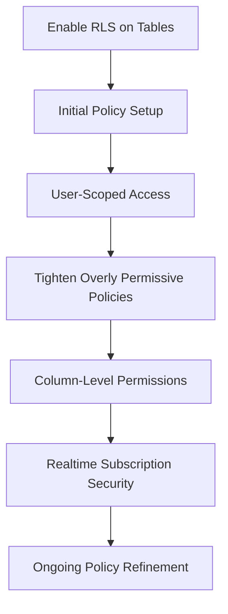
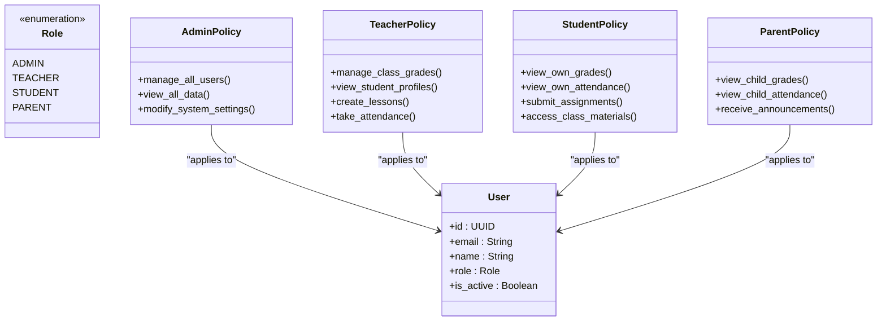
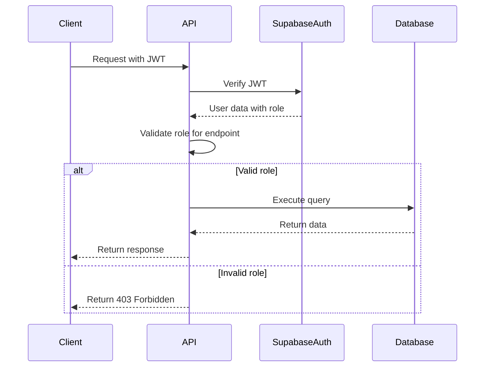
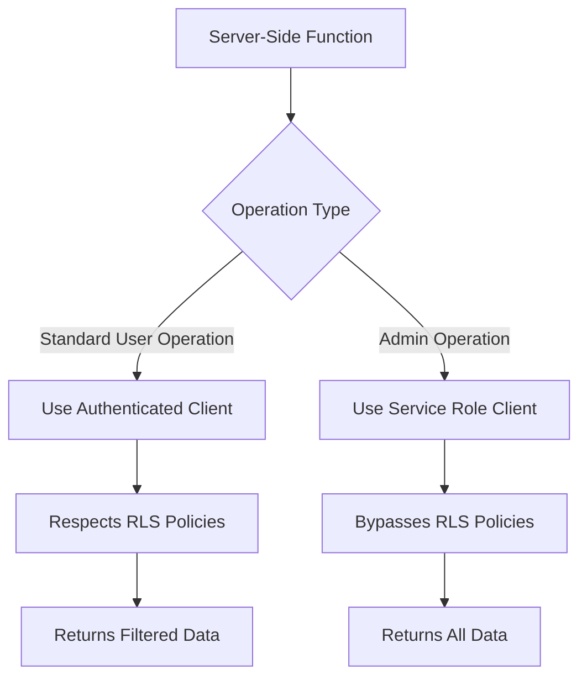

# Database Security

<cite>
**Referenced Files in This Document**   
- [20240101000000_secure_rls.sql](file://supabase/migrations/20240101000000_secure_rls.sql)
- [20251219044036_add_rls_policies.sql](file://supabase/migrations/20251219044036_add_rls_policies.sql)
- [20260107115657_tighten_rls_policies.sql](file://supabase/migrations/20260107115657_tighten_rls_policies.sql)
- [20250228_security_hardening.sql](file://supabase/migrations/20250228_security_hardening.sql)
- [20250220_secure_quiz_questions.sql](file://supabase/migrations/20250220_secure_quiz_questions.sql)
- [20250221_secure_chat_policy.sql](file://supabase/migrations/20250221_secure_chat_policy.sql)
- [20250226_secure_realtime_rls.sql](file://supabase/migrations/20250226_secure_realtime_rls.sql)
- [server.ts](file://lib/supabase/server.ts)
- [security.ts](file://lib/security.ts)
- [session-security.ts](file://lib/session-security.ts)
- [SECURITY.md](file://SECURITY.md)
</cite>

## Table of Contents
1. [Introduction](#introduction)
2. [Row Level Security Implementation](#row-level-security-implementation)
3. [Role-Based Access Policies](#role-based-access-policies)
4. [Server-Side Role Validation](#server-side-role-validation)
5. [Supabase Service Role Usage](#supabase-service-role-usage)
6. [Common RLS Issues and Debugging](#common-rls-issues-and-debugging)
7. [Security Policy Best Practices](#security-policy-best-practices)
8. [Conclusion](#conclusion)

## Introduction
The School-Management-System implements a comprehensive database security framework centered around Row Level Security (RLS) in PostgreSQL. This document details the implementation of over 50 migration files that enforce strict access controls across all database tables. The system follows the principle of least privilege, ensuring users can only access data appropriate to their roles (Admin, Teacher, Student, Parent). Security is enforced at the database level through RLS policies, with additional server-side validation via JWT metadata. The architecture leverages Supabase's capabilities while implementing custom security measures for sensitive operations.

**Section sources**
- [SECURITY.md](file://SECURITY.md#L1-L70)

## Row Level Security Implementation
The system implements Row Level Security across all database tables through a series of migration files that progressively tighten security policies. The RLS implementation begins with enabling security on all tables and establishing basic access controls, then evolves through multiple iterations to address security gaps and enforce stricter policies.

The initial RLS setup in `20240101000000_secure_rls.sql` enables RLS on core tables and establishes foundational policies that allow users to access their own data while restricting access to sensitive information. Subsequent migrations refine these policies, with `20251219044036_add_rls_policies.sql` implementing user-scoped access for profiles and `20260107115657_tighten_rls_policies.sql` addressing overly permissive policies by replacing `USING (true)` conditions with proper user-scoped checks.



**Diagram sources**
- [20240101000000_secure_rls.sql](file://supabase/migrations/20240101000000_secure_rls.sql#L1-L62)
- [20251219044036_add_rls_policies.sql](file://supabase/migrations/20251219044036_add_rls_policies.sql#L1-L22)
- [20260107115657_tighten_rls_policies.sql](file://supabase/migrations/20260107115657_tighten_rls_policies.sql#L1-L117)

**Section sources**
- [20240101000000_secure_rls.sql](file://supabase/migrations/20240101000000_secure_rls.sql#L1-L62)
- [20251219044036_add_rls_policies.sql](file://supabase/migrations/20251219044036_add_rls_policies.sql#L1-L22)
- [20260107115657_tighten_rls_policies.sql](file://supabase/migrations/20260107115657_tighten_rls_policies.sql#L1-L117)

## Role-Based Access Policies
The system implements granular role-based access control through RLS policies that differentiate between Admin, Teacher, Student, and Parent roles. Each role has specific permissions that follow the principle of least privilege, ensuring users can only perform actions appropriate to their responsibilities.

Admin users have elevated privileges that allow them to manage all system data. The migration `20251219080307_allow_admin_insert_users.sql` grants admins the ability to insert user records, while `20251219081226_allow_admin_read_all_users.sql` enables them to view all user information. Teacher access is restricted to their classes and students, with policies in `20240101000000_secure_rls.sql` allowing teachers to view student profiles and manage grades for their classes.

Student access is strictly limited to their own data. The policy "Students view own grades" restricts grade access to the student's own records, while attendance policies ensure students can only view their own attendance records. Parent access follows a similar pattern, with parents able to view information about their linked children but not other students.



**Diagram sources**
- [20240101000000_secure_rls.sql](file://supabase/migrations/20240101000000_secure_rls.sql#L1-L62)
- [20250228_security_hardening.sql](file://supabase/migrations/20250228_security_hardening.sql#L1-L94)

**Section sources**
- [20240101000000_secure_rls.sql](file://supabase/migrations/20240101000000_secure_rls.sql#L1-L62)
- [20250228_security_hardening.sql](file://supabase/migrations/20250228_security_hardening.sql#L1-L94)

## Server-Side Role Validation
Server-side role validation ensures secure access by verifying user roles through JWT metadata before executing sensitive operations. The system implements this validation in API routes and server-side functions, providing an additional security layer beyond database-level RLS policies.

The validation process begins with JWT token verification, where the system extracts role information from the token's metadata. This role information is then used to authorize access to specific endpoints and operations. For example, admin-only endpoints verify that the user's role is 'admin' before proceeding with the request.



**Diagram sources**
- [server.ts](file://lib/supabase/server.ts#L1-L51)
- [security.ts](file://lib/security.ts#L1-L136)

**Section sources**
- [server.ts](file://lib/supabase/server.ts#L1-L51)
- [security.ts](file://lib/security.ts#L1-L136)

## Supabase Service Role Usage
The system utilizes Supabase service role keys for admin operations that require bypassing RLS policies. The service role provides elevated privileges that allow specific server-side operations to access all data without being constrained by row-level security rules.

The service role is implemented in `lib/supabase/server.ts` through the `createAdminClient()` function, which creates a Supabase client using the service role key. This client is used for operations that need to bypass RLS, such as background jobs, webhooks, and administrative functions that require access to all records.

Service role usage follows strict security practices:
- The service role key is stored in environment variables and never exposed to client-side code
- Service role clients are only created in server-side functions
- Operations using the service role are logged for audit purposes
- Access to the service role key is restricted to authorized personnel



**Diagram sources**
- [server.ts](file://lib/supabase/server.ts#L36-L51)

**Section sources**
- [server.ts](file://lib/supabase/server.ts#L36-L51)

## Common RLS Issues and Debugging
The implementation of RLS policies can encounter several common issues that require careful debugging and resolution. These issues include policy conflicts, unexpected access denials, and performance impacts from complex policy conditions.

Policy conflicts occur when multiple policies apply to the same operation, potentially creating contradictory rules. The system addresses this by using `DROP POLICY IF EXISTS` statements before creating new policies, ensuring a clean state. For example, `20260107115657_tighten_rls_policies.sql` explicitly drops existing policies before creating updated versions.

Debugging RLS failures requires checking several factors:
- Verify that RLS is enabled on the target table
- Check that the user's role has the necessary permissions
- Validate that the policy conditions match the expected logic
- Ensure that the user's JWT contains the correct metadata
- Confirm that the service role key is properly configured for bypass operations

Testing security policies is critical to ensure they function as intended. The system implements comprehensive testing through:
- Unit tests for individual policy conditions
- Integration tests for end-to-end access scenarios
- Security audits to identify potential privilege escalation paths
- Regular reviews of policy effectiveness and coverage

**Section sources**
- [20260107115657_tighten_rls_policies.sql](file://supabase/migrations/20260107115657_tighten_rls_policies.sql#L1-L117)
- [SECURITY.md](file://SECURITY.md#L1-L70)

## Security Policy Best Practices
The system follows several best practices for writing secure RLS policies that adhere to the principle of least privilege. These practices ensure that security policies are effective, maintainable, and resistant to common vulnerabilities.

Key best practices include:
- **Specificity**: Policies use precise conditions rather than broad permissions like `USING (true)`
- **Defense in Depth**: Multiple layers of security, including RLS, column-level permissions, and server-side validation
- **Regular Audits**: Periodic review of all policies to identify and remove overly permissive rules
- **Error Handling**: Generic error messages to prevent information leakage
- **Logging**: Comprehensive audit logs for security-relevant events

The system also implements additional security measures:
- Column-level permissions to restrict access to sensitive fields
- Rate limiting to prevent brute force attacks
- IP address hashing for privacy-preserving audit logs
- Input validation with Zod schemas to prevent injection attacks
- Origin/Referer validation for CSRF protection

```mermaid
flowchart TD
A[Principle of Least Privilege] --> B[Specific Policy Conditions]
A --> C[Column-Level Permissions]
A --> D[Role-Based Access]
B --> E[No USING(true) Policies]
C --> F[Restrict Sensitive Fields]
D --> G[Granular Role Definitions]
E --> H[Regular Policy Audits]
F --> H
G --> H
H --> I[Secure System]
```

**Diagram sources**
- [SECURITY.md](file://SECURITY.md#L1-L70)
- [20250228_security_hardening.sql](file://supabase/migrations/20250228_security_hardening.sql#L1-L94)

**Section sources**
- [SECURITY.md](file://SECURITY.md#L1-L70)
- [20250228_security_hardening.sql](file://supabase/migrations/20250228_security_hardening.sql#L1-L94)

## Conclusion
The School-Management-System implements a robust database security framework through comprehensive Row Level Security policies, role-based access control, and server-side validation. With over 50 migration files enforcing strict access controls, the system ensures that users can only access data appropriate to their roles. The combination of database-level RLS, Supabase service role usage for admin operations, and server-side role validation creates multiple layers of security that protect sensitive educational data. By following best practices for security policy implementation and regularly auditing policies for effectiveness, the system maintains a high level of security while providing necessary functionality for all user roles.