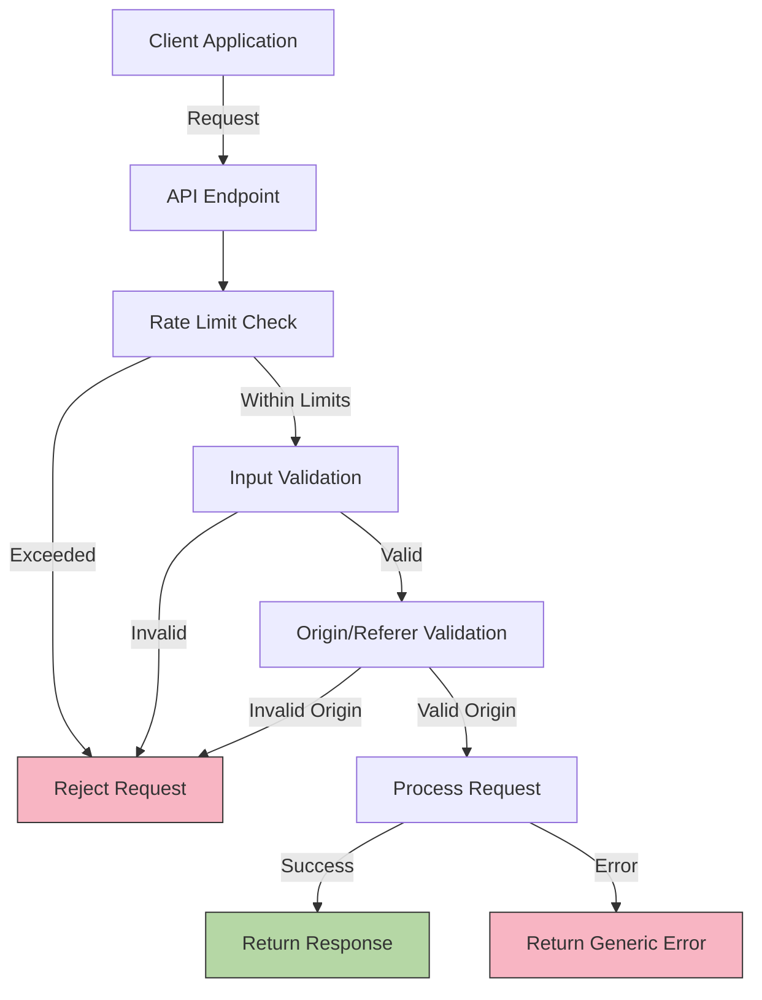
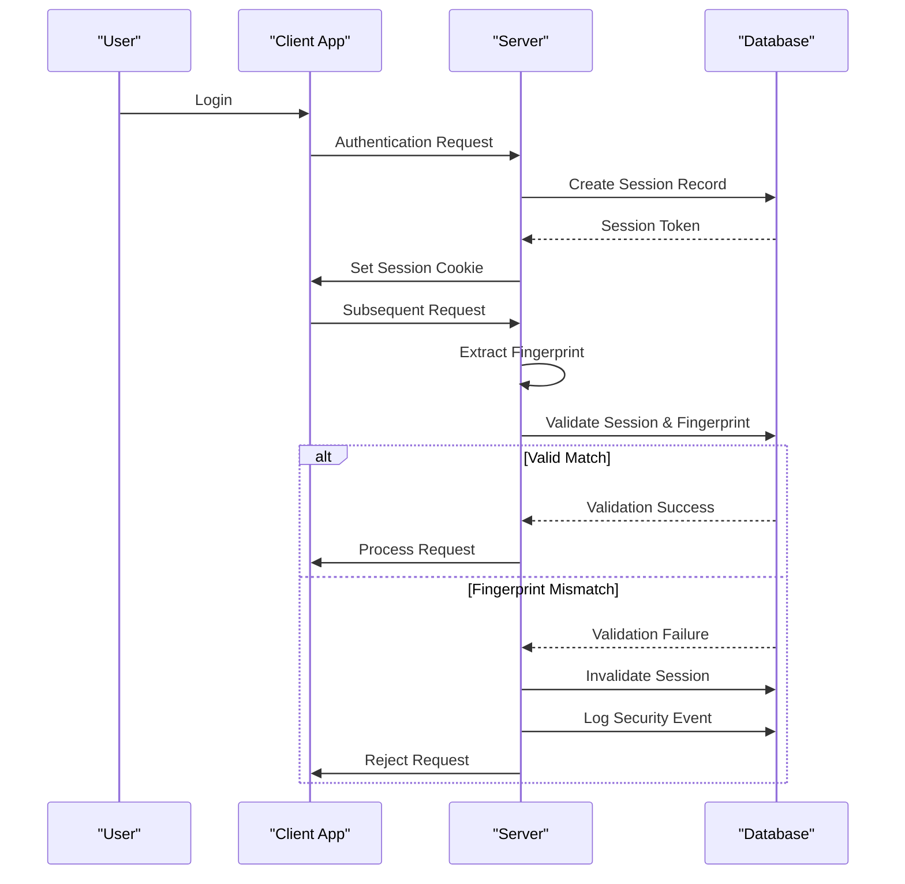
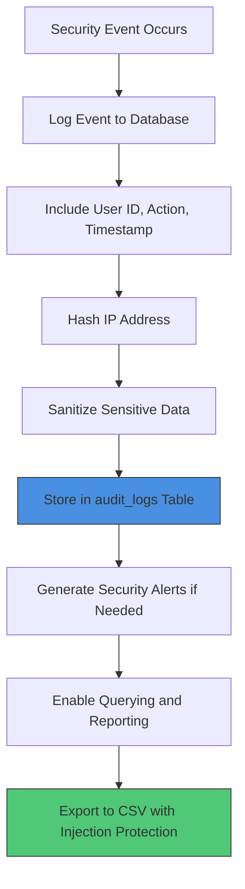

# Security Considerations

<cite>
**Referenced Files in This Document**   
- [SECURITY.md](file://SECURITY.md)
- [lib/supabase/client.ts](file://lib/supabase/client.ts)
- [lib/supabase/server.ts](file://lib/supabase/server.ts)
- [lib/security.ts](file://lib/security.ts)
- [lib/session-security.ts](file://lib/session-security.ts)
- [lib/rate-limit.ts](file://lib/rate-limit.ts)
- [lib/supabase/audit-logs.ts](file://lib/supabase/audit-logs.ts)
- [lib/logger.ts](file://lib/logger.ts)
- [supabase/migrations/20251219044036_add_rls_policies.sql](file://supabase/migrations/20251219044036_add_rls_policies.sql)
- [supabase/migrations/20251219084313_add_is_active_column.sql](file://supabase/migrations/20251219084313_add_is_active_column.sql)
- [supabase/migrations/20251219084551_add_must_change_password_column.sql](file://supabase/migrations/20251219084551_add_must_change_password_column.sql)
- [supabase/migrations/20260111053538_session_security.sql](file://supabase/migrations/20260111053538_session_security.sql)
- [supabase/migrations/20260111000001_drop_chat_messages_table.sql](file://supabase/migrations/20260111000001_drop_chat_messages_table.sql)
</cite>

## Table of Contents
1. [Introduction](#introduction)
2. [Authentication and Session Management](#authentication-and-session-management)
3. [Row Level Security Implementation](#row-level-security-implementation)
4. [API Security Measures](#api-security-measures)
5. [Session Security Features](#session-security-features)
6. [Audit Logging System](#audit-logging-system)
7. [Data Protection Measures](#data-protection-measures)
8. [Security Headers and Vulnerability Protection](#security-headers-and-vulnerability-protection)
9. [Threat Models and Mitigation Strategies](#threat-models-and-mitigation-strategies)
10. [Security Policy Implementation](#security-policy-implementation)

## Introduction
The School-Management-System implements a comprehensive, multi-layered security architecture designed to protect sensitive educational data and ensure system integrity. This document details the security framework that spans authentication, authorization, data protection, and monitoring. The system leverages Supabase Auth for secure user management with MFA support, implements strict Row Level Security (RLS) policies across all database tables, and incorporates advanced session security features to prevent hijacking. With over 50 migration files enforcing security policies, the system maintains a robust defense against common vulnerabilities while providing detailed audit logging for compliance and incident response. The security model follows the principle of least privilege and incorporates fail-closed mechanisms for critical endpoints.

## Authentication and Session Management
The system implements a robust authentication framework using Supabase Auth with multiple security enhancements. Authentication is managed through Supabase's secure password hashing mechanisms, with additional security layers including Multi-Factor Authentication (MFA) support and configurable session management. The system enforces a forced password change for new accounts through the `must_change_password` column in the users table, ensuring that default credentials are not left in place. Account deactivation is supported via the `is_active` flag, allowing administrators to disable accounts without deletion. The authentication flow includes generic error messages to prevent user enumeration attacks, making it difficult for attackers to determine valid usernames. Session management is handled through a combination of Supabase's built-in mechanisms and custom session security features that bind sessions to device fingerprints.

**Section sources**
- [SECURITY.md](file://SECURITY.md#L13-L18)
- [lib/supabase/client.ts](file://lib/supabase/client.ts#L1-L9)
- [lib/supabase/server.ts](file://lib/supabase/server.ts#L1-L51)
- [supabase/migrations/20251219084313_add_is_active_column.sql](file://supabase/migrations/20251219084313_add_is_active_column.sql#L1-L6)
- [supabase/migrations/20251219084551_add_must_change_password_column.sql](file://supabase/migrations/20251219084551_add_must_change_password_column.sql#L1-L6)

## Row Level Security Implementation
The system employs a comprehensive Row Level Security (RLS) strategy with over 50 migration files that enforce strict access controls across all database tables. RLS policies are implemented at the PostgreSQL level, ensuring that data access is controlled at the database layer regardless of the application logic. The initial RLS policies establish basic ownership rules, allowing users to read, insert, and update their own data by verifying that the authenticated user ID matches the record ID. Specific policies are defined for different profile types, including student_profiles and teacher_profiles, ensuring that users can only access their respective profile information. Additional policies provide appropriate access levels for administrative functions while maintaining data isolation between users. The RLS implementation follows the principle of least privilege, with policies being progressively tightened in subsequent migrations to address potential security gaps.

```mermaid
erDiagram
USERS {
uuid id PK
boolean is_active
boolean must_change_password
}
STUDENT_PROFILES {
uuid id PK
text medical_conditions
text blood_type
}
TEACHER_PROFILES {
uuid id PK
string subject
string department
}
USERS ||--o{ STUDENT_PROFILES : "owns"
USERS ||--o{ TEACHER_PROFILES : "owns"
class USERS {
+auth.uid() = id for SELECT
+auth.uid() = id for INSERT
+auth.uid() = id for UPDATE
}
class STUDENT_PROFILES {
+auth.uid() = id for SELECT
+auth.uid() = id for INSERT
+auth.uid() = id for UPDATE
}
class TEACHER_PROFILES {
+auth.uid() = id for SELECT
+auth.uid() = id for INSERT
+auth.uid() = id for UPDATE
}
```

**Diagram sources **
- [supabase/migrations/20251219044036_add_rls_policies.sql](file://supabase/migrations/20251219044036_add_rls_policies.sql#L1-L22)
- [supabase/migrations/20251219084313_add_is_active_column.sql](file://supabase/migrations/20251219084313_add_is_active_column.sql#L1-L6)
- [supabase/migrations/20251219084551_add_must_change_password_column.sql](file://supabase/migrations/20251219084551_add_must_change_password_column.sql#L1-L6)

**Section sources**
- [supabase/migrations/20251219044036_add_rls_policies.sql](file://supabase/migrations/20251219044036_add_rls_policies.sql#L1-L22)
- [SECURITY.md](file://SECURITY.md#L21-L24)

## API Security Measures
The API security framework incorporates multiple layers of protection to defend against common web vulnerabilities. Rate limiting is implemented using a database-backed system with atomic RPC calls to prevent race conditions, ensuring that endpoints are protected from brute force attacks. The rate limiting system is configured with a fail-closed approach for authentication endpoints, meaning that in the event of a database outage, login attempts will be denied by default to prevent potential security breaches. Input validation is enforced using Zod schemas that validate all user input server-side, preventing injection attacks and data integrity issues. The system includes origin and referer validation to protect against CSRF attacks, verifying that requests originate from the expected domain. Security-critical endpoints use the Supabase service role key for administrative operations, ensuring that sensitive functions are properly authenticated and authorized.



**Diagram sources **
- [lib/rate-limit.ts](file://lib/rate-limit.ts#L1-L56)
- [lib/security.ts](file://lib/security.ts#L20-L67)
- [SECURITY.md](file://SECURITY.md#L25-L28)

**Section sources**
- [lib/rate-limit.ts](file://lib/rate-limit.ts#L1-L56)
- [lib/security.ts](file://lib/security.ts#L20-L67)
- [SECURITY.md](file://SECURITY.md#L25-L28)

## Session Security Features
The system implements advanced session security features to prevent session hijacking and unauthorized access. A custom session management system binds each session to a unique device fingerprint that includes browser, operating system, screen resolution, and other client characteristics. When a user logs in, a session record is created with a cryptographic hash of their device fingerprint, and subsequent requests are validated against this fingerprint. If a mismatch is detected, the session is immediately invalidated, and a security event is logged. The system supports configurable session timeout policies with both inactivity and absolute limits. Users can view and manage their active sessions through the interface, with the ability to terminate sessions from specific devices. The session security implementation includes protection against IP address spoofing by prioritizing platform-provided IP addresses over header-based detection.



**Diagram sources **
- [lib/session-security.ts](file://lib/session-security.ts#L1-L373)
- [supabase/migrations/20260111053538_session_security.sql](file://supabase/migrations/20260111053538_session_security.sql#L1-L106)

**Section sources**
- [lib/session-security.ts](file://lib/session-security.ts#L1-L373)
- [supabase/migrations/20260111053538_session_security.sql](file://supabase/migrations/20260111053538_session_security.sql#L1-L106)

## Audit Logging System
The audit logging system provides comprehensive tracking of critical user actions and system events, enabling security monitoring and compliance reporting. The system captures a wide range of events including logins, password changes, account modifications, and administrative actions. Each log entry includes the user ID, action type, timestamp, and hashed IP address, while sensitive information is redacted to protect privacy. The audit logs are stored in a dedicated table with appropriate RLS policies that allow users to view their own activity while restricting access to others' logs. The system includes utilities for querying, filtering, and exporting audit logs, with CSV export functionality that includes protection against formula injection attacks. Security event detection algorithms monitor for suspicious patterns such as multiple failed login attempts or simultaneous logins from different locations, triggering alerts when potential threats are identified.



**Diagram sources **
- [lib/supabase/audit-logs.ts](file://lib/supabase/audit-logs.ts#L1-L321)
- [lib/logger.ts](file://lib/logger.ts#L1-L99)

**Section sources**
- [lib/supabase/audit-logs.ts](file://lib/supabase/audit-logs.ts#L1-L321)
- [lib/logger.ts](file://lib/logger.ts#L1-L99)

## Data Protection Measures
The system implements multiple data protection measures to safeguard sensitive information and ensure privacy compliance. IP addresses are hashed using SHA-256 with a salt before storage, allowing for abuse detection while preserving user privacy. The hashing function uses an environment variable salt or falls back to a default value, with the salt being configurable for enhanced security. Input validation is enforced through Zod schemas that include specific protections against XSS attacks by validating URL protocols and character sets. The system prevents stored XSS by ensuring that avatar URLs must start with http:// or https://, preventing javascript: or data: URL schemes. Sensitive data in logs is automatically redacted by the logging system, which replaces passwords, tokens, and other secrets with [REDACTED] placeholders. The database schema includes appropriate constraints and indexes to maintain data integrity while supporting efficient security queries.

**Section sources**
- [lib/security.ts](file://lib/security.ts#L11-L14)
- [lib/security.ts](file://lib/security.ts#L107-L109)
- [lib/logger.ts](file://lib/logger.ts#L24-L28)
- [SECURITY.md](file://SECURITY.md#L30-L35)

## Security Headers and Vulnerability Protection
The system incorporates protection against common web vulnerabilities through various security mechanisms. Origin and referer validation is implemented to prevent CSRF attacks by verifying that requests originate from the expected domain, with a fallback to host header checking for dynamic deployments. The system includes protection against XSS attacks through input validation that restricts URL protocols and character sets, preventing malicious script injection. The CSV export functionality includes protection against formula injection attacks by escaping cell values that start with dangerous characters like =, +, -, or @. Security headers are enforced in production to ensure HTTPS usage and protect against various client-side attacks. The system follows secure coding practices by never committing secrets to the repository and using environment variables for sensitive configuration, with the Supabase service role key being a critical example of this practice.

**Section sources**
- [lib/security.ts](file://lib/security.ts#L20-L67)
- [lib/supabase/audit-logs.ts](file://lib/supabase/audit-logs.ts#L232-L239)
- [SECURITY.md](file://SECURITY.md#L33-L34)
- [SECURITY.md](file://SECURITY.md#L64-L68)

## Threat Models and Mitigation Strategies
The system addresses several key threat models through specific mitigation strategies. For authentication brute force attacks, the system implements rate limiting with a fail-closed policy for login endpoints, ensuring that excessive attempts are blocked even during database outages. Session hijacking is mitigated through device fingerprint binding, where each session is cryptographically tied to the client's browser and device characteristics, making stolen session tokens ineffective on different devices. User enumeration attacks are prevented by returning generic error messages that do not distinguish between invalid usernames and incorrect passwords. Privilege escalation is prevented through strict RLS policies and server-side role validation using JWT metadata. The system also addresses data privacy concerns through IP address hashing and sensitive data redaction in logs. For administrative operations, the principle of least privilege is enforced through role-based access control and the use of the Supabase service role key only for necessary administrative functions.

**Section sources**
- [SECURITY.md](file://SECURITY.md#L11-L39)
- [lib/rate-limit.ts](file://lib/rate-limit.ts#L1-L56)
- [lib/session-security.ts](file://lib/session-security.ts#L1-L373)
- [lib/security.ts](file://lib/security.ts#L1-L136)

## Security Policy Implementation
The SECURITY.md document serves as the formal security policy for the School-Management-System, outlining the security features, vulnerability reporting process, and best practices for contributors. The policy is fully implemented in the codebase, with each documented security feature having corresponding implementation. The vulnerability reporting process specifies that security issues should be reported privately via email rather than through public GitHub issues, preventing disclosure of vulnerabilities before they can be addressed. The response timeline commits to acknowledging reports within 48 hours and resolving critical issues within 30 days. Contributor best practices emphasize never committing secrets, using environment variables for configuration, validating all user input server-side, following the principle of least privilege for RLS policies, and thoroughly testing authentication flows. The policy also documents the supported versions of the system, currently including the 0.1.x series.

**Section sources**
- [SECURITY.md](file://SECURITY.md#L1-L70)
- [lib/supabase/server.ts](file://lib/supabase/server.ts#L36-L51)
- [SECURITY.md](file://SECURITY.md#L64-L68)