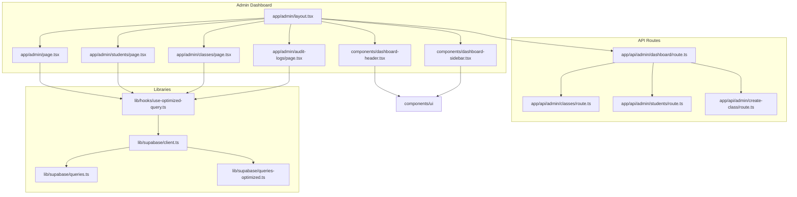
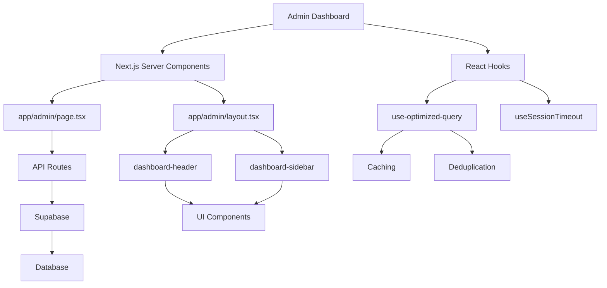
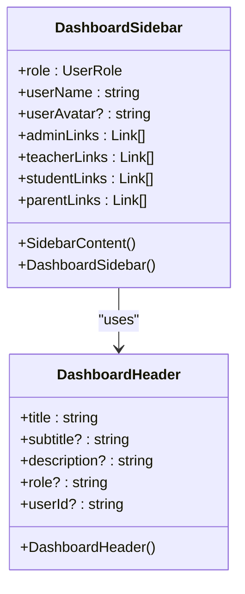
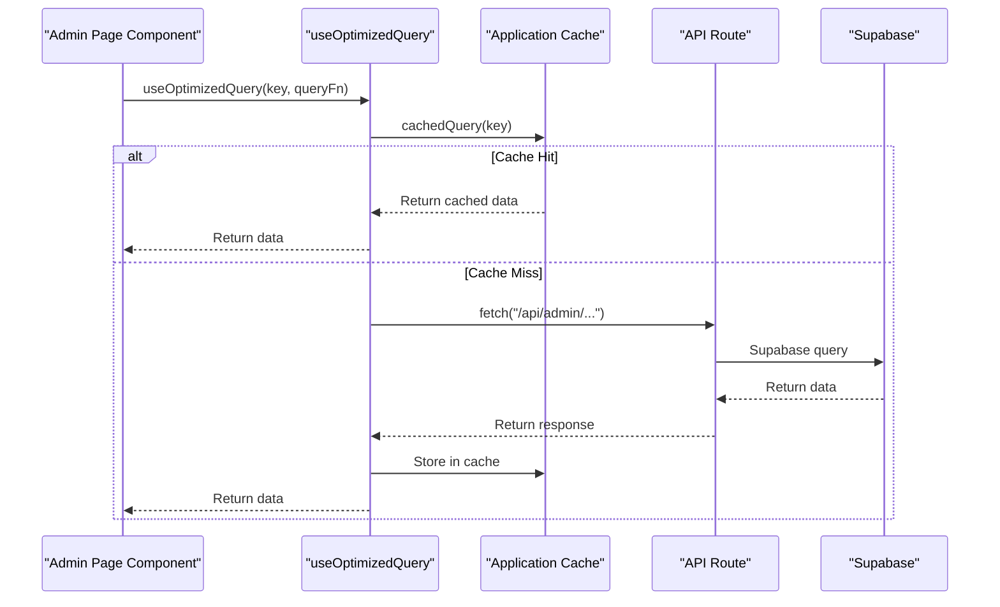
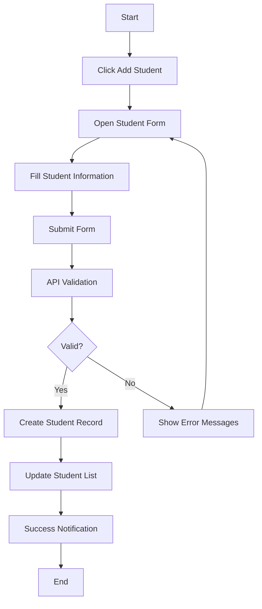
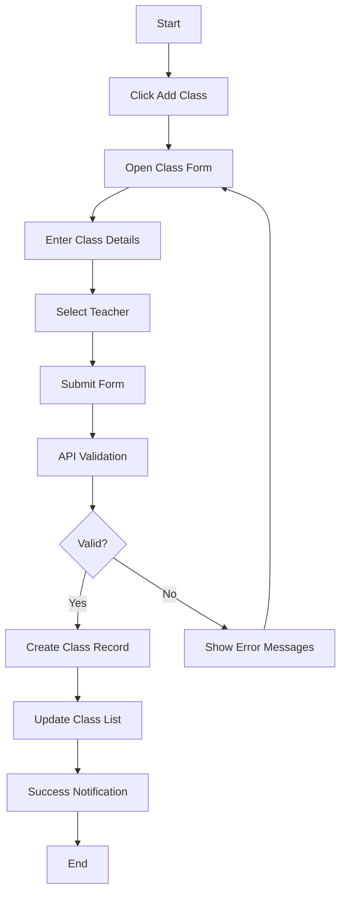
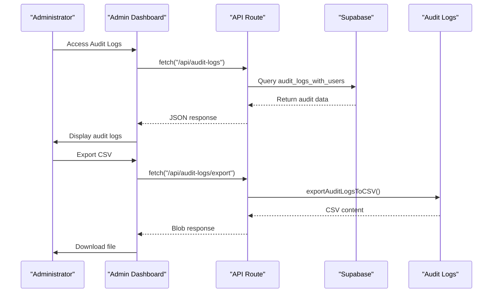
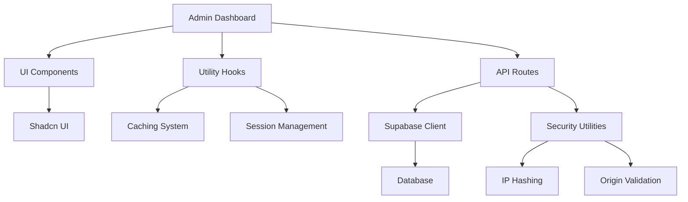

# Admin Dashboard

<cite>
**Referenced Files in This Document**   
- [app/admin/layout.tsx](file://app/admin/layout.tsx)
- [app/admin/page.tsx](file://app/admin/page.tsx)
- [components/dashboard-header.tsx](file://components/dashboard-header.tsx)
- [components/dashboard-sidebar.tsx](file://components/dashboard-sidebar.tsx)
- [lib/hooks/use-optimized-query.ts](file://lib/hooks/use-optimized-query.ts)
- [app/api/admin/dashboard/route.ts](file://app/api/admin/dashboard/route.ts)
- [lib/supabase/client.ts](file://lib/supabase/client.ts)
- [lib/supabase/queries.ts](file://lib/supabase/queries.ts)
- [lib/supabase/queries-optimized.ts](file://lib/supabase/queries-optimized.ts)
- [components/admin-session-guard.tsx](file://components/admin-session-guard.tsx)
- [app/admin/students/page.tsx](file://app/admin/students/page.tsx)
- [app/admin/classes/page.tsx](file://app/admin/classes/page.tsx)
- [app/admin/audit-logs/page.tsx](file://app/admin/audit-logs/page.tsx)
- [lib/supabase/audit-logs.ts](file://lib/supabase/audit-logs.ts)
- [lib/security.ts](file://lib/security.ts)
</cite>

## Table of Contents
1. [Introduction](#introduction)
2. [Project Structure](#project-structure)
3. [Core Components](#core-components)
4. [Architecture Overview](#architecture-overview)
5. [Detailed Component Analysis](#detailed-component-analysis)
6. [Dependency Analysis](#dependency-analysis)
7. [Performance Considerations](#performance-considerations)
8. [Troubleshooting Guide](#troubleshooting-guide)
9. [Conclusion](#conclusion)

## Introduction
The Admin Dashboard serves as the central management interface for school administrators within the School Management System. It provides comprehensive tools for managing users (students, teachers, parents), classes, attendance, grades, and system auditing. Built using Next.js Server Components and React hooks, the dashboard offers a responsive and secure interface for overseeing school operations. This document details the architecture, components, workflows, and security considerations of the Admin Dashboard.

## Project Structure
The Admin Dashboard is organized within the `app/admin/` directory, following a modular structure with dedicated pages for each management function. The layout is consistent across all admin pages, utilizing shared components for the header and sidebar. API routes in `app/api/admin/` handle secure data operations, while reusable components and hooks in the `components/` and `lib/` directories support functionality across the application.

**Diagram sources**
- [app/admin/layout.tsx](file://app/admin/layout.tsx)
- [app/admin/page.tsx](file://app/admin/page.tsx)
- [app/admin/students/page.tsx](file://app/admin/students/page.tsx)
- [app/admin/classes/page.tsx](file://app/admin/classes/page.tsx)
- [app/admin/audit-logs/page.tsx](file://app/admin/audit-logs/page.tsx)
- [app/api/admin/dashboard/route.ts](file://app/api/admin/dashboard/route.ts)
- [lib/hooks/use-optimized-query.ts](file://lib/hooks/use-optimized-query.ts)
- [lib/supabase/client.ts](file://lib/supabase/client.ts)

**Section sources**
- [app/admin/layout.tsx](file://app/admin/layout.tsx)
- [app/admin/page.tsx](file://app/admin/page.tsx)
- [app/api/admin/dashboard/route.ts](file://app/api/admin/dashboard/route.ts)

## Core Components
The Admin Dashboard is built around several core components that provide the foundation for its functionality. The `dashboard-header` and `dashboard-sidebar` components create a consistent user interface across all admin pages. The `use-optimized-query` hook enables efficient data fetching with caching and deduplication. The `admin-session-guard` component ensures secure session management with timeout warnings. These components work together to create a seamless and secure administrative experience.

**Section sources**
- [components/dashboard-header.tsx](file://components/dashboard-header.tsx)
- [components/dashboard-sidebar.tsx](file://components/dashboard-sidebar.tsx)
- [lib/hooks/use-optimized-query.ts](file://lib/hooks/use-optimized-query.ts)
- [components/admin-session-guard.tsx](file://components/admin-session-guard.tsx)

## Architecture Overview
The Admin Dashboard follows a client-server architecture with Next.js Server Components handling initial rendering and API routes managing data operations. The dashboard uses React hooks for client-side interactivity, with the `use-optimized-query` hook providing efficient data fetching patterns. Supabase integration is achieved through API routes in `app/api/admin/`, ensuring secure access to the database. The architecture emphasizes security, performance, and maintainability.

**Diagram sources**
- [app/admin/page.tsx](file://app/admin/page.tsx)
- [app/admin/layout.tsx](file://app/admin/layout.tsx)
- [lib/hooks/use-optimized-query.ts](file://lib/hooks/use-optimized-query.ts)
- [components/dashboard-header.tsx](file://components/dashboard-header.tsx)
- [components/dashboard-sidebar.tsx](file://components/dashboard-sidebar.tsx)
- [app/api/admin/dashboard/route.ts](file://app/api/admin/dashboard/route.ts)

## Detailed Component Analysis

### Dashboard Layout and Header
The Admin Dashboard uses a consistent layout with a sidebar for navigation and a header for user actions. The `dashboard-sidebar` component provides role-based navigation links, while the `dashboard-header` includes search functionality, theme toggling, and notification center access.

**Diagram sources**
- [components/dashboard-sidebar.tsx](file://components/dashboard-sidebar.tsx)
- [components/dashboard-header.tsx](file://components/dashboard-header.tsx)

### Data Fetching and Optimization
The `use-optimized-query` hook provides a robust solution for data fetching with caching, deduplication, and retry logic. It supports various query patterns including paginated, infinite scroll, and debounced search queries. The hook integrates with the application's caching system to minimize redundant API calls and improve performance.

**Diagram sources**
- [lib/hooks/use-optimized-query.ts](file://lib/hooks/use-optimized-query.ts)
- [app/api/admin/dashboard/route.ts](file://app/api/admin/dashboard/route.ts)
- [lib/supabase/client.ts](file://lib/supabase/client.ts)

### User Management Workflow
The Admin Dashboard provides comprehensive tools for managing users, including students, teachers, and parents. The student management page allows administrators to view, filter, and add students. The workflow for creating a new student involves filling out a form with personal and academic information, which is then submitted to the API for processing.

**Diagram sources**
- [app/admin/students/page.tsx](file://app/admin/students/page.tsx)
- [components/student-form.tsx](file://components/student-form.tsx)
- [app/api/admin/students/create/route.ts](file://app/api/admin/students/create/route.ts)

### Class Management Workflow
The class management system allows administrators to create, edit, and delete classes. Each class is associated with a teacher, subject, grade level, and schedule. The workflow for creating a new class involves specifying class details and assigning a teacher, with validation to ensure data integrity.

**Diagram sources**
- [app/admin/classes/page.tsx](file://app/admin/classes/page.tsx)
- [app/api/admin/create-class/route.ts](file://app/api/admin/create-class/route.ts)

### Audit Logging and Security
The Admin Dashboard includes comprehensive audit logging to track user activities and system events. The audit logs page displays authentication events and security activities, with filtering and export capabilities. Security considerations include role-based access control, session timeout management, and IP address hashing for privacy.

**Diagram sources**
- [app/admin/audit-logs/page.tsx](file://app/admin/audit-logs/page.tsx)
- [lib/supabase/audit-logs.ts](file://lib/supabase/audit-logs.ts)
- [app/api/audit-logs/export/route.ts](file://app/api/audit-logs/export/route.ts)

## Dependency Analysis
The Admin Dashboard has a well-defined dependency structure with clear separation between components, hooks, and API routes. The dashboard components depend on UI components from the `components/ui` directory and utility hooks from the `lib/hooks` directory. Data operations are handled through API routes that interact with Supabase, ensuring secure access to the database. The dependency graph shows a modular architecture with minimal circular dependencies.

**Diagram sources**
- [app/admin/page.tsx](file://app/admin/page.tsx)
- [components/dashboard-header.tsx](file://components/dashboard-header.tsx)
- [components/dashboard-sidebar.tsx](file://components/dashboard-sidebar.tsx)
- [lib/hooks/use-optimized-query.ts](file://lib/hooks/use-optimized-query.ts)
- [lib/supabase/client.ts](file://lib/supabase/client.ts)
- [lib/security.ts](file://lib/security.ts)

## Performance Considerations
The Admin Dashboard implements several performance optimizations to ensure a responsive user experience. The `use-optimized-query` hook provides caching and deduplication to minimize redundant API calls. Data fetching is optimized through the use of paginated queries and server-side caching. The dashboard also implements debounced search to reduce the frequency of filtering operations during user input.

**Section sources**
- [lib/hooks/use-optimized-query.ts](file://lib/hooks/use-optimized-query.ts)
- [app/admin/students/page.tsx](file://app/admin/students/page.tsx)
- [app/admin/classes/page.tsx](file://app/admin/classes/page.tsx)

## Troubleshooting Guide
Common issues with the Admin Dashboard include failed user creation, data loading errors, and authentication problems. For failed user creation, verify that all required fields are filled and that the email address is unique. For data loading errors, check the network connection and ensure that the API routes are accessible. Authentication issues may require clearing browser cookies or resetting the user's password.

**Section sources**
- [app/admin/students/page.tsx](file://app/admin/students/page.tsx)
- [app/admin/classes/page.tsx](file://app/admin/classes/page.tsx)
- [app/admin/audit-logs/page.tsx](file://app/admin/audit-logs/page.tsx)

## Conclusion
The Admin Dashboard provides a comprehensive and secure interface for school administrators to manage users, classes, attendance, grades, and system auditing. Its architecture leverages Next.js Server Components and React hooks to create a responsive and efficient user experience. The dashboard's modular design, with reusable components and optimized data fetching, ensures maintainability and scalability. Security features such as role-based access control, audit logging, and session management protect sensitive data and system integrity.