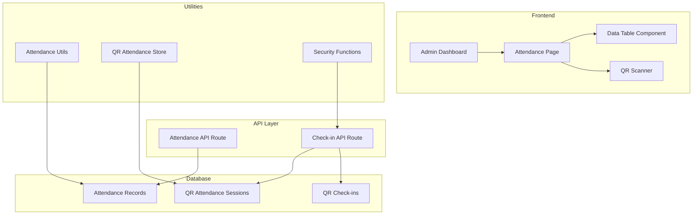
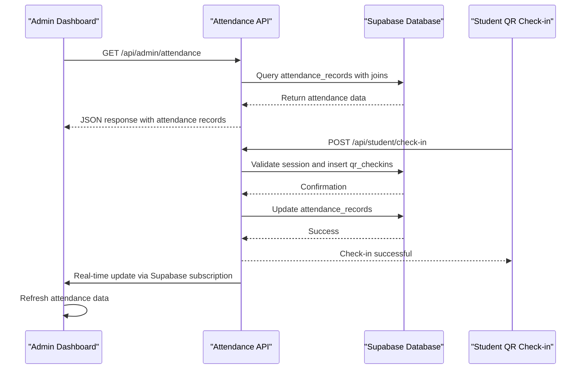
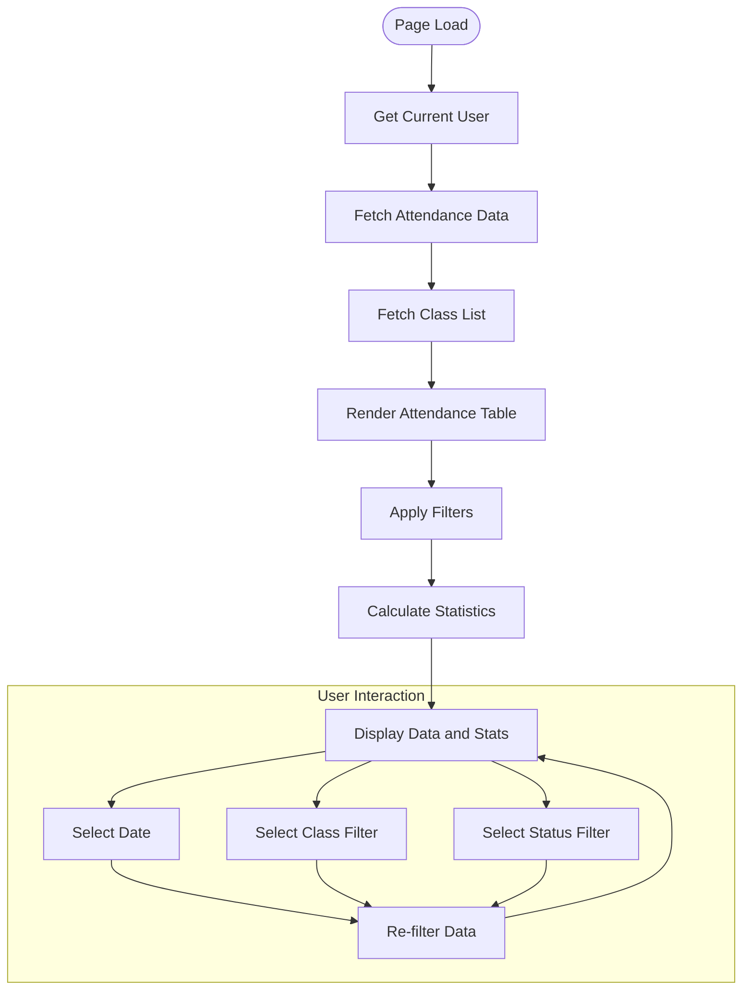
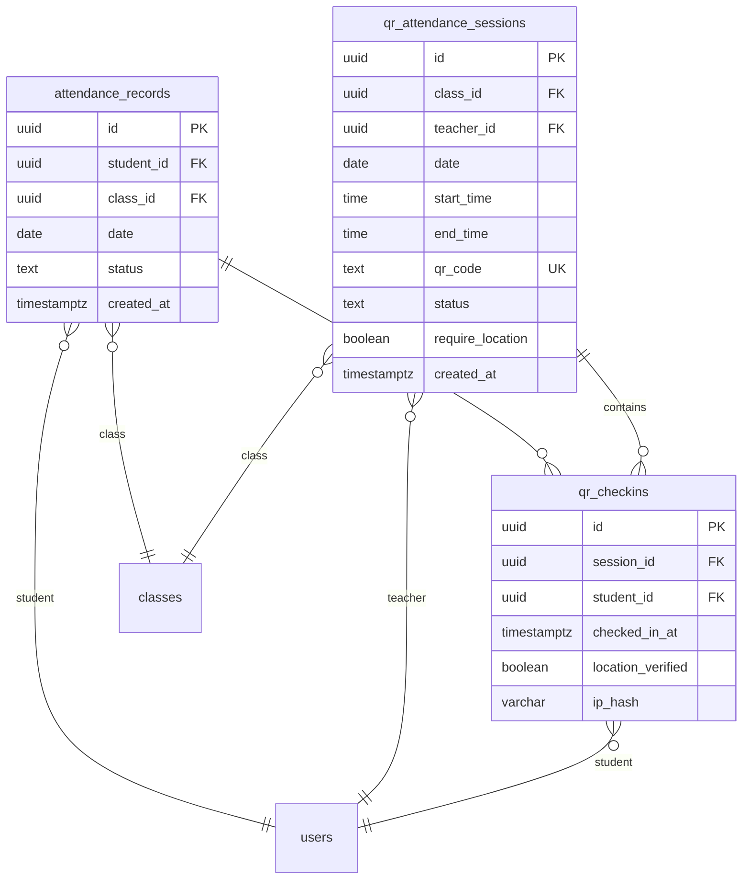
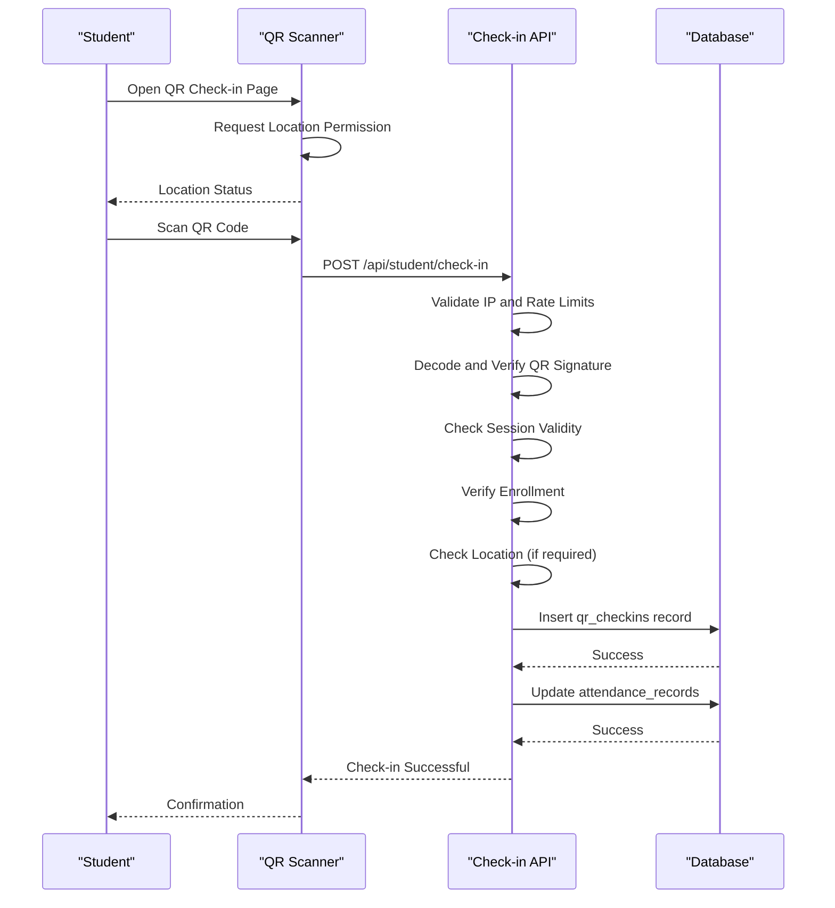
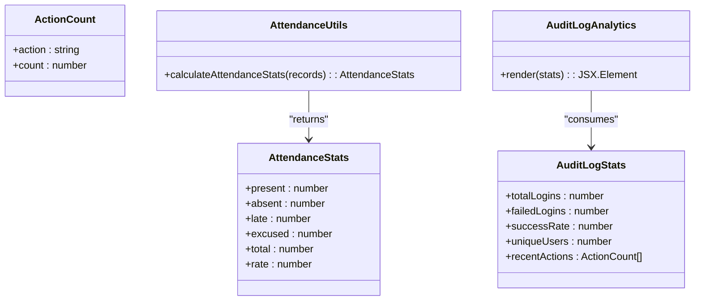
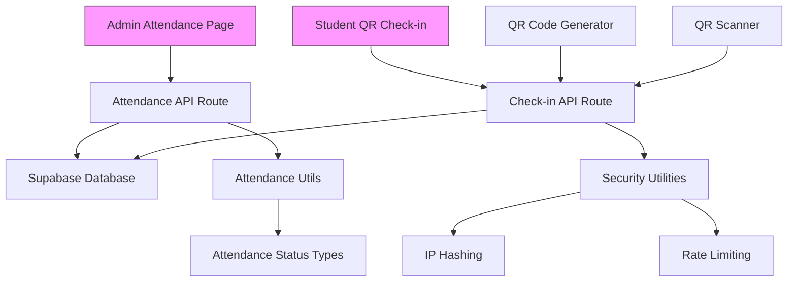

# Attendance Oversight

<cite>
**Referenced Files in This Document**   
- [page.tsx](file://app/admin/attendance/page.tsx)
- [route.ts](file://app/api/admin/attendance/route.ts)
- [attendance-utils.ts](file://lib/attendance-utils.ts)
- [audit-log-analytics.tsx](file://components/audit-log-analytics.tsx)
- [20251219043454_create_attendance_tables.sql](file://supabase/migrations/20251219043454_create_attendance_tables.sql)
- [20251219121408_add_attendance_unique_constraint.sql](file://supabase/migrations/20251219121408_add_attendance_unique_constraint.sql)
- [types.ts](file://lib/types.ts)
- [database.types.ts](file://lib/database.types.ts)
- [student/qr-checkin/page.tsx](file://app/student/qr-checkin/page.tsx)
- [check-in/route.ts](file://app/api/student/check-in/route.ts)
- [qr-attendance-store.ts](file://lib/qr-attendance-store.ts)
- [qr-scanner.tsx](file://components/qr-scanner.tsx)
- [qr-code-generator.tsx](file://components/qr-code-generator.tsx)
</cite>

## Table of Contents
1. [Introduction](#introduction)
2. [Project Structure](#project-structure)
3. [Core Components](#core-components)
4. [Architecture Overview](#architecture-overview)
5. [Detailed Component Analysis](#detailed-component-analysis)
6. [Dependency Analysis](#dependency-analysis)
7. [Performance Considerations](#performance-considerations)
8. [Troubleshooting Guide](#troubleshooting-guide)
9. [Conclusion](#conclusion)

## Introduction
The Attendance Oversight sub-feature of the Admin Dashboard provides comprehensive monitoring and management of student attendance across classes. This system integrates real-time QR check-in capabilities with robust data visualization and audit capabilities. The implementation leverages Supabase for data storage and retrieval, with a well-defined API layer for secure access to attendance records. The system supports multiple attendance statuses, enforces data integrity through database constraints, and provides administrators with tools to identify patterns and resolve discrepancies.

## Project Structure
The attendance system is organized across multiple directories with clear separation of concerns. The frontend components reside in the app/admin/attendance directory, while API routes are located in app/api/admin/attendance. The database schema is defined in the supabase/migrations directory, and shared utilities are stored in the lib directory.

**Diagram sources**
- [page.tsx](file://app/admin/attendance/page.tsx)
- [route.ts](file://app/api/admin/attendance/route.ts)
- [20251219043454_create_attendance_tables.sql](file://supabase/migrations/20251219043454_create_attendance_tables.sql)
- [attendance-utils.ts](file://lib/attendance-utils.ts)

**Section sources**
- [page.tsx](file://app/admin/attendance/page.tsx)
- [route.ts](file://app/api/admin/attendance/route.ts)
- [20251219043454_create_attendance_tables.sql](file://supabase/migrations/20251219043454_create_attendance_tables.sql)

## Core Components
The Attendance Oversight system consists of several core components that work together to provide a comprehensive attendance management solution. The admin interface displays attendance records with filtering and statistical capabilities, while the QR check-in system enables students to mark their attendance in real-time. The backend API routes handle data retrieval and processing, with appropriate security measures in place. Utility functions provide common operations such as attendance statistics calculation and security validation.

**Section sources**
- [page.tsx](file://app/admin/attendance/page.tsx)
- [attendance-utils.ts](file://lib/attendance-utils.ts)
- [check-in/route.ts](file://app/api/student/check-in/route.ts)

## Architecture Overview
The attendance system follows a layered architecture with clear separation between presentation, business logic, and data access layers. The admin dashboard consumes data from API routes, which in turn query the Supabase database. The QR check-in system operates in parallel, allowing students to mark their attendance which is then reflected in the admin view through real-time updates.

**Diagram sources**
- [page.tsx](file://app/admin/attendance/page.tsx)
- [route.ts](file://app/api/admin/attendance/route.ts)
- [check-in/route.ts](file://app/api/student/check-in/route.ts)

## Detailed Component Analysis

### Admin Attendance Interface
The admin attendance interface provides a comprehensive view of student attendance across all classes. It includes filtering capabilities by date, class, and status, along with statistical summaries of attendance patterns.

**Diagram sources**
- [page.tsx](file://app/admin/attendance/page.tsx)

**Section sources**
- [page.tsx](file://app/admin/attendance/page.tsx)

### Database Schema
The attendance system utilizes three main tables to track attendance: attendance_records for the official record, qr_attendance_sessions for active check-in sessions, and qr_checkins for individual check-in events.

**Diagram sources**
- [20251219043454_create_attendance_tables.sql](file://supabase/migrations/20251219043454_create_attendance_tables.sql)
- [database.types.ts](file://lib/database.types.ts)

**Section sources**
- [20251219043454_create_attendance_tables.sql](file://supabase/migrations/20251219043454_create_attendance_tables.sql)
- [20251219121408_add_attendance_unique_constraint.sql](file://supabase/migrations/20251219121408_add_attendance_unique_constraint.sql)

### QR Check-in System
The QR check-in system enables students to mark their attendance by scanning a dynamically generated QR code. The system includes multiple security measures to prevent abuse and ensure data accuracy.

**Diagram sources**
- [student/qr-checkin/page.tsx](file://app/student/qr-checkin/page.tsx)
- [check-in/route.ts](file://app/api/student/check-in/route.ts)
- [qr-attendance-store.ts](file://lib/qr-attendance-store.ts)

**Section sources**
- [student/qr-checkin/page.tsx](file://app/student/qr-checkin/page.tsx)
- [check-in/route.ts](file://app/api/student/check-in/route.ts)
- [qr-attendance-store.ts](file://lib/qr-attendance-store.ts)

### Attendance Statistics and Analytics
The system provides detailed attendance statistics and analytics to help administrators identify patterns and trends in student attendance.

**Diagram sources**
- [attendance-utils.ts](file://lib/attendance-utils.ts)
- [audit-log-analytics.tsx](file://components/audit-log-analytics.tsx)
- [types.ts](file://lib/types.ts)

**Section sources**
- [attendance-utils.ts](file://lib/attendance-utils.ts)
- [audit-log-analytics.tsx](file://components/audit-log-analytics.tsx)

## Dependency Analysis
The attendance system has well-defined dependencies between components, ensuring loose coupling and high cohesion. The frontend components depend on the API routes for data, which in turn depend on the database schema and security utilities.

**Diagram sources**
- [page.tsx](file://app/admin/attendance/page.tsx)
- [route.ts](file://app/api/admin/attendance/route.ts)
- [check-in/route.ts](file://app/api/student/check-in/route.ts)
- [attendance-utils.ts](file://lib/attendance-utils.ts)
- [security.ts](file://lib/security.ts)

**Section sources**
- [page.tsx](file://app/admin/attendance/page.tsx)
- [route.ts](file://app/api/admin/attendance/route.ts)
- [check-in/route.ts](file://app/api/student/check-in/route.ts)

## Performance Considerations
The attendance system has been optimized for performance with several key considerations. The API routes use efficient database queries with appropriate indexing, and the frontend implements client-side caching where appropriate. The QR check-in process is designed to be fast and responsive, with minimal latency between scanning and confirmation.

The database schema includes indexes on frequently queried fields such as student_id, class_id, and date in the attendance_records table. The unique constraint on (student_id, class_id, date) ensures data integrity while also serving as an index for fast lookups. The QR check-in system uses hashed IP addresses for abuse detection without compromising user privacy.

**Section sources**
- [20251219043454_create_attendance_tables.sql](file://supabase/migrations/20251219043454_create_attendance_tables.sql)
- [20251219121408_add_attendance_unique_constraint.sql](file://supabase/migrations/20251219121408_add_attendance_unique_constraint.sql)
- [check-in/route.ts](file://app/api/student/check-in/route.ts)

## Troubleshooting Guide
This section addresses common issues that may arise with the attendance system and provides guidance on resolution.

### Missing Check-ins
If a student's check-in does not appear in the admin view, verify the following:
- The student successfully completed the check-in process and received a confirmation
- The check-in was made during an active session with a valid QR code
- The student is enrolled in the class for which attendance was marked
- The check-in was made from a location within the school's geofence (if required)
- The network connection was stable during the check-in process

### Synchronization Delays
In rare cases, there may be a delay between a student's check-in and the update appearing in the admin view. This is typically due to:
- Network latency between the client and server
- Supabase subscription delivery timing
- Browser caching of the attendance page

To resolve synchronization delays, administrators can refresh the attendance page or wait for the next automatic update.

### Data Discrepancies
If discrepancies are found between the QR check-ins and attendance records, use the validation rules in attendance-utils.ts to verify data accuracy. The system automatically updates attendance_records when a valid check-in is processed, but manual verification can be performed by comparing the qr_checkins and attendance_records tables.

**Section sources**
- [check-in/route.ts](file://app/api/student/check-in/route.ts)
- [attendance-utils.ts](file://lib/attendance-utils.ts)
- [page.tsx](file://app/admin/attendance/page.tsx)

## Conclusion
The Attendance Oversight system provides a comprehensive solution for monitoring and managing student attendance. By integrating real-time QR check-in capabilities with robust data visualization and analytics, the system enables administrators to maintain accurate attendance records and identify patterns in student attendance. The implementation follows security best practices, including rate limiting, IP hashing for privacy-preserving abuse detection, and strict validation of QR codes. The system's modular architecture allows for easy maintenance and future enhancements.