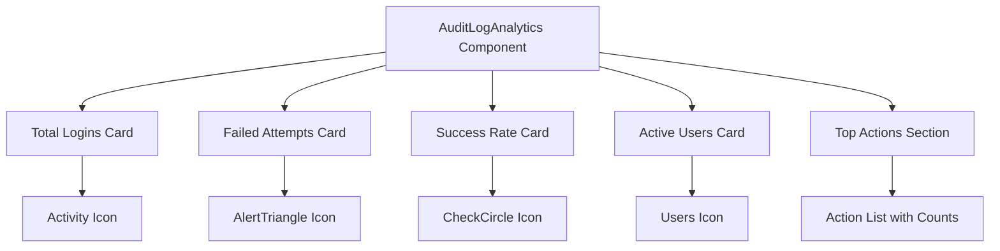
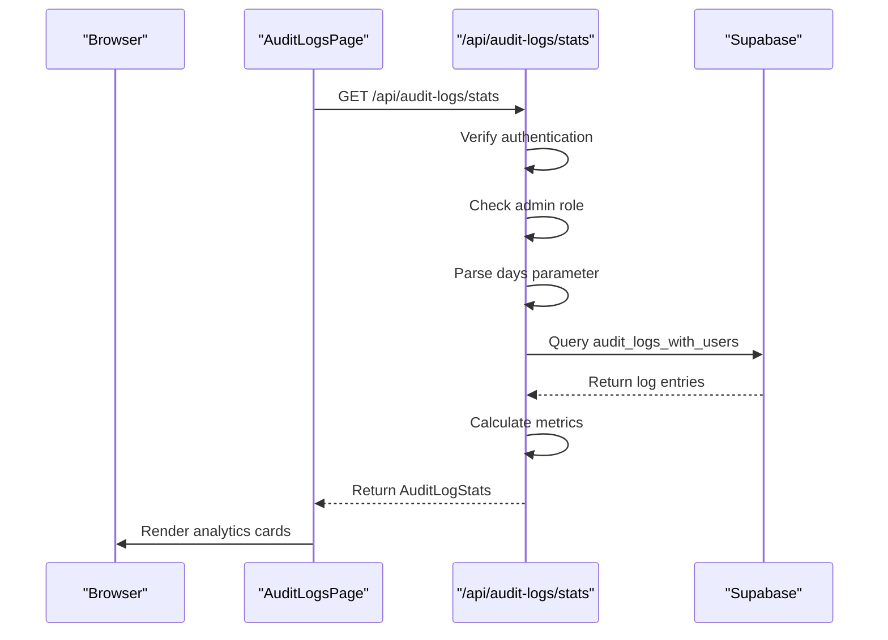
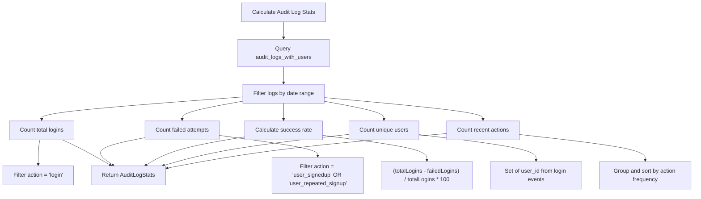
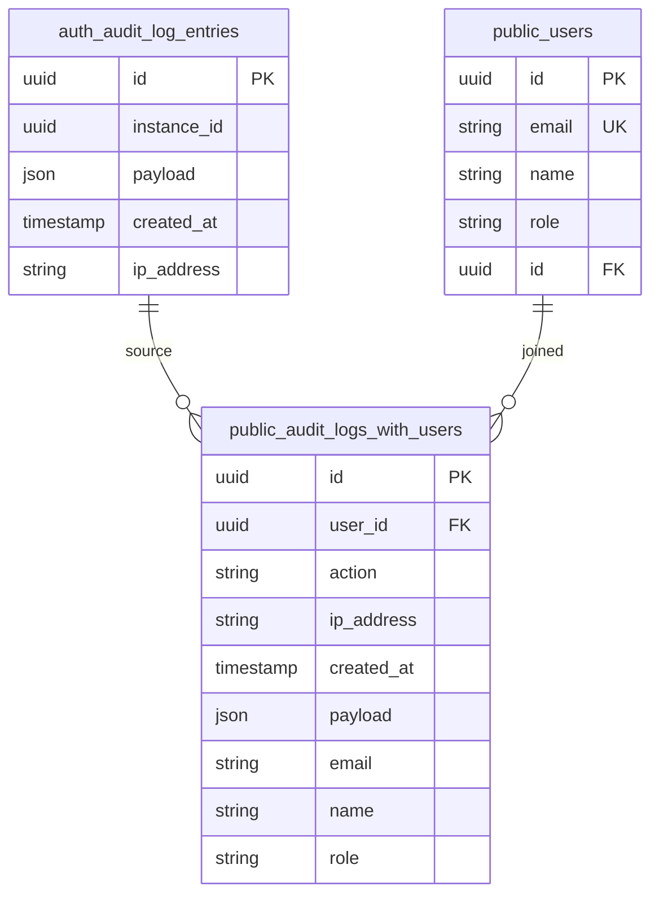

# Analytics and Statistics

<cite>
**Referenced Files in This Document**   
- [audit-log-analytics.tsx](file://components/audit-log-analytics.tsx)
- [audit-logs/page.tsx](file://app/admin/audit-logs/page.tsx)
- [stats/route.ts](file://app/api/audit-logs/stats/route.ts)
- [audit-logs.ts](file://lib/supabase/audit-logs.ts)
- [stat-card.tsx](file://components/stat-card.tsx)
- [cache.ts](file://lib/cache.ts)
- [use-optimized-query.ts](file://lib/hooks/use-optimized-query.ts)
- [20260108_audit_logs_indexes.sql](file://supabase/migrations/20260108_audit_logs_indexes.sql)
</cite>

## Table of Contents
1. [Introduction](#introduction)
2. [Audit Log Analytics Component](#audit-log-analytics-component)
3. [Statistical Data Fetching](#statistical-data-fetching)
4. [Metric Calculation Logic](#metric-calculation-logic)
5. [Administrative Use Cases](#administrative-use-cases)
6. [Data Freshness and Caching](#data-freshness-and-caching)
7. [Troubleshooting Guide](#troubleshooting-guide)

## Introduction
The Audit Log Analytics dashboard provides administrators with comprehensive insights into system authentication events and security activities. This documentation details the implementation of the analytics component, including data fetching, metric calculation, and visualization. The system monitors key metrics such as total logins, failed attempts, success rate, and active users to help administrators maintain system health and detect potential security threats.

## Audit Log Analytics Component

The AuditLogAnalytics component displays key security metrics using StatCard components arranged in a responsive grid layout. The component renders four primary metrics: total logins, failed attempts, success rate, and active users, along with a section showing top actions.

The implementation uses the AuditLogAnalytics component to visualize authentication statistics. Each metric is displayed in a card with an appropriate icon and contextual information. The component accepts AuditLogStats as a prop and renders the data in a responsive grid that adapts to different screen sizes, displaying one card per column on mobile and four cards per row on larger screens.

**Diagram sources**
- [audit-log-analytics.tsx](file://components/audit-log-analytics.tsx#L1-L78)

**Section sources**
- [audit-log-analytics.tsx](file://components/audit-log-analytics.tsx#L1-L78)
- [audit-logs/page.tsx](file://app/admin/audit-logs/page.tsx#L197)

## Statistical Data Fetching

The audit log statistics are fetched from the `/api/audit-logs/stats` endpoint, which returns a JSON response containing the calculated metrics. The endpoint is protected and only accessible to administrators, ensuring that sensitive security information is properly restricted.

The data fetching process begins when the AuditLogsPage component mounts, triggering the fetchStats function which makes a GET request to the stats endpoint. The API route validates that the requesting user is authenticated and has admin privileges before processing the request. The endpoint supports a query parameter to specify the time period (in days) for which statistics should be calculated, defaulting to 30 days if not specified.

**Diagram sources**
- [stats/route.ts](file://app/api/audit-logs/stats/route.ts#L5-L40)
- [audit-logs/page.tsx](file://app/admin/audit-logs/page.tsx#L77-L97)

**Section sources**
- [stats/route.ts](file://app/api/audit-logs/stats/route.ts#L5-L40)
- [audit-logs/page.tsx](file://app/admin/audit-logs/page.tsx#L77-L97)
- [audit-logs.ts](file://lib/supabase/audit-logs.ts#L104-L144)

## Metric Calculation Logic

The key metrics displayed in the dashboard are calculated from audit log entries using specific logic implemented in the getAuditLogStats function. The calculation considers various authentication events and derives meaningful statistics that help administrators assess system security and usage patterns.

The success rate is calculated as the percentage of successful login attempts out of total login attempts. Total logins count all "login" actions, while failed attempts count "user_signedup" and "user_repeated_signup" actions, which represent failed authentication attempts. The unique users metric counts distinct user IDs from login-related events, providing insight into active user engagement.

**Diagram sources**
- [audit-logs.ts](file://lib/supabase/audit-logs.ts#L104-L144)

**Section sources**
- [audit-logs.ts](file://lib/supabase/audit-logs.ts#L104-L144)
- [audit-log-analytics.tsx](file://components/audit-log-analytics.tsx#L20-L54)

## Administrative Use Cases

Administrators can leverage the audit log analytics to monitor system health, detect anomalies, and ensure security compliance. The dashboard provides actionable insights that help identify potential security threats and understand user behavior patterns.

The analytics help administrators identify suspicious activity patterns such as multiple failed login attempts, which could indicate brute force attacks. The success rate metric helps identify authentication issues that might affect legitimate users. The active users metric provides insight into system adoption and engagement, while the top actions section reveals the most common activities in the system.

Administrators can use these analytics to:
- Detect potential security breaches through unusual login patterns
- Identify system issues affecting user authentication
- Monitor user engagement and adoption rates
- Verify the effectiveness of security policies
- Generate reports for compliance requirements
- Investigate specific user activities when needed

The dashboard also includes security alerts that automatically detect suspicious activity, such as multiple failed login attempts within a short time period, helping administrators respond quickly to potential threats.

**Section sources**
- [audit-logs/page.tsx](file://app/admin/audit-logs/page.tsx#L180-L193)
- [audit-logs.ts](file://lib/supabase/audit-logs.ts#L147-L226)

## Data Freshness and Caching

The system implements caching mechanisms to balance data freshness with performance. While the audit log statistics are calculated on-demand when requested, the underlying data access patterns consider performance implications and potential discrepancies.

The audit log statistics are not cached at the application level, ensuring that administrators always see the most current data when they load the dashboard. However, database-level caching and query optimization are employed through the use of database views and indexes. The audit_logs_with_users view simplifies querying by joining audit log entries with user information, improving query performance.

Potential discrepancies in metrics could occur due to:
- Timing delays in audit log recording
- Network issues affecting log delivery
- Database replication lag in distributed systems
- Timezone differences in timestamp recording

The system does not implement client-side caching for audit log statistics to ensure administrators have access to the most current security information. However, the use of optimized database queries and views helps maintain acceptable performance even with large volumes of audit data.

**Diagram sources**
- [20260108_audit_logs_indexes.sql](file://supabase/migrations/20260108_audit_logs_indexes.sql#L8-L20)
- [audit-logs.ts](file://lib/supabase/audit-logs.ts#L57-L68)

**Section sources**
- [20260108_audit_logs_indexes.sql](file://supabase/migrations/20260108_audit_logs_indexes.sql#L8-L20)
- [cache.ts](file://lib/cache.ts#L6-L39)
- [use-optimized-query.ts](file://lib/hooks/use-optimized-query.ts#L28-L123)

## Troubleshooting Guide

When encountering issues with the audit log analytics, administrators should follow this troubleshooting guide to identify and resolve common problems related to inaccurate statistics or missing data.

**Common Issues and Solutions:**

1. **Missing or zero statistics:**
   - Verify that the database migration has been applied (supabase db push)
   - Check that the audit_logs_with_users view exists and is accessible
   - Ensure there are actual audit log entries in the system

2. **Inaccurate success rate calculations:**
   - Verify that the time period parameter is correctly set
   - Check that all relevant login events are being captured
   - Confirm that failed attempt detection logic is working correctly

3. **Performance issues with large datasets:**
   - Ensure database indexes are properly created
   - Verify that the audit_logs_with_users view is optimized
   - Consider implementing pagination for large result sets

4. **Authentication errors when accessing stats:**
   - Confirm the user is logged in
   - Verify the user has admin role privileges
   - Check that authentication tokens are valid

**Diagnostic Steps:**
1. Check browser developer tools for API request errors
2. Verify the response from /api/audit-logs/stats contains expected data
3. Examine the audit log entries directly in the database
4. Review server logs for any errors in the stats calculation process
5. Confirm the database schema matches the expected structure

The system includes error handling that displays a database setup notice when no logs are found, guiding administrators to run the necessary migrations. Additionally, the UI provides a refresh button to manually reload data when discrepancies are suspected.

**Section sources**
- [audit-logs/page.tsx](file://app/admin/audit-logs/page.tsx#L161-L176)
- [stats/route.ts](file://app/api/audit-logs/stats/route.ts#L36-L39)
- [audit-logs/page.tsx](file://app/admin/audit-logs/page.tsx#L88-L97)