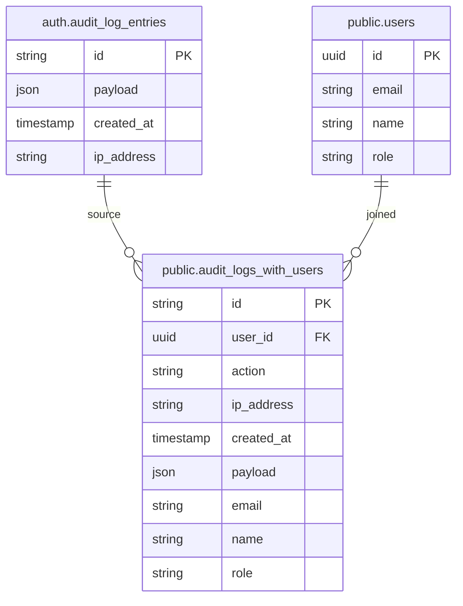
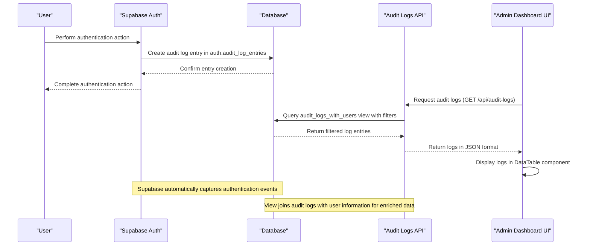
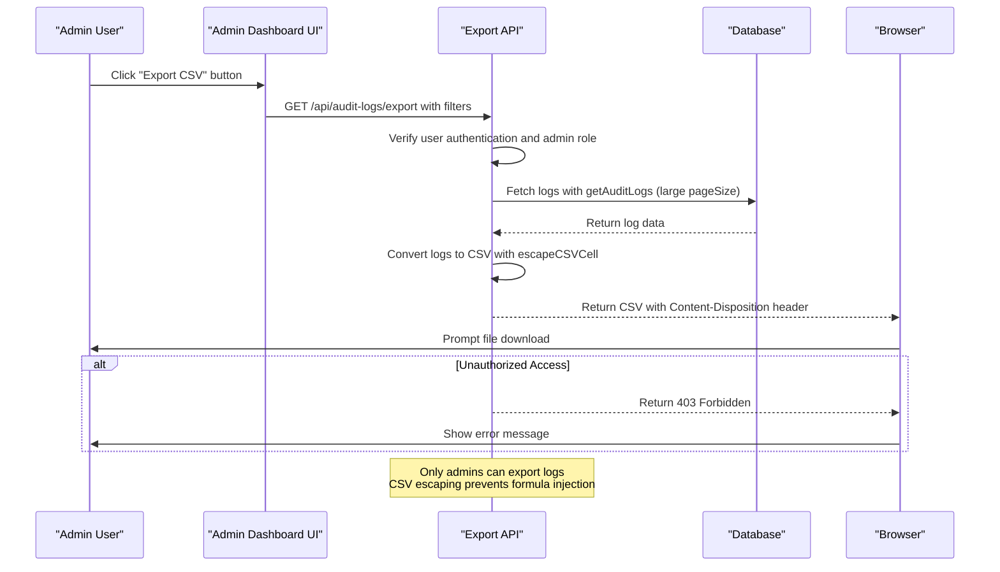

# Audit Logging

<cite>
**Referenced Files in This Document**   
- [page.tsx](file://app/admin/audit-logs/page.tsx)
- [audit-log-filters.tsx](file://components/audit-log-filters.tsx)
- [audit-log-table.tsx](file://components/audit-log-table.tsx)
- [audit-log-analytics.tsx](file://components/audit-log-analytics.tsx)
- [audit-logs.ts](file://lib/supabase/audit-logs.ts)
- [route.ts](file://app/api/audit-logs/route.ts)
- [export/route.ts](file://app/api/audit-logs/export/route.ts)
- [stats/route.ts](file://app/api/audit-logs/stats/route.ts)
- [20260108_audit_logs_indexes.sql](file://supabase/migrations/20260108_audit_logs_indexes.sql)
- [20260108132041_audit_logs_view_v2.sql](file://supabase/migrations/20260108132041_audit_logs_view_v2.sql)
- [types.ts](file://lib/supabase/types.ts)
- [data-table.tsx](file://components/data-table.tsx)
</cite>

## Table of Contents
1. [Introduction](#introduction)
2. [Audit Log Data Model](#audit-log-data-model)
3. [Event Capture and Storage](#event-capture-and-storage)
4. [Indexing Strategy for Performance](#indexing-strategy-for-performance)
5. [Export Functionality](#export-functionality)
6. [UI Components for Log Analysis](#ui-components-for-log-analysis)
7. [Security Considerations](#security-considerations)
8. [Common Issues and Troubleshooting](#common-issues-and-troubleshooting)
9. [Retention Policies and Performance Implications](#retention-policies-and-performance-implications)

## Introduction
The Audit Logging sub-feature of the Admin Dashboard provides comprehensive system activity tracking for the School Management System. This documentation details the implementation of event capture, storage, and visualization of audit logs, focusing on authentication events and security activities. The system enables administrators to monitor user actions, detect suspicious behavior, and maintain compliance through immutable logging practices. The implementation leverages Supabase's built-in audit logging capabilities while extending them with custom views, security policies, and user interface components for effective log analysis.

## Audit Log Data Model
The audit logging system is built on Supabase's native `auth.audit_log_entries` table, which automatically captures authentication-related events. The system extends this foundation through a view that joins audit log data with user information for enhanced queryability.

The core data model consists of:
- **Raw audit log entries**: Stored in `auth.audit_log_entries` with fields including `id`, `payload` (JSON), `created_at`, and `ip_address`
- **Enriched view**: `public.audit_logs_with_users` view that extracts user information from the JSON payload and joins with the `users` table

The `AuditLogEntry` interface defines the structure of log entries with the following properties:
- `id`: Unique identifier for the log entry
- `user_id`: UUID of the user associated with the action
- `action`: Type of action performed (e.g., "login", "logout", "user_updated_password")
- `ip_address`: IP address from which the action was performed
- `created_at`: Timestamp of when the action occurred
- `payload`: JSON object containing additional context about the action
- `email`, `name`, `role`: User information joined from the users table



**Diagram sources**
- [20260108_audit_logs_indexes.sql](file://supabase/migrations/20260108_audit_logs_indexes.sql#L8-L20)
- [types.ts](file://lib/supabase/types.ts#L245-L252)

**Section sources**
- [audit-logs.ts](file://lib/supabase/audit-logs.ts#L8-L18)
- [types.ts](file://lib/supabase/types.ts#L245-L252)

## Event Capture and Storage
The audit logging system captures authentication events through Supabase's built-in audit logging feature, which automatically records actions such as logins, logouts, password changes, and user management operations.

Events are captured through the following process:
1. Authentication actions trigger Supabase Auth to create entries in the `auth.audit_log_entries` table
2. Each entry contains a JSON payload with details about the action, including the actor_id (user_id), action type, and additional context
3. The system uses a database view (`audit_logs_with_users`) to extract user information from the JSON payload and join it with user details from the `users` table
4. This enriched data is then queried through API routes for display in the Admin Dashboard

The system captures various types of events, including:
- Authentication events (login, logout, token refresh)
- User management actions (user creation, modification, deletion)
- Security-related actions (password changes, MFA configuration changes)
- Session management (token revocation, refresh)

The `getAuditLogs` function in the audit-logs utility handles querying the enriched view with support for filtering by user ID, action type, date range, and IP address. The function also implements pagination to handle large datasets efficiently.



**Diagram sources**
- [route.ts](file://app/api/audit-logs/route.ts#L5-L65)
- [audit-logs.ts](file://lib/supabase/audit-logs.ts#L41-L82)
- [20260108_audit_logs_indexes.sql](file://supabase/migrations/20260108_audit_logs_indexes.sql#L8-L20)

**Section sources**
- [audit-logs.ts](file://lib/supabase/audit-logs.ts#L41-L82)
- [route.ts](file://app/api/audit-logs/route.ts#L5-L65)

## Indexing Strategy for Performance
The audit logging system implements a strategic indexing approach to ensure optimal query performance, particularly for large datasets. Since the base `auth.audit_log_entries` table is managed by Supabase and cannot be directly indexed, the system uses a view-based approach with supporting indexes on related tables.

The primary performance optimization is the `audit_logs_with_users` view, which pre-joins audit log data with user information. This eliminates the need for expensive runtime joins and allows for more efficient filtering and sorting.

Additional performance considerations include:
- The view extracts frequently queried fields like `user_id` and `action` from the JSON payload into accessible columns
- Supporting indexes on the `users` table (e.g., `idx_users_role`, `idx_users_email`) accelerate the join operations
- The system leverages Supabase's built-in indexing on the `auth.audit_log_entries` table for the `created_at` field, enabling efficient date-based filtering
- Pagination is implemented with `range()` queries to limit result sets and reduce memory usage

The migration file `20260108_performance_indexes.sql` contains additional indexes on various tables that indirectly support audit log performance by optimizing user data retrieval, which is critical for the view's join operations.

```mermaid
graph TD
A[auth.audit_log_entries] --> |Base table| B(audit_logs_with_users View)
C[users table] --> |Join| B
D[idx_users_role] --> |Supports| C
E[idx_users_email] --> |Supports| C
F[idx_users_is_active] --> |Supports| C
B --> G[API Queries]
G --> H[Admin Dashboard]
style A fill:#f9f,stroke:#333
style B fill:#bbf,stroke:#333,color:#fff
style C fill:#f9f,stroke:#333
style D fill:#f96,stroke:#333
style E fill:#f96,stroke:#333
style F fill:#f96,stroke:#333
Note: "Supabase manages auth.audit_log_entries indexing\nCustom indexes on users table optimize join performance"
```

**Diagram sources**
- [20260108_audit_logs_indexes.sql](file://supabase/migrations/20260108_audit_logs_indexes.sql#L8-L20)
- [20260108_performance_indexes.sql](file://supabase/migrations/20260108_performance_indexes.sql#L6-L8)

**Section sources**
- [20260108_audit_logs_indexes.sql](file://supabase/migrations/20260108_audit_logs_indexes.sql#L8-L20)
- [20260108_performance_indexes.sql](file://supabase/migrations/20260108_performance_indexes.sql#L6-L8)

## Export Functionality
The audit logging system provides CSV export functionality through the `/api/audit-logs/export` API endpoint, allowing administrators to download log data for offline analysis or compliance reporting.

The export process works as follows:
1. The client requests the export endpoint with optional filters (user ID, action type, date range)
2. The server verifies the user is authenticated and has admin privileges
3. The system fetches all matching log entries with a large page size (10,000 records) to accommodate comprehensive exports
4. The log data is converted to CSV format with proper escaping to prevent formula injection attacks
5. The CSV is returned as a downloadable file with appropriate headers

Key security features of the export functionality include:
- Role-based access control: Only users with the "admin" role can export logs
- Authentication verification: Users must be logged in to access the export endpoint
- Input sanitization: Query parameters are properly validated and sanitized
- Formula injection protection: CSV cells are escaped to prevent malicious formula execution in spreadsheet applications

The `exportAuditLogsToCSV` function implements CSV generation with security considerations, prefixing cells that start with dangerous characters (=, +, -, @) with a single quote to prevent formula injection attacks.



**Diagram sources**
- [export/route.ts](file://app/api/audit-logs/export/route.ts#L5-L59)
- [audit-logs.ts](file://lib/supabase/audit-logs.ts#L244-L261)

**Section sources**
- [export/route.ts](file://app/api/audit-logs/export/route.ts#L5-L59)
- [audit-logs.ts](file://lib/supabase/audit-logs.ts#L244-L261)

## UI Components for Log Analysis
The Admin Dashboard provides a comprehensive set of UI components for filtering, searching, and analyzing audit logs. These components are designed to help administrators quickly identify patterns, investigate security events, and monitor system activity.

The main UI components include:

### Audit Log Table
The `AuditLogTable` component displays log entries in a tabular format with columns for date/time, user, role, action, and IP address. Actions are displayed with severity-based badges (high, medium, low) to quickly identify critical events. The table uses the `DataTable` component which supports row click interactions to view detailed log information.

### Audit Log Filters
The `AuditLogFilters` component provides a comprehensive filtering interface with controls for:
- Action type (login, logout, password changes, etc.)
- Date range (start and end date)
- User ID
- IP address

Filters are applied dynamically, and the component includes a clear filters button to reset the search criteria. The filter state is managed in React state and passed to the API for server-side filtering.

### Audit Log Analytics
The `AuditLogAnalytics` component displays key metrics in a dashboard format, including:
- Total logins
- Failed login attempts
- Authentication success rate
- Number of unique active users
- Top actions by frequency

These metrics provide administrators with a quick overview of system activity and potential security concerns.

### Additional UI Features
- **Security alerts**: The system automatically detects suspicious activity (e.g., multiple failed login attempts) and displays alerts at the top of the page
- **Pagination**: Large log sets are paginated with 50 entries per page and navigation controls
- **Refresh and export**: Buttons to refresh the log data and export to CSV
- **Detailed log view**: Clicking on a log entry opens a dialog with complete details including the JSON payload

```mermaid
flowchart TD
A[Audit Logs Page] --> B[AuditLogAnalytics]
A --> C[AuditLogFilters]
A --> D[AuditLogTable]
A --> E[Security Alerts]
C --> F[Action Type Filter]
C --> G[Date Range Filter]
C --> H[User ID Filter]
C --> I[IP Address Filter]
D --> J[Date/Time Column]
D --> K[User Column]
D --> L[Role Column]
D --> M[Action Column]
D --> N[IP Address Column]
B --> O[Total Logins]
B --> P[Failed Attempts]
B --> Q[Success Rate]
B --> R[Active Users]
A --> S[Export CSV Button]
A --> T[Refresh Button]
D --> U[Row Click -> Detail Dialog]
style A fill:#4CAF50,stroke:#333,color:#fff
style B fill:#2196F3,stroke:#333,color:#fff
style C fill:#2196F3,stroke:#333,color:#fff
style D fill:#2196F3,stroke:#333,color:#fff
Note: "Components work together to provide comprehensive log analysis<br>Real-time filtering and analytics enhance usability"
```

**Diagram sources**
- [page.tsx](file://app/admin/audit-logs/page.tsx#L24-L336)
- [audit-log-table.tsx](file://components/audit-log-table.tsx#L13-L84)
- [audit-log-filters.tsx](file://components/audit-log-filters.tsx#L40-L154)
- [audit-log-analytics.tsx](file://components/audit-log-analytics.tsx#L11-L78)

**Section sources**
- [page.tsx](file://app/admin/audit-logs/page.tsx#L24-L336)
- [audit-log-table.tsx](file://components/audit-log-table.tsx#L13-L84)
- [audit-log-filters.tsx](file://components/audit-log-filters.tsx#L40-L154)
- [audit-log-analytics.tsx](file://components/audit-log-analytics.tsx#L11-L78)

## Security Considerations
The audit logging system implements multiple security measures to ensure the integrity, confidentiality, and availability of audit data.

### Immutable Logging
The system leverages Supabase's built-in audit logging, which creates immutable records of authentication events. Since the `auth.audit_log_entries` table is managed by Supabase, it cannot be modified or deleted by application-level code, ensuring the integrity of the audit trail.

### Access Control via RLS Policies
The system implements strict access control through Supabase Row Level Security (RLS) policies:
- Only authenticated users can access audit logs
- Regular users can only view their own audit log entries
- Only users with the "admin" role can view all logs, export data, or access statistics
- The `audit_logs_with_users` view has SELECT permissions granted to authenticated users

The API routes enforce these policies by checking the user's role before allowing access to different levels of functionality. For example, the export endpoint requires admin privileges, while regular users can only access their own logs.

### Protection Against Tampering
Multiple measures protect against tampering:
- The base audit log data is stored in Supabase's protected `auth` schema, which cannot be modified by application code
- All access to audit logs is logged itself, creating a meta-audit trail
- The system uses parameterized queries and input validation to prevent injection attacks
- CSV exports are sanitized to prevent formula injection attacks in spreadsheet applications

### Additional Security Features
- **Suspicious activity detection**: The system automatically detects patterns like multiple failed login attempts and alerts administrators
- **IP address logging**: All actions are associated with the originating IP address, providing additional context for security investigations
- **Action severity classification**: Actions are classified by severity (high, medium, low) to help prioritize security responses
- **Secure data transmission**: All API endpoints use HTTPS and require authentication

```mermaid
graph TD
A[Security Considerations] --> B[Immutable Logging]
A --> C[Access Control]
A --> D[Tamper Protection]
A --> E[Suspicious Activity Detection]
B --> F[Supabase-managed auth.audit_log_entries]
B --> G[Cannot be modified by application]
C --> H[RLS Policies]
C --> I[Admin role required for full access]
C --> J[Users can only view own logs]
D --> K[Parameterized queries]
D --> L[Input validation]
D --> M[CSV formula injection protection]
E --> N[Multiple failed login detection]
E --> O[Password change alerts]
E --> P[MFA configuration changes]
style A fill:#f44336,stroke:#333,color:#fff
style B fill:#ff9800,stroke:#333,color:#fff
style C fill:#ff9800,stroke:#333,color:#fff
style D fill:#ff9800,stroke:#333,color:#fff
style E fill:#ff9800,stroke:#333,color:#fff
Note: "Defense-in-depth approach to audit log security<br>Multiple layers of protection ensure data integrity"
```

**Diagram sources**
- [route.ts](file://app/api/audit-logs/route.ts#L36-L38)
- [export/route.ts](file://app/api/audit-logs/export/route.ts#L24-L26)
- [audit-logs.ts](file://lib/supabase/audit-logs.ts#L150-L226)
- [20260108_audit_logs_indexes.sql](file://supabase/migrations/20260108_audit_logs_indexes.sql#L23)

**Section sources**
- [route.ts](file://app/api/audit-logs/route.ts#L36-L38)
- [export/route.ts](file://app/api/audit-logs/export/route.ts#L24-L26)
- [audit-logs.ts](file://lib/supabase/audit-logs.ts#L150-L226)

## Common Issues and Troubleshooting
The audit logging system may encounter several common issues that administrators should be aware of when monitoring and maintaining the system.

### Missing Audit Logs
One of the most common issues is missing audit logs, which typically occurs when the database migration has not been applied. The system requires the `20260108_audit_logs_indexes.sql` migration to create the `audit_logs_with_users` view. Without this migration, the audit logs page will display a notice instructing administrators to run `supabase db push`.

**Troubleshooting steps:**
1. Verify the migration has been applied using `supabase status`
2. Run `supabase db push` to apply pending migrations
3. Check that the `audit_logs_with_users` view exists in the database
4. Restart the application to ensure the view is accessible

### Log Flooding
The system could potentially experience log flooding from automated attacks or misconfigured clients repeatedly attempting authentication. This could impact performance and storage.

**Mitigation strategies:**
- Implement rate limiting at the API gateway level
- Configure Supabase auth settings to limit failed login attempts
- Monitor for suspicious patterns using the built-in detection system
- Set up alerts for unusual activity levels

### Performance Degradation
Large volumes of audit logs can lead to performance degradation, particularly when querying historical data.

**Optimization approaches:**
- Ensure the `created_at` index is being used for date-range queries
- Use pagination to limit result sets
- Implement client-side caching for frequently accessed data
- Consider archiving older logs to cold storage

### Export Issues
CSV export functionality may fail due to permission issues or data size limitations.

**Troubleshooting export problems:**
1. Verify the user has admin privileges
2. Check that the export endpoint is accessible
3. For very large datasets, consider exporting in smaller date ranges
4. Ensure the server has sufficient memory to handle large CSV generation

### Security Alert False Positives
The suspicious activity detection system may generate false positives, particularly in environments with legitimate high-frequency authentication patterns.

**Addressing false positives:**
- Adjust the detection thresholds in the `detectSuspiciousActivity` function
- Add whitelisting for known legitimate patterns
- Review and refine the detection logic based on actual usage patterns

## Retention Policies and Performance Implications
The audit logging system has important considerations regarding data retention and performance implications for large-scale audit data.

### Retention Policies
Currently, the system does not implement automated log retention policies, meaning audit logs are retained indefinitely. This approach ensures compliance with regulatory requirements but has implications for storage and performance.

**Recommendations for retention policies:**
- Implement automated archiving of logs older than a specified period (e.g., 1 year)
- Consider using Supabase's storage buckets for archiving historical logs
- Implement a data retention policy that balances compliance requirements with storage costs
- Provide tools for administrators to manually purge old logs when appropriate

### Performance Implications
Large volumes of audit data can impact system performance in several ways:

**Query Performance:**
- As the number of audit log entries grows, queries against the `audit_logs_with_users` view may slow down
- The LEFT JOIN operation between `auth.audit_log_entries` and `users` can become expensive with large datasets
- Date-range queries are generally efficient due to indexing on `created_at`

**Storage Considerations:**
- Each audit log entry consumes storage space, which can accumulate significantly over time
- The JSON payload field may contain varying amounts of data depending on the action type
- Long-term storage of audit logs should be factored into database capacity planning

**Scalability Recommendations:**
- Monitor query performance and add additional indexes if needed
- Consider partitioning the audit log data by date for very large datasets
- Implement caching strategies for frequently accessed log data
- Use the pagination feature to limit the impact of large result sets
- Monitor database performance metrics and scale resources as needed

The current implementation strikes a balance between comprehensive logging and performance, with the view-based approach optimizing query efficiency while leveraging Supabase's managed infrastructure for reliability.