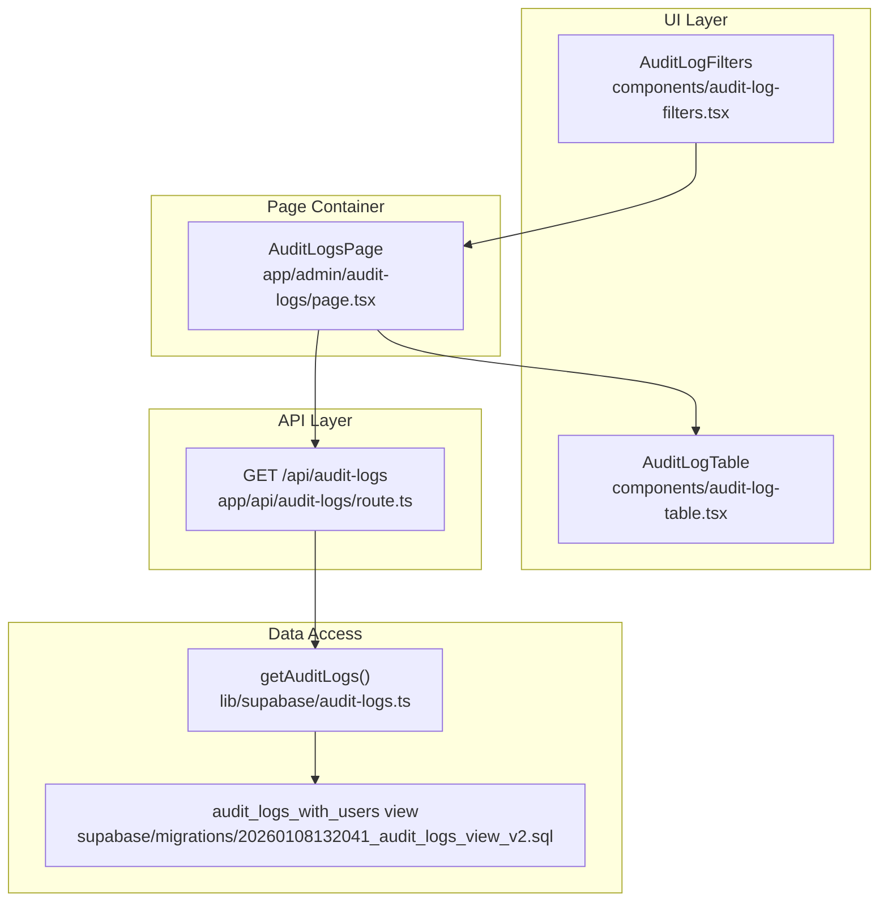
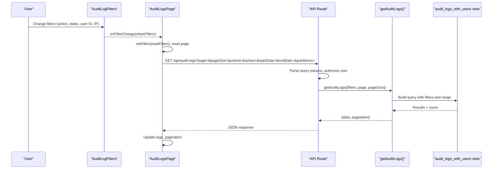
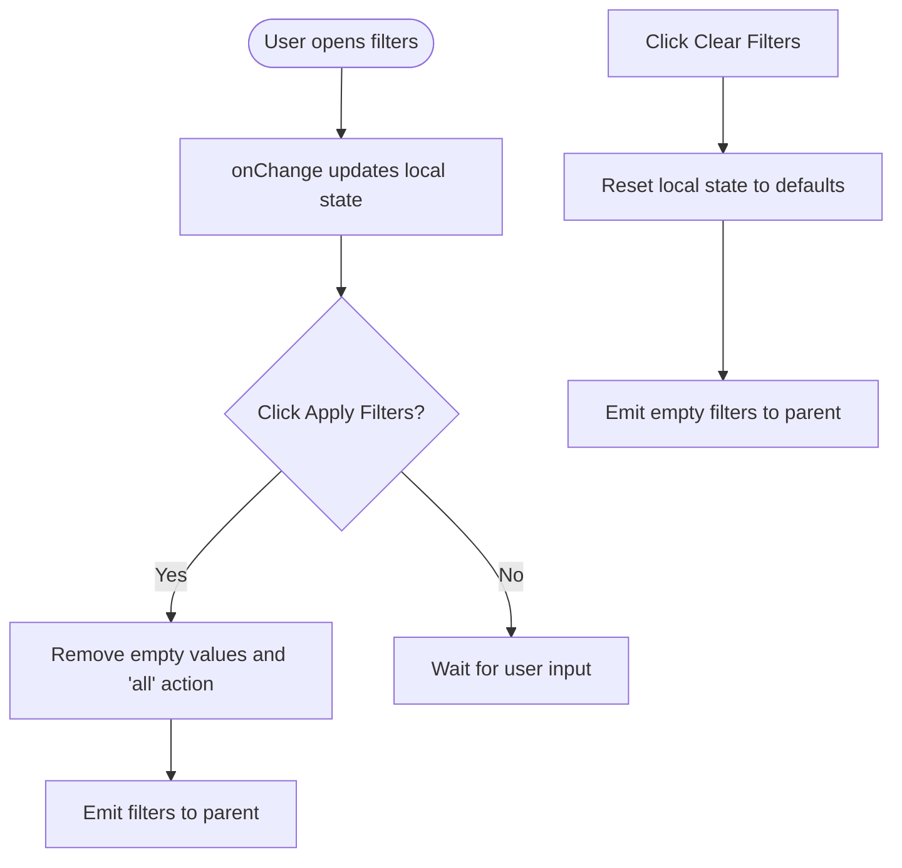
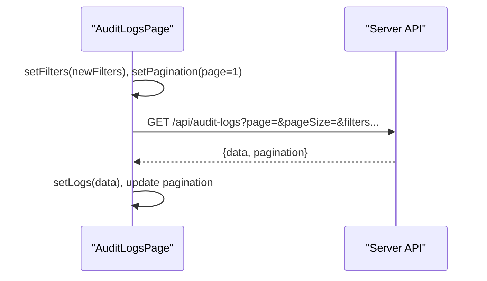
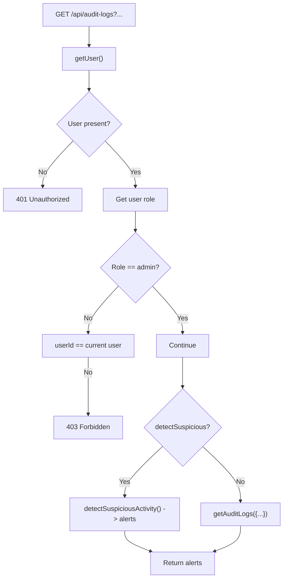
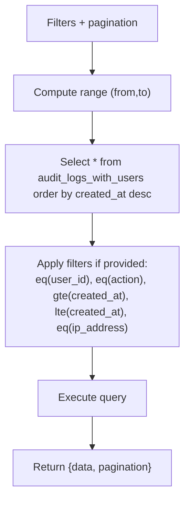
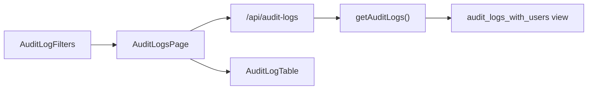

# Filtering and Search

<cite>
**Referenced Files in This Document**
- [audit-log-filters.tsx](file://components/audit-log-filters.tsx)
- [audit-logs-page.tsx](file://app/admin/audit-logs/page.tsx)
- [audit-logs-route.ts](file://app/api/audit-logs/route.ts)
- [audit-logs-lib.ts](file://lib/supabase/audit-logs.ts)
- [audit-logs-table.tsx](file://components/audit-log-table.tsx)
- [audit-logs-view-v2.sql](file://supabase/migrations/20260108132041_audit_logs_view_v2.sql)
- [audit-logs-indexes.sql](file://supabase/migrations/20260108_audit_logs_indexes.sql)
</cite>

## Table of Contents
1. [Introduction](#introduction)
2. [Project Structure](#project-structure)
3. [Core Components](#core-components)
4. [Architecture Overview](#architecture-overview)
5. [Detailed Component Analysis](#detailed-component-analysis)
6. [Dependency Analysis](#dependency-analysis)
7. [Performance Considerations](#performance-considerations)
8. [Troubleshooting Guide](#troubleshooting-guide)
9. [Conclusion](#conclusion)

## Introduction
This document explains the Audit Log Filtering system used to search and narrow down authentication and security events. It covers the AuditLogFilters component’s form controls, state management, and how filters are applied and cleared. It also documents how filter parameters are passed to the API endpoint and transformed into query parameters, along with practical use cases, validation and edge cases, and guidance for performance and accuracy.

## Project Structure
The filtering system spans three layers:
- UI component: AuditLogFilters renders the filter form and emits changes to the parent page.
- Page container: AuditLogsPage manages state, triggers fetches, and passes filters to the API.
- Backend API: The /api/audit-logs route parses query parameters, enforces authorization, and delegates to the Supabase utility.

**Diagram sources**
- [audit-log-filters.tsx](file://components/audit-log-filters.tsx#L1-L154)
- [audit-logs-page.tsx](file://app/admin/audit-logs/page.tsx#L1-L336)
- [audit-logs-route.ts](file://app/api/audit-logs/route.ts#L1-L65)
- [audit-logs-lib.ts](file://lib/supabase/audit-logs.ts#L1-L321)
- [audit-logs-view-v2.sql](file://supabase/migrations/20260108132041_audit_logs_view_v2.sql#L1-L20)

**Section sources**
- [audit-log-filters.tsx](file://components/audit-log-filters.tsx#L1-L154)
- [audit-logs-page.tsx](file://app/admin/audit-logs/page.tsx#L1-L336)
- [audit-logs-route.ts](file://app/api/audit-logs/route.ts#L1-L65)
- [audit-logs-lib.ts](file://lib/supabase/audit-logs.ts#L1-L321)
- [audit-logs-view-v2.sql](file://supabase/migrations/20260108132041_audit_logs_view_v2.sql#L1-L20)

## Core Components
- AuditLogFilters: Provides form controls for Action Type, Start Date, End Date, User ID, and IP Address. It maintains local state and applies/clears filters.
- AuditLogsPage: Holds the global filters state, fetches logs and stats, and passes filters to the API.
- API route: Parses query parameters, enforces authorization, and returns filtered logs or suspicious activity alerts.
- Supabase utility: Applies filters to the audit_logs_with_users view and returns paginated results.

**Section sources**
- [audit-log-filters.tsx](file://components/audit-log-filters.tsx#L1-L154)
- [audit-logs-page.tsx](file://app/admin/audit-logs/page.tsx#L1-L336)
- [audit-logs-route.ts](file://app/api/audit-logs/route.ts#L1-L65)
- [audit-logs-lib.ts](file://lib/supabase/audit-logs.ts#L1-L321)

## Architecture Overview
The filtering pipeline:
1. User interacts with AuditLogFilters to set filter values.
2. AuditLogsPage receives filter updates and resets pagination.
3. AuditLogsPage constructs query parameters and calls /api/audit-logs.
4. The API route validates user and role, parses query parameters, and calls getAuditLogs.
5. getAuditLogs builds a query against the audit_logs_with_users view and returns paginated results.

**Diagram sources**
- [audit-log-filters.tsx](file://components/audit-log-filters.tsx#L1-L154)
- [audit-logs-page.tsx](file://app/admin/audit-logs/page.tsx#L1-L336)
- [audit-logs-route.ts](file://app/api/audit-logs/route.ts#L1-L65)
- [audit-logs-lib.ts](file://lib/supabase/audit-logs.ts#L1-L321)
- [audit-logs-view-v2.sql](file://supabase/migrations/20260108132041_audit_logs_view_v2.sql#L1-L20)

## Detailed Component Analysis

### AuditLogFilters Component
- Form controls:
  - Action Type: Dropdown with predefined action values including login, logout, user modifications, and token refresh/revoke.
  - Start Date and End Date: Date pickers for time-range filtering.
  - User ID: Text input for filtering by user identifier.
  - IP Address: Text input for filtering by IP address.
- State management:
  - Local state tracks all filter fields.
  - Applying filters computes a clean object by removing empty values and excluding the default “All Actions” selection.
  - Clearing filters resets all fields and emits an empty filter set.
- Event handling:
  - onChange updates the local state.
  - Apply Filters emits the computed filters to the parent.
  - Clear Filters resets state and emits an empty filter set.

**Diagram sources**
- [audit-log-filters.tsx](file://components/audit-log-filters.tsx#L1-L154)

**Section sources**
- [audit-log-filters.tsx](file://components/audit-log-filters.tsx#L1-L154)

### AuditLogsPage (State and Fetching)
- State:
  - logs, stats, alerts, loading, exporting, selectedLog, pagination, filters.
- Fetching:
  - fetchLogs constructs URLSearchParams from pagination.page, pagination.pageSize, and filters, then calls /api/audit-logs.
  - fetchStats and checkSuspiciousActivity call dedicated endpoints.
- Filter propagation:
  - handleFilterChange updates filters and resets to page 1 to ensure fresh results.
  - handleExport reuses current filters to download CSV.

**Diagram sources**
- [audit-logs-page.tsx](file://app/admin/audit-logs/page.tsx#L1-L336)

**Section sources**
- [audit-logs-page.tsx](file://app/admin/audit-logs/page.tsx#L1-L336)

### API Route (Parameter Parsing and Authorization)
- Parses query parameters: userId, action, startDate, endDate, ipAddress, page, pageSize, detectSuspicious.
- Enforces authorization:
  - Requires a logged-in user.
  - Restricts access so non-admins can only view their own logs.
- Suspicious activity detection:
  - When detectSuspicious=true, returns alerts grouped by user.
- Delegates to getAuditLogs with parsed parameters.

**Diagram sources**
- [audit-logs-route.ts](file://app/api/audit-logs/route.ts#L1-L65)

**Section sources**
- [audit-logs-route.ts](file://app/api/audit-logs/route.ts#L1-L65)

### Supabase Utility (Query Building and Pagination)
- getAuditLogs:
  - Accepts userId, action, startDate, endDate, ipAddress, page, pageSize.
  - Computes range from page and pageSize.
  - Builds a query against the audit_logs_with_users view, applying filters where provided.
  - Returns data and pagination metadata.

**Diagram sources**
- [audit-logs-lib.ts](file://lib/supabase/audit-logs.ts#L1-L321)
- [audit-logs-view-v2.sql](file://supabase/migrations/20260108132041_audit_logs_view_v2.sql#L1-L20)

**Section sources**
- [audit-logs-lib.ts](file://lib/supabase/audit-logs.ts#L1-L321)
- [audit-logs-view-v2.sql](file://supabase/migrations/20260108132041_audit_logs_view_v2.sql#L1-L20)

### AuditLogTable (Display)
- Renders a table of logs with columns for date/time, user, role, action, and IP address.
- Uses action display names and severity badges for quick assessment.

**Section sources**
- [audit-logs-table.tsx](file://components/audit-log-table.tsx#L1-L84)

## Dependency Analysis
- AuditLogFilters depends on UI primitives (Button, Input, Select, Card) and emits a typed filter object.
- AuditLogsPage composes AuditLogFilters and AuditLogTable, and orchestrates data fetching.
- API route depends on Supabase client and the getAuditLogs utility.
- getAuditLogs depends on the audit_logs_with_users view for joined user data.

**Diagram sources**
- [audit-log-filters.tsx](file://components/audit-log-filters.tsx#L1-L154)
- [audit-logs-page.tsx](file://app/admin/audit-logs/page.tsx#L1-L336)
- [audit-logs-route.ts](file://app/api/audit-logs/route.ts#L1-L65)
- [audit-logs-lib.ts](file://lib/supabase/audit-logs.ts#L1-L321)
- [audit-logs-view-v2.sql](file://supabase/migrations/20260108132041_audit_logs_view_v2.sql#L1-L20)

**Section sources**
- [audit-log-filters.tsx](file://components/audit-log-filters.tsx#L1-L154)
- [audit-logs-page.tsx](file://app/admin/audit-logs/page.tsx#L1-L336)
- [audit-logs-route.ts](file://app/api/audit-logs/route.ts#L1-L65)
- [audit-logs-lib.ts](file://lib/supabase/audit-logs.ts#L1-L321)
- [audit-logs-view-v2.sql](file://supabase/migrations/20260108132041_audit_logs_view_v2.sql#L1-L20)

## Performance Considerations
- Indexing: The repository includes a migration that creates a view for efficient querying. While direct indexes on auth.audit_log_entries are not permitted, the view enables filtered queries with user data.
- Pagination: The API and utility compute exact counts and ranges, preventing unnecessary scans.
- Filtering: Filters are applied server-side; the UI component only sends non-empty values, reducing query overhead.
- Recommendations:
  - Prefer narrowing by date range first to reduce dataset size.
  - Use action filters to limit noisy events (e.g., login/logout).
  - Limit pageSize for frequent queries to keep network traffic low.
  - Avoid exporting large datasets frequently; use filters to scope exports.

**Section sources**
- [audit-logs-indexes.sql](file://supabase/migrations/20260108_audit_logs_indexes.sql#L1-L26)
- [audit-logs-lib.ts](file://lib/supabase/audit-logs.ts#L1-L321)
- [audit-logs-route.ts](file://app/api/audit-logs/route.ts#L1-L65)

## Troubleshooting Guide
- No results:
  - Verify filters are not overly restrictive (e.g., a future end date or wrong user ID).
  - Confirm the database migration has been applied; the page displays a setup notice when logs are empty.
- Unauthorized or forbidden:
  - Non-admin users cannot request logs for other users; ensure userId matches the current user.
- API errors:
  - The API returns 500 on internal errors; check server logs for details.
- Empty export:
  - Export uses current filters; ensure filters are set before exporting.

Common scenarios and guidance:
- Investigating failed login attempts:
  - Filter by action “login” and a recent date range. Review the table for repeated failures and IP addresses.
- Tracking specific user activities:
  - Filter by User ID and a date range. Combine with action filters (e.g., “user_modified”, “user_updated_password”).
- Identifying suspicious activity:
  - Use the built-in suspicious activity check to surface multiple failed attempts or sensitive changes within a short timeframe.

**Section sources**
- [audit-logs-page.tsx](file://app/admin/audit-logs/page.tsx#L1-L336)
- [audit-logs-route.ts](file://app/api/audit-logs/route.ts#L1-L65)
- [audit-logs-lib.ts](file://lib/supabase/audit-logs.ts#L1-L321)

## Conclusion
The Audit Log Filtering system provides a robust, secure, and efficient way to search authentication and security events. The UI component cleanly separates concerns, the page container manages state and pagination, and the backend enforces authorization and performs precise filtering against a view that joins audit entries with user data. By combining action, date, user, and IP filters, administrators can investigate incidents quickly and accurately while maintaining performance and security.