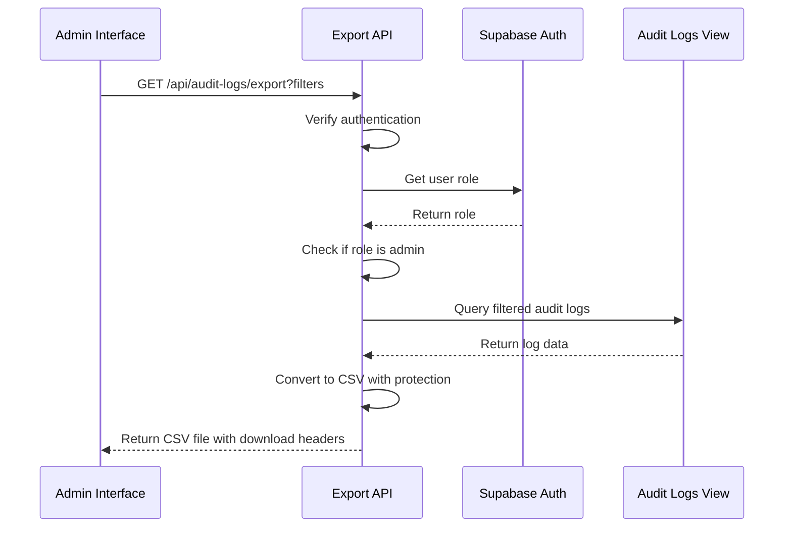
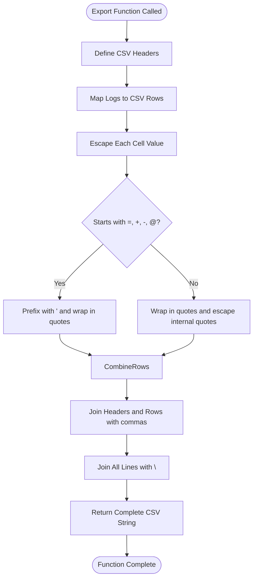
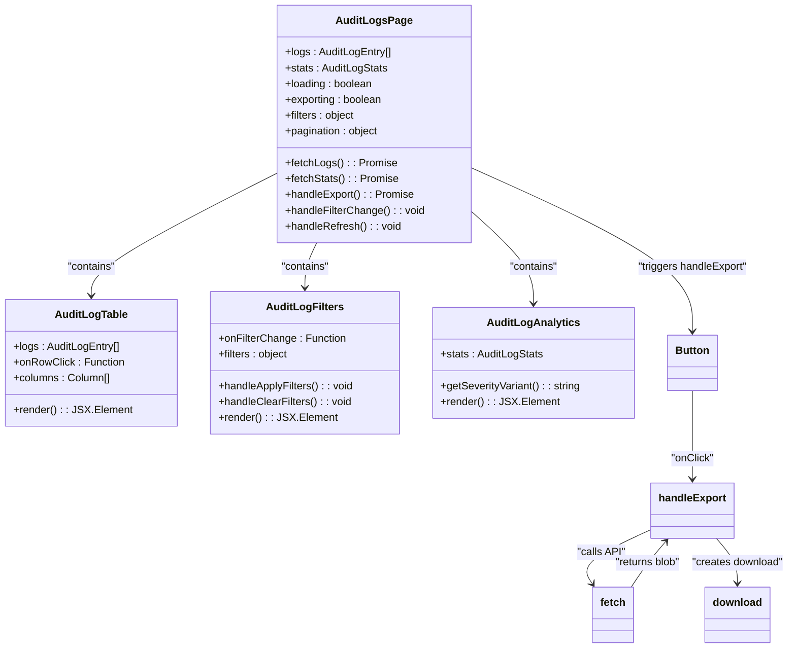
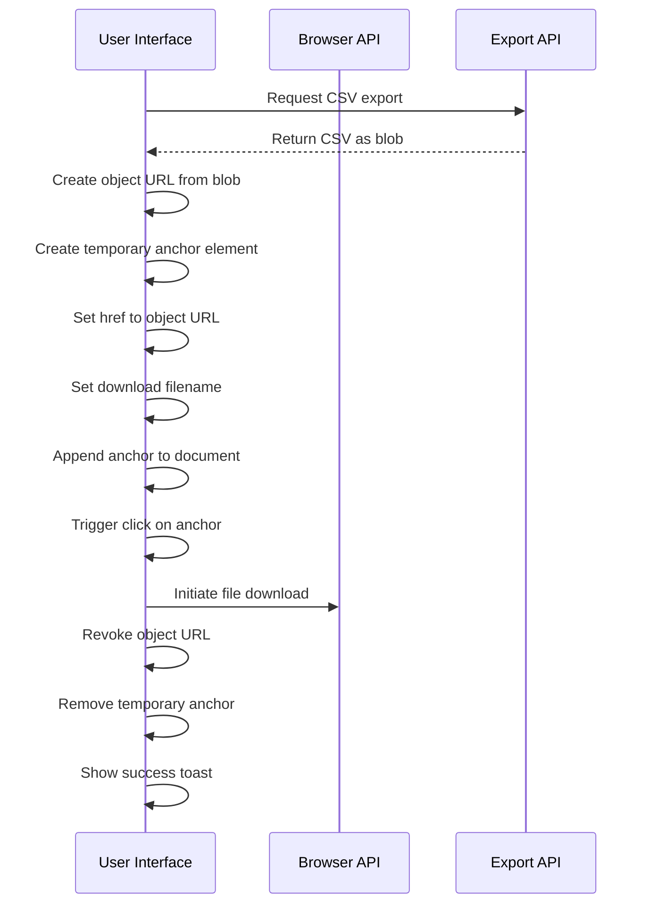
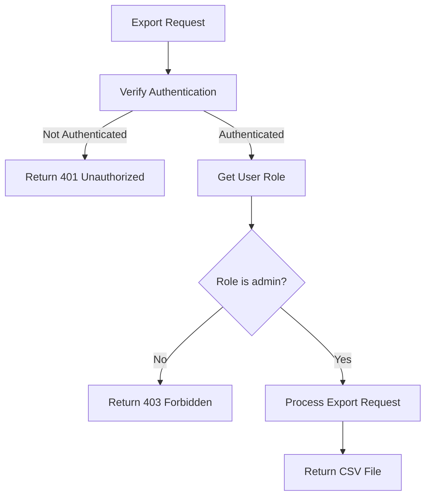

# Log Export and Data Handling

<cite>
**Referenced Files in This Document**   
- [route.ts](file://app/api/audit-logs/export/route.ts)
- [page.tsx](file://app/admin/audit-logs/page.tsx)
- [audit-logs.ts](file://lib/supabase/audit-logs.ts)
- [audit-log-table.tsx](file://components/audit-log-table.tsx)
- [audit-log-filters.tsx](file://components/audit-log-filters.tsx)
- [audit-log-analytics.tsx](file://components/audit-log-analytics.tsx)
- [user-audit-history.tsx](file://components/user-audit-history.tsx)
- [audit_logs_view_v2.sql](file://supabase/migrations/20260108132041_audit_logs_view_v2.sql)
- [audit_logs_indexes.sql](file://supabase/migrations/20260108_audit_logs_indexes.sql)
- [audit-monitor.ts](file://lib/audit-monitor.ts)
- [security.ts](file://lib/security.ts)
</cite>

## Table of Contents
1. [Introduction](#introduction)
2. [Core Components](#core-components)
3. [Backend Implementation](#backend-implementation)
4. [Frontend Export Logic](#frontend-export-logic)
5. [Security Considerations](#security-considerations)
6. [Usage Scenarios](#usage-scenarios)
7. [Troubleshooting Guide](#troubleshooting-guide)

## Introduction
The Audit Log Export functionality enables administrators to export authentication and security event logs in CSV format for compliance reporting and external analysis. This feature provides a secure way to extract audit trail data while protecting against malicious payloads and unauthorized access. The implementation spans backend API endpoints, frontend user interface components, and database-level configurations to ensure comprehensive logging and secure data handling.

## Core Components
The audit log export system consists of several interconnected components that work together to provide a complete solution for exporting and analyzing security events. These components include the export API endpoint, CSV formatting utilities, frontend export interface, and supporting database views and indexes.

**Section sources**
- [route.ts](file://app/api/audit-logs/export/route.ts)
- [page.tsx](file://app/admin/audit-logs/page.tsx)
- [audit-logs.ts](file://lib/supabase/audit-logs.ts)

## Backend Implementation

### Export API Endpoint
The `/api/audit-logs/export` endpoint handles CSV file generation and delivery. This API route implements role-based access control, ensuring only administrators can export logs. The endpoint accepts query parameters for filtering logs by user ID, action type, date range, and IP address, allowing targeted exports for specific investigations or reporting requirements.



**Diagram sources**
- [route.ts](file://app/api/audit-logs/export/route.ts)
- [audit_logs_view_v2.sql](file://supabase/migrations/20260108132041_audit_logs_view_v2.sql)

**Section sources**
- [route.ts](file://app/api/audit-logs/export/route.ts)

### CSV Export Utility
The `exportAuditLogsToCSV` utility function handles CSV formatting and formula injection protection. This function converts audit log entries into properly formatted CSV content while implementing security measures to prevent malicious payloads. The CSV includes essential fields such as date, user information, action type, and IP address.



**Diagram sources**
- [audit-logs.ts](file://lib/supabase/audit-logs.ts#L228-L261)

**Section sources**
- [audit-logs.ts](file://lib/supabase/audit-logs.ts#L228-L261)

## Frontend Export Logic

### Export Button and State Management
The frontend interface provides an "Export CSV" button within the audit logs administration page. This button triggers the export process and manages loading states to provide user feedback during the export operation. The button is disabled during the export process to prevent multiple simultaneous requests.



**Diagram sources**
- [page.tsx](file://app/admin/audit-logs/page.tsx)
- [audit-log-table.tsx](file://components/audit-log-table.tsx)
- [audit-log-filters.tsx](file://components/audit-log-filters.tsx)
- [audit-log-analytics.tsx](file://components/audit-log-analytics.tsx)

**Section sources**
- [page.tsx](file://app/admin/audit-logs/page.tsx#L24-L240)

### Blob Handling and Download Process
The frontend implements a secure process for handling the CSV blob response and initiating file downloads. When the export API returns a blob, the frontend creates an object URL, constructs a temporary anchor element, and programmatically triggers the download. This approach ensures the CSV file is delivered directly to the user's device without intermediate storage.



**Diagram sources**
- [page.tsx](file://app/admin/audit-logs/page.tsx#L116-L138)

**Section sources**
- [page.tsx](file://app/admin/audit-logs/page.tsx#L116-L138)

## Security Considerations

### Formula Injection Protection
The system implements robust protection against CSV formula injection attacks. The `escapeCSVCell` function detects cell values that begin with dangerous characters (=, +, -, @, tab, or carriage return) and applies appropriate escaping. Values starting with these characters are prefixed with a single quote and wrapped in quotes, preventing them from being interpreted as formulas by spreadsheet applications.

```mermaid
flowchart TD
Input[Cell Value] --> CheckPrefix{"Starts with =, +, -, @, \\t, \\r?"}
CheckPrefix --> |Yes| EscapeFormula["Return '\"' + value with escaped quotes"]
CheckPrefix --> |No| EscapeNormal["Return '\" + value with escaped quotes + '\""]
EscapeFormula --> Output
EscapeNormal --> Output
Output([Escaped Cell])
```

**Diagram sources**
- [audit-logs.ts](file://lib/supabase/audit-logs.ts#L232-L239)

**Section sources**
- [audit-logs.ts](file://lib/supabase/audit-logs.ts#L228-L239)

### Access Control and Authentication
The export functionality enforces strict access controls at multiple levels. The API endpoint verifies user authentication and confirms the user has administrator privileges before processing any export request. This role-based access control prevents unauthorized users from accessing sensitive audit log data.



**Diagram sources**
- [route.ts](file://app/api/audit-logs/export/route.ts#L9-L26)

**Section sources**
- [route.ts](file://app/api/audit-logs/export/route.ts#L9-L26)

### Data Privacy and IP Address Handling
The system implements privacy-preserving measures for IP addresses through hashing. The `hashIpAddress` function uses SHA-256 with a salt to protect user privacy while still allowing abuse detection through hash comparison. This approach balances security monitoring needs with privacy requirements.

**Section sources**
- [security.ts](file://lib/security.ts#L11-L14)

## Usage Scenarios

### Compliance Reporting
Exported audit logs can be used for regulatory compliance reporting, providing a complete record of authentication events and security activities. Administrators can filter logs by date range and action type to generate reports for specific compliance periods or audit requirements.

### External Analysis
The CSV format enables integration with external analysis tools and security information and event management (SIEM) systems. Security teams can import the exported logs into specialized analytics platforms for advanced threat detection, pattern recognition, and long-term trend analysis.

### Incident Investigation
During security incidents, administrators can export targeted log sets for forensic analysis. By filtering logs by user ID, IP address, or specific action types, investigators can quickly gather relevant evidence to understand the scope and timeline of potential security breaches.

## Troubleshooting Guide

### Export Failures
If the export function fails, check the following:
- Verify you have administrator privileges
- Ensure the database migration has been applied (run `supabase db push`)
- Check browser console for JavaScript errors
- Verify network connectivity to the API endpoint
- Confirm sufficient system resources for large exports

### Corrupted Files
If exported CSV files appear corrupted:
- Check for special characters in log data that might interfere with CSV parsing
- Verify the file encoding is UTF-8
- Ensure spreadsheet applications are configured to handle CSV files correctly
- Try opening the file in a text editor to verify content integrity

### Empty Exports
If the exported file contains no data:
- Verify filter criteria are not too restrictive
- Check that audit logs exist in the database
- Confirm the `audit_logs_with_users` view is properly configured
- Validate that the Supabase Auth audit logging is enabled

**Section sources**
- [page.tsx](file://app/admin/audit-logs/page.tsx#L161-L176)
- [route.ts](file://app/api/audit-logs/export/route.ts#L54-L57)