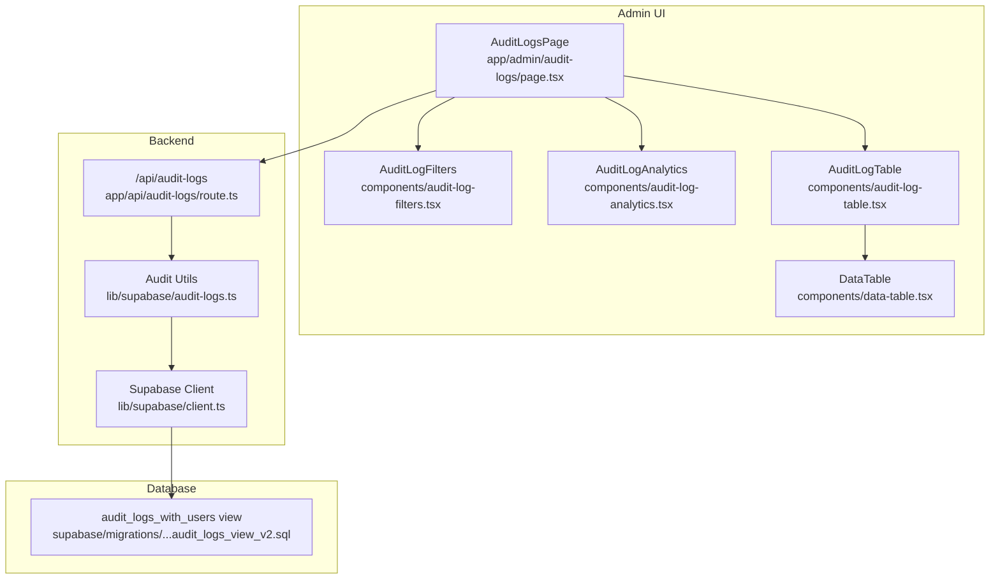
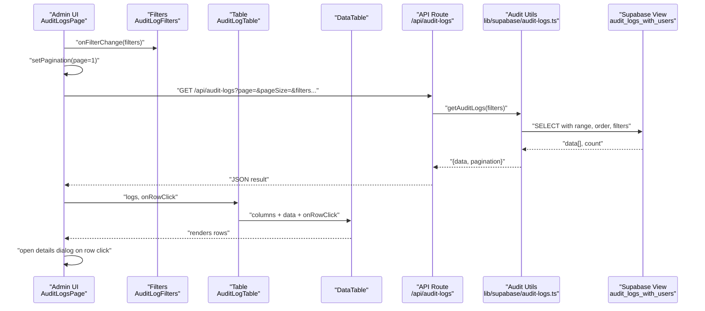
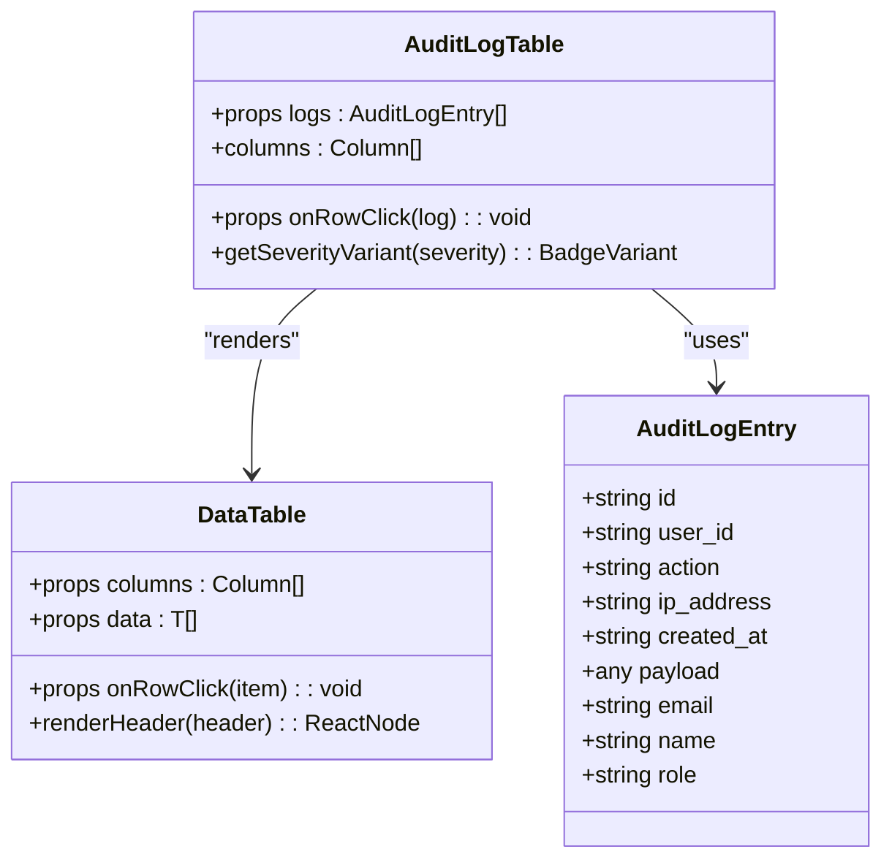
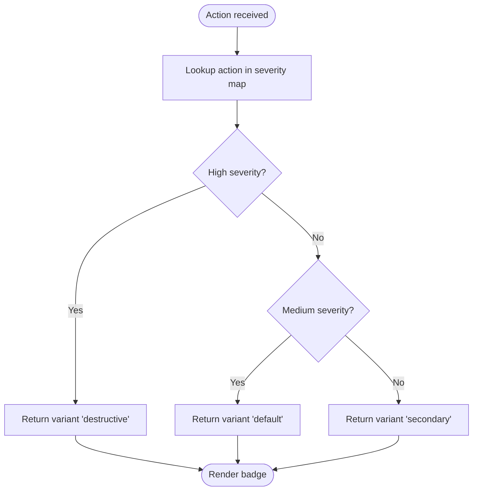
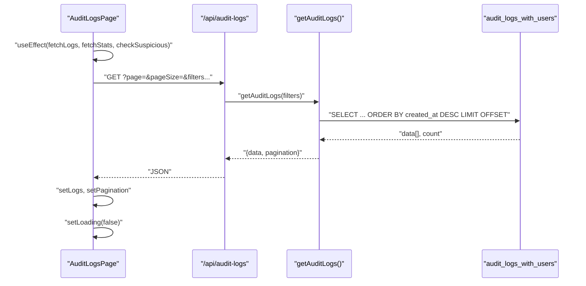
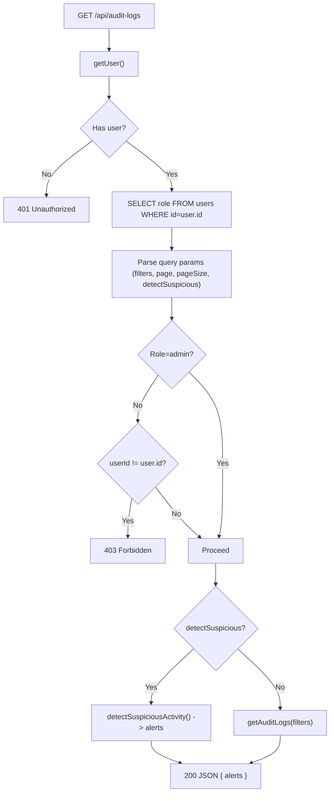
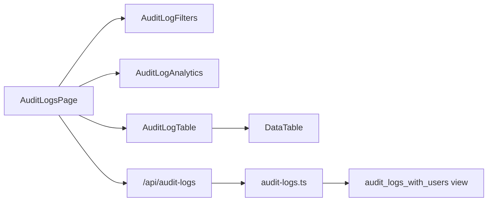

# Log Viewing and Management

<cite>
**Referenced Files in This Document**
- [app/admin/audit-logs/page.tsx](file://app/admin/audit-logs/page.tsx)
- [components/audit-log-table.tsx](file://components/audit-log-table.tsx)
- [components/data-table.tsx](file://components/data-table.tsx)
- [components/audit-log-filters.tsx](file://components/audit-log-filters.tsx)
- [components/audit-log-analytics.tsx](file://components/audit-log-analytics.tsx)
- [lib/supabase/audit-logs.ts](file://lib/supabase/audit-logs.ts)
- [app/api/audit-logs/route.ts](file://app/api/audit-logs/route.ts)
- [supabase/migrations/20260108132041_audit_logs_view_v2.sql](file://supabase/migrations/20260108132041_audit_logs_view_v2.sql)
- [supabase/migrations/20260108_audit_logs_indexes.sql](file://supabase/migrations/20260108_audit_logs_indexes.sql)
</cite>

## Table of Contents
1. [Introduction](#introduction)
2. [Project Structure](#project-structure)
3. [Core Components](#core-components)
4. [Architecture Overview](#architecture-overview)
5. [Detailed Component Analysis](#detailed-component-analysis)
6. [Dependency Analysis](#dependency-analysis)
7. [Performance Considerations](#performance-considerations)
8. [Troubleshooting Guide](#troubleshooting-guide)
9. [Conclusion](#conclusion)

## Introduction
This document explains the Audit Log Viewing interface in the Admin Dashboard. It covers the audit log table component, column rendering for date, user, role, action, and IP address, the usage of the generic DataTable component with custom renderers and row click handlers, and the frontend state management for pagination, loading states, and fetching data from the backend API. It also describes how log entries are formatted and displayed, including severity-based badge coloring, and provides guidance on performance and troubleshooting for large datasets.

## Project Structure
The audit log feature spans the Admin page, reusable UI components, a generic data table, Supabase utilities, and a server-side API route. The database schema is exposed via a view that joins audit log entries with user information.

**Diagram sources**
- [app/admin/audit-logs/page.tsx](file://app/admin/audit-logs/page.tsx#L1-L336)
- [components/audit-log-filters.tsx](file://components/audit-log-filters.tsx#L1-L154)
- [components/audit-log-analytics.tsx](file://components/audit-log-analytics.tsx#L1-L78)
- [components/audit-log-table.tsx](file://components/audit-log-table.tsx#L1-L84)
- [components/data-table.tsx](file://components/data-table.tsx#L1-L60)
- [app/api/audit-logs/route.ts](file://app/api/audit-logs/route.ts#L1-L65)
- [lib/supabase/audit-logs.ts](file://lib/supabase/audit-logs.ts#L1-L321)
- [supabase/migrations/20260108132041_audit_logs_view_v2.sql](file://supabase/migrations/20260108132041_audit_logs_view_v2.sql#L1-L21)

**Section sources**
- [app/admin/audit-logs/page.tsx](file://app/admin/audit-logs/page.tsx#L1-L336)
- [components/audit-log-table.tsx](file://components/audit-log-table.tsx#L1-L84)
- [components/data-table.tsx](file://components/data-table.tsx#L1-L60)
- [components/audit-log-filters.tsx](file://components/audit-log-filters.tsx#L1-L154)
- [components/audit-log-analytics.tsx](file://components/audit-log-analytics.tsx#L1-L78)
- [lib/supabase/audit-logs.ts](file://lib/supabase/audit-logs.ts#L1-L321)
- [app/api/audit-logs/route.ts](file://app/api/audit-logs/route.ts#L1-L65)
- [supabase/migrations/20260108132041_audit_logs_view_v2.sql](file://supabase/migrations/20260108132041_audit_logs_view_v2.sql#L1-L21)

## Core Components
- AuditLogsPage: Orchestrates state (logs, stats, alerts, pagination, filters), loads data, renders analytics, filters, table, and pagination controls, and opens a modal for log details.
- AuditLogTable: Renders a table with custom columns for date/time, user, role, action, and IP address, and applies severity-based badges for actions.
- DataTable: Generic table renderer that accepts columns with keys, headers, and optional renderers, plus an optional row click handler.
- AuditLogFilters: Provides filter controls for action type, date range, user ID, and IP address, and emits clean filters to the parent.
- AuditLogAnalytics: Displays summary metrics derived from audit log statistics.
- Supabase Audit Utilities: Provides typed models, pagination calculation, statistics aggregation, suspicious activity detection, CSV export helpers, and action display/severity helpers.
- API Route: Validates user, enforces role-based access, parses filters/pagination, and returns either paginated logs or suspicious activity alerts.

**Section sources**
- [app/admin/audit-logs/page.tsx](file://app/admin/audit-logs/page.tsx#L1-L336)
- [components/audit-log-table.tsx](file://components/audit-log-table.tsx#L1-L84)
- [components/data-table.tsx](file://components/data-table.tsx#L1-L60)
- [components/audit-log-filters.tsx](file://components/audit-log-filters.tsx#L1-L154)
- [components/audit-log-analytics.tsx](file://components/audit-log-analytics.tsx#L1-L78)
- [lib/supabase/audit-logs.ts](file://lib/supabase/audit-logs.ts#L1-L321)
- [app/api/audit-logs/route.ts](file://app/api/audit-logs/route.ts#L1-L65)

## Architecture Overview
The Admin Audit Logs page composes several components and integrates with the backend API and Supabase. The API route validates the caller’s identity and role, applies filters and pagination, and returns structured results. The frontend consumes the API, manages pagination and filters, and renders the table with custom cells and severity badges.

**Diagram sources**
- [app/admin/audit-logs/page.tsx](file://app/admin/audit-logs/page.tsx#L1-L336)
- [components/audit-log-filters.tsx](file://components/audit-log-filters.tsx#L1-L154)
- [components/audit-log-table.tsx](file://components/audit-log-table.tsx#L1-L84)
- [components/data-table.tsx](file://components/data-table.tsx#L1-L60)
- [app/api/audit-logs/route.ts](file://app/api/audit-logs/route.ts#L1-L65)
- [lib/supabase/audit-logs.ts](file://lib/supabase/audit-logs.ts#L1-L321)
- [supabase/migrations/20260108132041_audit_logs_view_v2.sql](file://supabase/migrations/20260108132041_audit_logs_view_v2.sql#L1-L21)

## Detailed Component Analysis

### Audit Log Table Component
The AuditLogTable component defines columns for:
- Date & Time: Renders date and time separately for readability.
- User: Displays user name and email.
- Role: Shows role as a lowercase badge.
- Action: Displays action name and severity-based badge color.
- IP Address: Shows IP address monospaced, with “N/A” fallback.

It delegates rendering to the generic DataTable and passes an optional row click handler.

**Diagram sources**
- [components/audit-log-table.tsx](file://components/audit-log-table.tsx#L1-L84)
- [components/data-table.tsx](file://components/data-table.tsx#L1-L60)
- [lib/supabase/audit-logs.ts](file://lib/supabase/audit-logs.ts#L1-L321)

**Section sources**
- [components/audit-log-table.tsx](file://components/audit-log-table.tsx#L1-L84)
- [components/data-table.tsx](file://components/data-table.tsx#L1-L60)
- [lib/supabase/audit-logs.ts](file://lib/supabase/audit-logs.ts#L1-L321)

### Severity-Based Badge Coloring
Action severity is determined by categorizing known actions into low, medium, or high. The AuditLogTable maps severity to badge variants to visually distinguish risk levels.

**Diagram sources**
- [components/audit-log-table.tsx](file://components/audit-log-table.tsx#L1-L84)
- [lib/supabase/audit-logs.ts](file://lib/supabase/audit-logs.ts#L297-L321)

**Section sources**
- [components/audit-log-table.tsx](file://components/audit-log-table.tsx#L1-L84)
- [lib/supabase/audit-logs.ts](file://lib/supabase/audit-logs.ts#L297-L321)

### Frontend State Management and Pagination
The AuditLogsPage manages:
- logs: Array of audit log entries.
- stats: Aggregated metrics for the dashboard.
- alerts: Suspicious activity notifications.
- loading/exporting: UI loading states.
- pagination: Current page, page size, total, and total pages.
- filters: Active filters passed to the API.

On mount and when filters or page change, it fetches:
- Logs from /api/audit-logs with query parameters for page, pageSize, and filters.
- Stats from /api/audit-logs/stats.
- Suspicious activity alerts via a special query param.

Pagination controls update the page state, resetting to page 1 when filters change.

**Diagram sources**
- [app/admin/audit-logs/page.tsx](file://app/admin/audit-logs/page.tsx#L1-L336)
- [app/api/audit-logs/route.ts](file://app/api/audit-logs/route.ts#L1-L65)
- [lib/supabase/audit-logs.ts](file://lib/supabase/audit-logs.ts#L1-L321)
- [supabase/migrations/20260108132041_audit_logs_view_v2.sql](file://supabase/migrations/20260108132041_audit_logs_view_v2.sql#L1-L21)

**Section sources**
- [app/admin/audit-logs/page.tsx](file://app/admin/audit-logs/page.tsx#L1-L336)
- [app/api/audit-logs/route.ts](file://app/api/audit-logs/route.ts#L1-L65)
- [lib/supabase/audit-logs.ts](file://lib/supabase/audit-logs.ts#L1-L321)

### API Endpoint and Authorization
The API route:
- Verifies the caller’s session and retrieves user role.
- Enforces access control: admins can view all logs; non-admins can only view their own logs.
- Parses query parameters for filters and pagination.
- Supports a special flag to return suspicious activity alerts.
- Delegates data retrieval to the Supabase utilities and returns paginated results.

**Diagram sources**
- [app/api/audit-logs/route.ts](file://app/api/audit-logs/route.ts#L1-L65)
- [lib/supabase/audit-logs.ts](file://lib/supabase/audit-logs.ts#L147-L226)

**Section sources**
- [app/api/audit-logs/route.ts](file://app/api/audit-logs/route.ts#L1-L65)
- [lib/supabase/audit-logs.ts](file://lib/supabase/audit-logs.ts#L147-L226)

### Log Entry Formatting and Display
- Date & Time: Rendered as separate date and time lines for clarity.
- User: Name and email shown with fallbacks.
- Role: Lowercase badge for consistent presentation.
- Action: Human-readable display name mapped from internal action codes; severity determines badge variant.
- IP Address: Monospaced display with “N/A” fallback.

The details dialog shows the selected log’s action, user, role, date/time, IP address, and any additional payload data.

**Section sources**
- [components/audit-log-table.tsx](file://components/audit-log-table.tsx#L1-L84)
- [lib/supabase/audit-logs.ts](file://lib/supabase/audit-logs.ts#L263-L321)
- [app/admin/audit-logs/page.tsx](file://app/admin/audit-logs/page.tsx#L280-L335)

## Dependency Analysis
- AuditLogsPage depends on:
  - AuditLogFilters for emitting filters.
  - AuditLogAnalytics for stats display.
  - AuditLogTable for rendering.
  - fetch calls to /api/audit-logs and /api/audit-logs/stats.
- AuditLogTable depends on:
  - DataTable for generic rendering.
  - getActionDisplayName and getActionSeverity for display and severity.
- API route depends on:
  - Supabase server client.
  - getAuditLogs and detectSuspiciousActivity from audit utilities.
- Audit utilities depend on:
  - Supabase client.
  - The audit_logs_with_users view for joined data.

**Diagram sources**
- [app/admin/audit-logs/page.tsx](file://app/admin/audit-logs/page.tsx#L1-L336)
- [components/audit-log-filters.tsx](file://components/audit-log-filters.tsx#L1-L154)
- [components/audit-log-analytics.tsx](file://components/audit-log-analytics.tsx#L1-L78)
- [components/audit-log-table.tsx](file://components/audit-log-table.tsx#L1-L84)
- [components/data-table.tsx](file://components/data-table.tsx#L1-L60)
- [app/api/audit-logs/route.ts](file://app/api/audit-logs/route.ts#L1-L65)
- [lib/supabase/audit-logs.ts](file://lib/supabase/audit-logs.ts#L1-L321)
- [supabase/migrations/20260108132041_audit_logs_view_v2.sql](file://supabase/migrations/20260108132041_audit_logs_view_v2.sql#L1-L21)

**Section sources**
- [app/admin/audit-logs/page.tsx](file://app/admin/audit-logs/page.tsx#L1-L336)
- [components/audit-log-table.tsx](file://components/audit-log-table.tsx#L1-L84)
- [components/data-table.tsx](file://components/data-table.tsx#L1-L60)
- [app/api/audit-logs/route.ts](file://app/api/audit-logs/route.ts#L1-L65)
- [lib/supabase/audit-logs.ts](file://lib/supabase/audit-logs.ts#L1-L321)
- [supabase/migrations/20260108132041_audit_logs_view_v2.sql](file://supabase/migrations/20260108132041_audit_logs_view_v2.sql#L1-L21)

## Performance Considerations
- Pagination strategy:
  - The API uses range-based pagination with explicit page and pageSize parameters.
  - The backend calculates total pages from the count and pageSize.
  - The frontend resets to page 1 when filters change to avoid stale results.
- API response handling:
  - The frontend expects a JSON object containing data and pagination metadata.
  - The API returns either paginated logs or suspicious activity alerts depending on query flags.
- Database schema:
  - The audit_logs_with_users view joins audit log entries with user information, enabling efficient filtering and sorting.
  - The original auth.audit_log_entries table is managed by Supabase; indexes are documented in the migration files.
- Recommendations:
  - Prefer filtering by indexed fields (e.g., created_at, user_id, action) to reduce scan cost.
  - Limit pageSize for large datasets; 50 is a reasonable default.
  - Use the date range filters to constrain the dataset.
  - Consider caching stats and alerts to reduce repeated requests.

**Section sources**
- [lib/supabase/audit-logs.ts](file://lib/supabase/audit-logs.ts#L1-L321)
- [app/api/audit-logs/route.ts](file://app/api/audit-logs/route.ts#L1-L65)
- [supabase/migrations/20260108132041_audit_logs_view_v2.sql](file://supabase/migrations/20260108132041_audit_logs_view_v2.sql#L1-L21)
- [supabase/migrations/20260108_audit_logs_indexes.sql](file://supabase/migrations/20260108_audit_logs_indexes.sql#L1-L26)

## Troubleshooting Guide
Common issues and resolutions:
- Missing logs or empty table:
  - Ensure the database migration for audit logs has been applied. The Admin page displays a notice guiding the migration steps.
  - Confirm that the audit_logs_with_users view exists and is accessible to authenticated users.
- Unauthorized or forbidden:
  - Non-admin users can only view their own logs. If filtering by another user ID, the API will return a forbidden response.
- Slow loading times:
  - Narrow the date range and apply filters to reduce the dataset.
  - Increase pageSize cautiously; larger pages increase payload size and rendering time.
  - Avoid requesting suspicious activity alerts frequently; use the refresh button intentionally.
- Export failures:
  - The export endpoint returns a CSV blob; ensure network connectivity and browser support for Blob downloads.
- Action display anomalies:
  - Unknown actions fall back to raw values; verify that action names match supported values.

**Section sources**
- [app/admin/audit-logs/page.tsx](file://app/admin/audit-logs/page.tsx#L160-L177)
- [app/api/audit-logs/route.ts](file://app/api/audit-logs/route.ts#L1-L65)
- [lib/supabase/audit-logs.ts](file://lib/supabase/audit-logs.ts#L263-L321)

## Conclusion
The Audit Log Viewing interface combines a flexible filtering system, a robust pagination strategy, and a severity-aware table to present authentication and security events effectively. The separation of concerns across the Admin page, reusable components, Supabase utilities, and the API route ensures maintainability and scalability. By applying the recommended performance practices and troubleshooting steps, administrators can efficiently monitor system activity even with large datasets.