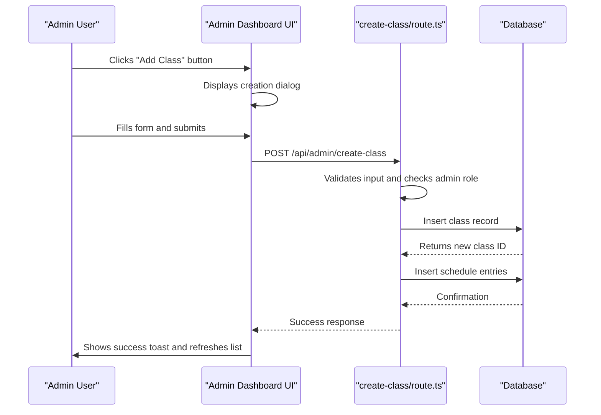
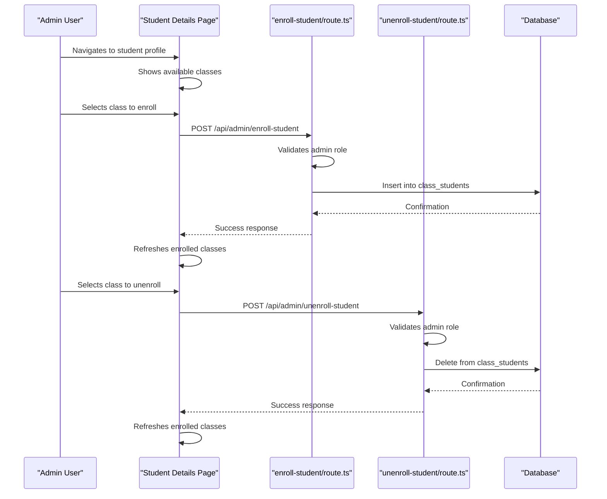
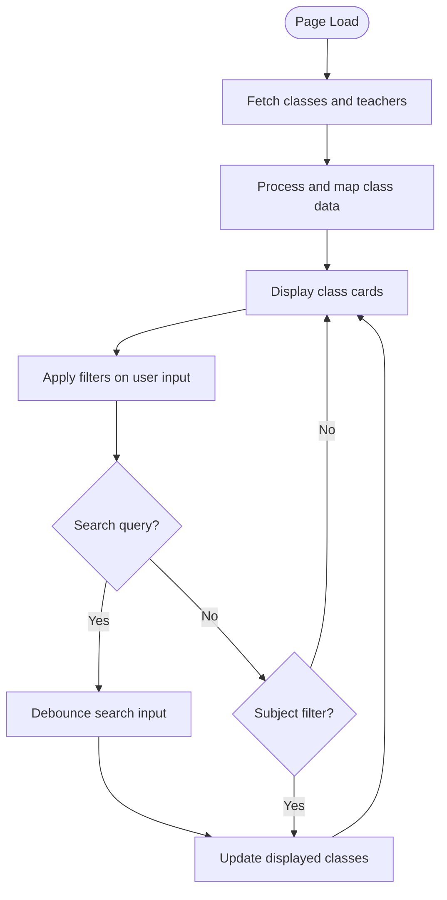
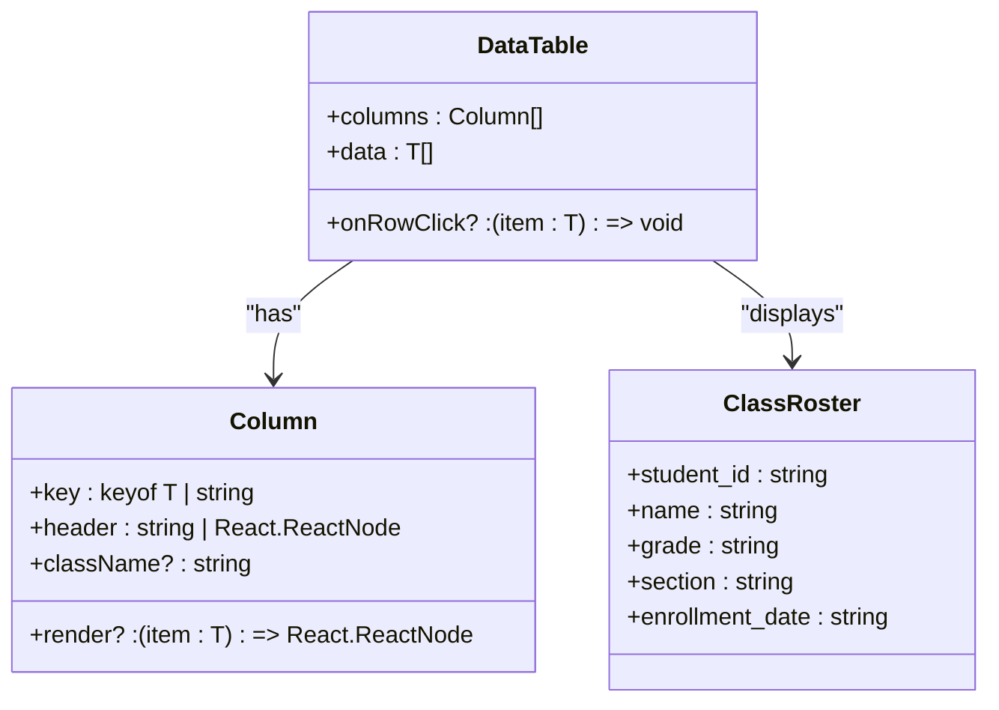
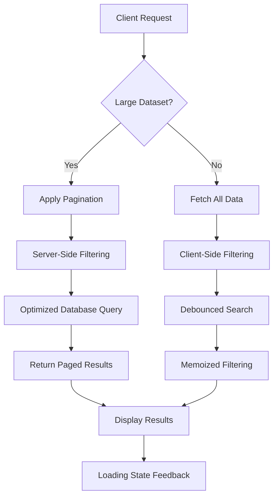

# Class Administration

<cite>
**Referenced Files in This Document**   
- [classes/page.tsx](file://app/admin/classes/page.tsx)
- [create-class/route.ts](file://app/api/admin/create-class/route.ts)
- [enroll-student/route.ts](file://app/api/admin/enroll-student/route.ts)
- [classes/route.ts](file://app/api/admin/classes/route.ts)
- [classes/[id]/route.ts](file://app/api/admin/classes/[id]/route.ts)
- [unenroll-student/route.ts](file://app/api/admin/unenroll-student/route.ts)
- [data-table.tsx](file://components/data-table.tsx)
- [20251219043440_create_classes_table.sql](file://supabase/migrations/20251219043440_create_classes_table.sql)
- [20251219043556_create_schedule_table.sql](file://supabase/migrations/20251219043556_create_schedule_table.sql)
- [types.ts](file://lib/supabase/types.ts)
</cite>

## Table of Contents
1. [Introduction](#introduction)
2. [Class Creation](#class-creation)
3. [Enrollment Management](#enrollment-management)
4. [Class Listing and Filtering](#class-listing-and-filtering)
5. [API Routes and Data Validation](#api-routes-and-data-validation)
6. [Integration with Data Table Component](#integration-with-data-table-component)
7. [Relationships with Other Systems](#relationships-with-other-systems)
8. [Common Issues and Troubleshooting](#common-issues-and-troubleshooting)
9. [Performance Considerations](#performance-considerations)

## Introduction
The Class Administration sub-feature within the Admin Dashboard enables administrators to manage academic classes, including creation, enrollment, and scheduling. This system integrates with user roles, academic calendars, and gradebook systems to provide a comprehensive class management solution. The implementation uses server components for secure data operations and client-side interactivity for a responsive user experience.

**Section sources**
- [classes/page.tsx](file://app/admin/classes/page.tsx#L1-L615)

## Class Creation
The class creation process allows administrators to define new classes with essential details such as name, grade level, section, subject, assigned teacher, room assignment, and schedule. The process is initiated through a dialog interface in the Admin Dashboard, where form validation ensures required fields are completed before submission.

When a new class is created, the system performs the following operations:
1. Validates required fields (name and subject)
2. Applies rate limiting to prevent abuse
3. Verifies admin role authorization
4. Creates the class record in the database
5. Generates corresponding schedule entries based on the selected days and time
6. Implements transaction handling to ensure data consistency

If schedule creation fails, the system automatically rolls back the class creation to maintain data integrity.



**Diagram sources**
- [classes/page.tsx](file://app/admin/classes/page.tsx#L192-L227)
- [create-class/route.ts](file://app/api/admin/create-class/route.ts#L28-L113)

**Section sources**
- [classes/page.tsx](file://app/admin/classes/page.tsx#L60-L438)
- [create-class/route.ts](file://app/api/admin/create-class/route.ts#L1-L113)

## Enrollment Management
Student enrollment and unenrollment are managed through dedicated API endpoints that handle the relationship between students and classes. The enrollment process ensures data integrity through foreign key constraints and unique indexes to prevent duplicate enrollments.

The enrollment workflow includes:
- Role-based access control (restricted to administrators)
- Input validation for required student and class IDs
- Secure API calls from the client interface
- Database operations with error handling

For unenrollment, the system accepts an enrollment ID to remove a specific student from a class, providing precise control over class rosters.



**Diagram sources**
- [enroll-student/route.ts](file://app/api/admin/enroll-student/route.ts#L4-L43)
- [unenroll-student/route.ts](file://app/api/admin/unenroll-student/route.ts#L4-L39)
- [students/[id]/page.tsx](file://app/admin/students/[id]/page.tsx#L195-L245)

**Section sources**
- [enroll-student/route.ts](file://app/api/admin/enroll-student/route.ts#L1-L43)
- [unenroll-student/route.ts](file://app/api/admin/unenroll-student/route.ts#L1-L39)

## Class Listing and Filtering
The class listing interface displays all classes in a card-based layout, with each card showing essential information including class name, teacher, student count, schedule, and room assignment. The interface supports client-side filtering through search and subject filtering, with debounced search input to optimize performance.

The listing process involves:
1. Fetching class data from the API endpoint
2. Retrieving teacher information for display
3. Applying client-side filtering based on search query and subject selection
4. Displaying results with loading states during data retrieval



**Diagram sources**
- [classes/page.tsx](file://app/admin/classes/page.tsx#L104-L152)
- [classes/page.tsx](file://app/admin/classes/page.tsx#L154-L173)

**Section sources**
- [classes/page.tsx](file://app/admin/classes/page.tsx#L61-L493)

## API Routes and Data Validation
The Class Administration feature utilizes several API routes to handle CRUD operations and enrollment management. Each route implements comprehensive validation and security measures:

- **GET /api/admin/classes**: Retrieves all classes with student counts and teacher information
- **POST /api/admin/create-class**: Creates a new class with schedule entries
- **PUT /api/admin/classes/[id]**: Updates existing class information
- **DELETE /api/admin/classes/[id]**: Deletes a class and related records
- **POST /api/admin/enroll-student**: Enrolls a student in a class
- **POST /api/admin/unenroll-student**: Removes a student from a class

All API routes include:
- Authentication verification
- Role-based authorization (admin only)
- Input validation
- Error handling with appropriate status codes
- Rate limiting to prevent abuse

```mermaid
classDiagram
class ClassAPI {
+GET /api/admin/classes
+POST /api/admin/create-class
+PUT /api/admin/classes/{id}
+DELETE /api/admin/classes/{id}
}
class EnrollmentAPI {
+POST /api/admin/enroll-student
+POST /api/admin/unenroll-student
}
class Security {
+Authentication
+Role Authorization
+Input Validation
+Rate Limiting
+Error Handling
}
ClassAPI --> Security : "uses"
EnrollmentAPI --> Security : "uses"
```

**Diagram sources**
- [classes/route.ts](file://app/api/admin/classes/route.ts#L7-L89)
- [create-class/route.ts](file://app/api/admin/create-class/route.ts#L28-L113)
- [classes/[id]/route.ts](file://app/api/admin/classes/[id]/route.ts#L4-L99)
- [enroll-student/route.ts](file://app/api/admin/enroll-student/route.ts#L4-L43)
- [unenroll-student/route.ts](file://app/api/admin/unenroll-student/route.ts#L4-L39)

**Section sources**
- [classes/route.ts](file://app/api/admin/classes/route.ts#L1-L89)
- [create-class/route.ts](file://app/api/admin/create-class/route.ts#L1-L113)
- [classes/[id]/route.ts](file://app/api/admin/classes/[id]/route.ts#L1-L99)

## Integration with Data Table Component
While the current implementation uses a card-based layout for class display, the system includes a reusable data-table component that could be integrated for roster management. The data-table component provides a flexible way to display tabular data with support for custom rendering, sorting, and row interactions.

The data-table component accepts:
- Column definitions with headers and render functions
- Data array of generic type
- Optional row click handler

This component is used elsewhere in the application for student listings and could be adapted for displaying class rosters with student information.



**Diagram sources**
- [data-table.tsx](file://components/data-table.tsx#L1-L60)
- [students/page.tsx](file://app/admin/students/page.tsx#L154-L216)

**Section sources**
- [data-table.tsx](file://components/data-table.tsx#L1-L60)

## Relationships with Other Systems
The Class Administration system integrates with several other components of the school management system:

- **User Roles**: Classes are associated with teachers (users with teacher role) and students (users with student role)
- **Academic Calendar**: Class schedules are linked to the calendar system for time-based organization
- **Gradebook**: Classes serve as containers for grades, with each class having associated assessments and scores
- **Attendance**: Class records are used to track student attendance
- **Scheduling**: The schedule table maintains detailed time and room assignments for classes

The database schema establishes these relationships through foreign key constraints and proper indexing for performance.

```mermaid
erDiagram
USERS ||--o{ CLASSES : "teaches"
USERS ||--o{ CLASS_STUDENTS : "enrolled_in"
CLASSES ||--o{ CLASS_STUDENTS : "has"
CLASSES ||--o{ SCHEDULES : "has"
CLASSES ||--o{ GRADES : "contains"
CLASSES ||--o{ ATTENDANCE : "has"
CLASSES ||--o{ LESSONS : "contains"
CLASSES ||--o{ QUIZZES : "contains"
CLASSES ||--o{ ASSIGNMENTS : "contains"
USERS {
uuid id PK
string email
string name
string role
timestamp created_at
}
CLASSES {
uuid id PK
string name
string grade
string section
uuid teacher_id FK
string subject
string schedule
string room
timestamp created_at
}
CLASS_STUDENTS {
uuid id PK
uuid class_id FK
uuid student_id FK
timestamp enrolled_at
unique(class_id, student_id)
}
SCHEDULES {
uuid id PK
uuid class_id FK
string day
time start_time
time end_time
string room
}
```

**Diagram sources**
- [20251219043440_create_classes_table.sql](file://supabase/migrations/20251219043440_create_classes_table.sql#L1-L23)
- [20251219043556_create_schedule_table.sql](file://supabase/migrations/20251219043556_create_schedule_table.sql#L1-L10)
- [types.ts](file://lib/supabase/types.ts#L1-L253)

**Section sources**
- [20251219043440_create_classes_table.sql](file://supabase/migrations/20251219043440_create_classes_table.sql#L1-L23)
- [20251219043556_create_schedule_table.sql](file://supabase/migrations/20251219043556_create_schedule_table.sql#L1-L10)

## Common Issues and Troubleshooting
Several common issues may arise during class administration, along with their troubleshooting steps:

### Duplicate Enrollments
**Issue**: Attempting to enroll a student in the same class multiple times.
**Solution**: The database enforces a unique constraint on the class_students table (class_id, student_id), preventing duplicate records. The API returns an appropriate error message if a duplicate enrollment is attempted.

### Invalid Class Configurations
**Issue**: Creating classes without required fields (name, subject).
**Solution**: The create-class API validates required fields and returns a 400 error if they are missing. The client interface disables the create button until required fields are filled.

### Schedule Conflicts
**Issue**: Teachers assigned to multiple classes at the same time.
**Solution**: While not currently enforced, this could be addressed by adding a validation check in the create-class and update-class APIs to verify teacher availability.

### Data Loading Issues
**Issue**: Slow loading of class lists with large datasets.
**Solution**: The classes API implements pagination support with configurable page size and includes rate limiting to prevent abuse.

**Section sources**
- [create-class/route.ts](file://app/api/admin/create-class/route.ts#L59-L61)
- [20251219043440_create_classes_table.sql](file://supabase/migrations/20251219043440_create_classes_table.sql#L18-L19)
- [classes/route.ts](file://app/api/admin/classes/route.ts#L34-L42)

## Performance Considerations
The Class Administration system incorporates several performance optimizations for handling large datasets:

- **Optimized Queries**: The classes API uses aggregation to retrieve student counts in a single query rather than separate calls
- **Pagination**: The class listing API supports pagination with configurable page size to manage large result sets
- **Debounced Search**: Client-side search input is debounced to reduce the frequency of re-renders during typing
- **Memoization**: Filtered results are memoized using useMemo to prevent unnecessary recalculations
- **Loading States**: Skeleton loading states provide feedback during data retrieval

For very large datasets, additional optimizations could include:
- Server-side filtering and searching
- Infinite scrolling instead of pagination
- Caching strategies for frequently accessed data
- Database indexing on commonly queried fields



**Diagram sources**
- [classes/route.ts](file://app/api/admin/classes/route.ts#L34-L42)
- [classes/page.tsx](file://app/admin/classes/page.tsx#L154-L173)
- [classes/page.tsx](file://app/admin/classes/page.tsx#L159-L173)

**Section sources**
- [classes/route.ts](file://app/api/admin/classes/route.ts#L34-L89)
- [classes/page.tsx](file://app/admin/classes/page.tsx#L154-L173)