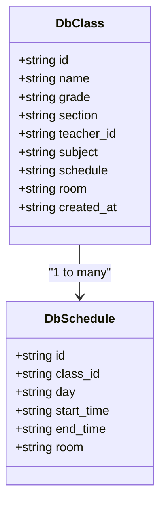

# Class Creation

<cite>
**Referenced Files in This Document**   
- [create-class/route.ts](file://app/api/admin/create-class/route.ts)
- [page.tsx](file://app/admin/classes/page.tsx)
- [types.ts](file://lib/supabase/types.ts)
- [20251219043440_create_classes_table.sql](file://supabase/migrations/20251219043440_create_classes_table.sql)
- [20251219043556_create_schedule_table.sql](file://supabase/migrations/20251219043556_create_schedule_table.sql)
- [validation-schemas.ts](file://lib/validation-schemas.ts)
- [rate-limit.ts](file://lib/rate-limit.ts)
- [security.ts](file://lib/security.ts)
</cite>

## Table of Contents
1. [Introduction](#introduction)
2. [API Endpoint Implementation](#api-endpoint-implementation)
3. [Frontend Form Integration](#frontend-form-integration)
4. [Data Persistence and Relationships](#data-persistence-and-relationships)
5. [Error Handling and Validation](#error-handling-and-validation)
6. [Practical Example](#practical-example)
7. [Integration with Teacher Management and Academic Calendar](#integration-with-teacher-management-and-academic-calendar)
8. [Common Issues and Troubleshooting](#common-issues-and-troubleshooting)
9. [Performance and Scalability Considerations](#performance-and-scalability-considerations)

## Introduction
The Class Creation feature in the Admin Dashboard enables administrators to create new academic classes by defining essential details such as class name, grade level, section, subject, assigned teacher, room, and schedule. This functionality is implemented through a dedicated API endpoint (`create-class/route.ts`) that handles request validation, data persistence in Supabase, and error handling. The frontend form (`page.tsx`) manages state, submission flow, and user feedback using toast notifications. This document provides a comprehensive overview of the implementation, integration points, and operational considerations for this feature.

## API Endpoint Implementation

The class creation functionality is implemented through the `POST /api/admin/create-class` endpoint, which follows a structured process to ensure data integrity and security.

### Request Flow and Processing
The endpoint executes the following steps:
1. **Rate Limiting**: The request is subject to rate limiting based on the client's IP address, allowing a maximum of 10 class creation attempts per minute.
2. **Authentication and Authorization**: The system verifies that the requesting user is authenticated and possesses admin privileges.
3. **Request Validation**: The endpoint validates required fields (name and subject) before proceeding with data persistence.
4. **Data Persistence**: The class record is inserted into the `classes` table, followed by the creation of corresponding schedule entries in the `schedules` table.
5. **Error Handling**: The system implements transactional integrity by rolling back class creation if schedule insertion fails.

### Security Measures
The implementation incorporates several security measures:
- **Rate Limiting**: Prevents abuse through the `checkRateLimit` utility.
- **IP Address Handling**: Uses `getClientIp` to securely extract the client IP address, prioritizing platform-provided values to prevent spoofing.
- **Origin Validation**: Ensures requests originate from the same domain to prevent CSRF attacks.

**Section sources**
- [create-class/route.ts](file://app/api/admin/create-class/route.ts#L1-L113)
- [rate-limit.ts](file://lib/rate-limit.ts#L1-L56)
- [security.ts](file://lib/security.ts#L1-L136)

## Frontend Form Integration

The frontend implementation in `page.tsx` provides a user-friendly interface for creating classes, with comprehensive state management and user feedback mechanisms.

### State Management
The component uses React's `useState` and `useEffect` hooks to manage:
- Form data (name, grade, section, subject, teacher assignment, room, schedule)
- UI state (dialog visibility, loading states, search filters)
- Data fetching and caching for teachers and existing classes

### Submission Flow
The form submission process follows these steps:
1. **Validation**: Client-side validation ensures required fields are populated before submission.
2. **API Call**: The form data is sent to the `/api/admin/create-class` endpoint via a POST request.
3. **Feedback**: Success is indicated by a toast notification, while errors trigger error-specific toast messages.
4. **State Update**: Upon successful creation, the form is reset, the dialog is closed, and the class list is refreshed.

### User Interface Components
The form includes:
- Input fields for class name and subject
- Select dropdowns for grade, section, teacher assignment, room, schedule days, and time
- Responsive layout with appropriate labeling and organization
- Loading indicators during data fetching and submission

**Section sources**
- [page.tsx](file://app/admin/classes/page.tsx#L1-L615)

## Data Persistence and Relationships

The class creation process involves multiple database interactions and relationships between entities.

### Database Schema
The implementation relies on two primary tables:

```mermaid
erDiagram
CLASS {
uuid id PK
string name NOT NULL
string grade NOT NULL
string section NOT NULL
uuid teacher_id FK
string subject NOT NULL
string schedule
string room
timestamp created_at
}
SCHEDULE {
uuid id PK
uuid class_id FK
string day NOT NULL
time start_time NOT NULL
time end_time NOT NULL
string room
}
CLASS ||--o{ SCHEDULE : "has"
USERS ||--o{ CLASS : "teaches"
```

**Diagram sources**
- [20251219043440_create_classes_table.sql](file://supabase/migrations/20251219043440_create_classes_table.sql#L1-L11)
- [20251219043556_create_schedule_table.sql](file://supabase/migrations/20251219043556_create_schedule_table.sql#L1-L8)

### Data Flow
When a new class is created:
1. A record is inserted into the `classes` table with basic class information.
2. If a schedule is specified, multiple records are created in the `schedules` table, one for each day in the schedule pattern.
3. The schedule entries include the class ID, day of the week, start and end times (calculated as one hour duration), and room assignment.

### Type Definitions
The TypeScript interfaces define the structure of class-related data:



**Diagram sources**
- [types.ts](file://lib/supabase/types.ts#L114-L124)
- [types.ts](file://lib/supabase/types.ts#L148-L155)

## Error Handling and Validation

The system implements comprehensive error handling and validation at both the client and server levels.

### Server-Side Validation
The API endpoint performs the following validations:
- **Authentication**: Ensures the user is logged in and has admin privileges
- **Required Fields**: Validates that name and subject are provided
- **Rate Limiting**: Prevents excessive requests from the same IP address
- **Transactional Integrity**: Implements rollback if schedule creation fails after class creation

### Client-Side Validation
The frontend form includes:
- Required field validation for name and subject
- UI-level disabling of the submit button when required fields are empty
- Immediate feedback through toast notifications for both success and error states

### Error Response Handling
The system handles errors through:
- HTTP status codes (400 for bad requests, 401 for unauthorized, 403 for forbidden, 429 for rate limiting, 500 for server errors)
- Descriptive error messages returned in the response body
- Client-side toast notifications that display error details to the user

**Section sources**
- [create-class/route.ts](file://app/api/admin/create-class/route.ts#L59-L61)
- [create-class/route.ts](file://app/api/admin/create-class/route.ts#L34-L36)
- [page.tsx](file://app/admin/classes/page.tsx#L223-L224)

## Practical Example

To create a new class via the API, send a POST request to `/api/admin/create-class` with the following JSON payload:

```json
{
  "name": "Algebra II",
  "grade": "10",
  "section": "A",
  "subject": "Mathematics",
  "teacher_id": "c3a8d9e1-f2b4-4c5a-9d8e-7f6a5b4c3d2e",
  "room": "Room 101",
  "scheduleDays": "MWF",
  "scheduleTime": "9:00 AM"
}
```

A successful response returns:
```json
{
  "success": true,
  "class": {
    "id": "a1b2c3d4-e5f6-7g8h-9i0j-k1l2m3n4o5p6",
    "name": "Algebra II",
    "grade": "10",
    "section": "A",
    "subject": "Mathematics",
    "teacher_id": "c3a8d9e1-f2b4-4c5a-9d8e-7f6a5b4c3d2e",
    "room": "Room 101",
    "schedule": "MWF 9:00 AM",
    "created_at": "2025-03-15T10:30:00.000Z"
  }
}
```

This creates a class that meets on Mondays, Wednesdays, and Fridays from 9:00 AM to 10:00 AM in Room 101, taught by the specified teacher.

## Integration with Teacher Management and Academic Calendar

The class creation feature integrates with other system components to provide a cohesive educational management experience.

### Teacher Management Integration
When creating a class, administrators can assign a teacher from the list of registered teachers. The system:
- Fetches teacher data from the `users` table with their associated `teacher_profiles`
- Displays teacher names along with their subjects to aid in assignment decisions
- Stores the teacher ID as a foreign key in the `classes` table
- Allows for reassignment or removal of teachers from classes

### Academic Calendar Integration
Although not directly implemented in the current class creation flow, the schedule information created during class creation can be used to:
- Generate calendar events for recurring class meetings
- Display class schedules in the academic calendar view
- Prevent scheduling conflicts by checking against existing events
- Provide students and teachers with a comprehensive view of their weekly schedules

The system's calendar functionality supports event creation with various types, including classes, which could be automatically generated based on class schedules.

**Section sources**
- [page.tsx](file://app/admin/classes/page.tsx#L133-L149)
- [types.ts](file://lib/supabase/types.ts#L107-L112)

## Common Issues and Troubleshooting

### Duplicate Class Names
The current implementation does not prevent duplicate class names, as this is not enforced at the database level. To address this:
1. Add a unique constraint on the combination of name, grade, and section if duplicate classes are not permitted
2. Implement client-side validation to check for existing classes with the same name
3. Modify the API endpoint to query for existing classes before creation

### Invalid Schedules
The system validates that schedule days and times are provided but does not check for:
- Time conflicts with other classes for the same teacher
- Room availability conflicts
- Invalid time ranges (e.g., end time before start time)

To resolve these issues:
1. Implement server-side checks for scheduling conflicts
2. Add validation for time ranges and durations
3. Provide feedback to administrators about potential conflicts

### Troubleshooting Steps
When encountering issues with class creation:
1. **Check Authentication**: Ensure you are logged in as an administrator
2. **Verify Required Fields**: Confirm that name and subject are provided
3. **Review Rate Limits**: If receiving 429 errors, wait before attempting again
4. **Validate Teacher ID**: Ensure the selected teacher exists and has the correct role
5. **Check Network Connection**: Verify that the API endpoint is reachable
6. **Examine Browser Console**: Look for JavaScript errors that might prevent form submission

**Section sources**
- [create-class/route.ts](file://app/api/admin/create-class/route.ts#L59-L61)
- [create-class/route.ts](file://app/api/admin/create-class/route.ts#L34-L36)

## Performance and Scalability Considerations

### High-Volume Class Creation
During enrollment periods, the system may experience high volumes of class creation requests. The current implementation includes rate limiting (10 requests per minute per IP) to prevent abuse, but this may need adjustment based on actual usage patterns.

### Database Performance
The class creation process involves multiple database operations:
1. Authentication check
2. Admin role verification
3. Class insertion
4. Schedule insertion (multiple rows)

To optimize performance:
- Ensure proper indexing on frequently queried fields (teacher_id, grade, section)
- Consider batching operations if multiple classes are created simultaneously
- Monitor query performance and optimize as needed

### Scalability Recommendations
For handling high-volume class creation:
1. **Increase Rate Limits**: Adjust the rate limiting configuration to accommodate legitimate administrative activities during peak periods
2. **Implement Caching**: Cache teacher lists and other frequently accessed data to reduce database load
3. **Optimize Queries**: Ensure all database queries are optimized with appropriate indexes
4. **Monitor Performance**: Implement monitoring to detect performance bottlenecks during high-usage periods
5. **Consider Bulk Operations**: For large-scale class creation, implement a bulk import feature rather than individual API calls

The current implementation provides a solid foundation for class creation, with opportunities for optimization and enhancement to support larger institutions and higher transaction volumes.

**Section sources**
- [create-class/route.ts](file://app/api/admin/create-class/route.ts#L32-L33)
- [rate-limit.ts](file://lib/rate-limit.ts#L25-L56)