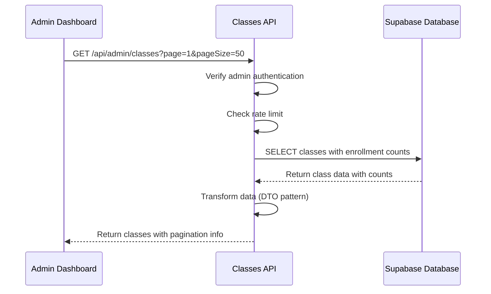
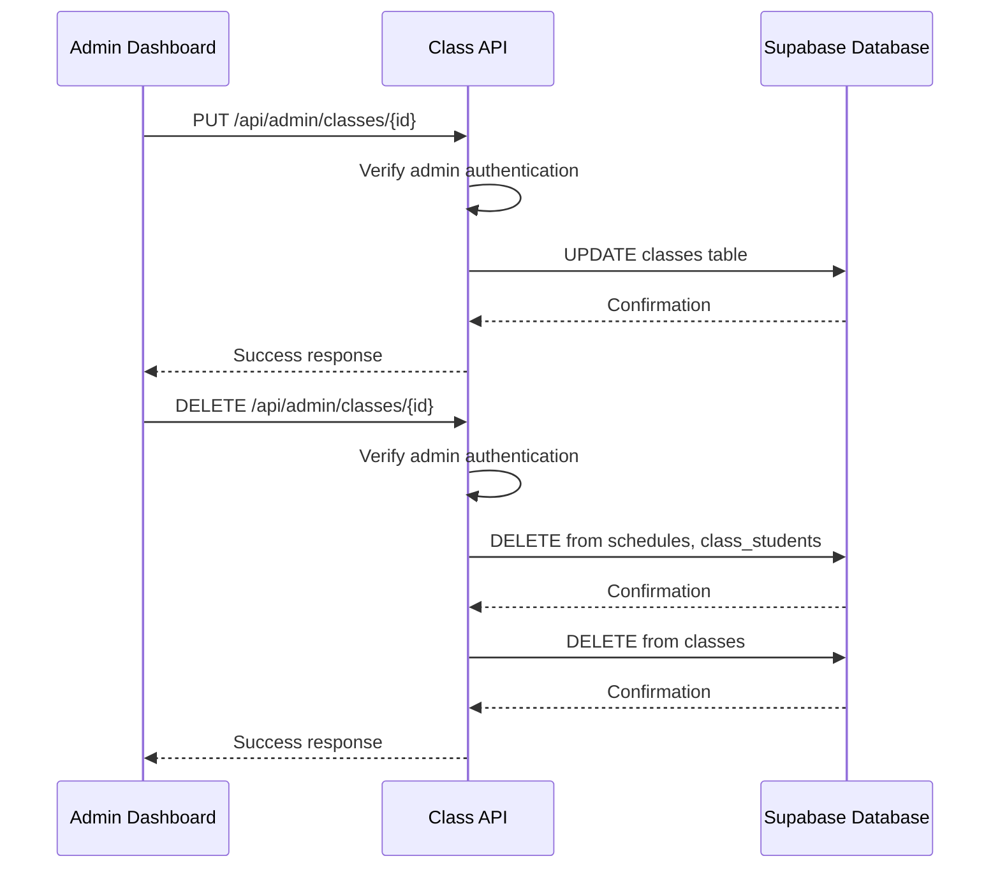
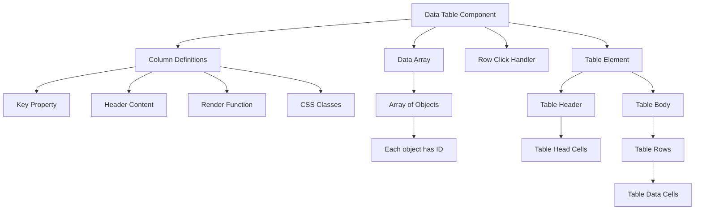

# Class Management

<cite>
**Referenced Files in This Document**   
- [page.tsx](file://app/admin/classes/page.tsx)
- [route.ts](file://app/api/admin/classes/route.ts)
- [route.ts](file://app/api/admin/classes/[id]/route.ts)
- [data-table.tsx](file://components/data-table.tsx)
- [queries.ts](file://lib/supabase/queries.ts)
- [types.ts](file://lib/supabase/types.ts)
</cite>

## Table of Contents
1. [Introduction](#introduction)
2. [Core Components](#core-components)
3. [API Endpoints](#api-endpoints)
4. [Data Table Integration](#data-table-integration)
5. [Relationships with Other Systems](#relationships-with-other-systems)
6. [Common Issues and Debugging](#common-issues-and-debugging)
7. [Performance Optimization](#performance-optimization)

## Introduction

The Class Management feature in the Admin Dashboard provides administrators with comprehensive tools to manage class rosters, schedules, and assignments. This system enables administrators to list, view, and manage classes through a user-friendly interface that leverages server components and the data-table component for rendering paginated and sortable class information. The implementation focuses on efficient data retrieval, real-time updates, and seamless integration with related educational systems such as attendance, grading, and scheduling.

The feature supports key operations including creating new classes, editing existing class details, and deleting classes, all while maintaining data integrity across related systems. The interface includes search functionality, subject filtering, and visual indicators for class details such as enrollment counts, schedules, and room assignments. The system is designed with performance and security in mind, implementing pagination, rate limiting, and proper authentication checks to ensure optimal operation even with large datasets.

**Section sources**
- [page.tsx](file://app/admin/classes/page.tsx#L1-L615)

## Core Components

The Class Management feature consists of several interconnected components that work together to provide a seamless administrative experience. The primary component is the classes page, which serves as the central interface for managing all classes within the school system. This component handles data fetching, state management, and user interactions for class operations.

The implementation uses React's useState and useEffect hooks to manage component state and lifecycle events. Key state variables include the list of classes, loading status, search queries, and filter selections. The component fetches class data from the API endpoint and teacher data directly from Supabase, combining this information to present a comprehensive view of each class with its associated teacher and enrollment count.

Dialog components are used for creating new classes and editing existing ones, providing a structured interface for inputting class details such as name, grade, section, subject, assigned teacher, room, and schedule. A confirmation dialog is implemented for class deletion to prevent accidental removal of class records. The interface also includes search functionality with debounced input to reduce server load during typing, and subject filtering to help administrators quickly locate specific classes.

**Section sources**
- [page.tsx](file://app/admin/classes/page.tsx#L60-L615)

## API Endpoints

### Classes Listing Endpoint

The GET endpoint at `/api/admin/classes` provides a paginated list of all classes in the system with enrollment counts. This endpoint implements several important features for security and performance:

- **Authentication and Authorization**: The endpoint verifies that the requesting user is authenticated and has admin privileges before returning data.
- **Rate Limiting**: Implements rate limiting to prevent scraping and abuse, allowing 30 requests per 10 minutes per IP address.
- **Pagination**: Supports pagination through query parameters `page` and `pageSize`, with default values of 1 and 50 respectively.
- **Search Filtering**: Allows searching by class name or subject using the `search` query parameter.
- **Data Aggregation**: Uses Supabase's aggregation capabilities to include student enrollment counts in the same query, reducing database round trips.

The response includes both the list of classes and pagination metadata, enabling the frontend to display appropriate navigation controls.



**Diagram sources**
- [route.ts](file://app/api/admin/classes/route.ts#L7-L89)

### Individual Class Operations

The dynamic route `/api/admin/classes/[id]` supports three operations for managing individual classes:

- **GET**: Retrieves detailed information about a specific class
- **PUT**: Updates class details including name, grade, section, subject, assigned teacher, room, and schedule
- **DELETE**: Removes a class and its associated records

The PUT operation requires the class ID in the URL path and accepts a JSON payload with the updated class properties. Before updating, the system verifies that the requesting user is an authenticated admin. The implementation includes proper error handling with meaningful error messages returned to the client.

The DELETE operation follows a cascading deletion pattern, first removing related records from the schedules and class_students tables before deleting the class record itself. This ensures data integrity across the system. Like the PUT operation, it includes authentication and authorization checks to prevent unauthorized access.



**Diagram sources**
- [route.ts](file://app/api/admin/classes/[id]/route.ts#L4-L99)

## Data Table Integration

The Class Management feature utilizes a reusable data-table component for displaying class information in a structured format. This component accepts generic type parameters and is designed to work with any data structure that includes an ID property.

The data-table component provides the following features:
- **Column Configuration**: Flexible column definitions with customizable headers, rendering functions, and CSS classes
- **Row Click Handling**: Optional callback for handling row click events
- **Responsive Design**: Horizontal scrolling on smaller screens to accommodate all columns
- **Accessibility**: Proper table semantics for screen readers and keyboard navigation

In the Class Management context, the data-table would be used to display class rosters with columns for class name, subject, teacher, schedule, room, and student count. The component supports sorting by clicking on column headers and can be integrated with pagination controls for navigating through large datasets.



**Diagram sources**
- [data-table.tsx](file://components/data-table.tsx#L1-L60)

## Relationships with Other Systems

The Class Management system is tightly integrated with several other components of the school management ecosystem, ensuring data consistency and enabling comprehensive educational administration.

### Attendance System Integration

Classes serve as the foundation for the attendance system, with each attendance record linked to a specific class. When a class is deleted, all associated attendance records are also removed to maintain data integrity. Teachers use class information to take attendance, and the system displays class-specific attendance statistics in the dashboard.

### Grading System Integration

The grading system relies on class information to organize student assessments. Each grade record is associated with a specific class, allowing for subject-specific grading and progress tracking. The Class Management feature ensures that when class details are updated, these changes are reflected in the grading interface, maintaining consistency across the system.

### Scheduling System Integration

Class schedules are managed through the scheduling system, which uses class information to create time-based assignments for students and teachers. The Class Management interface displays schedule information prominently, allowing administrators to quickly verify that classes are properly scheduled. Changes to class schedules through the Class Management interface are synchronized with the scheduling system to prevent conflicts.

```mermaid
erDiagram
CLASS ||--o{ ATTENDANCE : "has"
CLASS ||--o{ GRADE : "has"
CLASS ||--o{ SCHEDULE : "has"
CLASS ||--o{ LESSON : "has"
CLASS ||--o{ QUIZ : "has"
CLASS }|--|| TEACHER : "assigned to"
CLASS }|--||{ STUDENT : "enrolls"
CLASS {
string id PK
string name
string grade
string section
string subject
string teacher_id FK
string schedule
string room
}
ATTENDANCE {
string id PK
string class_id FK
string student_id FK
date date
string status
}
GRADE {
string id PK
string class_id FK
string student_id FK
number score
string type
date date
}
SCHEDULE {
string id PK
string class_id FK
string day
string start_time
string end_time
string room
}
```

**Diagram sources**
- [types.ts](file://lib/supabase/types.ts#L114-L124)
- [queries.ts](file://lib/supabase/queries.ts#L89-L101)

## Common Issues and Debugging

### Loading State Handling

The Class Management interface implements proper loading states to provide feedback during data retrieval. The loading state is managed through the `loading` state variable, which is set to true initially and during data fetching operations. When loading, a spinner is displayed to indicate that data is being retrieved. This prevents users from interacting with incomplete data and provides a better user experience.

If loading persists for an extended period, potential issues include network connectivity problems, server performance issues, or authentication failures. Administrators should verify their internet connection and check the browser's developer tools for network errors. Server-side logging can help identify performance bottlenecks in the API endpoints.

### Stale Data Issues

Stale data can occur when the client-side cache is not properly invalidated after data modifications. The Class Management implementation addresses this by calling the `fetchData()` function after successful create, update, or delete operations. This ensures that the displayed data reflects the current state of the database.

To troubleshoot stale data issues, administrators should verify that the `fetchData()` function is being called after mutations and that the API endpoints are returning updated data. Browser caching can also contribute to stale data issues, so hard refreshing the page (Ctrl+F5) can help determine if the issue is client-side or server-side.

### Permission Failures

Permission failures occur when users without admin privileges attempt to access Class Management features. The system implements role-based access control, verifying that users have the "admin" role before allowing access to class management operations. Users encountering permission errors should verify their account role with the system administrator.

API endpoints return appropriate HTTP status codes for permission issues:
- 401 Unauthorized: When the user is not authenticated
- 403 Forbidden: When the authenticated user lacks admin privileges

**Section sources**
- [page.tsx](file://app/admin/classes/page.tsx#L104-L152)
- [route.ts](file://app/api/admin/classes/route.ts#L17-L32)

## Performance Optimization

### Pagination Implementation

The Class Management system implements server-side pagination to handle large datasets efficiently. The API endpoint accepts `page` and `pageSize` parameters to control the range of data returned. By default, the system retrieves 50 classes per page, which balances network efficiency with user experience.

Pagination reduces the amount of data transferred between the server and client, improving load times and reducing memory usage. The frontend displays pagination controls that allow administrators to navigate between pages, with information about the total number of classes and pages.

### Caching Strategy

The system employs multiple caching strategies to improve performance:
- **Client-side Caching**: The data-table component uses React's useMemo hook to memoize filtered results, preventing unnecessary recalculations during filtering operations.
- **Server-side Caching**: API routes can be enhanced with response caching to reduce database load for frequently accessed data.
- **Supabase Query Optimization**: The implementation uses Supabase's efficient querying capabilities, including the ability to fetch related data in a single query rather than multiple round trips.

### Optimized Supabase Queries

The Class Management feature uses several optimization techniques in its Supabase queries:

- **Aggregation in Single Queries**: The classes listing endpoint uses Supabase's aggregation capabilities to include student enrollment counts in the same query that retrieves class data, eliminating the need for separate queries.
- **Selective Field Selection**: Queries specify only the fields needed for display, reducing data transfer and memory usage.
- **Proper Indexing**: The database schema should include appropriate indexes on frequently queried fields such as class name, subject, and teacher_id to ensure fast query performance.
- **Rate Limiting**: Implemented to prevent abuse and ensure fair resource usage across all users.

These optimizations work together to ensure that the Class Management feature performs well even with large numbers of classes and students, providing administrators with a responsive and reliable interface for managing educational resources.

**Section sources**
- [route.ts](file://app/api/admin/classes/route.ts#L34-L53)
- [page.tsx](file://app/admin/classes/page.tsx#L154-L173)