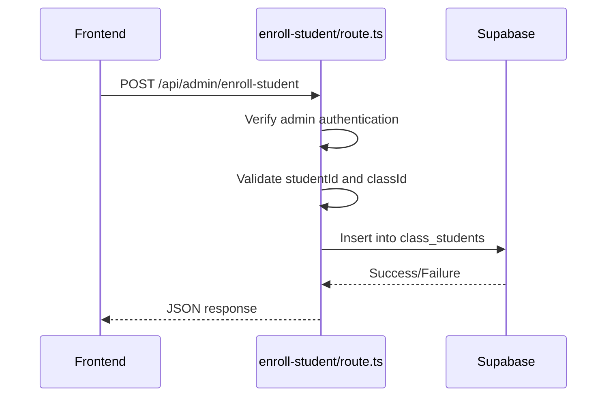
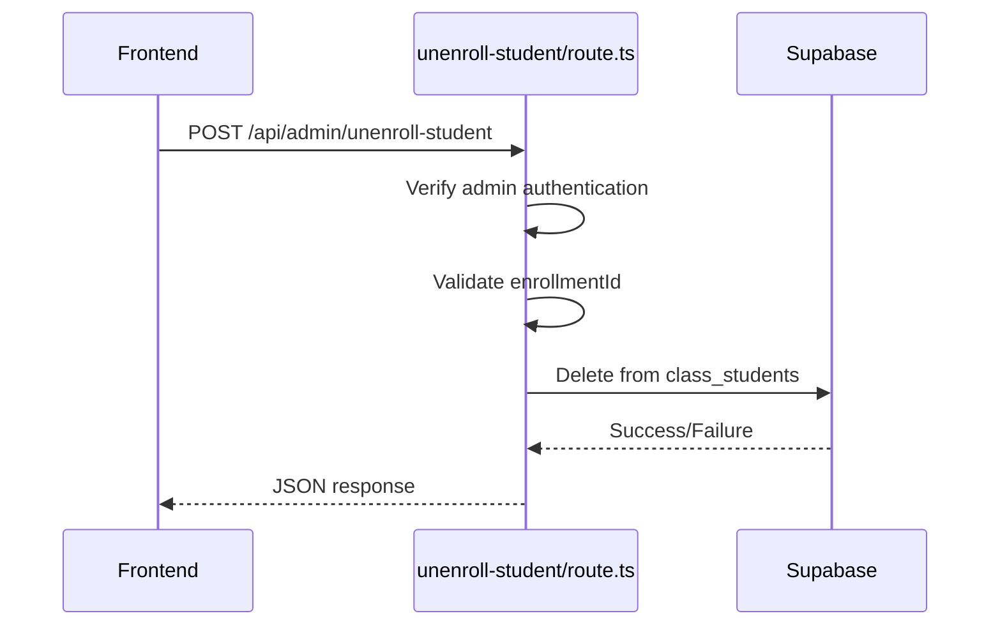
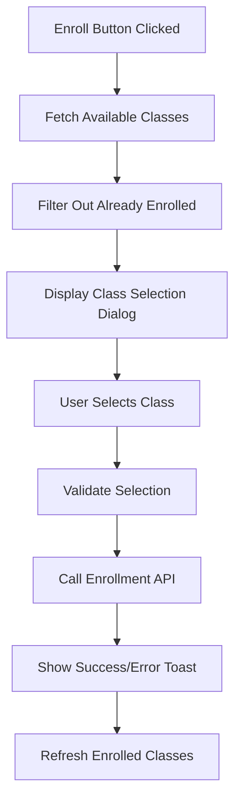
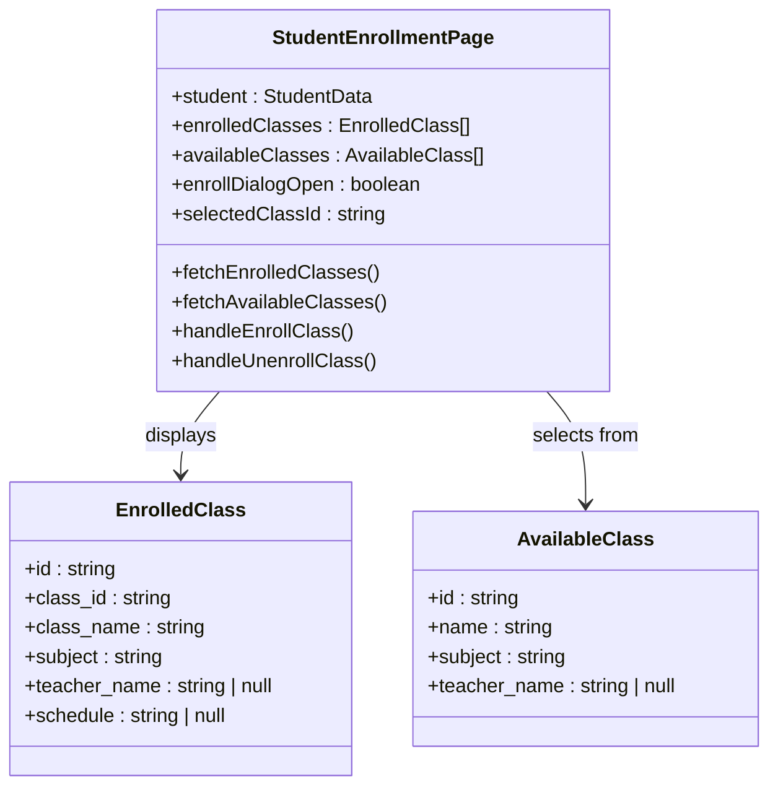
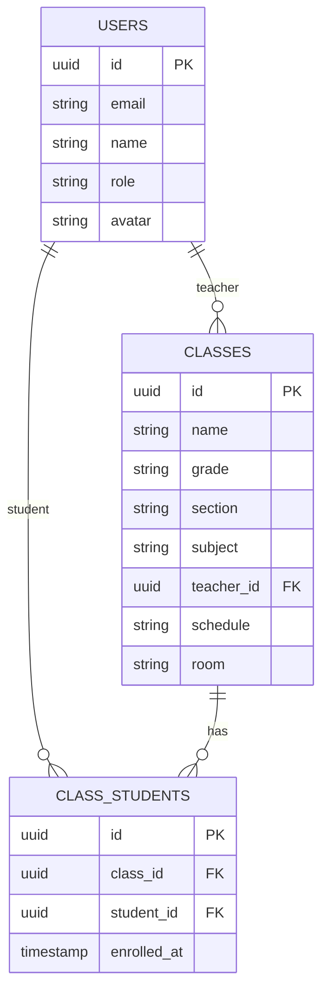
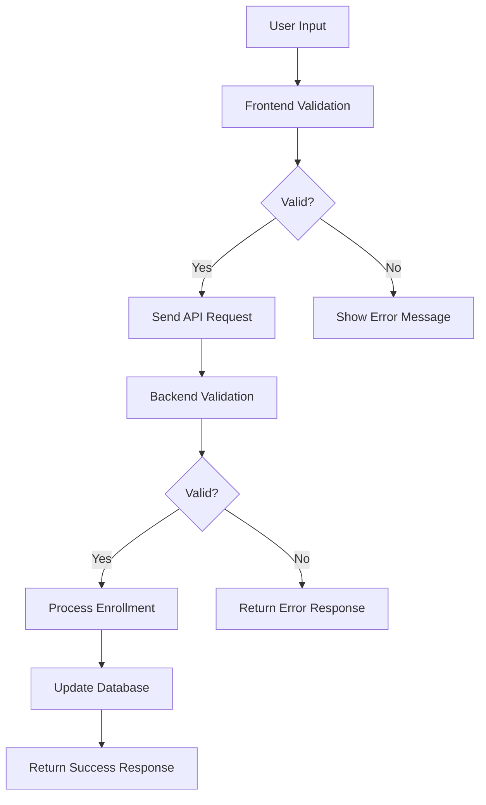

# Student Enrollment Management

<cite>
**Referenced Files in This Document**   
- [enroll-student/route.ts](file://app/api/admin/enroll-student/route.ts)
- [unenroll-student/route.ts](file://app/api/admin/unenroll-student/route.ts)
- [page.tsx](file://app/admin/students/[id]/page.tsx)
- [create_classes_table.sql](file://supabase/migrations/20251219043440_create_classes_table.sql)
- [queries.ts](file://lib/supabase/queries.ts)
- [validation-schemas.ts](file://lib/validation-schemas.ts)
</cite>

## Table of Contents
1. [Introduction](#introduction)
2. [API Endpoint Implementation](#api-endpoint-implementation)
3. [Frontend Integration](#frontend-integration)
4. [Data Relationships](#data-relationships)
5. [Error Handling and Validation](#error-handling-and-validation)
6. [Performance Considerations](#performance-considerations)
7. [Troubleshooting Guide](#troubleshooting-guide)

## Introduction
The Student Enrollment Management feature enables administrators to manage student enrollments in classes through a secure and user-friendly interface. This system provides robust functionality for enrolling and unenrolling students, with comprehensive validation, role-based access control, and real-time updates. The implementation ensures data integrity through transaction safety and proper database constraints, while the frontend offers an intuitive experience with immediate feedback via toast notifications.

**Section sources**
- [page.tsx](file://app/admin/students/[id]/page.tsx#L1-L939)

## API Endpoint Implementation

### Enrollment Endpoint
The `enroll-student/route.ts` API endpoint handles student enrollment requests with comprehensive security and validation measures. The endpoint verifies admin role permissions before processing any enrollment request, ensuring that only authorized users can modify enrollment data. It validates the presence of both student ID and class ID in the request payload, returning appropriate error responses for missing parameters.

The enrollment process uses Supabase's direct database insertion to add records to the `class_students` table, which maintains the many-to-many relationship between students and classes. The implementation includes proper error handling with try-catch blocks to capture and log any unexpected errors during the enrollment process.

**Diagram sources**
- [enroll-student/route.ts](file://app/api/admin/enroll-student/route.ts#L1-L43)

**Section sources**
- [enroll-student/route.ts](file://app/api/admin/enroll-student/route.ts#L1-L43)

### Unenrollment Endpoint
The `unenroll-student/route.ts` API endpoint manages the removal of students from classes. Similar to the enrollment endpoint, it first verifies the admin role and authenticates the requesting user. The endpoint requires an enrollment ID rather than separate student and class IDs, providing a more secure reference to the specific enrollment record.

The unenrollment process uses Supabase's delete functionality with an equality filter on the enrollment ID, ensuring that only the specified enrollment record is removed. This approach prevents accidental deletion of other enrollment records and maintains data integrity through the use of UUID identifiers.

**Diagram sources**
- [unenroll-student/route.ts](file://app/api/admin/unenroll-student/route.ts#L1-L39)

**Section sources**
- [unenroll-student/route.ts](file://app/api/admin/unenroll-student/route.ts#L1-L39)

## Frontend Integration

### Enrollment Dialog and Class Selection
The frontend implementation in `app/admin/students/[id]/page.tsx` provides a modal dialog for enrolling students in classes. When the "Enroll in Class" button is clicked, the system fetches all available classes that the student is not already enrolled in, ensuring that duplicate enrollments are prevented at the UI level.

The class selection dropdown displays comprehensive information including class name, subject, and teacher name, helping administrators make informed decisions. The dialog includes proper loading states and error handling, with a disabled enroll button until a valid class is selected.

**Diagram sources**
- [page.tsx](file://app/admin/students/[id]/page.tsx#L870-L935)

**Section sources**
- [page.tsx](file://app/admin/students/[id]/page.tsx#L137-L224)

### Real-time Roster Updates
The enrollment system implements real-time roster updates through immediate data refetching after successful enrollment or unenrollment operations. When a student is enrolled or unenrolled, the `fetchEnrolledClasses()` function is called to refresh the local state with the latest data from the database.

The UI displays enrolled classes in a card-based layout with remove buttons for each enrollment, allowing for quick unenrollment actions. The system uses React's useState and useEffect hooks to manage component state and side effects, ensuring that the displayed data remains synchronized with the backend.

**Diagram sources**
- [page.tsx](file://app/admin/students/[id]/page.tsx#L65-L91)

**Section sources**
- [page.tsx](file://app/admin/students/[id]/page.tsx#L135-L245)

## Data Relationships

### Database Schema
The enrollment system relies on a well-defined database schema with proper relationships and constraints. The `classes` table stores class information including name, grade, section, subject, and teacher reference. The `class_students` table serves as a junction table for the many-to-many relationship between students and classes, with foreign key constraints and a unique constraint on the combination of class_id and student_id to prevent duplicate enrollments.

**Diagram sources**
- [create_classes_table.sql](file://supabase/migrations/20251219043440_create_classes_table.sql#L1-L22)

**Section sources**
- [create_classes_table.sql](file://supabase/migrations/20251219043440_create_classes_table.sql#L1-L22)

### Relationship with Other Systems
The enrollment system integrates with several other components of the school management system. When a student is enrolled in a class, this affects multiple related systems:

1. **Gradebook**: Enrollment triggers the initialization of grade records for the student in that class
2. **Attendance**: The student becomes eligible for attendance tracking in the enrolled class
3. **User Profiles**: Enrollment status is reflected in the student's profile information
4. **Class Rosters**: The class roster is updated to include the newly enrolled student

These relationships ensure data consistency across the system and provide a comprehensive view of student academic progress.

## Error Handling and Validation

### Input Validation
The system implements comprehensive validation at both the frontend and backend levels. The frontend uses the `validation-schemas.ts` file which contains Zod schemas for request validation. The `enrollStudentSchema` validates that both studentId and classId are valid UUIDs before the request is sent to the server.

At the API level, the endpoints perform additional validation to ensure data integrity. The enrollment endpoint checks for the presence of required fields and verifies the admin role before processing the request. This multi-layered validation approach prevents invalid data from being stored in the database.

**Diagram sources**
- [validation-schemas.ts](file://lib/validation-schemas.ts#L86-L93)

**Section sources**
- [validation-schemas.ts](file://lib/validation-schemas.ts#L86-L93)

### Common Issues and Resolution
The system addresses several common enrollment issues:

**Duplicate Enrollments**: Prevented by the unique constraint on the `class_students` table (class_id, student_id). If an attempt is made to create a duplicate enrollment, the database will reject the insertion.

**Invalid Class IDs**: Handled by the UUID validation in the Zod schema. Any non-UUID value will be rejected before reaching the database.

**Permission Errors**: The API endpoints verify the admin role before processing any enrollment requests. Non-admin users receive a 403 Forbidden response.

**Resolution Strategies**:
- For duplicate enrollment attempts, the system should inform the administrator that the student is already enrolled
- For invalid class IDs, the UI should validate the selection before submission
- For permission errors, ensure the user has the appropriate admin role assigned

**Section sources**
- [enroll-student/route.ts](file://app/api/admin/enroll-student/route.ts#L14-L22)
- [unenroll-student/route.ts](file://app/api/admin/unenroll-student/route.ts#L14-L22)

## Performance Considerations

### Bulk Operations
While the current implementation focuses on individual enrollment operations, the system architecture supports bulk operations through optimized database queries. The `queries-optimized.ts` file contains functions for bulk operations that could be extended to handle multiple enrollments efficiently.

For bulk enrollment scenarios, the system could implement a batch processing approach that groups multiple enrollment requests into a single database transaction. This would reduce the number of round trips to the database and improve overall performance.

### Real-time Synchronization
The enrollment system achieves real-time synchronization through immediate data refetching after operations. When an enrollment or unenrollment is completed, the `fetchEnrolledClasses()` function is called to refresh the data from the server.

For larger deployments with multiple administrators, the system could benefit from implementing Supabase's real-time subscriptions to push updates to all connected clients automatically. This would ensure that all dashboard views remain synchronized without requiring manual refreshes.

**Section sources**
- [queries-optimized.ts](file://lib/supabase/queries-optimized.ts#L297-L316)
- [page.tsx](file://app/admin/students/[id]/page.tsx#L218-L219)

## Troubleshooting Guide

### Common Issues
**Enrollment Fails with Generic Error**: Check the browser console and server logs for specific error messages. Verify that the student and class IDs are valid UUIDs.

**Class Not Appearing in Selection List**: Ensure the class exists in the database and that the student is not already enrolled in it. The available classes list excludes classes the student is already enrolled in.

**Permission Denied Error**: Verify that the logged-in user has the admin role assigned in the users table. Role verification occurs in both enrollment and unenrollment endpoints.

**UI Not Updating After Enrollment**: The `fetchEnrolledClasses()` function should be called after successful enrollment. Check that this function is being invoked in the success callback.

**Section sources**
- [enroll-student/route.ts](file://app/api/admin/enroll-student/route.ts#L39-L42)
- [page.tsx](file://app/admin/students/[id]/page.tsx#L210-L224)