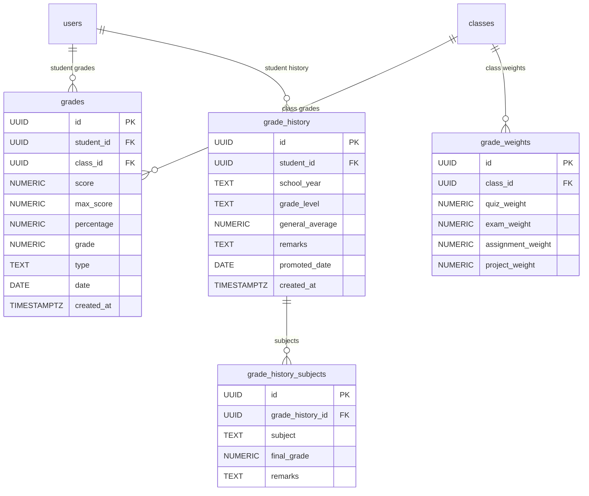
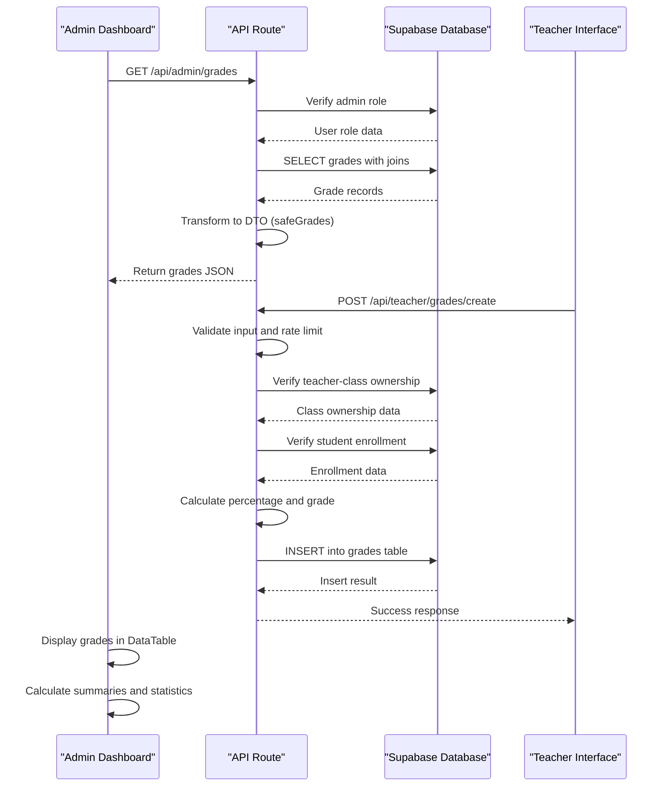
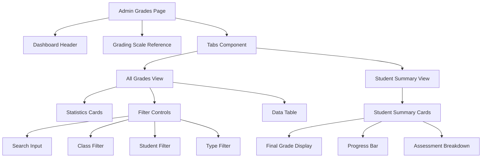
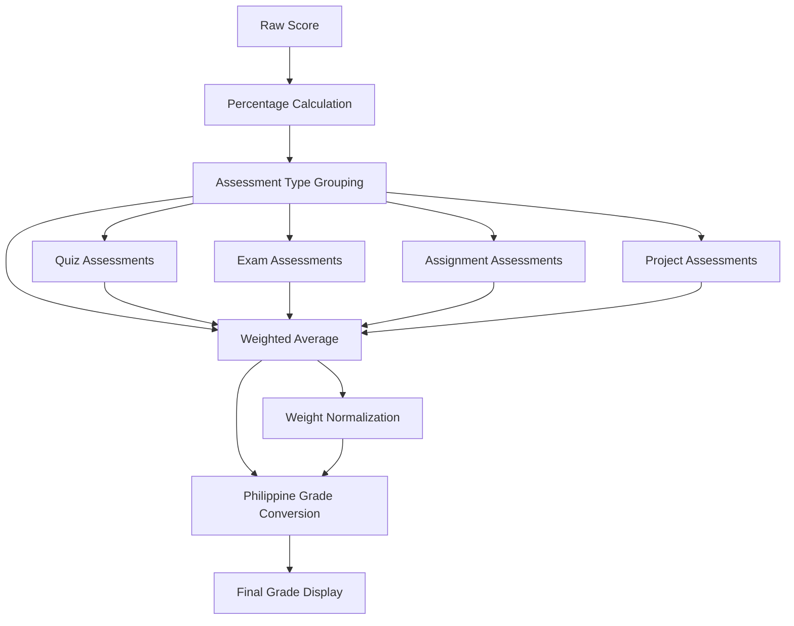
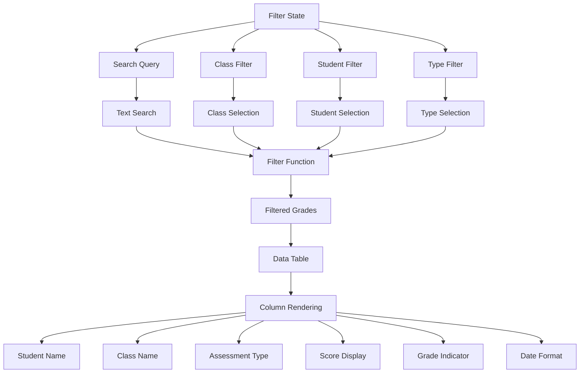
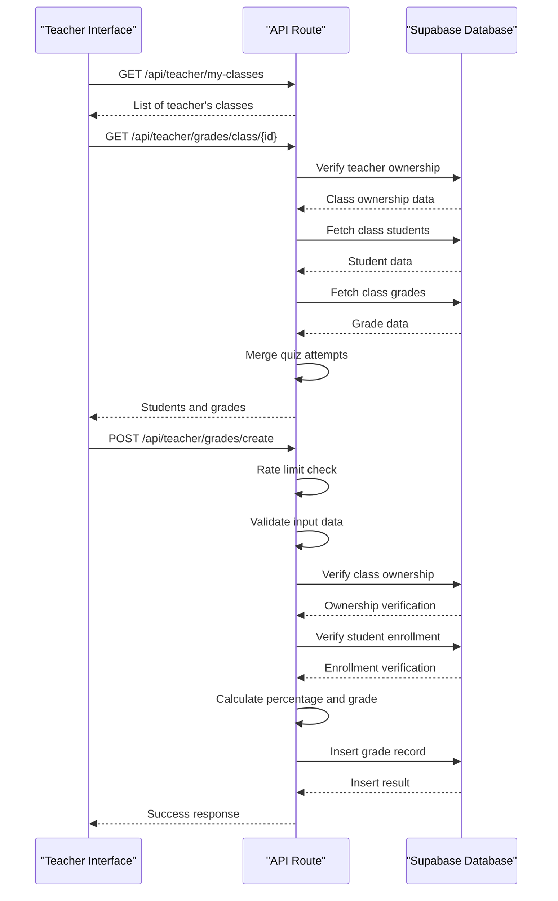
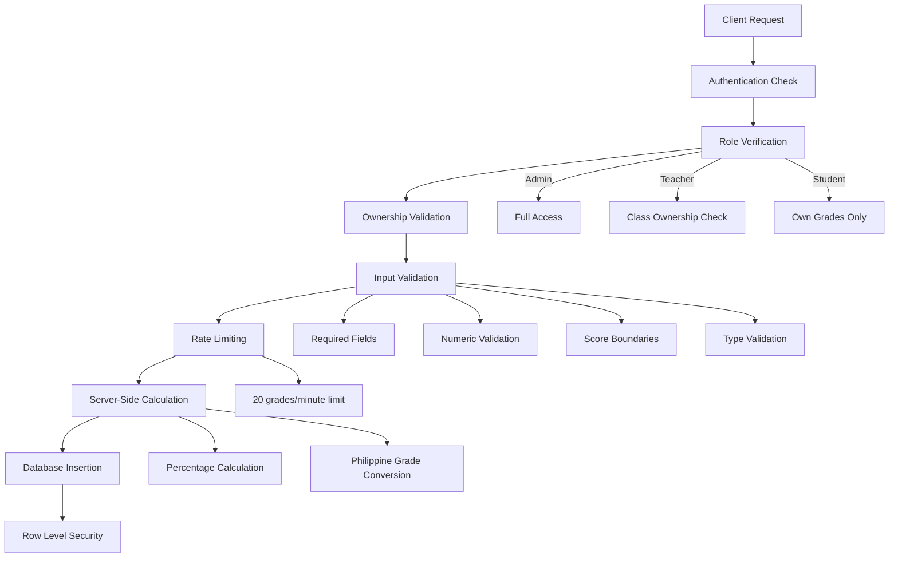
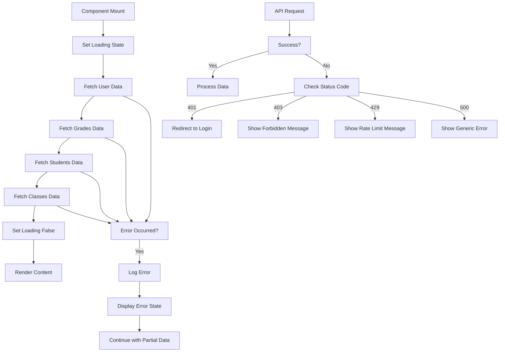
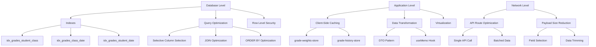

# Grade Monitoring

<cite>
**Referenced Files in This Document**   
- [page.tsx](file://app/admin/grades/page.tsx)
- [route.ts](file://app/api/admin/grades/route.ts)
- [grade-utils.ts](file://lib/grade-utils.ts)
- [grade-weights-store.ts](file://lib/grade-weights-store.ts)
- [grade-history-store.ts](file://lib/grade-history-store.ts)
- [create/route.ts](file://app/api/teacher/grades/create/route.ts)
- [class/[id]/route.ts](file://app/api/teacher/grades/class/[id]/route.ts)
- [20251219043509_create_grades_tables.sql](file://supabase/migrations/20251219043509_create_grades_tables.sql)
- [performance_indexes.sql](file://supabase/migrations/20260108112143_performance_indexes.sql)
- [data-table.tsx](file://components/data-table.tsx)
</cite>

## Table of Contents
1. [Introduction](#introduction)
2. [Database Schema](#database-schema)
3. [Data Flow](#data-flow)
4. [Frontend Implementation](#frontend-implementation)
5. [Grade Calculation Logic](#grade-calculation-logic)
6. [Filtering and Data Table](#filtering-and-data-table)
7. [Teacher Grading Workflow](#teacher-grading-workflow)
8. [Validation and Security](#validation-and-security)
9. [Loading States and Error Handling](#loading-states-and-error-handling)
10. [Performance Optimization](#performance-optimization)
11. [Common Issues and Resolution](#common-issues-and-resolution)

## Introduction

The Grade Monitoring sub-feature in the Admin Dashboard enables administrators to view, analyze, and manage student performance across various classes and assessment types. This system is built on the Philippine Grading System, where grades range from 75-100 (passing) with specific remarks based on performance tiers. Administrators can filter grades by class, student, assessment type, or search query, and view both individual grade entries and student summaries with final computed grades.

The feature integrates with teacher workflows for grade entry, ensures data integrity through validation and server-side calculations, and provides performance optimizations for handling large datasets. The system includes comprehensive error handling, loading states, and security measures to protect sensitive academic data.

## Database Schema

The grade monitoring system is supported by a well-defined database schema with multiple related tables that store assessment data, weight configurations, and historical records.

**Diagram sources**
- [20251219043509_create_grades_tables.sql](file://supabase/migrations/20251219043509_create_grades_tables.sql#L1-L47)

**Section sources**
- [20251219043509_create_grades_tables.sql](file://supabase/migrations/20251219043509_create_grades_tables.sql#L1-L47)
- [types.ts](file://lib/supabase/types.ts#L135-L146)

### Grades Table
The `grades` table stores individual assessment records with the following structure:
- **id**: Unique identifier (UUID)
- **student_id**: References the student in the users table
- **class_id**: References the class in the classes table
- **score**: Raw score achieved by the student
- **max_score**: Maximum possible score (defaults to 100)
- **percentage**: Calculated percentage (score/max_score * 100)
- **grade**: Final Philippine grade (converted from percentage)
- **type**: Assessment type (exam, quiz, assignment, project)
- **date**: Date of assessment
- **created_at**: Timestamp of record creation

### Grade Weights Table
The `grade_weights` table allows customization of assessment weightings by class:
- **class_id**: Unique class identifier
- **quiz_weight**: Weight percentage for quizzes (default: 30%)
- **exam_weight**: Weight percentage for exams (default: 35%)
- **assignment_weight**: Weight percentage for assignments (default: 20%)
- **project_weight**: Weight percentage for projects (default: 15%)
- Each class has a unique constraint to ensure only one weight configuration

### Grade History Tables
The system maintains historical records through two related tables:
- **grade_history**: Stores annual/semester summaries with general average and promotion status
- **grade_history_subjects**: Stores subject-specific final grades linked to a grade_history record

All grade-related tables have Row Level Security (RLS) enabled to enforce data access controls based on user roles and ownership.

## Data Flow

The grade monitoring system follows a structured data flow from the Supabase database through API routes to the frontend interface, ensuring secure and efficient data transmission.

**Diagram sources**
- [route.ts](file://app/api/admin/grades/route.ts#L4-L57)
- [create/route.ts](file://app/api/teacher/grades/create/route.ts#L6-L105)
- [page.tsx](file://app/admin/grades/page.tsx#L48-L413)

**Section sources**
- [route.ts](file://app/api/admin/grades/route.ts#L4-L57)
- [create/route.ts](file://app/api/teacher/grades/create/route.ts#L6-L105)
- [page.tsx](file://app/admin/grades/page.tsx#L48-L413)

The data flow begins when an administrator accesses the Grade Management page, triggering a GET request to the `/api/admin/grades` endpoint. The API route first verifies the user's authentication and admin role before querying the Supabase database for grade records. The query includes joins to retrieve student names and class information, which are then transformed into a safe Data Transfer Object (DTO) to prevent exposure of sensitive data.

For grade creation, teachers submit assessment data through the teacher interface, which sends a POST request to `/api/teacher/grades/create`. The API performs multiple validation steps including rate limiting, role verification, class ownership checks, and enrollment validation before calculating the percentage and Philippine grade on the server side. This server-side calculation ensures consistency and prevents clients from manipulating grade values.

## Frontend Implementation

The frontend implementation of the Grade Monitoring feature provides administrators with a comprehensive interface for viewing and analyzing student performance data through multiple visualization modes and interactive controls.

**Diagram sources**
- [page.tsx](file://app/admin/grades/page.tsx#L48-L413)

**Section sources**
- [page.tsx](file://app/admin/grades/page.tsx#L48-L413)

The interface is organized into two main tabs: "All Grades" and "Student Summary." The "All Grades" tab displays individual assessment records in a data table format, while the "Student Summary" tab provides aggregated views of each student's performance across all assessments.

Key components of the frontend include:
- **Grading Scale Reference**: A visual reference showing the Philippine grading system with color-coded badges for each performance tier
- **Statistics Cards**: Four cards displaying total records, average grade, passing count (75+), and failing count (below 75)
- **Filter Controls**: Interactive controls for searching by student or subject, and filtering by class, student, or assessment type
- **Data Table**: A responsive table displaying grade details with custom rendering for student names, assessment types, scores, and grade indicators
- **Student Summary Cards**: Individual cards for each student showing their final grade, assessment breakdown by type, and progress visualization

The interface uses React's useState and useEffect hooks to manage component state and lifecycle, with useMemo for optimizing performance when calculating student summaries. The component fetches data on mount and maintains loading states during data retrieval.

## Grade Calculation Logic

The grade calculation system implements the Philippine Grading System with configurable weightings for different assessment types, ensuring accurate and consistent grade computation across the platform.

**Diagram sources**
- [grade-utils.ts](file://lib/grade-utils.ts#L85-L132)
- [grade-weights-store.ts](file://lib/grade-weights-store.ts#L10-L15)

**Section sources**
- [grade-utils.ts](file://lib/grade-utils.ts#L85-L132)
- [grade-weights-store.ts](file://lib/grade-weights-store.ts#L10-L15)

The calculation process follows these steps:

1. **Percentage Calculation**: For each assessment, the percentage is calculated as (score/max_score) * 100
2. **Assessment Grouping**: Assessments are grouped by type (quiz, exam, assignment, project)
3. **Average by Type**: The average percentage is calculated for each assessment type
4. **Weighted Average**: Each type's average is multiplied by its configured weight and summed
5. **Normalization**: The weighted sum is normalized to ensure accurate calculation when not all assessment types have entries
6. **Philippine Grade Conversion**: The normalized percentage is converted to the Philippine grading scale

The system uses the `calculateFinalGrade` function from `grade-utils.ts`, which accepts an array of assessments and optional weight configurations. The default weight distribution is:
- Quiz: 30%
- Exam: 35%
- Assignment: 20%
- Project: 15%

The `percentageToPhGrade` function implements the Philippine grading scale conversion, mapping percentage ranges to specific grade values according to the DepEd standards. This ensures that grades are consistent across all classes and teachers.

## Filtering and Data Table

The filtering system and data table component provide administrators with powerful tools to analyze student performance data through multiple dimensions and interactive controls.

**Diagram sources**
- [page.tsx](file://app/admin/grades/page.tsx#L120-L128)
- [data-table.tsx](file://components/data-table.tsx#L21-L60)

**Section sources**
- [page.tsx](file://app/admin/grades/page.tsx#L120-L128)
- [data-table.tsx](file://components/data-table.tsx#L21-L60)

The filtering system maintains four state variables:
- **searchQuery**: Text search that matches student names or subjects
- **filterClass**: Class selection (all classes or specific class)
- **filterStudent**: Student selection (all students or specific student)
- **filterType**: Assessment type filter (all types or specific type)

The `filteredGrades` variable is derived from the main grades array using a filter function that applies all active filters simultaneously. The filtering logic uses case-insensitive string matching for search queries and exact matches for dropdown selections.

The `DataTable` component is a reusable UI element that accepts columns configuration and data array as props. For the grade monitoring feature, it displays the following columns:
- **Student**: Student name with font emphasis
- **Class**: Class name with muted text styling
- **Type**: Assessment type displayed as a capitalized badge
- **Score**: Score display showing raw score, max score, and percentage
- **Grade**: Final grade with color-coded badge and remarks
- **Date**: Formatted date using locale-specific formatting

Each column can have custom rendering through the `render` property, allowing for rich content like badges, formatted text, and conditional styling based on grade status.

## Teacher Grading Workflow

The teacher grading workflow enables educators to enter and manage student grades through a dedicated interface that integrates with the admin monitoring system while maintaining appropriate access controls.

**Diagram sources**
- [page.tsx](file://app/teacher/grades/page.tsx#L91-L539)
- [create/route.ts](file://app/api/teacher/grades/create/route.ts#L6-L105)
- [class/[id]/route.ts](file://app/api/teacher/grades/class/[id]/route.ts#L5-L101)

**Section sources**
- [page.tsx](file://app/teacher/grades/page.tsx#L91-L539)
- [create/route.ts](file://app/api/teacher/grades/create/route.ts#L6-L105)
- [class/[id]/route.ts](file://app/api/teacher/grades/class/[id]/route.ts#L5-L101)

The workflow begins with the teacher selecting a class from their assigned classes. The system verifies that the teacher owns the selected class before retrieving the list of enrolled students and their existing grades. Teachers can view all assessments for each student, including both manually entered grades and quiz attempts that are automatically synchronized.

To add a new grade, teachers use a modal dialog that requires:
- **Student selection**: From students enrolled in the selected class
- **Assessment type**: Based on the class's configured grade weights
- **Score entry**: As a percentage (0-100)

The system provides real-time feedback by displaying the auto-computed Philippine grade based on the entered score. Teachers can also configure custom grade weights for their classes using a slider-based interface that ensures the total always equals 100%.

## Validation and Security

The grade monitoring system implements comprehensive validation and security measures to ensure data integrity, prevent unauthorized access, and protect against common web vulnerabilities.

**Diagram sources**
- [route.ts](file://app/api/admin/grades/route.ts#L4-L57)
- [create/route.ts](file://app/api/teacher/grades/create/route.ts#L6-L105)
- [class/[id]/route.ts](file://app/api/teacher/grades/class/[id]/route.ts#L5-L101)

**Section sources**
- [route.ts](file://app/api/admin/grades/route.ts#L4-L57)
- [create/route.ts](file://app/api/teacher/grades/create/route.ts#L6-L105)
- [class/[id]/route.ts](file://app/api/teacher/grades/class/[id]/route.ts#L5-L101)

### Authentication and Authorization
All grade-related API routes begin with authentication checks using Supabase's `getUser()` method. After authentication, the system verifies the user's role:
- **Admin**: Full access to all grades
- **Teacher**: Access only to grades in classes they own
- **Student**: Access only to their own grades

### Input Validation
The system performs rigorous validation on all inputs:
- **Required fields**: Ensures all necessary data is provided
- **Numeric validation**: Confirms score and max_score are valid numbers
- **Score boundaries**: Prevents scores from exceeding max_score
- **Type validation**: Ensures assessment type is one of the allowed values
- **Enrollment verification**: Confirms the student is enrolled in the specified class

### Rate Limiting
The grade creation endpoint implements rate limiting to prevent abuse:
- **20 grades per minute** per teacher
- Rate limiting is based on user ID rather than IP address to prevent issues with shared networks
- Implemented using the `checkRateLimit` utility function

### Server-Side Calculation
All grade calculations occur on the server side to prevent manipulation:
- Percentage is calculated as `(score/max_score) * 100`
- Philippine grade is converted using the `percentageToPhGrade` function
- This ensures consistency and prevents clients from submitting manipulated grade values

### Row Level Security
The database implements Row Level Security (RLS) policies on all grade-related tables:
- `grades`: Policies restrict access based on user role and ownership
- `grade_weights`: Policies ensure teachers can only modify weights for their classes
- `grade_history`: Policies restrict access to authorized personnel

## Loading States and Error Handling

The system implements comprehensive loading states and error handling to provide a smooth user experience and maintain data integrity during various operational scenarios.

**Diagram sources**
- [page.tsx](file://app/admin/grades/page.tsx#L227-L236)
- [route.ts](file://app/api/admin/grades/route.ts#L53-L56)
- [page.tsx](file://app/teacher/grades/page.tsx#L207-L216)

**Section sources**
- [page.tsx](file://app/admin/grades/page.tsx#L227-L236)
- [route.ts](file://app/api/admin/grades/route.ts#L53-L56)
- [page.tsx](file://app/teacher/grades/page.tsx#L207-L216)

### Loading States
The frontend uses a loading state to indicate data retrieval:
- **Initial loading**: Displayed when the component mounts and begins fetching data
- **Loader animation**: A spinning Loader2 icon provides visual feedback
- **Full-screen overlay**: The loader is centered in a full-screen container
- **State management**: The `loading` state is managed with React's useState hook

When loading is true, the interface displays only the dashboard header and a centered loading spinner. Once all data is retrieved, the loading state is set to false, and the full interface is rendered.

### Error Handling
The system implements error handling at both frontend and backend levels:

**Frontend Error Handling:**
- **Try-catch blocks**: Wrap data fetching operations
- **Console logging**: Errors are logged for debugging
- **Graceful degradation**: The interface continues to function with available data
- **User feedback**: Errors are displayed through toast notifications in the teacher interface

**Backend Error Handling:**
- **Structured error responses**: API routes return standardized error objects
- **Status codes**: Appropriate HTTP status codes for different error types
- **Error logging**: Server-side errors are logged for monitoring
- **Generic messages**: User-facing messages avoid exposing sensitive information

The API routes return specific error responses:
- **401 Unauthorized**: When no valid authentication is provided
- **403 Forbidden**: When user lacks required permissions
- **400 Bad Request**: When input validation fails
- **429 Too Many Requests**: When rate limit is exceeded
- **500 Internal Server Error**: For unexpected server errors

## Performance Optimization

The grade monitoring system incorporates several performance optimization strategies to ensure responsive operation even with large datasets and high user concurrency.

**Diagram sources**
- [performance_indexes.sql](file://supabase/migrations/20260108112143_performance_indexes.sql#L1-L26)
- [route.ts](file://app/api/admin/grades/route.ts#L25-L34)
- [grade-weights-store.ts](file://lib/grade-weights-store.ts#L24-L52)

**Section sources**
- [performance_indexes.sql](file://supabase/migrations/20260108112143_performance_indexes.sql#L1-L26)
- [route.ts](file://app/api/admin/grades/route.ts#L25-L34)
- [grade-weights-store.ts](file://lib/grade-weights-store.ts#L24-L52)

### Database Indexes
The system includes optimized database indexes to accelerate common queries:
- **idx_grades_student_class**: Composite index on student_id and class_id for enrollment queries
- **idx_grades_class_date**: Composite index on class_id and date (descending) for chronological access
- **idx_grades_student_date**: Composite index on student_id and date (descending) for student history

These indexes are defined in the `20260108112143_performance_indexes.sql` migration file and significantly improve query performance for grade retrieval operations.

### Query Optimization
The API routes implement several query optimization techniques:
- **Selective column selection**: Only retrieves necessary fields rather than using SELECT *
- **JOIN optimization**: Uses explicit JOINs with proper foreign key relationships
- **ORDER BY optimization**: Orders results by date in descending order for most recent grades first
- **Single query approach**: Retrieves grades, student names, and class information in a single query with JOINs

### Client-Side Caching
The system uses client-side caching through Zustand stores:
- **grade-weights-store**: Persists grade weight configurations by class
- **grade-history-store**: Stores grade history data for quick access
- Both stores use the persist middleware to maintain state across sessions

### Data Transformation
The system optimizes data processing:
- **DTO Pattern**: Transforms database records into safe data transfer objects
- **useMemo Hook**: Memoizes expensive calculations like student summaries
- **Efficient filtering**: Applies all filters in a single pass through the data

### Network Optimization
The API design minimizes network overhead:
- **Single endpoint**: Retrieves all necessary grade data in one request
- **Batched data**: Returns multiple related records together
- **Reduced payload**: Trims unnecessary fields and uses efficient data structures

## Common Issues and Resolution

This section addresses common issues that may arise in the grade monitoring system and provides resolution strategies for administrators and support staff.

### Missing Grades
**Symptoms**: Student records appear in the class roster but have no grades displayed.

**Causes**:
- Student was added to the class after assessments were given
- Teacher forgot to enter grades for specific assessments
- Data synchronization issues between quiz attempts and grade records

**Resolution**:
1. Verify the student's enrollment date in the class
2. Check if the teacher has entered grades for the relevant assessment period
3. Confirm that quiz attempts are properly synchronized with the grades table
4. Use the teacher interface to manually enter missing grades

**Prevention**: Implement automated reminders for teachers to complete grade entries by deadlines.

### Calculation Errors
**Symptoms**: Final grades do not match expected values based on assessment scores.

**Causes**:
- Incorrect weight configurations for the class
- Manual grade entries with invalid percentage calculations
- Bugs in the grade conversion algorithm

**Resolution**:
1. Verify the class's grade weight configuration in the grade_weights table
2. Check that all grade calculations are performed server-side using the standard algorithm
3. Validate that the percentageToPhGrade function is using the correct Philippine grading scale
4. Recalculate the final grade using the documented formula to confirm accuracy

**Prevention**: Ensure all grade calculations occur server-side and disable client-side grade manipulation.

### Performance Issues with Large Datasets
**Symptoms**: Slow loading times or interface lag when viewing grades for large classes or multiple classes.

**Causes**:
- Missing database indexes on frequently queried columns
- Inefficient client-side filtering and sorting
- Large payload sizes from the API

**Resolution**:
1. Verify that all performance indexes are created in the database
2. Implement pagination for the grades table when dealing with large datasets
3. Optimize the API response by reducing payload size and using selective field retrieval
4. Use virtualization for the data table to render only visible rows

**Prevention**: Monitor query performance and add indexes as needed based on usage patterns.

### Authentication and Access Issues
**Symptoms**: Users cannot access grade data they should be authorized to view.

**Causes**:
- Incorrect role assignments in the users table
- Row Level Security policies blocking access
- Session authentication issues

**Resolution**:
1. Verify the user's role in the users table matches their expected permissions
2. Check that RLS policies are correctly configured for the grades table
3. Confirm the user's authentication session is valid and not expired
4. Test access using different user roles to isolate the issue

**Prevention**: Implement comprehensive role-based access control testing during deployment.

### Data Integrity Issues
**Symptoms**: Duplicate grade entries, inconsistent scores, or corrupted data.

**Causes**:
- Concurrent grade entries from multiple devices
- Network issues during data submission
- Direct database modifications bypassing API validation

**Resolution**:
1. Check for duplicate records in the grades table using unique constraints
2. Validate that all grade entries go through the API routes with proper validation
3. Implement database constraints to prevent invalid data states
4. Use transactional operations for critical data modifications

**Prevention**: Enforce all data modifications through validated API routes and implement proper error handling.