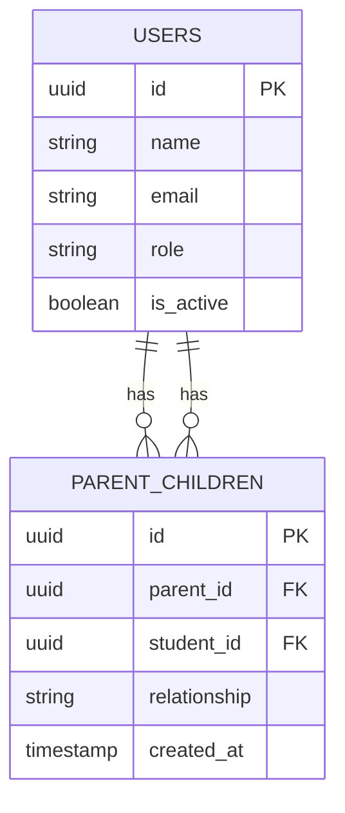
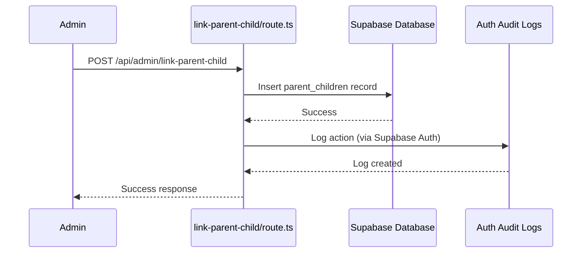

# Parent Management

<cite>
**Referenced Files in This Document**   
- [page.tsx](file://app/admin/parents/page.tsx)
- [create-user/route.ts](file://app/api/admin/create-user/route.ts)
- [link-parent-child/route.ts](file://app/api/admin/link-parent-child/route.ts)
- [unlink-parent-child/route.ts](file://app/api/admin/unlink-parent-child/route.ts)
- [20260105000003_create_parent_tables.sql](file://supabase/migrations/20260105000003_create_parent_tables.sql)
- [parent-store.ts](file://lib/parent-store.ts)
- [audit-logs.ts](file://lib/supabase/audit-logs.ts)
</cite>

## Table of Contents
1. [Introduction](#introduction)
2. [Parent Listing Interface](#parent-listing-interface)
3. [Creating Parent Accounts](#creating-parent-accounts)
4. [Linking and Unlinking Parent-Child Relationships](#linking-and-unlinking-parent-child-relationships)
5. [Database Constraints and RLS Policies](#database-constraints-and-rls-policies)
6. [Data Access for Parents](#data-access-for-parents)
7. [Common Issues and Validation Rules](#common-issues-and-validation-rules)
8. [Security and Audit Logging](#security-and-audit-logging)
9. [Best Practices](#best-practices)

## Introduction
The Parent Management feature within the User Management system enables administrators to manage parent accounts and establish relationships between parents and students. This documentation details the implementation of parent account creation, parent-child relationship management, database constraints, Row Level Security (RLS) policies, and audit logging. The system ensures data privacy while allowing parents read-only access to their children's academic information.

## Parent Listing Interface

The parent listing interface at `app/admin/parents/page.tsx` provides administrators with a comprehensive view of all parent accounts and their associated children. The interface features:

- Search functionality to filter parents by name or email
- A card-based layout displaying each parent's name, email, and number of linked children
- A dialog for linking parents to students with relationship type selection
- The ability to unlink parent-child relationships with confirmation
- Real-time data fetching from the `/api/admin/parents` and `/api/admin/students` endpoints

The interface uses React state management to handle search queries, loading states, and form inputs. It leverages Next.js App Router's server components for initial data fetching and client components for interactive features. The UI components are built using the application's design system with consistent styling and accessibility features.

**Section sources**
- [page.tsx](file://app/admin/parents/page.tsx#L1-L307)

## Creating Parent Accounts

Parent accounts are created through the `create-user/route.ts` API endpoint, which follows a secure administrative process:

1. **Authentication and Authorization**: The system verifies that the requesting user is authenticated and has admin privileges by checking their role in the users table.

2. **Rate Limiting**: The endpoint implements rate limiting using the client's IP address to prevent abuse, allowing 10 requests per 10 minutes.

3. **Password Management**: If no password is provided, the system generates a secure 12-character password with uppercase, lowercase, numbers, and special characters. All passwords are validated against complexity requirements.

4. **User Creation**: Using Supabase's service role key, the system creates both the authentication record and the corresponding database user record in a transactional manner.

5. **Role Assignment**: When creating a user with the "parent" role, the system sets the appropriate role field without creating role-specific profile data.

The process ensures that parent accounts are created securely with proper validation and error handling. The generated password is returned to the administrator for distribution to the parent.

**Section sources**
- [create-user/route.ts](file://app/api/admin/create-user/route.ts#L1-L156)

## Linking and Unlinking Parent-Child Relationships

The system provides dedicated API endpoints for managing parent-child relationships:

### Linking Process (`link-parent-child/route.ts`)
1. **Authentication**: Verifies the requesting user is authenticated
2. **Authorization**: Confirms the user has admin privileges
3. **Validation**: Checks that both parentId and studentId are provided
4. **Database Insertion**: Attempts to insert a record into the `parent_children` table
5. **Error Handling**: Specifically handles unique constraint violations (error code 23505) to prevent duplicate relationships

### Unlinking Process (`unlink-parent-child/route.ts`)
1. **Authentication and Authorization**: Same as linking process
2. **Validation**: Ensures both parentId and studentId are provided
3. **Database Deletion**: Removes the relationship record from the `parent_children` table using equality constraints on both parent_id and student_id
4. **Cascading Effects**: The ON DELETE CASCADE constraint automatically maintains referential integrity

Both endpoints follow REST principles with appropriate HTTP status codes and JSON responses. The client-side implementation in the parent management interface handles these API calls with error notifications and success feedback.

**Section sources**
- [link-parent-child/route.ts](file://app/api/admin/link-parent-child/route.ts#L1-L61)
- [unlink-parent-child/route.ts](file://app/api/admin/unlink-parent-child/route.ts#L1-L51)

## Database Constraints and RLS Policies

The parent management system relies on robust database constraints and Row Level Security (RLS) policies to maintain data integrity and security.

### Database Schema
The `parent_children` table includes:
- Composite primary key with UUID
- Foreign key constraints to users table with ON DELETE CASCADE
- Unique constraint on (parent_id, student_id) to prevent duplicate relationships
- Relationship field with CHECK constraint limiting values to 'mother', 'father', 'guardian', or 'other'
- Timestamp for record creation
- Indexes on both parent_id and student_id for query performance



**Diagram sources**
- [20260105000003_create_parent_tables.sql](file://supabase/migrations/20260105000003_create_parent_tables.sql#L6-L13)

### RLS Policies
The system implements the following RLS policies:

1. **Parent Visibility**: Parents can only view their own children relationships
```sql
CREATE POLICY "Parents can view their own children" ON parent_children
  FOR SELECT USING (parent_id = auth.uid());
```

2. **Admin Management**: Admins can manage all parent-child relationships
```sql
CREATE POLICY "Admin can manage all parent-child relationships" ON parent_children
  FOR ALL USING (EXISTS (SELECT 1 FROM users WHERE id = auth.uid() AND role = 'admin'));
```

3. **Data Access Policies**: Parents can view specific student data through relationship-based policies on grades, attendance, and class enrollments.

These policies ensure that data access is strictly controlled based on user roles and relationships, preventing unauthorized access while enabling appropriate data sharing.

**Section sources**
- [20260105000003_create_parent_tables.sql](file://supabase/migrations/20260105000003_create_parent_tables.sql#L19-L48)

## Data Access for Parents

Parents gain read-only access to their children's data through Supabase RLS policies that leverage the parent_children relationship table. The system implements a fine-grained access control model:

### Grades Access
Parents can view grades for students they are linked to:
```sql
CREATE POLICY "Parents can view their children's grades" ON grades
  FOR SELECT USING (
    EXISTS (
      SELECT 1 FROM parent_children pc 
      WHERE pc.parent_id = auth.uid() AND pc.student_id = grades.student_id
    )
  );
```

### Attendance Access
Similar policy for attendance records:
```sql
CREATE POLICY "Parents can view their children's attendance" ON attendance_records
  FOR SELECT USING (
    EXISTS (
      SELECT 1 FROM parent_children pc 
      WHERE pc.parent_id = auth.uid() AND pc.student_id = attendance_records.student_id
    )
  );
```

### Class Enrollment Access
Parents can view class enrollments:
```sql
CREATE POLICY "Parents can view their children's class enrollments" ON class_students
  FOR SELECT USING (
    EXISTS (
      SELECT 1 FROM parent_children pc 
      WHERE pc.parent_id = auth.uid() AND pc.student_id = class_students.student_id
    )
  );
```

This approach ensures that parents can only access data for students they are explicitly linked to, maintaining student privacy while providing necessary information to guardians. The policies are evaluated at the database level, providing a secure and efficient access control mechanism.

**Section sources**
- [20260105000003_create_parent_tables.sql](file://supabase/migrations/20260105000003_create_parent_tables.sql#L26-L48)

## Common Issues and Validation Rules

The parent management system addresses several common issues through validation rules and error handling:

### Orphaned Links
The ON DELETE CASCADE constraint on the parent_children table prevents orphaned links. When a user account is deleted, all associated parent-child relationships are automatically removed, maintaining referential integrity.

### Duplicate Parent Accounts
The system prevents duplicate parent accounts through:
- Unique constraint on user email addresses at the authentication level
- Application-level validation when creating new users
- Admin interface visibility of existing parents before creating new accounts

### Failed Relationship Creation
Common causes and handling:
- **Missing IDs**: Validation ensures both parent and student IDs are provided
- **Duplicate Relationships**: Unique constraint on (parent_id, student_id) with specific error messaging
- **Invalid User Types**: Foreign key constraints ensure only valid user IDs can be linked

### Validation Rules
Additional validation exists in the codebase:
- Guardian contact validation requiring at least one contact method
- Input sanitization for search queries
- Rate limiting to prevent abuse of API endpoints
- CSRF protection for all administrative actions

The system provides clear error messages to administrators while maintaining security by not exposing sensitive information in error responses.

**Section sources**
- [student-validation.ts](file://lib/student-validation.ts#L47-L78)
- [link-parent-child/route.ts](file://app/api/admin/link-parent-child/route.ts#L43-L48)
- [create-user/route.ts](file://app/api/admin/create-user/route.ts#L76-L80)

## Security and Audit Logging

The parent management system incorporates comprehensive security measures and audit logging:

### Security Features
- **Authentication**: JWT-based authentication with Supabase Auth
- **Authorization**: Role-based access control with admin verification
- **Rate Limiting**: Protection against brute force and denial-of-service attacks
- **Input Validation**: Server-side validation of all inputs
- **CSRF Protection**: Origin validation for all API requests
- **Password Security**: Complex password requirements and secure generation

### Audit Logging
All parent management actions are logged through Supabase's audit log system:

1. **Log Creation**: Administrative actions automatically generate audit log entries
2. **Log Structure**: Each entry includes user ID, action type, IP address, timestamp, and payload
3. **Log Access**: Admins can view audit logs through the `/api/audit-logs` endpoint
4. **Log Analysis**: The system provides utilities for filtering, searching, and analyzing logs



**Diagram sources**
- [link-parent-child/route.ts](file://app/api/admin/link-parent-child/route.ts#L34-L41)
- [audit-logs.ts](file://lib/supabase/audit-logs.ts#L5-L15)

The audit logging system enables administrators to track all changes to parent-child relationships, providing accountability and supporting compliance requirements. Security alerts can be configured to notify administrators of suspicious activity patterns.

**Section sources**
- [audit-logs.ts](file://lib/supabase/audit-logs.ts#L1-L321)
- [link-parent-child/route.ts](file://app/api/admin/link-parent-child/route.ts#L1-L61)

## Best Practices

### Managing Guardianship Changes
- **Documentation**: Maintain records of guardianship changes for legal and administrative purposes
- **Notification**: Notify all parties involved when guardianship relationships change
- **Transition Period**: Implement a grace period where both previous and new guardians have access
- **Verification**: Require documentation to verify guardianship changes when appropriate

### Multi-Child Associations
- **Consistent Relationships**: Use standardized relationship types (mother, father, guardian, other)
- **Primary Contact**: Designate a primary contact parent for emergency communications
- **Access Control**: Ensure each parent can only access their own children's data
- **Bulk Operations**: Provide interfaces for managing multiple children efficiently

### General Recommendations
- **Regular Audits**: Periodically review parent-child relationships for accuracy
- **Data Privacy**: Train staff on data privacy requirements and FERPA compliance
- **Parent Education**: Provide guidance to parents on using the system effectively
- **Backup Procedures**: Maintain backups of relationship data for disaster recovery
- **Testing**: Regularly test the system with edge cases to ensure robustness

Following these best practices ensures that the parent management system operates securely, efficiently, and in compliance with educational privacy standards.