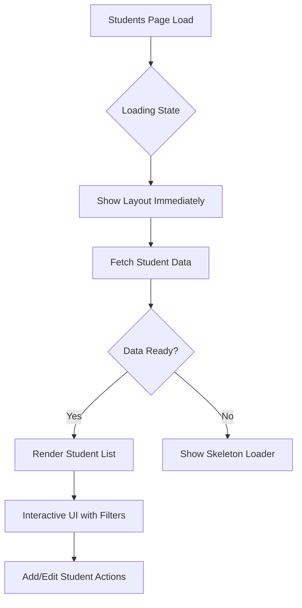
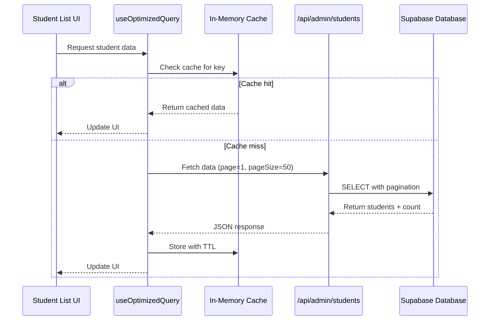
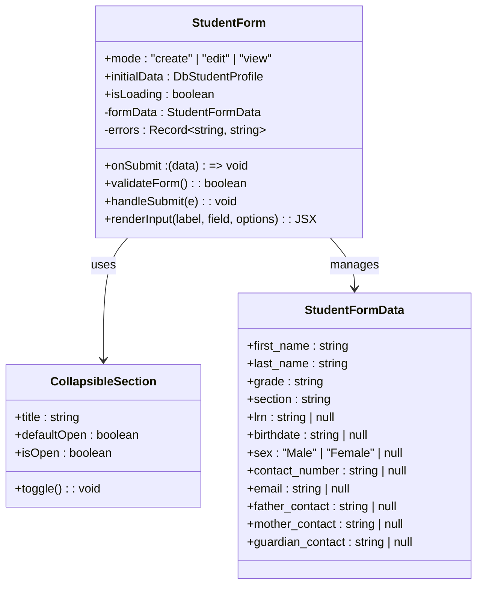
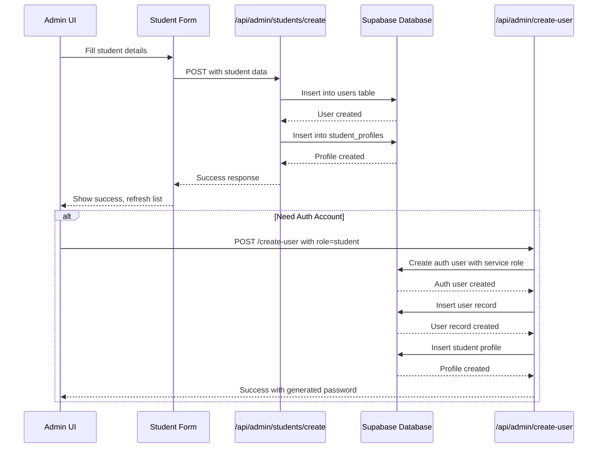
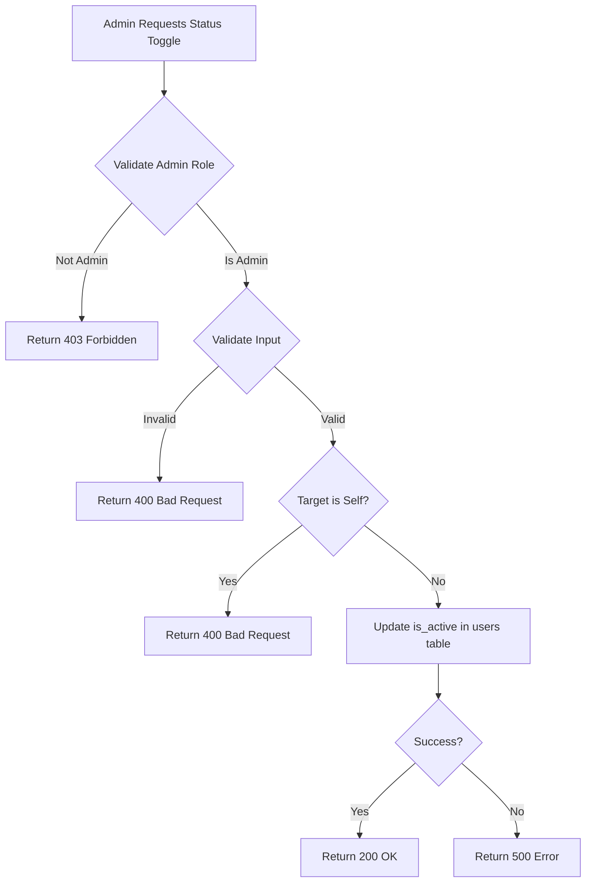
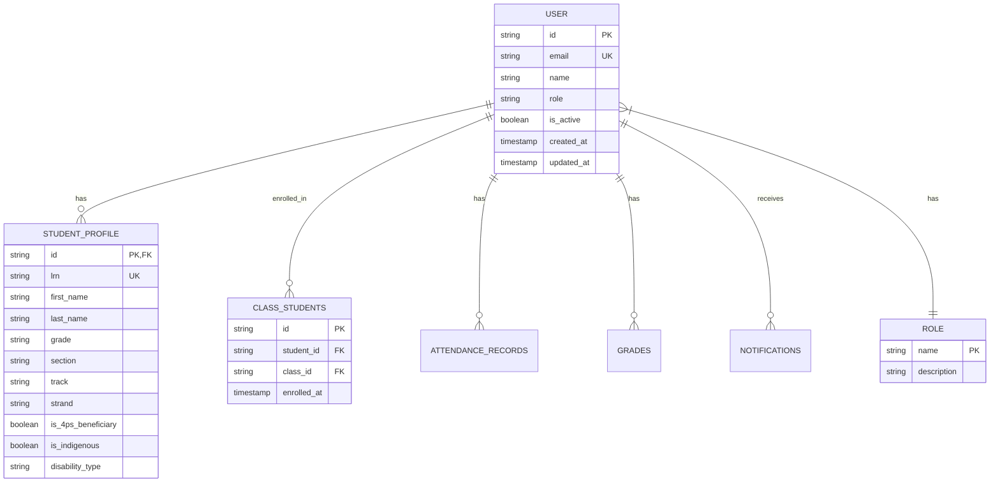

# Student Management

<cite>
**Referenced Files in This Document**   
- [page.tsx](file://app/admin/students/page.tsx)
- [loading.tsx](file://app/admin/students/loading.tsx)
- [student-form.tsx](file://components/student-form.tsx)
- [create-user/route.ts](file://app/api/admin/create-user/route.ts)
- [toggle-user-status/route.ts](file://app/api/admin/toggle-user-status/route.ts)
- [api-errors.ts](file://lib/api-errors.ts)
- [use-optimized-query.ts](file://lib/hooks/use-optimized-query.ts)
- [students/route.ts](file://app/api/admin/students/route.ts)
- [students/create/route.ts](file://app/api/admin/students/create/route.ts)
- [student-validation.ts](file://lib/student-validation.ts)
- [cache.ts](file://lib/cache.ts)
- [validation-schemas.ts](file://lib/validation-schemas.ts)
- [deped-constants.ts](file://lib/deped-constants.ts)
- [types.ts](file://lib/supabase/types.ts)
</cite>

## Table of Contents
1. [Introduction](#introduction)
2. [UI Implementation and Loading States](#ui-implementation-and-loading-states)
3. [Data Fetching and Query Optimization](#data-fetching-and-query-optimization)
4. [Student Form and Validation](#student-form-and-validation)
5. [API Flow for Student Creation](#api-flow-for-student-creation)
6. [Status Toggling and Login Access](#status-toggling-and-login-access)
7. [Error Handling and Common Issues](#error-handling-and-common-issues)
8. [Performance Optimizations](#performance-optimizations)
9. [Conclusion](#conclusion)

## Introduction
The Student Management feature within User Management provides a comprehensive interface for administrators to manage student records, including creation, editing, enrollment, and status management. This system integrates with Supabase for authentication and database operations, implements Row Level Security (RLS) for data protection, and follows DepEd (Department of Education Philippines) requirements for student profile data. The feature includes optimized data fetching, form validation, error handling, and performance enhancements to ensure a smooth administrative experience.

## UI Implementation and Loading States

The student management interface is implemented in `app/admin/students/page.tsx` as a client-side React component that displays a list of students with filtering and search capabilities. The UI includes:

- A dashboard header with title and subtitle
- Statistics cards showing student counts by grade level
- Search and filter controls for grade and search terms
- An "Add Student" dialog containing the student form
- A data table displaying student information with view details actions

The loading state is handled by `app/admin/students/loading.tsx`, which returns `null` during navigation. This leverages Next.js App Router's streaming capabilities to show the layout immediately while the student data loads, providing a better user experience than a full-page loader.



**Diagram sources**
- [page.tsx](file://app/admin/students/page.tsx#L1-L325)
- [loading.tsx](file://app/admin/students/loading.tsx#L1-L4)

**Section sources**
- [page.tsx](file://app/admin/students/page.tsx#L1-L325)
- [loading.tsx](file://app/admin/students/loading.tsx#L1-L4)

## Data Fetching and Query Optimization

Student data is fetched using the `use-optimized-query.ts` hook which provides caching, deduplication, and retry logic for transient failures. The hook uses an in-memory cache with a 30-second TTL to prevent duplicate API calls.

The student list API endpoint at `app/api/admin/students/route.ts` implements several optimizations:

- **Pagination**: Supports page and pageSize parameters with validation
- **Rate Limiting**: Prevents scraping with IP-based rate limiting
- **Search Sanitization**: Sanitizes search input to prevent SQL injection
- **Count Optimization**: Uses `count: 'exact'` for accurate pagination



**Diagram sources**
- [use-optimized-query.ts](file://lib/hooks/use-optimized-query.ts#L1-L275)
- [students/route.ts](file://app/api/admin/students/route.ts#L1-L116)
- [cache.ts](file://lib/cache.ts#L1-L128)

**Section sources**
- [use-optimized-query.ts](file://lib/hooks/use-optimized-query.ts#L1-L275)
- [students/route.ts](file://app/api/admin/students/route.ts#L1-L116)
- [cache.ts](file://lib/cache.ts#L1-L128)

## Student Form and Validation

The student form is implemented as a reusable component in `components/student-form.tsx` with collapsible sections for different categories of information. The form includes:

- Basic Information (LRN, name, birthdate, sex)
- Contact & Address (current and permanent addresses)
- Parent/Guardian Information (father, mother, guardian)
- Academic Information (grade, section, enrollment status)
- DepEd Required Information (4Ps, indigenous status)
- Health & Special Needs (disabilities, emergency contact)

Form validation is handled client-side with real-time error checking and includes:

- **LRN Validation**: Ensures 12-digit numeric format
- **Contact Validation**: Requires at least one parent/guardian contact
- **Email Validation**: Standard email format checking
- **Required Fields**: First and last name are mandatory



**Diagram sources**
- [student-form.tsx](file://components/student-form.tsx#L1-L741)
- [student-validation.ts](file://lib/student-validation.ts#L1-L79)
- [deped-constants.ts](file://lib/deped-constants.ts#L1-L256)

**Section sources**
- [student-form.tsx](file://components/student-form.tsx#L1-L741)
- [student-validation.ts](file://lib/student-validation.ts#L1-L79)
- [deped-constants.ts](file://lib/deped-constants.ts#L1-L256)

## API Flow for Student Creation

The student creation process involves multiple API endpoints and Supabase operations. When an admin creates a student through the form, the following flow occurs:

1. The form data is submitted to `/api/admin/students/create`
2. The API validates the admin's role and required fields
3. A user record is created in the `users` table with role "student"
4. A corresponding profile is created in the `student_profiles` table
5. The response returns success status and the new student ID

For students who need authentication accounts, the `create-user/route.ts` endpoint is used, which:

- Verifies the caller is an admin
- Generates a secure random password if none provided
- Enforces strong password complexity requirements
- Creates both authentication and database records
- Returns the generated password to the admin



**Diagram sources**
- [students/create/route.ts](file://app/api/admin/students/create/route.ts#L1-L165)
- [create-user/route.ts](file://app/api/admin/create-user/route.ts#L1-L156)
- [types.ts](file://lib/supabase/types.ts#L1-L253)

**Section sources**
- [students/create/route.ts](file://app/api/admin/students/create/route.ts#L1-L165)
- [create-user/route.ts](file://app/api/admin/create-user/route.ts#L1-L156)

## Status Toggling and Login Access

The `toggle-user-status/route.ts` API endpoint allows administrators to deactivate or reactivate user accounts. This feature controls login access by setting the `is_active` flag in the users table.

Key security features of this endpoint include:

- **Admin Verification**: Only users with "admin" role can toggle status
- **Self-Protection**: Prevents admins from disabling their own accounts
- **Input Validation**: Uses Zod schema to validate userId and status
- **Error Handling**: Centralized error handling through `api-errors.ts`

When a student's status is set to inactive (`is_active = false`), they are prevented from logging in through the authentication system. This provides a soft delete mechanism that preserves data while revoking access.



**Diagram sources**
- [toggle-user-status/route.ts](file://app/api/admin/toggle-user-status/route.ts#L1-L62)
- [api-errors.ts](file://lib/api-errors.ts#L1-L116)

**Section sources**
- [toggle-user-status/route.ts](file://app/api/admin/toggle-user-status/route.ts#L1-L62)

## Error Handling and Common Issues

The system implements comprehensive error handling through the `api-errors.ts` module, which provides centralized error responses to prevent information disclosure. Common error types include:

- **Unauthorized (401)**: User not authenticated
- **Forbidden (403)**: User lacks required permissions
- **Bad Request (400)**: Invalid input parameters
- **Rate Limited (429)**: Too many requests from same IP
- **Validation Error (422)**: Input validation failed

Common issues that may occur during student management include:

- **Duplicate LRNs**: The system should check for existing LRNs before creation
- **Enrollment Conflicts**: Students cannot be enrolled in the same class twice
- **Failed Avatar Uploads**: Storage bucket permissions or network issues
- **Form Validation Errors**: Missing required fields or invalid formats

The error handling strategy follows security best practices by never exposing raw database or system errors to clients, while logging full details server-side for debugging.



**Diagram sources**
- [api-errors.ts](file://lib/api-errors.ts#L1-L116)
- [types.ts](file://lib/supabase/types.ts#L1-L253)
- [validation-schemas.ts](file://lib/validation-schemas.ts#L1-L126)

**Section sources**
- [api-errors.ts](file://lib/api-errors.ts#L1-L116)

## Performance Optimizations

The student management system implements several performance optimizations:

- **Query Caching**: Client-side caching with 30-second TTL prevents duplicate API calls
- **Pagination**: Server-side pagination limits result sets and improves load times
- **Debounced Search**: Search input is debounced by 300ms to reduce re-renders
- **Optimized Queries**: Database queries select only needed fields and use proper indexing
- **Batch Operations**: Bulk insert/update operations for grades and attendance

The `use-optimized-query.ts` hook provides automatic caching and deduplication, while the server-side API routes implement rate limiting to prevent abuse. The student list uses virtualized rendering through the DataTable component to handle large datasets efficiently.

```mermaid
graph TD
A[Performance Optimizations] --> B[Client-Side]
A --> C[Server-Side]
B --> B1[Query Caching (30s TTL)]
B --> B2[Debounced Search (300ms)]
B --> B3[Virtualized Rendering]
B --> B4[Optimized State Updates]
C --> C1[Pagination Support]
C --> C2[Rate Limiting]
C --> C3[Search Input Sanitization]
C --> C4[Efficient Database Queries]
C --> C5[Connection Pooling]
D[Result] --> E[Faster Load Times]
D --> F[Reduced Server Load]
D --> G[Improved User Experience]
```

**Diagram sources**
- [use-optimized-query.ts](file://lib/hooks/use-optimized-query.ts#L1-L275)
- [cache.ts](file://lib/cache.ts#L1-L128)
- [students/route.ts](file://app/api/admin/students/route.ts#L1-L116)

**Section sources**
- [use-optimized-query.ts](file://lib/hooks/use-optimized-query.ts#L1-L275)
- [cache.ts](file://lib/cache.ts#L1-L128)

## Conclusion
The Student Management feature provides a robust, secure, and efficient interface for administrators to manage student records. By leveraging Next.js App Router, Supabase, and optimized data fetching patterns, the system delivers a responsive user experience while maintaining data integrity and security. The implementation follows DepEd requirements for student data, includes comprehensive validation and error handling, and provides performance optimizations for handling large datasets. Administrators can create, edit, and manage student accounts with confidence, knowing that the system enforces proper access controls and data validation at every level.