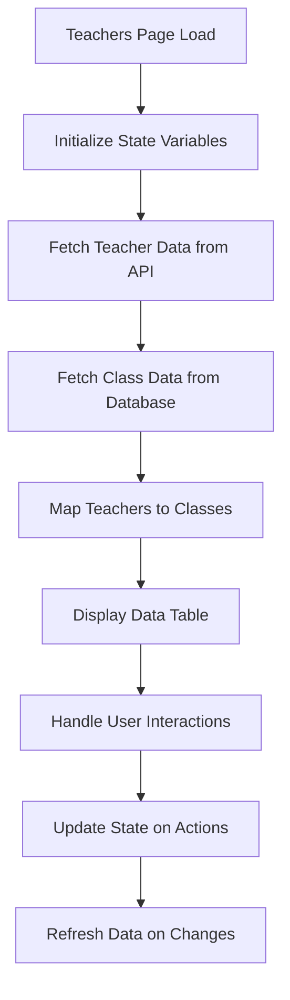
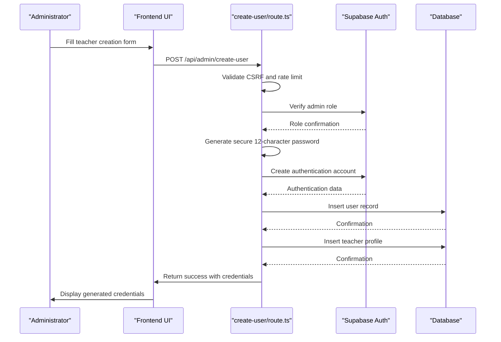
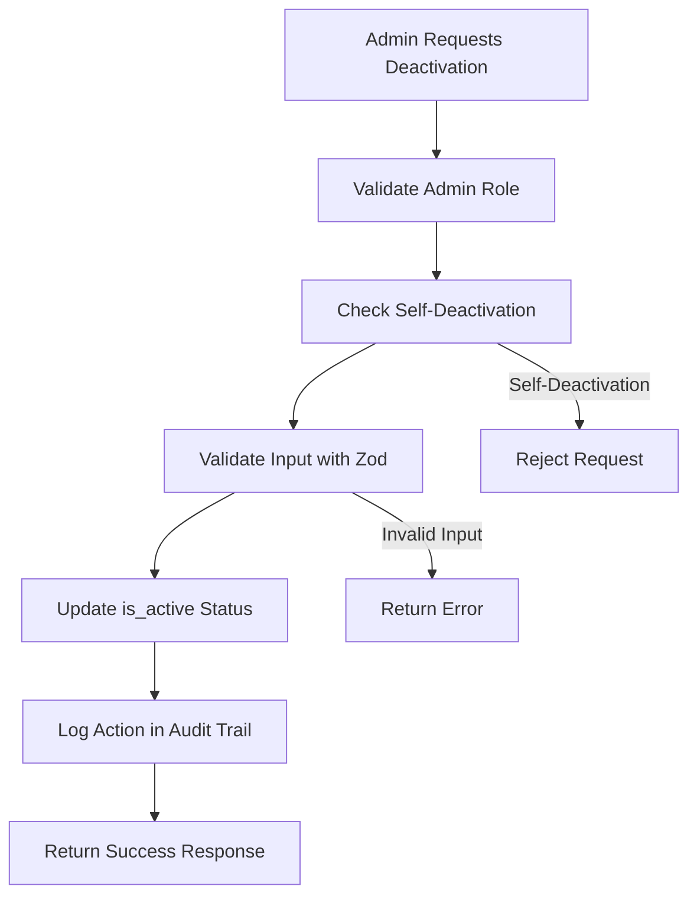
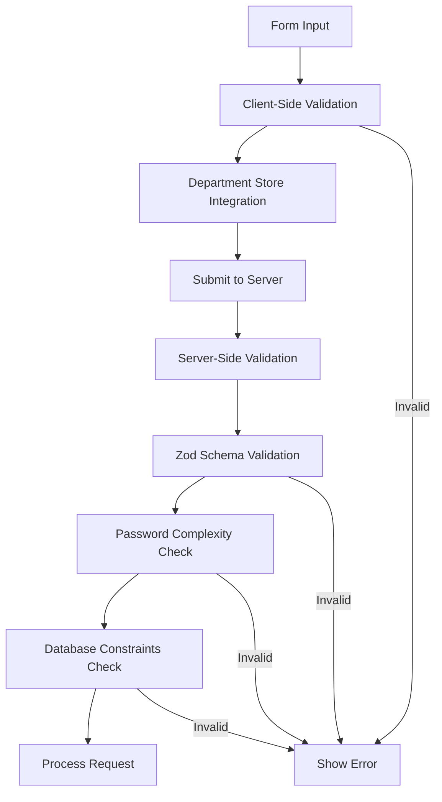

# Teacher Management

<cite>
**Referenced Files in This Document**   
- [page.tsx](file://app/admin/teachers/page.tsx)
- [route.ts](file://app/api/admin/create-user/route.ts)
- [route.ts](file://app/api/admin/toggle-user-status/route.ts)
- [department-store.ts](file://lib/department-store.ts)
- [validation-schemas.ts](file://lib/validation-schemas.ts)
- [route.ts](file://app/api/admin/teachers/route.ts)
- [create_users_table.sql](file://supabase/migrations/20251219043432_create_users_table.sql)
- [types.ts](file://lib/supabase/types.ts)
</cite>

## Table of Contents
1. [Introduction](#introduction)
2. [Teacher Listing and Status Management](#teacher-listing-and-status-management)
3. [User Creation Process](#user-creation-process)
4. [Deactivation Workflows](#deactivation-workflows)
5. [Teacher-Class Relationships](#teacher-class-relationships)
6. [Validation and Department Integration](#validation-and-department-integration)
7. [Common Issues and Error Recovery](#common-issues-and-error-recovery)
8. [Bulk Operations](#bulk-operations)

## Introduction
The Teacher Management feature provides administrators with comprehensive tools to manage teaching staff within the school system. This documentation details the implementation of teacher listing, status management, user creation, and deactivation workflows. The system integrates with department management and ensures proper validation of teacher-specific fields. The feature enables administrators to efficiently manage teacher accounts, link profiles to login credentials, and maintain accurate records of teaching assignments and class ownership.

## Teacher Listing and Status Management
The teacher listing interface in `page.tsx` provides a comprehensive view of all teaching staff with filtering and search capabilities. The component implements real-time updates through periodic data fetching and state management.

The interface displays key teacher information including name, email, subject specialization, department, contact information, and join date. Administrators can filter teachers by department using a dropdown selector that pulls department data from the `useDepartmentStore` hook. A search function allows filtering by name or email.

Loading states are managed through the `loading` state variable, which displays a spinner during data retrieval. The component fetches teacher data from the `/api/admin/teachers` endpoint and class data from the Supabase database to establish teacher-class relationships.



**Diagram sources**
- [page.tsx](file://app/admin/teachers/page.tsx#L58-L733)

**Section sources**
- [page.tsx](file://app/admin/teachers/page.tsx#L58-L733)

## User Creation Process
The user creation process for teachers is implemented in `create-user/route.ts` and follows a secure, server-side workflow. When an administrator creates a new teacher account, the system generates a strong password automatically on the server side, ensuring that passwords are never transmitted or stored insecurely.

The process begins with CSRF validation and rate limiting to prevent abuse. The system verifies that the requesting user has administrative privileges before proceeding. The API endpoint accepts teacher-specific information including name, email, subject specialization, department, phone, and address.



**Diagram sources**
- [route.ts](file://app/api/admin/create-user/route.ts#L8-L156)
- [page.tsx](file://app/admin/teachers/page.tsx#L207-L243)

**Section sources**
- [route.ts](file://app/api/admin/create-user/route.ts#L8-L156)
- [page.tsx](file://app/admin/teachers/page.tsx#L207-L243)

## Deactivation Workflows
The deactivation workflow for teachers is implemented in `toggle-user-status/route.ts` and follows a secure process to disable teacher accounts while maintaining data integrity. The system prevents administrators from deactivating their own accounts to ensure system accessibility.

When a teacher account is deactivated, the `is_active` field in the users table is set to false. This change immediately prevents the teacher from logging into the system. The deactivation process has implications for class ownership and grade access, as deactivated teachers lose access to their classes, lessons, and grading responsibilities.

The API endpoint validates input using Zod schema validation to prevent injection attacks and ensure data integrity. The system logs the status change in the audit logs for accountability and compliance purposes.



**Diagram sources**
- [route.ts](file://app/api/admin/toggle-user-status/route.ts#L1-L62)

**Section sources**
- [route.ts](file://app/api/admin/toggle-user-status/route.ts#L1-L62)

## Teacher-Class Relationships
Teacher records are linked to classes through the `teacher_id` foreign key in the classes table. This relationship establishes class ownership and determines which teacher is responsible for managing specific classes, lessons, and grades.

The system displays these relationships in the teacher management interface, showing which classes each teacher is assigned to. The `getTeacherClasses` function in `page.tsx` filters the class data to show only classes associated with a specific teacher.

When a teacher is deactivated, the system maintains the class records but sets the `teacher_id` to null, preserving historical data while reassigning current teaching responsibilities. This approach ensures that grade records and lesson history remain intact for academic reporting and compliance purposes.

```mermaid
erDiagram
USERS {
string id PK
string email UK
string name
string role
boolean is_active
string phone
string address
}
TEACHER_PROFILES {
string id PK FK
string subject
string department
date join_date
}
CLASSES {
string id PK
string name
string grade
string section
string subject
string teacher_id FK
string room
string schedule
}
USERS ||--|| TEACHER_PROFILES : "1:1"
USERS }|--o{ CLASSES : "teaches"
```

**Diagram sources**
- [page.tsx](file://app/admin/teachers/page.tsx#L203-L205)
- [create_users_table.sql](file://supabase/migrations/20251219043432_create_users_table.sql#L1-L32)
- [types.ts](file://lib/supabase/types.ts#L107-L112)

**Section sources**
- [page.tsx](file://app/admin/teachers/page.tsx#L203-L205)

## Validation and Department Integration
The system implements comprehensive validation for teacher-specific fields through integration with the `department-store.ts` module. The `useDepartmentStore` hook provides access to the list of available departments, ensuring that teachers are assigned to valid departments.

Teacher-specific fields such as subject and department are validated both on the client side and server side. The client-side interface uses the department store to populate the department dropdown, while the server-side validation ensures data integrity. The join date is automatically set to the current date when a teacher profile is created.

The system also enforces strong password policies for generated passwords, requiring a minimum of 12 characters with uppercase, lowercase, numbers, and special characters. Email addresses are validated for proper format, and duplicate email addresses are prevented through database constraints.



**Diagram sources**
- [department-store.ts](file://lib/department-store.ts#L1-L62)
- [page.tsx](file://app/admin/teachers/page.tsx#L81-L89)
- [route.ts](file://app/api/admin/create-user/route.ts#L56-L80)

**Section sources**
- [department-store.ts](file://lib/department-store.ts#L1-L62)
- [page.tsx](file://app/admin/teachers/page.tsx#L81-L89)

## Common Issues and Error Recovery
Several common issues may arise during teacher management operations, including role misassignment during creation, failed email invitations, and conflicts with existing accounts. The system provides specific error handling for these scenarios.

Role misassignment is prevented through server-side validation that checks the role parameter against allowed values (admin, teacher, student). If an invalid role is specified, the API returns a 400 error response. Failed email invitations typically occur due to invalid email formats or email delivery issues, which are handled by returning appropriate error messages to the administrator.

Conflicts with existing accounts are managed through database constraints that enforce unique email addresses. When attempting to create a teacher with an existing email, the system returns a clear error message. The interface also prevents administrators from deactivating their own accounts, avoiding lockout scenarios.

Error recovery procedures include retrying failed operations after correcting input data, verifying email addresses before creation, and using the audit logs to track and resolve issues. The system provides toast notifications to inform administrators of success or failure states.

**Section sources**
- [route.ts](file://app/api/admin/create-user/route.ts#L96-L117)
- [route.ts](file://app/api/admin/toggle-user-status/route.ts#L46-L48)
- [page.tsx](file://app/admin/teachers/page.tsx#L110-L112)

## Bulk Operations
While the current implementation focuses on individual teacher management, the system architecture supports potential bulk operations through its API design and data model. Bulk operations could include importing multiple teachers from a CSV file, updating department assignments for multiple teachers, or deactivating multiple accounts simultaneously.

The API endpoints are designed to handle individual operations securely, and extending them to support bulk operations would require additional validation and rate limiting considerations. The data model supports these operations through the use of foreign keys and proper indexing, as evidenced by the database migration files that include performance indexes.

Any bulk operation implementation would need to maintain the same security standards as individual operations, including CSRF protection, rate limiting, and role verification. The system would also need to provide progress feedback and error reporting for individual items within bulk operations.

**Section sources**
- [create_users_table.sql](file://supabase/migrations/20251219043432_create_users_table.sql#L1-L32)
- [performance_indexes.sql](file://supabase/migrations/20260108112143_performance_indexes.sql#L1-L26)