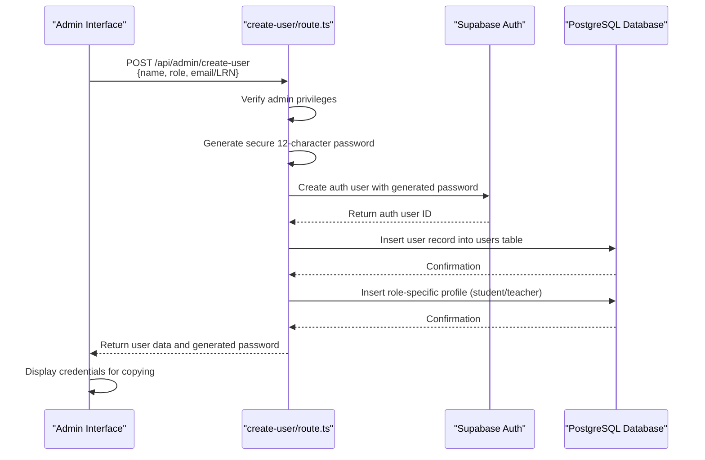
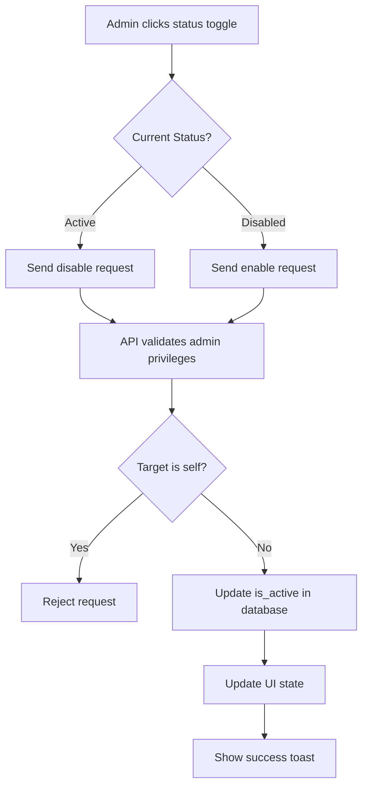
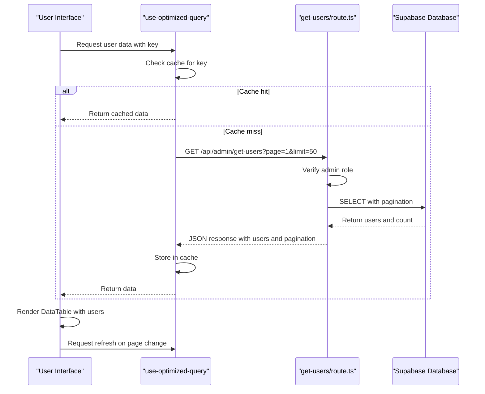
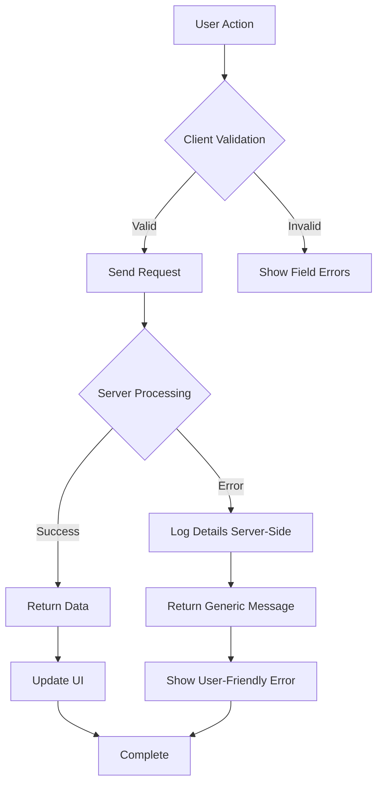

# User Management

<cite>
**Referenced Files in This Document**   
- [users/page.tsx](file://app/admin/users/page.tsx)
- [student-form.tsx](file://components/student-form.tsx)
- [create-user/route.ts](file://app/api/admin/create-user/route.ts)
- [toggle-user-status/route.ts](file://app/api/admin/toggle-user-status/route.ts)
- [get-users/route.ts](file://app/api/admin/get-users/route.ts)
- [use-optimized-query.ts](file://lib/hooks/use-optimized-query.ts)
- [api-errors.ts](file://lib/api-errors.ts)
- [20251219043432_create_users_table.sql](file://supabase/migrations/20251219043432_create_users_table.sql)
- [20251219084313_add_is_active_column.sql](file://supabase/migrations/20251219084313_add_is_active_column.sql)
- [20251219044036_add_rls_policies.sql](file://supabase/migrations/20251219044036_add_rls_policies.sql)
- [types.ts](file://lib/supabase/types.ts)
- [database.types.ts](file://lib/database.types.ts)
</cite>

## Table of Contents
1. [Introduction](#introduction)
2. [User Account Management Interface](#user-account-management-interface)
3. [User Creation Process](#user-creation-process)
4. [User Status Management](#user-status-management)
5. [Data Flow and API Integration](#data-flow-and-api-integration)
6. [Supabase Integration and RLS Policies](#supabase-integration-and-rls-policies)
7. [Student Profile Management](#student-profile-management)
8. [Error Handling and Validation](#error-handling-and-validation)
9. [Configuration Options](#configuration-options)
10. [Common Issues and Solutions](#common-issues-and-solutions)

## Introduction
The User Management sub-feature of the Admin Dashboard provides a centralized interface for administrators to manage student, teacher, parent, and staff accounts. This comprehensive system enables the creation of user accounts, status toggling (active/inactive), and listing of all users with filtering capabilities. The implementation integrates with Supabase for authentication and database operations, employing Row Level Security (RLS) policies to ensure data protection. The system follows a secure approach by generating strong passwords automatically and implementing rate limiting to prevent abuse. User data is organized across multiple tables with role-specific profiles, and the interface provides real-time feedback through notifications and optimized data querying.

## User Account Management Interface
The user management interface provides a comprehensive dashboard for administrators to view, filter, and create user accounts. The interface displays user information including name, email, role, creation date, and status, with visual indicators for different user roles and account statuses. Administrators can filter users by role and search by name or email. The interface includes a pagination system that loads 50 users per page to ensure optimal performance when dealing with large datasets. When creating a new user, administrators are presented with a modal dialog that adapts based on the selected role, requiring either an email address for teachers and parents or an LRN (Learner Reference Number) for students. After successful creation, the system displays the generated credentials which can be copied to the clipboard for secure sharing with the user.

**Section sources**
- [users/page.tsx](file://app/admin/users/page.tsx#L34-L464)

## User Creation Process
The user creation process begins with the administrator filling out a form with the user's name, role, and role-specific identifier (email for non-students, LRN for students). When the form is submitted, the frontend sends a request to the `/api/admin/create-user` endpoint without including a password, as the system generates a secure password automatically. The backend verifies that the requesting user is an administrator before proceeding. The password generation algorithm creates a 12-character string with uppercase letters, lowercase letters, numbers, and special characters to ensure strong security. The system then creates both an authentication record in Supabase Auth and a corresponding user record in the public users table. For students, a student profile is automatically created with default values, while teachers receive a teacher profile. The generated password is returned to the admin interface for secure transmission to the new user, who will be required to change it on first login.



**Diagram sources**
- [create-user/route.ts](file://app/api/admin/create-user/route.ts#L8-L156)
- [users/page.tsx](file://app/admin/users/page.tsx#L113-L165)

## User Status Management
The user status management system allows administrators to enable or disable user accounts without deleting them, preserving user data while preventing access. This is implemented through the `is_active` boolean column in the users table, which is checked during authentication. The toggle functionality is accessed through a simple button in the user list that changes appearance based on the current status (green checkmark for active, red ban icon for disabled). When toggled, the frontend sends a request to the `/api/admin/toggle-user-status` endpoint with the user ID and desired status. The backend validates that the requesting user is an administrator and implements a security measure that prevents administrators from disabling their own accounts. The RLS policies ensure that only administrators can modify the `is_active` status of users. This approach provides a safe way to temporarily suspend accounts for disciplinary reasons or suspected compromise without losing any associated data or history.



**Diagram sources**
- [toggle-user-status/route.ts](file://app/api/admin/toggle-user-status/route.ts#L15-L62)
- [users/page.tsx](file://app/admin/users/page.tsx#L73-L93)

## Data Flow and API Integration
The data flow for user management follows a structured pattern from the UI components through API routes to the database and back. The `student-form.tsx` component handles the collection of student information with comprehensive validation, while the user management page uses the `use-optimized-query` hook for efficient data retrieval. When loading the user list, the frontend calls the `/api/admin/get-users` endpoint with pagination parameters (page and limit) to retrieve data in manageable chunks. The backend verifies admin privileges and returns paginated user data with exact counts for proper pagination controls. The `use-optimized-query` hook implements client-side caching with a 30-second TTL and automatic deduplication to prevent multiple simultaneous requests for the same data. It also includes retry logic with exponential backoff for transient network failures, enhancing reliability in unstable network conditions. This optimized querying approach reduces server load and improves the user experience by minimizing loading times and preventing duplicate requests.



**Diagram sources**
- [get-users/route.ts](file://app/api/admin/get-users/route.ts#L4-L59)
- [use-optimized-query.ts](file://lib/hooks/use-optimized-query.ts#L28-L123)
- [users/page.tsx](file://app/admin/users/page.tsx#L54-L71)

## Supabase Integration and RLS Policies
The user management system integrates with Supabase for both authentication and database operations, implementing robust security through Row Level Security (RLS) policies. The database schema includes a `users` table with core user information and role-specific profile tables (`student_profiles` and `teacher_profiles`) that are linked by foreign key relationships. The `is_active` column, added through a migration, enables account status management without deletion. RLS policies restrict data access based on user roles: regular users can only read, insert, and update their own data, while administrators have broader access through dedicated API routes that verify their role server-side. The system uses Supabase's service role key for user creation, which bypasses RLS policies for administrative operations while maintaining security through explicit permission checks. This multi-layered approach ensures that even if an attacker gains access to a client-side token, they cannot escalate privileges or access data they shouldn't.

```mermaid
erDiagram
users {
uuid id PK
string email UK
string name
string role
boolean is_active
boolean must_change_password
timestamp created_at
timestamp updated_at
}
student_profiles {
uuid id PK FK
string lrn UK
string grade
string section
date enrollment_date
}
teacher_profiles {
uuid id PK FK
string subject
string department
date join_date
}
users ||--o| student_profiles : "1:1"
users ||--o| teacher_profiles : "1:1"
```

**Diagram sources**
- [20251219043432_create_users_table.sql](file://supabase/migrations/20251219043432_create_users_table.sql#L1-L32)
- [20251219084313_add_is_active_column.sql](file://supabase/migrations/20251219084313_add_is_active_column.sql#L1-L6)
- [20251219044036_add_rls_policies.sql](file://supabase/migrations/20251219044036_add_rls_policies.sql#L1-L22)

## Student Profile Management
The student profile management system provides a comprehensive form for collecting all required information for student enrollment, following DepEd (Department of Education) standards. The `student-form.tsx` component organizes information into collapsible sections including Basic Information, Contact & Address, Parent/Guardian Information, Academic Information, DepEd Required Information, and Health & Special Needs. The form includes client-side validation for critical fields like LRN (Learner Reference Number) and ensures that at least one parent or guardian contact method is provided. For Senior High School students (grades 11-12), the form dynamically displays track and strand selection options, with strands filtered based on the selected track. The form handles the special case where permanent address is the same as current address through a checkbox that conditionally hides the permanent address fields. When editing existing profiles, the form enters "edit" mode with appropriate submit button text, and a "view" mode is available for read-only display of student information.

**Section sources**
- [student-form.tsx](file://components/student-form.tsx#L1-L741)

## Error Handling and Validation
The system implements comprehensive error handling at both the client and server levels to provide meaningful feedback while maintaining security. Client-side validation occurs in the user interface components, preventing submission of incomplete forms and providing immediate feedback on field errors. Server-side validation is implemented using Zod for the toggle user status endpoint, ensuring that user IDs are properly formatted UUIDs and status values are booleans. The `api-errors.ts` module provides a centralized error handling system that prevents information disclosure by never exposing raw error messages to clients. Instead, generic error messages are returned while detailed error information is logged server-side for debugging. The system includes specific validation for password complexity, requiring at least 12 characters with uppercase, lowercase, numbers, and special characters. Input sanitization is performed to prevent SQL injection and other attacks, with search inputs cleaned and special characters escaped before database queries.



**Diagram sources**
- [api-errors.ts](file://lib/api-errors.ts#L1-L116)
- [create-user/route.ts](file://app/api/admin/create-user/route.ts#L70-L80)
- [toggle-user-status/route.ts](file://app/api/admin/toggle-user-status/route.ts#L35-L42)

## Configuration Options
The user management system includes several configurable options that can be adjusted to meet institutional requirements. User roles are defined as "admin", "teacher", "student", and "parent", with corresponding profile information stored in separate tables. The `is_active` column allows for account status management, enabling institutions to temporarily disable accounts without deletion. Password policies are enforced server-side, requiring a minimum of 12 characters with mixed case, numbers, and special characters. The system supports bulk operations through the UI, allowing administrators to create multiple accounts sequentially using the "Create Another" button after successful creation. Pagination is configured to display 50 users per page, with total counts provided for accurate pagination controls. The optimized query system includes configurable cache times (default 30 seconds) and retry behavior (maximum 3 retries with exponential backoff) to balance freshness and reliability.

**Section sources**
- [types.ts](file://lib/supabase/types.ts#L2-L37)
- [database.types.ts](file://lib/database.types.ts#L368-L408)
- [use-optimized-query.ts](file://lib/hooks/use-optimized-query.ts#L36-L37)

## Common Issues and Solutions
Several common issues may arise during user management operations, with specific solutions implemented in the system. Failed user creation due to validation constraints is handled by comprehensive client and server validation, with clear error messages guiding administrators to correct issues like missing required fields or invalid LRN formats. Role misassignment is prevented by the UI design, which requires role selection before showing role-specific fields, and by server-side verification that only administrators can create accounts. Password-related issues are minimized by the system's automatic generation of strong, compliant passwords. Account lockout scenarios are addressed through the `is_active` flag rather than password resets, allowing administrators to quickly restore access. For users who cannot access their accounts, the system supports the "must_change_password" flag, which forces a password change on first login. Rate limiting is implemented to prevent abuse of the user creation endpoint, with a limit of 10 requests per 10 minutes per IP address, preventing automated account creation attacks.

**Section sources**
- [create-user/route.ts](file://app/api/admin/create-user/route.ts#L15-L21)
- [api-errors.ts](file://lib/api-errors.ts#L64-L65)
- [student-validation.ts](file://lib/student-validation.ts)