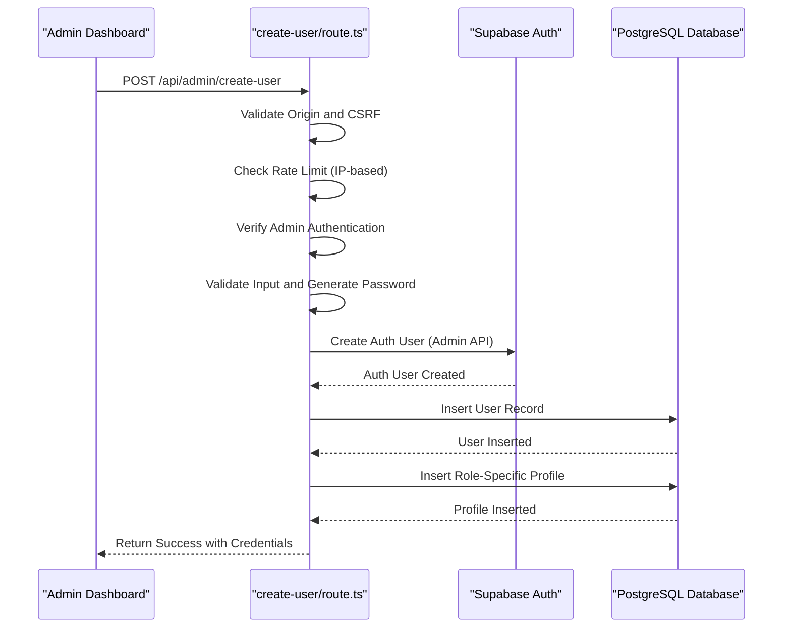
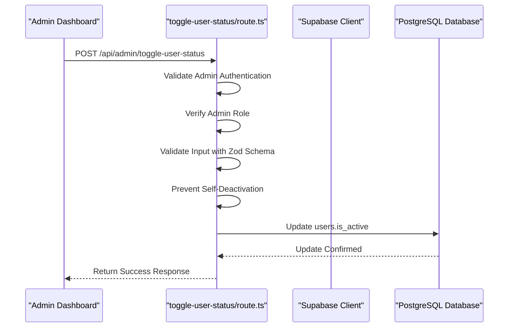
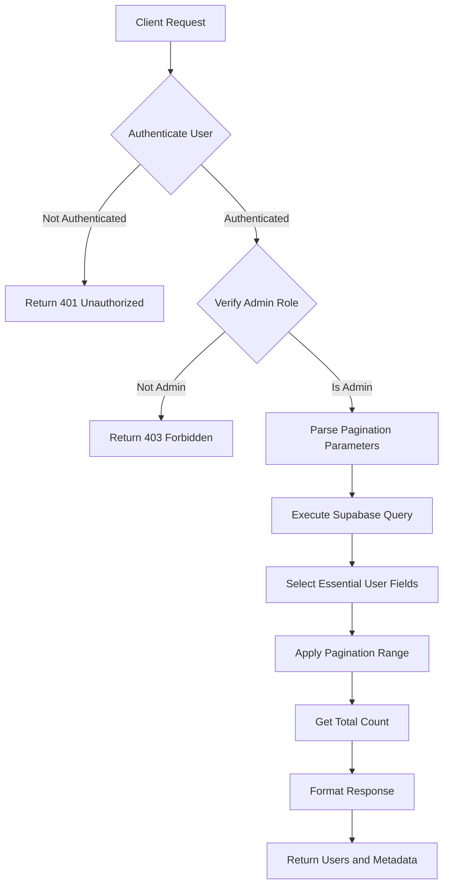
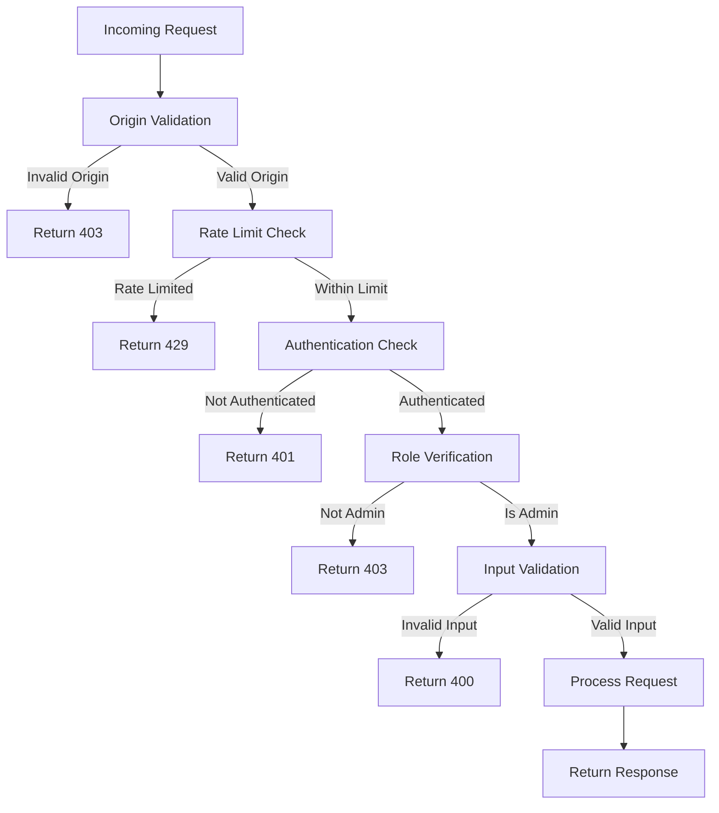
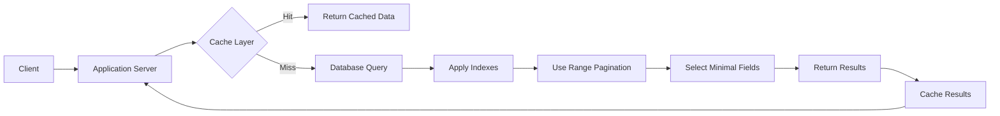

# User Operations

<cite>
**Referenced Files in This Document**   
- [create-user/route.ts](file://app/api/admin/create-user/route.ts)
- [toggle-user-status/route.ts](file://app/api/admin/toggle-user-status/route.ts)
- [get-users/route.ts](file://app/api/admin/get-users/route.ts)
- [create_users_table.sql](file://supabase/migrations/20251219043432_create_users_table.sql)
- [queries-optimized.ts](file://lib/supabase/queries-optimized.ts)
- [server.ts](file://lib/supabase/server.ts)
- [api-errors.ts](file://lib/api-errors.ts)
- [rate-limit.ts](file://lib/rate-limit.ts)
- [security.ts](file://lib/security.ts)
- [page.tsx](file://app/admin/users/page.tsx)
</cite>

## Table of Contents
1. [Introduction](#introduction)
2. [User Creation Process](#user-creation-process)
3. [User Status Management](#user-status-management)
4. [User Retrieval and Querying](#user-retrieval-and-querying)
5. [Database Schema](#database-schema)
6. [Security and Rate Limiting](#security-and-rate-limiting)
7. [API Request/Response Examples](#api-requestresponse-examples)
8. [Common Operational Issues](#common-operational-issues)
9. [Performance Optimization](#performance-optimization)
10. [Conclusion](#conclusion)

## Introduction
The User Operations system in the Admin Dashboard provides comprehensive functionality for managing user accounts within the school management system. This documentation details the implementation of core user operations including user creation, status management, and user retrieval with filtering and pagination. The system is built on Supabase for authentication and database operations, with robust security measures including rate limiting, input validation, and role-based access control. The operations are designed to handle the specific requirements of educational institutions, including support for different user roles (admin, teacher, student) and compliance with DepEd standards.

**Section sources**
- [page.tsx](file://app/admin/users/page.tsx#L1-L464)

## User Creation Process

The user creation process is implemented in the `create-user/route.ts` endpoint and follows a secure, multi-step approach to ensure data integrity and security. The process begins with CSRF protection through origin validation, followed by rate limiting to prevent abuse. Only authenticated admin users can create new accounts, verified through Supabase authentication and role checking.

When creating a new user, the system automatically generates a secure 12-character password with uppercase, lowercase, numbers, and special characters if no password is provided. The password complexity is validated server-side to ensure security standards are met. The user creation process uses Supabase's Admin API to create the authentication record, then inserts a corresponding record into the users table with the specified role and profile information.

For student accounts, the system uses the Learner Reference Number (LRN) as the login identifier, automatically generating an email in the format `lrn@r1.deped.gov.ph`. Teacher and admin accounts use standard email addresses for login. Role-specific profiles are created in separate tables (`student_profiles` or `teacher_profiles`) with relevant information.

In case of transaction failure during profile creation, the system attempts to clean up by deleting the authentication user to maintain data consistency. The generated password is returned to the admin user for secure distribution to the new account holder.



**Diagram sources**
- [create-user/route.ts](file://app/api/admin/create-user/route.ts#L8-L156)
- [server.ts](file://lib/supabase/server.ts#L36-L51)

**Section sources**
- [create-user/route.ts](file://app/api/admin/create-user/route.ts#L8-L156)
- [page.tsx](file://app/admin/users/page.tsx#L113-L165)

## User Status Management

The user status management functionality allows administrators to activate and deactivate user accounts through the `toggle-user-status/route.ts` endpoint. This operation is protected by comprehensive security measures including authentication verification, role validation, and input validation using Zod schema.

The endpoint accepts a POST request with a JSON payload containing the user ID and desired status (active/inactive). Before processing the request, the system verifies that the calling user is authenticated and has admin privileges by checking their role in the users table. Input validation ensures the user ID is a valid UUID and the status is a boolean value.

A critical security feature prevents administrators from disabling their own accounts, which could lead to lockout situations. When a user account is deactivated, the `is_active` flag in the users table is set to false, which immediately prevents the user from accessing the system. The operation is atomic and updates only the status field, preserving all other user data.

The implementation uses centralized error handling through the `api-errors.ts` module, ensuring consistent error responses and preventing information disclosure. All operations are logged for audit purposes, and success responses are minimal to reduce bandwidth usage.



**Diagram sources**
- [toggle-user-status/route.ts](file://app/api/admin/toggle-user-status/route.ts#L15-L62)
- [api-errors.ts](file://lib/api-errors.ts#L59-L69)

**Section sources**
- [toggle-user-status/route.ts](file://app/api/admin/toggle-user-status/route.ts#L15-L62)
- [page.tsx](file://app/admin/users/page.tsx#L73-L93)

## User Retrieval and Querying

The user retrieval system is implemented in the `get-users/route.ts` endpoint and provides paginated access to user records with filtering capabilities. The endpoint supports query parameters for pagination (page and limit) and returns a structured response with user data, total count, and pagination metadata.

Authentication and authorization are enforced at the beginning of the request cycle. Only authenticated admin users can access the user list, verified through Supabase authentication and role checking. The implementation uses Supabase's range-based pagination to efficiently retrieve user records in chunks, reducing memory usage and improving response times for large datasets.

The query selects only essential user fields (id, email, name, role, created_at, is_active) to minimize data transfer and improve performance. The results are ordered alphabetically by name for consistent presentation. The response includes a total count of users, which is obtained using Supabase's count functionality with the "exact" option to ensure accuracy.

For enhanced performance with large user bases, the system can leverage the optimized queries in `queries-optimized.ts`, which provide additional features like role-based filtering and more sophisticated pagination handling. These optimized queries also include proper type definitions and error handling for more robust operation.



**Diagram sources**
- [get-users/route.ts](file://app/api/admin/get-users/route.ts#L4-L59)
- [queries-optimized.ts](file://lib/supabase/queries-optimized.ts#L28-L51)

**Section sources**
- [get-users/route.ts](file://app/api/admin/get-users/route.ts#L4-L59)
- [queries-optimized.ts](file://lib/supabase/queries-optimized.ts#L28-L51)

## Database Schema

The user management system is built on a relational database schema with three main tables: `users`, `student_profiles`, and `teacher_profiles`. The `users` table serves as the primary user record, storing core information such as email, name, role, and account status. Each user has a UUID primary key that serves as a foreign key in the role-specific profile tables.

The `users` table includes fields for contact information (phone, address), timestamps (created_at, updated_at), and security-related flags (is_active, must_change_password). The role field is constrained to specific values (admin, teacher, student) through a CHECK constraint, ensuring data integrity. Row Level Security (RLS) is enabled on all user-related tables to enforce access control at the database level.

The `student_profiles` table contains education-specific information for students, including grade level, section, enrollment date, and parent contact information. Similarly, the `teacher_profiles` table stores professional information such as subject specialization, department, and join date. Both profile tables have a one-to-one relationship with the users table through the ID foreign key with cascade delete behavior.

The schema is designed to support the specific requirements of educational institutions, particularly compliance with DepEd standards for student information management. The separation of core user data from role-specific profiles allows for flexible extension as new user roles are added to the system.

```mermaid
erDiagram
USERS {
UUID id PK
TEXT email UK
TEXT name
TEXT role
TEXT avatar
TEXT phone
TEXT address
TIMESTAMPTZ created_at
TIMESTAMPTZ updated_at
BOOLEAN is_active
BOOLEAN must_change_password
}
STUDENT_PROFILES {
UUID id PK FK
TEXT grade
TEXT section
DATE enrollment_date
TEXT parent_name
TEXT parent_phone
TEXT lrn
}
TEACHER_PROFILES {
UUID id PK FK
TEXT subject
TEXT department
DATE join_date
}
USERS ||--o{ STUDENT_PROFILES : "has"
USERS ||--o{ TEACHER_PROFILES : "has"
```

**Diagram sources**
- [create_users_table.sql](file://supabase/migrations/20251219043432_create_users_table.sql#L1-L32)
- [database.types.ts](file://lib/database.types.ts#L368-L409)

**Section sources**
- [create_users_table.sql](file://supabase/migrations/20251219043432_create_users_table.sql#L1-L32)
- [types.ts](file://lib/supabase/types.ts#L4-L14)

## Security and Rate Limiting

The user operations system implements multiple layers of security to protect against common web vulnerabilities and abuse. CSRF protection is enforced through origin validation, comparing the request origin or referer header against the configured site URL. This prevents unauthorized cross-site requests from modifying user data.

Rate limiting is implemented using a combination of Supabase RPC functions and server-side logic. The `checkRateLimit` function in `rate-limit.ts` uses a PostgreSQL stored procedure (`check_rate_limit`) that employs row-level locking to prevent race conditions during concurrent requests. The rate limiting is applied per IP address and endpoint, with configurable limits and time windows.

Input validation is performed at multiple levels: basic validation in API routes, schema validation using Zod for complex inputs, and database-level constraints. Passwords are validated for complexity (minimum 12 characters with uppercase, lowercase, numbers, and special characters) to ensure account security. The system also includes IP address hashing for privacy-preserving storage while still allowing abuse detection.

All error handling is centralized through the `api-errors.ts` module, which prevents information disclosure by using generic error messages for client responses while logging detailed error information server-side. This approach helps prevent attackers from gaining insights into system internals through error messages.



**Diagram sources**
- [security.ts](file://lib/security.ts#L20-L67)
- [rate-limit.ts](file://lib/rate-limit.ts#L25-L56)
- [rate_limit_rpc.sql](file://supabase/migrations/20250225_rate_limit_rpc.sql#L3-L46)

**Section sources**
- [security.ts](file://lib/security.ts#L1-L136)
- [rate-limit.ts](file://lib/rate-limit.ts#L1-L56)
- [api-errors.ts](file://lib/api-errors.ts#L1-L42)

## API Request/Response Examples

This section provides practical examples of API requests and responses for the user operations endpoints. These examples illustrate the expected payload formats, successful responses, and error conditions.

**User Creation Request:**
```json
POST /api/admin/create-user
Content-Type: application/json

{
  "email": "john.doe@school.edu",
  "name": "John Doe",
  "role": "teacher",
  "subject": "Mathematics",
  "department": "STEM"
}
```

**Successful User Creation Response:**
```json
{
  "success": true,
  "user": {
    "id": "a1b2c3d4-e5f6-7890-g1h2-i3j4k5l6m7n8",
    "email": "john.doe@school.edu",
    "name": "John Doe",
    "role": "teacher",
    "created_at": "2025-03-15T10:30:00.000Z"
  },
  "password": "K7m#p9xQ2v!L"
}
```

**User Status Toggle Request:**
```json
POST /api/admin/toggle-user-status
Content-Type: application/json

{
  "userId": "a1b2c3d4-e5f6-7890-g1h2-i3j4k5l6m7n8",
  "status": false
}
```

**Successful Status Toggle Response:**
```json
{
  "success": true
}
```

**User Retrieval Request:**
```json
GET /api/admin/get-users?page=1&limit=50
```

**Successful User Retrieval Response:**
```json
{
  "users": [
    {
      "id": "a1b2c3d4-e5f6-7890-g1h2-i3j4k5l6m7n8",
      "email": "john.doe@school.edu",
      "name": "John Doe",
      "role": "teacher",
      "created_at": "2025-03-15T10:30:00.000Z",
      "is_active": true
    }
  ],
  "total": 1,
  "page": 1,
  "limit": 50
}
```

**Common Error Responses:**
- `401 Unauthorized`: {"error": "Unauthorized"}
- `403 Forbidden`: {"error": "Forbidden"}
- `400 Bad Request`: {"error": "Invalid parameters"}
- `429 Too Many Requests`: {"error": "Too many requests. Please wait."}
- `500 Internal Server Error`: {"error": "An unexpected error occurred."}

**Section sources**
- [create-user/route.ts](file://app/api/admin/create-user/route.ts#L8-L156)
- [toggle-user-status/route.ts](file://app/api/admin/toggle-user-status/route.ts#L15-L62)
- [get-users/route.ts](file://app/api/admin/get-users/route.ts#L4-L59)

## Common Operational Issues

This section addresses common operational issues that may arise when using the user operations system and provides guidance for troubleshooting and resolution.

**Rate Limiting During Bulk Creation:**
When creating multiple user accounts in quick succession, administrators may encounter rate limiting (429 responses). The system limits user creation to 10 requests per 10 minutes per IP address to prevent abuse. For bulk operations, administrators should implement a delay between requests or use a batch processing approach with appropriate timing.

**Transaction Failures:**
In rare cases, a user creation transaction may fail after the authentication record is created but before the database record is inserted. The system attempts to clean up by deleting the authentication user, but network issues could prevent this. Administrators should monitor for orphaned authentication records and clean them manually if necessary.

**Race Conditions:**
Concurrent status updates to the same user account could potentially lead to race conditions. The system mitigates this through the use of atomic database operations and the rate limiting RPC function, which uses row-level locking to ensure serial execution for the same identifier.

**Data Consistency Issues:**
When creating student accounts, the LRN must be unique and properly formatted. Duplicate LRNs or improperly formatted values can cause validation errors. Administrators should validate LRN data before bulk imports and ensure data quality from source systems.

**Session Invalidation:**
When a user account is deactivated, existing sessions remain valid until they expire or are explicitly invalidated. The system does not currently force immediate session termination, which means deactivated users may remain logged in until their session expires. Future enhancements could include a mechanism for immediate session invalidation.

**Section sources**
- [create-user/route.ts](file://app/api/admin/create-user/route.ts#L8-L156)
- [toggle-user-status/route.ts](file://app/api/admin/toggle-user-status/route.ts#L15-L62)
- [rate-limit.ts](file://lib/rate-limit.ts#L25-L56)

## Performance Optimization

The user operations system includes several performance optimization strategies to ensure efficient operation, especially with large user bases. These optimizations are implemented at multiple levels, from database queries to application logic.

The `queries-optimized.ts` file contains optimized database queries that use proper indexing, efficient pagination, and selective field retrieval to minimize database load. The `getUsers` function implements server-side pagination with exact count retrieval, allowing for accurate pagination controls without excessive data transfer.

For large datasets, the system uses Supabase's range-based pagination rather than offset-based pagination, which performs better as the dataset grows. The queries select only essential fields needed for display, reducing network bandwidth and memory usage. Indexes on commonly queried fields (such as role and name) further improve query performance.

Caching strategies can be implemented at the application level for frequently accessed user data. While not currently implemented in the core user operations, the system architecture supports caching through the use of consistent API responses and proper cache headers. For high-traffic scenarios, a Redis or similar in-memory cache could be integrated to store frequently accessed user lists or role-based queries.

The rate limiting system uses a dedicated PostgreSQL function with row-level locking to prevent race conditions while maintaining performance. This approach is more efficient than application-level locking and leverages database capabilities for atomic operations.



**Diagram sources**
- [queries-optimized.ts](file://lib/supabase/queries-optimized.ts#L28-L51)
- [get-users/route.ts](file://app/api/admin/get-users/route.ts#L4-L59)

**Section sources**
- [queries-optimized.ts](file://lib/supabase/queries-optimized.ts#L1-L317)
- [get-users/route.ts](file://app/api/admin/get-users/route.ts#L4-L59)

## Conclusion

The User Operations system in the Admin Dashboard provides a comprehensive, secure, and efficient solution for managing user accounts in an educational environment. The system's architecture balances functionality with security, implementing robust protections against common web vulnerabilities while providing the necessary tools for administrators to manage user accounts effectively.

Key strengths of the system include its multi-layered security approach, with CSRF protection, rate limiting, input validation, and role-based access control. The separation of authentication and application data allows for flexible user management while maintaining data integrity. The use of Supabase as a backend service provides reliable authentication and database operations with minimal operational overhead.

For optimal performance with large user bases, administrators should leverage the optimized queries and consider implementing caching strategies. The system's modular design allows for future enhancements, such as immediate session invalidation upon account deactivation or more sophisticated bulk operation capabilities.

The comprehensive error handling and consistent API design make the system reliable and predictable, while the detailed logging and audit capabilities support compliance and security monitoring. Overall, the User Operations system provides a solid foundation for user management in the school management system.