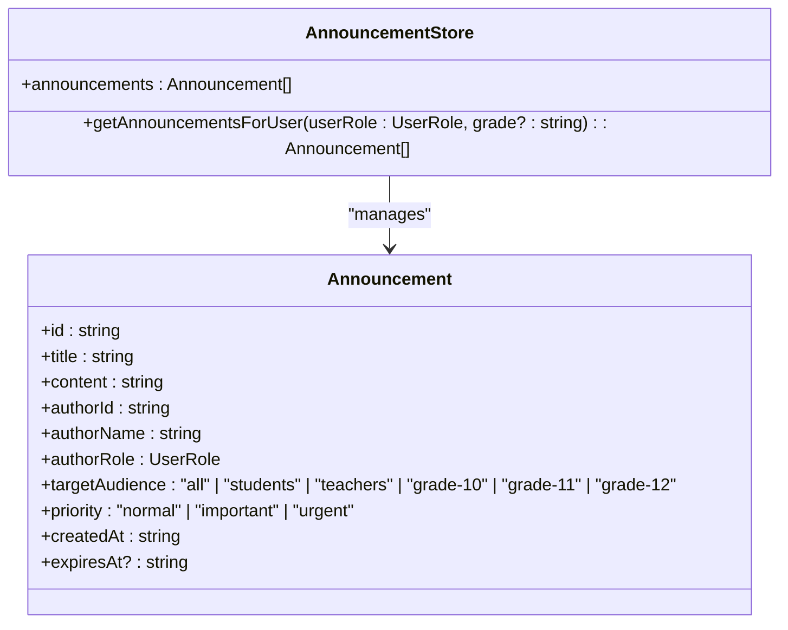
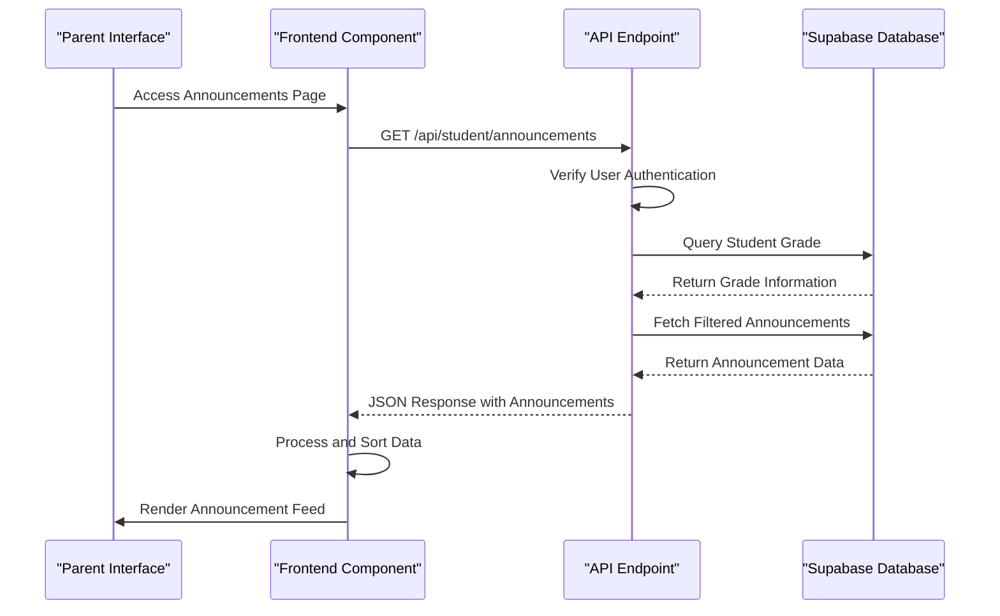
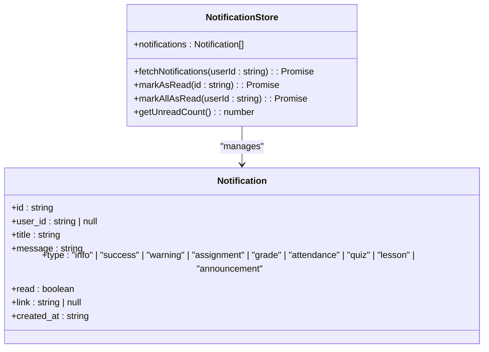

# Announcement Reading

<cite>
**Referenced Files in This Document**   
- [page.tsx](file://app/parent/announcements/page.tsx)
- [page.tsx](file://app/student/announcements/page.tsx)
- [route.ts](file://app/api/student/announcements/route.ts)
- [announcement-store.ts](file://lib/announcement-store.ts)
- [notification-store.ts](file://lib/notification-store.ts)
- [notification-center.tsx](file://components/notification-center.tsx)
- [types.ts](file://lib/supabase/types.ts)
- [mock-data.ts](file://lib/mock-data.ts)
</cite>

## Table of Contents
1. [Introduction](#introduction)
2. [Announcement Feed Implementation](#announcement-feed-implementation)
3. [Message Categorization and Filtering](#message-categorization-and-filtering)
4. [Timestamp Sorting and Priority Highlighting](#timestamp-sorting-and-priority-highlighting)
5. [API and Frontend Integration](#api-and-frontend-integration)
6. [Real-Time Updates and Read State Management](#real-time-updates-and-read-state-management)
7. [Usage Examples](#usage-examples)
8. [Notification System Integration](#notification-system-integration)
9. [Common Issues and Resolution](#common-issues-and-resolution)
10. [Accessibility Considerations](#accessibility-considerations)

## Introduction
The Announcement Reading system enables parents to receive and access school communications through a structured announcement feed. This system provides timely updates about school events, important notices, and academic information. The implementation includes message categorization, timestamp-based sorting, and visual priority highlighting to ensure critical information is easily identifiable. Parents access announcements through a dedicated interface that integrates with the school's notification system for real-time updates.

**Section sources**
- [page.tsx](file://app/parent/announcements/page.tsx#L1-L95)

## Announcement Feed Implementation
The announcement feed displays school communications in a card-based layout, with each announcement presented as a distinct card containing the title, content, author information, and timestamp. The feed is implemented using React components with server-side data fetching to ensure up-to-date information. For parents, the feed is accessible through the `/parent/announcements` route, which renders the `page.tsx` component. The system uses a client-side store to manage announcement state and provides loading states during data retrieval.

```mermaid
flowchart TD
A[Parent Accesses Announcements] --> B{Check Authentication}
B --> |Authenticated| C[Fetch Announcements from API]
C --> D[Filter for Parent-Relevant Messages]
D --> E[Sort by Timestamp (Newest First)]
E --> F[Render Announcement Cards]
F --> G[Display Feed to Parent]
```

**Diagram sources**
- [page.tsx](file://app/parent/announcements/page.tsx#L11-L95)
- [route.ts](file://app/api/student/announcements/route.ts#L4-L39)

**Section sources**
- [page.tsx](file://app/parent/announcements/page.tsx#L11-L95)
- [route.ts](file://app/api/student/announcements/route.ts#L4-L39)

## Message Categorization and Filtering
Announcements are categorized by target audience to ensure relevant delivery. The system supports multiple audience types: "all", "students", "teachers", and grade-specific audiences (e.g., "grade-10"). For parents, the system filters announcements that are relevant to their children by including messages targeted to "all" recipients and "students". The filtering logic is implemented in both the frontend and backend layers to ensure security and relevance. The `announcement-store.ts` contains the client-side filtering logic, while the API endpoint enforces server-side filtering based on the user's role and student grade level.



**Diagram sources**
- [announcement-store.ts](file://lib/announcement-store.ts#L7-L60)
- [types.ts](file://lib/supabase/types.ts#L201-L210)

**Section sources**
- [announcement-store.ts](file://lib/announcement-store.ts#L7-L60)
- [types.ts](file://lib/supabase/types.ts#L201-L210)
- [mock-data.ts](file://lib/mock-data.ts#L1237-L1273)

## Timestamp Sorting and Priority Highlighting
Announcements are sorted by timestamp in descending order, with the most recent messages appearing first in the feed. The sorting is implemented both client-side and server-side to ensure consistent ordering. Each announcement is visually distinguished by its priority level: "urgent", "important", or "normal". Urgent announcements are highlighted with red indicators and alert icons, important announcements use yellow highlighting, and normal announcements have standard styling. The priority system helps parents quickly identify critical information that requires immediate attention.

```mermaid
flowchart TD
A[Receive Announcements] --> B[Parse Timestamps]
B --> C[Convert to Date Objects]
C --> D[Sort by CreatedAt (Descending)]
D --> E{Check Priority Level}
E --> |Urgent| F[Apply Red Highlighting]
E --> |Important| G[Apply Yellow Highlighting]
E --> |Normal| H[Apply Standard Styling]
F --> I[Display in Feed]
G --> I
H --> I
```

**Diagram sources**
- [announcement-store.ts](file://lib/announcement-store.ts#L58-L59)
- [page.tsx](file://app/parent/announcements/page.tsx#L18-L22)

**Section sources**
- [announcement-store.ts](file://lib/announcement-store.ts#L58-L59)
- [page.tsx](file://app/parent/announcements/page.tsx#L18-L22)

## API and Frontend Integration
The announcement system integrates the backend API with the frontend display component through a secure data fetching process. The frontend makes HTTP requests to the `/api/student/announcements` endpoint, which returns JSON data containing announcement information. The API endpoint implements role-based access control, verifying the user's authentication status and retrieving the student's grade level to filter appropriate announcements. The frontend then processes this data and renders it in a user-friendly format. This integration ensures that parents only receive announcements relevant to their children's academic context.



**Diagram sources**
- [route.ts](file://app/api/student/announcements/route.ts#L4-L39)
- [page.tsx](file://app/student/announcements/page.tsx#L38-L42)

**Section sources**
- [route.ts](file://app/api/student/announcements/route.ts#L4-L39)
- [page.tsx](file://app/student/announcements/page.tsx#L38-L42)

## Real-Time Updates and Read State Management
The system provides real-time updates through periodic data fetching and notification integration. When new announcements are published, parents receive immediate alerts through the notification center. The read/unread state of announcements is managed through the notification system rather than individual announcement tracking. Notifications are marked as read when viewed, and parents can mark all notifications as read at once. The system uses client-side state management with Zustand store to handle notification states efficiently without requiring constant server polling.



**Diagram sources**
- [notification-store.ts](file://lib/notification-store.ts#L32-L148)
- [notification-center.tsx](file://components/notification-center.tsx#L63-L189)

**Section sources**
- [notification-store.ts](file://lib/notification-store.ts#L32-L148)
- [notification-center.tsx](file://components/notification-center.tsx#L63-L189)

## Usage Examples
Parents can use the announcement system to identify urgent notices, such as school closures or emergency alerts, which are prominently displayed with red highlighting and alert icons. The system allows filtering announcements by category, though this functionality is currently handled through audience-based filtering rather than explicit category tags. Parents can access archived messages by scrolling through the announcement feed, which displays messages in reverse chronological order. The system also supports linking to specific content, such as registration forms or detailed event information, through embedded links in announcement content.

**Section sources**
- [mock-data.ts](file://lib/mock-data.ts#L1237-L1273)
- [page.tsx](file://app/parent/announcements/page.tsx#L55-L89)

## Notification System Integration
The announcement system is integrated with the school's notification center to alert parents about new important announcements. When an announcement is published, the system creates a corresponding notification with the type "announcement" that appears in the parent's notification bell. The notification center displays an unread count badge when new announcements are available, providing a visual indicator of pending messages. Clicking on a notification marks it as read and navigates to the relevant announcement or related content. This integration ensures parents are promptly informed about critical school communications.

```mermaid
flowchart TD
A[New Announcement Published] --> B[Create Notification Record]
B --> C[Set Type: "announcement"]
C --> D[Link to Announcement Content]
D --> E[Mark as Unread]
E --> F[Update User's Notification Center]
F --> G[Display Badge with Count]
G --> H[Parent Views Notification]
H --> I[Mark as Read]
I --> J[Update Badge Count]
```

**Diagram sources**
- [notification-store.ts](file://lib/notification-store.ts#L67-L87)
- [notification-center.tsx](file://components/notification-center.tsx#L85-L92)

**Section sources**
- [notification-store.ts](file://lib/notification-store.ts#L67-L87)
- [notification-center.tsx](file://components/notification-center.tsx#L85-L92)

## Common Issues and Resolution
Common issues with the announcement system include missed announcements and formatting problems. Missed announcements typically occur when parents do not regularly check the notification bell or have disabled browser notifications. The resolution is to encourage regular checking of the announcement feed and notification center. Formatting problems may arise when announcement content contains special characters or long text without proper line breaks. The system uses `whitespace-pre-wrap` CSS to preserve formatting while allowing text wrapping. If announcements appear incorrectly formatted, administrators should ensure proper HTML escaping and content validation before publication.

**Section sources**
- [page.tsx](file://app/parent/announcements/page.tsx#L83-L85)
- [page.tsx](file://app/student/announcements/page.tsx#L117-L118)

## Accessibility Considerations
The announcement system incorporates several accessibility features to ensure all parents can effectively consume content. The interface uses sufficient color contrast for text and background elements, with priority indicators that are distinguishable by shape and color. Screen reader support is provided through proper semantic HTML elements and ARIA attributes. Text content is resizable without breaking the layout, and interactive elements have appropriate focus states. The system also supports keyboard navigation for users who cannot use a mouse. These considerations ensure that parents with various disabilities can access important school communications.

**Section sources**
- [page.tsx](file://app/parent/announcements/page.tsx#L59-L88)
- [notification-center.tsx](file://components/notification-center.tsx#L128-L177)