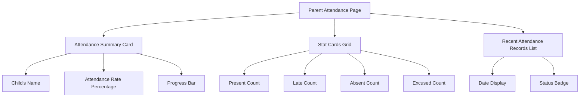
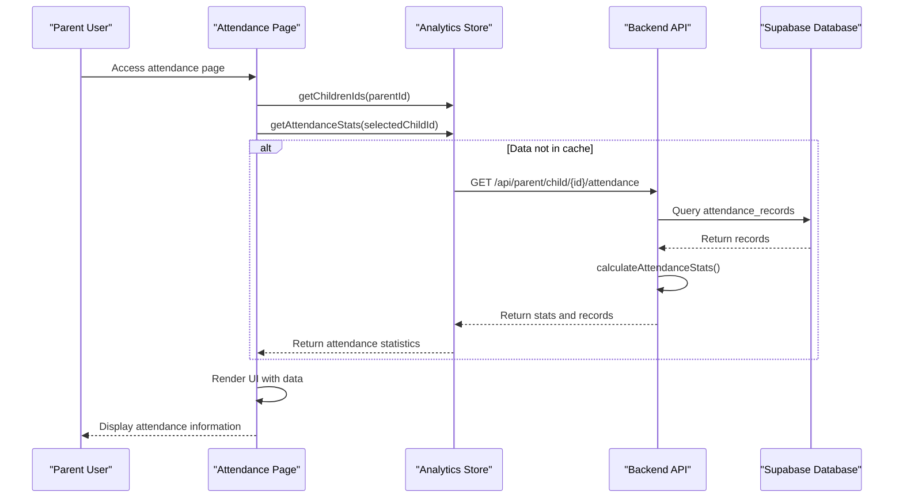
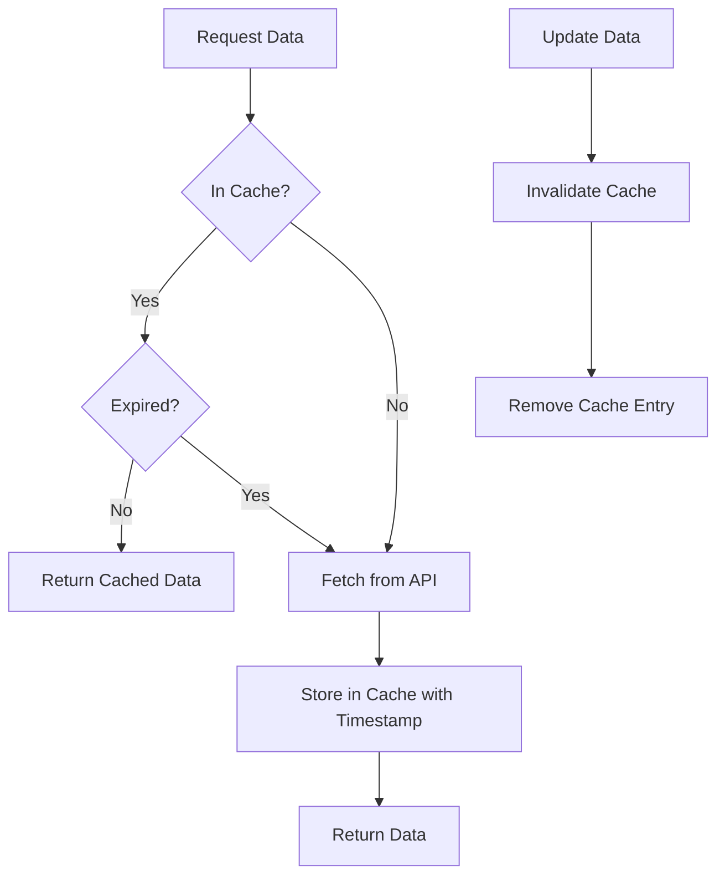

# Attendance Tracking

<cite>
**Referenced Files in This Document**   
- [page.tsx](file://app/parent/attendance/page.tsx)
- [parent-store.ts](file://lib/parent-store.ts)
- [analytics-store.ts](file://lib/analytics-store.ts)
- [attendance-utils.ts](file://lib/attendance-utils.ts)
- [route.ts](file://app/api/parent/child/[id]/attendance/route.ts)
- [types.ts](file://lib/types.ts)
- [cache.ts](file://lib/cache.ts)
- [use-optimized-query.ts](file://lib/hooks/use-optimized-query.ts)
</cite>

## Table of Contents
1. [Introduction](#introduction)
2. [Attendance Data Visualization](#attendance-data-visualization)
3. [System Architecture and Integration](#system-architecture-and-integration)
4. [Attendance Rate Calculation](#attendance-rate-calculation)
5. [Status Breakdowns and Interpretation](#status-breakdowns-and-interpretation)
6. [Real-Time Data Synchronization](#real-time-data-synchronization)
7. [Caching Strategies](#caching-strategies)
8. [Common Issues and Resolution](#common-issues-and-resolution)
9. [Design for Usability](#design-for-usability)

## Introduction
The Attendance Tracking system enables parents to monitor their children's attendance records through a dedicated interface. This system provides comprehensive visualization of attendance data, including present/absent/late counts, attendance rate calculation, and status breakdowns. The implementation integrates frontend components with state management and backend APIs to deliver real-time, accurate information. Parents can check daily attendance status, understand patterns over time, and interpret excused versus unexcused absences. The system employs real-time data synchronization and caching strategies to ensure up-to-date information while maintaining performance.

**Section sources**
- [page.tsx](file://app/parent/attendance/page.tsx#L1-L175)

## Attendance Data Visualization
The attendance tracking interface presents data through multiple visual components designed for quick comprehension. The primary visualization is a gradient card displaying the child's name and overall attendance rate in large, prominent text. This is accompanied by a progress bar that visually represents the attendance percentage.

Below this summary, four stat cards display individual counts for present, late, absent, and excused statuses. Each card uses a consistent design pattern with an icon, background color, and numerical count:
- Present status uses green color scheme with checkmark icon
- Late status uses amber color scheme with clock icon
- Absent status uses red color scheme with X icon
- Excused status uses blue color scheme with alert icon

The recent attendance records are displayed as a chronological list with the most recent entries at the top. Each record shows the date in a readable format (weekday, month, day) and uses colored badges to indicate the attendance status. This list displays the last 15 records in reverse chronological order.



**Diagram sources**
- [page.tsx](file://app/parent/attendance/page.tsx#L78-L174)

**Section sources**
- [page.tsx](file://app/parent/attendance/page.tsx#L78-L174)

## System Architecture and Integration
The attendance tracking system follows a three-tier architecture connecting the frontend, state management, and backend API. The integration begins with the parent's attendance page component which serves as the user interface. This component utilizes two key state management stores: parent-store and analytics-store.

The parent-store provides access to the parent's children relationships through the getChildrenIds function, establishing which students the parent is authorized to view. The analytics-store supplies the attendance data through getAttendanceStats and getStudentAnalytics functions.

When a parent accesses the attendance page, the following integration flow occurs:
1. The frontend component retrieves the parent ID and fetches associated children IDs
2. Upon selecting a child, the component requests attendance statistics from analytics-store
3. The analytics-store, if not already populated, would trigger API calls to retrieve data
4. The backend API endpoint processes the request, verifies authorization, and returns attendance records and calculated statistics



**Diagram sources**
- [page.tsx](file://app/parent/attendance/page.tsx#L14-L175)
- [parent-store.ts](file://lib/parent-store.ts#L24-L65)
- [analytics-store.ts](file://lib/analytics-store.ts#L39-L82)
- [route.ts](file://app/api/parent/child/[id]/attendance/route.ts#L6-L78)

**Section sources**
- [page.tsx](file://app/parent/attendance/page.tsx#L14-L175)
- [parent-store.ts](file://lib/parent-store.ts#L24-L65)
- [analytics-store.ts](file://lib/analytics-store.ts#L39-L82)
- [route.ts](file://app/api/parent/child/[id]/attendance/route.ts#L6-L78)

## Attendance Rate Calculation
The attendance rate is calculated using a specific formula that considers both present and late statuses as attended. The calculation is performed by the calculateAttendanceStats function in the attendance-utils module.

The algorithm follows these steps:
1. Initialize counters for each status (present, absent, late, excused) and total records
2. Iterate through all attendance records, incrementing the appropriate status counter
3. Calculate the attendance rate using the formula: ((present + late) / total) * 100
4. Round the result to the nearest integer percentage

The attendance rate calculation treats both "present" and "late" statuses as attended, recognizing that a late arrival still constitutes participation in the class. This approach provides a more accurate representation of student engagement than counting only "present" statuses.

The calculation handles edge cases such as empty record sets by returning a 0% rate when no records exist. The function returns an object containing individual counts for each status, the total number of records, and the calculated rate percentage.

```mermaid
flowchart TD
A[Start] --> B[Initialize counters: present=0, absent=0, late=0, excused=0, total=0]
B --> C{For each record}
C --> D[Increment status counter]
D --> E[Increment total counter]
E --> F{More records?}
F --> |Yes| C
F --> |No| G[Calculate rate = ((present + late) / total) * 100]
G --> H{Total > 0?}
H --> |Yes| I[Round rate to nearest integer]
H --> |No| J[Set rate = 0]
I --> K[Return stats object]
J --> K
K --> L[End]
```

**Diagram sources**
- [attendance-utils.ts](file://lib/attendance-utils.ts#L17-L41)

**Section sources**
- [attendance-utils.ts](file://lib/attendance-utils.ts#L17-L41)

## Status Breakdowns and Interpretation
The system categorizes attendance into four distinct statuses: present, absent, late, and excused. Each status has specific meanings and implications for parents interpreting their child's attendance pattern.

The "present" status indicates the student attended class on time. The "late" status means the student arrived after the scheduled start time but still participated in the class. The "absent" status signifies the student did not attend class at all. The "excused" status indicates an absence that has been formally justified, such as for illness with documentation or approved family emergencies.

Parents can use these status breakdowns to understand their child's attendance patterns over time. Regular absences might indicate underlying issues that need attention, while frequent late arrivals could suggest transportation or morning routine challenges. Excused absences provide context that the absence was legitimate and approved.

The interface displays these statuses with distinct visual indicators:
- Present: Green color with checkmark icon
- Late: Amber color with clock icon
- Absent: Red color with X icon
- Excused: Blue color with alert icon

This color-coding system allows parents to quickly scan and interpret the attendance records at a glance, identifying patterns and concerns without needing to read detailed information.

**Section sources**
- [types.ts](file://lib/types.ts#L7-L7)
- [page.tsx](file://app/parent/attendance/page.tsx#L35-L40)
- [attendance-utils.ts](file://lib/attendance-utils.ts#L3-L10)

## Real-Time Data Synchronization
The attendance tracking system implements real-time data synchronization through a combination of API endpoints and webhook integrations. When attendance data changes, the system ensures parents see updated information without requiring manual page refreshes.

The primary mechanism for real-time updates is the API endpoint at /api/parent/child/[id]/attendance, which serves as the data source for the parent attendance page. This endpoint queries the Supabase database for the latest attendance records and returns them with calculated statistics.

For virtual classes conducted via Zoom, the system uses webhook integration to automatically update attendance records. When a Zoom meeting ends, the webhook handler processes participant data and updates attendance based on duration. Students who attend for 15 minutes or more are marked as "present," while shorter durations may be marked as "partial" attendance.

The frontend implements automatic refetching of data at regular intervals to ensure the displayed information remains current. This is particularly important for parents who keep the attendance page open for extended periods, as it guarantees they see the most recent data without manual intervention.

**Section sources**
- [route.ts](file://app/api/parent/child/[id]/attendance/route.ts#L6-L78)
- [use-optimized-query.ts](file://lib/hooks/use-optimized-query.ts#L28-L124)
- [webhook/route.ts](file://app/api/zoom/webhook/route.ts#L254-L283)

## Caching Strategies
The system employs multiple caching strategies to optimize performance and reduce database load while ensuring data freshness. These strategies operate at both client and server levels.

On the client side, an in-memory cache stores query results with a TTL (time-to-live) of 30 seconds. This prevents duplicate API calls when the same data is requested multiple times within a short period. The cache is implemented as a Map object that stores data with timestamps, allowing for automatic expiration of stale entries.

The server-side caching leverages Next.js's unstable_cache function with specific revalidation intervals. Different data types have appropriate cache durations:
- Dashboard data: 60 seconds
- Student lists: 120 seconds
- Class lists: 180 seconds

Cache invalidation occurs through specific functions that clear entries by key or tag. When attendance data is updated, the system invalidates relevant cache entries to ensure subsequent requests retrieve fresh data. The cache also implements cleanup logic to prevent memory bloat by removing older entries when the cache size exceeds 100 items.



**Diagram sources**
- [cache.ts](file://lib/cache.ts#L16-L39)
- [cache.ts](file://lib/cache.ts#L65-L115)

**Section sources**
- [cache.ts](file://lib/cache.ts#L6-L128)
- [use-optimized-query.ts](file://lib/hooks/use-optimized-query.ts#L56-L57)

## Common Issues and Resolution
Parents may encounter several common issues when using the attendance tracking system. Understanding these issues and their resolution steps helps ensure accurate interpretation of attendance data.

One common issue is discrepancies between expected and recorded attendance. This can occur when a student attends a class but the system doesn't register the attendance. Resolution steps include:
1. Verify the student was properly checked in (via QR code, manual entry, or Zoom meeting)
2. Check if there's a delay in data synchronization (wait a few minutes and refresh)
3. Contact school administration if the issue persists

Missing data is another potential issue, where recent attendance records don't appear. This could be due to:
- Technical issues with the attendance recording system
- The teacher not yet submitted attendance for that day
- Network connectivity problems during data transmission

Parents should first refresh the page to check for updates. If data remains missing after 24 hours, they should contact school staff to verify the attendance was properly recorded.

Temporary data inconsistencies may occur during system updates or high-traffic periods. The caching system helps mitigate this by serving slightly stale but consistent data rather than error states. Parents should be aware that attendance data typically updates within a few minutes of being recorded.

**Section sources**
- [route.ts](file://app/api/parent/child/[id]/attendance/route.ts#L74-L77)
- [cache.ts](file://lib/cache.ts#L6-L128)
- [use-optimized-query.ts](file://lib/hooks/use-optimized-query.ts#L63-L86)

## Design for Usability
The attendance tracking interface is designed with usability as a primary consideration, ensuring parents can quickly understand their child's attendance status at a glance. The design follows several key principles to enhance comprehension and accessibility.

The visual hierarchy prioritizes the most important information—the overall attendance rate—by displaying it in large, bold text with a prominent progress bar. This allows parents to immediately assess their child's attendance performance without needing to interpret multiple data points.

Color coding provides intuitive status identification, with green indicating positive status (present), red indicating concern (absent), amber indicating caution (late), and blue indicating special circumstances (excused). These colors align with common traffic light conventions, making them instantly recognizable.

The interface accommodates parents with multiple children through a selection dropdown that appears only when more than one child is linked. This reduces clutter for parents with a single child while providing necessary functionality for those with multiple children.

The recent attendance records are displayed in reverse chronological order, with the most recent entries first. This allows parents to quickly see the latest attendance patterns without scrolling through historical data. Each record includes the full date with weekday name, making it easier to identify specific days of the week.

Responsive design ensures the interface works well on various devices, from desktop computers to mobile phones. The layout adapts to screen size, stacking elements vertically on smaller screens while using a grid layout on larger displays.

**Section sources**
- [page.tsx](file://app/parent/attendance/page.tsx#L60-L75)
- [page.tsx](file://app/parent/attendance/page.tsx#L81-L109)
- [page.tsx](file://app/parent/attendance/page.tsx#L112-L132)
- [page.tsx](file://app/parent/attendance/page.tsx#L142-L157)