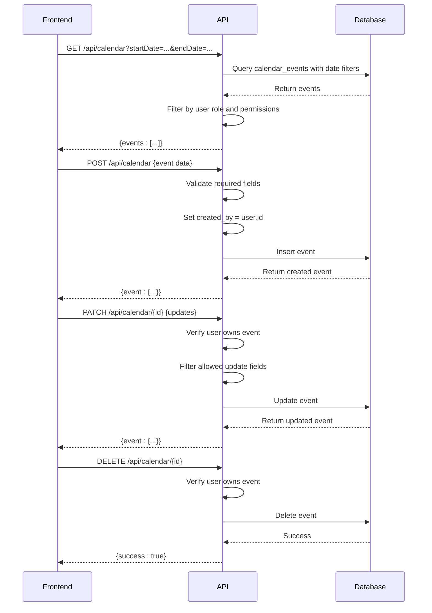
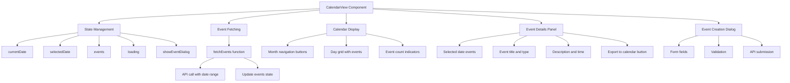
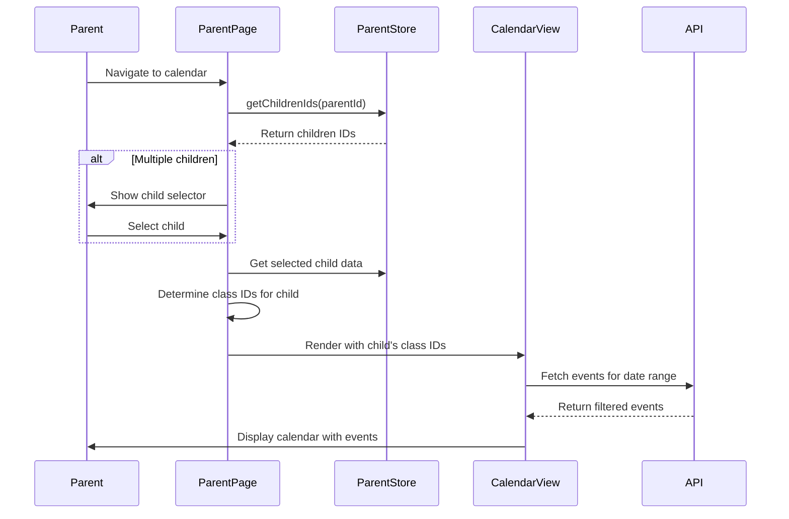
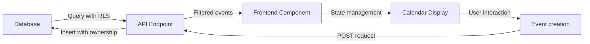

# Calendar Access

<cite>
**Referenced Files in This Document**   
- [app/api/calendar/route.ts](file://app/api/calendar/route.ts)
- [app/api/calendar/[id]/route.ts](file://app/api/calendar/[id]/route.ts)
- [components/calendar-view.tsx](file://components/calendar-view.tsx)
- [lib/calendar-store.ts](file://lib/calendar-store.ts)
- [supabase/migrations/20260105000002_create_calendar_events_table.sql](file://supabase/migrations/20260105000002_create_calendar_events_table.sql)
- [app/parent/calendar/page.tsx](file://app/parent/calendar/page.tsx)
- [app/student/calendar/page.tsx](file://app/student/calendar/page.tsx)
- [app/teacher/calendar/page.tsx](file://app/teacher/calendar/page.tsx)
- [lib/database.types.ts](file://lib/database.types.ts)
- [lib/types.ts](file://lib/types.ts)
- [lib/parent-store.ts](file://lib/parent-store.ts)
- [lib/mock-data.ts](file://lib/mock-data.ts)
</cite>

## Table of Contents
1. [Introduction](#introduction)
2. [Calendar Data Model](#calendar-data-model)
3. [API Endpoints](#api-endpoints)
4. [Frontend Implementation](#frontend-implementation)
5. [Parent Access Flow](#parent-access-flow)
6. [Event Filtering and Visibility](#event-filtering-and-visibility)
7. [Data Flow and Synchronization](#data-flow-and-synchronization)
8. [User Experience Design](#user-experience-design)
9. [Responsive Design](#responsive-design)
10. [Event Categorization and Display](#event-categorization-and-display)
11. [Common Issues and Troubleshooting](#common-issues-and-troubleshooting)
12. [Usage Examples](#usage-examples)

## Introduction
The Calendar Access feature enables parents to view their children's academic schedules and important events within the school management system. This documentation details the implementation of calendar integration, covering event fetching, display formatting, and synchronization with the school's master calendar. The system provides a comprehensive view of upcoming assignments, class schedules, school holidays, and other important events, ensuring parents stay informed about their children's academic activities.

The calendar system is designed with role-based access control, ensuring that parents can only view events relevant to their linked children. The implementation follows a client-server architecture with a React frontend component that communicates with API endpoints to fetch and display calendar events. The system supports responsive design for optimal viewing across different device sizes and includes features for event export to external calendar applications.

**Section sources**
- [app/parent/calendar/page.tsx](file://app/parent/calendar/page.tsx)

## Calendar Data Model
The calendar system is built around the `calendar_events` table in the Supabase database, which stores all calendar-related information. The table structure includes essential fields for event management, such as title, description, date and time information, location, and categorization data.

The data model supports various event types including classes, quizzes, assignments, exams, holidays, meetings, and other miscellaneous events. Each event has a target audience field that determines visibility, with options for "all", "students", "teachers", "class", or "personal" audiences. This allows for granular control over who can view specific events.

Events can be associated with specific classes through the `class_id` foreign key, enabling class-specific events to be displayed only to students and teachers enrolled in those classes. The `created_by` field tracks the user who created the event, which is used for permission checks when editing or deleting events.

```mermaid
erDiagram
calendar_events {
id UUID PK
title TEXT NOT NULL
description TEXT
type TEXT CHECK
start_date DATE NOT NULL
end_date DATE
start_time TIME
end_time TIME
all_day BOOLEAN DEFAULT false
location TEXT
class_id UUID FK
created_by UUID FK
target_audience TEXT CHECK
color TEXT
created_at TIMESTAMPTZ
updated_at TIMESTAMPTZ
}
users {
id UUID PK
name TEXT
email TEXT
role TEXT
}
classes {
id UUID PK
name TEXT
teacher_id UUID
}
calendar_events ||--o{ users : "created_by"
calendar_events ||--o{ classes : "class_id"
```

**Diagram sources **
- [supabase/migrations/20260105000002_create_calendar_events_table.sql](file://supabase/migrations/20260105000002_create_calendar_events_table.sql)
- [lib/database.types.ts](file://lib/database.types.ts)

**Section sources**
- [supabase/migrations/20260105000002_create_calendar_events_table.sql](file://supabase/migrations/20260105000002_create_calendar_events_table.sql)
- [lib/database.types.ts](file://lib/database.types.ts)

## API Endpoints
The calendar system exposes RESTful API endpoints for CRUD operations on calendar events. These endpoints are implemented as Next.js API routes and provide the interface between the frontend application and the database.

The GET endpoint at `/api/calendar` retrieves calendar events with optional date filtering through `startDate` and `endDate` query parameters. The endpoint implements role-based access control, fetching events based on the user's role and class enrollments. For students, it retrieves events from classes they are enrolled in, while teachers can access events from classes they teach. The response includes event data with associated class information.

The POST endpoint at `/api/calendar` creates new calendar events. It validates required fields (title and start date) and sets default values for optional fields. The `created_by` field is automatically populated with the authenticated user's ID, ensuring proper ownership tracking.

The PATCH and DELETE endpoints at `/api/calendar/[id]` allow modification and removal of existing events. Both endpoints include security checks to ensure that only the event creator or an administrator can perform these operations. The PATCH endpoint uses a whitelist of allowed fields to prevent mass assignment vulnerabilities.



**Diagram sources **
- [app/api/calendar/route.ts](file://app/api/calendar/route.ts)
- [app/api/calendar/[id]/route.ts](file://app/api/calendar/[id]/route.ts)

**Section sources**
- [app/api/calendar/route.ts](file://app/api/calendar/route.ts)
- [app/api/calendar/[id]/route.ts](file://app/api/calendar/[id]/route.ts)

## Frontend Implementation
The frontend calendar interface is implemented as a reusable `CalendarView` component that provides a month-view calendar with event display and interaction capabilities. The component is designed to be flexible and can be used by different user roles with appropriate permission settings.

The `CalendarView` component manages state for the current date, selected date, events, and loading status. It fetches events from the API endpoint with a date range that extends one month before and after the current month to ensure smooth navigation between months without additional API calls.

The calendar display consists of a grid layout with days of the week as headers and calendar days as cells. Each day cell shows the day number and up to two events, with a "+N more" indicator when additional events exist for that day. Clicking on a day reveals a detailed view of all events for that date in a sidebar panel.

The component includes functionality for creating new events through a dialog form that captures event details such as title, type, date, time, location, and target audience. Event creation is disabled for parent and student views, allowing only teachers and administrators to add events.



**Diagram sources **
- [components/calendar-view.tsx](file://components/calendar-view.tsx)

**Section sources**
- [components/calendar-view.tsx](file://components/calendar-view.tsx)

## Parent Access Flow
The parent calendar access flow is implemented in the `ParentCalendarPage` component, which provides a specialized view for parents to monitor their children's academic schedules. The implementation follows a multi-step process to ensure parents can access relevant calendar information while maintaining appropriate privacy boundaries.

When a parent accesses the calendar page, the system first determines which children are linked to the parent account using the `useParentStore` hook. This store maintains parent-child relationships and provides methods to retrieve a parent's children IDs. If a parent has multiple children linked to their account, a dropdown selector allows them to switch between children's calendars.

The component fetches class IDs for the selected child, which are used to filter calendar events. In the production implementation, these class IDs would be retrieved from the database, but the current code uses mock data. The `CalendarView` component is then rendered with the parent's user ID, "parent" role, and the child's class IDs, enabling appropriate event filtering.

Parents cannot create new events in the calendar, as indicated by the `canCreate={false}` prop passed to the `CalendarView` component. This restriction ensures that only authorized users (teachers and administrators) can modify the master calendar.



**Diagram sources **
- [app/parent/calendar/page.tsx](file://app/parent/calendar/page.tsx)
- [lib/parent-store.ts](file://lib/parent-store.ts)

**Section sources**
- [app/parent/calendar/page.tsx](file://app/parent/calendar/page.tsx)
- [lib/parent-store.ts](file://lib/parent-store.ts)

## Event Filtering and Visibility
The calendar system implements a comprehensive event filtering mechanism that ensures users only see events they are authorized to view. This filtering occurs at both the API level and within the frontend component, providing defense in depth for data privacy.

At the API level, the GET endpoint applies visibility rules based on the `target_audience` field of each event and the requesting user's role. Events with "all" audience are visible to everyone, while "personal" events are only visible to their creator. Role-specific events ("students", "teachers") are shown only to users with the corresponding role. Class-specific events are visible to students enrolled in the class and the teacher of that class.

The frontend `CalendarView` component also implements filtering logic through the `getEventsForDay` function, which determines which events to display for a specific date. This function considers both the event's start and end dates, allowing multi-day events to appear on all relevant days in the calendar view.

Event colors are determined by the event type using a predefined color mapping. This visual distinction helps users quickly identify the nature of events (e.g., blue for classes, amber for quizzes, purple for assignments). The color coding enhances usability by providing immediate visual feedback about event categories.

**Section sources**
- [app/api/calendar/route.ts](file://app/api/calendar/route.ts)
- [components/calendar-view.tsx](file://components/calendar-view.tsx)
- [lib/types.ts](file://lib/types.ts)

## Data Flow and Synchronization
The calendar data flow follows a unidirectional pattern from the database through the API layer to the frontend component. This architecture ensures data consistency and simplifies state management across the application.

When the `CalendarView` component mounts, it initiates a fetch request to the `/api/calendar` endpoint with a date range spanning from one month before to one month after the current date. This prefetching strategy reduces the need for additional API calls when users navigate between months, improving performance and user experience.

The API endpoint queries the `calendar_events` table with date filters and applies row-level security policies defined in the database. These RLS policies automatically restrict data access based on the authenticated user's identity and role, providing an additional layer of security beyond the application-level filtering.

Once events are retrieved, they are stored in the component's state and used to render the calendar view. The component uses memoization to optimize performance, recalculating derived data like calendar days only when the current date changes.

For event creation, the data flow reverses, with the frontend sending a POST request to the API endpoint. The API validates the data, sets ownership information, and inserts the event into the database. Upon successful creation, the frontend updates its local state and refreshes the event list to include the new event.



**Diagram sources **
- [app/api/calendar/route.ts](file://app/api/calendar/route.ts)
- [components/calendar-view.tsx](file://components/calendar-view.tsx)

**Section sources**
- [app/api/calendar/route.ts](file://app/api/calendar/route.ts)
- [components/calendar-view.tsx](file://components/calendar-view.tsx)

## User Experience Design
The calendar interface is designed with user experience as a primary consideration, focusing on intuitive navigation, clear information hierarchy, and efficient access to event details.

The main calendar view presents a traditional month grid layout with days of the week as column headers. Each day cell displays the date number and visual indicators for events occurring on that day. The current day is highlighted with a distinctive background color, and the selected day has a ring border to indicate focus.

When a user clicks on a day with events, a sidebar panel appears showing detailed information for all events on that date. Each event card displays the event type as a colored badge, the title, class name (if applicable), description (if available), and time/location information. This progressive disclosure pattern prevents information overload while providing access to detailed information when needed.

The interface includes an "Export to calendar" button for each event, allowing users to add events to their personal calendar applications. This feature uses the iCalendar format (ICS) to ensure compatibility with popular calendar services like Google Calendar, Apple Calendar, and Outlook.

Navigation controls allow users to move between months using arrow buttons, with a "Today" button to quickly return to the current month. The month and year are prominently displayed and update as users navigate.

**Section sources**
- [components/calendar-view.tsx](file://components/calendar-view.tsx)

## Responsive Design
The calendar component is designed to be responsive and adapt to different screen sizes and device types. The layout uses a grid system that adjusts the calendar display and event details panel based on available screen width.

On larger screens (desktop and tablet in landscape orientation), the calendar and event details are displayed side by side in a two-column layout. The calendar occupies approximately two-thirds of the width, while the event details panel takes one-third, allowing users to view both the overall calendar and specific event information simultaneously.

On smaller screens (mobile devices and tablet in portrait orientation), the layout switches to a single-column format. The calendar takes the full width, and the event details panel appears as an overlay when a day is selected. This mobile-first approach ensures usability on smaller screens while taking advantage of additional space on larger devices.

The component uses CSS classes from the UI library to ensure consistent styling across different breakpoints. Text sizes, padding, and spacing are adjusted appropriately for different screen sizes to maintain readability and touch target sizes.

The responsive design also considers performance, with the component implementing loading states and error handling to provide feedback during data fetching operations. A loading spinner is displayed while events are being retrieved, and appropriate error messages are shown if the API request fails.

**Section sources**
- [components/calendar-view.tsx](file://components/calendar-view.tsx)

## Event Categorization and Display
Events in the calendar system are categorized by type, which determines their visual representation and helps users quickly identify the nature of scheduled activities. The supported event types include "class", "quiz", "assignment", "exam", "holiday", "meeting", and "other", each with a distinct color for visual differentiation.

The categorization system serves multiple purposes: it helps users prioritize events (e.g., exams may require more preparation than regular classes), enables filtering and sorting of events, and supports analytics and reporting features. The type field is used in the frontend to apply appropriate styling and in the backend to support targeted notifications and reminders.

In the calendar display, event types are represented by colored badges that appear at the top of each event card. The color scheme follows conventional associations: blue for classes, amber for quizzes, purple for assignments, red for exams, green for holidays, violet for meetings, and gray for other events. This color coding provides immediate visual feedback about the nature of events.

The event display also includes contextual information such as the associated class name (for class-related events), time and location details (for timed events), and descriptive text. For multi-day events, the calendar shows the event on all relevant days, with appropriate truncation if space is limited.

**Section sources**
- [components/calendar-view.tsx](file://components/calendar-view.tsx)
- [lib/types.ts](file://lib/types.ts)

## Common Issues and Troubleshooting
Several common issues may arise with the calendar feature, and understanding these can help with troubleshooting and support.

**Missing Events**: If events are not appearing in the calendar view, verify that the events exist in the database and that the user has appropriate permissions to view them. Check the event's `target_audience` setting and ensure the user's role matches the audience requirements. For class-specific events, confirm that the user is enrolled in or teaching the associated class.

**Synchronization Delays**: The calendar prefetches events for a three-month window (current month plus one month before and after), which should minimize loading delays during navigation. If users experience delays when moving to months outside this range, ensure the API endpoint is functioning correctly and that network connectivity is stable.

**Date Filtering Issues**: The calendar uses ISO date format (YYYY-MM-DD) for API parameters. Ensure that date values are properly formatted when making requests. The frontend component handles date formatting automatically, but custom integrations should follow the same format.

**Permission Errors**: Users may encounter permission errors when attempting to create, edit, or delete events. Verify that the user is authenticated and that their role has the necessary permissions. Only event creators and administrators can modify or delete events.

**Responsive Layout Problems**: On certain screen sizes, the layout may not adjust correctly. Check that the CSS classes are applied properly and that the viewport meta tag is included in the document head for proper mobile rendering.

**Section sources**
- [app/api/calendar/route.ts](file://app/api/calendar/route.ts)
- [components/calendar-view.tsx](file://components/calendar-view.tsx)

## Usage Examples
The calendar feature supports several key use cases for parents monitoring their children's academic activities:

**Viewing Upcoming Assignments**: Parents can navigate to upcoming dates to see scheduled assignments. Assignments are displayed with a purple badge and include the assignment title, due date, and any provided description. This allows parents to help their children plan their study schedule and ensure assignments are completed on time.

**Checking Class Schedules**: Regular class meetings appear as blue events on the calendar, showing the class name, time, and location. Parents can use this information to understand their child's daily and weekly schedule, helping them coordinate family activities and ensure their child is prepared for each class.

**Identifying School Holidays**: Holiday events appear with a green badge and are typically marked with "Holiday" as the event type. These events help parents plan vacations and other activities around the school calendar, ensuring they don't schedule conflicts with important academic dates.

**Monitoring Quizzes and Exams**: Academic assessments are highlighted with amber (quizzes) and red (exams) badges, drawing attention to important evaluation dates. The event details include the subject and any specific instructions, allowing parents to support their children's preparation.

**Tracking Special Events**: School meetings, parent-teacher conferences, and other special events appear with violet badges. These events often include location information and detailed descriptions, helping parents prepare for and attend important school functions.

**Section sources**
- [components/calendar-view.tsx](file://components/calendar-view.tsx)
- [app/parent/calendar/page.tsx](file://app/parent/calendar/page.tsx)
- [lib/mock-data.ts](file://lib/mock-data.ts)