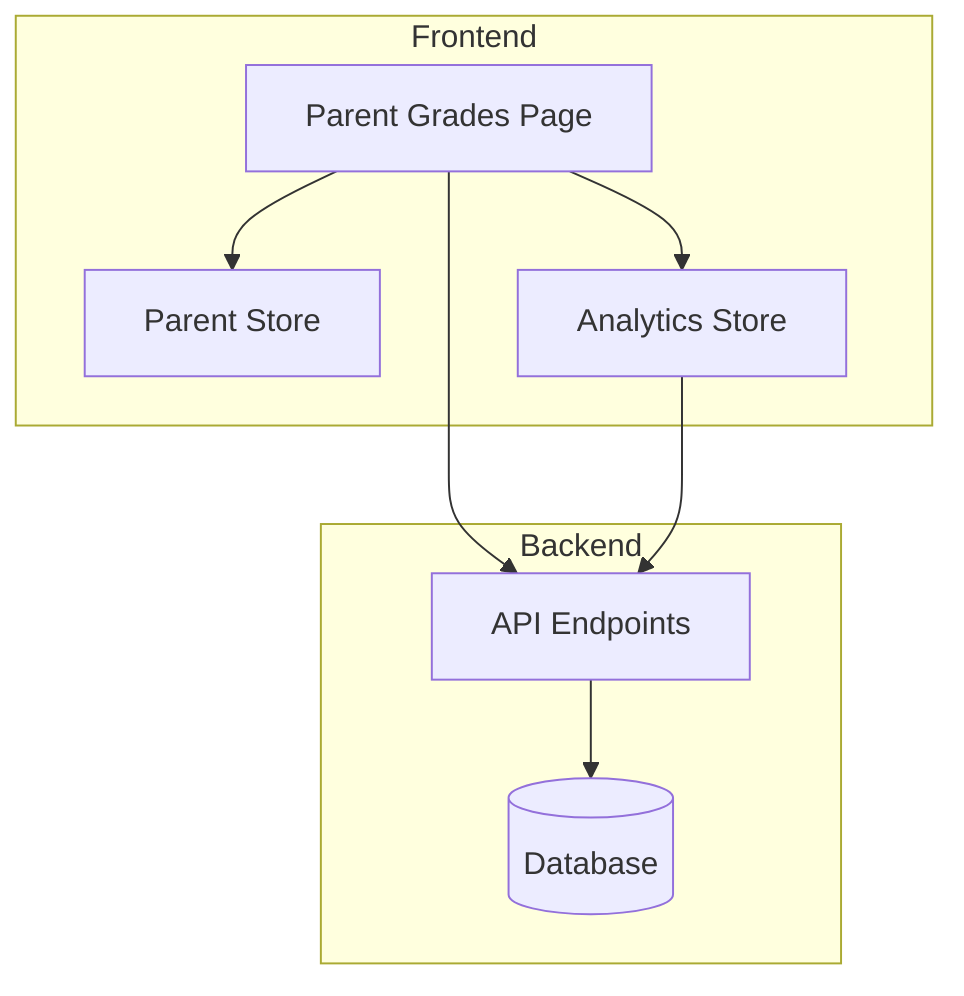
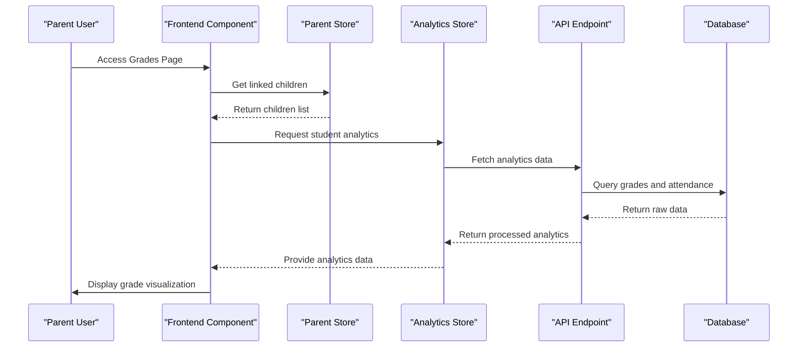
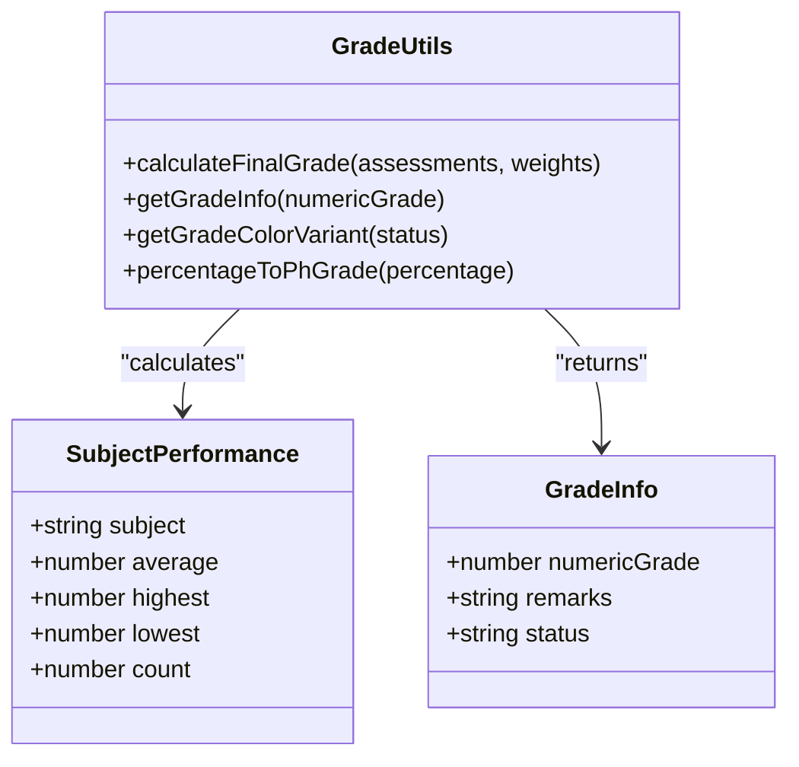
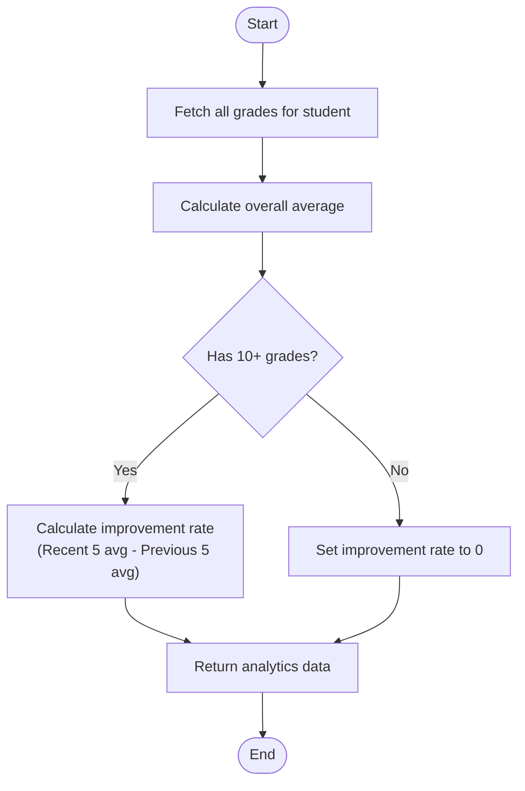
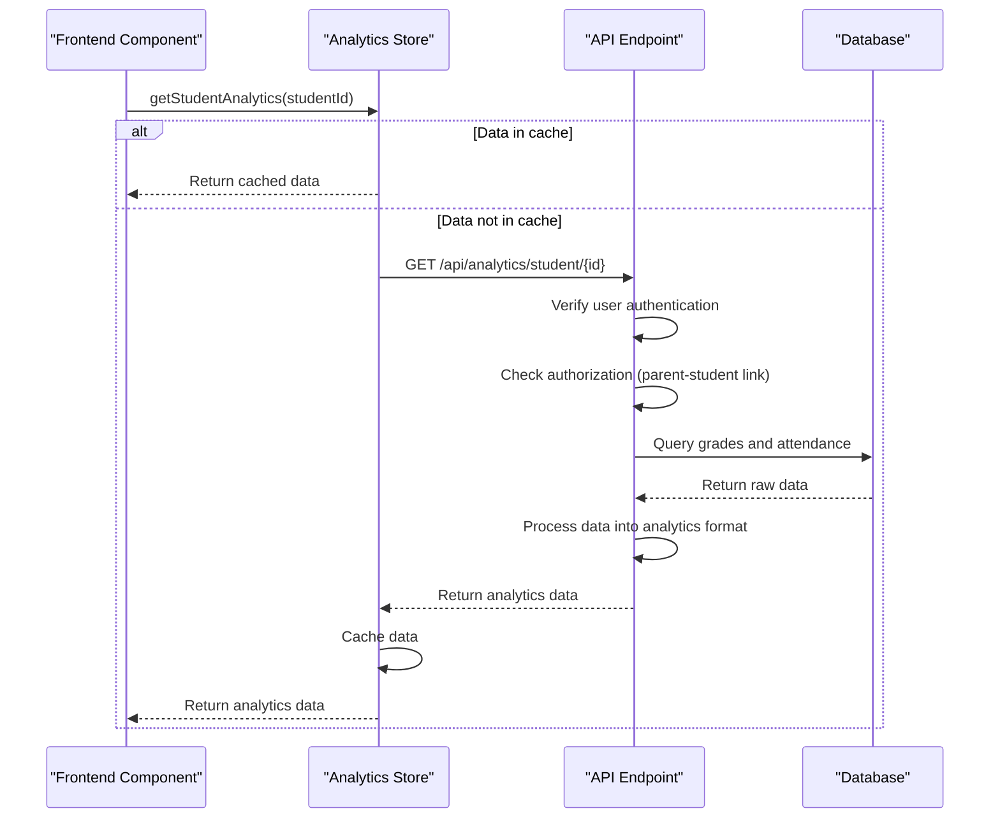
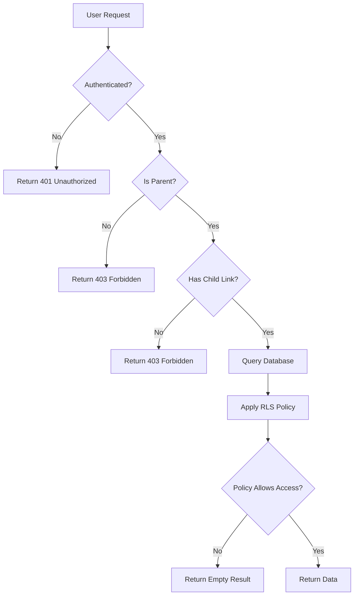
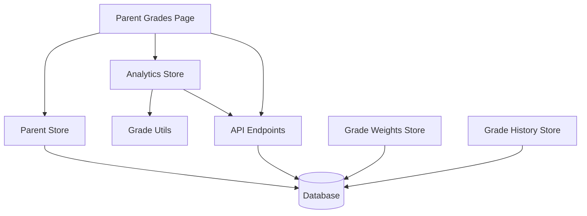

# Grade Monitoring

<cite>
**Referenced Files in This Document**   
- [page.tsx](file://app/parent/grades/page.tsx)
- [parent-store.ts](file://lib/parent-store.ts)
- [analytics-store.ts](file://lib/analytics-store.ts)
- [grade-utils.ts](file://lib/grade-utils.ts)
- [grade-history-store.ts](file://lib/grade-history-store.ts)
- [grade-weights-store.ts](file://lib/grade-weights-store.ts)
- [route.ts](file://app/api/parent/child/[id]/grades/route.ts)
- [route.ts](file://app/api/parent/children/route.ts)
- [route.ts](file://app/api/analytics/student/[id]/route.ts)
- [20251219043509_create_grades_tables.sql](file://supabase/migrations/20251219043509_create_grades_tables.sql)
</cite>

## Table of Contents
1. [Introduction](#introduction)
2. [Project Structure](#project-structure)
3. [Core Components](#core-components)
4. [Architecture Overview](#architecture-overview)
5. [Detailed Component Analysis](#detailed-component-analysis)
6. [Dependency Analysis](#dependency-analysis)
7. [Performance Considerations](#performance-considerations)
8. [Troubleshooting Guide](#troubleshooting-guide)
9. [Conclusion](#conclusion)

## Introduction
The Grade Monitoring feature enables parents to view and analyze their children's academic performance through a comprehensive visualization system. This documentation details the implementation of subject performance charts, recent grades listing, and overall average calculations. The system ensures secure access to grade data through proper authentication and authorization mechanisms, allowing parents to only view grades for their linked children. The user interface presents complex academic data in an accessible format, with visual indicators for performance trends and improvement areas.

## Project Structure
The Grade Monitoring feature is organized within the application's directory structure with dedicated components for parent-facing functionality. The frontend components are located in the `app/parent/grades` directory, while the supporting logic and state management are distributed across the `lib` directory. API endpoints for retrieving grade data are located in the `app/api/parent/child/[id]/grades` path, following a RESTful pattern for data access.

**Diagram sources**
- [page.tsx](file://app/parent/grades/page.tsx)
- [parent-store.ts](file://lib/parent-store.ts)
- [analytics-store.ts](file://lib/analytics-store.ts)
- [route.ts](file://app/api/parent/child/[id]/grades/route.ts)

**Section sources**
- [page.tsx](file://app/parent/grades/page.tsx)
- [parent-store.ts](file://lib/parent-store.ts)

## Core Components
The Grade Monitoring feature consists of several core components that work together to provide a comprehensive view of student performance. The parent store manages the relationship between parents and their children, while the analytics store handles the calculation and caching of performance metrics. The frontend page component orchestrates these elements to display grade trends, subject performance, and recent grades in an intuitive interface.

**Section sources**
- [parent-store.ts](file://lib/parent-store.ts)
- [analytics-store.ts](file://lib/analytics-store.ts)
- [page.tsx](file://app/parent/grades/page.tsx)

## Architecture Overview
The Grade Monitoring system follows a client-server architecture with a React frontend and Next.js API routes. Data flows from the database through API endpoints to client-side stores, where it is processed and made available to the UI components. The system uses zustand for state management, with persistent storage for grade weights and history. Security is enforced through Supabase's Row Level Security policies and role-based access control.

**Diagram sources**
- [page.tsx](file://app/parent/grades/page.tsx)
- [parent-store.ts](file://lib/parent-store.ts)
- [analytics-store.ts](file://lib/analytics-store.ts)
- [route.ts](file://app/api/analytics/student/[id]/route.ts)

## Detailed Component Analysis

### Grade Visualization System
The grade visualization system provides parents with multiple views of their child's academic performance, including trend charts, subject breakdowns, and recent grades. The system calculates overall averages and improvement rates to help identify academic progress.

#### Subject Performance Charts
The subject performance charts display a student's average grade across different subjects, with visual indicators for performance levels. The chart uses color coding based on the Philippine grading system, with different colors representing excellent, outstanding, very satisfactory, satisfactory, fairly satisfactory, and failing grades.

**Diagram sources**
- [grade-utils.ts](file://lib/grade-utils.ts)
- [analytics-store.ts](file://lib/analytics-store.ts)

**Section sources**
- [grade-utils.ts](file://lib/grade-utils.ts)
- [analytics-store.ts](file://lib/analytics-store.ts)

#### Recent Grades Listing
The recent grades listing displays the student's most recent assessments in reverse chronological order, with badges indicating the grade performance. Each entry shows the subject, assessment type, date, and numerical grade, allowing parents to quickly identify patterns in their child's performance.

#### Overall Average Calculations
The overall average is calculated by taking the mean of all recorded grades for a student. The system also calculates an improvement rate by comparing the average of the most recent five grades with the average of the previous five grades, providing insight into academic progress trends.

**Diagram sources**
- [analytics-store.ts](file://lib/analytics-store.ts)
- [route.ts](file://app/api/analytics/student/[id]/route.ts)

**Section sources**
- [analytics-store.ts](file://lib/analytics-store.ts)
- [route.ts](file://app/api/analytics/student/[id]/route.ts)

### Data Flow Analysis
The data flow for the Grade Monitoring feature follows a structured path from the frontend component through state management to the backend API and database. This ensures that data is properly authenticated, authorized, and processed before being presented to the user.

#### Frontend to State Management
The parent grades page component uses the parent store to retrieve the list of children linked to the current parent user. It then uses the analytics store to fetch performance data for the selected child, which may trigger API calls to retrieve the latest information from the server.

#### State Management to Backend API
When analytics data is not available in the client-side store, the analytics store makes API calls to the analytics endpoint. The API endpoint performs authorization checks to ensure the requesting user has access to the requested student's data before querying the database.

**Diagram sources**
- [analytics-store.ts](file://lib/analytics-store.ts)
- [route.ts](file://app/api/analytics/student/[id]/route.ts)

**Section sources**
- [analytics-store.ts](file://lib/analytics-store.ts)
- [route.ts](file://app/api/analytics/student/[id]/route.ts)

### Security Implementation
The security implementation ensures that parents can only access grade data for their linked children through multiple layers of protection, including authentication, authorization, and database-level security policies.

#### Authentication and Authorization
The system uses Supabase authentication to verify the identity of users. Once authenticated, the API endpoints check the user's role and relationship to the requested data. For parent users, the system verifies the parent-child relationship in the `parent_children` table before granting access to grade information.

#### Database Security
The database implements Row Level Security (RLS) policies to enforce data access rules at the database level. These policies ensure that even if an API endpoint were compromised, direct database queries would still be restricted by the user's identity and permissions.

**Diagram sources**
- [route.ts](file://app/api/parent/child/[id]/grades/route.ts)
- [20251219044036_add_rls_policies.sql](file://supabase/migrations/20251219044036_add_rls_policies.sql)

**Section sources**
- [route.ts](file://app/api/parent/child/[id]/grades/route.ts)
- [20251219044036_add_rls_policies.sql](file://supabase/migrations/20251219044036_add_rls_policies.sql)

## Dependency Analysis
The Grade Monitoring feature depends on several core components and services within the school management system. These dependencies ensure that data is consistent, secure, and efficiently delivered to the user interface.

**Diagram sources**
- [parent-store.ts](file://lib/parent-store.ts)
- [analytics-store.ts](file://lib/analytics-store.ts)
- [grade-utils.ts](file://lib/grade-utils.ts)
- [grade-history-store.ts](file://lib/grade-history-store.ts)
- [grade-weights-store.ts](file://lib/grade-weights-store.ts)

**Section sources**
- [parent-store.ts](file://lib/parent-store.ts)
- [analytics-store.ts](file://lib/analytics-store.ts)
- [grade-utils.ts](file://lib/grade-utils.ts)

## Performance Considerations
The Grade Monitoring system is designed with performance in mind, using client-side caching to reduce API calls and database queries. The analytics store caches student analytics data, preventing redundant requests when navigating between children. The system also uses optimized database queries with proper indexing to ensure fast data retrieval. For large datasets, the system limits the number of grades displayed in the recent grades list to the most recent 10 assessments, improving rendering performance.

## Troubleshooting Guide
This section addresses common issues that parents may encounter when using the Grade Monitoring feature and provides troubleshooting steps to resolve them.

### Missing Grade Data
If a parent cannot see grade data for their child, the following steps should be taken:
1. Verify that the parent account is properly linked to the child's account in the system
2. Check that the child has received grades from teachers in the current grading period
3. Refresh the page to ensure the latest data is fetched from the server
4. Contact school administration to confirm that grades have been entered into the system

**Section sources**
- [parent-store.ts](file://lib/parent-store.ts)
- [route.ts](file://app/api/parent/child/[id]/grades/route.ts)

### Delayed Updates
If grade updates appear to be delayed, consider the following:
1. The system may be caching data to improve performance - try refreshing the page after a few minutes
2. Teachers may not have submitted grades yet - check with the relevant teachers
3. There may be a synchronization delay between the teacher's grade entry and the parent view
4. Verify internet connectivity to ensure data can be properly transmitted

**Section sources**
- [analytics-store.ts](file://lib/analytics-store.ts)
- [route.ts](file://app/api/analytics/student/[id]/route.ts)

## Conclusion
The Grade Monitoring feature provides parents with a comprehensive view of their children's academic performance through an intuitive and secure interface. By leveraging client-side state management, efficient API design, and robust security measures, the system delivers timely and accurate grade information while protecting student privacy. The visualization components transform raw grade data into meaningful insights, helping parents identify areas of strength and opportunities for improvement in their child's education. The modular architecture allows for future enhancements, such as detailed grade history, predictive analytics, and personalized recommendations for academic support.