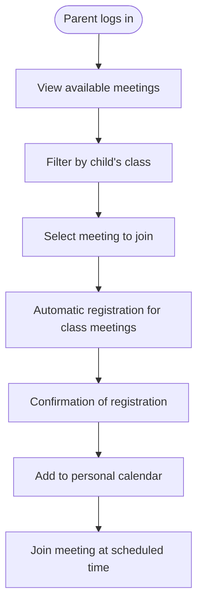
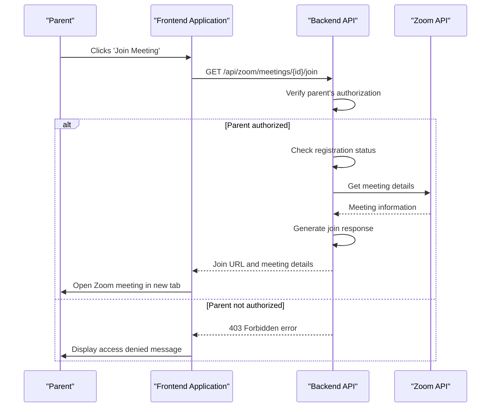
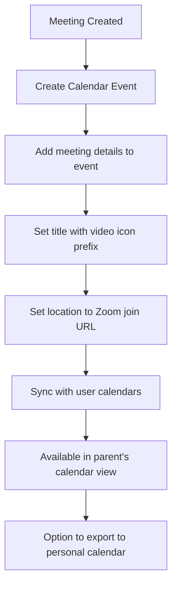
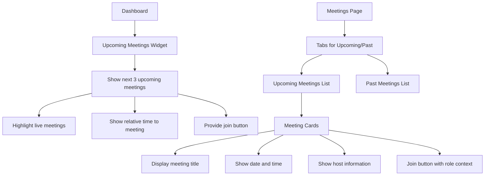
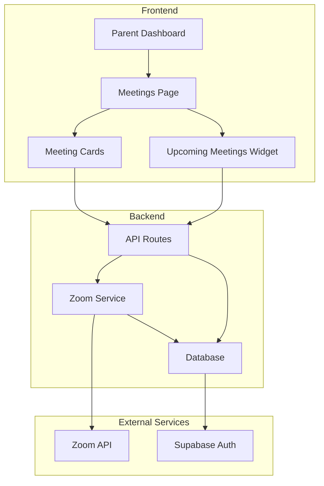

# Meeting Participation

<cite>
**Referenced Files in This Document**   
- [page.tsx](file://app/parent/meetings/page.tsx)
- [route.ts](file://app/api/zoom/meetings/route.ts)
- [register-student/route.ts](file://app/api/zoom/meetings/register-student/route.ts)
- [zoom-meetings-list.tsx](file://components/zoom-meetings-list.tsx)
- [zoom-meeting-card.tsx](file://components/zoom-meeting-card.tsx)
- [zoom-meeting-dialog.tsx](file://components/zoom-meeting-dialog.tsx)
- [client.ts](file://lib/zoom/client.ts)
- [types.ts](file://lib/zoom/types.ts)
- [join/route.ts](file://app/api/zoom/meetings/[id]/join/route.ts)
- [upcoming-meetings-widget.tsx](file://components/upcoming-meetings-widget.tsx)
- [zoom-participants-section.tsx](file://components/zoom-participants-section.tsx)
- [create_zoom_meetings_table.sql](file://supabase/migrations/20260110000001_create_zoom_meetings_table.sql)
- [create_meeting_registrants_table.sql](file://supabase/migrations/20260110000002_create_meeting_registrants_table.sql)
- [constants.ts](file://lib/zoom/constants.ts)
</cite>

## Table of Contents
1. [Introduction](#introduction)
2. [Meeting Discovery and Registration](#meeting-discovery-and-registration)
3. [Zoom Integration and Meeting Access](#zoom-integration-and-meeting-access)
4. [Calendar Synchronization](#calendar-synchronization)
5. [User Experience for Meeting Management](#user-experience-for-meeting-management)
6. [Common Issues and Troubleshooting](#common-issues-and-troubleshooting)
7. [Architecture Overview](#architecture-overview)
8. [Conclusion](#conclusion)

## Introduction
The Meeting Participation feature enables parents to schedule and join parent-teacher conferences and school events through an integrated Zoom meeting system. This documentation details the implementation of the meeting management system, covering meeting discovery, registration, Zoom integration, and calendar synchronization. The workflow allows parents to view available meetings, register for parent-teacher conferences, and access virtual meeting rooms seamlessly. The system is designed to provide a user-friendly experience while ensuring secure access and proper authentication for all participants.

**Section sources**
- [page.tsx](file://app/parent/meetings/page.tsx)

## Meeting Discovery and Registration

The meeting discovery and registration system allows parents to view and register for parent-teacher conferences and school events. The process begins with the parent accessing the meetings page, where they can view upcoming and past meetings. The system displays meetings based on the parent's relationship to students and classes, ensuring they only see relevant events.

Parents can discover meetings through multiple channels:
- The main meetings page displays all upcoming meetings for their children's classes
- The upcoming meetings widget on the dashboard provides quick access to soon-to-happen events
- Calendar integration allows parents to see meetings alongside their personal schedule

Registration for meetings is handled automatically for class-linked meetings. When a student is enrolled in a class, the system registers them (and their linked parents) for all upcoming class meetings. This ensures parents can join without manual registration steps. For meetings not linked to a class, parents may need to register manually through the meeting details page.

The registration process includes domain restrictions to ensure only authorized participants can join. For class meetings, only users with @r1.deped.gov.ph email addresses can participate, preventing unauthorized access. Parents are automatically granted access to meetings for their children's classes through the parent-children relationship mapping in the database.

**Diagram sources**
- [page.tsx](file://app/parent/meetings/page.tsx)
- [route.ts](file://app/api/zoom/meetings/route.ts)
- [register-student/route.ts](file://app/api/zoom/meetings/register-student/route.ts)

**Section sources**
- [page.tsx](file://app/parent/meetings/page.tsx)
- [route.ts](file://app/api/zoom/meetings/route.ts)
- [register-student/route.ts](file://app/api/zoom/meetings/register-student/route.ts)

## Zoom Integration and Meeting Access

The Zoom integration enables seamless access to virtual meeting rooms for parent-teacher conferences and school events. The system uses Zoom's Server-to-Server OAuth for backend operations, ensuring secure authentication and meeting management. When a parent attempts to join a meeting, the system verifies their authorization and provides the appropriate join URL.

The meeting access workflow follows these steps:
1. Parent selects a meeting to join from the meetings list
2. System verifies the parent's authorization to attend the meeting
3. For class meetings, checks if any of the parent's children are enrolled in the associated class
4. Generates the appropriate join URL, which may be a personalized URL for registered participants
5. Opens the Zoom meeting in a new browser tab

The integration includes several security features:
- Domain restrictions for student participants (only @r1.deped.gov.ph emails allowed)
- Role-based access control ensuring parents can only join meetings for their children's classes
- Automatic registration for enrolled students and their parents
- Waiting room bypass for registered participants

For enhanced user experience, the system provides both standard join URLs and SDK-based integration. The SDK signature generation allows for embedded meeting experiences in the future, though currently meetings open in a new browser tab. The system also records participant attendance, tracking join and leave times for attendance reporting.

**Diagram sources**
- [join/route.ts](file://app/api/zoom/meetings/[id]/join/route.ts)
- [client.ts](file://lib/zoom/client.ts)
- [types.ts](file://lib/zoom/types.ts)

**Section sources**
- [join/route.ts](file://app/api/zoom/meetings/[id]/join/route.ts)
- [client.ts](file://lib/zoom/client.ts)
- [types.ts](file://lib/zoom/types.ts)

## Calendar Synchronization

The calendar synchronization feature allows parents to add meetings to their personal calendars, ensuring they don't miss important parent-teacher conferences and school events. When a meeting is created, the system automatically creates a corresponding calendar event in the application's calendar system.

The synchronization process works as follows:
- When a teacher or administrator creates a meeting, a calendar event is automatically created
- The event includes key details such as meeting title, date, time, and Zoom join URL
- Parents can view these events in the application's calendar interface
- The calendar event title is prefixed with "📹" to distinguish meeting events from other types
- The location field contains the Zoom join URL for easy access

Parents can also export these events to their personal calendar applications (Google Calendar, Outlook, etc.) through standard calendar export functionality. This allows them to manage school meetings alongside their personal and professional commitments in a single calendar view.

The system ensures synchronization by:
- Creating calendar events transactionally with meeting creation
- Updating calendar events when meeting details change
- Deleting calendar events when meetings are cancelled
- Including all necessary meeting details in the calendar event description

**Diagram sources**
- [route.ts](file://app/api/zoom/meetings/route.ts)
- [create_zoom_meetings_table.sql](file://supabase/migrations/20260110000001_create_zoom_meetings_table.sql)

**Section sources**
- [route.ts](file://app/api/zoom/meetings/route.ts)

## User Experience for Meeting Management

The user experience for meeting management is designed to be intuitive and accessible for parents. The interface provides clear visual indicators for meeting status, easy access to join meetings, and comprehensive information about upcoming events.

Key user experience features include:
- A clean, card-based interface for meeting listings
- Visual indicators for meeting status (upcoming, live, past)
- One-click joining of meetings with appropriate role-based actions (join vs. start)
- Responsive design that works on both desktop and mobile devices
- Clear error messages and guidance when access is denied

The meetings list component provides a tabbed interface to separate upcoming and past meetings, making it easy for parents to focus on relevant events. Each meeting card displays essential information including:
- Meeting title and description
- Date and time with relative time indicators (e.g., "Starts in 2 hours")
- Duration of the meeting
- Host information with avatar
- Class association (if applicable)
- Join button with appropriate text ("Join" or "Start")

For parents managing multiple children, the system aggregates meetings from all their children's classes, providing a comprehensive view of all upcoming parent-teacher conferences and school events. The upcoming meetings widget on the dashboard provides a quick overview of imminent events, allowing parents to stay informed without navigating to the full meetings page.

**Diagram sources**
- [zoom-meetings-list.tsx](file://components/zoom-meetings-list.tsx)
- [zoom-meeting-card.tsx](file://components/zoom-meeting-card.tsx)
- [upcoming-meetings-widget.tsx](file://components/upcoming-meetings-widget.tsx)

**Section sources**
- [zoom-meetings-list.tsx](file://components/zoom-meetings-list.tsx)
- [zoom-meeting-card.tsx](file://components/zoom-meeting-card.tsx)
- [upcoming-meetings-widget.tsx](file://components/upcoming-meetings-widget.tsx)

## Common Issues and Troubleshooting

Parents may encounter several common issues when using the meeting participation system. This section provides troubleshooting steps for the most frequent problems.

### Registration Failures
**Issue**: Parent cannot register for a meeting or receives a domain restriction error.
**Solution**:
1. Verify that the parent's account is properly linked to their children in the system
2. Check that the children are enrolled in the class associated with the meeting
3. For student accounts, ensure they have a valid @r1.deped.gov.ph email address
4. Contact school administrator if the issue persists

### Connection Problems
**Issue**: Unable to join a meeting or connection drops during the meeting.
**Troubleshooting steps**:
1. Check internet connection stability
2. Ensure the latest version of the Zoom application or browser is being used
3. Try joining from a different device or network
4. Verify that the meeting has not been cancelled or rescheduled
5. Check that the user has the necessary permissions to join the meeting

### Access Denied Errors
**Issue**: Parent receives "access denied" when attempting to join a meeting.
**Resolution**:
1. Confirm that the parent's children are enrolled in the class associated with the meeting
2. Verify that the parent account is properly linked to the student accounts
3. Check that the meeting is still active and not in a cancelled state
4. Contact the teacher or administrator hosting the meeting for assistance

### Calendar Sync Issues
**Issue**: Meeting does not appear in the calendar or calendar event details are incorrect.
**Steps to resolve**:
1. Refresh the calendar view in the application
2. Check that the meeting was created successfully
3. Verify that the calendar synchronization service is operational
4. Manually add the meeting to the personal calendar using the join URL if needed

The system logs all access attempts and errors, which administrators can review to diagnose persistent issues. Parents should contact their school's support team if troubleshooting steps do not resolve their problems.

**Section sources**
- [join/route.ts](file://app/api/zoom/meetings/[id]/join/route.ts)
- [constants.ts](file://lib/zoom/constants.ts)
- [client.ts](file://lib/zoom/client.ts)

## Architecture Overview

The meeting participation system follows a layered architecture with clear separation of concerns between the frontend, backend, and external services. The system integrates with Zoom's API for meeting management while maintaining its own data storage for meeting metadata and participant tracking.

The data model consists of three main tables:
- `zoom_meetings`: Stores meeting metadata including title, time, host, and settings
- `zoom_participants`: Tracks attendance with join/leave times and duration
- `meeting_registrants`: Manages registration information and personalized join URLs

Row Level Security (RLS) policies ensure that users can only access meetings they are authorized to view, based on their role and relationships to students and classes. The system uses Supabase for authentication and database operations, with Next.js API routes handling the business logic.

**Diagram sources**
- [create_zoom_meetings_table.sql](file://supabase/migrations/20260110000001_create_zoom_meetings_table.sql)
- [create_meeting_registrants_table.sql](file://supabase/migrations/20260110000002_create_meeting_registrants_table.sql)
- [page.tsx](file://app/parent/meetings/page.tsx)

**Section sources**
- [create_zoom_meetings_table.sql](file://supabase/migrations/20260110000001_create_zoom_meetings_table.sql)
- [create_meeting_registrants_table.sql](file://supabase/migrations/20260110000002_create_meeting_registrants_table.sql)

## Conclusion
The Meeting Participation feature provides a comprehensive solution for parents to engage in parent-teacher conferences and school events through virtual meetings. By integrating with Zoom and implementing robust authorization and registration systems, the feature ensures secure and accessible communication between parents, teachers, and school administrators. The user-friendly interface, calendar synchronization, and automated registration processes create a seamless experience that encourages parental involvement in their children's education. The system's architecture prioritizes security, scalability, and ease of use, making it an effective tool for modern school communication.