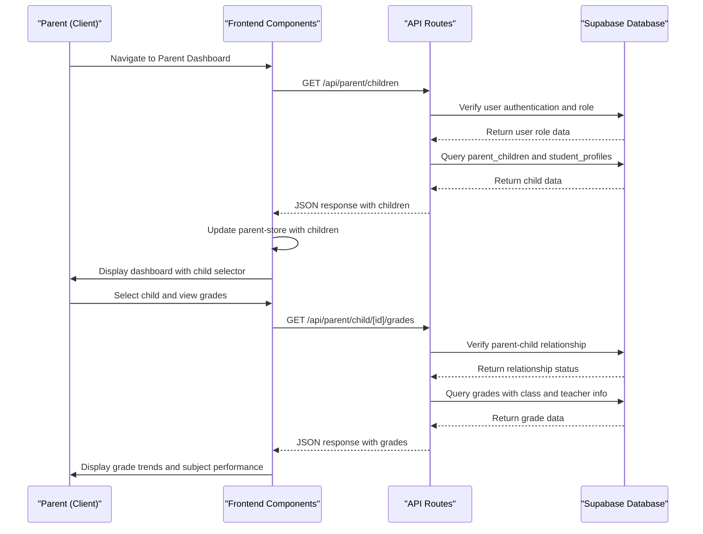
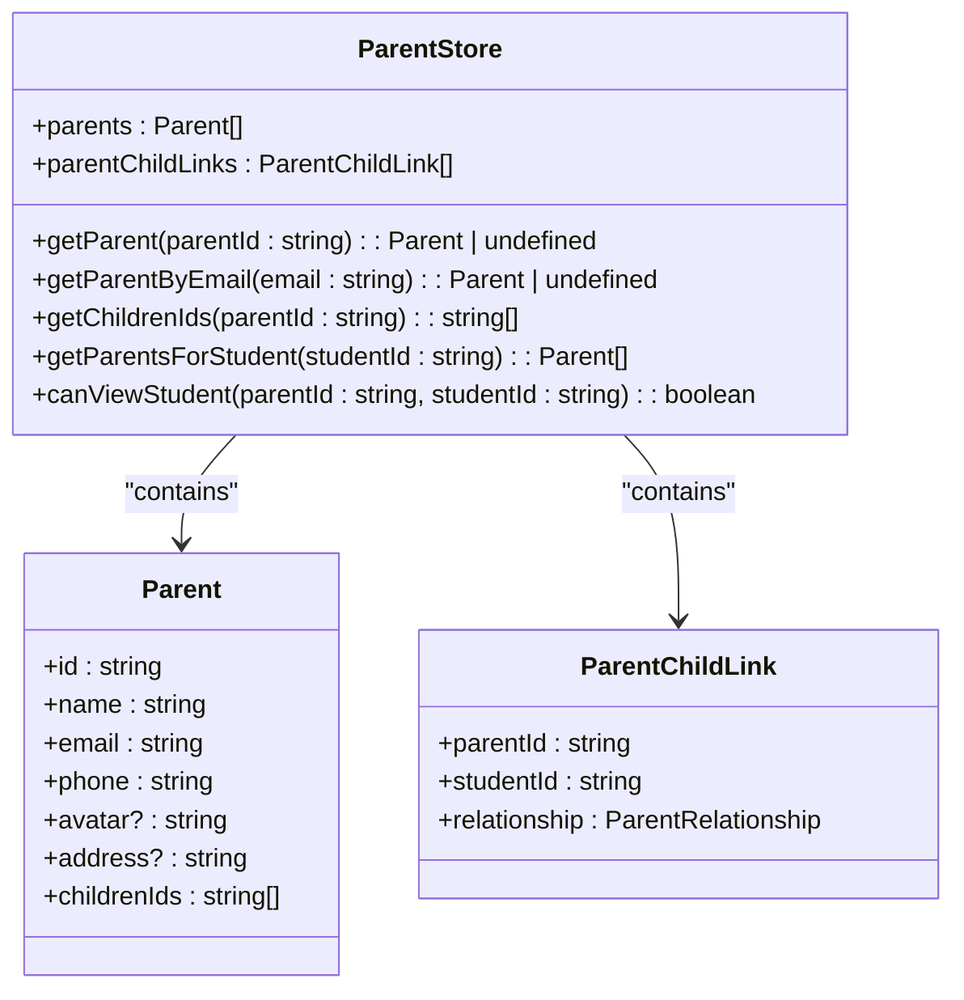
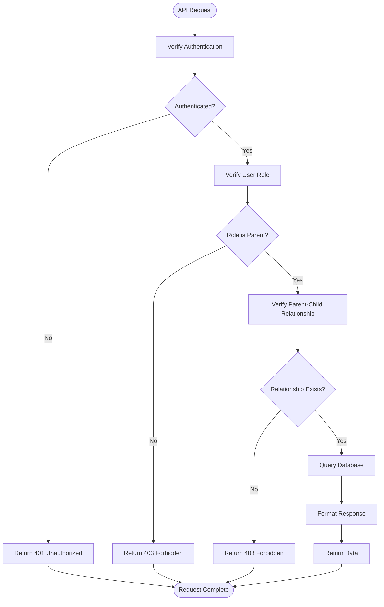
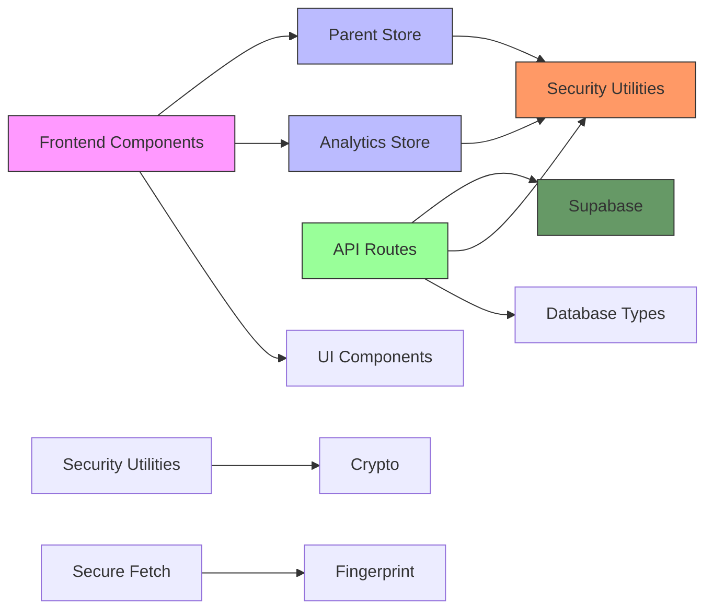

# Parent Monitoring

<cite>
**Referenced Files in This Document**   
- [parent-store.ts](file://lib/parent-store.ts)
- [parent/page.tsx](file://app/parent/page.tsx)
- [parent/grades/page.tsx](file://app/parent/grades/page.tsx)
- [parent/attendance/page.tsx](file://app/parent/attendance/page.tsx)
- [parent/calendar/page.tsx](file://app/parent/calendar/page.tsx)
- [api/parent/children/route.ts](file://app/api/parent/children/route.ts)
- [api/parent/child/[id]/grades/route.ts](file://app/api/parent/child/[id]/grades/route.ts)
- [api/parent/child/[id]/attendance/route.ts](file://app/api/parent/child/[id]/attendance/route.ts)
- [analytics-store.ts](file://lib/analytics-store.ts)
- [security.ts](file://lib/security.ts)
- [secure-fetch.ts](file://lib/secure-fetch.ts)
</cite>

## Table of Contents
1. [Introduction](#introduction)
2. [Project Structure](#project-structure)
3. [Core Components](#core-components)
4. [Architecture Overview](#architecture-overview)
5. [Detailed Component Analysis](#detailed-component-analysis)
6. [Dependency Analysis](#dependency-analysis)
7. [Performance Considerations](#performance-considerations)
8. [Troubleshooting Guide](#troubleshooting-guide)
9. [Conclusion](#conclusion)

## Introduction
The Parent Monitoring system enables parents to track their children's academic progress through a secure, user-friendly interface. This documentation details the implementation of key features including grade viewing, attendance monitoring, calendar access, announcement reading, and meeting participation. The system leverages state management via parent-store to allow seamless navigation between multiple children's data. Backend integration occurs through API routes in app/api/parent/, ensuring secure data retrieval with proper authorization checks. The design emphasizes data visualization for academic trends and supports multi-child households with intuitive child selection controls.

## Project Structure
The Parent Monitoring system follows a structured Next.js application layout with clear separation between UI components, API routes, and state management utilities. The core parent functionality resides in the app/parent/ directory, containing dedicated pages for grades, attendance, calendar, announcements, and meetings. API endpoints are organized under app/api/parent/, following a logical hierarchy for child-specific data retrieval. State management is centralized in lib/parent-store.ts and lib/analytics-store.ts, while security mechanisms are implemented across various utility files.

```mermaid
graph TB
subgraph "UI Components"
A[app/parent/page.tsx]
B[app/parent/grades/page.tsx]
C[app/parent/attendance/page.tsx]
D[app/parent/calendar/page.tsx]
end
subgraph "API Endpoints"
E[app/api/parent/children/route.ts]
F[app/api/parent/child/[id]/grades/route.ts]
G[app/api/parent/child/[id]/attendance/route.ts]
end
subgraph "State Management"
H[lib/parent-store.ts]
I[lib/analytics-store.ts]
end
subgraph "Security"
J[lib/security.ts]
K[lib/secure-fetch.ts]
end
A --> H
B --> I
C --> I
E --> H
F --> I
G --> I
A --> E
B --> F
C --> G
H --> J
I --> J
K --> J
```

**Diagram sources**
- [parent/page.tsx](file://app/parent/page.tsx)
- [api/parent/children/route.ts](file://app/api/parent/children/route.ts)
- [lib/parent-store.ts](file://lib/parent-store.ts)

**Section sources**
- [parent/page.tsx](file://app/parent/page.tsx)
- [api/parent/children/route.ts](file://app/api/parent/children/route.ts)

## Core Components
The Parent Monitoring system's core functionality revolves around the parent-store state management, which maintains parent-child relationships and enables data access control. The dashboard provides an overview of key metrics including overall average, attendance rate, subject count, and improvement rate. Individual feature pages offer detailed views of grades, attendance records, calendar events, announcements, and meeting schedules. Data visualization components present academic trends through line charts and performance breakdowns, while security measures ensure parents only access their linked children's information.

**Section sources**
- [parent-store.ts](file://lib/parent-store.ts)
- [parent/page.tsx](file://app/parent/page.tsx)
- [analytics-store.ts](file://lib/analytics-store.ts)

## Architecture Overview
The Parent Monitoring system follows a client-server architecture with React-based frontend components communicating with Next.js API routes. The system employs zustand for client-side state management, storing parent and child relationship data in memory. API routes handle authentication verification, role checking, and database queries through Supabase. Security measures include origin validation, fingerprint headers, and IP address hashing to prevent unauthorized access and abuse. Data flows from the database through API routes to client components, with all access controlled by parent-child relationship verification.



**Diagram sources**
- [api/parent/children/route.ts](file://app/api/parent/children/route.ts)
- [api/parent/child/[id]/grades/route.ts](file://app/api/parent/child/[id]/grades/route.ts)
- [parent-store.ts](file://lib/parent-store.ts)

## Detailed Component Analysis

### Parent Store Analysis
The parent-store implements a zustand-based state management solution for handling parent-child relationships and data access control. It provides methods to retrieve parent information, get children IDs, and verify viewing permissions. The store maintains collections of parents and parent-child links, enabling efficient lookups without repeated database queries. The canViewStudent method ensures security by confirming that a parent has authorization to access a specific student's data.



**Diagram sources**
- [parent-store.ts](file://lib/parent-store.ts)

**Section sources**
- [parent-store.ts](file://lib/parent-store.ts)

### Analytics Store Analysis
The analytics-store provides student performance analytics including grade trends, attendance statistics, and subject performance metrics. It calculates derived data such as overall averages, improvement rates, and attendance percentages from raw data. The store exposes methods to retrieve student analytics, get grade trends by subject, calculate attendance statistics, and compute class averages. This centralized analytics logic enables consistent data presentation across different parent interface components.

```mermaid
classDiagram
class AnalyticsStore {
+studentAnalytics : Record<string, StudentAnalytics>
+getStudentAnalytics(studentId : string) : StudentAnalytics | undefined
+getGradeTrendsBySubject(studentId : string, subject : string) : GradeTrend[]
+getAttendanceStats(studentId : string) : AttendanceStats
+getClassAverages(classId : string, studentIds : string[]) : { average : number; highest : number; lowest : number }
}
class StudentAnalytics {
+studentId : string
+gradeTrends : GradeTrend[]
+attendanceTrends : AttendanceTrend[]
+subjectPerformance : SubjectPerformance[]
+overallAverage : number
+attendanceRate : number
+improvementRate : number
}
class GradeTrend {
+date : string
+grade : number
+subject : string
+type : string
}
class AttendanceTrend {
+date : string
+status : AttendanceStatus
}
class SubjectPerformance {
+subject : string
+average : number
+highest : number
+lowest : number
+count : number
}
AnalyticsStore --> StudentAnalytics : "contains"
StudentAnalytics --> GradeTrend : "contains"
StudentAnalytics --> AttendanceTrend : "contains"
StudentAnalytics --> SubjectPerformance : "contains"
```

**Diagram sources**
- [analytics-store.ts](file://lib/analytics-store.ts)

**Section sources**
- [analytics-store.ts](file://lib/analytics-store.ts)

### API Security Analysis
The security implementation ensures that parent data access is properly authenticated and authorized. API routes verify user authentication through Supabase auth, check user roles to confirm parent status, and validate parent-child relationships before returning sensitive data. Additional security measures include origin validation to prevent CSRF attacks, client fingerprinting to detect session hijacking, and IP address hashing for privacy-preserving abuse detection. These layered security controls protect student data while maintaining system usability.



**Diagram sources**
- [security.ts](file://lib/security.ts)
- [api/parent/child/[id]/grades/route.ts](file://app/api/parent/child/[id]/grades/route.ts)

**Section sources**
- [security.ts](file://lib/security.ts)
- [api/parent/child/[id]/grades/route.ts](file://app/api/parent/child/[id]/grades/route.ts)

## Dependency Analysis
The Parent Monitoring system has well-defined dependencies between components, with clear separation of concerns. The frontend components depend on state management stores for data, while API routes depend on Supabase for database access and authentication. Security utilities are imported by API routes to enforce access controls. The system avoids circular dependencies through careful architectural planning, with data flowing unidirectionally from database to API to client components. Third-party dependencies include zustand for state management, lucide-react for icons, and recharts for data visualization.



**Diagram sources**
- [parent-store.ts](file://lib/parent-store.ts)
- [analytics-store.ts](file://lib/analytics-store.ts)
- [security.ts](file://lib/security.ts)
- [api/parent/children/route.ts](file://app/api/parent/children/route.ts)

**Section sources**
- [parent-store.ts](file://lib/parent-store.ts)
- [analytics-store.ts](file://lib/analytics-store.ts)

## Performance Considerations
The Parent Monitoring system implements several performance optimizations to ensure responsive user experience. Client-side state management reduces redundant API calls by caching parent and child data. API routes use efficient database queries with proper indexing and selective field retrieval. The analytics-store pre-calculates derived metrics to avoid repeated computation. Data fetching is optimized with server-side rendering where appropriate, and client components implement loading states to provide feedback during data retrieval. For large datasets, API routes support pagination and date filtering parameters to limit response size.

## Troubleshooting Guide
Parents may encounter issues with data visibility or connectivity in the monitoring system. Common problems include missing child data, which typically indicates an incomplete parent-child linking process in the administration system. Connection errors may occur due to network issues or authentication timeouts, resolved by refreshing the page or re-authenticating. If grades or attendance records appear incomplete, parents should verify the date range being viewed and check if the data has been entered by teachers. For persistent issues, clearing browser cache or trying a different browser may resolve frontend rendering problems. Administrators should ensure that parent-child relationships are properly established in the database and that API routes are accessible.

**Section sources**
- [parent-store.ts](file://lib/parent-store.ts)
- [api/parent/children/route.ts](file://app/api/parent/children/route.ts)
- [security.ts](file://lib/security.ts)

## Conclusion
The Parent Monitoring system provides a comprehensive solution for parents to track their children's academic progress through a secure, intuitive interface. By leveraging client-side state management and well-structured API routes, the system enables efficient access to grades, attendance records, calendar events, and other educational data. The architecture prioritizes security through rigorous authentication, authorization, and data access controls, ensuring that parents only view information for their linked children. With its focus on data visualization and multi-child household support, the system enhances parental engagement in the educational process while maintaining performance and reliability.