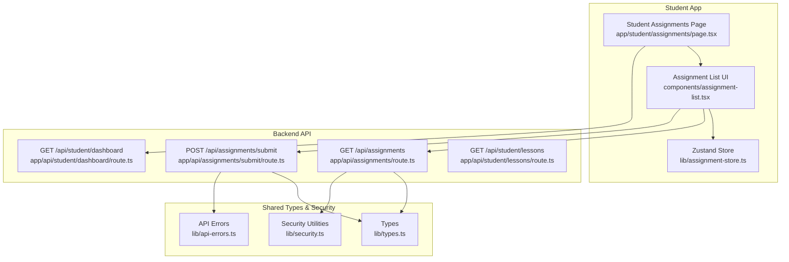
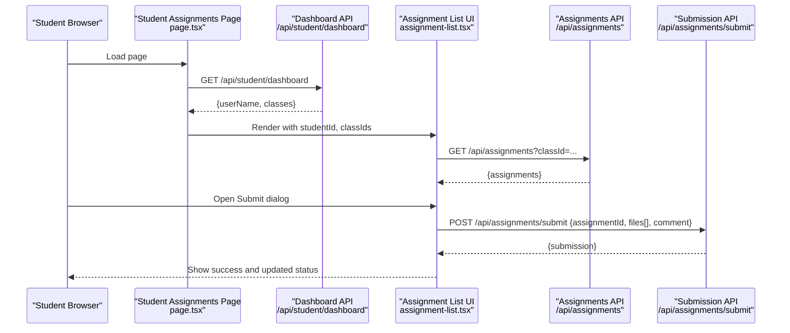
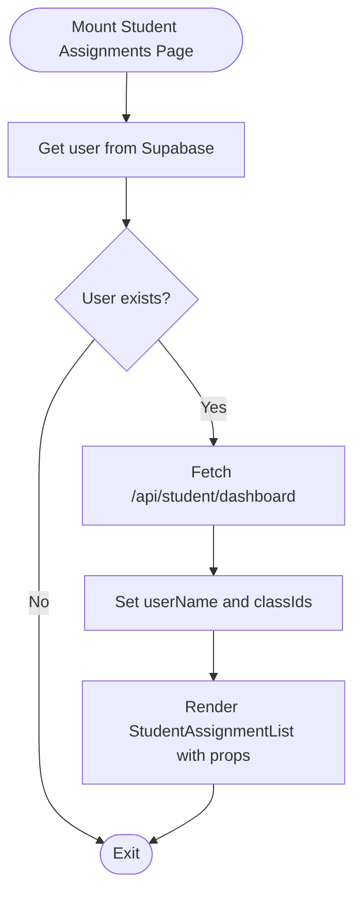
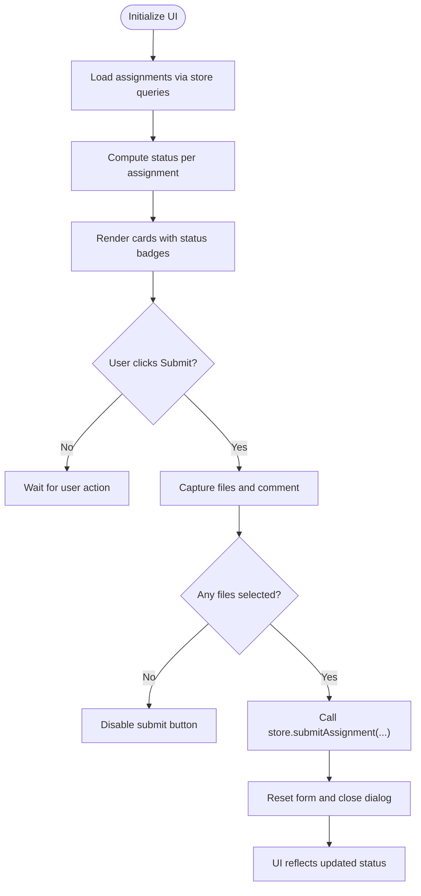
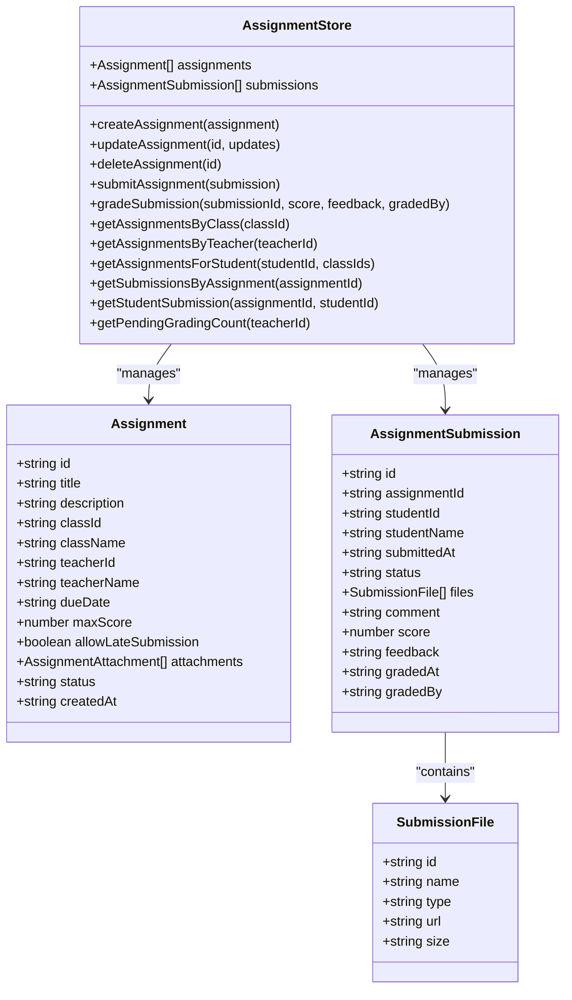
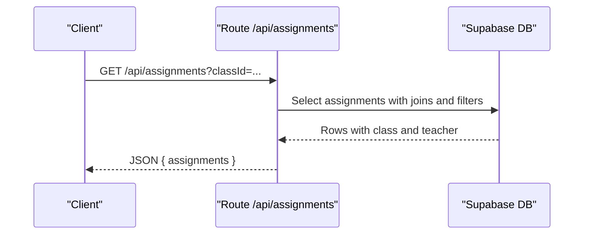
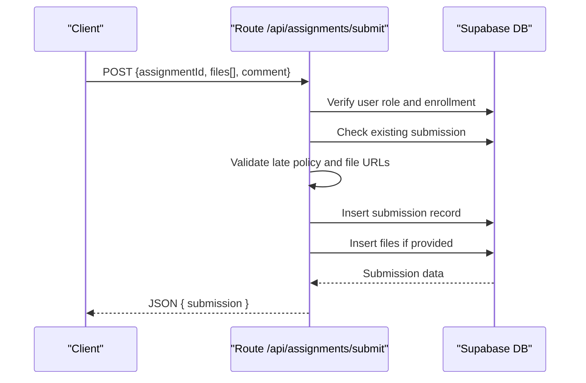
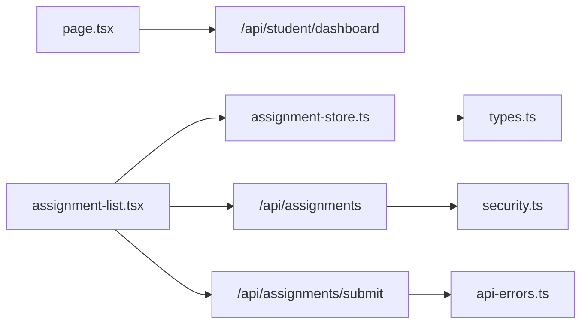

# Assignment Submission

<cite>
**Referenced Files in This Document**
- [page.tsx](file://app/student/assignments/page.tsx)
- [assignment-list.tsx](file://components/assignment-list.tsx)
- [assignment-store.ts](file://lib/assignment-store.ts)
- [route.ts](file://app/api/assignments/route.ts)
- [route.ts](file://app/api/assignments/submit/route.ts)
- [route.ts](file://app/api/student/dashboard/route.ts)
- [route.ts](file://app/api/student/lessons/route.ts)
- [types.ts](file://lib/types.ts)
- [api-errors.ts](file://lib/api-errors.ts)
- [security.ts](file://lib/security.ts)
- [teacher-assignment-manager.tsx](file://components/teacher-assignment-manager.tsx)
</cite>

## Table of Contents
1. [Introduction](#introduction)
2. [Project Structure](#project-structure)
3. [Core Components](#core-components)
4. [Architecture Overview](#architecture-overview)
5. [Detailed Component Analysis](#detailed-component-analysis)
6. [Dependency Analysis](#dependency-analysis)
7. [Performance Considerations](#performance-considerations)
8. [Troubleshooting Guide](#troubleshooting-guide)
9. [Conclusion](#conclusion)
10. [Appendices](#appendices)

## Introduction
This document explains the Assignment Submission sub-feature for students, covering how they access assigned tasks, view deadlines, and submit completed work. It documents the integration between the assignments page and the backend API routes that fetch lesson materials and submission statuses, describes UI components used to display assignment lists and filter by due date or completion status, and outlines how file uploads or text responses are handled through the API. It also addresses offline support and local state persistence using the Zustand store, common user errors such as missed deadlines or incorrect file formats, recommended practices for timely submissions, and responsive design considerations for mobile workflows.

## Project Structure
The Assignment Submission feature spans three layers:
- Frontend pages and components: student assignments page, assignment list UI, and the shared Zustand store.
- Backend API routes: assignment listing and creation for teachers, and student submission handling.
- Supporting utilities: type definitions, centralized API error handling, and origin validation.

**Diagram sources**
- [page.tsx](file://app/student/assignments/page.tsx#L1-L68)
- [assignment-list.tsx](file://components/assignment-list.tsx#L1-L271)
- [assignment-store.ts](file://lib/assignment-store.ts#L1-L174)
- [route.ts](file://app/api/assignments/route.ts#L1-L134)
- [route.ts](file://app/api/assignments/submit/route.ts#L1-L143)
- [route.ts](file://app/api/student/dashboard/route.ts#L1-L117)
- [route.ts](file://app/api/student/lessons/route.ts#L1-L67)
- [types.ts](file://lib/types.ts#L1-L28)
- [api-errors.ts](file://lib/api-errors.ts#L1-L116)
- [security.ts](file://lib/security.ts#L1-L136)

**Section sources**
- [page.tsx](file://app/student/assignments/page.tsx#L1-L68)
- [assignment-list.tsx](file://components/assignment-list.tsx#L1-L271)
- [assignment-store.ts](file://lib/assignment-store.ts#L1-L174)
- [route.ts](file://app/api/assignments/route.ts#L1-L134)
- [route.ts](file://app/api/assignments/submit/route.ts#L1-L143)
- [route.ts](file://app/api/student/dashboard/route.ts#L1-L117)
- [route.ts](file://app/api/student/lessons/route.ts#L1-L67)
- [types.ts](file://lib/types.ts#L1-L28)
- [api-errors.ts](file://lib/api-errors.ts#L1-L116)
- [security.ts](file://lib/security.ts#L1-L136)

## Core Components
- Student Assignments Page: Initializes user context, loads class IDs, and renders the assignment list UI.
- Assignment List UI: Displays assignments, calculates status (pending, submitted, late, overdue), and provides submission dialogs.
- Zustand Assignment Store: Manages local state for assignments and submissions, including computed status and queries.
- Backend API Routes: Provide assignment listings and student submission handling with robust validation and security.
- Supporting Utilities: Define shared types, centralized error handling, and origin validation.

Key responsibilities:
- Access control and role verification in API routes.
- Input validation using Zod schemas.
- Late submission policy enforcement.
- File URL validation for submissions.
- Local state updates for immediate UI feedback.

**Section sources**
- [page.tsx](file://app/student/assignments/page.tsx#L1-L68)
- [assignment-list.tsx](file://components/assignment-list.tsx#L1-L271)
- [assignment-store.ts](file://lib/assignment-store.ts#L1-L174)
- [route.ts](file://app/api/assignments/route.ts#L1-L134)
- [route.ts](file://app/api/assignments/submit/route.ts#L1-L143)
- [types.ts](file://lib/types.ts#L1-L28)
- [api-errors.ts](file://lib/api-errors.ts#L1-L116)
- [security.ts](file://lib/security.ts#L1-L136)

## Architecture Overview
The student assignment workflow integrates frontend and backend as follows:
- The student page fetches user profile and enrolled class IDs from the dashboard endpoint.
- The assignment list queries assignments filtered by class IDs and published status.
- Students submit assignments via a dialog that posts to the submission endpoint.
- The backend validates roles, enrollment, duplication, and late submission policies before persisting records.

**Diagram sources**
- [page.tsx](file://app/student/assignments/page.tsx#L1-L68)
- [assignment-list.tsx](file://components/assignment-list.tsx#L1-L271)
- [route.ts](file://app/api/assignments/route.ts#L1-L134)
- [route.ts](file://app/api/assignments/submit/route.ts#L1-L143)
- [route.ts](file://app/api/student/dashboard/route.ts#L1-L117)

## Detailed Component Analysis

### Student Assignments Page
- Fetches user and class context from the dashboard endpoint.
- Renders the assignment list UI with studentId and classIds.
- Provides a loader until data is ready.

**Diagram sources**
- [page.tsx](file://app/student/assignments/page.tsx#L1-L68)
- [route.ts](file://app/api/student/dashboard/route.ts#L1-L117)

**Section sources**
- [page.tsx](file://app/student/assignments/page.tsx#L1-L68)
- [route.ts](file://app/api/student/dashboard/route.ts#L1-L117)

### Assignment List UI
- Computes status based on due date and existing submission.
- Displays due dates, max scores, and submission details.
- Provides a dialog to upload files and add comments, then triggers local store submission.

**Diagram sources**
- [assignment-list.tsx](file://components/assignment-list.tsx#L1-L271)
- [assignment-store.ts](file://lib/assignment-store.ts#L1-L174)

**Section sources**
- [assignment-list.tsx](file://components/assignment-list.tsx#L1-L271)
- [assignment-store.ts](file://lib/assignment-store.ts#L1-L174)

### Assignment Store (Zustand)
- Maintains in-memory assignments and submissions.
- Computes submission status locally (submitted vs late) based on due date.
- Exposes queries for filtering by class, teacher, and student.
- Provides actions to create/update/delete assignments and grade submissions.

**Diagram sources**
- [assignment-store.ts](file://lib/assignment-store.ts#L1-L174)
- [types.ts](file://lib/types.ts#L1-L28)

**Section sources**
- [assignment-store.ts](file://lib/assignment-store.ts#L1-L174)
- [types.ts](file://lib/types.ts#L1-L28)

### Backend API: Assignments Listing
- GET /api/assignments filters by classId when provided and enforces role-based visibility:
  - Teachers see their own assignments.
  - Students see only published assignments.
- Applies ordering by due date ascending.

**Diagram sources**
- [route.ts](file://app/api/assignments/route.ts#L1-L134)

**Section sources**
- [route.ts](file://app/api/assignments/route.ts#L1-L134)

### Backend API: Student Submission
- POST /api/assignments/submit validates:
  - Authentication and student role.
  - Assignment existence and published status.
  - Enrollment in the class.
  - Duplicate submission prevention.
  - Late submission policy (allowance).
  - File URL validation (only allowed hosts).
- Persists submission and optional files.

**Diagram sources**
- [route.ts](file://app/api/assignments/submit/route.ts#L1-L143)
- [api-errors.ts](file://lib/api-errors.ts#L1-L116)
- [security.ts](file://lib/security.ts#L1-L136)

**Section sources**
- [route.ts](file://app/api/assignments/submit/route.ts#L1-L143)
- [api-errors.ts](file://lib/api-errors.ts#L1-L116)
- [security.ts](file://lib/security.ts#L1-L136)

### Integration with Lesson Materials
- The lessons endpoint fetches materials associated with a student’s enrolled classes, enabling contextual learning materials alongside assignments.

**Section sources**
- [route.ts](file://app/api/student/lessons/route.ts#L1-L67)

### Teacher Assignment Manager (Context)
- Demonstrates how assignments are created and published, and how submissions are viewed and graded, reinforcing the end-to-end lifecycle.

**Section sources**
- [teacher-assignment-manager.tsx](file://components/teacher-assignment-manager.tsx#L1-L485)

## Dependency Analysis
- UI depends on the assignment store for data and status computation.
- Assignment list UI triggers store actions and dialog interactions.
- Backend routes depend on Supabase client and shared utilities for validation and error handling.
- Security utilities enforce origin validation for state-changing routes.

**Diagram sources**
- [assignment-list.tsx](file://components/assignment-list.tsx#L1-L271)
- [assignment-store.ts](file://lib/assignment-store.ts#L1-L174)
- [page.tsx](file://app/student/assignments/page.tsx#L1-L68)
- [route.ts](file://app/api/assignments/route.ts#L1-L134)
- [route.ts](file://app/api/assignments/submit/route.ts#L1-L143)
- [route.ts](file://app/api/student/dashboard/route.ts#L1-L117)
- [security.ts](file://lib/security.ts#L1-L136)
- [api-errors.ts](file://lib/api-errors.ts#L1-L116)
- [types.ts](file://lib/types.ts#L1-L28)

**Section sources**
- [assignment-list.tsx](file://components/assignment-list.tsx#L1-L271)
- [assignment-store.ts](file://lib/assignment-store.ts#L1-L174)
- [page.tsx](file://app/student/assignments/page.tsx#L1-L68)
- [route.ts](file://app/api/assignments/route.ts#L1-L134)
- [route.ts](file://app/api/assignments/submit/route.ts#L1-L143)
- [route.ts](file://app/api/student/dashboard/route.ts#L1-L117)
- [security.ts](file://lib/security.ts#L1-L136)
- [api-errors.ts](file://lib/api-errors.ts#L1-L116)
- [types.ts](file://lib/types.ts#L1-L28)

## Performance Considerations
- Client-side filtering and status computation reduce server load and improve responsiveness.
- Using a store avoids repeated network calls for derived UI state.
- API routes order assignments by due date to aid quick scanning.
- Consider lazy-loading lessons and materials to minimize initial payload.

[No sources needed since this section provides general guidance]

## Troubleshooting Guide
Common user errors and remedies:
- Missed deadline:
  - If late submissions are disallowed, the submission endpoint rejects submissions after the due date. Students should contact the teacher or submit earlier.
- Already submitted:
  - The endpoint prevents duplicate submissions. Students must edit or resubmit via teacher instructions if permitted.
- Unauthorized or forbidden:
  - Ensure the user is authenticated and has the student role. Non-students cannot submit assignments.
- Invalid file URLs:
  - Only URLs from the configured Supabase storage host are accepted. Upload files to storage and pass the resulting URL.
- Incorrect input formats:
  - Ensure assignmentId is a UUID, files conform to the schema, and comment length is within limits.

Recommended practices:
- Submit early to avoid last-minute issues.
- Keep file sizes reasonable and supported formats.
- Use the “View” dialog to confirm submission details before finalizing.
- Monitor the “Pending Grading” tab for teacher feedback.

**Section sources**
- [route.ts](file://app/api/assignments/submit/route.ts#L1-L143)
- [api-errors.ts](file://lib/api-errors.ts#L1-L116)

## Conclusion
The Assignment Submission feature combines a clean UI with robust backend validation and security. Students can easily access assignments, track deadlines, and submit work with immediate visual feedback. The Zustand store ensures responsive UI updates, while backend routes enforce role-based access, late submission policies, and input validation. Following the recommended practices helps avoid common pitfalls and ensures timely submissions.

[No sources needed since this section summarizes without analyzing specific files]

## Appendices

### UI Filtering and Display Notes
- Filtering by due date or completion status is computed client-side using the store’s queries and helpers.
- The assignment list displays:
  - Status badges (pending, submitted, late, overdue).
  - Due dates and relative time indicators.
  - Max scores and optional teacher feedback after grading.

**Section sources**
- [assignment-list.tsx](file://components/assignment-list.tsx#L1-L271)
- [assignment-store.ts](file://lib/assignment-store.ts#L1-L174)

### Responsive Design Considerations
- Use compact layouts on smaller screens, stacking submission controls vertically.
- Ensure dialog modals are scrollable and accessible on mobile devices.
- Keep buttons and inputs appropriately sized for touch targets.
- Display due dates and status prominently for quick scanning.

[No sources needed since this section provides general guidance]