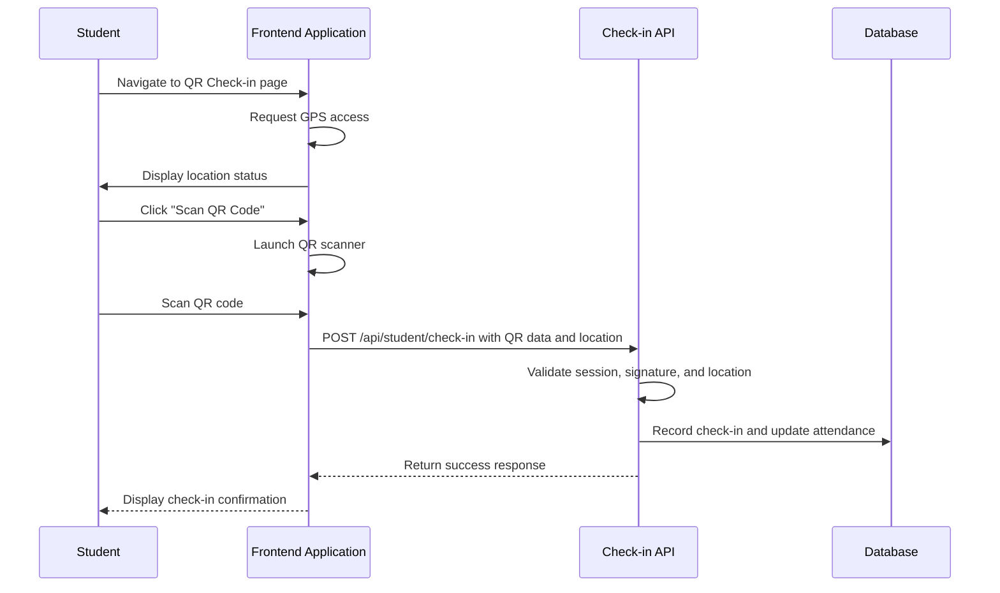
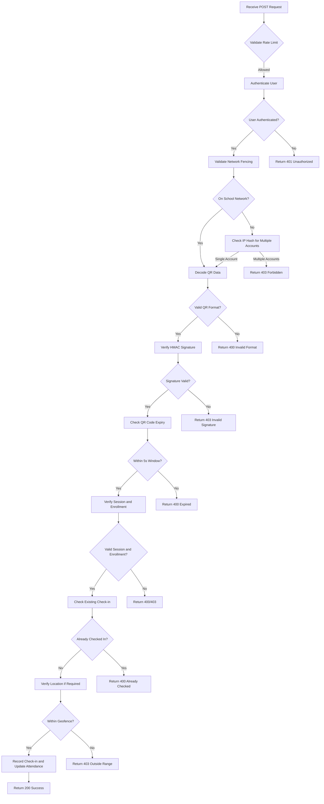
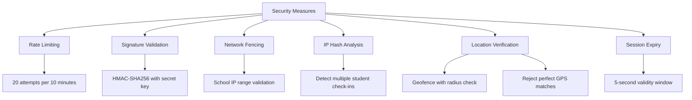

# Attendance Management

<cite>
**Referenced Files in This Document**   
- [qr-checkin/page.tsx](file://app/student/qr-checkin/page.tsx)
- [qr-scanner.tsx](file://components/qr-scanner.tsx)
- [check-in/route.ts](file://app/api/student/check-in/route.ts)
- [qr-attendance-store.ts](file://lib/qr-attendance-store.ts)
- [attendance-utils.ts](file://lib/attendance-utils.ts)
- [rate-limit.ts](file://lib/rate-limit.ts)
- [security.ts](file://lib/security.ts)
- [school-location-store.ts](file://lib/school-location-store.ts)
- [create_attendance_tables.sql](file://supabase/migrations/20251219043454_create_attendance_tables.sql)
- [qr-attendance/page.tsx](file://app/teacher/qr-attendance/page.tsx)
- [generate-qr/route.ts](file://app/api/teacher/generate-qr/route.ts)
</cite>

## Table of Contents
1. [Introduction](#introduction)
2. [User Flow for QR Check-in](#user-flow-for-qr-check-in)
3. [QR Scanner Component Implementation](#qr-scanner-component-implementation)
4. [Check-in API Endpoint](#check-in-api-endpoint)
5. [Security Measures](#security-measures)
6. [Error Handling and Troubleshooting](#error-handling-and-troubleshooting)
7. [Performance Optimization](#performance-optimization)
8. [Accessibility Considerations](#accessibility-considerations)

## Introduction
The Attendance Management system enables students to perform daily check-ins using QR codes generated by teachers. This feature combines frontend scanning capabilities with secure backend validation to ensure accurate and tamper-proof attendance recording. The system incorporates multiple layers of security, including session validation, rate limiting, and location verification, while providing a seamless user experience across devices.

## User Flow for QR Check-in
The QR check-in process begins when a student navigates to the QR Check-in page. The system first requests access to the device's GPS to verify the student's location relative to the school. Once location services are enabled, the student can initiate the QR scanner by clicking the "Scan QR Code" button. After successfully scanning the dynamically generated QR code displayed by the teacher, the system sends the encoded data along with location information to the check-in API endpoint. Upon successful validation, the attendance record is created, and the student receives confirmation of their check-in status.



**Diagram sources**
- [qr-checkin/page.tsx](file://app/student/qr-checkin/page.tsx#L38-L309)
- [check-in/route.ts](file://app/api/student/check-in/route.ts#L23-L237)

**Section sources**
- [qr-checkin/page.tsx](file://app/student/qr-checkin/page.tsx#L38-L309)

## QR Scanner Component Implementation
The QR scanner component is implemented as a reusable React component that leverages the html5-qrcode library for camera-based scanning. It is lazily loaded to optimize bundle size and includes fallback mechanisms for manual code entry. The scanner automatically detects QR codes within the camera frame and processes them through the provided callback function. Error handling is built-in to manage common issues such as camera permission denials or hardware limitations.

```mermaid
classDiagram
class QRScanner {
+onScan(data : string) : void
+onClose() : void
-scannerRef : HTMLDivElement
-html5QrCodeRef : any
-isRunningRef : boolean
-error : string | null
-scanning : boolean
+stopScanner() : Promise~void~
+handleScan(decodedText : string) : Promise~void~
+initScanner() : Promise~void~
+handleClose() : Promise~void~
+handleManualInput() : Promise~void~
}
QRScanner --> "1" "uses" html5-qrcode
```

**Diagram sources**
- [qr-scanner.tsx](file://components/qr-scanner.tsx#L1-L161)

**Section sources**
- [qr-scanner.tsx](file://components/qr-scanner.tsx#L1-L161)
- [qr-checkin/page.tsx](file://app/student/qr-checkin/page.tsx#L13)

## Check-in API Endpoint
The check-in API endpoint at `/api/student/check-in` handles the processing of QR code submissions and attendance recording. It performs comprehensive validation of the QR data, including HMAC signature verification, timestamp validation, and session status checks. The endpoint also validates the student's enrollment in the associated class and ensures they haven't already checked in. Location verification is enforced when required by the session configuration, using the Haversine formula to calculate distance from the school's coordinates.



**Diagram sources**
- [check-in/route.ts](file://app/api/student/check-in/route.ts#L23-L237)

**Section sources**
- [check-in/route.ts](file://app/api/student/check-in/route.ts#L23-L237)

## Security Measures
The attendance system implements multiple security measures to prevent abuse and ensure data integrity. Rate limiting is applied at both the check-in and QR generation endpoints to prevent brute force attacks. All QR codes contain HMAC signatures that are validated server-side to prevent tampering. The system enforces network fencing by requiring school Wi-Fi connectivity when configured, and uses IP address hashing to detect multiple account usage from the same device. Location verification includes checks for GPS spoofing by rejecting perfect coordinate matches.



**Diagram sources**
- [check-in/route.ts](file://app/api/student/check-in/route.ts#L27-L31)
- [rate-limit.ts](file://lib/rate-limit.ts#L25-L56)
- [security.ts](file://lib/security.ts#L11-L14)
- [check-in/route.ts](file://app/api/student/check-in/route.ts#L108-L114)

**Section sources**
- [check-in/route.ts](file://app/api/student/check-in/route.ts#L27-L237)
- [rate-limit.ts](file://lib/rate-limit.ts#L25-L56)
- [security.ts](file://lib/security.ts#L11-L136)

## Error Handling and Troubleshooting
The system handles various error states including invalid QR codes, network failures, and camera access issues. When a QR code scan fails, users can manually enter the attendance code as a fallback. Location-related errors provide specific guidance for enabling GPS services. Network fencing errors instruct students to connect to the school Wi-Fi. The API returns descriptive error messages that are displayed to users through toast notifications, helping them understand and resolve issues.

**Common Issues and Solutions:**
- **Camera access denied**: Users must grant camera permissions through browser settings
- **Location services disabled**: Students need to enable GPS on their devices
- **QR code expired**: The teacher must refresh the QR code, which rotates every 3 seconds
- **Not enrolled in class**: The student should contact their teacher to verify enrollment
- **Outside school area**: Students must be within the configured geofence radius
- **Network restrictions**: Students must connect to the school Wi-Fi network when required

**Section sources**
- [qr-scanner.tsx](file://components/qr-scanner.tsx#L74-L87)
- [qr-checkin/page.tsx](file://app/student/qr-checkin/page.tsx#L160-L163)
- [check-in/route.ts](file://app/api/student/check-in/route.ts#L234-L236)

## Performance Optimization
The QR check-in system incorporates several performance optimizations for mobile devices. The QR scanner component is lazily loaded to reduce initial bundle size, improving page load times. The frontend uses React's Suspense feature to provide a smooth loading experience while the scanner initializes. Location data is cached using the school-location-store to minimize repeated geolocation requests. The API endpoints are optimized with proper indexing on frequently queried fields such as session_id and student_id.

**Section sources**
- [qr-checkin/page.tsx](file://app/student/qr-checkin/page.tsx#L13)
- [school-location-store.ts](file://lib/school-location-store.ts#L44-L71)
- [create_attendance_tables.sql](file://supabase/migrations/20251219043454_create_attendance_tables.sql#L32-L34)

## Accessibility Considerations
The attendance system includes accessibility features to support visually impaired users. The QR scanner interface provides screen reader support with appropriate ARIA labels and live regions. Error messages are announced to assistive technologies, and form controls are properly labeled. The manual code entry option serves as an alternative for users who cannot use the camera-based scanner. The UI maintains sufficient color contrast and supports keyboard navigation throughout the check-in process.

**Section sources**
- [qr-attendance/page.tsx](file://app/teacher/qr-attendance/page.tsx#L24-L32)
- [qr-attendance/page.tsx](file://app/teacher/qr-attendance/page.tsx#L349-L351)
- [qr-attendance/page.tsx](file://app/teacher/qr-attendance/page.tsx#L409-L410)