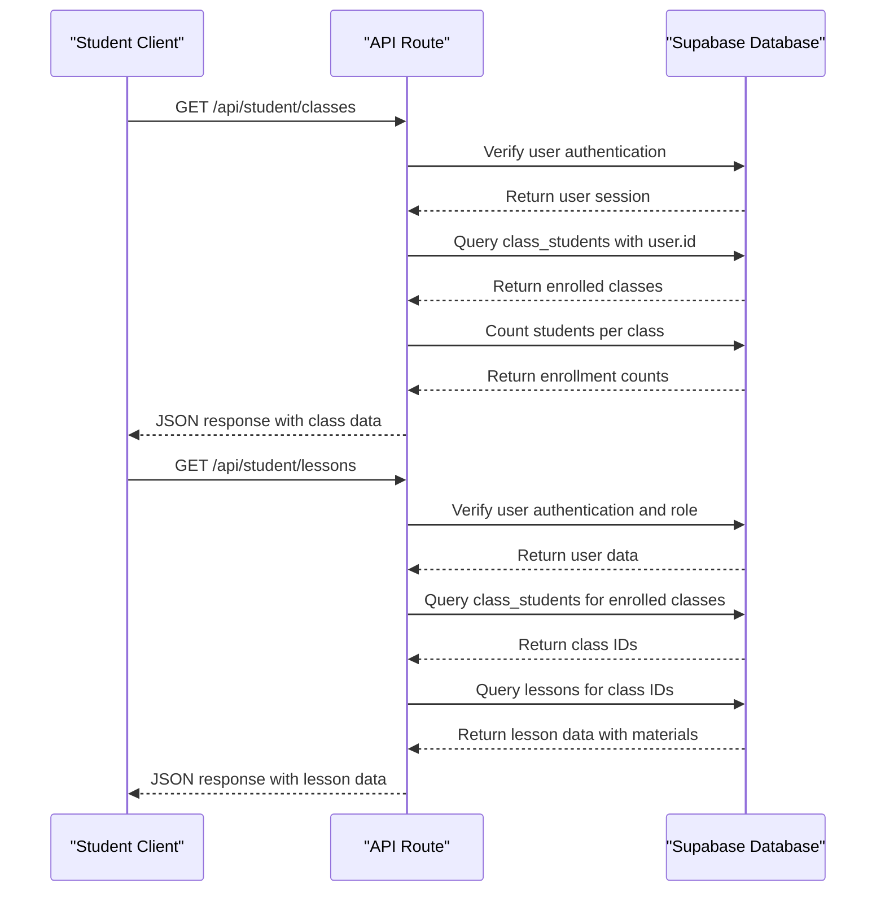
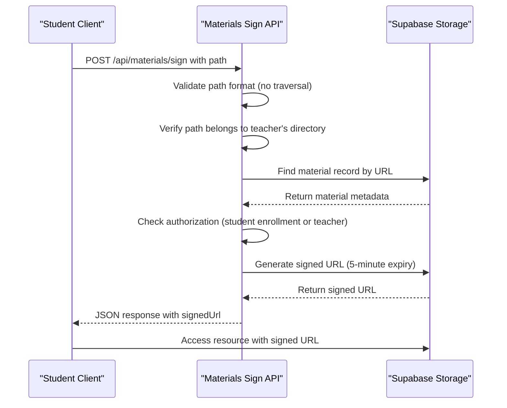
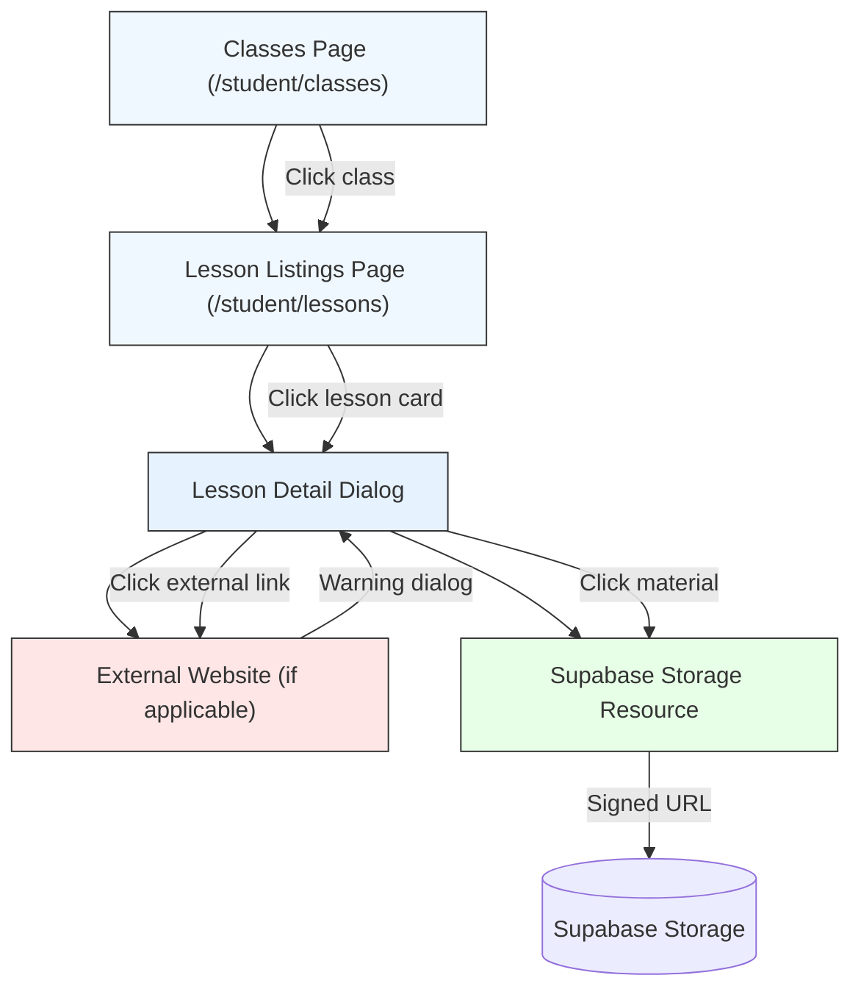
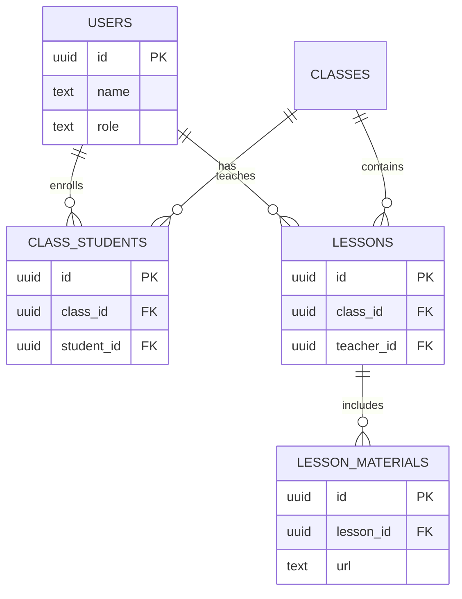

# Classes and Lessons

<cite>
**Referenced Files in This Document**   
- [classes/page.tsx](file://app/student/classes/page.tsx)
- [lessons/page.tsx](file://app/student/lessons/page.tsx)
- [route.ts](file://app/api/student/classes/route.ts)
- [route.ts](file://app/api/student/lessons/route.ts)
- [route.ts](file://app/api/materials/sign/route.ts)
- [dashboard-sidebar.tsx](file://components/dashboard-sidebar.tsx)
- [storage.ts](file://lib/supabase/storage.ts)
- [utils.ts](file://lib/utils.ts)
- [20251219043440_create_classes_table.sql](file://supabase/migrations/20251219043440_create_classes_table.sql)
- [20251219043541_create_lessons_tables.sql](file://supabase/migrations/20251219043541_create_lessons_tables.sql)
- [20251219101254_add_lesson_materials_rls_policies.sql](file://supabase/migrations/20251219101254_add_lesson_materials_rls_policies.sql)
- [20251219103038_add_class_students_rls_policies.sql](file://supabase/migrations/20251219103038_add_class_students_rls_policies.sql)
</cite>

## Table of Contents
1. [Introduction](#introduction)
2. [Class Information Structure](#class-information-structure)
3. [Lesson Content and Materials](#lesson-content-and-materials)
4. [Data Flow from Backend to Frontend](#data-flow-from-backend-to-frontend)
5. [Secure Access to Lesson Materials](#secure-access-to-lesson-materials)
6. [Navigation Patterns](#navigation-patterns)
7. [Permission Enforcement via Supabase RLS](#permission-enforcement-via-supabase-rls)
8. [Performance Considerations](#performance-considerations)
9. [Troubleshooting Common Issues](#troubleshooting-common-issues)

## Introduction
The Classes and Lessons sub-feature enables students to access their enrolled classes and associated lesson materials through a secure, role-based interface. Students can view class details such as subject, schedule, room number, teacher information, and student count. They can also access lesson content including topics, descriptions, and various learning materials like PDFs, videos, and external links. The system ensures secure access to resources through signed URLs and enforces strict permission checks using Supabase Row Level Security (RLS) policies. This documentation details the data flow, component interactions, security mechanisms, and user experience patterns for this feature.

## Class Information Structure
The class information displayed to students includes essential details about each enrolled class. The frontend retrieves this data from the `/api/student/classes` endpoint, which returns structured information including:

- **Class Name**: The name of the class (e.g., "Algebra II")
- **Subject**: Academic subject (e.g., "Mathematics")
- **Schedule**: Class meeting times
- **Room**: Physical or virtual classroom location
- **Teacher Name**: Instructor's full name
- **Teacher Avatar**: Profile image URL
- **Student Count**: Number of enrolled students

This data is presented in a card-based layout with visual indicators for teacher information and class metadata. The structure is defined in the `ClassInfo` interface in the frontend component and populated through a secure API route that verifies student enrollment.

**Section sources**
- [classes/page.tsx](file://app/student/classes/page.tsx#L12-L21)
- [route.ts](file://app/api/student/classes/route.ts#L13-L58)

## Lesson Content and Materials
Lesson content provides students with structured learning resources organized by class. Each lesson includes:

- **Title**: Descriptive name of the lesson
- **Description**: Brief overview of lesson objectives
- **Content**: Detailed instructional material (text-based)
- **Class Name**: Associated class title
- **Teacher Name**: Instructor responsible for the lesson
- **Materials**: Collection of learning resources

Learning materials are categorized by type (PDF, video, document, or external link) and include metadata such as file name, size, and access method. The frontend uses type-specific icons and action labels to differentiate material types and guide user interaction.

**Section sources**
- [lessons/page.tsx](file://app/student/lessons/page.tsx#L24-L40)
- [20251219043541_create_lessons_tables.sql](file://supabase/migrations/20251219043541_create_lessons_tables.sql#L1-L23)

## Data Flow from Backend to Frontend
The data flow for classes and lessons follows a secure client-server architecture with proper authentication and authorization checks:

**Diagram sources**
- [route.ts](file://app/api/student/classes/route.ts#L4-L65)
- [route.ts](file://app/api/student/lessons/route.ts#L4-L67)
- [classes/page.tsx](file://app/student/classes/page.tsx#L32-L54)
- [lessons/page.tsx](file://app/student/lessons/page.tsx#L63-L85)

## Secure Access to Lesson Materials
Lesson materials are securely accessed through signed URLs generated by the `/api/materials/sign` endpoint. This process ensures that only authorized users can access protected resources:

The system implements multiple security layers:
- Path traversal prevention by rejecting paths containing ".."
- Directory scope validation ensuring materials reside in teacher-specific directories
- Authorization checks verifying student enrollment or teacher ownership
- Short-lived signed URLs (5 minutes) to minimize exposure
- Client-side validation of signed URLs to prevent open redirects

**Diagram sources**
- [route.ts](file://app/api/materials/sign/route.ts#L5-L108)
- [storage.ts](file://lib/supabase/storage.ts#L98-L110)
- [utils.ts](file://lib/utils.ts#L54-L64)

**Section sources**
- [route.ts](file://app/api/materials/sign/route.ts#L43-L91)
- [lessons/page.tsx](file://app/student/lessons/page.tsx#L88-L130)

## Navigation Patterns
Students navigate between class listings and detailed lesson views through an intuitive interface:

The navigation flow begins with the student accessing their classes, then navigating to lessons, and finally viewing detailed lesson content in a modal dialog. External links trigger a security warning dialog before navigation, while storage resources are accessed through signed URLs.

**Diagram sources**
- [classes/page.tsx](file://app/student/classes/page.tsx#L73-L113)
- [lessons/page.tsx](file://app/student/lessons/page.tsx#L258-L289)
- [dashboard-sidebar.tsx](file://components/dashboard-sidebar.tsx#L76-L91)

## Permission Enforcement via Supabase RLS
The system enforces strict access controls through Supabase Row Level Security (RLS) policies, ensuring students can only access resources for which they are authorized:

Key RLS policies include:
- **Class Enrollment**: Only admins and teachers can modify class enrollments
- **Lesson Materials**: Teachers can only manage materials for their own lessons
- **Student Access**: Students can only view lessons for classes in which they are enrolled
- **Role Verification**: API routes verify user roles before returning sensitive data

These policies work in conjunction with application-level checks to provide defense in depth.

**Diagram sources**
- [20251219103038_add_class_students_rls_policies.sql](file://supabase/migrations/20251219103038_add_class_students_rls_policies.sql)
- [20251219101254_add_lesson_materials_rls_policies.sql](file://supabase/migrations/20251219101254_add_lesson_materials_rls_policies.sql)
- [20251219043440_create_classes_table.sql](file://supabase/migrations/20251219043440_create_classes_table.sql)

**Section sources**
- [route.ts](file://app/api/student/lessons/route.ts#L13-L22)
- [route.ts](file://app/api/materials/sign/route.ts#L56-L87)

## Performance Considerations
The system addresses performance challenges related to loading media-rich lesson content, particularly on mobile networks:

- **Lazy Loading**: Materials are only fetched when a lesson is viewed, not when listing lessons
- **Optimized Queries**: API routes use efficient database queries with proper indexing
- **Caching**: Browser caching of static assets and API responses where appropriate
- **Progressive Enhancement**: Loading states provide feedback during data retrieval
- **Responsive Design**: Card-based layout adapts to different screen sizes
- **Efficient Rendering**: React's virtual DOM minimizes re-renders

For media-rich content, the system opens resources in new windows to prevent navigation away from the application, and implements proper error handling for failed resource loading.

**Section sources**
- [lessons/page.tsx](file://app/student/lessons/page.tsx#L154-L163)
- [classes/page.tsx](file://app/student/classes/page.tsx#L57-L65)

## Troubleshooting Common Issues
This section addresses common issues students may encounter when accessing classes and lessons:

### Unauthorized Access to Materials
If a student receives "You may not have access" errors when trying to open materials:
- Verify enrollment in the class through the Classes page
- Check that the teacher has published the lesson and materials
- Ensure the session has not expired (try logging out and back in)
- Confirm the material has not been deleted or moved by the teacher

### Broken Resource Links
For broken links to lesson materials:
- The material may have been removed by the teacher
- The signed URL may have expired (refresh the lesson view)
- There may be network connectivity issues (check internet connection)
- The storage bucket configuration may be incorrect (contact administrator)

### Missing Lessons or Classes
If expected classes or lessons do not appear:
- Confirm enrollment status with the teacher or administrator
- Check the user role is correctly set as "student"
- Verify the class has active lessons published
- Refresh the page to reload data from the API

The system provides user-friendly error messages and toast notifications to guide students through these issues.

**Section sources**
- [lessons/page.tsx](file://app/student/lessons/page.tsx#L80-L83)
- [classes/page.tsx](file://app/student/classes/page.tsx#L50-L51)
- [route.ts](file://app/api/materials/sign/route.ts#L104-L106)