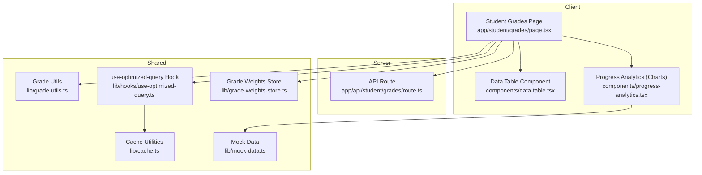
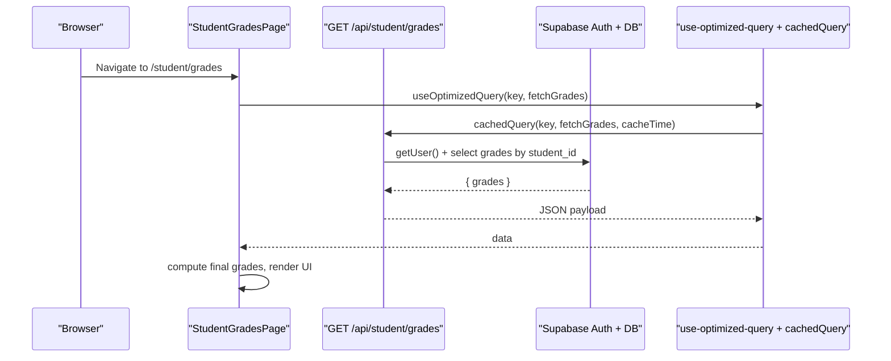
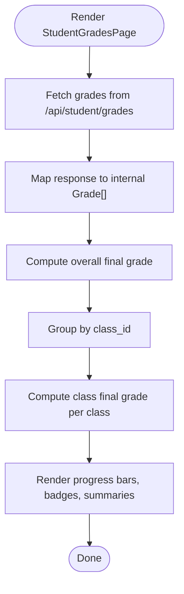
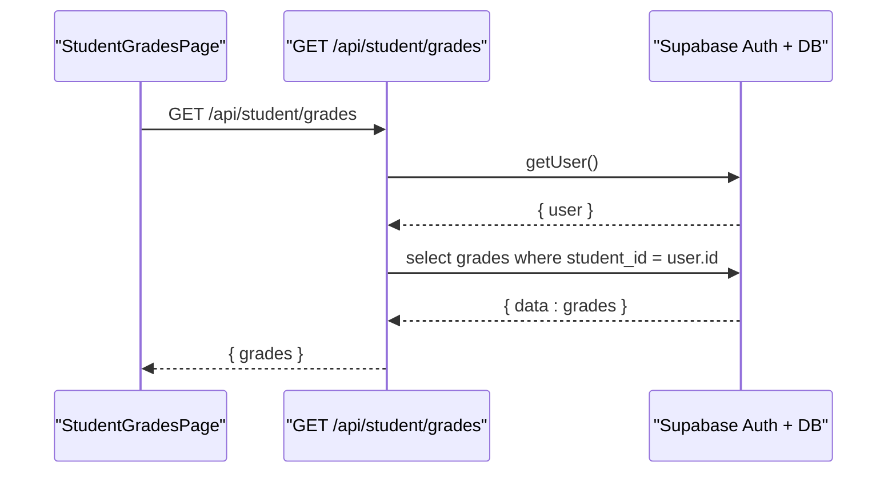
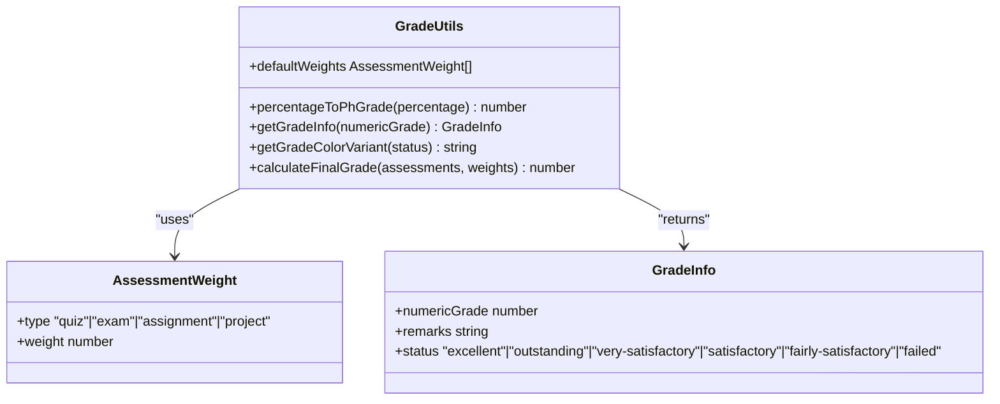
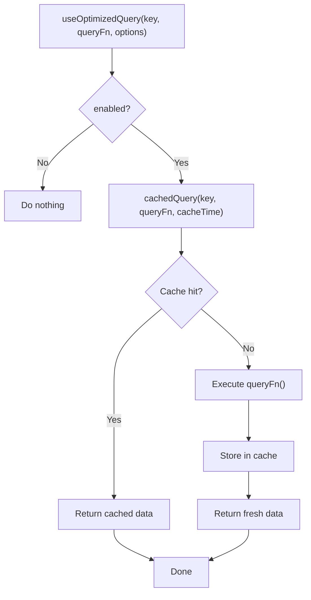
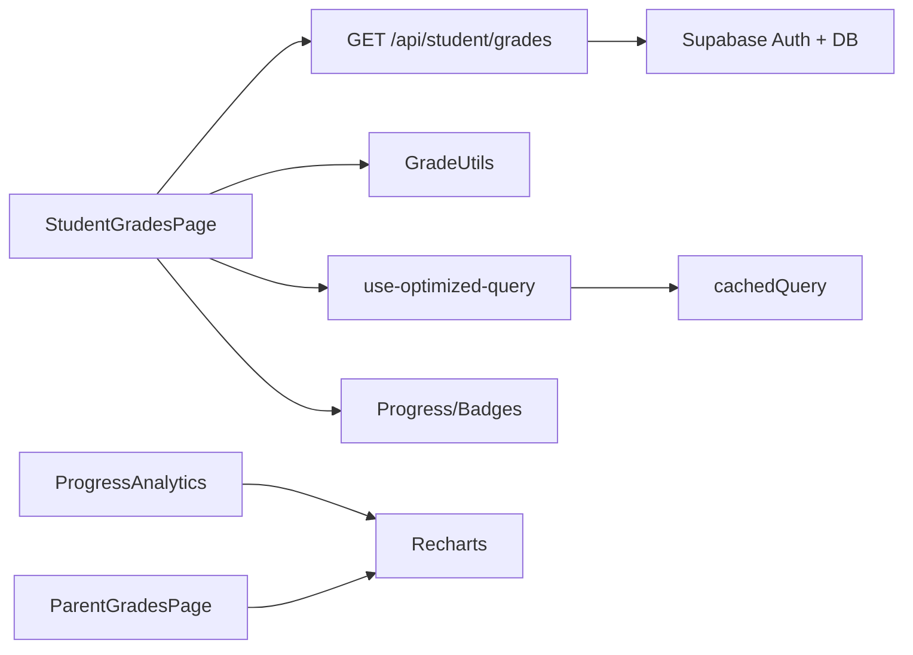

# Grade Tracking

<cite>
**Referenced Files in This Document**
- [app/student/grades/page.tsx](file://app/student/grades/page.tsx)
- [app/api/student/grades/route.ts](file://app/api/student/grades/route.ts)
- [lib/hooks/use-optimized-query.ts](file://lib/hooks/use-optimized-query.ts)
- [lib/cache.ts](file://lib/cache.ts)
- [lib/grade-utils.ts](file://lib/grade-utils.ts)
- [components/data-table.tsx](file://components/data-table.tsx)
- [components/progress-analytics.tsx](file://components/progress-analytics.tsx)
- [app/parent/grades/page.tsx](file://app/parent/grades/page.tsx)
- [lib/grade-weights-store.ts](file://lib/grade-weights-store.ts)
- [lib/mock-data.ts](file://lib/mock-data.ts)
</cite>

## Table of Contents
1. [Introduction](#introduction)
2. [Project Structure](#project-structure)
3. [Core Components](#core-components)
4. [Architecture Overview](#architecture-overview)
5. [Detailed Component Analysis](#detailed-component-analysis)
6. [Dependency Analysis](#dependency-analysis)
7. [Performance Considerations](#performance-considerations)
8. [Troubleshooting Guide](#troubleshooting-guide)
9. [Accessibility Features](#accessibility-features)
10. [Conclusion](#conclusion)

## Introduction
This document explains the Grade Tracking sub-feature for students, detailing how they view academic performance across classes and assignments. It covers the grades page implementation, data fetching from the /api/student/grades endpoint, display using reusable data table components, response data structure, visual presentation of grade calculations via progress bars and charts, caching strategies using the use-optimized-query hook, handling edge cases such as missing grades or pending teacher reviews, troubleshooting guidance, and accessibility features for screen readers.

## Project Structure
The Grade Tracking feature spans the client-side page, the server-side API route, shared utilities for grade calculations, and reusable UI components for data display and analytics.

**Diagram sources**
- [app/student/grades/page.tsx](file://app/student/grades/page.tsx#L1-L273)
- [app/api/student/grades/route.ts](file://app/api/student/grades/route.ts#L1-L40)
- [lib/grade-utils.ts](file://lib/grade-utils.ts#L1-L163)
- [lib/hooks/use-optimized-query.ts](file://lib/hooks/use-optimized-query.ts#L1-L275)
- [lib/cache.ts](file://lib/cache.ts#L1-L128)
- [components/data-table.tsx](file://components/data-table.tsx#L1-L60)
- [components/progress-analytics.tsx](file://components/progress-analytics.tsx#L1-L189)
- [lib/grade-weights-store.ts](file://lib/grade-weights-store.ts#L1-L52)
- [lib/mock-data.ts](file://lib/mock-data.ts#L1-L800)

**Section sources**
- [app/student/grades/page.tsx](file://app/student/grades/page.tsx#L1-L273)
- [app/api/student/grades/route.ts](file://app/api/student/grades/route.ts#L1-L40)

## Core Components
- Student Grades Page: Fetches grades, computes overall and class-level final grades, renders progress bars, badges, and class-wise lists.
- API Route: Securely validates the authenticated student and returns only their grades with class metadata.
- Grade Utilities: Converts percentages to Philippine grades, computes weighted final grades, and provides remarks/status.
- use-optimized-query Hook: Provides caching, deduplication, retries, and invalidation for data fetching.
- Cache Utilities: Client-side in-memory cache and server-side Next.js cache helpers.
- Data Table Component: Reusable table for structured data display.
- Progress Analytics: Charts for grade trends and subject performance (used elsewhere; helpful for comparison).
- Grade Weights Store: Manages per-class assessment weights for final grade computation.
- Mock Data: Defines the shape of grade records used across the system.

**Section sources**
- [app/student/grades/page.tsx](file://app/student/grades/page.tsx#L1-L273)
- [app/api/student/grades/route.ts](file://app/api/student/grades/route.ts#L1-L40)
- [lib/grade-utils.ts](file://lib/grade-utils.ts#L1-L163)
- [lib/hooks/use-optimized-query.ts](file://lib/hooks/use-optimized-query.ts#L1-L275)
- [lib/cache.ts](file://lib/cache.ts#L1-L128)
- [components/data-table.tsx](file://components/data-table.tsx#L1-L60)
- [components/progress-analytics.tsx](file://components/progress-analytics.tsx#L1-L189)
- [lib/grade-weights-store.ts](file://lib/grade-weights-store.ts#L1-L52)
- [lib/mock-data.ts](file://lib/mock-data.ts#L52-L630)

## Architecture Overview
The grades page follows a clean separation of concerns:
- Client fetches grades via a secure API route.
- Server enforces role checks and filters data by the authenticated student.
- Client-side utilities compute final grades and render progress bars and summaries.
- Caching reduces redundant API calls and improves responsiveness.

**Diagram sources**
- [app/student/grades/page.tsx](file://app/student/grades/page.tsx#L35-L70)
- [app/api/student/grades/route.ts](file://app/api/student/grades/route.ts#L1-L40)
- [lib/hooks/use-optimized-query.ts](file://lib/hooks/use-optimized-query.ts#L28-L124)
- [lib/cache.ts](file://lib/cache.ts#L16-L39)

## Detailed Component Analysis

### Student Grades Page
Responsibilities:
- Fetch grades for the authenticated student.
- Compute overall and per-class final grades using weighted averages.
- Render progress bars, badges, and summaries.
- Group grades by class and display per-assessment details.

Key behaviors:
- Data fetching uses a fetch call to /api/student/grades and maps the response to internal types.
- Final grade calculation aggregates by assessment type and applies default weights.
- Visual indicators include progress bars, badges with remarks, and a Philippine grading scale legend.

Edge cases handled:
- No grades recorded: displays a friendly message.
- Missing class name fallback to “Unknown”.
- Defensive checks for safe keys and prototype pollution prevention.

**Diagram sources**
- [app/student/grades/page.tsx](file://app/student/grades/page.tsx#L35-L273)
- [lib/grade-utils.ts](file://lib/grade-utils.ts#L85-L132)

**Section sources**
- [app/student/grades/page.tsx](file://app/student/grades/page.tsx#L1-L273)
- [lib/grade-utils.ts](file://lib/grade-utils.ts#L1-L163)

### API Route: /api/student/grades
Responsibilities:
- Authenticate the user and verify role is student.
- Enforce server-side filtering by student_id.
- Return grades with class metadata and order by date descending.

Security:
- Role verification prevents unauthorized access.
- Strict filter ensures only the authenticated student’s data is returned.

Response shape:
- An object containing an array of grade records with fields for id, class_id, type, score, max_score, percentage, grade, date, and class name.

**Diagram sources**
- [app/api/student/grades/route.ts](file://app/api/student/grades/route.ts#L1-L40)

**Section sources**
- [app/api/student/grades/route.ts](file://app/api/student/grades/route.ts#L1-L40)

### Grade Utilities
Responsibilities:
- Convert raw percentage to Philippine-grade scale.
- Provide remarks and status for a numeric grade.
- Compute final grade from multiple assessments with configurable weights.
- Provide default weights for quiz, exam, assignment, and project.

**Diagram sources**
- [lib/grade-utils.ts](file://lib/grade-utils.ts#L1-L163)

**Section sources**
- [lib/grade-utils.ts](file://lib/grade-utils.ts#L1-L163)

### use-optimized-query Hook and Caching
Responsibilities:
- Provide caching with TTL and deduplication.
- Retry transient network errors with exponential backoff.
- Invalidate cache entries and refetch data.
- Support paginated and infinite queries.

Caching behavior:
- Client-side cache stores query results keyed by a string with TTL.
- Server-side cache uses Next.js unstable_cache for route-level caching and revalidation tags.

**Diagram sources**
- [lib/hooks/use-optimized-query.ts](file://lib/hooks/use-optimized-query.ts#L28-L124)
- [lib/cache.ts](file://lib/cache.ts#L16-L39)

**Section sources**
- [lib/hooks/use-optimized-query.ts](file://lib/hooks/use-optimized-query.ts#L1-L275)
- [lib/cache.ts](file://lib/cache.ts#L1-L128)

### Data Table Component
Purpose:
- Provide a reusable table for displaying structured data with columns, rows, and optional row click handlers.

Usage:
- The grades page currently renders a custom list of grades per class. A data table could be used for a consolidated view if desired.

**Section sources**
- [components/data-table.tsx](file://components/data-table.tsx#L1-L60)

### Progress Analytics (Charts)
Purpose:
- Visualize grade trends over time, subject performance, and attendance distributions using charts.

While the student grades page primarily uses progress bars, the progress-analytics component demonstrates:
- Line chart for grade trends.
- Bar chart for subject performance.
- Pie chart for attendance.

These patterns can guide future enhancements to the student grades page for richer visualizations.

**Section sources**
- [components/progress-analytics.tsx](file://components/progress-analytics.tsx#L1-L189)

### Parent Grades Page (Reference)
The parent grades page illustrates:
- A line chart for grade trends.
- Subject performance cards with progress bars.
- Recent grades list.

This provides a model for how charts and progress bars can be integrated into grade pages.

**Section sources**
- [app/parent/grades/page.tsx](file://app/parent/grades/page.tsx#L1-L214)

### Grade Weights Store
Purpose:
- Manage per-class assessment weights for computing final grades.
- Persist weights locally and allow resetting to defaults.

Integration:
- The student grades page uses default weights from grade-utils. The store enables dynamic overrides per class if needed.

**Section sources**
- [lib/grade-weights-store.ts](file://lib/grade-weights-store.ts#L1-L52)
- [lib/grade-utils.ts](file://lib/grade-utils.ts#L85-L132)

### Response Data Structure
The server returns an array of grade records. Each record includes:
- id: Unique identifier
- class_id: Identifier of the class
- type: Assessment type (exam, quiz, assignment, project)
- score: Points earned
- max_score: Maximum points possible
- percentage: Raw percentage score
- grade: Philippine-grade value (computed scale)
- date: Date of the assessment
- class: Embedded class metadata (name)

Mapping in the client:
- The page maps the response to an internal Grade interface, filling class_name from the embedded class object.

**Section sources**
- [app/api/student/grades/route.ts](file://app/api/student/grades/route.ts#L24-L36)
- [app/student/grades/page.tsx](file://app/student/grades/page.tsx#L52-L64)
- [lib/mock-data.ts](file://lib/mock-data.ts#L52-L63)

## Dependency Analysis
Key dependencies and relationships:
- StudentGradesPage depends on:
  - API route for data.
  - GradeUtils for computations.
  - use-optimized-query and cache for performance.
  - Progress bars and badges for visuals.
- API route depends on:
  - Supabase auth for user identity.
  - Supabase DB for filtered grade records.
- GradeUtils depends on:
  - Default weights for final grade calculation.
- use-optimized-query depends on:
  - cachedQuery for client-side caching.
- Progress Analytics depends on:
  - Recharts for visualization.
- Parent Grades Page depends on:
  - Recharts for visualization and analytics store for mock data.

**Diagram sources**
- [app/student/grades/page.tsx](file://app/student/grades/page.tsx#L1-L273)
- [app/api/student/grades/route.ts](file://app/api/student/grades/route.ts#L1-L40)
- [lib/grade-utils.ts](file://lib/grade-utils.ts#L1-L163)
- [lib/hooks/use-optimized-query.ts](file://lib/hooks/use-optimized-query.ts#L1-L275)
- [lib/cache.ts](file://lib/cache.ts#L1-L128)
- [components/progress-analytics.tsx](file://components/progress-analytics.tsx#L1-L189)
- [app/parent/grades/page.tsx](file://app/parent/grades/page.tsx#L1-L214)

**Section sources**
- [app/student/grades/page.tsx](file://app/student/grades/page.tsx#L1-L273)
- [app/api/student/grades/route.ts](file://app/api/student/grades/route.ts#L1-L40)
- [lib/grade-utils.ts](file://lib/grade-utils.ts#L1-L163)
- [lib/hooks/use-optimized-query.ts](file://lib/hooks/use-optimized-query.ts#L1-L275)
- [lib/cache.ts](file://lib/cache.ts#L1-L128)
- [components/progress-analytics.tsx](file://components/progress-analytics.tsx#L1-L189)
- [app/parent/grades/page.tsx](file://app/parent/grades/page.tsx#L1-L214)

## Performance Considerations
- Caching:
  - Client-side cache TTL of 30 seconds minimizes redundant requests.
  - use-optimized-query deduplicates concurrent requests and retries transient failures.
- Pagination and Infinite Scrolling:
  - usePaginatedQuery and useInfiniteQuery hooks are available for large datasets.
- Server-side caching:
  - Next.js unstable_cache can be used for route-level caching and revalidation tags.
- Rendering:
  - Memoization of type breakdown avoids unnecessary recomputation.
  - Conditional rendering prevents heavy chart components from loading when not needed.

[No sources needed since this section provides general guidance]

## Troubleshooting Guide
Common issues and resolutions:
- Unauthorized Access:
  - Symptom: 401 Unauthorized on /api/student/grades.
  - Resolution: Ensure the user is authenticated and has role “student”.
- Forbidden Access:
  - Symptom: 403 Forbidden on /api/student/grades.
  - Resolution: Verify the authenticated user’s role is student.
- Network Errors:
  - Symptom: Transient failures during data fetch.
  - Resolution: use-optimized-query retries with exponential backoff; check network connectivity.
- Cache Stale Data:
  - Symptom: Outdated grades displayed.
  - Resolution: Invalidate cache via hook and refetch; adjust cacheTime as needed.
- Missing Grades:
  - Symptom: Blank or minimal grade list.
  - Resolution: Confirm the student has assessments; handle empty state gracefully.
- Pending Reviews:
  - Symptom: Some quiz attempts show pending teacher review.
  - Resolution: Display pending status and encourage checking back later.

**Section sources**
- [app/api/student/grades/route.ts](file://app/api/student/grades/route.ts#L9-L23)
- [lib/hooks/use-optimized-query.ts](file://lib/hooks/use-optimized-query.ts#L66-L87)
- [lib/cache.ts](file://lib/cache.ts#L16-L39)

## Accessibility Features
Current accessibility considerations:
- Screen Reader Support for Charts:
  - Recharts tooltips and axes can be localized and styled for readability.
  - Ensure axis labels and legends are descriptive.
  - Provide alternative text or aria-labels for chart containers when integrating charts.
- Progress Bars:
  - Progress components visually represent numeric values; pair with text labels for screen readers.
- Badges and Status:
  - Use semantic variants and readable text for status badges.
- Keyboard Navigation:
  - Ensure interactive elements (tables, selects) are keyboard accessible.
- Contrast and Text Size:
  - Maintain sufficient contrast and scalable text sizes for readability.

[No sources needed since this section provides general guidance]

## Conclusion
The Grade Tracking feature delivers a robust, secure, and performant way for students to view their academic performance. It leverages a secure API route, efficient caching, and clear visualizations using progress bars and charts. Edge cases are handled gracefully, and the architecture supports future enhancements such as per-class weights and expanded charting capabilities.