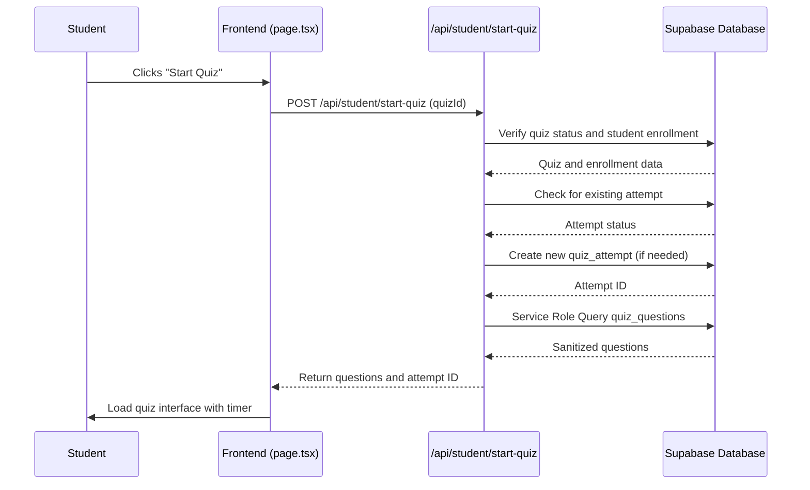
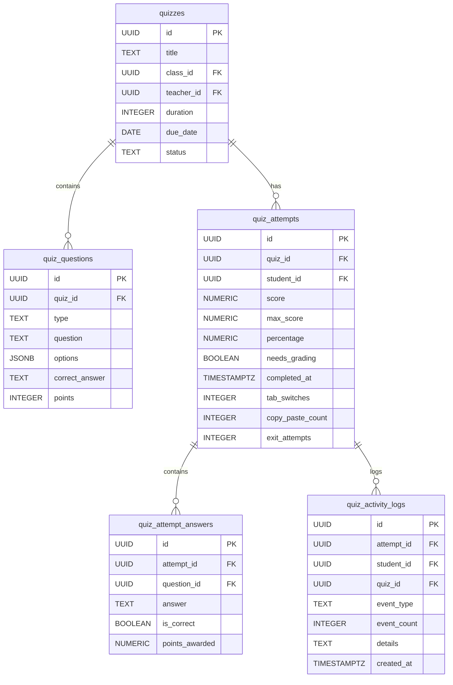

# Quiz Taking

<cite>
**Referenced Files in This Document**   
- [page.tsx](file://app/student/quizzes/page.tsx)
- [route.ts](file://app/api/student/quizzes/route.ts)
- [start-quiz/route.ts](file://app/api/student/start-quiz/route.ts)
- [submit-quiz/route.ts](file://app/api/student/submit-quiz/route.ts)
- [20251219043525_create_quizzes_tables.sql](file://supabase/migrations/20251219043525_create_quizzes_tables.sql)
- [20251219105024_create_quiz_attempt_answers.sql](file://supabase/migrations/20251219105024_create_quiz_attempt_answers.sql)
- [20251219112310_create_quiz_activity_logs.sql](file://supabase/migrations/20251219112310_create_quiz_activity_logs.sql)
- [zoom-meeting-card.tsx](file://components/zoom-meeting-card.tsx)
- [zoom-meeting-dialog.tsx](file://components/zoom-meeting-dialog.tsx)
- [zoom-meeting-room.tsx](file://components/zoom-meeting-room.tsx)
- [constants.ts](file://lib/zoom/constants.ts)
</cite>

## Table of Contents
1. [Introduction](#introduction)
2. [Quiz Listing and Availability](#quiz-listing-and-availability)
3. [Starting a Quiz Session](#starting-a-quiz-session)
4. [Quiz Execution and State Management](#quiz-execution-and-state-management)
5. [Secure Question Rendering and Anti-Tampering](#secure-question-rendering-and-anti-tampering)
6. [Quiz Submission and Grading](#quiz-submission-and-grading)
7. [Proctoring and Zoom Integration](#proctoring-and-zoom-integration)
8. [Session Timeouts and Network Recovery](#session-timeouts-and-network-recovery)
9. [Performance Optimization for Low-End Devices](#performance-optimization-for-low-end-devices)
10. [Conclusion](#conclusion)

## Introduction

The Quiz Taking sub-feature enables students to access, attempt, and submit online quizzes within the school management system. This documentation details the complete workflow from viewing available quizzes to final submission, including security measures, state management, integration with proctoring tools like Zoom, and handling of edge cases such as network interruptions. The system is designed to ensure academic integrity through secure question delivery, time enforcement, and activity monitoring.

## Quiz Listing and Availability

Students access available quizzes through the `/student/quizzes` interface, which displays a list of quizzes from classes they are enrolled in. The frontend component `app/student/quizzes/page.tsx` fetches this data via the `/api/student/quizzes` endpoint. Only quizzes with a "published" status are shown, and each quiz card displays metadata such as title, class name, duration, due date, and completion status.

Quizzes are filtered based on student enrollment using the `class_students` table, ensuring students only see quizzes for their enrolled classes. Past-due quizzes are visually marked, and completed quizzes display a "Completed" badge with submission timestamp.

**Section sources**
- [page.tsx](file://app/student/quizzes/page.tsx#L54-L577)
- [route.ts](file://app/api/student/quizzes/route.ts#L4-L42)

## Starting a Quiz Session

To begin a quiz, students click the "Start Quiz" button, which triggers a POST request to the `/api/student/start-quiz` endpoint. This endpoint performs several critical security and validation checks:

1. **Authentication**: Verifies the student is logged in.
2. **Rate Limiting**: Prevents abuse with a limit of 5 attempts per 10 minutes per IP.
3. **Quiz Availability**: Confirms the quiz exists and is in "published" status.
4. **Enrollment Verification**: Ensures the student is enrolled in the associated class to prevent IDOR (Insecure Direct Object Reference).
5. **Attempt Validation**: Checks if the student has already submitted the quiz.

If all checks pass and no active attempt exists, a new `quiz_attempt` record is created. The system then uses the Supabase Service Role key to bypass Row Level Security (RLS) and retrieve the quiz questions from the `quiz_questions` table. This ensures questions are never exposed through client-side queries.

The frontend receives the questions and initializes the quiz session, setting the timer based on the quiz duration and resetting client-side activity tracking.

**Diagram sources**
- [start-quiz/route.ts](file://app/api/student/start-quiz/route.ts#L7-L118)
- [page.tsx](file://app/student/quizzes/page.tsx#L171-L212)

## Quiz Execution and State Management

During quiz execution, the system maintains state on both client and server sides. The client manages the current question index, selected answers, and a visual countdown timer. The timer is synchronized with server-side time to prevent manipulation.

The quiz interface enforces sequential navigation, requiring students to answer each question before proceeding (except for essay/identification types). The "Next" button is disabled until an answer is selected. A confirmation dialog prevents accidental exit, and the system tracks advisory client-side events such as tab switching and copy-paste actions using `useRef`.

Server-side, the `quiz_attempts` table records the `created_at` timestamp when the attempt begins. This timestamp is critical for validating submission timing, as the server calculates elapsed time independently of the client's timer.

**Section sources**
- [page.tsx](file://app/student/quizzes/page.tsx#L58-L130)
- [20251219043525_create_quizzes_tables.sql](file://supabase/migrations/20251219043525_create_quizzes_tables.sql#L35-L43)

## Secure Question Rendering and Anti-Tampering

The system employs multiple layers of security to prevent client-side tampering and unauthorized access to quiz content:

1. **Row Level Security (RLS)**: The `quiz_questions` table has RLS enabled with policies that restrict access to teachers and admins only. Students cannot query this table directly, even with authenticated tokens.
2. **Service Role Access**: Questions are fetched server-side using the Supabase Service Role key, which bypasses RLS. This ensures questions are only delivered through the controlled `/start-quiz` API.
3. **Input Sanitization**: Questions are sanitized before being sent to the client, removing any potentially executable content.
4. **Activity Monitoring**: Client-side event listeners track tab switches, copy, paste, and right-click events. These are advisory and logged for teacher review but do not auto-flag submissions.

The database schema explicitly prevents direct student access to questions, and the API enforces that questions are only available during an active attempt.

**Diagram sources**
- [20251219043525_create_quizzes_tables.sql](file://supabase/migrations/20251219043525_create_quizzes_tables.sql)
- [20251219105024_create_quiz_attempt_answers.sql](file://supabase/migrations/20251219105024_create_quiz_attempt_answers.sql)
- [20251219112310_create_quiz_activity_logs.sql](file://supabase/migrations/20251219112310_create_quiz_activity_logs.sql)

## Quiz Submission and Grading

When a student submits a quiz, either manually or via timer expiration, the frontend sends answers to `/api/student/submit-quiz`. This endpoint performs rigorous validation:

1. **Rate Limiting**: Limits submissions to 3 per minute per student.
2. **Attempt Validation**: Confirms the attempt exists and hasn't been completed.
3. **Time Validation**: Compares current time with the attempt's `created_at` timestamp plus quiz duration. Submissions beyond the time limit plus a 2-minute buffer are flagged but still accepted to accommodate network latency.
4. **Grading**: Automatically grades multiple-choice, true-false, and identification questions by comparing answers to the `correct_answer` field. Essay questions are marked as needing manual grading.
5. **Atomic Update**: Uses a PostgreSQL RPC function `submit_quiz_attempt` to atomically update the attempt record and prevent race conditions.

After successful submission, graded answers are inserted into `quiz_attempt_answers`. The response includes the score, max score, percentage, and a flag indicating if manual grading is required.

**Section sources**
- [submit-quiz/route.ts](file://app/api/student/submit-quiz/route.ts#L5-L164)
- [20251219105024_create_quiz_attempt_answers.sql](file://supabase/migrations/20251219105024_create_quiz_attempt_answers.sql#L1-L13)

## Proctoring and Zoom Integration

For supervised exams, the system integrates with Zoom to provide proctoring capabilities. While quiz taking and Zoom meetings are separate features, they can be coordinated for live-proctored exams. The `zoom-meeting-card.tsx` and `zoom-meeting-room.tsx` components allow students to join scheduled meetings directly from the platform.

Key integration features include:
- **Domain Restriction**: Only users with `@r1.deped.gov.ph` email addresses can join class meetings, enforced by `lib/zoom/constants.ts`.
- **In-Meeting Proctoring**: Teachers can monitor students via video, use waiting rooms, and control participant permissions.
- **Attendance Tracking**: Meeting attendance is automatically recorded and linked to student profiles.

Although Zoom is not embedded within the quiz interface itself, teachers can schedule a Zoom meeting for the same time as a quiz and require students to join both systems simultaneously for proctoring.

**Section sources**
- [zoom-meeting-card.tsx](file://components/zoom-meeting-card.tsx#L71-L96)
- [zoom-meeting-room.tsx](file://components/zoom-meeting-room.tsx#L35-L57)
- [constants.ts](file://lib/zoom/constants.ts#L6)

## Session Timeouts and Network Recovery

The system handles session timeouts and network issues through multiple mechanisms:

1. **Absolute Session Timeout**: Server-side JWT includes a `session_start` timestamp. The `use-session-timeout` hook checks this against the absolute timeout (e.g., 8 hours) and logs out the user if exceeded.
2. **Inactivity Timeout**: Client-side tracking logs user activity (mouse, keyboard, focus). After a period of inactivity (e.g., 15 minutes), a warning is shown, and the session is terminated if not extended.
3. **Quiz Time Enforcement**: The server validates submission time against the attempt start time, not the client's timer. This prevents students from bypassing time limits by manipulating the client.
4. **Network Resilience**: The submission endpoint is designed to be idempotent. If a network interruption occurs during submission, the student can retry. The server checks for existing completed attempts to prevent duplicate submissions.

In case of a timeout during a quiz, the student is redirected to the login page. Upon re-authentication, they will find the quiz already submitted if the time had expired, or they may need to restart if the attempt was invalidated.

**Section sources**
- [use-session-timeout.ts](file://lib/hooks/use-session-timeout.ts#L44-L175)
- [submit-quiz/route.ts](file://app/api/student/submit-quiz/route.ts#L61-L76)

## Performance Optimization for Low-End Devices

The quiz interface is optimized for performance on low-end devices through several strategies:

1. **Efficient Rendering**: The UI uses React's `useState` and `useRef` for minimal re-renders. Question navigation updates only the current question view.
2. **Conditional Loading**: Quiz questions are only fetched when the quiz starts, reducing initial page load.
3. **Lightweight Components**: UI components from `@/components/ui` are optimized for performance and accessibility.
4. **Progressive Enhancement**: The core quiz functionality works without JavaScript, but enhanced interactions (like real-time timers) are added for capable devices.
5. **Responsive Design**: The interface adapts to different screen sizes, ensuring usability on mobile devices.

The system avoids heavy libraries and uses native browser features where possible, ensuring smooth operation even on devices with limited processing power.

**Section sources**
- [page.tsx](file://app/student/quizzes/page.tsx#L388-L508)
- [components/ui](file://components/ui)

## Conclusion

The Quiz Taking sub-feature provides a secure, reliable, and user-friendly experience for students to complete online assessments. By combining client-side interactivity with server-side validation and security, the system ensures academic integrity while accommodating real-world challenges like network instability and device limitations. Integration with Zoom enables proctored exams, and comprehensive logging supports post-exam review. The architecture prioritizes security through RLS, service role access, and time validation, making it robust against tampering and abuse.