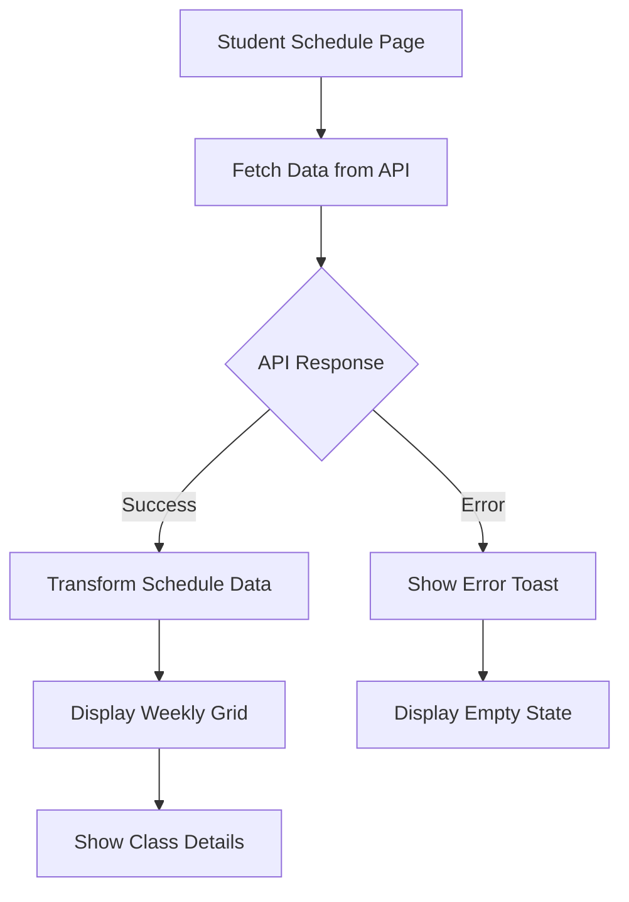
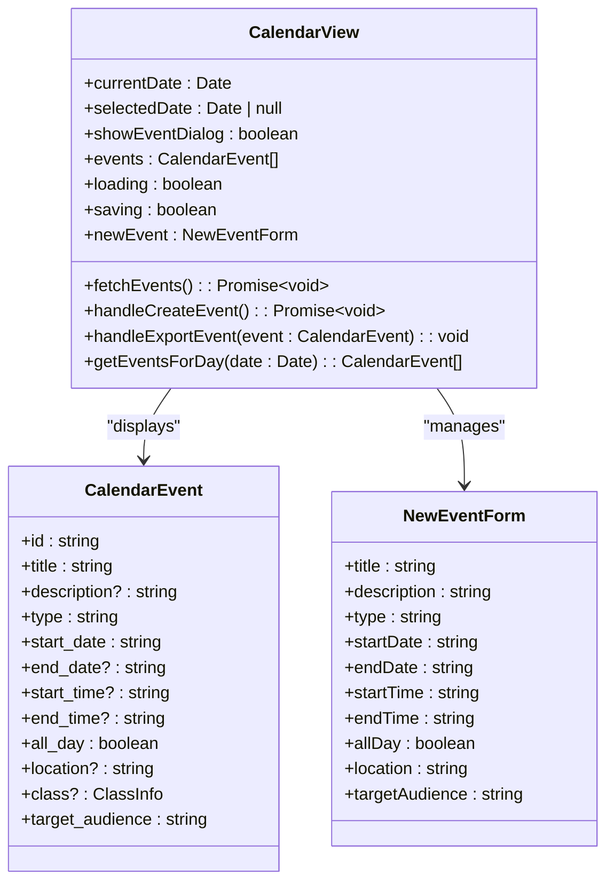
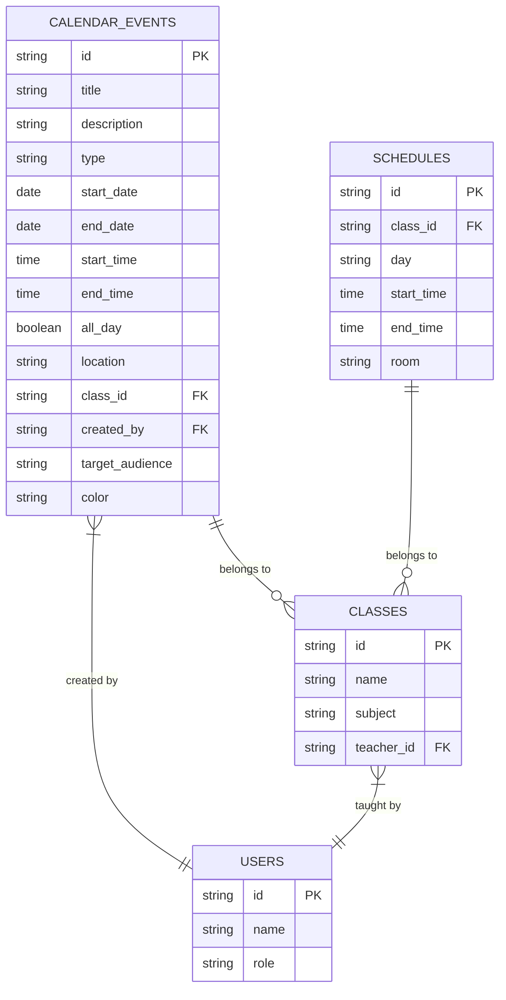
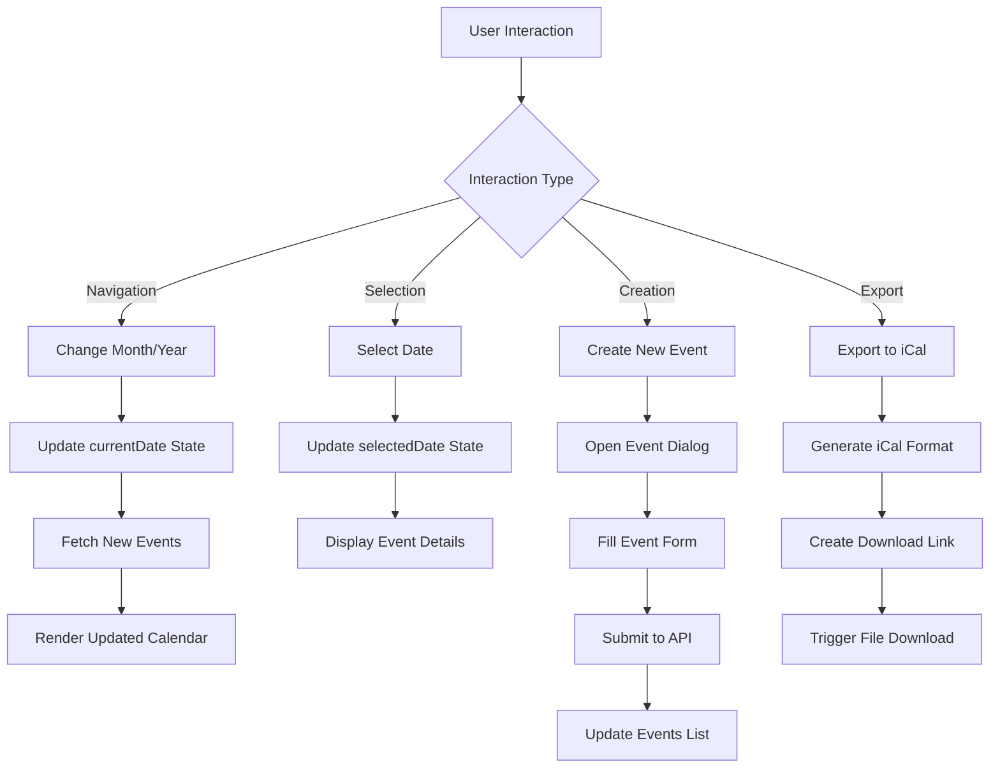
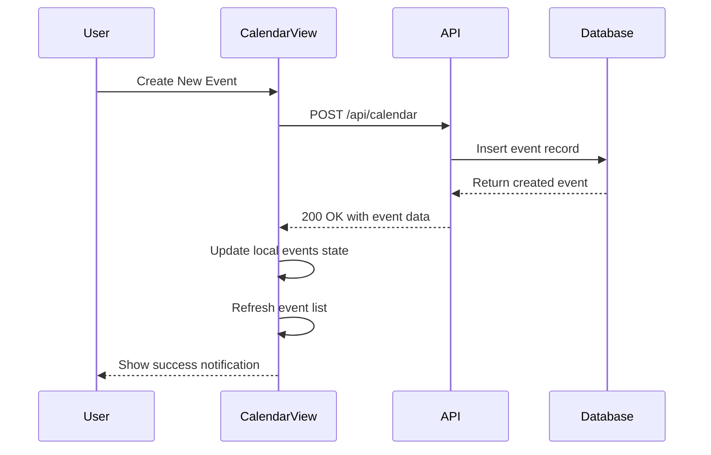

# Schedule Management

<cite>
**Referenced Files in This Document**   
- [app/student/schedule/page.tsx](file://app/student/schedule/page.tsx)
- [components/calendar-view.tsx](file://components/calendar-view.tsx)
- [app/api/student/schedule/route.ts](file://app/api/student/schedule/route.ts)
- [app/api/calendar/route.ts](file://app/api/calendar/route.ts)
- [lib/calendar-store.ts](file://lib/calendar-store.ts)
- [supabase/migrations/20251219043556_create_schedule_table.sql](file://supabase/migrations/20251219043556_create_schedule_table.sql)
- [supabase/migrations/20260105000002_create_calendar_events_table.sql](file://supabase/migrations/20260105000002_create_calendar_events_table.sql)
</cite>

## Table of Contents
1. [Introduction](#introduction)
2. [Schedule Page Implementation](#schedule-page-implementation)
3. [Calendar View Component](#calendar-view-component)
4. [Data Format and Structure](#data-format-and-structure)
5. [Time Zone Handling](#time-zone-handling)
6. [Interactive Features](#interactive-features)
7. [iCal Export Functionality](#ical-export-functionality)
8. [Common Issues and Solutions](#common-issues-and-solutions)
9. [Data Consistency and Real-time Updates](#data-consistency-and-real-time-updates)
10. [Accessibility Features](#accessibility-features)
11. [Database Schema](#database-schema)

## Introduction
The Schedule Management sub-feature enables students to view their class timetables, lessons, and calendar events through an intuitive interface. This documentation details the implementation of the schedule page using the calendar-view component and its integration with the /api/student/schedule endpoint. The system provides comprehensive scheduling capabilities including event filtering, multiple view modes, and iCal export functionality while maintaining data consistency and accessibility standards.

**Section sources**
- [app/student/schedule/page.tsx](file://app/student/schedule/page.tsx)
- [components/calendar-view.tsx](file://components/calendar-view.tsx)

## Schedule Page Implementation
The student schedule page is implemented as a React component that fetches and displays class schedule data from the backend API. The implementation uses client-side rendering with React's useState and useEffect hooks to manage component state and lifecycle.

The page structure consists of a weekly grid layout with cards for each day of the week (Monday through Friday), displaying scheduled classes in chronological order. Each class entry shows essential information including time, class name, teacher name, subject, and room location. The component also includes a summary section that provides statistics about the student's weekly schedule.

Data is fetched from the /api/student/schedule endpoint when the component mounts, with error handling and loading states implemented to ensure a smooth user experience. The response data is transformed to include proper formatting for display purposes, such as converting 24-hour time format to 12-hour format with AM/PM indicators.

**Diagram sources**
- [app/student/schedule/page.tsx](file://app/student/schedule/page.tsx)

**Section sources**
- [app/student/schedule/page.tsx](file://app/student/schedule/page.tsx)

## Calendar View Component
The calendar-view component provides a comprehensive calendar interface for viewing and managing events. Implemented as a React component with TypeScript, it supports month, week, and day views with interactive features for event management.

The component maintains several states including current date, selected date, event list, and loading status. It uses the date-fns library for date manipulation and formatting operations. The calendar displays a monthly grid with events shown as colored blocks, with different colors representing different event types (class, quiz, assignment, exam, holiday, meeting, other).

Users can navigate between months using arrow buttons, jump to the current date with a "Today" button, and create new events through a modal dialog. When a date is selected, the component displays detailed information about events on that day in a sidebar panel. The interface is responsive and adapts to different screen sizes.

**Diagram sources**
- [components/calendar-view.tsx](file://components/calendar-view.tsx)

**Section sources**
- [components/calendar-view.tsx](file://components/calendar-view.tsx)

## Data Format and Structure
The schedule and calendar systems use well-defined data structures to represent events and schedule information. The primary data format for calendar events includes essential fields for event management and display.

Calendar events contain the following properties:
- **id**: Unique identifier for the event
- **title**: Event title/name
- **description**: Optional detailed description
- **type**: Event category (class, quiz, assignment, exam, holiday, meeting, other)
- **start_date** and **end_date**: Date range for the event
- **start_time** and **end_time**: Time range for the event
- **all_day**: Boolean indicating if the event spans the entire day
- **location**: Physical or virtual location of the event
- **class**: Reference to associated class (if applicable)
- **target_audience**: Visibility scope (all, students, teachers, class, personal)

For class schedules, the data structure includes:
- **id**: Schedule entry identifier
- **day**: Day of the week (Monday-Friday)
- **start_time** and **end_time**: Class time in 24-hour format
- **room**: Classroom location
- **class_name**: Name of the class
- **subject**: Subject area
- **teacher_name**: Instructor name

The system supports recurrence rules through the combination of start/end dates and the ability to create repeating events. Location details are stored as text fields that can accommodate both physical rooms and virtual meeting links.

**Diagram sources**
- [components/calendar-view.tsx](file://components/calendar-view.tsx)
- [lib/calendar-store.ts](file://lib/calendar-store.ts)
- [supabase/migrations/20260105000002_create_calendar_events_table.sql)
- [supabase/migrations/20251219043556_create_schedule_table.sql]

**Section sources**
- [components/calendar-view.tsx](file://components/calendar-view.tsx)
- [lib/calendar-store.ts](file://lib/calendar-store.ts)

## Time Zone Handling
The system manages time zone considerations using the date-fns utilities library, which provides robust date and time manipulation functions. All dates and times are stored in UTC format in the database to ensure consistency across different time zones.

When displaying dates and times to users, the system automatically converts UTC timestamps to the user's local time zone based on their browser settings. The date-fns format function is used to present dates in a readable format, while the component handles time zone conversion implicitly through JavaScript's Date object.

For event creation, users input dates and times in their local time zone, which are then converted to UTC before being sent to the server. This ensures that events are stored consistently regardless of the user's location. The iCal export functionality also handles time zone conversion by appending the 'Z' suffix to indicate UTC time in the exported file.

The system does not currently support explicit time zone selection, relying instead on the browser's automatic time zone detection. This approach simplifies the user interface while maintaining accurate time representation for most use cases.

**Section sources**
- [components/calendar-view.tsx](file://components/calendar-view.tsx)
- [lib/calendar-store.ts](file://lib/calendar-store.ts)

## Interactive Features
The schedule management system provides several interactive features to enhance user experience and productivity. These features include event filtering, multiple view modes, and direct event manipulation capabilities.

The calendar component supports three primary view modes:
- **Month view**: Displays a grid of all days in the current month with abbreviated event information
- **Day view**: Shows detailed information about events on a specific day (accessed by clicking on a date)
- **Week view**: Not explicitly implemented but can be derived from the month view by focusing on a single week

Event filtering is implemented through the target_audience field, which determines event visibility based on user roles and permissions. The system automatically filters events to show only those relevant to the current user, with options to view personal events, class-specific events, or all events depending on user permissions.

Users can interact with the calendar by:
- Navigating between months using arrow buttons
- Jumping to the current date with the "Today" button
- Selecting a specific date to view detailed event information
- Creating new events through a modal dialog form
- Exporting events to iCal format for external calendar integration

The interface provides visual feedback for user interactions, including hover effects on calendar days and selection indicators for the currently selected date.

**Diagram sources**
- [components/calendar-view.tsx](file://components/calendar-view.tsx)

**Section sources**
- [components/calendar-view.tsx](file://components/calendar-view.tsx)

## iCal Export Functionality
The system includes built-in iCal export capabilities that allow users to download calendar events in the standard iCalendar (.ics) format for import into external calendar applications. This feature is implemented in the calendar-view component through the handleExportEvent function.

When a user clicks the export button on an event, the system generates a properly formatted iCalendar file using the following process:
1. Create the iCalendar header with version and product ID
2. Format the event start and end times in UTC format with proper timezone indication
3. Include essential event properties (UID, DTSTAMP, DTSTART, DTEND, SUMMARY)
4. Add optional properties (DESCRIPTION, LOCATION) if available
5. Close the event and calendar blocks

The formatICalDate utility function handles the conversion of local dates and times to UTC format required by the iCalendar specification. It parses the input date string, applies the time components if present, and formats the result as an ISO string with timezone designator ('Z').

The generated file is downloaded with a filename derived from the event title, with spaces replaced by underscores to ensure compatibility across different operating systems. The download is triggered programmatically using the Blob API and URL.createObjectURL method, providing a seamless user experience without requiring page navigation.

**Section sources**
- [components/calendar-view.tsx](file://components/calendar-view.tsx)
- [lib/calendar-store.ts](file://lib/calendar-store.ts)

## Common Issues and Solutions
The schedule management system addresses several common issues related to event management and display. These solutions ensure data integrity and improve user experience.

**Overlapping events**: When multiple events occur on the same day, the calendar displays up to two events directly on the calendar grid, with additional events indicated by a "+N more" counter. This prevents clutter while informing users of additional events. Users can click on the date to view all events in the detailed sidebar.

**Missing classes**: If a student has no scheduled classes for a particular day, the system displays a clear "No classes" message. If the student has no classes at all, the API returns an empty schedule array, which is handled gracefully by the UI.

**Data loading issues**: The system implements proper error handling with user-friendly toast notifications when API requests fail. Loading states are displayed during data fetching to provide feedback on system status.

**Event visibility**: The system enforces proper access control through the target_audience field and server-side filtering. Students only see events intended for them, while teachers and administrators have appropriate visibility based on their roles.

**Time conflicts**: While the system does not currently prevent scheduling conflicts, it provides clear visual representation of overlapping events, allowing users to identify potential conflicts in their schedule.

**Section sources**
- [app/student/schedule/page.tsx](file://app/student/schedule/page.tsx)
- [components/calendar-view.tsx](file://components/calendar-view.tsx)
- [app/api/student/schedule/route.ts](file://app/api/student/schedule/route.ts)
- [app/api/calendar/route.ts](file://app/api/calendar/route.ts)

## Data Consistency and Real-time Updates
The system maintains data consistency through a combination of client-side state management and server-side validation. The calendar-store in the lib directory provides a centralized store for calendar events using Zustand, a lightweight state management solution.

When events are created, updated, or deleted, the system follows a consistent pattern:
1. Send the request to the server API
2. On success, update the local state to reflect the change
3. Refresh the event list if necessary

This approach ensures that the UI remains responsive while maintaining data integrity. The fetchEvents function is called after event creation to ensure the calendar displays the most current data.

The API endpoints implement proper validation and error handling to prevent invalid data from being stored. The /api/calendar endpoint filters events based on user role and permissions, ensuring that users only access events they are authorized to view.

Database-level constraints and row-level security policies further enhance data consistency and security. The Supabase RLS policies ensure that users can only modify events they created, while administrators have appropriate access for management purposes.

**Diagram sources**
- [components/calendar-view.tsx](file://components/calendar-view.tsx)
- [app/api/calendar/route.ts](file://app/api/calendar/route.ts)

**Section sources**
- [components/calendar-view.tsx](file://components/calendar-view.tsx)
- [lib/calendar-store.ts](file://lib/calendar-store.ts)
- [app/api/calendar/route.ts](file://app/api/calendar/route.ts)

## Accessibility Features
The schedule management interface incorporates several accessibility features to ensure usability for all students, including those with disabilities.

Keyboard navigation is supported throughout the calendar interface:
- Users can navigate between calendar days using arrow keys
- The Enter or Space key selects a date to view its events
- Tab navigation moves between interactive elements (buttons, form fields, links)
- Modal dialogs trap focus and can be closed with the Escape key

Screen reader compatibility is achieved through proper semantic HTML and ARIA attributes:
- Calendar days are implemented as buttons with appropriate roles
- Event colors are supplemented with text labels to convey information to visually impaired users
- Dynamic content updates are announced to screen readers through live regions
- Form fields have proper labels and error messages

Visual accessibility features include:
- Sufficient color contrast between text and background
- Clear visual indicators for selected and current dates
- Responsive design that adapts to different screen sizes and zoom levels
- Descriptive tooltips for interactive elements

The interface avoids relying solely on color to convey information, using text labels and icons to supplement color coding. Event types are displayed as text badges in addition to their color-coded backgrounds.

**Section sources**
- [components/calendar-view.tsx](file://components/calendar-view.tsx)

## Database Schema
The schedule management system relies on two primary database tables to store schedule and calendar information: schedules and calendar_events.

The **schedules** table stores recurring class schedules with the following structure:
- id: UUID primary key
- class_id: Foreign key referencing the classes table
- day: Text field constrained to days of the week (Monday-Sunday)
- start_time and end_time: Time fields for class duration
- room: Text field for classroom location
- Row-level security enabled for access control

The **calendar_events** table stores individual calendar events with more flexible scheduling options:
- id: UUID primary key
- title, description: Event details
- type: Categorical field for event type with constrained values
- start_date, end_date: Date range for the event
- start_time, end_time: Time range for the event
- all_day: Boolean flag for full-day events
- location: Event location
- class_id: Optional foreign key to associate with a specific class
- created_by: Foreign key to the users table
- target_audience: Visibility scope with constrained values
- color: Optional custom color
- created_at, updated_at: Timestamps for record management

Both tables have appropriate indexes to optimize query performance, particularly on date fields and foreign key relationships. Row-level security policies ensure that users can only access data they are authorized to view, with different policies for students, teachers, and administrators.

**Section sources**
- [supabase/migrations/20251219043556_create_schedule_table.sql](file://supabase/migrations/20251219043556_create_schedule_table.sql)
- [supabase/migrations/20260105000002_create_calendar_events_table.sql](file://supabase/migrations/20260105000002_create_calendar_events_table.sql)